# Лекция 369

---

## [00:00:00]

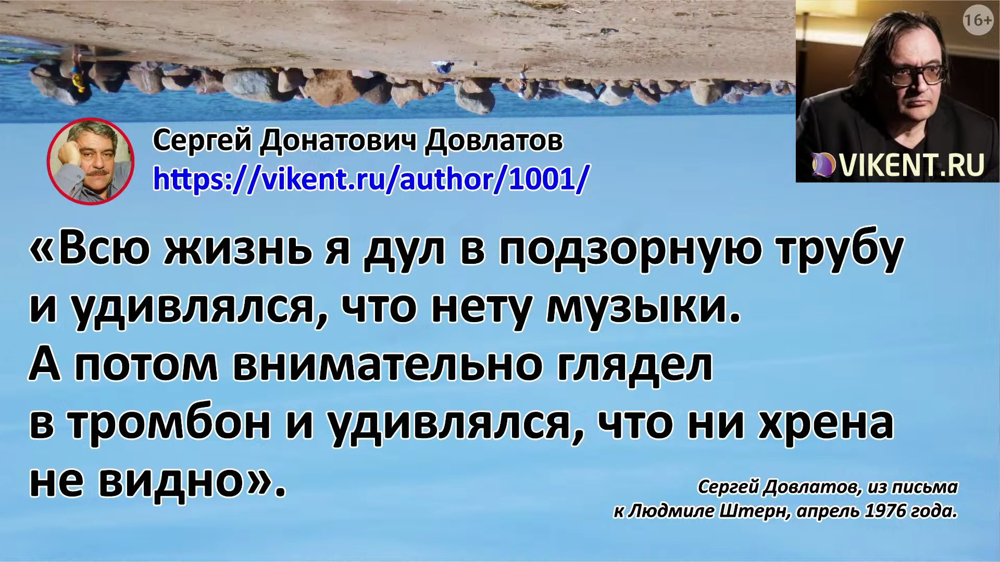

Добрый вечер, уважаемые коллеги. Понятная аварийная оговорка, что может быть перебои там с интернетом и так далее, и так далее. Вот мы будем продолжать, мы пишем, ну и тогда вы изучите, вероятно, в понедельник, то есть запись, которую мы сделаем. Ну вот мы начинаем новый спецкурс. какие-то куски этого спескурса неоднократно проговаривались, но учитывая, что масса коллег, они потихонечку, потихонечку подбираются к своим разработкам, то есть нужно прочитать его в таком, ну, что ли, цельном виде. Значит, мы почитали эпиграф. Надеюсь, что сегодня к вечеру станет абсолютно ясно, почему он такой, а не иной. Ну и давайте посмотрим наши правила.

---

## [00:01:00]

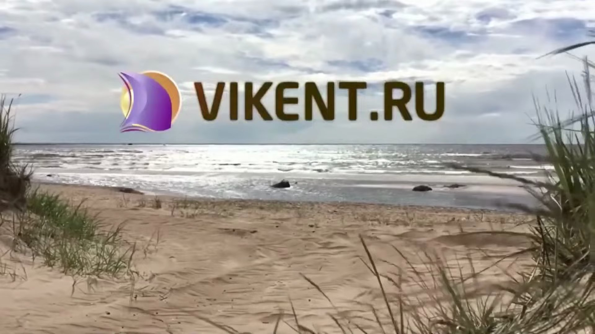

---

## [00:01:15]

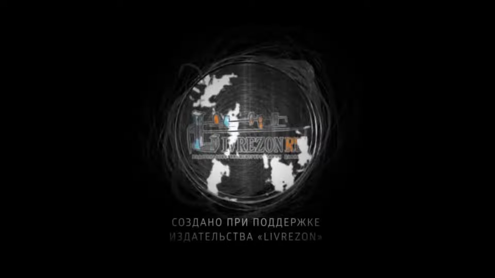

[музыка] [аплодисменты] [аплодисменты] Данный курс читается в рамках проекта Викен. Нт, который является крупнейшим порталом Европы по изучению творческих личностей и творческих коллективов.

---

## [00:01:30]

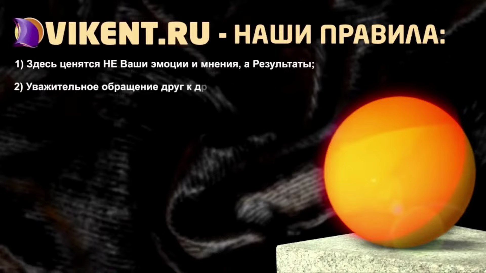

Материалы для этого проекта собирались мной с 1979 года. Надо предупредить, что наши материалы несколь сложные, сколько непривычные для обычного мышления, поэтому нужно смотреть их очень внимательно и слушать, а также рекомендуется записывать. Как вы будете вести конспект в компьютере или в блокноте, это ваше дело.

---

## [00:01:45]

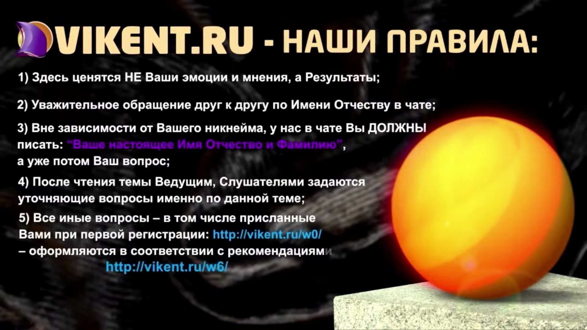

Лично я рекомендую вести в блокноте, поскольку иногда удобно не только записывать, но и зарисовывать те идеи, которые оглашаются в рамках нашего курса. Соответственно, у нас принято в Русской академической научной традиции обращение со всеми исключительно по имени Офист.

---

## [00:02:00]

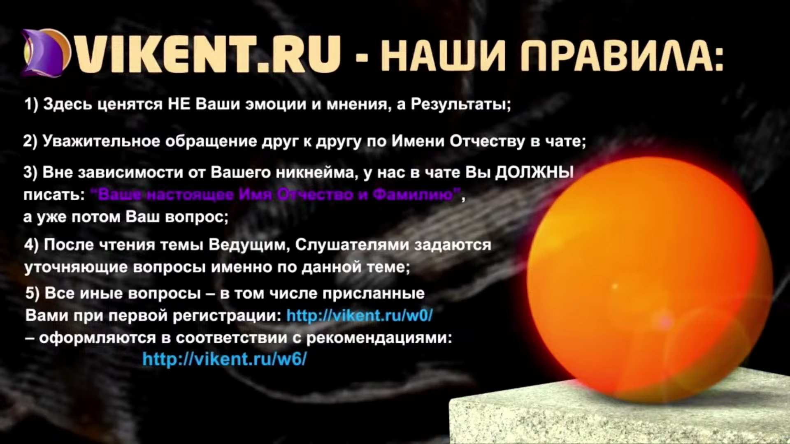

Поэтому, если вы зарегистрированы в Ютубе как красная шапочка, пожалуйста, это ваше право. Но у нас в чате вы будете писать себя как Красная Шапочка, а в скобках полностью имя, отчество, фамилия.

---

## [00:02:15]

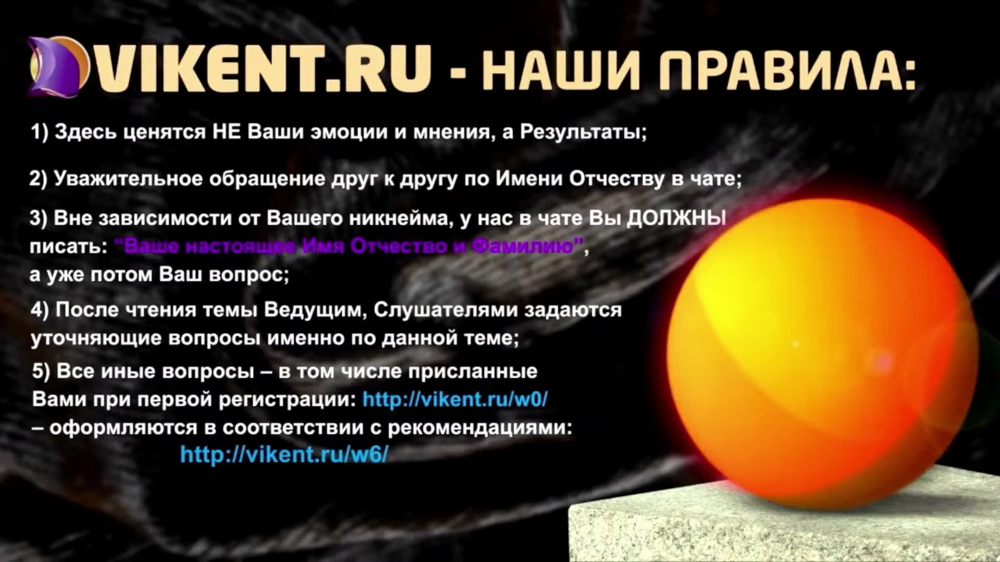

Ну, в противном случае вы просто будете удалены модератором. Причём удалены навсегда. Соответственно, у нас есть вопросы, несколько видов. Первый вопрос - это в конце какого-то логического куска, когда закончилась тема, и они задаются в чате.

---

## [00:02:30]

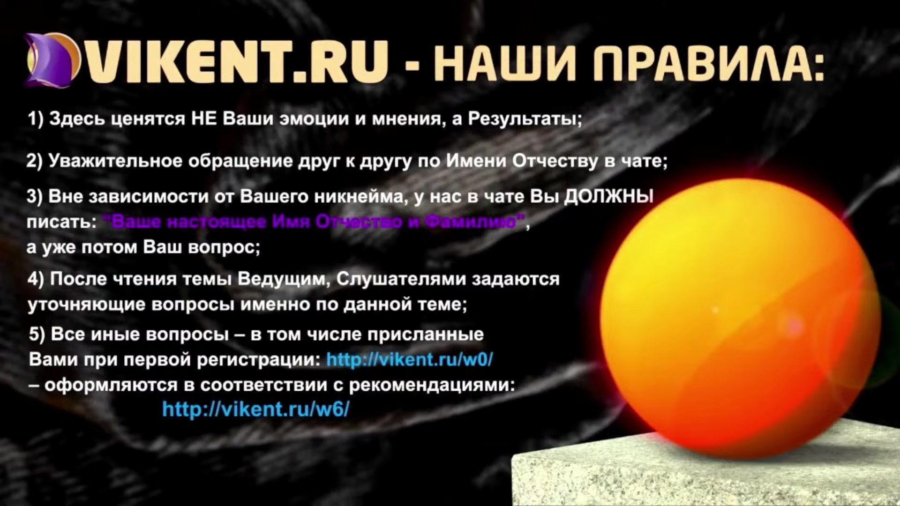

Если ваш вопрос существенно отличается от объявленной тематики лекции, то вы снизу экрана видите, как его задать по специальному формуляру.

---

## [00:02:45]

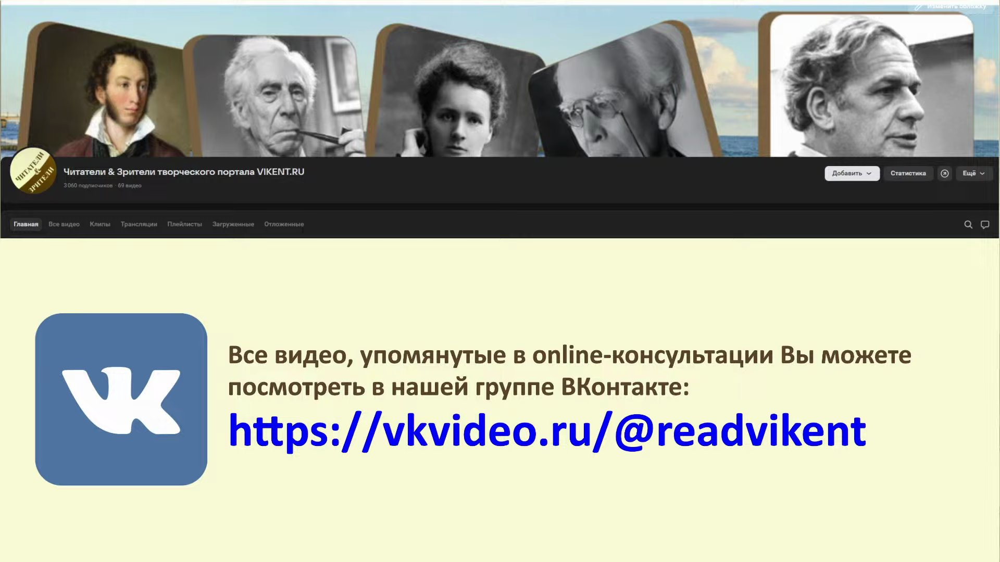

Ответственно, примерно 15% там 1700 видео, которые есть на Ютубе, оно выложено нами ВКонтакте. Вот такой короткий адрес можно смотреть. Если у нас никак не прочитать лекцию или консультацию без какого-то видео, мы потихонечку выкладываем. Ну вот такой вот, ну что ли, некоторый такой кристалл, очень важные видео. Они вот сюда вот выложены, там обычно говорящие названия, то есть видео можно смотреть. Повторяю, мы продолжаем довыкладывать, но это, как правило, единичные видео, которые делаются по, ну, точнее, не делаются, они уже есть, но чтобы можно было читать, поскольку у россиян как бы YouTube, ну, фактически он напрямую недоступен, да. Давайте посмотрим, соответственно, оглавление. Оглавление традиционно у нас публикуется в среду, в четверг.

---

## [00:03:45]

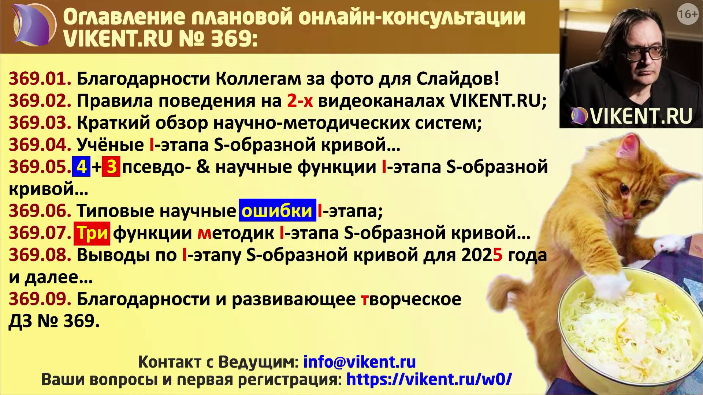

Большое спасибо тем, кто задал уточняющие вопросы. Я понимаю, я я понимаю, что вы понимаете, и я понимаю, что вы не понимаете. Ну вот в опубликованной программе это чрезвычайно ценная информация. Надеюсь, что я учту учту это возложение. То есть большое большое спасибо за помощь. То есть наиболее таких, ну что ли, обязательных людей я прошу себе записать в план, что обычно в среду, в четверг мы выкладываем очередную программу, ну и просто нечесть за труд, посмотреть программу. Они, в принципе, не меняются, задать уточняющие вопросы. Вы просто-напросто мне позволяете, опять-таки повторяю, понять, вот понять, как бы на что нужно прокцентировать. Ещё организационное объявление. Мы традиционно в субботу, в субботу публикуем домашнее задание ещё до лекции, до консультации, до 10:00 утра всегда, заличайшими исключениями. И, соответственно, там есть два пункта. Значит, первый пункт написано слово срочно, возможно, вы не видели. Соответственно, у нас по графику, который объявлен уже ряд лет, мы придерживаемся, у нас 14 сентября, это следующее воскресенье у нас ответы на вопросы по творчеству, научной деятельности и так далее. Вот, соответственно, как бы большая просьба, то есть то, что было писано за лето, не всегда, не всех я как бы объявил, но я постараюсь ответить, потому что, то есть, грубо говоря, я показываю там один вопрос, но иногда под одним вопросом, ну, есть несколько аналогичных. То есть я по умолчанию считаю, что я ответил на вопросы. То есть, то есть формально на предыдущих двух встречах, трансляциях, то есть, точнее, я ответил на летние вопросы. Вот, соответственно, просьба не далечем понедельник, это завтра либо сегодня задать ваши вопросы на наступающее воскресенье. То есть у нас как бы, то есть просто несколько дней я подготавливаюсь к ответам, потом вёстка. То есть задавать вопросы уже четырнадцатого числа будет поздно. Поэтому я напомн в конце, то есть ещё и ещё раз, значит, задать вопросы на 14 сентября, то есть и задать их завтра либо сегодня. Лучше сегодня, я напомню. Значит, прошу не спутать. Это оговорено в домашнем задании. У нас традиционно тоже несколько лет. обычно в середине октября, то есть это так или иначе привязано к дню рождения первому разработчику трис курса РТВ же Генрих Сауча Альшулера. Соответственно, проводятся ответы только по три, только по РТВ, только по жест. То есть отдельно помечать не нужно, потому что если в вашем вопросе есть фамилия Альшулер, термин трис, РТВ, развитие творческого воображения лижестл, я понимаю, вот эти вот вопросы сразу же идут на девятнадцатое, на 19 октября. Почему 19 октября? Потому что это воскресенье. Вот по по очень простой причине. Соответственно, я вам напомню о необходимости задать вопросы как бы сегодня, ну, максимум в понедельник, потому что ответы на ваши вопросы требуют некоторой подготовки. А мы посмотрим, давайте слова. То есть есть бесплатные слова, бесплатные слова именно по данному курсу. Именно по данному курсу, который полезно читать.

---

## [00:07:30]

Да, он бесплатный. Почитать его мгновенно будет тяжело. Тяжело. Там очень много примеров, которых не было в онлайн-курсе. В онлайн-курсе не было примеров совершенно умышленно сделать и так далее, и так далее. Вот. Ну, идёмте дальше, да? Следующий слайд, пожалуйста. Значит, большое спасибо за летние фотографии. Вот вы сегодня все увидите. Давайте следующую фотографию. Отдельное спасибо Мария Дмитриевна Гуменная, Санкт-Петербург пошла в лес. не поехала.

---

## [00:08:00]

И просто, гуляя по лесу, она вышла на рабочий кабинет Ленина в разливе.

---

## [00:08:15]

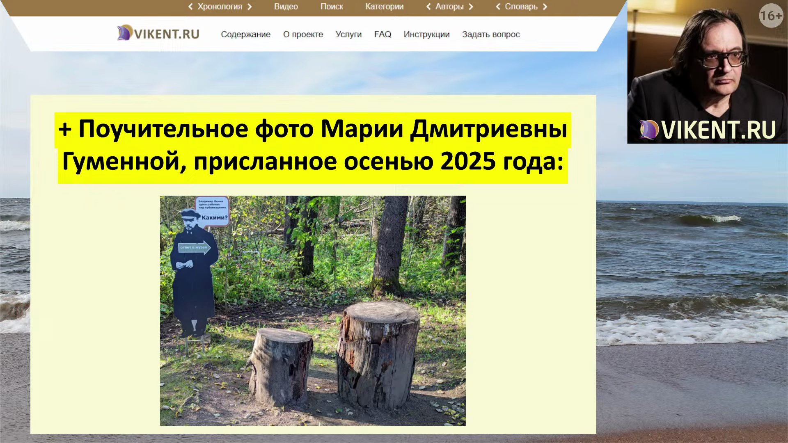

Для непитерцев есть такой город Сестраск, который стоит на перешейке суши между Финским заливом и озером Разлив. Ну а на дальнем берегу разлива Ленин укрывался от от царских там органов и так далее. Вот вот вы видите рабочий кабинет Ленина. И, соответственно, я думаю, что такое полезно показывать детям, когда речь идёт о трудоспособности, работоспособности. Вот здесь вот, ну, правда, это была не зима, правда, не зима. Владимирович Ленин писал свои труды. Вот как бы такая хорошая иллюстрация. Большое спасибо Марии Дмитриевне Гуменной, гуляющей по лесу и нашедший, значит, такой вот такой замечательный кабинет. Я этот кабинет видел. У нас всё в школе возили. Но, естественно, возили, я забыл. То есть вот этой фигуры Ленина, когда я был маленьким, тогда не было. Просто было два пня. Но сейчас его там украсили. Сейчас его украсили. Поэтому вдохновляйтесь, вдохновляйтесь, да, пожалуйста. Ну, идёмте дальше, да. Кто, соответственно, понимает, на каком уровне мы работаем, там перспективных наших м разработок и так далее, и так далее. пожалуйста, может финансировать.

---

## [00:09:30]

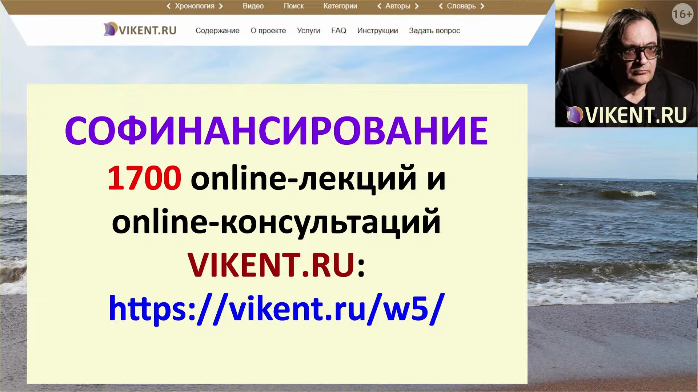

Эти вещи и пойдут и на слайды, и на приобретение книг, и, к сожалению, на моё лечение. К сожалению, на моё лечение. Поэтому на развлечение эти деньги точно не пойдут. Кто может, заранее большое спасибо. Ну и так далее. Вот как бы, да. Ну и последняя правовая оговорка. Давайте. Соответственно, мы занимаемся, ну, может быть, некоторым непривычным делом.

---

## [00:10:00]

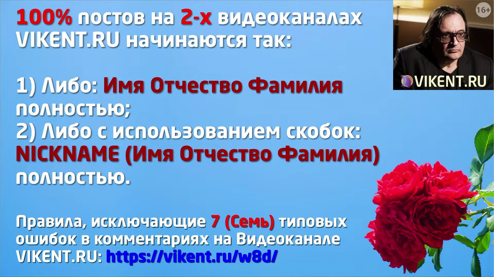

И у нас культивируется такое, может быть, даже избыточно церемонное обращение с друг с другом, независимо от того, у кого там операция, кто там себя плохо чувствует, у кого плохое настроение. Вот на это наплевать, как бы, вот общение с коллегами, коллеги из разных городов, коллеги из разных стран, у них тоже свои проблемы. Поэтому избыточно церемонное обращение. Избыточно церемонное обращение, прошу обратить на это внимание. То есть это требование, то есть это не Я вас прошу, как бы я вас прошу обратить внимание, но вообще это моё требование жёсткое. Соответственно, кто не понимает, улетает от нас навсегда. Ну и начинает глупеть в индивидуальном порядке. Примеров масса. Давайте дальше. И мы, собственно, поступаем. Соответственно, большое спасибо фотографии из Башкии. Фотографии из Башкирии сделал Максим Васильевич Денисов.

---

## [00:11:00]

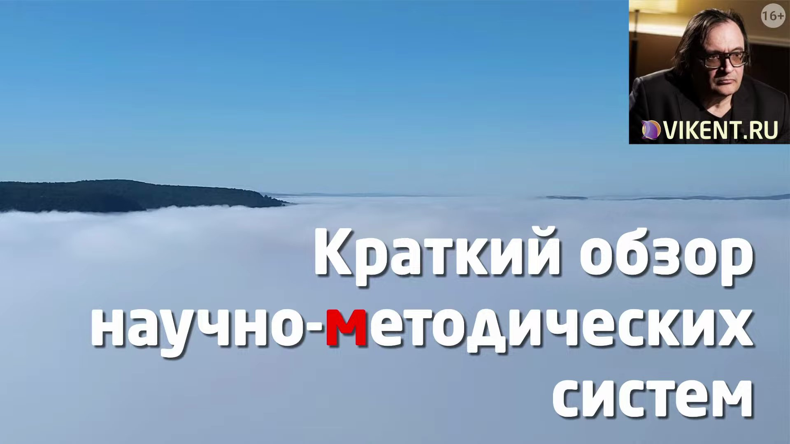

Соответственно, давайте сделаем некий краткий обзор. Эти материалы, в принципе, у нас были. Нам нужно дать рабочее определение. Давайте посмотрим следующий слайд. Следующий слайд. Так далее. Вот так вот. Посмотрите, пожалуйста, некоторые рабочие определения. Они есть как бы в словаре, они будут в последующих изданиях, вокруг словаря и так далее. Вот что задача науки такая, главная задача науки, надо открыть, надо открыть какое-то явление, процесс.

---

## [00:11:30]

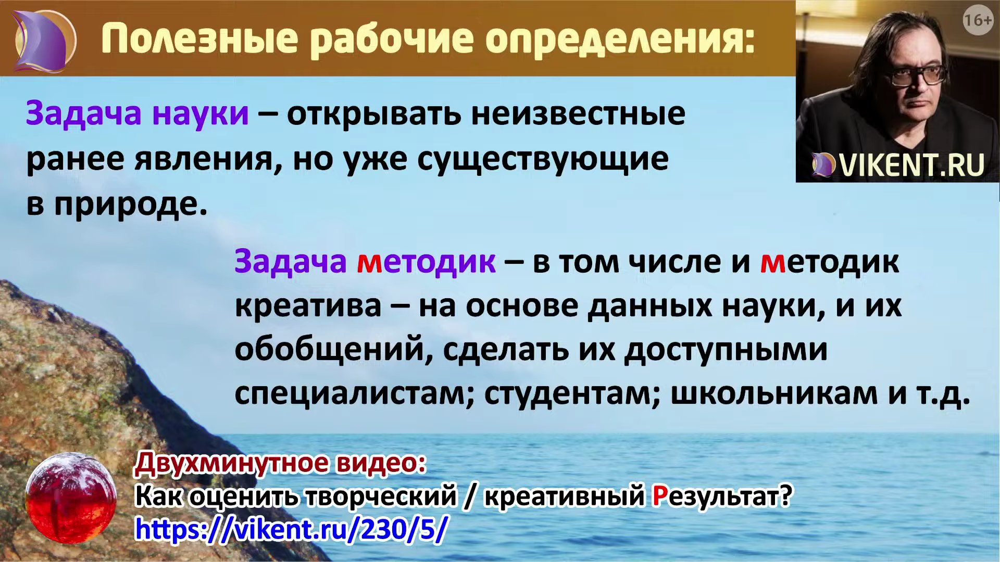

Будет ли это в физике, в социальных науках? Это дело десятое. Соответственно, приведу пример, что, господи, еванжелистречили через э оборотное. в 1644 году открыл то, что называлось тогда несколько веков. Тречелева пустота, а сейчас называется вакуум. Когда это было открыто, выяснилось, что какие-то ещё античные авторы греков что-то такое о перепаде давлений писали. Их, по идее, можно было истолковать. Соответственно, если вы пролистаете бюллетении изобретений на русском, потому что есть бюллетени изобретения из стран мира, так вот можете на русском, можете на английском, то есть как бы и так далее, и так далее. Вот они издаются еженедельно. Еженедельно. Вы там обнаружите, что в 2025 году какое-то количество изобретений делается еженедельно, еженедельно с помощью использования вакуума. То есть изобретение, одно из возможных определений, это просто комбинация уже открытых явлений. Уже открытых явлений, как бы, и вот как бы с помощью вакуума там можно делать какие-то интересные как эффекты. Далее, как бы вот есть наука, дальше есть методика. методика. Соответственно, вакуумомная техника, она опасная, потому что на перепаде давления могут, если это не микроскопические объёмы, что есть отдельная тема, значит, как бы что перепад давление - это какие-то энергии, физические энергии, не духовные, физические. Это сила. Это сила. И можно пострадать. Поэтому, соответственно, человек человек должен иметь специальный допуск. Сначала обучение, потом допуск по работе с вакуумной техникой. То есть поступать человеку просто прийти на работу и поступать. Как человек поступает ночью, то есть встал ночью, хочется поесть, человек начинает бездуманно открывать все кастрюльки, значит, в холодильнике, значит, нет, это не этот случай. Поэтому вот задача науки это открывание нового. Вот. И часто на на первых стадиях это, скажем так, э перепутано, то есть перепутано. Учёные и открывает, учёные и обучают, и популяризирует, и так далее. Вот задача методик методик - это некое обучение на основании неких научных данных. Неких научных данных, да. Соответственно, очень полезное видео. с видео, по которому больше всего благодарности, в том числе от двухминутное видео докторов наук. Соответственно, м вот как бы по поводу творческого результата. В начале сезона мы так усиленно даём, ну, и потом многократно даём и так далее. Поэтому есть задачи науки, есть изобтельство, которого чего нет на слайде, чтобы он был более воздушный. И есть задача методик, о чём сегодня мы будем много говорить. Дальше перейдём к ещё одному моменту, который нужно проговорить для полноты, хотя это было неоднократно уже на в курсе. Давайте посмотрим следующий слайд. Соответственно, соответственно, есть у Аристотеля схожие мысли.

---

## [00:15:15]

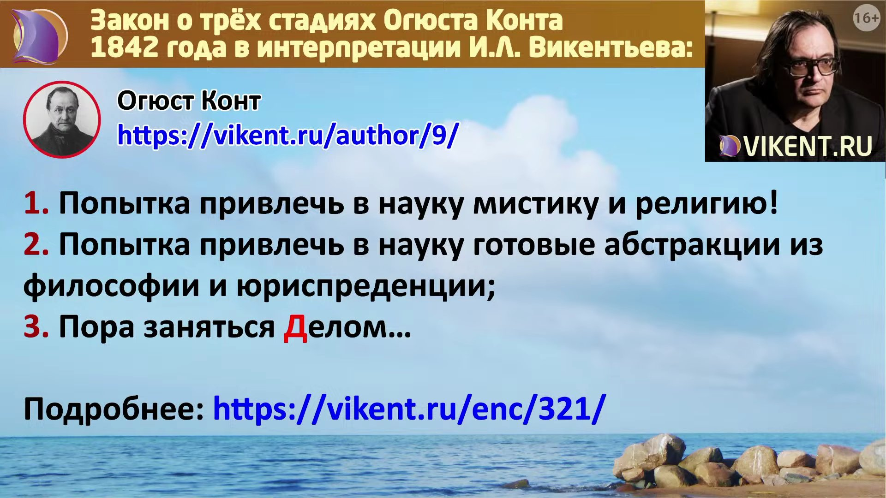

Соответственно, Агюст Конт - это человек, который был обязан говорить своему хозяину, который он работал слугой. работал он слугой Усйн Симона, французского социалиста. Вставайте граф, вас ждут великие дела. Если внимательно читать Сан Симона, я читал внимательно, то, соответственно, вот разные произведения разных лет, то вот то, что сделал Агюст Конт, как бы потом как бы потом вот он сформулировал, то, соответственно, он научился этому у Сэн Ссимона. Хотя, повторяю, есть аналогичные мысли. в метафизике Аристотеля на всякий случай. Кого чрезвычайно интересует, ну, задавайте вопрос, я дам ссылку уже следующее воскресенье. Так вот, когда начинается, мы пока играем в некую науку, есть какие-то научные проблемы, совершенно неважно, это физика, социальные системы, которыми конт тоже занимался или так далее. Вот сначала люди пытаются как-то не решить задачу, а успокоиться. И у человек пытается успокоиться через мистику либо религию. Самые разные люди так делают. То есть люди не пытаются решать научные задачи. Это это ложь. То есть ложь. Люди пытаются успокоиться, да, соответственно, это не получается. И тогда люди пытаются привлечь в науку готовые абстракции. Вы видите, это 182 842 год. И такие готовые абстракции есть уюистов. У юистов много абстракций и у философов традиционно это снова не получается. Ну вот как бы сделав все возможные ошибки, значит, пора заняться делом. Сначала как бы соответно есть переформулировка Викинва Агюста Конта для бизнеса. Ну, учитывая интеллект наших бизнесменов, это предпринимателей, то есть сначала люди делают вообще все возможные глупости. Я не сказал ошибки, а сказал глупости. Глупости. Потом начинают заниматься делом. Соответственно, периодически можно и на четырнадцатый, опять-таки прислать этот вопрос. спрашивается Игорь Леонардович, а сколько вот между этапами проходит время? Соответственно, к сожалению, я ответить на этот вопрос не могу. Очень по-разному. То есть сегодня будут примеры, когда между этапами проходили тысячелетия, вы не ослышались, тысячелетия, столетия. Ну, соответственно, сейчас всё очень динамично. Ну, соответственно, ну, может быть, можно надеяться десятилетия. То есть один человек может пробежать за свою жизнь все три этапа. Значит, ну, сильный наставник просто берёт за шкирку неважно, мальчика, девочка и сразу же тащит на пора заняться делом. Ежедневно в своей ленте ВКонтакте я вижу, как правило, это женские посты, которые, соответственно, несут такой откровенный бред. Откровенный бред про энергию. Про энергию. про энергию. Плохо понимаю, что они несут. Чрезвычайно жалко женщин. И, к сожалению, это почти не лечится. То есть почти не лечится. То есть женщины стремительно стареют. Вот главное главное главная хитрость вообще пора заняться делом. Горит пора заняться делом. То есть имеется в виду энергии какие-то духовные энергии, которых в школьном учебнике физики нет. Соответственно, эти женщины, да, и как правило, они имеют высшее образование. Соответственно, как бы мне бы экзамен по школьному курсу физики не сдали. Соответственно, вот Агюст Конт это написал очень хорошо. Есть аналогичные мысли у Макса Энгельса и Владимировича Ленина. Ленина сегодня посмотрим, но Конт написал очень чётко по трём этапам, между которыми может быть очень различные времена. Одна из стратегических жизненных ошибок провалить свою жизнь на этапе один и на этапе да. Ну, мужчин не жалко традиционно. Женщин, как бы, они очень старательно проваливают свою жизнь. Мне традиционно, я неплохо воспитан, как бы мне традиционно, к сожалению, жалко. Давайте посмотрим дальше материал, который нам понадобится. Давайте дальше. Далее, соответственно, если вы не знаете, что такое S-образная кривая, то есть это некая такая модельная кривая, которая, как выяснилось, описывает явление очень, ну, описывает, может быть, не очень точно, но описывает очень большого, соответственно, класса.

---

## [00:20:00]

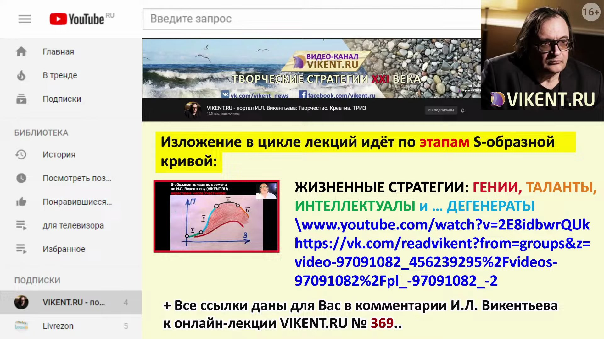

Соответственно, впервые на неё наткнулись в районе как бы 1820х годов, то есть у нас восстание дикобыстых. А Европе, соответственно, перепись населения и вот нашли сообразную кривую. Если кто-то не знает, как бы, что такое сообразная кривая, то, соответственно, ну вот просто нужно просмотреть и законспектировать видео. То есть, то есть делать очередные полтора часа на это я, ну, не буду. Соответственно, мы сегодня закончим видео. Неважно, оно получается, не получается. Видеозапись страховочная ведётся. Соответственно, для вас будут ссылки в моём посте и ВКонтакте, и на Ютубе. То есть что такое сообразная кривая? Рекомендуется знать для чего? Для вашей жизни. То есть в данном случае это в этом курсе мы будем постоянно касаться вашей жизни. Вот кто слушает и так далее, и так далее, и так далее. Вот как бы, да. Соответственно, давайте дальше, да? Соответственно, вот это такой сейчас пойдёт списку с заряда лекцией.

---

## [00:21:15]

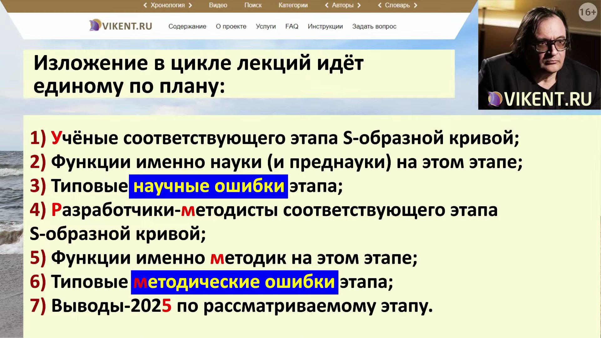

И я прикинул, что похоже будут, ну, с небольшими отличениями, конечно, как обычно, но вообще они будут делаться вот по единому плану. По единому плану. Поэтому повторяю, не путайте, пожалуйста, учёных. Учёных, как бы, дело учёного нечто открыть, там внедрять, зарабатывать, это не дело учёного. Задача педагога, методиста, разработчика сделать, использовать данные, возможно, различных учёных. Причём, возможно, использовать данные учёных, которые друг друга терпеть не могли. Возможно, но методист обобщает и делает. Мы будем делать очень сильный уклон в сторону методистов, методистов, разработчиков, преподавателей вот в этом спецкурсе. как бы результаты учёных для нас некоторый ресурс, некая подложка, на которую мы строим этот спекурс. То есть учёные, данные по учёным у нас много, там есть о чём поговорить, но в данном случае так далее. Вот оговорка, люди начали спрашивать уже в комментариях, как правило, как правило, вот мне бы такие случаи неизвестные, как правило, на первом этапе, когда сообразный клеевой, методистов не бывает. в чистом виде. То есть это профессия более поздних этапов. То есть, как правило, Пифагор что-то нашёл, ну, и рассказал ученикам, как бы, ну, ученики как бы используют. То есть, как правило, научная методическая работа, она слита на неразделима на первом этапе. Ну, давайте посмотрим дальше. Да, да, да, да, да. Вот, соответственно, как бы слеская тема 1735. построение гаммы S-бразных квых по предыдущему слайду. Внимательно посмотрите, так далее. Вот, соответственно, поисразной кривой защищено какое-то количество фантастически глупых докторских на русском языке и так далее, и так далее.

---

## [00:23:15]

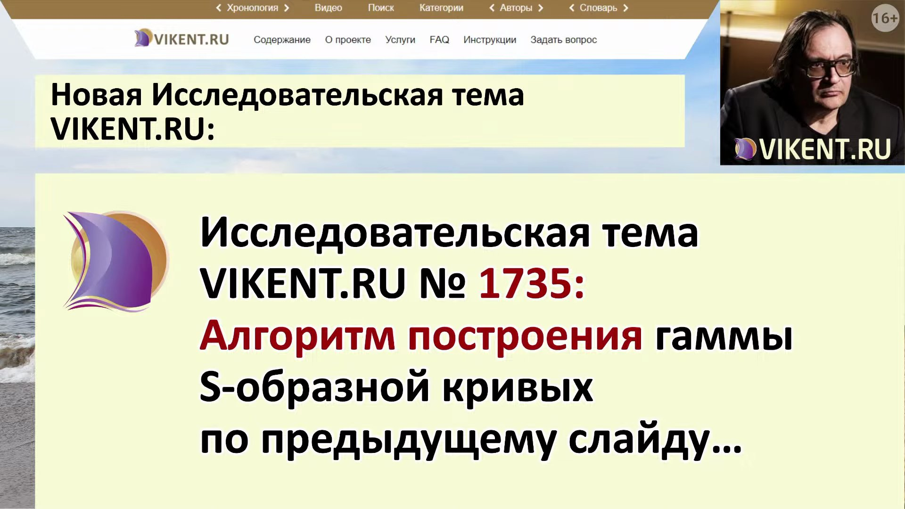

Вот. И там люди постоянно ползают по одной и той же Собразной кривой. Мы будем использовать более широ расширение. Соответственно, возможно собразная кривая науки. Рядышком рядышком в тех же координатах в тех же координатах можно построить ээ сообразное крылое изобретение на этих научных данных. И рядышком можно построить методическую кривую. Поэтому очень важный момент, кто ведёт конспект. Подчеркните красном. как бы мы на моём курсе и с тем, чтобы не делать некоторых стратегических жизненных ошибок, которых я обещал, соответственно, мы мыслим пучком сообразных краевых. Пучком из-образных краевых. Доктора наук, которые по этой тематике защищаются, они не в состоянии, можно меня проверять, они не в состоянии этого делать. Ну давайте смотрим дальше. Смотрим дальше. Смотрим дальше и переходим.

---

## [00:24:30]

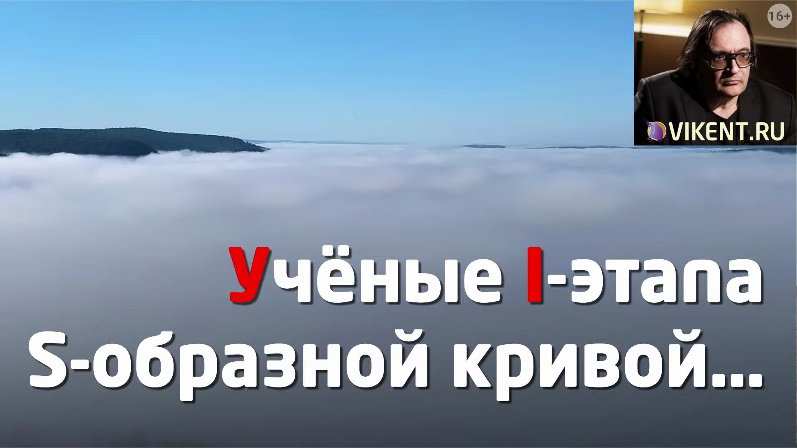

опять-таки башки другой кадр очень похожи на предыдущий Максима Васильевича Денисова горы Санкт-Петербург Давайте посмотрим вот именно учёные я сейчас говорю не о методистах а о учёных вот такая такие штуки есть у меня в книге такие штуки были у нас многократно на курсе вот обратите внимание что вот некое такие очень понятные характеристики соответственно вот Колумб Колумб.

---

## [00:24:45]

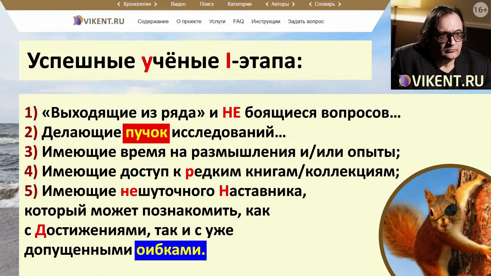

Ну, как известно, Колумб открыл Америку. Ну, то есть до Америки при этом он до Америки не доплыл, как бы рядышком был с Америкой. Но Колумб человек был, а, наблюдательный. И помимо всего прочего, соответственно, скажем, он нашёл и записал в садовому журнале, что, соответственно, часто это называется девиацией, что, грубо говоря, в разных различных точках океана там есть как бы различная магнитная сила. То есть я излагаю так, ну, очень по-простому, ну, условно говоря, как бы вот учёные, учёные первого этапа, то есть они люди, как правило, ну, они могут размышлять, они могут думать, но они работают именно пучком, пучком исследований, пучком исследований. Соответственно, как бы вот как бы есть учёные, которые исследовали всю жизнь одну и ту же тему. Ну, как бы вот вот путёк исследования - это страховка, страховка, страховка учёного. Ну, соответственно, дальше я надеюсь, вы как бы всё прочли, и мы переходим к некоторым людям, как бы не к тем людям, которые бывают на первом этапе, как бы. Давайте, давайте дальше. Вот активные психи и маргиналы неудачники. И здесь нет, есть некоторые тонкие эффекты, они стало засорять.

---

## [00:26:15]

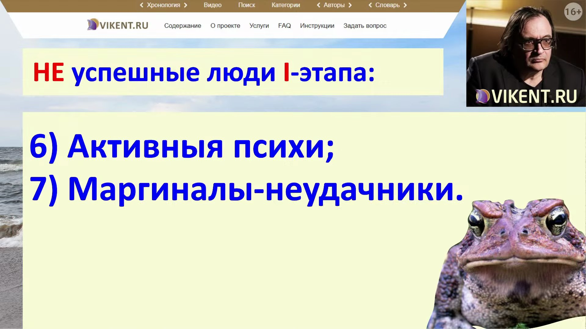

засорять [музыка] слайд. То есть есть очень тонкий эффект, что на первом этапе есть некая благодать. Я то есть, условно говоря, просто чем-то занимаясь на основе просто знания там школьной программы можно получить некоторые достижения в области науки и в области методики тоже, но об этом позже немножко, да. И здесь возникает маскировочное явление, что человек псих, но если он попал в какой-то более-менее приличный коллектив, что-то ещё, человек вообще никакой, там псих, линтяну и так далее, вот, но тем не менее получил какие-то результаты и даже иногда сду вошёл в в историю науки. Но потом всё дело усложняется. И, допустим, на втором, на третьем этапе этот человек, ну, человек не умеет работать, как бы вот просто какие-то простенькие результаты, все вычерпаны, все сделали, необходимо научно конкурировать либо методически конкурировать, и человек вылетает. Таких людей полно среди русскоязычных бизнес-тренеров и бизнес-консультантов и коучей, особенно коучей, которые просто не обладают, не имеют никаких навыков систематического интеллектуального труда. О творчестве не может быть речи, но которые когда рынок пустой, то есть они имеют некое значение, потом они просто-напросто вылетают. Ну просто вылетают и не держат. Это такая жизненная оговорка. Мой совет себе помечать, что и у маргиналов может быть успех, но он краткосрочный и единократный. Единократный, в отличие от Колумба. Колумба много достижений. Кто хочет, может сделать доклад. Планируется на следующий год несколько конференций. То есть, надеюсь, мы там найдём, куда такой доклад поставить, как бы. Давайте идёмте дальше. Как бы можно Магилана взять. Так, вот это сложный материал. Он взят из матыса Викентьева. Кто не знает Матрису Викентьевой, специально скачали ВКонтакт, показали, где взять, не стали, ну, мы пытаемся сейчас сделать такие воздушные слайды.

---

## [00:28:30]

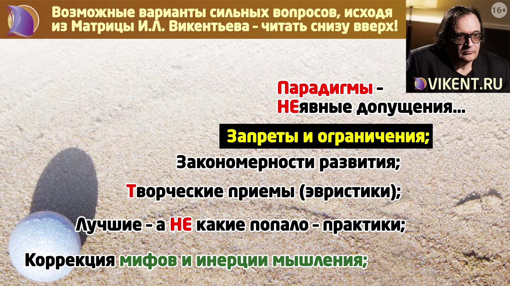

Нам самим, если честно, они очень нравятся с Александром Олеговичем Романовым, соответственно, группы Левый зон, вот, так далее. Вот так вот материал чрезвычайно важный, и нарушая собственные правила, я как бы немножко чуть-чуть почитаю, чуть-чуть почитаю и так далее. Вот. Вот, соответственно, как бы это некие этажи, знания, которые, ну, стоит понимать, а их можно, естественно, выразить другими терминами, но важно понимать, что на разных этажах, на разных этажах различная жизнь. Соответственно, в конце семидесятых годов, накануне восьмидесятых годов, соответственно, в Саянах нашли отшельников семейства Лыковых, которые бежали советской власти от коллективизации и где-то очень далеко жили там какие-то местные охотники там передавали им соль, что-то в этом роде. И, соответственно, ну, они там жили, размножались и так далее, и так далее. Отшельники лыковые. Ну, можете найти их в интернете там более подробно. Самый старший был Карп Лыков. И, соответственно, геологи, которые там что-то искали по земле недалеко на вертолёте, пригласили Карпа Лыкова вертолёт, думая, что он как бы удивится. Так вот, Карп Лыков как бы не имея десятилетием никаких отношений с реальностью, ну, как кроме соли от знакомых охотников и так далее, и так далее, вот вертолёту не удивился. Моё объяснение, моё объяснение, моя гипотеза, точнее, что, соответственно, в тридцатых годах, когда он ещё жил в Союзе, там было много самолётов, там, ну, пропаганда, он мог слышать, может быть, даже видеть про самолёты. Кроме того, хоть это там и глухие места Саян, соответственно, он мог видеть, они могли видеть вертолёты, самолёты летающие. Но что его поразило? Его поразил обычный полиэтиленовый пакет, потому что это вот как бы жидкое жидкое мягкое стекло. Поэтому он был совершенно поражён. Вот следующий уровень знаний и научных, и методический, это лучшие. Они ани какие попалопрактики. Стандартный вариант испортить себе жизнь, когда женщины, мужчины пытаются послать мне свои какие-то разработки и с мощным обоснованием, что я так делаю. Соответственно, если у вас есть какие-то амбициозные цели, это как бы очень плохой такой довод. Очень плохой довод. А вы знаете вообще лучшие практики по вашим профессии в мире? В мире. Причём неважно, чего это касается. Лечения пёсиков. Это касается, это касается, значит, каких-то прорывов физики или так далее, и так далее. Это не неважно. Неважно, что это касается науки, методики и так далее. Вот то, что вы лучше делаете, это по-тки интересует, может быть, вашего пёсика, может быть, интересует члена вашей семьи. Всё, всё. Но в любом городе, более-менее крупном, это уже мало. Это уже вот, ну, есть такая болезнь русскоязычной интеллигенции. Я так делаю. Вот как бы кто хочет себя изгарить жизнь, рецепт я вам привёл. Сегодня таких отсутств будет много. Далее вещь, на которую опыт показал, что доктор наук о кандидатах, я даже не говорю, не способны. То есть под моим чутким руководством было проведено 30, ровно 30 конференций бизнес-тренеров и консультантов, где на многих, не на всех, на многих рассказывал про Геннасовича Альшулера и рассказывал идеи эвстик, творческих приёмов и так далее. Вот, значит, конференция страшно возбуждалась от того, что они теперь знают главный секрет. Айшули, ученики Айшули вышли в Америке и, значит, соответственно были заверения и Леонардович, да, мы, да, я следующей конференции через год мы что-то сделаем. Так вот, ни один не смог бизнес-трене консультанткоуч выявить какое-то количество приёмов, ну, даже одного приёма. То есть объяснение чрезвычайно простое. Человек не умеет интеллектуально работать. Человек считает, что он разберётся без меня сам. То есть таких вот клоунов было очень много. То есть таких клоунов, что я разберусь сам. И клоунес таких бы таких было полно. Третий. Человек думает, что он накачает какой-то бред в социальных сетях и там найдёт приёмы. Он найдёт различную фигню, как бы, грубо говоря, нахождение там одного-двух хороших примеров как бы в неделю, это большое счастье. Но пример - это вот как бы лучшие практики. А на следующем этаже для обобщения нужны десятки отборных примеров, которые бывают единично в неделю. У меня несколько больше, но я профессионал уровня, который большинство коучей, ну, просто не в состоянии воспринять. Ну, соответственно, следующий уровень, неважно, это наука, неважно, это может быть изобретательство развития техники, это может быть методики, это закономерности развития, то, соответственно, это с одной стороны очень абстрактная вещь, другое дело обратите внимание на множественное число. То есть, когда вы просто-напросто знаете закономерности высокой общности, физики, вам показывают какое-то устройство, вы мгновенно сетку закономерности накладываете и очень спокойно говорите: "Не работает". Не работает. Но аналогично в методике, аналогично в науке, то есть, условно говоря, там нарушение принципа сохранения энергии, ну, и так далее, и так далее. Вот и не работают. Далее чрезвычайно чрезвычайно интересный момент, который явно созрела конференция. Созрела конференция пока не запланирована пока, то есть пока не прорезался организатор, кто этим займётся, а заняться может только человек, кто прошёл у нас ряд успешных докладов. То есть человек сбоку, он, пожалуйста, может проводить всё, что угодно и где угодно. качество, которое он сделает, уже известно. Уже известно. Но если человек хочет проводить как бы по стандартам викенд, соответственно, он сначала должен сделать ну ряд докладов меня, соответственно, и так далее. Вот. И, соответственно, близко к запятым к ограничениям прогдигмы некоторые неявные допущения. Соответственно, через всё христианство, через всю христианскую теологию мусульманскую мусульманскую, кстати, тоже идёт неявное допущение, что Бог добр, Господь добр. Соответственно, Станислав Лем, желающие могут поискать, соответственно, [музыка] не ссыясь, соответственно, отцов, ранних отцов церкви, которые как бы иногда сомневались. И если есть действительно всемогущий Бог, а почему Бог добр? А, например, Бог может пошутить. Ну, просто в пятницу Бог шутит, например. Вот обратите внимание, я оперирую некоторыми неявными допущениями, которые разделяют сотни миллионов людей. Сотни миллионов людей, да. Вот анализ парадигм сильнейший механизм. Ну, соответственно, нужно немножко пройти предыдущие этапы. Соответственно, матывикен довольно универсальные. Это это механизм не решения, а представления знания. Совершенно понятно, что двига заполняя различные этажи, в принципе, она бесконечна. То есть можно лучшие практики собирать бесконечно, соответственно, но желательно с первого этажа коррекция мифов и инерции мышления, как у карпалыкого и полиэтилиного пакета, желательно быстро слезать. Некоторые не слезают десятилетиями. Ну, опять-таки благой, добрый боком судья и так далее. Вообще нужно понимать, что есть некое восхождение, ну, до парадигм, то есть, ну, выше парадигм, то есть, ну, сначала нужно только система парадигм, о которой когда-нибудь поговорим. А теперь давайте более простой пример и так далее. Вот давайте пример.

---

## [00:37:15]

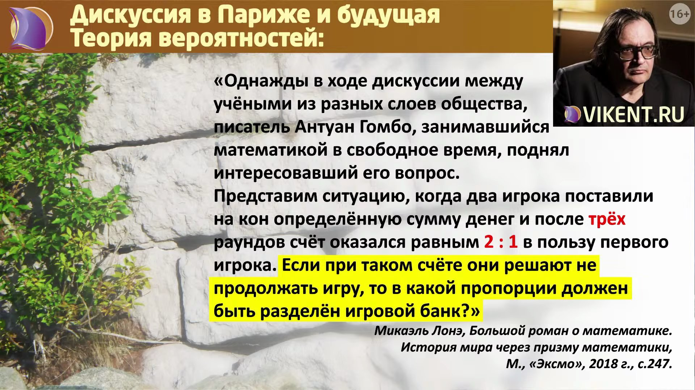

Давайте, соответственно, как бы, да, вот обратите внимание, просто некая дискуссия, некая дискуссия в Париже и которая дала толчок на толчок теории вероятности. Теория вероятностей - это наука, обучение теории вероятностей. Там масса подвохов. Это уже методика. Это уже методика. Вот обратите внимание, как бы так как бы и очень интересный момент. Очень интересный момент, что вот есть вопросы. Есть вопросы, да? И вот обратите внимание, что, соответственно, попытайтесь самостоятельно связать, если не удастся, ну, задавайте вопросы под видео, потому что, грубо говоря, 13 сентября будет будет домашнее задание задать вопросы вот по этому видео, то есть когда оно созреет это видео, то есть опережаете домашнее задание. Соответственно, на форумов, на форумах хакеров продаются уязвимости. То есть программисты сделали ошибки, они продаются. Соответственно, как бы можно найти при большом желании, что некоторые люди продают ноухау за деньги тоже там в даркнете, не только в даркнете. То есть человек поработал в компании, как бы, и какие-то ноу-хау продают. Продают. Вот, соответственно, обратите внимание вот на этот момент, да, этот момент. Это первое, что нужно обратить внимание. И второе, обратите внимание, что вопросы, некоторые вопросы, они существуют долго. Вот некоторые вопросы, то есть я пока не закончил мысль. Кто не понял, почему я об этом говорил и почему здесь пример, ну, спрашивайте под видео. Ну, может быть, ближе к концу сегодняшнего видео это пойдёт. Идёмте дальше. Идёмте дальше. Пока вас, понимаете, простий варианте, просто понимаете как толчок для науки. И, соответственно, большое спасибо Маргарите Геннадьевны Крыловой. Соответственно, вот, да, она видна, кстати, я понимаю, вот научные функции первого этапа собразной кревой. Давайте посмотрим, какие же там такие функции, да?

---

## [00:39:30]

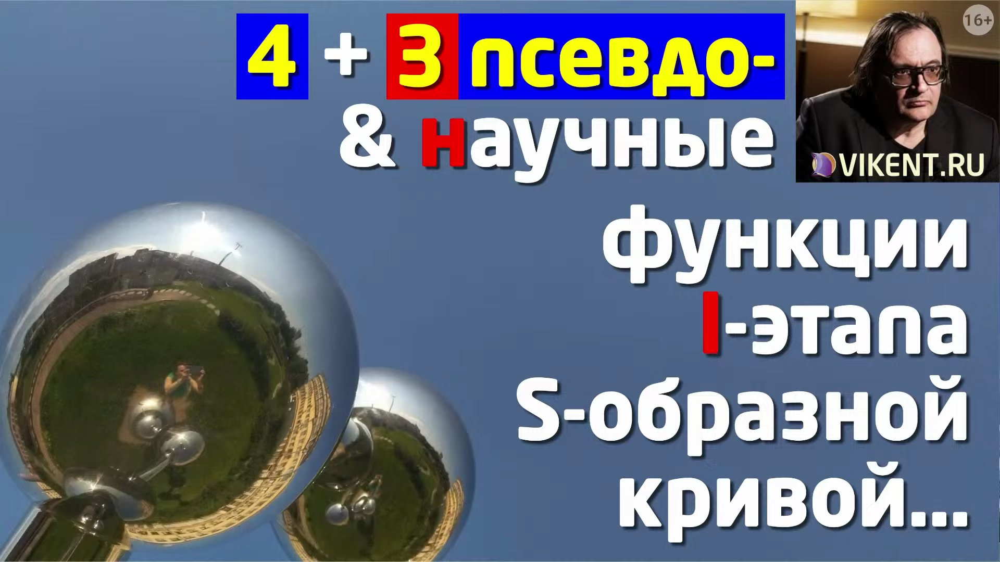

Ну, сначала посмотрим да следующий слайд. Вот некое высказывание Ленина. Почему как бы человек, который, ну, знает публикации Владимира Ча, видя том двадцать девятый, сразу же говорит, что это том конспектов, том вот двадцать девятый том собрания священия Ленина - это том его конспектов.

---

## [00:39:45]

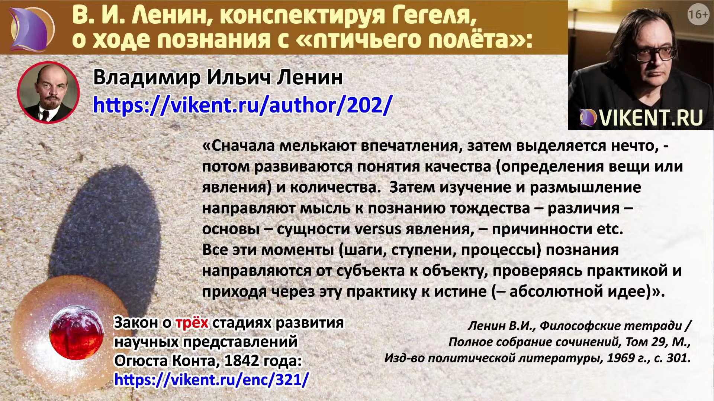

В данном случае это конспект Гегеля. И вещь, как бы я специально вставил, он говорит на похожие вещи, чем уже виденный Агюст Конт. Как бы он говорит о том же самом, том же самом, но Агюст Конт изложил это пошагово и лучше. Агюст Конт изложил это пошагово и лучше. Хотя, я повторяю, в метафизике Аристотеля тоже есть некие вещи, то есть похожие на контра Владимира Ильвича Ленина сразу же в метафизике Аристотеля. Хотите искать сами ищите как бы, да? То есть, ну, давайте посмотрим теперь функции. Теперь функции посмотрим, да, соответственно, вот как бы на первом этапе, и это как бы некая засада для каких-то таких людей, может быть, отличников и отличниц, то есть мальчик или девочка, да, мальчиковый девочку может быть 40 лет, может быть 50 лет, они привыкли слушать учительницу нам руководителей и так далее.

---

## [00:40:45]

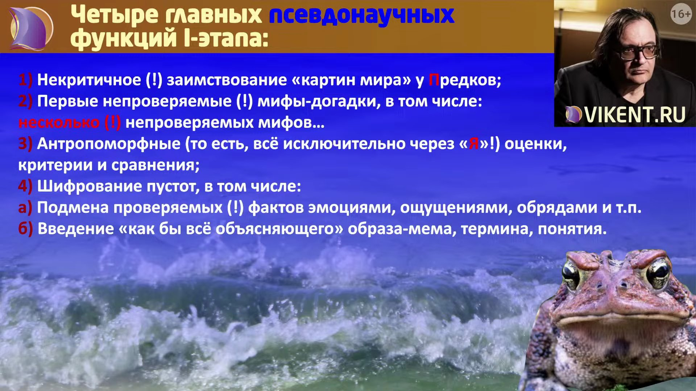

Вот. И, соответственно, вы видите, что всё синее вот на фоне такого моря с Тиной вылез жабён. Вылез жабён. Это означает, кто ещё не познакомился с Жабёном Радбищем, что это вообще атас. Вообще атас, как бы, да, то есть то есть это типовые ошибки. И, соответственно, жил был отличник, жила была отличностца, неважно в школе, в вузе. И дальше просто-напросто отличник с помощью указанных способов. То есть, как правило, на первом этапе вот научные функции очень быстро на первом этапе они сваливаются в псевдонауку. Если вам больше нравится там термин лже наука или как бы наука или вообще не наука, то, пожалуйста. То есть лже наука, псевдонаука, вообще не наука и так далее. Вот. Но это некая засада первого этапа. на которую масса людей пытают с высшим образованием, с понтами, семинарами, там, живя в Москве, в Питере, в крупных городах, вляпались и как бы прожили свою жизнь, ну, мягко говоря, не туда, мягко говоря, не туда, соответственно, а потом уже в один прекрасный день уже поздно, уже поздно, как бы, и делать нечего. Ну, соответственно, давайте посмотрим ряд печальных примеров. В данном случае моя миссия предупредить, во что можно вляпаться. Почему люди умные, работящие и так далее. Вот, соответственно, скажем, да, соответственно, вот вы читаете пример, почитаете пример как бы из книжки.

---

## [00:42:30]

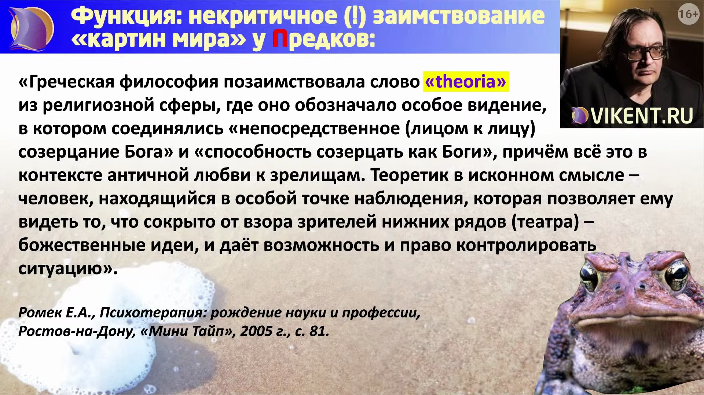

Значит, вот эта книжка, хотя она вот вот м вот эта вот книжка издана в Ростове, но она толковая, надо сказать. Вот эта книжка толковая, то есть Елена Александровна, мы лично не знакомы, значит, ээ если кто-то хочет найти в социальных сетях её найдёт, напишите мне, надо как-то закрышиться с Еленой Алексанй. Вот, то есть, то есть, то есть женщина вообще понимала, о чём писала, тем более такая спекулятивная тема, но тем не менее, да. Так вот, соответственно, как бы вот посмотрите, как очень древние люди сделали некоторую закладку. На какое время Иго Леонардовича? Ну, на пару тысячелетий. Ну, на пару тысячелетий сделали закладку, а потом какие-то люди, значит, это делали. Соответственно, обратите внимание, очень масса окультятников, например, называю Рехов, семейство Рехов. Соответственно, которых там блефовать в России было тяжело. Они блифовали, что есть какие-то махатмы, как бы, у которых есть какая-то с ними духовная связь и прочее, прочее, прочее. Ну, традиционно у факультетников они строят свои некоторые тезисы на непроверяемых. То есть никто махатом не видел. Соответственно, периодически бывают конфликты между Китаем и Тибетом. И, соответственно, какие-то простецкие китайские солдаты вторгались в тибетские святилища. Никаких махатом они как бы там не видели. Никакой кары махатом, великих махатом, как бы простецкие китайские солдаты, значит, как бы вообще не получили. То есть это не означает, что нужно разорять святилище. То есть я не верующий, но тем не менее вот такая вот закладка на несколько тысячелетий. И масса людей с высшим образованием в это дело верит. Я вижу, а, как правило, повторяю, женские глупые посты ежедневно, где? Вконтакте. Вконтакте, то есть сил нету. То есть я просто начинаю девушек выкашивать, просто-напросто выкашивать. То есть я чищу чищу ленту, и буквально с каждым днём у меня лента ВКонтакте становится всё лучше, лучше и лучше. Почему я чищу девушек, как бы то, что девушкам плохо, ну как бы, пожалуйста, запишитесь на курс и впет. У нас всё бесплатно. Давайте дальше. Дальше следующий как бы, да, примеры. Примеры, да, следующий пример, давайте, да, вот, пожалуйста. Так, как бы, да, извините, как бы, да, молод такое антиженское антиженское произведение.

---

## [00:45:30]

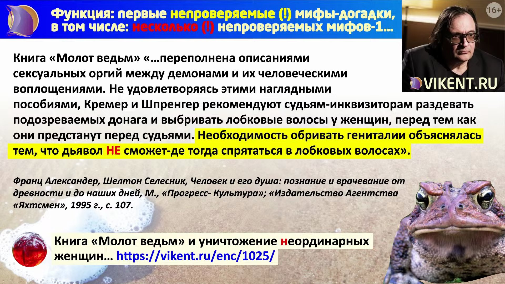

антиженское произведение, чрезвычайно странное, вызывающее большое, вероятно, ну, масса людей, утверждая, что я не знаю, я в те времена не жил, что, наверное, у авторов были проблемыми с женщинами, наверно, но, соответственно, массу женщин, ну, такая культурологи очень любят говорить, что массу неодиренах женщин просто были выкошены в истории Европы из-за этой книги. То есть, то есть книга, книга дурацкая книга вообще окончилась какими-то появлениями фашизма. Соответственно, кого интересуют, есть близкие моменты. Соответственно, как ни странно, почему я проверял, верующие это не знают. То есть, ещё раз, верующи, я настаиваю на это, многократно проверял, в Библии очень мало сказано про демонов и про ангелов. Очень мало. То есть они там есть, но вообще мало сказано. Но тем не менее вы можете посмотреть, погуглить. Есть дисциплины, разработанные средневековье, ангиология, учение об ангелах, какие бывают ангелы. Есть демонология. То есть люди разработали целые науки, целые науки, опираясь на какие-то единичные фразы из Библии. Единичные фразы из Библии. Соответственно, как бы, ну вот как бы если хотите сгадить о себе как бы жизнь, то как бы, пожалуйста, разрабатывайте. Давайте идёмте дальше, да? Идёмте дальше. Идёмте дальше. Соответственно, по идее, кто-нибудь наверняка, кто это слушал или будет слушать, сдавал экзамен. Соответственно, у классиков марксизма, Макса и Энгельса подобных вещей много.

---

## [00:47:15]

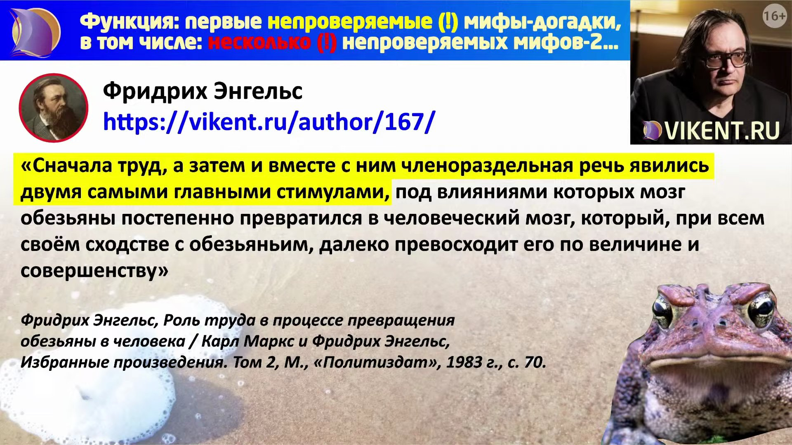

по под вот там типа труд создал человека и так далее, вот так далее. Вот, соответственно, как бы в данном случае как бы витает тень задачника, которую я пытаю пытаюсь пропихивать уже, не знаю 20, может быть, 30 раз. То есть нужен задачник. Для кого? для старшеклассников, студентов, аспирантов, доцентов и профессуры, где просто-напросто вот вот как как я сейчас здесь вот просто приводятся данные желательно из каких-то известных авторов, известных авторов, то есть не блогеров, а известных авторов, так по-хорошему известных. И дальше нужно просто выделить. Вот, соответственно, в те времена, когда жил Энгельс, соответственно, такие дисциплины, как этнография, антропология, только начиналась. И, соответственно, как бы Энгриц перечитал, перечитал начинающиеся первоэтапные дисциплины и сделал всемирное обобщение. А дальше стада советских философов об этом говорили. Сейчас считается, что, соответственно, вот как бы вот этот тезис, что там труд создал человека, он неверен. Считаются профессиональные языковеды, профессиональные антропологи считают, что сначала это была как бы работа в составе группы. Сначала рещь, потом труд, то есть то есть другие приоритеты. Соответственно, три замечания. Значит, первое. Просто Энгелис из каких-то не очень проверенных, то есть локальных данных сделал всемирное обобщения. Стда дураков, как бы это там десятилетиями повторяли и так далее, и так далее, и так далее. Вот. И как бы третий момент, вот нужен задачник внешне, он очень простой. Просто есть некий тезис, и нужно просто его, ну, в простейшем случае, как в редакторе Word, ну, понятно, что можно программно сделать по-разному, разрисовать, где проверенные данные, где непроверенные данные, где инерция мышления, где факты, где закономерности. Вот здесь вот фактов у Фридериха Энгельса, которого старшее поколение заставляли учить, просто нет. Есть тиражируемый миф. Тиражируемый миф и так далее. Вот. Ну, соответственно, одна из причин, таких причин было много, почему развалился Советский Союз. В том числе было много тиражируемых мифов. Вот почему. То есть на гнилом основании было построена, на гнилом основании и так далее, и так далее, и так далее. Вот тая. Ну, идёмте дальше. Далее. Соответственно, очень характерное высказывание. Я это слышу.

---

## [00:50:15]

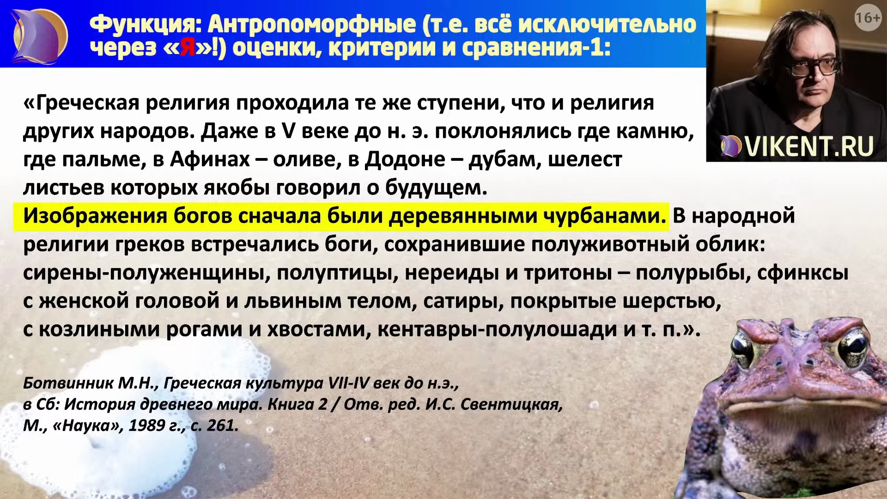

Я это слышу, когда дело касается как бы каких-то домашних вещей, и человек оперирует доводом от я, что мне нравится, что я люблю, что я купил или там купила в холодильник и так далее. Вот, пожалуйста, без моих комментариев. Я не являюсь специалистов, особенно по чужим холодильникам. Вот, соответственно, она очень часто люди зевают и вот на первый этап по агюсту конту масса масса вещей они пытаются пытаются как бы обожествлять, отчеловечивать. То есть как как бы вот как им лично понятно. Потом незаметно незаметно происходит обобщение на широкий слой явлений. И тут вот эта вот мифология перестаёт работать. То есть это ещё как бы ещё один из способов поломать себе жизнь. Не далее как сегодня утром. То есть сегодня утром четырнадцатого числа четырнадцатого числа двадца пер я я ошибся двадцать первого у нас ответа на вопросы будут. Я услышал по федеральному каналу что у танка Т-90 прорыв есть душа. А причём выступал руководитель, причастный к этому танку, который постоянно рассказывал, что у танка Т-90 есть душа. Такого по федеральным каналам безумное количество. Вот, соответственно, как бы вот что бывает в отсутствии задачника, когда люди не понимают, где байка, где привычка, где перенос бытового опыта на модернизированный танк, ну и так далее, и так далее, и так далее. рано или поздно это будет оплачено какими-то ошибками в рай случае, ну, мягко, мягко говоря, связанными жизнью со здоровьем и даже даже. Ну, идёмте дальше ещё посмотрим, да, я не читаю пример, естественно. Соответственно, вот, ну, это просто-напросто пример, как чук привык считать от себя, от своих элементов, там рука, нос, что-то ещё.

---

## [00:52:15]

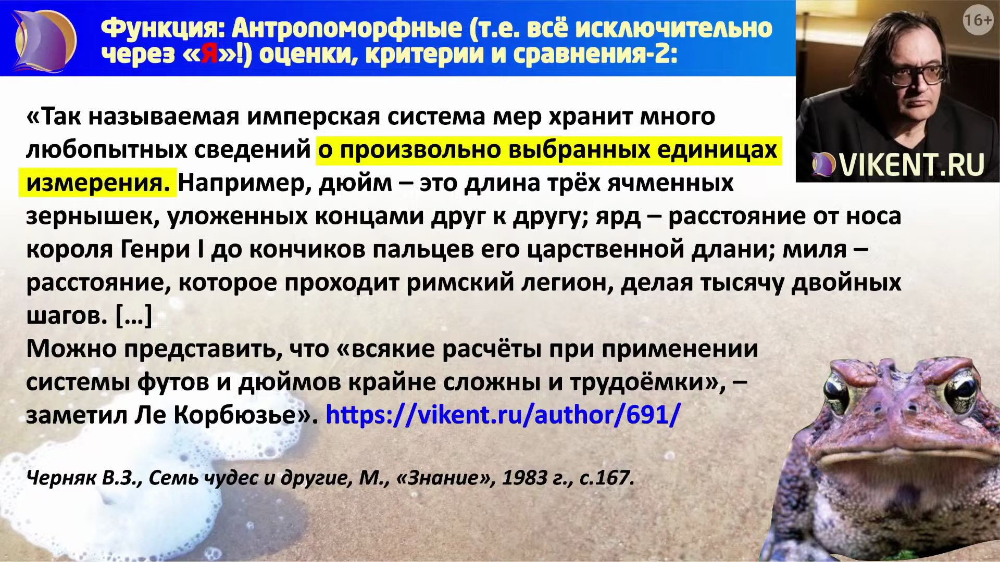

Таких примеров масса. Таких примеров масса. Это простой обеходный способ. Вот, соответственно, мы увидим, мы увидим, что, соответственно, как бы на втором стадии, на второй стадии вопрос как бы кто первым это поломает? Вот кто первым поломает вот такие антропомофные варианты, соответственно, никто не запрещает. Об этом Роман Стефанович Флавеску мне говорил. вот такие антропоморфные вещи уже поломать в науке или в методике или в изобретательство на первом этапе. Но обычно боятся ломать просто боятся, что азияс не поймутся. Азияс не поймутся. Ну давайте дальше. Дальше. Давайте дальше. Соответственно, вот некоторый пример. Некоторые пример я цитирую через Выгоцкого. То есть как бы я не помню, то есть я левибрюля прорабатывал, честно говоря, такого примера не помню.

---

## [00:53:15]

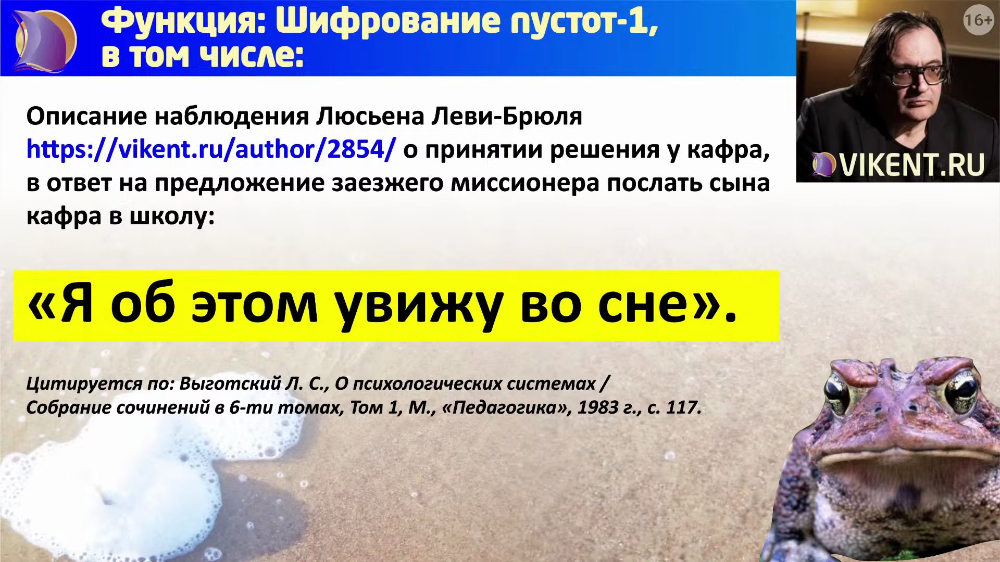

Ну, может быть, может быть, ээ, может пропустил, может быть, какое-то произведение, которое там, ну, вот мне не попалось, да, на всякий случай. Кафах - это кафах. Для чего используется кафа? Кафа - это южный африканец. Южный африканец и так далее. Вот так далее. Вот как бы, да. И вот как бы сюда здесь нужно рассказать ещё одну баечку, что, соответственно, обычно люди, которые много занимались математикой, физикой, они полупрезрительно относятся к искусствоведам, потому что искусствовед, если ещё не дай бог искусствоведрабатывает экскурсоводом, то, соответственно, как бы часто человек использует и мужчины, и женщины доводы за какие-то произведения, о которых м он рассказывает ахи и охи. То есть, вы понимаете, считать что-то за науку, тем более за методику, где есть ахи и охи, но, мягко говоря, несерьёзно, это такой нормальный, крепенький источник ошибок, в том числе и в столицах. То столица - это Москва, Питер. Я их просто очень хорошо знаю. Есть масса, есть возможностей не делать глупости, но стада людей эти глупости делают. Ну а жабёно бесперевович в очередной раз вылез на фоне пены финского залива в посёлке солнечном. Он нас предупреждает, что вот как как бы вот шифрование пустут. Один из вариантов такой немножко экзотический, как бы вот если вы хотите увидеть как бы какую-то методическую разработку во сне, это бред. Бред. Соответственно, мне масса людей, занимающихся, не занимающихся, говорили о том, что, соответственно, вот как бы вот скоро будет чать GPT и вот как бы он он всё сделает. Пока чат GPT, как грубо говоря, в области там науки, в области методик, в области изобретательства, всё это уже многократно мною, коллегами проверено, выдают некоторые чрезвычайно поверхностные знания. Если нормально работать, то есть можно нормально чат GPT, который формально выкачивает весь интернет, как бы обходить. Ну, на первом этапе, на первом этапе чат GPT и они и аналогичной разработки могут быть могут быть полезный потом старшеклассникам, студентам. Ну, ну, ну, ну, да. Давайте посмотрим ещё один исторический пример. Да, таких примеров у меня много. Много это сотни. То есть это сотни, да. Так вот, некоторые авторы Ветрувий, как бы можете посмотреть, когда он жил.

---

## [00:56:00]

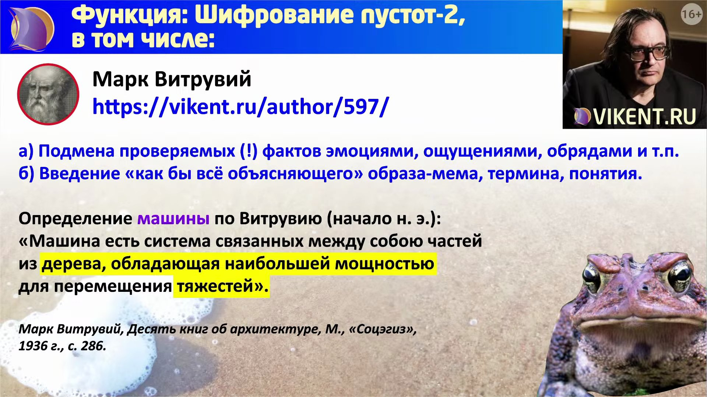

давно он жил, соответственно, и вот это такая типовая ошибка. Вот если внимательно, опять-таки, это прообраз задачника, который нужно просто научить людей классифицировать текст. Просто классифицировать текст. Вот, обратите внимание, есть большое количество ошибок. Как бы первое, машина не обязательна из дерева. Вот. Далее, если это прибор, прибор работает на малых токах, на малой пневматике, на малой гидравлике, не обязательно большой мощностью. Ну и третья ошибка. Не оббязательно машина это по перемещению тяжестей. Есть безумное количество там, ну, как минимум, если верить м изнадородной классификации патентов, как бы как минимум сотня, а может быть тысячи. Это можно даже пересчитать как бы устройств, которые реализует абсолютно разные функции. Абсолютно разные функции. Ну вот, повторяю, короткий пример. Короткий пример про образ задачника, который, я надеюсь, когда-то рано или поздно я соблазню кого-то делать, кого-то делать и так далее, так и так далее, и так далее. Вот. То есть люди, а, не умеют читать. Второе, то, что они прочитали, законспектировили, они не понимают, как вообще вот невинные какие-то фразы потом могут прилететь в их взрослые, особенно профессиональные жизни. В бытовой жизни может быть не очень, а вот в научной, методической, изобретательской может не слаботь. Ну давайте идёмте дальше, как бы, да, идёмте дальше.

---

## [00:57:45]

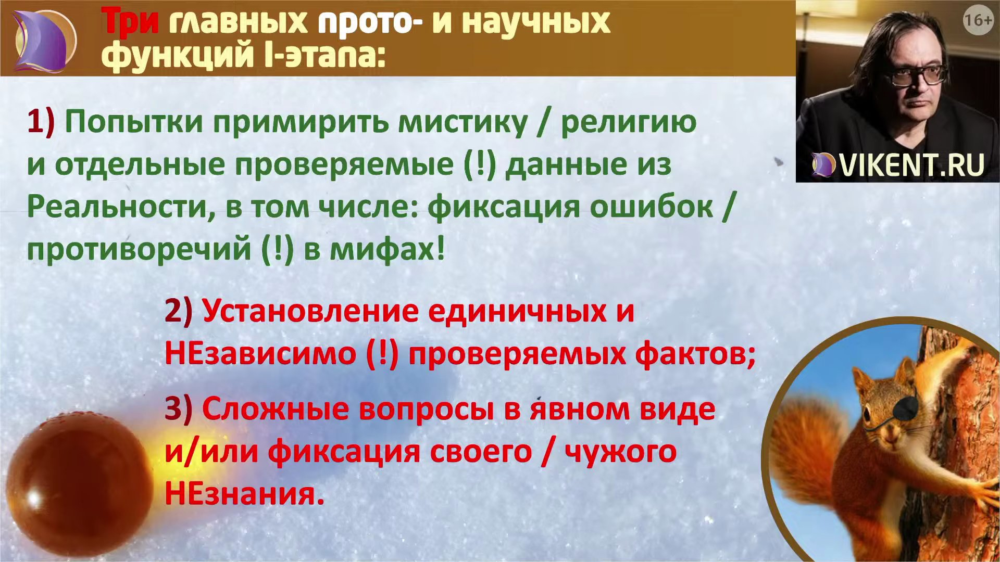

Соответственно, как бы вот главные про уже прото и научные функции. Вот зелёненькая, зелёненькая, напоминаю, у нас отмечаются у ней ученические щенячьи ошибки. То есть, если у нас появляется зелёный свет, тем более на фоне снега, этот снег я снимал во дворе своей школы, тут рядышком, как бы на фоне снега, то это некая ученические щенячьи ошибки. Ученические щенячьи ошибки. То есть есть целый как бы жанр публикаций, котором писа пишет профессура, пытаясь примирить религиозные дармасы и науки науки. Вот. Ну простим, простим им слабость ума. Соответственно, сильные ходы, сильные ходы на первом этапе, они единичные, мало кто на них способен, но именно поэтому я их называю. То есть установление единичных единичных, но проверяемых данных. Проверяемых данных, независимо проверяемых данных. Соответственно, вот есть такае выражение, там независимый эксперт, независимый там учёный и так далее. Вот я независимый учёный, действительно, как бы. И это очень дорого стоит. Очень дорого стоит. То есть, допустим, просто-напросто проводишь конференцию, тебе начинают ломиться знакомые, ползнакомые и так далее, отказываешься, ты остаёшься независимым учёным, как бы отказал по слабости доклада, тебя люди начинают поклинать как бы в тусовке, в социальных сетях и так далее. Вот независимость дорого стоит, в том числе на первом этапе, да? Соответственно, третье, некоторые сложные вопросы в явном виде. Люди сложных вопросов боятся. Они, и сегодня я как бы покажу, могут существовать минимум столетиями. Вот вопросы, не утверждения, а вопросы. Это такая очень долгоживущая, долгоиграющая пластинка. Но люди этих этих вещей обычно боятся. Какие люди? Учёные, изобретатели, разработчики, методисты и так далее. Вот пометьте себе, что обратите внимание на вопрос. они могут существовать неотвеченными такой, ну, такие консервы интеллектуальные. Вот они могут существовать минимум столетиями. Пример сегодня будет. Ну, я даю один пример. На самом деле таких примеров, естественно, больше. Ну, давайте следующий слайд. Ну, соответственно, Энгес здесь прав, да? То есть вот как греки, греки греки сложили сложили некоторые категории, особенно среди них преуспел Аристотель.

---

## [01:00:30]

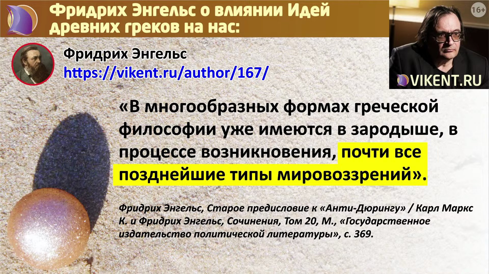

Аристотель он сложил некоторый панетийный аппарат. Кто не верит, зайдите на викенд, там это очень хорошо сделано. Вы будете удивлены вот категории Аристотеля не найдёте, пишите вконтакте, там ссылочку. Соответственно, вот он заложил некоторые категории. Вот несколько тысячелетий. Тысячелетия они существуют. То есть вот категории Аристотеля и вопросы, они существуют долго, намного, то есть намного дольше жизни отдельного человека. Ну, ну намного дольше. Ну, соответственно, если вы молоды, молоды вот как бы то, ну, вот мотайте на у мотайте на у. Правда, повторяю, категории Аристотеля, они хорошо продуманы. То есть, то есть таких попыток было потом безумное количество, но это была какая-то уже фигня. Аристотель всех опередил и сформировал наше мышление, в том числе. Ну давайте, идёмте дальше. Идёмте дальше. Вот, соответственно, скажем, вот моя рекомендация. Очень интересный момент, как бы почему я рекомендую, почему я рекомендую постоянно делать корректные ссылки, причём сразу же.

---

## [01:01:45]

То есть периодически мне присылаются какие-то там Google облака, какие-то даже слайды, где нет ссылок там. И человек говорит: "Я потом поставлю. Нет, сначала ты сглупишь в своей жизни, а потом ты поставишь". Говорю о человеку. Значит, соответственно, мой совет корректные ссылки на пришественников ставить сразу же. Зачем? Чтобы не вляпаться. Повторяю, отсутствие корректных ссылок, если вы собираетесь заниматься наукой, методиками, изобретательства на профессиональном уровне, просто сожрала массу людей, которые сами на ровном месте без наставника запутались и стали деградировать. Вот процесс интеллектуальной деградации, упоминаний безумное количество. Можете загуглить вот как бы так, ну, целевым образом только на моём курсе и на некоторых курсах учеников об этом упоминается. Соответственно, обратите внимание связку, которая, в принципе, тянет на доклад на конференции по картинам мира. Соответственно, очень мало людей, кто вообще занимался подчёркиванием фиксации незнания, иногда переводом это вопросы. Это Сократ. У нас у меня есть лекция по Сократу. Очень не слабая, кстати, недавно смотрел. Очень не слабая лекция. Каждому вообще как бы ученику, студенту вуза хорошо бы пересмотреть. По преподавателю вуза тем более пересмотреть и конспектировать. Далее есть некоторые религиозные автор Николай Кузанский. Николай Кузанский как бы вот, который говорил о том, что есть некое учёное незнание. Человек предполагал, предполагал, что вот есть незнание, и это есть некая ценность. Остальные пытаются, соответственно, как-то заболтать незнание. И, соответственно, вот это заболтанное незнание, типа душа танка, рано или поздно, естественно, когда её не будут ждать, вылезет. И как бы это может быть, ну, просто-напросто повторяю, я вижу массу людей и мужчин, и женщин, которые, а, позволили себя обмануть, а вторая как бы пожили жизнь зря, имея все данные состояться, быть интересным человеком, ну, и так далее, и так далее, и так далее. Поэтому, может быть, я, может быть, я как бы сделал много примеров, но повторяю, как бы есть как бы, ну, вот тот задачник, тот задачник, о котором я много раз говорил, поэтому как тема эта не дана, то, соответственно, одна из глав задачника - это примерно такая глава. Может быть, Иван Андреевич Павленко в своём задачнике, но это не в первом издании, а, наверное, во втором. То есть, соответственно, Игорьч Викич обладает навыком. Хвастаясь, хвастаюсь. Этому можно подорожать. Этому можно подорожать. Как бы я как бы довольно хорошо вижу, когда в некотором тексте научном, что чего автор не знает. Ну, человек просто не знает. Сегодня такие примеры будут ещё. Второе. Я вижу текст, что автор как бы знает, но скрывает. Вот глава как бы, что автор дальше возникает такой нефилософский вопрос: а почему автор скрывает? Ну такой как бы скрытый плагиат. Скрытый плагиат. Человек каких-то сильных публикаций как бы, ну, в частности моих, как бы явно знает и явно скрывает. Зачем? Зачем человек хочет деградировать? Да, человек хочет через какое-то количество лет начинается деградация. Деградация, соответственно. Я помогать не буду. Зачем мне помогать люди, которые даже не в состоянии именно сделать ссылку? Кто хочет его заразить, напишите под видео. По нашим правилам, да, как бы не по нашим правилам. Я вас выкошу. Вот, соответственно. Ну, идёмте дальше, давайте. Идёмте дальше. Идёмте дальше, да? Соответственно, скажем, да, вот, соответственно, вот очень хорошая книга.

---

## [01:06:00]

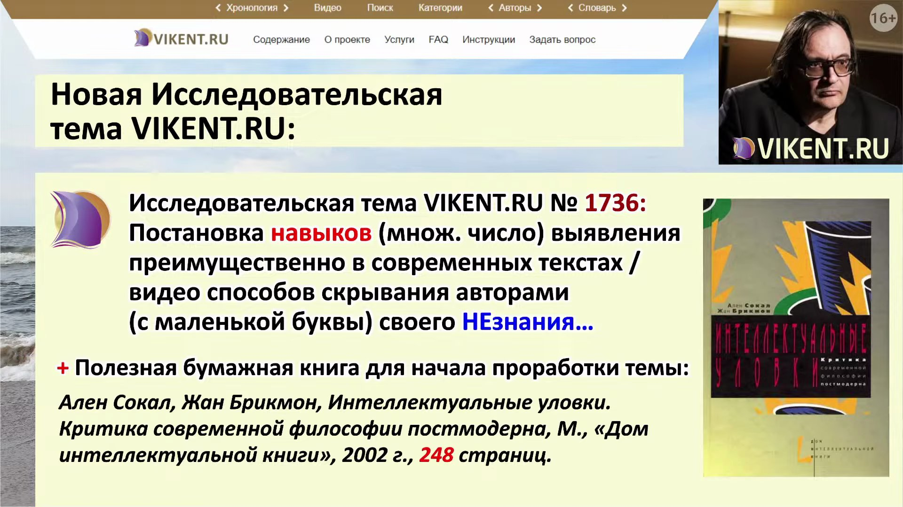

То есть, по-моему, впервые за там 12 или 13 лет я рекомендую книжку, как бы не связанную как-то с учениками и так далее. Вот, соответственно, написано, значит, чем хороша книжка. Значит, в книжке приводено много примеров. Обычно культурологи, философы, семиотики, они не в состоянии просто привести много примеров. Второе, чем хороша книжка взяты некоторые известные западные интеллектуалы, всемирно известные, и показано, как они, мягко говоря, не секут в в школьной программе. В школьной програм есть как бы и в вузовской программе. Соответственно, как эту книжку мой совет использовать. Ну, во-первых, это некая очень, я уже, ну, кто этим интересовался, уже разослал. Это это как бы первое некий кусок для задачника. Для задачника. Ну, ну только просто-напросто там преимущественно западные интеллектуалы. Надо добавить ещё русскоязычных. На мой взгляд, эта книжка очень хороший такая основа для серии докладов по картинам мира, по псевдонауке, по лже науке и так далее. Вот. Ну, соответственно, если взять русскоязычных интеллектуалов, то, соответственно, вот как бы русскоязычный вариант материалов полно ежедневно. Полно ежедневно. То есть любая книги по семиотике, по философии, по культурологии, пожалуйста, как бы вам источник. То есть поя книга вот этим чрезвычайно понравилась. И, соответственно, как бы ещё одна вещь, в книге этого нет, но мой совет задачник это включить. Итак, Итак, переписывая с разных источников, были созданы некоторые тексты Библии. И уже в древней Александрии, север Египта нынешнего, соответственно, нашлись умные люди, которые стали задавать вопросы по текстам Библии. По текстам Библии. И, соответственно, в древнем Александрии были препирательства. Одни спрашивали, задавали вопросы по текстам Библии, а другие пытались ответить. И вот, соответственно, скажем, тогда защитники Библии придумывали некоторую вещь, которая потом во многих религиях повторялось неоднократно, что тексты Библии можно, ну, ну, можно воспринимать буквально, а можно воспринимать метафорически. Это это повторяю, это нет, но это обязательно нужно включить в задачник, в доклады и так далее. Вот. Ну и, соответственно, если нечто можно воспринимать метафорически, то есть в некоторых культурах это тоже можно включить задачник, можно сделать предложе. Мужчина делает предложение женщины, а потом говорит: "А я метафорически пошутил". Ну, в некоторых культурах азиатских после этого начнётся Монтеки Капулетти. И нету азиатского Шекспира, который описал бы эту драму с кровищей, очередной кровищей. Всё это очень плохо, всё это очень плохо заканчивается. То есть, когда вы начинаете что-то толковать метафорически, попытайтесь в банке взятый кредит толковать толковать метафорически. метафорический, как бы вам как бы бездуховные коллекторы очень быстро объяснят как бы вот где реальность и где нереальность. Поэтому впервые для курса рекомендую книжку, повторяю книжку, соответственно, рекомендую вот кто интересуется наука, картино мира, лженаука, как бы вот проработать. Примеров масса, ну, преимущественно западных авторов, всемирно известных. Всемирно известных, да. А кого ещё интересует тема постмодернизма? Они начинают с этоговедения и так далее. Вот. Но эта книжка дотягивается до серии совершенно коммерческих продуктов. А мы давайте ещё один примерчик. Один примерчик давайте посмотрим. Давайте дальше. Да.

---

## [01:10:15]

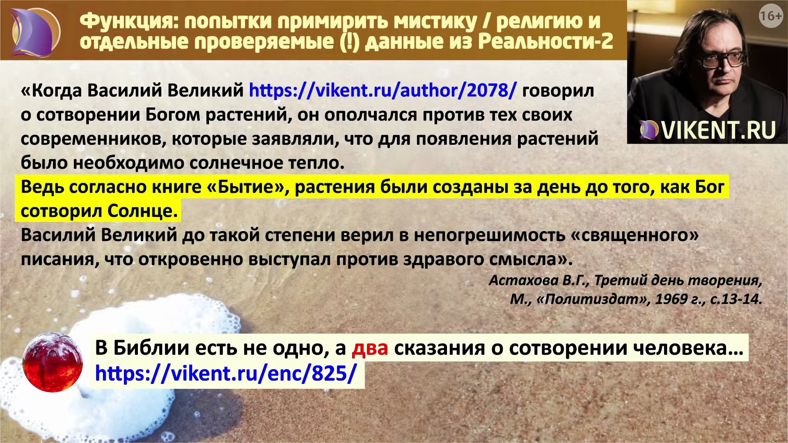

Ну, пока вы читаете, напоминаю, что Дикельбей ифин и Том Соер, соответственно, они поступали, соответственно, как вот мировые известности из предыдущего слайда, которые не осилили школьной программы и метафорически использовали её понятие. Они считали, что для того, чтобы свести бородавки, как бы, соответственно, нужно это делать непременно на кладбище и с помощью дохлой кошки. Вот таких дохлых кошек как бы полно и так далее. Вот. И вот посмотрите, пожалуйста, как бы чтовычайно полезно. В школе это не учат. И это тоже как бы некоторые задачник. Если кому-то не нравится слово задачник, соответственно Сергей Александрович Резников мне напомнил слово решебник в переписке. Вот. Да. Решебник. Задачник. Решебник. Кому-то не нравится это тренажёр. Ну, как бы плевать. Пусть вот навык мгновенного вытеснения. То есть в больших текстах, в больших текстах, как правило, как правило можно найти, можно найти, когда автор сам себя противоречит. Более того, автор сам это изъявнул. Автор это изъявнул, но это должно быть доведено до уровня навыка. До уровня навыка. Соответственно, скажем, ну, мы идём дальше. до уровня навык. Это я всё соблазняю по поводу задачника.

---

## [01:11:45]

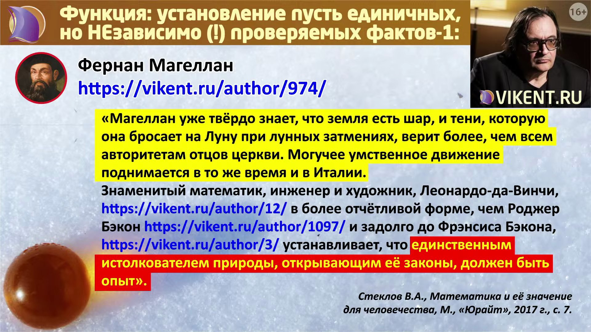

Вот теперь посмотрите, опять-таки, один человек, опять-таки человек ищущий по аналогии с Колумбом. Просто он не только как бы там сделал некоторые некие географические открытия, что-то ещё, как человек ищущий и так далее. Вот. Вот, обратите внимание, типичный человек такой хороший первого этапа, он как бы ищет и, допустим, на очень малых ресурсах, на минимальных ресурсах, тем не менее он делает открытие выдающиеся. То есть вот в этом отношении, то есть без образования, ну, при наличии скорее воли желания, но есть, но есть новая какая-то твёрдая опора. Почему я постоянно пытаюсь уговаривать людей, там сделать доклад по своей тематике, далее доклад развить в книгу, в тренинг, видеоканал? Как бы из моих данных, исследований следует, что подобно Фернану Магилану у вас должен быть не мой, а ваш личный твёрдый проверенный опыт. И вы начинаете всю вашу жизнь пропускать через ваш твёрдый проверенный опыт, твёрдую копию. И, соответственно, вы, у вас картина миров становится более более научной. Чужие данные, к сожалению, к сожалению, в отсутствии задачника, который ставит навыки классификации, этого не делает. Этого не делает. Да, таких задачников на всякий случай здесь монополии нет. Может быть много, много. Как бы много. То есть явно много, не один, как бы, и так далее, и так далее, и так далее. Потому штук пять легко. Даже, может быть, на одну и той же литературе штук пять легко. Ну вот, соответственно. Ну, идёмте дальше. Соответственно, идёмте дальше. Теперь русскоязычный, кажется, пример у нас. Так, так. Пам-пам-пам-пампампам-пам. Да. Вот посмотрите, пожалуйста. Довольно довольно довольно позднее наблюдение. То есть это уже XX век.

---

## [01:13:45]

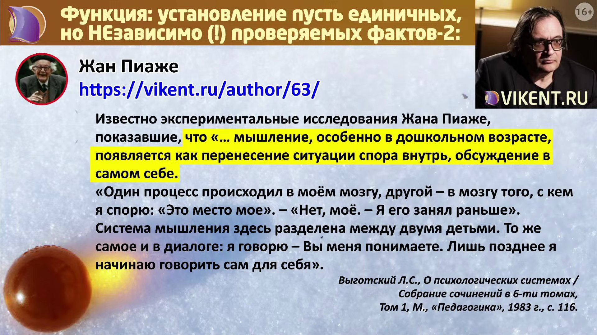

Соответственно, я цитирую по Выгодскому, как бы Повыгодскому цитирую сразу же, чтобы было два автора, но это сделал Жан Пиаже. Вот, грубо говоря, грубо говоря, Жан Пиаже, путём наблюдения, человек очень внимательный был, как и Мария Монтесори, соответственно, о том, что ребёнок ребёнок развивается, запихивает диалогии, диалогии более широ широко полилогии, то есть когда много людей участвует, запихивая себе в голову, иногда происходит сбой, и ребёнок поче почему-то, ну, может быть, болен, может быть, плохая социальная среда вот не в состоянии запихать себе другого человека в голову. Реакция другого человека, но это беда для родственников, беда для коллектива, для начальства, беда для детей. Ну, соответственно, скажем, как бы, ну, просто-напросто иногда на уровне просто наблюдения за детьми. И чем интересна в этом отношении школа Марии Монтесурии? Как бы я не знаю, она ориентируюсь на Жана Пиаже или сама это сделала, этого я не знаю. скорее всего, сама просто естьнапросто наблюдение, например, за спящим младенцем. И монтесои педагоги как бы вот просто-напросто имеют свою такую интуитивно понятную базу наблюдения. То есть просто оказывается вот, ну, в простейшемребстейшем варианте ребёнок спит, младенец спит. Нет, он он шевелится, он чмокает, что-то ещё. Вот, очень внимательно наблюдая, особенно если вести дневник, то есть мы начинаем очень глубоко, интуитивно, да, оборудование ноль, оборудование ноль имеет вот свои личные наблюдения и мы начинаем воспитывать свою свою личную интуицию, соответственно. А остальные, а остальные, повторяю, прошу меня поверить, ну, проверить в любой крупной, крупная - это областная, любой крупной областной библиотеке, если вы возьмёте книги по филологии, семиотики, там, культурологии, там, соответственно, как бы постоянно восхловляется Михаил Бахтин. На всякий случай у него был брат Николай, но это, как правило, люди не знают. Бахтин. Бахтин большая умница. Он нашёл очень важно, несколько таких вот, ну, что ли, практик, некоторые вещи он даже выразил, ну, этого он не знал, но он выразил в формулёвках близких к эвыстикам, но он не дожал. Так вот, соответственно, вы найдёте тома, тома эшелона литературы, когда человек просто-напросто выявил в средневековой культуре несколько практик, учитывая, что у филолв, культурологов, семиотиков каких-то своих идей нет вообще, то есть вообще нет. Я занимался приёмами журналистики, я так уверенно это говорю, то, соответственно, буквально несколько идей очень простеньких Бахтина, то есть Бахтин молодец, он сделал несколько, нашёл несколько эффектов средневековой культуре. То есть они они цитируют просто-напросто как бы они правильно делают, что они цитируют, неправильно, что они не идут дальше, потому что следующий шаг, количество эвыстик там должно быть не 2тче 5, как у Бахтина, а должно уже измеряться сотнями. Кто это понял? Кто это понял? В XX веке это был, в принципе, один человек Генсович Альшулю. Ну, объяснить даже под давлением как-то ещё ученичкам не смог. Ну, 19 октября, соответственно, буду рассказывать Патрис. Часть вопросов, как ни странно, уже пришло. Хотя вы присылайте. Ну, повторяю, как бы я сейчас призываю иметь такую, ну, свой на первом этапе иметь свои какие-то начальные разработки, которые не требуют никакого оборудования, не требуют никаких денег, они требуют просто воли, ну, хотя бы школьного образования, даже не вузовского, то есть. Но мы идёмте дальше. Мы идём дальше. Идёмте дальше. Вот вы видите просто такого много, такого много. Соответственно, соответственно это, господи, я сейчас не помню, какой век, соответственно, я не помню, какой век, по-моему, тринадцатый, по-моему.

---

## [01:18:15]

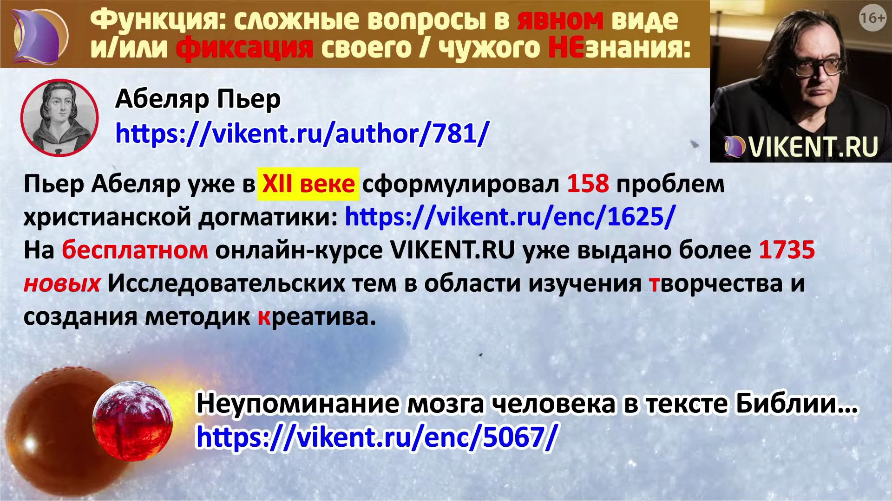

Ну, могу ошибаться, в данном случае неважно. То есть вот обратите внимание, просто-напросто Пьер Обелях, он есть на портале как следует, он нашёл 158 проблем христианской догматики, противоречий в Библии, в Писании и так далее. Вот. И, соответственно, он никак не мог найти в Париже, кого бы вызвать на на диспут. Повторяю ещё раз некую максимуму, которая чрезвычайно полезна. Вот некоторые нерешённые вопросы могут существовать либо существовать столетиями. Традиционная традиционная тактика людей, кто не занимаются у меня на курсе, их пытаться а не замечать, ну, старухиная позиция, либо забалтывают, либо психозащиты по Анне Фейд, Анна Фейт тоже есть на портале, посмотрите, которая выявала первые несколько психозащит. По идее, интеллектуал должен знать их наизусть. По идее такая идея тоже у нас мелькала. То есть нужен нужен задачник по психозащитам. Я такой темы не давал, потому что я очень боюсь, человек, который напишет задачник по психозащитам, он просто-напросто будет ненавидеть людей. То есть как бы поэтому вот я устно даю такую тему и боюсь её давать. Хотя, хотя нужно, может быть, раскидать этот задачник, не знаю, на 20 людей. То есть, чтобы просто-напросто самого человека не портить, потому что везде видишь идиотов. Везде видишь идиотов. То есть так больших и маленьких, больших и маленьких. А всё очень не видно, просто анализируешь устные письменные высказывания. О телевизионных текстах я даже не говорю. Дальше идёмте дальше. Да. Так. Ага. Соответственно, скажем, Ахка в Маринской больнице. Вот. Соответственно, давайте посмотрим. Я об этом, в принципе, уже проговорил, подготовил ваше восприятие. Итак, ошибки не идиотов, ошибки образованных, умных людей самомнением, в которые они вляпываются.

---

## [01:20:30]

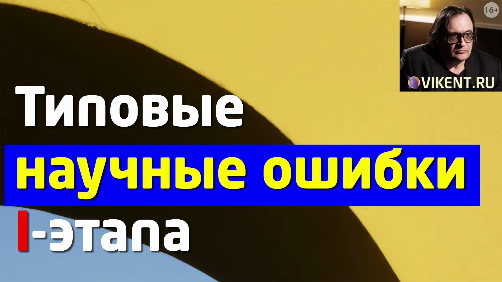

И гляч, а как часто они вляпываются? Веками вляпываются. Веками вляпываются. Ну, давайте смотрим. Давайте посмотрим следующий слайд. Да. как бы, да, и так далее. Вот как бы, да, соответственно, вот некая цитата. Почему-то не сделали курсивом блаженного Августина и так далее, и так далее. Вот как бы, да. Вот, соответственно, как бы вот посмотрите, пожалуйста, как бы, да, как бы пункт один, да, это очень высокий полёт.

---

## [01:21:00]

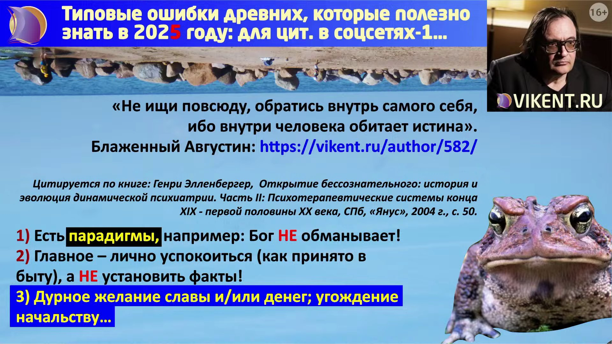

полёт. Мы об этом уже говорили, как бы анализ парадигм, то есть на портале моих данных не опубликовано, это сделано. Соответственно, если человек систематически занимается там анализом научной деятельности, изобретательской деятельности, профессиональной, высокопрофессиональной методической деятельности, то рано или поздно человек выходит на некоторые на некоторые парадигмы, то есть неявные допущения. Ну, одно из неявных допущений, которые существует тысячелетиями, вы видите, оно написано, оно неприятно, возможно, будет для людей религиозных, но тем не менее, ну, читайте Станисовале Лема, он как бы смягчил ранне христианскую догматику, где такие же теисы были, ну, без ссылок на раннюю христианскую догматику. Он об этом как бы писал, что Бог, например, может там может просто пошутить. Вот Бог может, он же всемогущий Бог. Почему вы считаете, что он именно над вами не пошутил? Вот почему? Почему не пошутил? Соответственно, скажем, пункт два. Масса людей, соответственно, скажем, обломали собственную жизнь. Я как бы не о моей, а как бы о чужой жизни. Соответственно, как бы постоянно врали. Вот над этим висит тень Анны Фейт. которая к дню рождения папы в 1936 году, соответственно, сделала разработки. Фрейд это дело нашёл, Анна это сделала. Вот это развивается до сих пор. Сейчас нашли безумное количество психозащит. Ну, в принципе, в принципе для первого варианта задачника в моём понимании вполне достаточно то, что сделала Анна Фейт. Вполне достаточно, чрезвычайно полезно и так далее, и так далее, и так далее. Вот у меня ухо заточено, у меня этот навык есть. Как он у меня поставился, не знаю. Сознательно не ставил. Просто читал большое количество литературы, и как-то он у меня сам поставился. Вот поэтому я не не не пишу этот задачник. Соответственно, некое дурное желание славы, особенно денег, либо угождение начальству - это ещё один из таких стандартных вариантов просто-напросто. Ну вот, м вырыться. Ну очень простой вопрос, который с одной стороны он бывает как бы похожие вопросы и папа Копица, и как бы его сыновья задавали. То есть, в принципе, он как бы м задавался не только ими, разными авторами, что когда вы делаете какой-то там доклад, делаете такую-то книгу, пишете, то, соответственно, а будет ли это существовать лет через 20? А лет через 50 это будет какая-то ценность. Вот и сразу же всё становится ясно. Вопрос чрезвычайно простой. Здесь главное не вопрос, а как бы, ну, честный ответ. Но если врать, ну, ну, Анна Фрейд вам в помощь. Психологические защиты. Идёмте дальше. Идёмте дальше. А, Анна Фейт есть на портале, да? Это продолжение, соответственно. Вот четвёртый момент, повторяю, оченьочень характерен и для мужчин, и для женщин.

---

## [01:24:30]

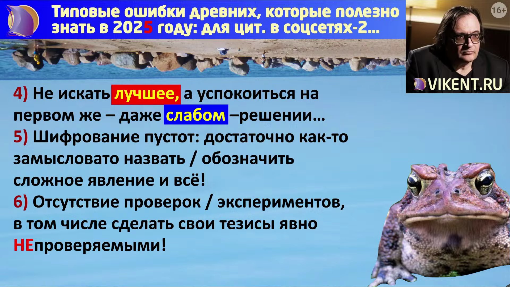

Гендера здесь не вижу. Масса людей не хотят ничего не решать, ничего не разрабатывать. Люди хотят успокоиться. В моменте, в моменте это даже хорошо. В перспективе 15, 20, 50 лет это может оченьоченьочень не слабо прилететь. Очень не слабо прилететь. Далее, пункт пятый. уже было и, по-моему, и, по-моему, будет и, по-моему, ещё будет шифрование пустот. Соответственно, это очень перекликается с книжками по антропологии, по археологии, то есть для массы как бы первобытных племён современных, как бы, если они к чему-то могут придумать название, то они по умолчанию считают, что они как бы как бы поняли. Вот масса людей, имеющих высшее образование, тоже занимается шифрованием пустот. Они как бы назвали, и они считают, что как бы поняли. На самом деле они назвали и так далее. Вот, соответственно, есть Рудольф Штайнер, как бы есть Вальдовская педагогика и Штайн. Штайнер Штайнер явно был с элементом шизофрении. Ну, просто если вы читаете его текст или дайте психиатру профессиональному почитать, ну, явно шизофреник, он считал, что как бы поскольку Сириус наиболее яркая звезда, люди пришли из Сириуса. Вот проверяйте меня, я в таких вещах не ошибаюсь, да? То есть вот, соответственно, некое шифрование пустот, откуда взялись люди. Очень сложная тема. Там как бы эволюционисты спорят, много людей спорят, там масса проблем и так далее, и так далее. Вот. А всё очень просто. Люди пришли силы Сириуса, Сириуса и так далее. Вот следующее шесть шестой. Масса людей с высшим образованием, болеющие такие полукультятиной, они страшно боятся проверок. Они страшно боятся проверок, сравнений и экспериментов. То есть, соответственно, один из поводов, один из поводов, как бы люди начинают меня на моих очных мероприятиях ненавидеть, потому что они понимают, что, ну, мягко говоря, меня не переспорить. Мягко говоря, я много чего знаю, много чего умею. Это повод для ненависти. Но, как ни странно, как ни странно, обратной реакции такой же с моей стороны нету. Я предупреждаю о рисках, которые они в скрытых рисках вляпаются и может быть через 10 лет, может быть через 15, ну и так далее, и так далее, и так далее. Вот у меня есть ряд модельных объектов, когда люди, соответственно, как бы были предупреждены мною коллективно, и они вляпались, вляпались, вляпались. Ну давайте идёмте дальше. По жизни вляпались, по жизни вляпались и так далее. Вот как бы, да. Вот, соответственно, некое посвящение академик. Она уже стала академиком, академиком Российской академии образования Татьяна Викторовна Черниговская.

---

## [01:27:45]

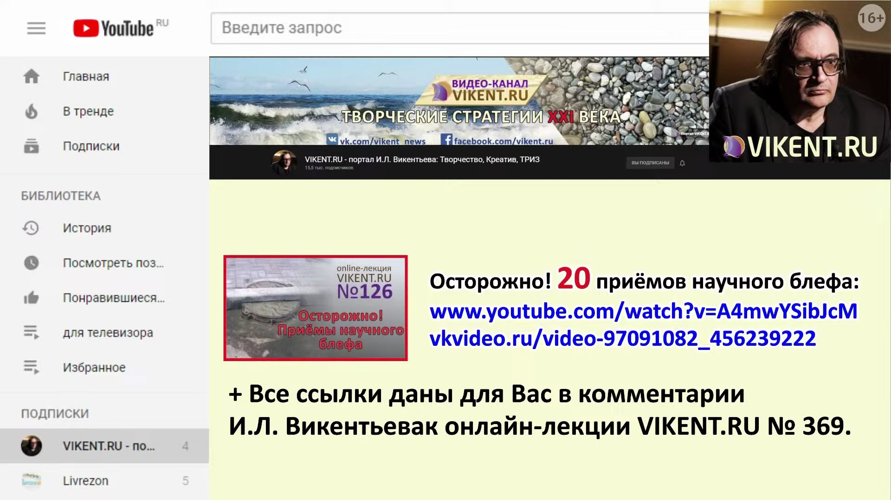

Соответственно, репетируя вот это вот видео, то есть я сначала отрепетировал библиотеки Маяковского, а потом как бы уже сделал видео. Очень хорошее видео, хотя жёсткое. Хотя жёсткое. Соответственно, перетащили для вас на ВКонтакте. Будут ссылки сегодня же как бы, да, это как Татьяна Викторовна Черниговская академик, как она научно блифует. Вот как она научно блифует. Повторяю, таких академиков, докторов наук, членов корреспондентов по России десятками, ещё раз, десятками, и важно не попасть под их интеллектуальное влияние. Кто хочет спорить, пожалуйста, по нашим правилам принимается в неограниченных неограниченных объёмах. Вот неограничены в объёмах. Ну а мы идёмте дальше. Дальше аналогичны и так далее, да? Вот посмотрите, пожалуйста, это как раз вот шифрование пустот. Как бы вот есть какая-то очень такая навороченная фраза.

---

## [01:28:45]

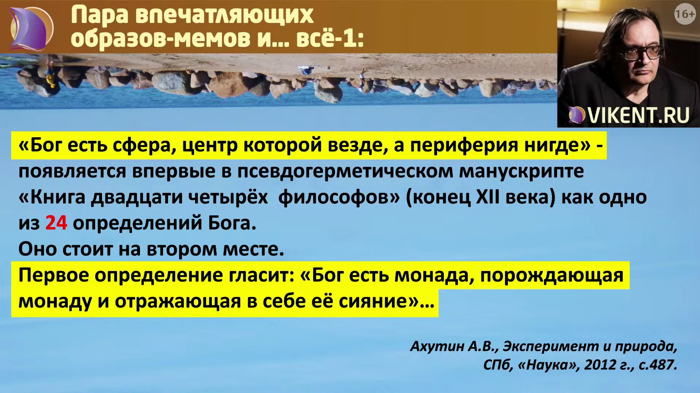

Навороченная фраза. Её можно запомнить. Её можно запомнить, как бы понять её довольно трудно, мягко говоря, как бы мягко говоря. И вот, соответственно, вот если вы видите, читаете, чувствуете, конспектируете где-то похожие фразы, вот, соответственно, как бы и начинаете как-то пользоваться, практиковать, всё может быть чрезвычайно чрезвычайно чрезвычайно печально. Чрезвычайно печально. Повторяю, примеров очень много. Примеров очень много. Рычард Докинс это называл мемы. Вот. Ну да, можно сказать, что это мем запоминающийся. То есть с точки зрения формы сказано хорошо, очень загадочно. Вот как бы есть такой эффект Барнума. Багнум - это такой американский предприниматель, который просто-напросто в середине XIX века поставил ряд экспериментов. Ну, соответственно, как бы и нашёл, он тоже есть на портале, есть, естественно, в интернете, который просто-напросто написал там книгу своих воспоминаний, что вот просто подобными загадочными фразами очень легко дурить людей. вещ. Поэтому образ мем, то есть эффект барнума уже не влезал, но это эффект барнума. Барнума. Вот, соответственно, кого это интересует, ну, гуглите, гуглите, найдёте, как бы, и так далее. Вот. Далее, соответственно, я уже повторил ещё раз, я ежедневно вижу дамские посты, где они рассказывают какую-то женской духовности. женской духовности, просто духовной духовности, какой-то там что-то ещё и так далее. Вот это сказал Плотин. Первый это сказал Плотин. Плотин - это римский автор. Это I век нашей эры. Иногда это поминал, довольно редко это поминал Френд, но дамочки это поминают е ежедневно ВКонтакте глупеют на глазах. Почему у дамочек есть высшее образование? И, соответственно, просто-напросто даже не решение задач, просто курс физики для средней школы по теме энергия, импульс они мне точно не сдадут. Дамочки, дамочки, не сдадите. Это повод для ненависти. Я знаю, я знаю, как бы, как я к вам и хорошо отношусь. Давайте дальше. Давайте дальше. Ну, то же самое. Шифрование пустут. Ну, в данном случае пишет Карл Поппер. Карл Поппер, малоизвестный случай, он на портале, кстати, есть, о том, что он, будучи молодым человеком, устраивался на работу.

---

## [01:31:30]

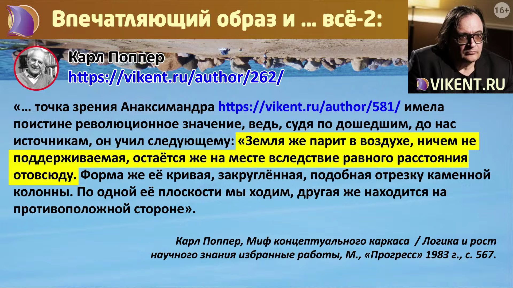

Работа не была связана с наукой, но, соответственно, его начальник любил разоблачать какие-то мифы. Любил, ну, такой вот хороший наставник попался, да. И вот как бы Карл Поппер вошёл в историю XX века как бы своими недовериями. Карл Поппер вот образуя связку Сократс, Николай Кузанский, Карл Поппер, который задавал вопросы, был чрезвычайно недовержив. Вот классическая вещь сказана очень сказано классно. сказано классно понять это, мягко говоря, невозможно. Ну, соответственно, давайте мы как раз уже полтора часа работаем, устремляемся к концу. Ну, поехали следующий слайд. Три функции именно методик. Именно методик. То есть до этого была у нас СМИ с наукой, изобретательство методики. Сейчас мы вот именно методик, то есть когда мы делаем некие результаты доступные. Первым, об этом сказал очень хорошо Генри Форд, как бы м о демократизации. Вот.

---

## [01:32:45]

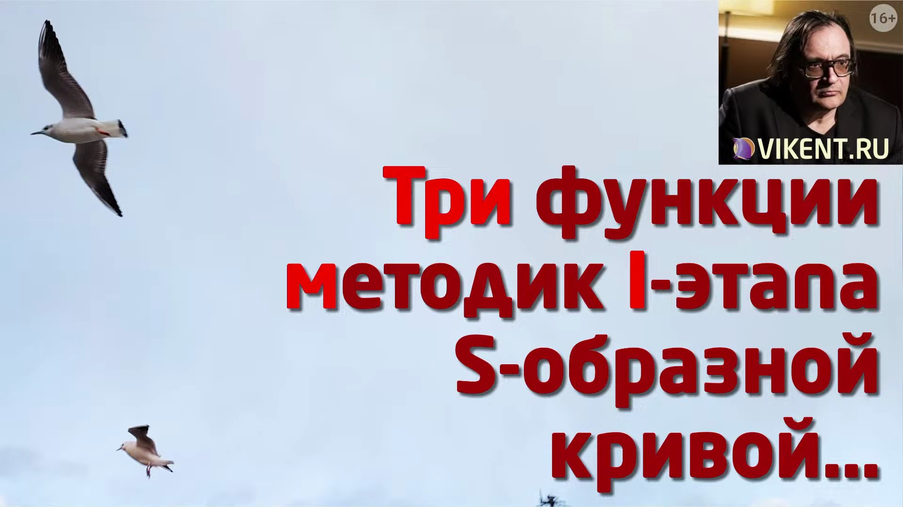

То есть в определённом смысле науку тоже можно, можно и нужно демократизировать, делать высоколобые научные достижения, ну, для тех, кто, по крайней мере, хочет вкалывать, учиться, выполнять домашние задания и так далее. Вот. Ну, давайте, давайте, давайте следующий слайд, да? Соответственно, вот некоторые главные главные методики и так далее, которые, ну, очень желательно очень желательно понимать на первом этапе.

---

## [01:33:15]

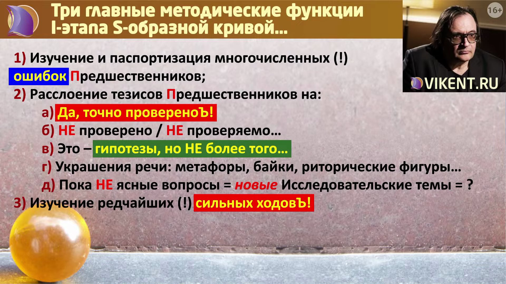

Повторяю, методики на первом этапе они не выражены, они перемешаны с изобретениями, с некими редкими научными открытиями и так далее. будет. Тем не менее, нужно знать, нужно пытаться искать. Например, например, я много раз об этом рассказывал, что в Египте был изобретён так называемый египетский треугольник. Это некая верёвка. На одной стороне три узла, четыре и пять. Вот если эту верёвку натягивать, получается довольно строгий прямой угол. Аналогично есть китайский треугольник. Китайцы, вероятно, независимы от египтян, то же самое такую верёвку с узлами тоже и забыли и тоже ею пользовались. То есть на первом этапе бывают какие-то твёрдые вещи. Далее, по идее, по идее египтяне должны были перейти к теореме Пифагора. Теореми Пифагора. И далее данные разнятся. Некоторые говорят о том, что Пифагор, как бы всё-таки египтяне дошли до теореме Пифагоя. Пифаго заимствовал у них. Другие говорят, что Пифагору сделал, я не знаю. Но мне важно сказать, что на первом этапе бывают некоторые твёрдые твёрдые твёрдые факты, как бы твёрдые факты, и желательно их так, ну, что ли, освоить и, соответственно, скажем, плясать от них. Плясать от них. Далее, пункт Б. Ну вот нужно очень чётко осознавать, не знаю, подчёркивать там кружком и так далее. Вот что не проверено, что является лишь гипотезой, предположением, но не более того. Вот. Далее, что является неким украшением речи? Вот недавно Владимир Владимирович Путин, по-моему, это было в Китае, я знаю в пересказе, то есть я сам не слышал, но человек надёжный очень пересказывал. Думаю, что так оно и было. Он такой привёл метафору о служенном кругозуе, что как лягуха на дне колодца. Ну да, это такое типовая метафора, байка, как бы исторический анекдот. То есть очень хороший образ, как бы как бы, но это не означает, что как бы нужно как бы быть лягухой на дне колос. Это не означает, это не более, чем украшение речи, как бы, да. И, соответственно, скажем, один из самых сильных ходов, как бы ходов, как бы это некие вопросы, вот как бы и, естественно, изучение сильных ходов. То есть сильные ходы есть всегда. Другое дело, грубо говоря, как бы почему тренеры и как бы м тренеры, консультанты и коучи завалили свои варианты трис, хотя хлестались в том, что они сделают свой трист. Да, да, да. они за год сделают о том, что как бы просто-напросто даже если вы читаете хорошие книжки, то есть, грубо говоря, такие примеры единичные, то есть сильные ходы. Ну, под сильными ходами можно понимать и примеры, и ошибки, и лучшие практики, и эстики, там, прототипы эвостик и так далее, и так далее. Они единичные, но тем не менее вот должна быть нюх, должен быть навык на сильные ходы. Это сильная игра на первом этапе, то есть ресурсов мало, ну и так далее. Вот. Ну наиболее стратегичные люди, типа там Геннаха Савовича Альшулера, они создают ресурсы на первом этапе, для второго этапа уже для учеников. Я пытаюсь подражать всегда, даже, может быть, избыточно, соответственно, ну, ссылаясь на Генахсочальшу и так далее. Вот. Ну, надо снимать шляпу перед великим человеком. Давайте дальше. Вот наш Василий Осипевич Ключевский очень чётко отчеканил несколько, ну, в принципе, то, что я говорил на предыдущем слайде, только чуть-чуть на другом материале.

---

## [01:37:30]

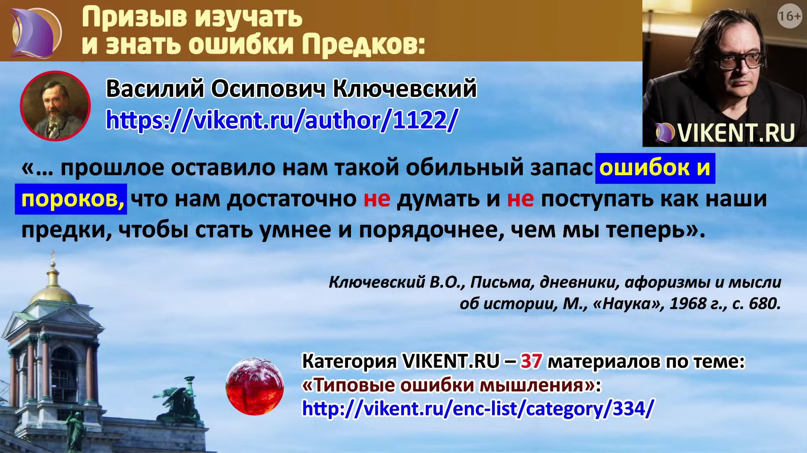

Ну и, соответственно, обратите внимание, есть некая некая категория. Я её немножко искусственно прервал. То есть она могла, в принципе, быть 237 или 337. То есть материалов полно, но это получается некая такая вот дурная бесконечность. То есть где-то там штук 30 собрал, там 37, да, и дальше искусственно не развиваю эту категорию. Слишком слишком много, слишком много. и так далее. Давайте следующий слайд - это иллюстрация того, что я назвал. Вот, пожалуйста. А подождите, нет, как бы Нет, нет, подождите, это уже Подождите, сейчас Кант у нас должен быть. Давайте поищем Канта.

---

## [01:38:15]

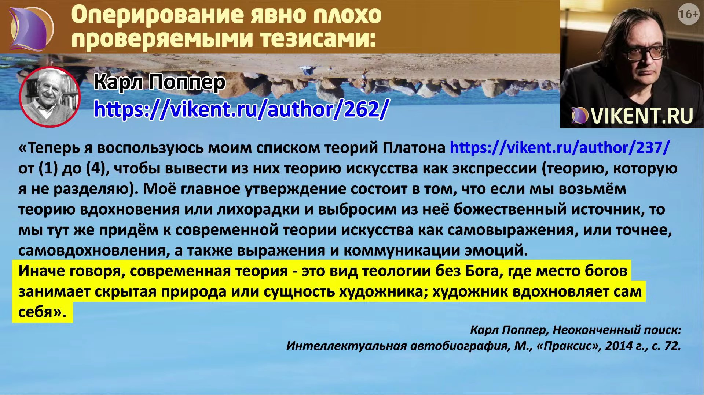

Кант, да. А вот, да, ну давайте, да, значит, как бы Кант. Вот Эмануил Кант. Посмотрите, пожалуйста, вопросы, которые актуальны. Они такие вот хорошо законсервированные интеллектуальные интеллектуальные консервы такие вот, которые, в общем, каждый человек решает сам.

---

## [01:38:30]

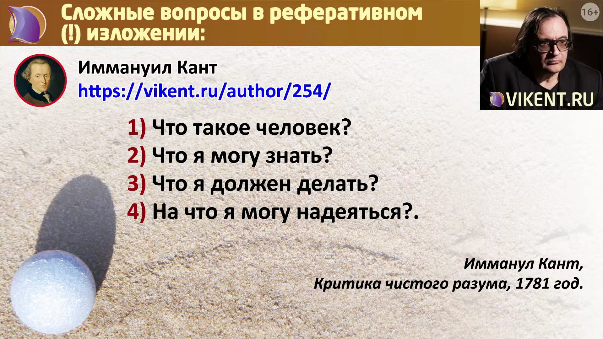

Как правило, решает плохо. Как правило, решает плохо. По уверению Канта, он критику чистого разума обдумывал 12 лет. Он тогда был подданным России. И, соответственно, через 12 лет издал выгин. Ну, тоже на территории России. Тоже на территории России. Как ни странно, вопросы с первого этапа, ну, довольно долго, довольно долго существуют. Ну, мы даже немножко перелезли полтора часа. Давайте уже идём на выводы. Идёмте на выводы, да, так далее. Вот. Да. Большое спасибо, значит, как бы Магарите Маргарите Корлово, Маргарите Геннадивны Кырлово за фото лестницы.

---

## [01:39:15]

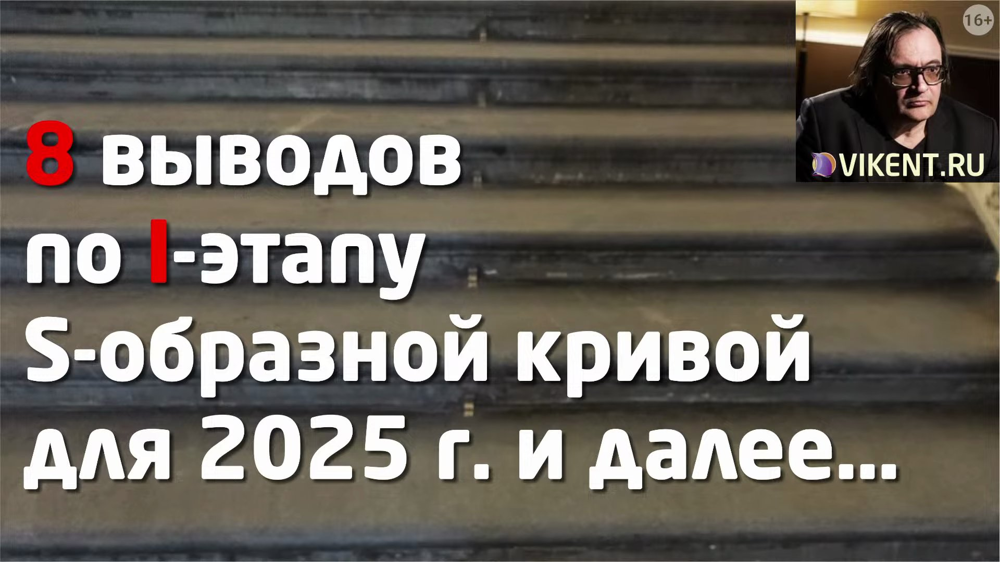

Давайте дальше писи. Давайте, соответственно, скажем, да, соответственно, вот желательно не смешивать, хотя на первом этапе, как правило, они смешанные, дальше они всё больше и больше будут разделяться.

---

## [01:39:30]

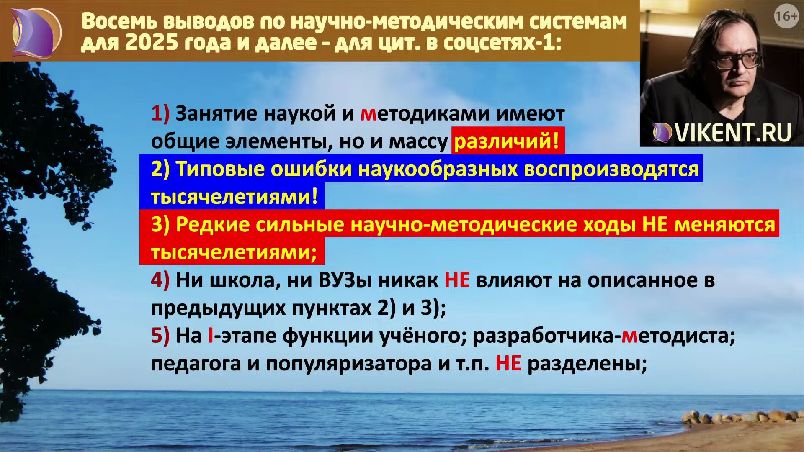

Как бы они имеют какие-то общие элементы и общее различия. Вот в том курсе, который я собираюсь прочесть, соответственно, для нас наука не более, чем чем питательная питательная среда. Хотя у меня есть закрытые материалы где-то закрытые материалы, как решать научные задачи. В академии наук я отслеживаю эту тематику, соответственно, десятилетиями. Ничего близкого к тому, что я уже сделал, нет, как бы, да, там тому, что я нет, как бы, да, соответственно, скажем, да. Соответственно, пункт два, типовые ошибки, которые делают некоторые наукообразные существа. Они могут заниматься, опять-таки, наукой, могут заниматься, пытаться заниматься разработками, преподаванием, изобретательством. Они воспроизводятся тысячелетиями. То есть вы увидите на втором этапе, на третьем этапе сообразной крывой, что количество ошибок оно будет только, ну, количество ошибок будет нарастать. Ну вот и ошибки первого этапа, они будут тиражироваться. Жизненно опасно попасть в организацию либо к научному руководителю, который слабенький, либо который болеет этими ошибками, как бы, да. Соответственно, пункт третий более оптимистичный, но на первом этапе он как бы исчезающе редкий. Опыт показывает, что, соответственно, у нас на конференции бизнес-консультантов, коучей, коучей и бизнес-тренеров прошло более 3. 000 человек. Это не считая других конференций. Там, значит, думаю, что и по четыре будет, соответственно. Ну вот возьмём нижнюю границу. 3.000 человек без моей помощи какие-то редкие, сильные ходы найти не в состоянии. Вот сначала нужно найти несколько сильных ходов, создать себе некое ядро, некое ядро интуитивно понятно, платформу, ресурс, называете как называете, как хотите. И, соответственно, и соответственно тогда уже что-то может, ну, человек может быть конкурентноспособный, конкурентоспособность, опять-таки, в масштабах там города, в масштабах страны, масштабах материка, ну, и так далее. много раз не говорили, к сожалению, да, опровержение понимаются пачками. Ни школа, ну, я имею в виду старшие классы, не вуз вообще никак не влияет на эффекты, описанные в предыдущих пунктах. Вообще никак не влияют. Если они как-то влияют, ну, напишите мне. То есть как бы, ну, это должно быть не лирические растрёпанная история. Лирические растёпанная история. Хорошо отношусь к женщинам. Не все женщины хорошо ко мне относятся. Оккультистки относятся ко мне как ло плохо. Я об этом знаю. То есть как бы можете мне об этом не сообщать, я и так об этом знаю и так далее. Вот пятое. Я уже говорил много раз, что как правило, как правило, на первом этапе просто человек как бы и наукой занимается, и изобретением, и там пинками голяет, гоняет матросов, как Фернан Магилан и прочее, прочее, прочее. То есть это не разделено. То есть к к третьему, к четвёртому этапу появляются компетенции, которые, соответственно, то есть только среди методистов появляются разные компетенции. То есть как бы очень много я сделал для формирования компетенции разработчика методиста, опять-таки Генна Соровича Альшулер, котором будет посвящено целиком консультации 19 октября, воскресенье. Задавайте ваши вопросы. Да, пойдёмте дальше. Да, идёмте дальше, дальше, дальше, дальше, дальше, дальше идём выводы. Да, выводы, да, выводы. Так. Ага.

---

## [01:43:30]

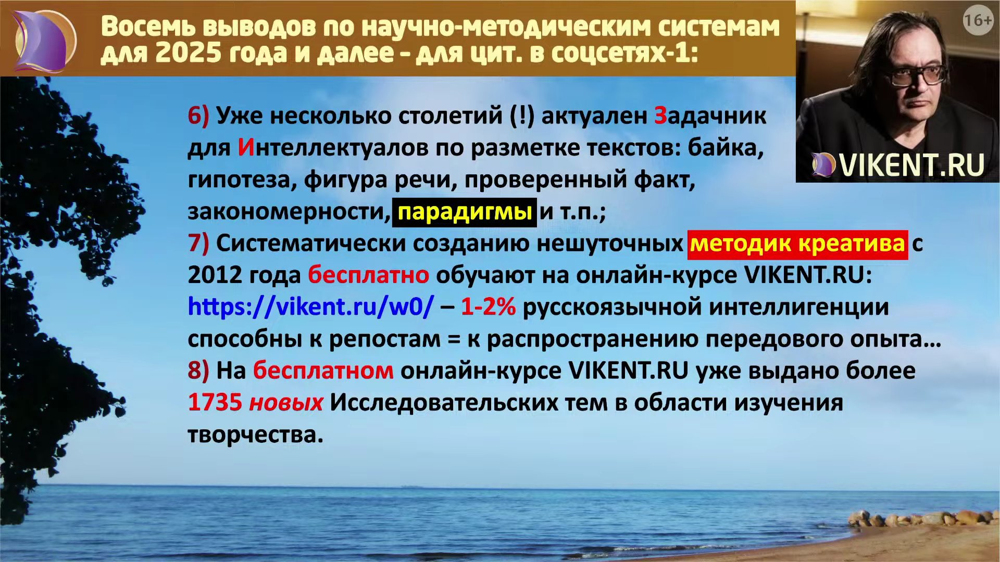

Соответственно, вот напоминаю, то есть я не повожу номера, потому что я несколько раз говорил, то есть некоторые усиления там, может быть, с психозащитами, что-то ещё, но вот какой-то такой задачник зреет. Может быть это, я вообще против обычно коллективного творчества. Может быть, это коллективное творчество, потому что, повторяю, повторяю, вот меня периодически, значит, кто-нибудь из домашних ругает, как бы, потому что я смотрю терегенную програм программу под еду и как бы комментирую интеллектуальный уровень каких-то федеральных экспертов в звании там доктор наук, член-корреспондент, академик и так далее, и так далее, и так далее. Вот. То есть, ну, у меня есть поставленные навыки и глупости я вижу за секунды. Вот. Но это портит характер. Портит характер, к сожалению, да. Соответственно, так далее. Вот где обучают, надо понимать, надо понимать как бы вот наш курс. И, соответственно, наш курс способный репустить 1-2% тех людей, кто так или иначе смотрит, пользуется нашими благами и так далее. Вот это исторические данные. То есть я надеюсь, что скоро скоро даже примерно знаю, кто, соответственно, будет излагать историю курса Викенд. Ну, для истории курса Викенд надо прекрасно понимать, что 1-2% русскоязычной интеллигенции в состоянии сделать репост. состоянии сделаете пост. Чрезвычайно печально, но это надо знать, как бы, да. Соответственно, ну вот уже выдано 1700, ну, более точная цифра, если бы вы были внимательны, 1. 736 36, соответственно, скажем, некоторых тем, некоторых тем. И, соответственно, давайте дальше. Некоторый печальный пример. Некоторый печальный пример. Вот Константин Эдорович Салковский, замечательный человек, много как бы сделал, соответственно, не занимался на моём курсе.

---

## [01:45:45]

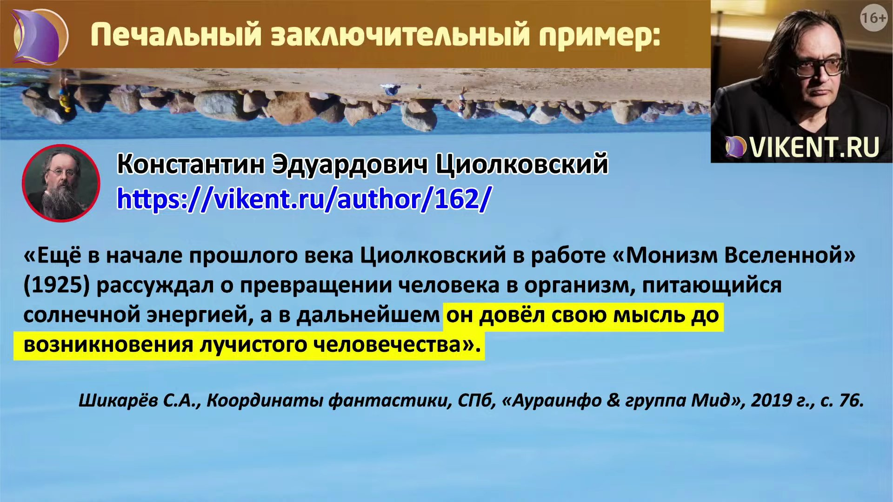

Я, кстати, не шучу, я не шучу, не занимался и как бы периодически впадал в окультятину. Причём это неоднократно. Я взял кусок, как бы, который, ну, коротко на слайде. Таких кусков у меня по Солковскому много. К сожалению, умнейший человек, начитанный человек, ну, впадает в окультячину. Очень велики соблазны, очень велики соблазны и так далее. Ну, совсем переходим к концу. Соответственно, сейчас пойду к благодарности, благодарности коллегам, кто помогают. Значит, пирамиду снял Анатолий Александрович Жачков. Как бы удивительно, что это на ветру Финский залив, что она не валится. Он снял на Финском заливе. Значит, благодарности Максиму Васильевичу Денисову и Фёдору Сергеевичу, значит, Кенкину Алексею Александровичу Самойлову.

---

## [01:46:30]

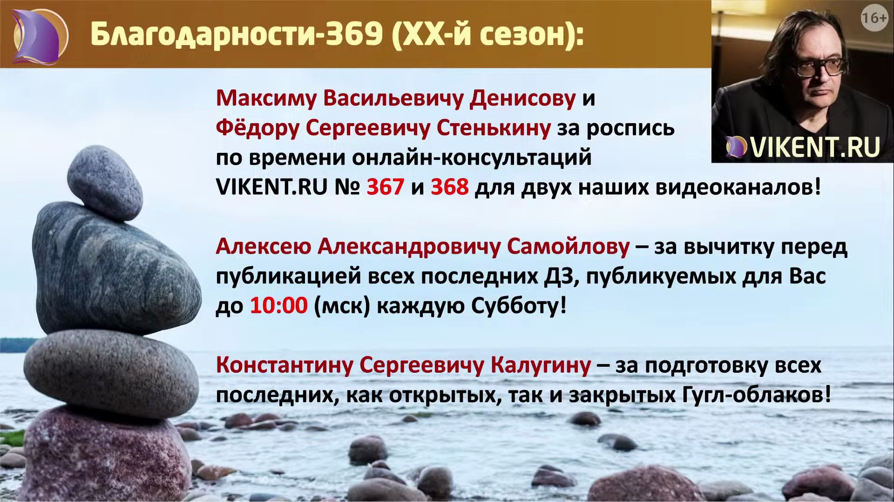

Он вычитывает все домашние задания. Значит, Константин Сергеевич Калугин рассылает. Значит, рассылка была и сегодня ещё одна была рассылка, как бы большое спасибо. они помогают делать. Соответственно, идёмте дальше. Соответственно, 15%, я думаю, ещё несколько процентов мы добавим. Мы видео с Ютуба перекачиваем потихонечку ВК.

---

## [01:47:00]

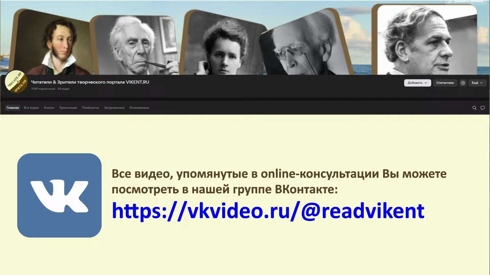

Вы мне присылаете письма, нужно всё перенести. Но, к сожалению, это делается перекачка больших видео, там полуторачасовых, двухчасовых. Это не так быстро делается, как хотелось бы. Как хотелось бы, да. Как хотелось бы. Соответственно, идёмте дальше. Кто считает нужным как бы пофинансировать и на лечение в том числе можете финансировать.

---

## [01:47:30]

Пока в сентябре, пока в сентябре возможно будет воспринято как обида, но тем не менее после некоторых размышлений я решил сказать, как бы как бы перечислено вот на лечение на лечение на приём одной порции таблеток, одной одной дневной порции таблеток. То есть, мягко говоря, понимаете, это копеечные суммы. Ну, это нужно развивать видео, нужно лечиться, нужно книжки покупать и так далее, и так далее. Кто понимает, тот услышал, кто не понимает, ну что же делать. Соответственно, давайте повесим. Значит, я в самом начале ошибся, сбился, то есть даты перепутал. Значит, сегодня четырнадцатое, значит, двадцать первого у нас онлайн-консультация. Несколько вопросов уже поступило, но просьба сегодня, сегодня в крайнем случае в понедельник задавать любые вопросы по там творческим дисциплинам, по научной деятельности, методической деятельности и так далее. Вот важно, если вы почему-то стесняетесь, возможен режим аноним. То есть я буду знать, кто это задаёт вопрос. Для меня это важно, но я никогда не называю, кто это вопрос прислал. вопрос прислал, даже страну не называю. Соответственно, сегодня же вечером, опять-таки, завтра вечером, можете заодно через несколько минут, задали вопрос на двадцать первое, на следующее воскресенье, можете на девятнадцатое десятое задать вопросы по Геннасовичу Альшулеру. На этой неделе достигнута письменная договорённость. Соответственно, что если вы будете спрашивать какие-то детали биографии, библиографии Альшулера, вам будет через меня отвечать семья Альшулера. Это уникальная возможность, что вот семья Альшура такую услугу предоставляет, мягко говоря, не всем тезисам. Значит, в остальном давайте посмотрим последний слайд. Последний слайд о наших правилах. Большое спасибо, значит, компании Livon, которая и делает роскошные слайды. Таких роскошных слайдов ни у кого не видимо.

---

## [01:49:30]

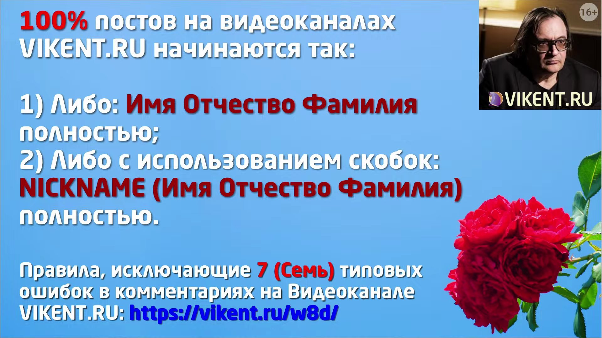

Это совместный наш труд и обеспечивает вещание. Сейчас я спрошу, были сбои вещания или нет? Ну да, то есть как бы я становлюсь религиозным. То есть Господь нас хранил, сбоев вещания не было. То есть, соответственно, через 3-5 минут и ВКонтакте, и на Ютубе я поставлю комментарий Игоря Леонардовича Викентьева, где есть ссылки на наиболее важные материалы. Это тексты и видео. Ссылок на авторов, которые у нас были приведены, там нет. Это нужно набирать ручками. Набирать ручками. Ну и так далее. Вот. Всего вам доброго. Соответственно, жду от вас вопросов как бы на двадцать первое. На двадцать первое. Всего вам доброго. До свидания.

---