# Лекция 370

---

## [00:00:00]

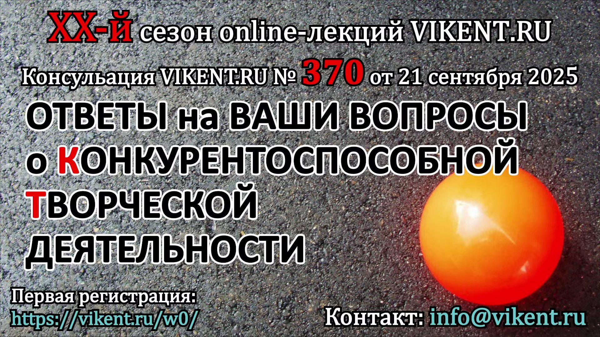

Угу. [музыка] Добрый день, уважаемые коллеги. У нас сегодня плановая консультация. Плановая, потому что третье воскресенье месяца, и у нас такая выработалась такая привычка делать. Соответственно, очень важный момент, что бывают в разных регионах нарушения интернета. Поэтому, если они будут очень критичными и мы продолжаем вещание, мы ведём контрольную запись и, соответственно, скажем, завтра точно её выложим и на Ютубе, и ВКонтакте. Ну, прошу следующий слайд. То есть резервная запись ведётся, не беспокойтесь.

---

## [00:00:45]

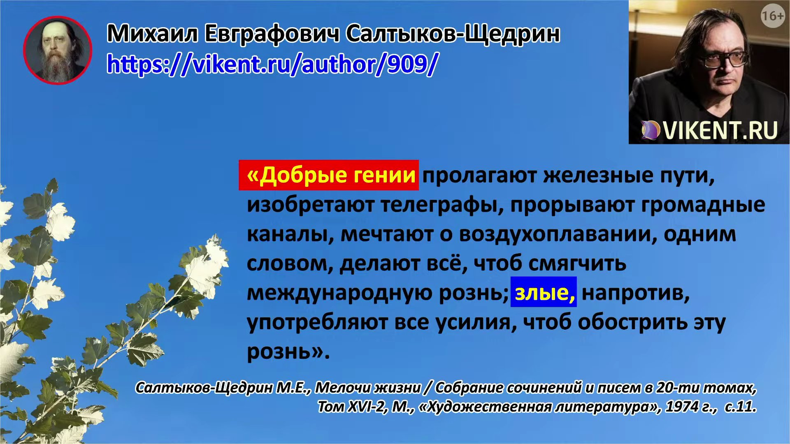

Соответственно, вот была был эпиграф из Солтыкова Щедрина. довольно редко из, ну, довольно редкий, не точно не зацитированный. И, соответственно, в определённом смысле он преследует такие античные традиции противопоставления доброго, доброго, хорошего и некого злого. Некого злого. Ну вот опыт показал, что через век, даже больше, чем через век, соответственно, больше всего оказалось, что дело не в добрых или злых, это имеет отношение к консультации. Больше всего проблем достаётся вот в этой нашей области от сиятины, от серых людей. Повторяю, как бы античные авторы этого не знали. Они думали, что есть только добрые и злые. Нет, как бы побеждают троечники и серые. Их их потому что очень много. Ну давайте посмотрим следующий момент. Значит, потихонечку, потихонечку, хотя люди пишут письма: "Перенесите всё". Это не так быстро. Примерно 15% из того, что на Ютубе, то есть там 1.

---

## [00:02:00]

700 видео, потихонечку перетаскивается ВК видео. То есть, ну, наиболее важное потихонечку перетаскивается в ВК видео и, вероятно, будет перетащено не всё, потому что это довольно тудоёмко сжирает силы, ну, и так далее, и так далее, и так далее. Вот как бы. Ну, идёмте дальше. Соответственно, соответственно, как же часть часть очень личных было очень личных было запросов. Я посчитал из этических соображений ненужным.

---

## [00:02:30]

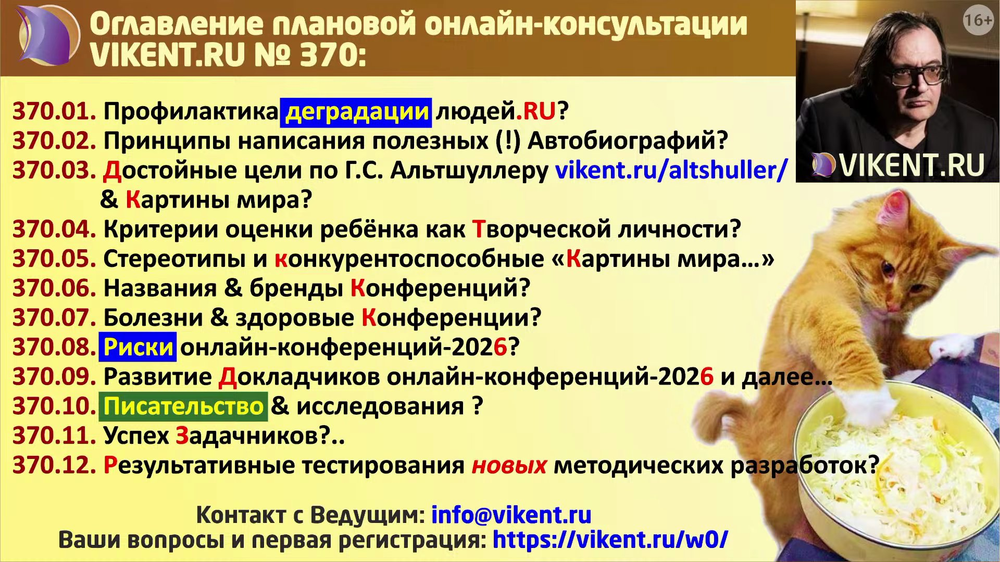

это выносить как бы в открытую консультацию, хотя авторы не возражали, и уже успел ответить, в том числе и сегодня, соответственно, путём созвона ВКонтакте, то через режим ВК звонок, аналог скайпа, да, соответственно, второй момент. Большое спасибо, кто задаёт уточняющие вопросы, потому что когда вставляется вариант оглавления и даже я его сам вычитываю, что-то ещё, тем не менее, мне не всегда до конца понятно, что кто имел в виду, на что делать акценты. Поэтому большое спасибо всем, кто пишет. На всякий случай обычно мы стремимся в среду, в четверг уже вывесить, ну, в пятницу мы всегда вывешиваем уже новую программу. Большое спасибо тем, кто задаёт вопросы, уточняющие - это действительно помощь. Вот, соответственно, кто не задаёт уточняющие вопросы, вы, ну, имеете возможность изменить своё поведение. То есть будет новая неделя, будет новая среда, четверг, пятница, суббота, утро, воскресенье, где сверхжелательно задавать уточняющие вопросы. Мне это действительно сильно помогает и так далее. Вот ещё одно обстоятельство, я уже об этом говорил, не устану напоминать. У нас уже складывается традиция, то есть в октябре день рождения гения XX века, генахсовуча Альшу. Соответственно, воскресенье, ну, ближайшее воскресенье к дате, это 19 октября, у нас будет ответы, трудно сказать, даже жанр - это полулекция, полуконсультация, как бы по вопросам, так или иначе связанных с самим Генрих Совочем, с его разработками в области развития творческого воображения классического атрис, арис, жизненной стратегии творческой личности, полученная письменно согласие семьи ответить на ваши вопросы по биографии и библиографии Геннахача Альшулера. Сразу скажу, что такие такая услуга, такой бонус предоставляется не всем. Поэтому в уже опубликованном вчера, то есть в субботу домашнем задании предложено, кто хочет, кто интересуется и, значит, не тяните, задавайте вопросы, потому что, повторяю, бывает, что подготовка, ответы на вопросы, связанные с Геном Саучалим, нужно будет, ну, потратить некоторое время. То есть, если вы проснётесь поздно, то как бы будет, то есть, в принципе, да, никаких ограничений. Ну вот ограничение задавать вопросы на русском языке. Задавать вопросы на русском языке - это единственное ограничение. Ну идёмте дальше. Идёмте дальше.

---

## [00:05:30]

Вот вот как бы вот слова викенд уже есть, ну кандидаты в обновлении. Ну, в принципе, как бы я недавно его перечитал, как бы очень не очень не слабый очень не слабые словарь с колоссальным количеством незацитированных примеров, а также серескими темами. Поэтому это совершенно бесплатная версия. Есть бумажная платная. Бумажная платная. Пишите мне или в издательство. Я, ну, в любом случае, я перешлю в издательство. То есть я не занимаюсь торговлей бумажной. бумажная версия уже стоит денег и и правильно. Далее идёмте дальше. Значит, очередная благодарность. Прошло лето, и какое-то количество людей прислало, вы сегодня их увидите свои обычно после лета свои фотографии, которые были сделаны летом.

---

## [00:06:15]

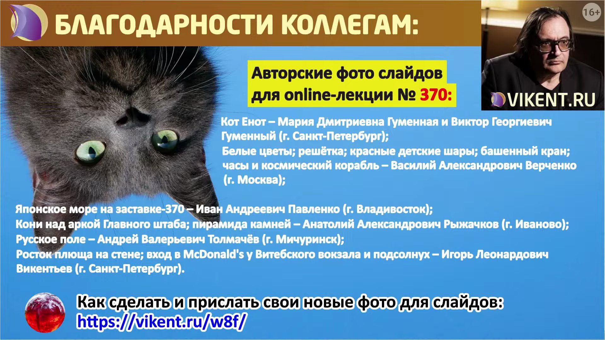

Если кто-то хочет ещё послать свою фотографию, они понимаются опять-таки без ограничений, вы видите, что желательно полезно перечитать. Вот как бы W8F перечитать как бы вот какие фотографии нам нужны. Ну идёмте дальше как бы, да, идёмте дальше. Соответственно, на лечение лектора, к сожалению, к сожалению, и на проект Weикенд, как бы, кто считает возможным и так далее, и так далости, пожалуйста, с благодарностью понимаю.

---

## [00:07:00]

Значит, ни копейки у государства мы денег не берём. Мы денег не берём и отказываемся уже многократно от инвалидности. Ну, идёмте дальше, да?

---

## [00:07:15]

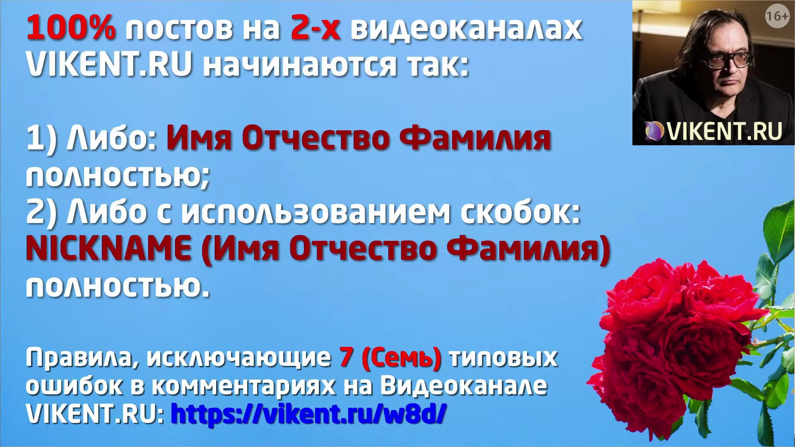

Соответственно, особенно те, кто у нас недавно, у нас культивируется, если кому-то очень важно узнать, почему спрашивать, я много раз рассказывал, очень такое, может быть, повышенно вежливое общение друг с другом. Люди из разных стран, люди разной культуры, разного возраста. Поэтому занимаемся не всегда понятным гражданам делом. Вот именно поэтому у нас культивируется такое очень церемонное обращение с друг с другом. Предупреждение мы не делаем. Модератор выкашивает без предупреждений людей из чата, кто дуит. Соответственно, я выкашиваю с Ютуба или видео ВКонтакте людей, которые не в состоянии. Обычно это мужчины бывают, это мужчины и так далее. Вот вы предупреждены, повторяю, как бы уговаривание, заглядывание в глазки у нас не будет. И, собственно, переходим к пысанным к вам вопросам. То есть, учитывая индивидуальные консультации, которые прошли там вчера, сегодня и в пятницу, я отвечаю на все присланные вопросы.

---

## [00:08:15]

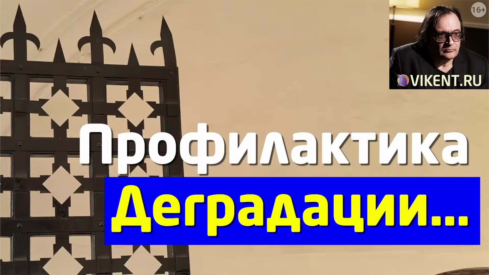

Если вы посчитали, что я не ответил, ну, пожалуйста, перешлите и укажите мне на вопрос, на который, по вашему мнению, я как бы не ответил, да? скажем да. Итак, профилактика деградации на фоне фотографий Василия Сановича Верченко. Их сегодня будет очень много. Большое спасибо, Васировичу. Давайте почитаем вопрос. Я пока попью чаю, а вы почитаете вопрос. Давайте следующий слайд. Как бы, да, нет, не как бы вопрос не отверченка как бы, да. Соответственно, как бы вопрос номер 3ше, это спецкурсы.

---

## [00:09:00]

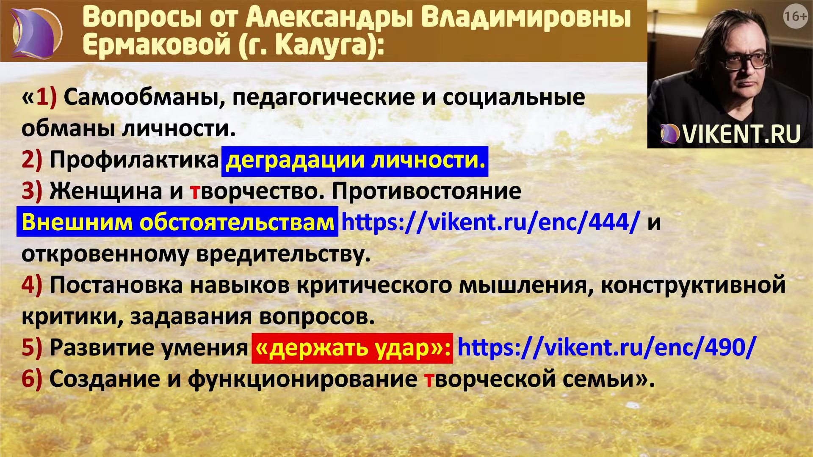

То есть это даже даже даже не лекция, даже не консультация, это спецкурсы, материал для них есть в изобилии на портале, то есть можно почитать. Непонятно где читать. Опять-таки спрашивайте под видео, пожалуйста, якобы отвечу. Соответственно, постараюсь ответить на вопросы 1 2 4 и 5. Как бы соответственно, соответственно, отвечаю оптом на несколько вопросов. Соответственно, у психологов каких-то хороших придумок нет. И психологи, я же не говоря там про культурологов, социологов, философов, методологов, хронически врут. Хронически это означает, что нечто попадается почти ежедневно в контакте. Соответственно, если говорить о такой сильном, сильном ходе, сильном шаге, то, соответственно, когда вы занимаетесь каким-то серьёзным делом, повтою, это может быть воспитание талантливых детишек, вот это может быть занятия какими-то другими амбициозными проектами, то, соответственно, дело очень быстро мозги ставит на место, то есть сразу же отвечает на все вопросы какие-то психологические придумки, типа там сделал хорошее дело, скушай шоколадку, это такой бред собачий и так далее. Вот. Ну мозги, мозги ставят дело. Таких дел у нас, соответственно, названо на сегодняшний день и сегодня будет названа парочка, по-моему, ещё более 1735. То есть мы их считаем, Максим Васильевич Зеницев их считает. Если некий человек, такие письма ко мне были, соответственно, не среди вот этих 1735 как бы дел интересных, амбициозных, не может найти своё, ну, в таком случае очень простая. Прошу, прошу обижаться, прошу вас обижаться. В таком случае человеку надо проверить голову. То есть просто вот проверьте голову. Ну или как минимум промыть голову изнутри. Поэтому сильное решение одно: заняться делом. Делом в данной фразе пишется с большой буквы. Соответственно, соответственно, вот усиление ответа на вопрос четыре. Я не читаю. Давайте следующий слайд. Соответственно, вот есть очень немилосердно, всего лишь 10 минут. Вот, соответственно, мне периодически тут рассказывают, что а мы не соображаем как бы там в интеллектуальной продукции, как вы, Гленадович, мы не соображаем в научной продукции. Вот есть линейка, есть инструмент.

---

## [00:11:30]

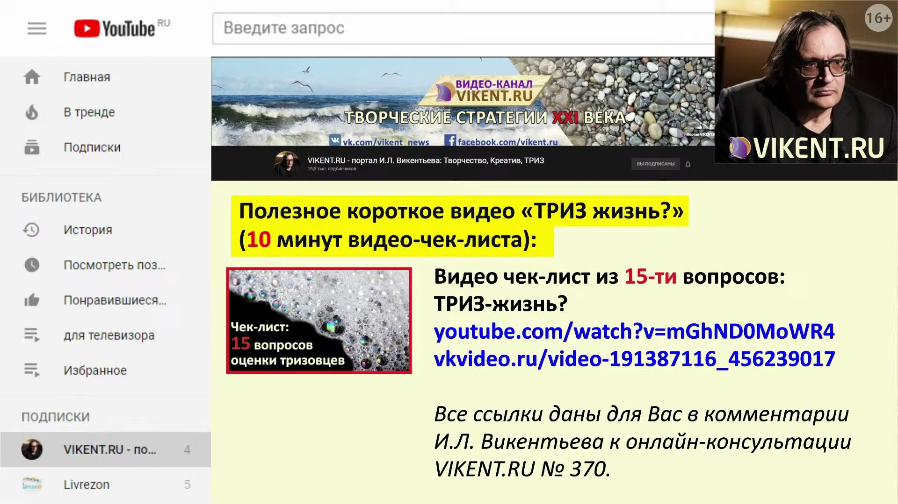

Это такой редкий видеочек-лист из пти вопросов. Изначально он был сделан для оценки работ потрис, но в принципе в принципе как бы для какой-то интеллектуальной продукции, ну, нужно очень внимательно просмотреть, желательно законспектировать. желательно законспектировать. И, соответственно, вы получаете некую линейку для изменения интеллектуальной продукции. Даже очень важная оговорка. Нам это эта оговорка сегодня потребуется. Ещё раз, даже если вы не специалист, даже если вы не специалист, то такой чек-лист. Соответственно, переходим к следу, да, если я не ответил на ваши вопросы, пожалуйста, это не последняя, соответственно, консультация. Задавайте, перезадавайте ещё раз. Значит, очень давно хотел использовать вот эту вот как бы вот эти коней над аркой главного штаба.

---

## [00:12:30]

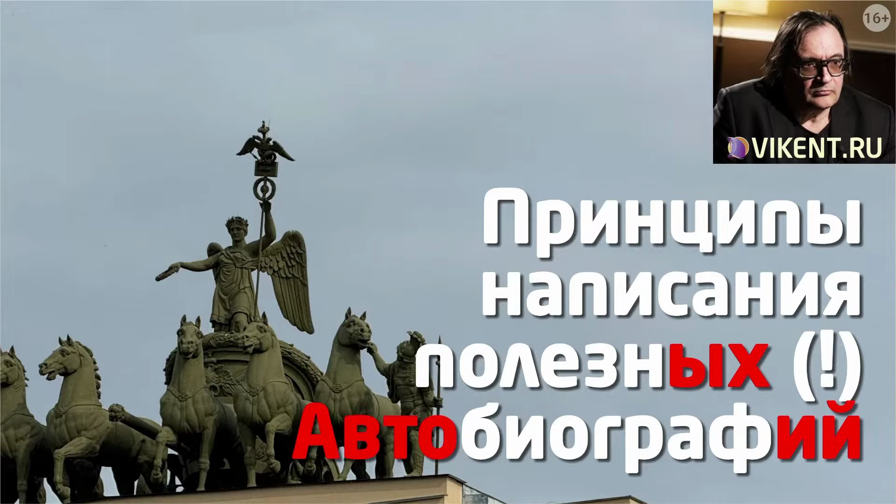

И вот фотография Анатолий Танец Жачко. Он был в Питере, сфотографировал. Ну как-то вот с хорошего ракурса. И так очень по делу, очень поделу. Давайте посмотрим. Давайте посмотрим сам вопрос. Значит, почему-то человек назвался анонимом, хотя, на мой взгляд, как бы вот ничего-то такого вот нету, как бы вот прочее, прочее, прочее.

---

## [00:13:00]

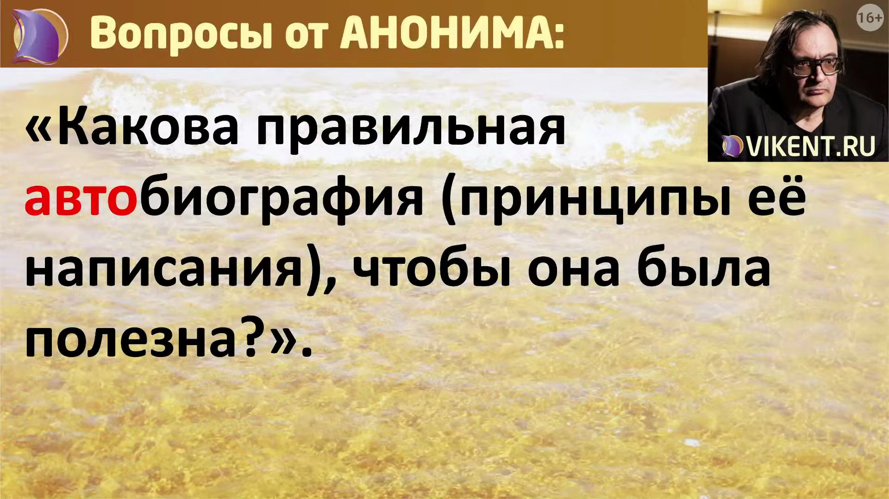

Значит, ну, пункт номер один. На всякий случай человек, может быть, человеку будет интересно, может быть, и другим будет интересно. На всякий случай, кто хочет, может сделать у нас публикацию в ДЗН, написать статью по этому поводу. То есть 16 мая, соответственно, день биографов, праздник биографов и так далее. Вот. Ну, кто хочет, может собрать материал, соответственно, и собрать. Надеюсь, вопрос м вопрос прочитан. Я его, как правило, не читаю. То есть делайте сразу же к следующему слайду, да? Вот, соответственно, здесь несколько моментов, которые надо мм чётко проговорить.

---

## [00:13:45]

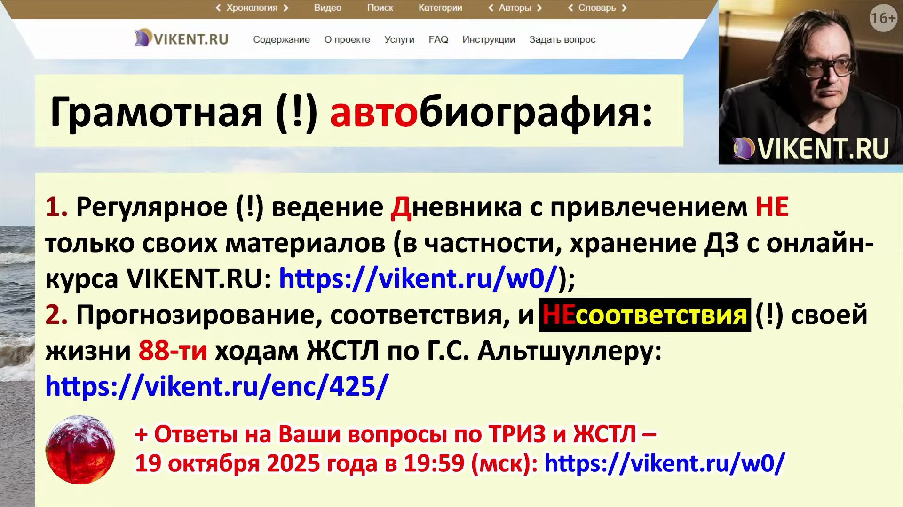

Вот, значит, на мой взгляд, есть действительно такое, ну, очень хорошее очень хорошая м штука, как написание дневника. Причём сейчас технические возможности расширились, то есть можно дневник заснимать. можно писать, можно задиктовывать на аудио, ну и так далее, и так далее. Вот, соответственно, тут как бы очень важно понимать несколько несколько моментов. Значит, пункт номер один, что это нужно делать регулярно. Регулярно. Далее, при некотором объёме дневника, то есть когда материалов становится много, материалов становится много, то, соответственно, очень полезно. То есть вот, то есть написал какие-то заметки, сегодня попил чаю, как бы, ну, это как бы ни о чём, да? Когда есть какие-то более сущностные размышления, то, соответственно, дневник позволяет анализировать себя, там окружение, там, может быть, людей далёких от вас, за которыми вы там наблюдаете, например, по телевизору. Вот недале, как, по-моему, вчера, мы обсуждали такую проблему, что, соответственно, если мы находимся в Питере в Москве и создана какая-то новая достопомечательность, там неважно, там медведь на площади там или рыцарь на площади, что это города перенасыщенные достопоримечательностями. И, соответственно, там новый медведь на площади где-то в центре, особенно в туристическом центре Петербурга, он как-то начинает взаимодействовать с другими достопоримечательностями. Если же такая скульптура поставлена где-нибудь в дальнем селе, глухом, в Сибири, то вот есть единственная достопримечательность, как бы медведь около автобусной остановки. Всё. То есть, ну, грубо говоря, он не играет. Поэтому вот к пункту один, что как бы, ну, по идее нужно проводить несколько линий. То есть линия личности, автобиография, далее, по идее какие-то люди, события, которые, ну, на вас влияют. На вас влияют. Может быть, вы окажетесь каким-то единственным биографом каких-то других людей, в том числе биографом, историографом других людей, да, соответственно, скажем, да. Далее чрезвычайно полезно изучить и поглядывать. Жестел опубликована, ашуля и так далее, и так далее, и так далее. Вот, соответственно, кроме того, в очередное напоминание можно задавать вопрос. Пока никаких ограничений нет. То есть место ещё есть. Место ещё есть. и так далее. Вот боюсь, что последнюю неделю навалится очень много вопросов и придётся делать две консультации, что не хотелось бы. Очень много планов на эту осень, да. Так вот, есть некая нешуточная нешуточная разработка Геннахсоча Альшулера. Значит, если сравнивать то с тем бредом, который несли психологи и преимущественно и культурологи, то есть, ну, гений есть гений, да? Вот сравнивать себя, да, сравнение может быть психологически неприятным с выдающимися людьми, выдающимися людьми. Но тем не менее, тем не менее, давайте посмотрим следующий слайд. Тем не менее это может быть вот и искать несоответствие.

---

## [00:17:15]

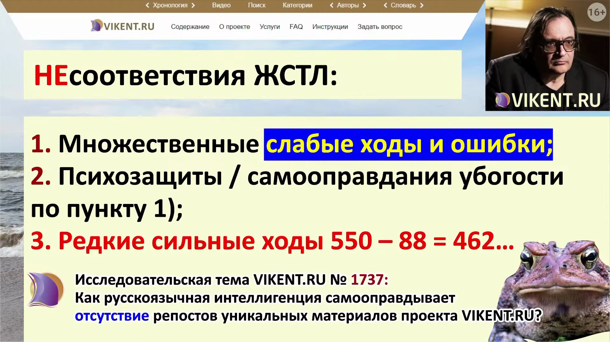

То есть несоответствие в две стороны. Вашу сторону, то есть вашу это в сторону анонима автора вопроса. С другой стороны, как бы большое количество несоответствия ЖСТЛ некоторой реальности 2025 года. Первое, как сейчас выяснилось, и у меня об этом многократно говорю, что как бы Альшулер даже не мог предусмотреть вопросов своих ученичков тызовцев. То есть, то есть, грубо говоря, на каждый несделанный ход, сложная фраза, на каждый несделанный ход, как бы тризовцами, очень большое количество ходов и ошибок. Ну, наиболее подробно, я это освещал многократно, кто не найдёт, не знает и так далее. Вот. То есть, условно говоря, просто перечислю, чтобы было понятно, о чём. Что тризовцы с десятилетиями делали исключительно убогие сайты, убогие видео. убогие сообщества и убогие тусовки, конференциями даже назвать нельзя, то есть какие-то вот такие, ну, совместные посиделки с с пирогами, да. Соответственно, пункт два. Пункт два. У Альшуры этого нет, но вещь для русской интеллигенции чрезвычайно полезная. Наблюдая за собой, наблюдая за ближайшим окружением, чрезвычайно полезно изучать психозащиты самооправдания убогости. По пункту один. На мой взгляд, классика, которая вполне достаточно в первом приближении - это Анна Фрейд. На портале Викенд Анна Фрейд есть, и там есть буквально один абзац, и в интернете есть расшифровки, ну, классических там сдюжину как бы психозащит, которые, ну, действительно действующие на российскую, не на российскую, соответственно, интеллигенцию. Есть книжки по психозащитам, но там уже начинаются там более сотни, более сотни. Ну просто-напросто ненужно. Кроме этого я точно утверждаю, точно утверждаю, что они есть. Есть некоторые редкие, сильные ходы. Вот, ну редкие в том отношении, что как бы если вы сегодня будете прочёсывать вашу ленту в любой социальной сети, вы, скорее всего, их не найдёте. Но они есть. Я такой работой занимался годами. Соответственно, и есть, например, нередкие сильные ходы, усиление ЖСТ и так далее. Вот, например, я уже рассказывал, что мне лично мне очень многое дало. Я сейчас о своей автобиографии, когда я в первом классе, буквально в первом классе, первые дни занятия первого класса, узнал, что к материнённые и подчинённые преподаватели, которые не знали предмета, который они попродают. Потом я многократно убеждал себя, что учителя школы, учителя вузов, как бы доктора наук из отрислевых ни, ну, не врубаются в тот предмет, которым они занимаются. Вот, к сожалению или к счастью, я не знаю, но это очень здорово помогло. Альшулю этот материал я не посылал, хотя как бы ряд ходов ЖТЛ как бы мною послан был бы был Ген Генсаущ. включил в текст ЖСТЛ и поблагодарил в Минском издании на странице 24 меня как бы и так далее. Вот ряд ходов жестл мои Иголенача Викенть и примеров, да, он как бы зная его он вряд ли такой бы то есть раннее знакомство ребёнка о том, что педагоги вообще ничего не знают. То есть скорее всего, зная его стиль общения, он написал бы примерно следующее. то, Игорь Леонардович, вы живёте в Ленинограде и имеете такую возможность наблюдать педагогов, которые не знают своего предмета, а в каком-нибудь Челябинске это, ну, такой, ну, не очень реализуемый шаг. То есть они там ещё диковатые люди и так далее, и так далее, и так далее. То есть вот именно этот шаг Ашуле вряд ли включил, но тем не менее он призывал тызовцев всячески развивать Жестл. Поэтому дневник дневник как бы с одной стороны некий эталон, эталон вы можете сверять, с другой стороны не исключено, что вы найдёте какие-то сильные ходы. Таких ходов, повторяю, сотни. Таких ходов это, да, сотни - это не метафора, это проверена сотни. Другое дело, что не опубликовано. Ну, переходим к следующему. Если я не ответил, значит, уважаемому анониму, аноним, значит, дописывает письма, как бы. Ну, идёмте дальше. Достойные цели, картины мира. Ну, как бы как бы виноградная лоза, хотя это просто обычный вьюн, как бы обычный вьюн, как бы виноградная лоза и так далее. Вот как бы, да.

---

## [00:22:00]

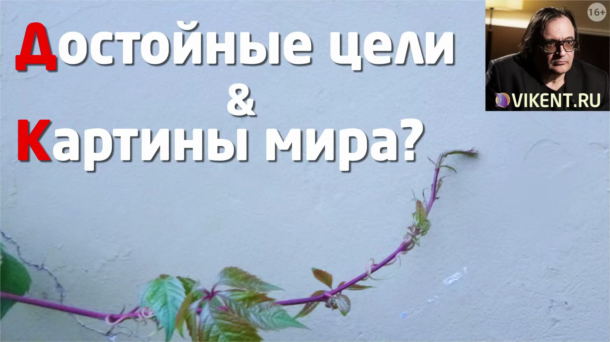

Соответственно, давайте посмотрим, соответственно, соответственно, вот вы видите и прочее, прочее, прочее, прочее, прочее, прочее, прочее, да, скажем, да, соответственно, скажем, да, значит, вот, [музыка] значит, значит, постараюсь начать, соответственно, со второго со второго со второго.

---

## [00:22:15]

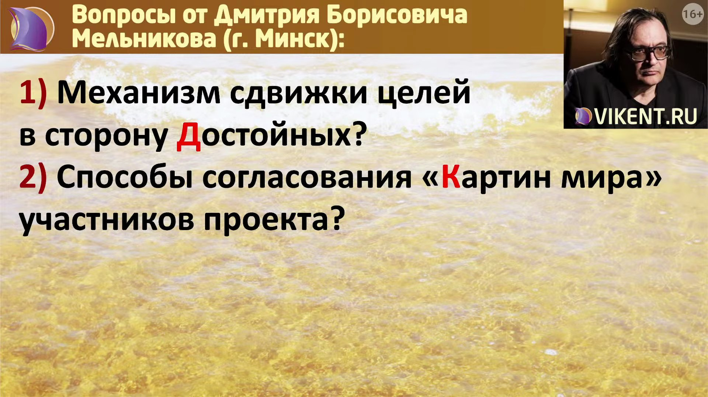

Соответственно, вероятно, имеет смысл, вероятно имеет смысл, как бы, как я вас понял вопрос, если я не уточнял вопрошающего, способы согласования картины мира у участников проекта. Если говорить о проекте Викенд, пожалуйста, у нас как бы у разных людей, у них разная тематика, они из разных стран, как бы из городов с разной численности населения, ну и так далее. Вот. И пусть у них будут разные картины мира. Пусть у них будут разные картины мира. Другое дело, что есть какие-то элементарные правила поведения. Элементарные правила поведения, которые не стоит путать с картинами мира. То есть картины мира, пожалуйста, разные, может быть, меняющиеся. Кроме того, если человек делает какую-то разработку и он делает её хорошо, почему неважно, мужчина или женщина, картина мира меняется. картинная меры меняется, поэтому вот здесь есть опасность перепутать некоторые правила поведения и так далее. Вот на одной из конференции прошлого года, онлайнконференций не этого года, мы бодро выкосили 10 человек. Соответственно, в гистационной форме написано, что мы проводим бесплатную онлайн-конференцию, но мы хотим знать фамилию, имя, отчество. Нашлось 10 идиотов. 10 идиотов, которые типа регистрировались там типа как солнечный ёжик. Вот солнечный ёжик отправляется нахрен и очень быстро сразу же у нас как бы то есть у нас принципы, повторяю, принцип поведения, когда человек не понимает и первое действие, первое действие при знакомстве человек начинает врать в виде солнечного ёжика, а шёл бы солнечный ёжик нахрен, как бы, то есть как бы и так далее. Вы то есть есть сильное подозрение, что человек как бы, ну, мягко говоря, в виде солнечного южика никому не нужен. Теперь отвечаю на первый вопрос ближе по достойным целям. Он, может быть, немножко сложнее будет. Ответ будет сложнее. Давайте дальше. Давайте, давайте следующий слайд. Соответственно, значит, ответственно, есть несколько печальных весьма фактов, которые, возможно, с первого раза, может быть, будет трудно уяснить.

---

## [00:24:45]

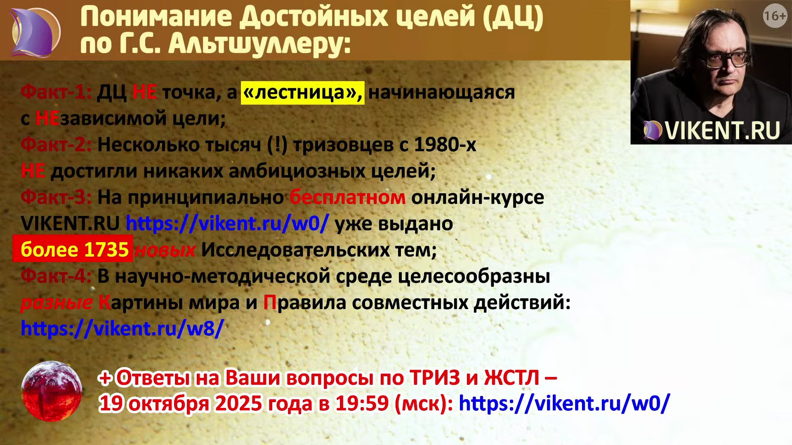

может быть, ну, психологически некомфортно. Первое, соответственно, достойная цель не является каким-то высказыванием, точкой или так далее. Вот образ с достойной цели у Гена Христосовича Альшули, кто это придумал, как бы, да, это некая восходящая лестница. Если вы хотите сказать восхождение, да, это восхож это не точка, это рассказывая выражение Генрихса Альшули, динамика цели. Динамика целей. Поэтому как бы не надо воспринимать достойную цель какую-то точку. Второй момент чрезвычайно важно, что несколько тысяч людей, которые болтались вокруг Трис как-то болтались, сипотаются, соответственно, не достигли за несколько десятилетий каких-то амбициозных целей. Уже неважно, достойные, большие, амбициозные, наглые, сильные цели, неважно. Соответственно, ну это такой печальный факт. Если вы знаете исключение, пожалуйста, напишите. Я это многократно предлагал сделать, соответственно, гробовое молчание. Гробовое молчание. Факт третий. На моём курсе, который мы я делаю, соответственно, выдано более 1735 неких исследственских тем, большинство из которых, то есть они могут начаться с там небольших независимых целей. Независимой цели тоже термин Генса Чальшулера, допустим, для старшеклассников, для студентов. То есть просто-напросто, а давайте сегодня будет парочка целей, а давайте вы напишете три-четыре страницы для Дзена. Не нравится на Джен Дзена, напишите для Левызона. Ну просто по заинтересовавшего вам материалам, как бы, да. И пока будет идти согласование, вычитка вашего материала, вы много о себе узнаете. Масса людей с высшим образованием там и имея там возраст там за 40 лет не в состоянии не в состоянии написать три-четыре страницы. Ну, написать надо хорошо, хорошо по интересующим вас целям. То есть как бы как в еврейском анекдоте, ну, как бы о больших целях не может быть и речи. Не может быть и речи, и так далее, и так далее, и так далее. Вот как бы, да. Ну и, соответственно, на последний вопрос я уже ответил, что давайте не путать картины мира. Картины мира - это скорее как бы как устроен мир, как устроена как бы наука, как устроена методика. Вот какие картины мира проигрышные, какие картины мира сильные, конкурентоспособные. И есть просто элементарные правила совместного действия очень разных, в том числе амбициозных людей. в том числе как бы не очень простых людей, в ряде случаев не очень простые люди и так далее, и так далее, и так далее. Если я неправильно как бы вас понял, ну, перезадайте вопрос, поправьте меня, а мы переходим к следующему вопросу. Давайте.

---

## [00:28:00]

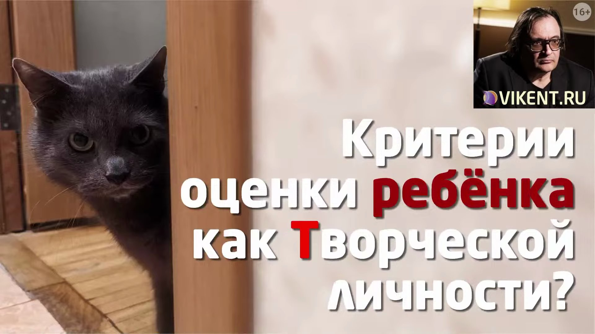

Итак, питерский красавец, рождённый на торпедном заводе, критерие оценки ребёнка именно как творческой личности. Значит, соответственно, уточняющий вопрос, то есть как бы а зачем оценивать детей?

---

## [00:28:15]

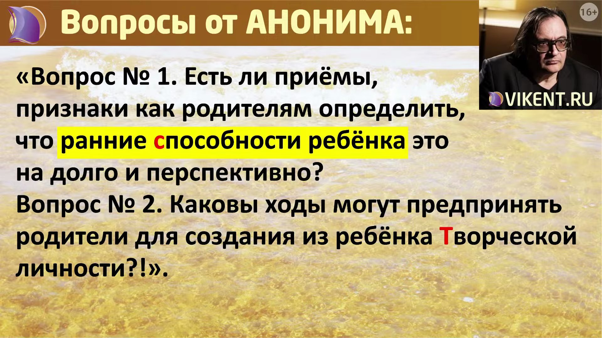

Ну, во-первых, как бы детей следует оценивать, да, вопрос от анонима. Почему такой как бы очень мягкий вопрос, не знаю, ну, имеет право. То есть затем, чтобы оценивать динамику детей, потому что, ну, дети правильном педагоге и правильном занятии должны расти. Второе, если с детьми работает несколько педагогов или даже один педагог, это, в общем-то, какая-то оценка самого педагога и оценки коллектива. Поэтому хорошо, хорошо, м, хорошо бы это делать м ну как бы как бы это делать. Соответственно, в 1847 году ректор Казанского университета, параллельный математик Лбачевский, изгонял Льва Толстого, который родился в 1828 году, напоминаю, и пожелал ему развивать свои способности. То есть, соответственно, вот Казанскому университету как бы, ну, некоторые способности, которые потом всё-таки раскрылись, как бы, ну, у Толстого, у Толстого, ну, были, ну, неявные, неявные, но Лев Толстой был благодарен. Немного позже он писал о том, что всё-таки Лобачевский что-то что-то вам не разглядел, что-то вам не раз как-то оценил и всё-таки это самое раскрылось. Всё это раскрылось, да? Соотве, соответственно, давайте посмотрим теперь, а вот, мм, значит, пункт сейчас отвечу на вопрос номер два. Соответственно, по поводу родителей. по поводу родителей. Значит, ээ я эту тему, у меня книжечка небольшая по эту тему, соответственно, да, действительно, есть отдельные исключение, когда родители вытаскивали ребёнка, значит, ну, вытаскивали ребёнка и тащили, но родители были, ну, не очень простые и так далее, и так далее. Вот. Соответственно, большинство родителей не в состоянии начать помогать ребёнку, когда начинается школьные занятия физикой, химией, математикой. То есть, то есть ещё в начальной школе и в детском саду родители могут помочь, как только начинаются школьные курсы математики, физики и химии, хотя формально говоря, родители проходили. Поэтому, соответственно, мой тест, ну, примерно следующий. То есть есть отдельные исключение и пожелаем им успехов родителям. Да, всё-таки очень желательно, чтобы где-то после начальной школе и даже в начальной школе идеальный вариант, самый сильный вариант, более сильного я не знаю, была бы система наставников. На сегодняшний день в России я мне известны две более-менее действующие системы наставников. Это у шахматистов и школа Олимпийского резерва. когда есть люди, взрослые профессионалы, работающие с маленькими, соответственно, потом с юношами, девушками, ну, и потом с мастерами уже госместе, работающие с госмейстерами, что-то в этом роде, да? Поэтому вот задача родителей найти такого наставника, может быть, профинансировать, как бы, если будут исключения, дай бог, напишите, мы будем ваш кейс изучать, как бы. Теперь начинается начинается пример. Давайте посмотрим пример. Итак, Итак, актриса.

---

## [00:31:45]

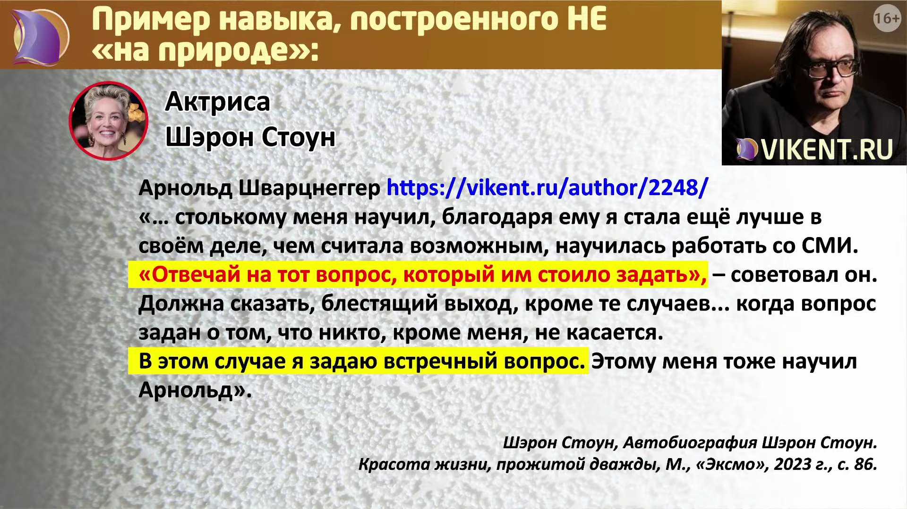

Актриса, которая рассказывает о том, что Арнольд Шварцнегер, она очень благодарна ему, благодарна, научил её общаться с журналистами и вообще там причём как бы Шайрон Стоун, она как бы общалась и как актриса с журналистами. Кроме того, она, значит, соответственно, уже в серьёзном возрасте боролась против СПИДА и, соответственно, её всячески подковывали журналисты, в том числе на эту тематику. То есть, то есть она она она много общалась с журналистам и так далее. Так вот, я надеюсь, вы почитали пример, если не успели, ну, читайте завтра, соответственно, пересматривайте. Вот обратите внимание, обратите внимание большинство людей, то есть как бы, ну вот как бы мягко говоря Шеринстоун, как бы мягко говоря, там за 40, мягко говоря, не будем уточнять, можно навести справки и так далее. Вот, соответственно, вот эту технику, которую Арнольд Саварге ей дал, может освоить, ну, практически любой человек, соответственно, ну, после сока. Мо, может быть, просто от одной идеи, может быть, тренинг. То есть, если человек не в состоянии вот такое вот освоить, опять-таки, не помыть ли ему голову ему либо ей изнутри, то есть как бы, да, ну не помыть ли как бы, то есть как бы то, ну, мягко говоря, человек странный. Странный. Вот обратите внимание, природно природно то, что посоветовал Шварцнегер, актрисе, ну, и активистки там борьбы со СПИДом. Вообще говоря, некоторый термин мой, я его использую впервые, неприродный навык. Вот люди не рождаются с умением отвечать на каверзные вопросы. Ну вот не, я проверял, не рождаются они и так далее. Вот как бы, да. Далее, соответственно, как бы ещё несколько бачек, потом я по моей команде перейдём к следующему слайду. Итак, значит, соответственно, вот какие-то гениальные успешные люди делятся на две части. И в любой книжке по вундеркиндам, ранним гениям, это написано, что некоторые детишки прорезаются очень рано. Классический пример зацитированы везде Моцарт. Более редкий пример Карл Брукнер, как бы это уже шведский композитор, но он как бы, ну, достояние Швеции, мягко говоря, и вот именно его детство, мягко говоря, в России не очень известно, да, соответственно. А вот Вагнер, Рихард Вагнер, чтимый, чтимый в Австрии, чтимый в Германии. Соответственно, как бы в детстве он так ярко, как Моцарт, искрящийся Моцарт, не проявлялся. Далее, Рымский Корсков, который не хвалил, будучи профессором Косиватории, который не хвалил учеников, например, как бы у великовозрастного Игоря Фёдоровича Стровинского подозревал просто отсутствие слуха. Далее актёр, актёр Андрей Миронов любил петь, как бы пел на концертах, но придумал себе такую откорячку, что, соответственно, как бы это это не более, чем пародия на известных исполнителей. На самом деле любил петь, пел, но, мягко говоря, ну, это пение, ну, такое для узкого круга, для любителей, кто фанатеет, от Миронова и так далее. Вот любая родившая женщина иногда что-то, ну, на в норме, в норме. напевают что-то детёнышу, как бы это даже приятно слушать, хотя понятно, что просто дела, просто напевает, боюкает детчёныше и так далее, и так далее, и так далее. Что я хотел сказать, что, соответственно, есть ход, есть некоторые гении, гении природные, есть ряд гипотез. Гипотез. Почему эти природные гении состоялись? В норме, в норме с точки зрения психофизиологии мозг человека созревает к 20 тире25 годам. То есть человек становится, ну, что ли, более неизменным. До этого, до этого разные, учитывая, что разные участки мозга растут неравномерно, соответственно, как бы, хотя бывают отдельные исключения, которые там у шахматистов, математиков, музыкантов таланты появились очень рано. Так вот, соответственно, давайте следующий слайд. Следующий слайд как раз для родителей. И вот, соответственно, как бы несколько таких моментов, они в принципе все у нас были, но вопрос про деток он постоянно повторяется, поэтому, наверное, каждый сезон как бы и так далее.

---

## [00:36:15]

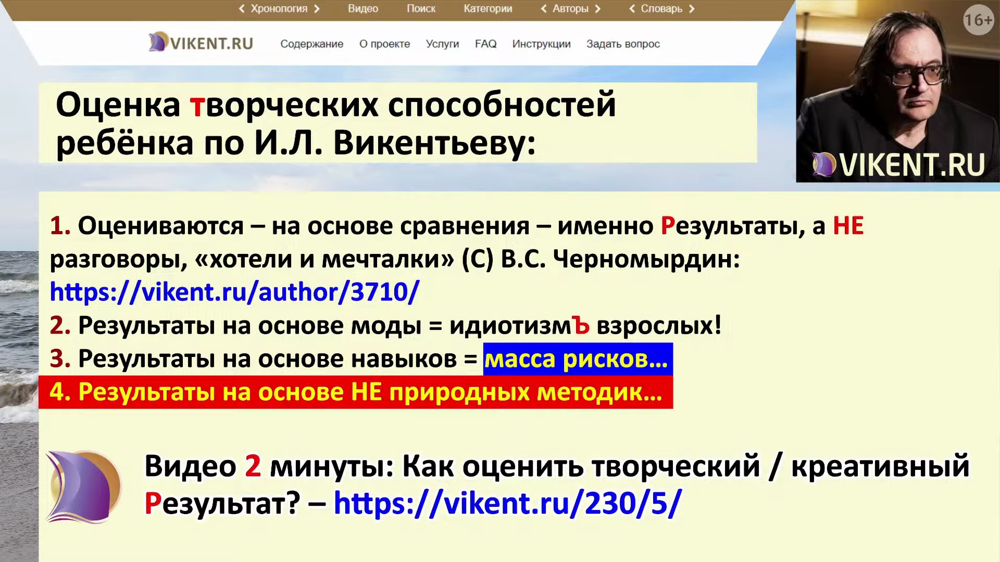

Вот, значит, оценивается, не надо ничего придумывать. У детей тоже оцениваются не какие-то мечты родителей, соответственно, не заклинания, не заклинания родителей, потому что сейчас появилась новая мода, когда как бы очень ленивые дети приходят к работодателю вместе с мамашей, с папашей на собеседование. То есть как бы в советские времена мы такому мечтать не могли и так далее, и так далее. Вот как бы, то есть не оцениваются хотелки, мечталки, выдуманные миры и так далее. Вот. Соответственно, скажем, пункт два. Неоднократно я проводил данные, что для того, чтобы просто-напросто занимать призовые места на уровне Европы, мира, ну или олимпиады, что то же самое, соответственно, эти данные были исследованы в СССР. Соответственно, внизу этой спортивной пирамиды нужно было привлечь в спорт примерно примерно 50.000 мальчиков и девочек. Соответственно, потом на пьедестал, пусть даже с бронзовой медалью, то есть выходил один, а куда девать остальные 49.000? Вот куда девать? Ну можно только себе врать, что как бы спорт полезен для развития. Спорт, спорт не полезен для развития. Спорт, профессиональный спорт разрушает организм. Вот. Соответственно, если на это накладывается идиотизм взрослых, то есть непременно увидеть ребёнка там в фигурном катании, обычно фигурном катании, что-то ещё или как бы увидеть там в фэшн-бизнесе, в модном бизнесе, это, как правило, такой идиотизм взрослых написано с твёрдым знаком и так далее, и так далее, и так далее. Вот. Далее, соответственно, я переписывался с Борисом. Переписывался, у меня письма эти сохранились с Борисом Павловичем Никитиным. Борисом Павловичем Никитиным. Есть момент, который я не нашёл в интернете. Соответственно, вот как бы Борис Павлович Никитин сделал некую ошибку, которая, ну, как бы сейчас сказали пиароошибку. Борис Павы Никитину страшно нравилось выступать, показывать своих детей, всяческое внимание там аудитории, телевизоры и так далее. Вот как бы и это вот ну страсть себя показывать, как бы она сожрала как бы и его, ну, и его детей. То есть его дети по факту, которые там бегали босиком по морозу, по снегу, там что-то обливались в любое время года, но, мягко говоря, ничего творческого из себя не представляли. Ближе к концу жизни, ближе к концу жизни Борис Павлович Никитин начинал склоняться, это видно просто по нашей переписки, немножко к идеям Трис. Он как бы начал понимать, хотя он рисовал разные кривые, это кривые оказались лжекривыми, что примерно к 12-14 годам он независимо вышел. К этим же цифрам вышел Тодюль Грибо ещё в начале века. Я вышел на эти же цифры, тоже независимо. 12-четынати годам для детёныша, неважно, мальчик или девочка, нужно делать то, что Арнольд Шварцнегер, значит, делал Шаронстоун. Нужны какие-то неприродные неприродные стратегии, то есть ответы сдавание каверзных вопросов, ну шею, и ответы на них являются чем-то неприродным, не всегда установленным. Например, как бы как бы как бы могу точно сказать, что дети могут очень точно дети там седьмого-восьмого класса очень важная оговорка при наличии наставника рассказывать, как правильно делать домашние задания и как неправильно делать домашние задания. Значит, кто хочет издать книгу большим тиражом, пожалуйста, соответственно, работайте с детьми и можете, я могу помогать, естественно, бесплатно. Мы можем сделать педагогический хит. Сами дети исследуют это дело, что делать для выполнения домашнего задания и что не делать. Это педагогический хит, там видео, ну, и так далее, и так далее, и так далее. Педагоги эту часть как-то вообще, мягко говоря, чрезвычайно умно изучают. Как бы пытался заниматься чем чем он соловещик, отчаянно попсил, но серьёзных работ по выполнению домашних заданий детишками там как бы просто когда ребёнок один. Самое интересное, когда детей много в семье, многодетная семья. Кроме того, существует музыкальная школа, существует школа искусств, там, где рисуют дети, лепят и так далее, и так далее. Вот так нет. Да, соответственно, как бы вот пункт четвёртый, обратите внимание, опять-таки, 1735 тем, на самом деле уже больше. И, соответственно, здесь шанс имеет почти каждый, не становясь в очередь из 50. 000, когда мы развиваемся на социальных ресурсах. На социальных ресурсах, запятая, по поводу способности здесь не очень важно, но здесь важен наставник. То есть, допустим, я не очень верю, что дети сами сообразят, как делать сравнение сильных и слабых домашних заданий без какого-то такого наставничества. Соответственно, как бы вот так далее. Вот, соответственно, ещё одно признание в своих автобиографиях, ну, так вот, нет, на самом деле такого намного больше, как бы Элтен Джон и, соответственно, Александр Журбин, оба композитора, оба исполнителя. Ну, он как инструменталисты выступали, писали о том, что у них пальцы коротышки. Соответственно, как бы и была, ну, то, что называют люди, понимающие музыки, растяжка. И Александр Журбин очень честно признавался, что, соответственно, когда он играл какие-то произведения, не свои, не свои, у него растяжки не хватало, он подхолтувал, учитывая, что это происходило в ресторане, который одно временно в том числе поднадлежал Иосифу Брусскому, русский самовар в Нью-Йорке. Ну вот там пьяненькая публика, естественно, не врубалась, как бы, да. Ну, соответственно, профессор консерватории по классу композиции знает произведение, где требуется солидная растяжка. И, естественно, он бы похватил бы, похватил бы, то есть, буквально сыграйте несколько минут, он похватил бы журбина и так далее. Элтен Джен просто пишет о том, что у него короткие пальцы и так далее. Вот. Ну и Элтона, и у Александра, соответственно, были ход конём. оба композитора, когда они могли написать произведение под себя и, соответственно, брать те ноты, которые их пальцы коротышки. Пальцы коротышки не мой, это, соответственно, скажем, их их собственные термины в их же автобиографиях брать. Значит, поэтому я могу сказать, что традиционно психологихнулись, они пытаются исследовать вандеркиндов, там, юных гениев и так далее. Вот на основе с одной стороны дурацкой моды, с другой стороны каких-то природных задатков. Соответственно, рядом простаивают океаны, буквально океаны интересных, полезных научных, методических проблем, как бы, которые больше всего собраны на курсе Викенд, как бы, и так далее, и так далее. Вот как бы и здесь ребёнок вполне вполне может состояться. Ну, для этого нужно нормальное трудолюбие. Ну и очень желательно наставник. Очень желатель наставник, потому что некоторые вещи ребёнок просто может прозевать. То есть работать будет он, естественно, не наставник либо она. Но надо помогать детишкам. Они могут делать некие новые ляпы. Поэтому, соответственно, есть разные шкалы оценок, как бы для мой совет всем родителям и всем педагогам присматриваться к некоторым социальным проектам, а не проектам, которые замешаны на моде, плюс некоторые природные способности, которые плавают. Ну, с точки зрения психофизиологии, они плавают. Плавают, как бы гормоны плавают. Это чрезвычайно ненадёжно. Чрезвычайно ненадёжно. Ну, давайте идёмте дальше. Идёмте дальше. Да, соответственно, до питерцев как бы вход в McDonald's напротив Витебского вокзала. Это моя фотография.

---

## [00:45:00]

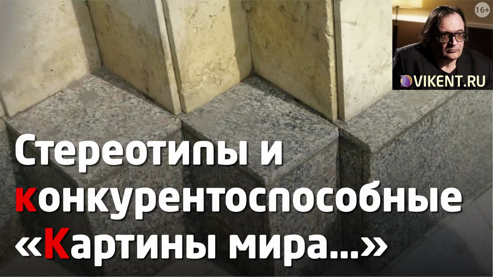

Так далее, так далее, и так далее. Вот как бы, да. Ну, давайте посмотрим вопрос. Вот как бы, да, да. Вопросы о картинах мира. Вопросы о картинах мира.

---

## [00:45:15]

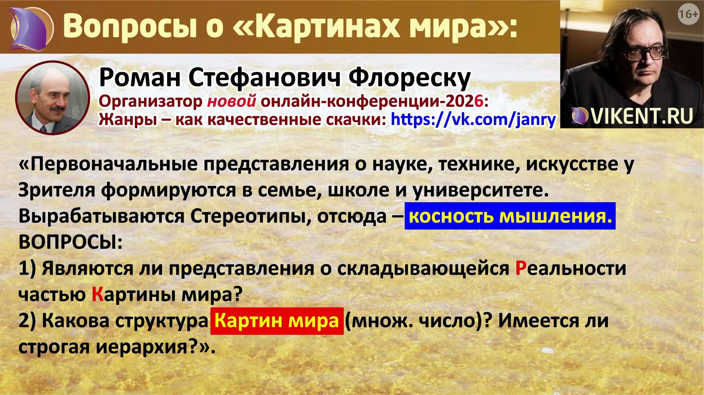

Вот, соответственно, значит, значит, я не совсем согласен то, что написано до слова вопросы. То есть, соответственно, как бы у Ивана Петровича Павлова есть такой хороший термин полезные автоматизмы. То есть, когда ребёночек воспитывается, неважно в семье, в школе, соответственно, вот эти некие полезные автоматизмы, ну, вплоть до того, как держать ложку и вилку, это нечто нечто полезное. Вот. Соответственно, это как бы очень важно, как бы, да. Вот теперь, значит, следующий вопрос, как бы, значит, вопросы, ответ как бы на первый вопрос, да. Да, конечно. То есть как картино мира, ну, понятие, ведённое, значит, кем-то из немцев, не помню сейчас кем-то, помню, что есть, как бы вещь хорошая, на мой взгляд, как бы наиболее полно об этом говорил Джордж Келли. Значит, середины пятидесятых годов то, что называется репертуарные решётки. То есть, то есть картина мира - это тоже не точка, это не слово и не слова и несколько слов. Это какая-то такая именно, как сказали бы в математике, система уравнений, система неравенств довольно большая. Довольно большая. Ну и давайте дальше немножко как бы дальше немножко посмотрим. Давайте посмотрим. Так вот, посмотрим дальше. Вот, посмотрите, пожалуйста, вот представление о гении.

---

## [00:47:00]

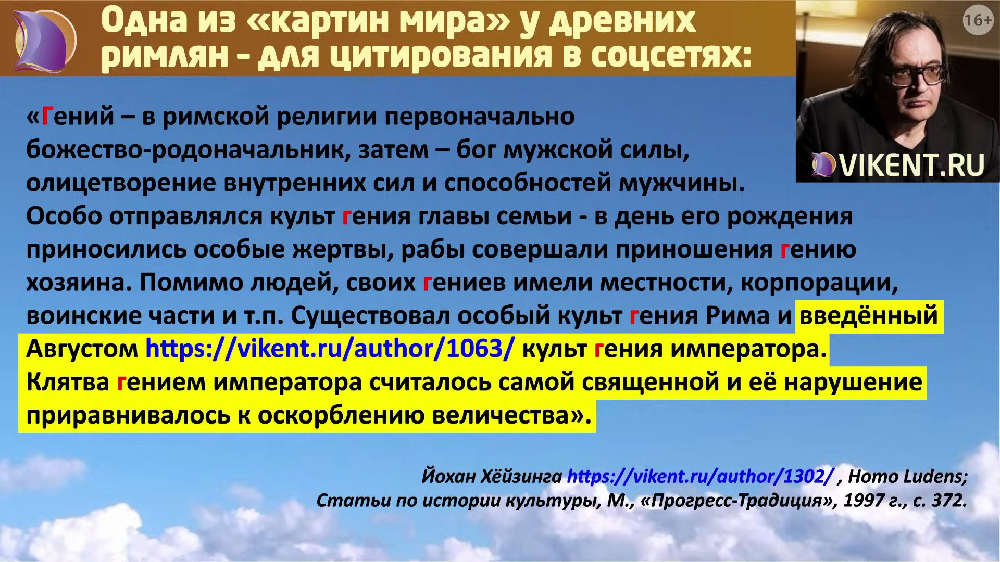

Представление о гении. Почему я взял этот пример? Мог взять ещё несколько сотен подобных. У меня их много, потому что, обратите внимание, даже на уровне древнего Рима, вот какое-то представление о гении, родная мне тема, да, скажем, оно немножко менялось. Даже вот в пределах этого абзаца она менялась. То есть вот картина мира - это не это не точка, это не точка. Картина мира - это система уравнений обычных дифференциальных неравенств, график. То есть штука принципиально принципиально принципиально многомерная. Давайте дальше посмотрим одну картину мира. Давайте посмотрим. Давайте следующее. Вот посмотрите, у нас много раз было, значит, мне удалось сделать довольно сильную работу. Филологи, ну, не сделать такую не в состоянии.

---

## [00:48:00]

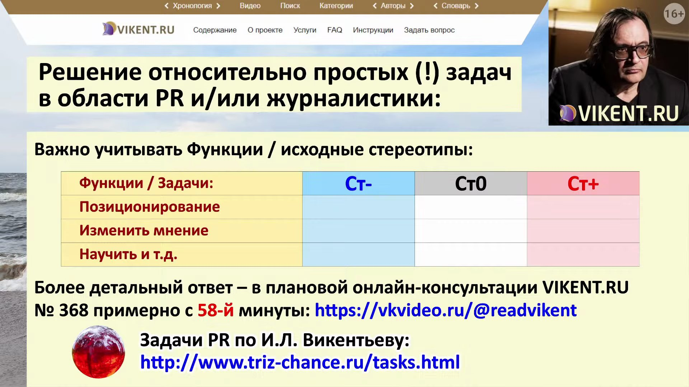

То есть как бы, да, вот меня на конференции в МГУ просили, значит, общество, забыл, как называется, общество, занимающееся риторикой, короче, не уезжать из страны, потому что они сами в такое делать не в состоянии, да. Соответственно, что вот получается очень хорошая картина мира, очень простая, при решении простеньких задач. То есть оказалось, что вот верхний этаж при решении простеньких задач в области рекламы, пиара, журналистики, ну и смежных дисциплин, это исходное отношение читателя либо зрителя, либо слушателя. То есть стереотип отрицательный, стереотип без различия и стереотип положительный, а также некоторые типовые функции. Вот штука 15 типовых функций задачи по по Викентиеву. Они проведены. Значит, эти типовые функции были сделаны очень просто. Я просто-напросто анализировал выиски из газет, из журналов. Я их просто на диване раскладывал. на пачечке, раскладывал многократно. И как-то вот стало получаться, стало было получаться. Соответственно, вот эти вот задачи хорошо перекрывают русский язык. Ну, хорошо перекрывают, а на пересечении функции и стереотипов получаются приёмы. Ну, можно, если можно на уровне примеров лучшие практики. Естественно, эти лучшие практики можно иллюстрировать графические, можно аудиоиллюстрировать, ну, и так далее, и так далее. Вот. Но получалась очень простая, очень лаконичная система. За 2. 000 лет филологи такую были не в состоянии сделать. Я сделал там, ну, за где-то за месяц, может быть, за полтора. За месяц, за полтора, значит, так далее. Вот не верите, почитайте, пожалуйста, что делал Игорь Михайлович Лутман и и его школа. Почитайте, пожалуйста. Почитайте, пожалуйста. То есть вот вы поймёте, что я сейчас сказал тогда Лют. Но, соответственно, это для очень относительно простых задач. Хотя я не могу сказать, что пиар и журналистика - это простые задачи. При хорошему исполнении это может быть весьма наворочено, как бы. Давайте посмотрим следующий слайд. Давайте посмотрим следующий слайд. Соответственно, сейчас я буду говорить только о конкурентоспособных моделях.

---

## [00:50:30]

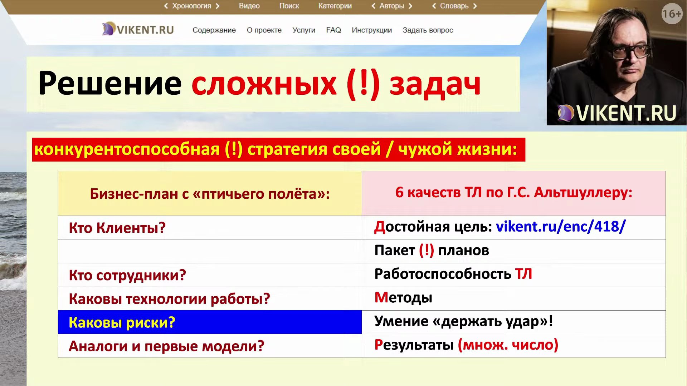

Сразу могу сказать, что у развитого человека может быть ряд картин мира. Ну, например, просто-напросто одна картина мира общение с детьми. То есть, ну, как бы у развитого человека, неважно, мужчина и женщина одна картина, общение с другими взрослыми, другая картина мира, общение с врачом, третья картина мира. Они могут пересекаться, если брать, то есть картин мира у человека может быть много, да? Так вот, если брать сложные задачи, соответственно, и какое способно вот решение сложных задач по поводу своей чужой жизни, оказалось, что просто-напросто стандартный бизнес-план. Да, я сразу должен сказать, что как бы в разных экономических школах есть разные типы бизнес-планов и так далее. Вот здесь-то, конечно, всё доно птичьего полёта всё укорочено. и шесть качествской личности по Альшулю, которая была собрана на гениях, весьма похоже. Соответственно, соответственно, на всякий случай в России есть указ президента, я как-то его показывал. Можете искать, где, к сожалению, к сожалению, это это юмор сейчас будет, к сожалению, президент мне не показал, а зря. Там перечислено 17 17 ценностей россиян, как бы, ну, это указ президента, но зря мне не показали. Короче, ну, зря мне не показали. Это это вот будет посильнее. Итак, обратите внимание бизнес-план. В бизнес-плане такой строчки, которым набить в социальные сети, ваша мечта, кто-то ещё, ваша самореализация, такого нет. В некоторых школах начинается бизнес-план, кто клиенты. Причём, причём, как бы, ну, надо очень чётко понимать, не кто клиент, что целевые группы могут быть разные, то есть их может быть несколько, как бы, да. более навороченная штука, намного более сложная для гениев, достойная цель. Пункт два. Я не знал, что написать в плане, но как бы в плане, ну, как бы порядок действий, но сам бизнес-план и есть как бы план. Обратите внимание, что Альшулевы не писал, что нужно планировать. Альшулев писал о том, что есть пакет планов. Устно он рассказывал, что действительно планы могут, ну, как бы не сработать. Поэтому важно иметь пакет планов. Я постоянно на на любых консультации докладчиков их поправляю. Они постоянно хотят разрабатывать одну тему. Я их там недемократично заставляю сразу же превращать одну тему в гамму. Я снимаю с них риски. Далее в бизнес-плане есть вопрос. Ну он может немножко иначе звучать, естественно, и так далее. Вот кто сотрудники? Ну полагается, что кого-то вы будете нанимать. У творческой личности сотрудников может и не быть сама сам сам человек. Поэтому работоспособность точеской личности пахать придётся много. Далее вопрос бизнес-плана. А каковы технологии работы? Технологии работы. Ну вот, соответственно, соответственно, вот когда McDonald's ушёл из России, McDonald's ушёл из России, соответственно, мы что-то покупали в ближайшем Макдональдсе, соответственно, нам предлагалось, соответственно, что у нас примут заказ, как бы, и подождать 20, цитирую, 20 минут в зале. То есть, казалось бы, при наглядной технологии, мягко говоря, сейчас они поправились, да, поправились, но, мягко говоря, McDonald's превратился в паршивый, самый паршивый ресторан, который российского разлива, да, соответственно, вот технологии даже позаимствовать не всегда могут, да, когда они открыты, как бы открыты. Соответственно, Альшулер для творческой личности говорил о методах. Методах. То есть вот трис явный метод. Трис - это не наука. Трис - это метод решения некоторых задач. Далее, вещи, которые люди боятся, уходят в психозащиту, в ерунду, в бред и так далее. Вот каковы риски. Ашулер ещё более инструментали. Умение держать удар. Когда вы начинаете достигать путь даже небольших высот, соответственно, ну, русскоязычное общество начинает вам свинячить. Вам свинячит начальство, вам свинячат близкие, вам свинячат люди, с которыми вы десятилетиями вместе там были дружны, учились и так далее. Вот вещь проверенная. Вот, к сожалению, это правда. К сожалению, это правда. Соответственно, ковые результаты. То есть говорить о творческой личности, даже если это детёныш, даже это какие-то ребёнок, если нет результатов, это такие неконструктивные мечталки. Вот. Ну, вообще ни о чём. Вообще ни о чём. Поэтому картин мира, картин мира может быть много. Понятие весьма широкое, чрезвычайно интересная тема, поскольку начинают пересекаться люди в проектах из разных стран, разного возраста, разного менталитета. И, соответственно, Иван Андреевич Павленко делает задачник. Соответственно, на неделе, на неделе он вычитывался и так далее. Вычитка идёт трудно. Вычитка идёт трудно. Не все въезжают, прямо скажу, не все въезжают, к сожалению. Кто хочет сказать, что он въезжает, ну, вычитывайте ещё раз, как бы езжай уже. Вот я предполагаю, что я ответил. Роман Стефанович не стесняется спрашивать, просит меня ещё раз, если я не ответил. Ите дальше. Фотографии Василия Сановича Верченко.

---

## [00:56:15]

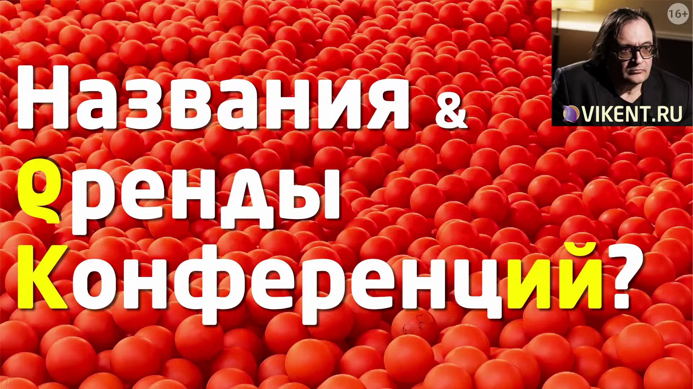

Это не помидоры, это, скорее всего, супермаркет. Шары для детишек. Шары для детишек. Фотография Верщенко Василия Сановича Москва. Давайте посмотрим вопрос. Посмотрим вопрос. Так далее. Вот. Да. Да. Соответственно, вопросы Константина Сергеевича Калугина, который проводит конференции, проводит конференции и так далее. Вот, соответственно, я начинаю отвечать на первый вопрос. Да, что на третьем этапе возможны конференции.

---

## [00:56:45]

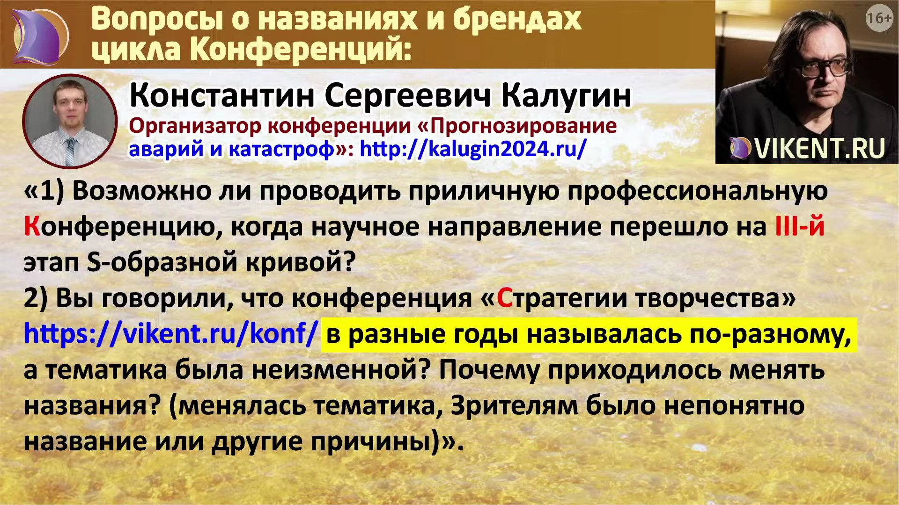

И здесь нельзя смешивать два понятия. Значит, первое понятие массовость. Массовость. Второе как бы, ну, как бы качество. То есть, допустим, семья Альшулера, когда изготавливался сайт Геннахсовича Альшулера, предполагало, что тризовцев будет очень очень интересовать детали биографии гения, великого человека Альшулера. и библиография, какие-то отдельные там статьи, высказывания, интервью, которых немного, кстати, да, соответственно, я думаю, что никого не обижу. Опыт показал, что тризовцы только интересуются историей гениального человека в 2% случая. По счётчику в интернете всё очень точно. То есть, то есть я согласен с семьёй, что когда мы касаемся Альшууллера, то вообще как бы интересоваться его биографией чрезвычайно полезно. Ну, для этого нужно из себя что-то представлять, чтобы это понимать. Ну, по факту 2%, ну, это обычные цифры, 1-2% интеллигенции во что-то вырубаются и так далее, и так далее, и так далее. Вот поэтому, соответственно, на третьем этапе пример тызовцы, соответственно, возможны очень хорошие конференции, на которых будет, не знаю, чек 15, допустим, по биографии Альшулера и так далее, и так далее, и так далее. Они будут хорошие, качественные, как бы, ну, человек будет 15. Остальные, они просто даже не понимают, зачем это нужно, зачем это нужно и так далее. Вот как бы, да. Соответственно, как бы, значит, по пункту два, по пункту два, м, вот как бы давайте посмотрим, посмотрим следующий слайд, как бы будет легче. По пункту два запомнили пункт два, соответственно, вот на первый вопрос ответил. Соответственно, как бы почему так происходило? Значит, дело в том, что подбирается какое-то количество докладов. И, допустим, у нас были разные годы, когда, допустим, у нас подбирались подбирались целые конференции, где много очень доклад докладов по работе 30 дети.

---

## [00:58:45]

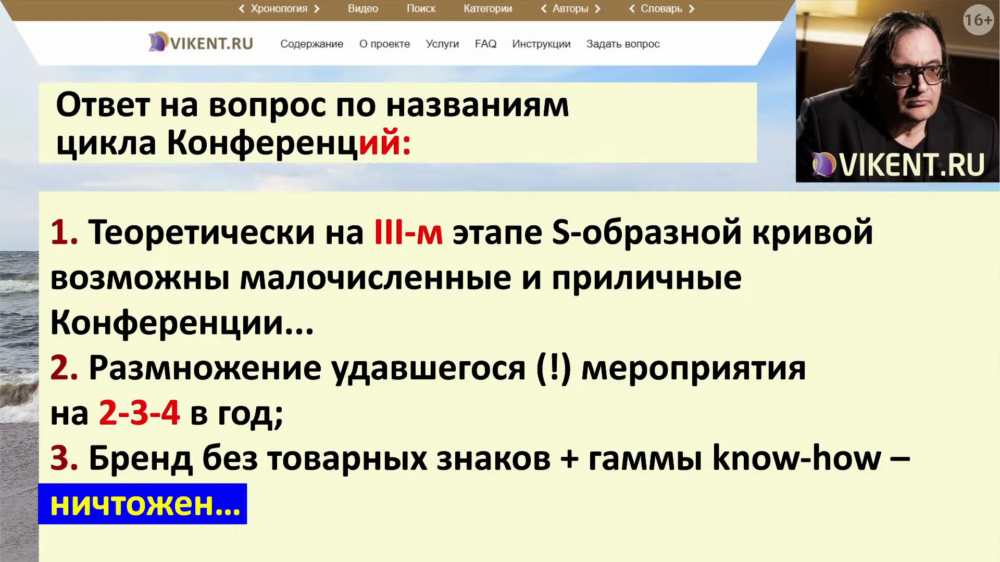

И, соответственно, надо, ну, заче делается название конференции. Нужно честно предупредить потенциальных участников и докладчиков, что здесь будет не железный трис, а здесь будет именно трис и дети. Это, ну, это элементарная честность, поэтому, ну, как-то или в заголовке, или подзаголовки это указывалось. Иногда некоторые конференции, кстати, вот конференция, подбирались доклады, где много, как создать тренинг. В результате парочку таких конференций мы провели, к сожалению, очень слабое они получили, к сожалению. Вот как бы хотя масса людей считало, что они сейчас расскажут, как создать тренинг, но как выяснилось, ну очень слабые материалы. Второй момент как бы очень важный. Соответственно, если начинает получаться какая-то конференция, у нас есть несколько кандидатов, ну, дай бог не сглазить, я тут становлюсь религиозным. То есть есть конференция Верченко, где появляются две ближайшие будет 05го воскресенье 05 октября лекции и консультации не будет. Не будет, потому что там будут очень многие и так далее, и так далее. Вот много нужно отдать в эту конференцию. Там явно получается две конференции. Одна по клиентоориентированности, другая новая зреет по достопримечательностям. Чрезвычайно интересная тема. Как всегда, чуть копнули, значит, конь не валялся в мире. Конь не валялся, чуть копнули и так далее, и так далее. То же самое по картинам мира. Вот, соответственно, в выставочно-конгресном бизнесе есть некая заповедь. Соответственно, когда конференция маленькая, все игнорируют. Как только Василий Александрович Верщенко встанет на крыло, по моим подсчётам, остался годика два. по моим подсчётам. Соответственно, он получит конференцию с аналогичным названием, возможно, тоже в Москве, и как бы люди как бы будут использовать его бренд, как бы Василия Санвича Верщенко, ну, как бы нести чушь, как бы, да. Отсюда в выставочно конгрессном бизнесе две рекомендации. Первое, значит, как бы, значит, заведение товарного знака. Товарный знак на название конференции означает монополию. монополию на территории, например, России. Если мы поддержим на территории России, то есть просто-напросто никто, в том числе в Москве, не имеет права использовать такое же название. Это первый ход. Второй ход. Второй ход обязательно обязательно конференция, например, по клиенто ориентированности остаётся в октябре. Василий Алесандрович Верченко уже запланировал на двадцать шестой год, идёт набор докладчиков. А конференция по достопомечательностям, даже если её можно повести в этот же день или на следующий день, переносится на апрель. Ну, количество людей, которые интересуются этим, и этим, не столь велико, это просто-напросто, ну, как бы отрезается некая дырка у конкурентов. У конкурентов, да. Могу даже сказать, на первые 2 недели апреля, третья, четвёртая неделя апреля, люди уже начинают думать, как они будут сажать картошку. май месяц они летят в Турцию. Поэтому конференция по достопомечатностям 2027 года апрель. Апрель Василий Алевич Верченко обычно такие вещи выполняют. Поэтому, соответственно, я считаю, что я как бы ответил даже больше, чем ответил на заданный вопрос. То есть как бы брендирование конференций неизбежно. Пока они маленькие, на них внимания мало обращают. Как только, как только они становятся заметными в интернет-пространстве, то, соответственно, появляется люди, которые хотят украсть идею. То есть кража идей выставочно конгрессном бизнесе - это просто, ну, основа. То есть, ну, придумать самим что-то хорошее, люди просто-напросто, ну, к сожалению, не в состоянии. Я се выставочниками много работал, поэтому выставочники обижайтесь до посинения. Меня это не трогает. Ну, идём дальше. Идёмте дальше. Фотографии опять-таки Василия Александровича Верченко. Вопрос не от него. Давайте посмотрим вопрос.

---

## [01:03:15]

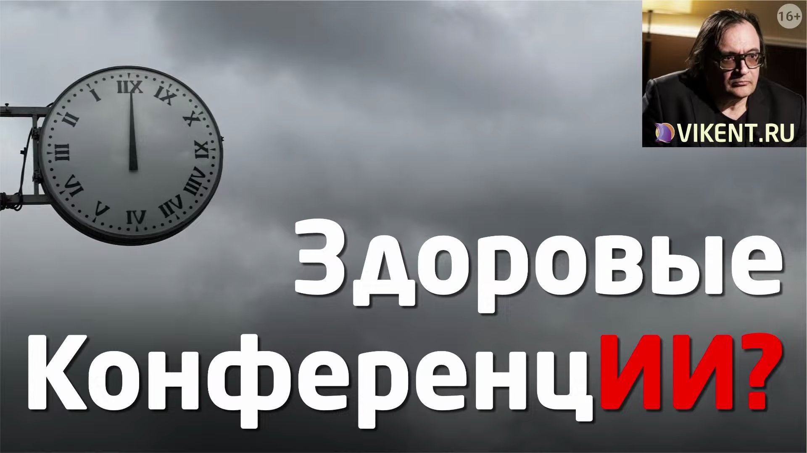

Итак, вопрос Алексея Александровича Каримова. Соответственно, значит, немножко расскажу то, что не влезло на слайд.

---

## [01:03:30]

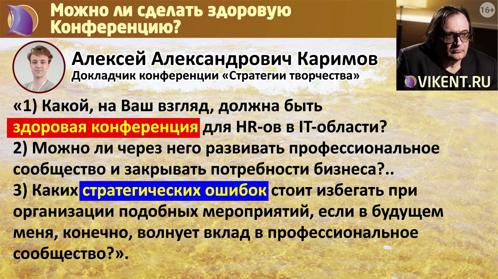

То есть я сократил, сократил то, что он прислал. Просто чтобы влезло на слайд. То есть с высокой вероятностью Олег Сей Александрович Каримов занимается проведением, будет делать конференцию длячав, ну, для кодоровиков в IT-оболасти и, соответственно, как бы прислал свои вопросы. Прислал свои вопросы. Соответственно, как бы сейчас, к сожалению, ответы будут, ну, мягко говоря, к сожалению, ответы будут неприятные. Поэтому просто надеясь на остроумие Алексея Александровича Каримова и понимание, что как бы желание что-то такое сказать в его адрес у меня как бы вообще отсутствует как бы, да. Так вот, когда делается конференция, повторяю ещё один раз, соответственно, масса начальства думают, что они делают конференцию один раз и, соответственно, весь мир, включая Путина, их заметит. Соответственно, в учебниках по выставочно-конгресному бизнесу, так это называется, написано, что конференция, конференция, форум, выставка, как бы имеет смысл вообще залезать, если это многолетнее мероприятие и оно вообще растёт и развивается. То есть, то есть конференция, конференцию, выставку можно сравнить с ребёнком. то его нужно холить и растить. Холить и растить, как бы, да? То есть это неоднократная конференция. Далее, криты, которые в этих учебниках я не видел, хотя он очевиден, да, что, соответственно, когда проводится некое мероприятие, мой совет Алексею Александровичу Каримову, что вот он сейчас где-то на старте проекта, как я понял, из переписки, соответственно, соответствующим владельцем компании, компания проводит это дело, соответственно, договориться о том, что какие-то любые инициативы, касаемые этой конференции, исходят из принципа, вот это действие, этот докладчик работает на конференцию в следующем году или не работает. Вот как бы при этом нужно быть готовым к тому, что возможно вот это видео показать руководителю компанию, владельцу компанию. И глядя в честные глаза Алексея Александровича, руководитель будет говорить: "Да, конечно, да, конечно, критерий работает на следующий год нам нужен". Но это всё длится до последней недели, когда есть и конференция заметная, и мы сейчас переходим на следующий слайд, начинается чёрт знает что. То есть, то есть как и на выборах, как и на выборах, одна из самых опасных, а, самый, а, то есть, допустим, такой есть вопрос на на понимание глубины, что самое грязное в старании.

---

## [01:06:15]

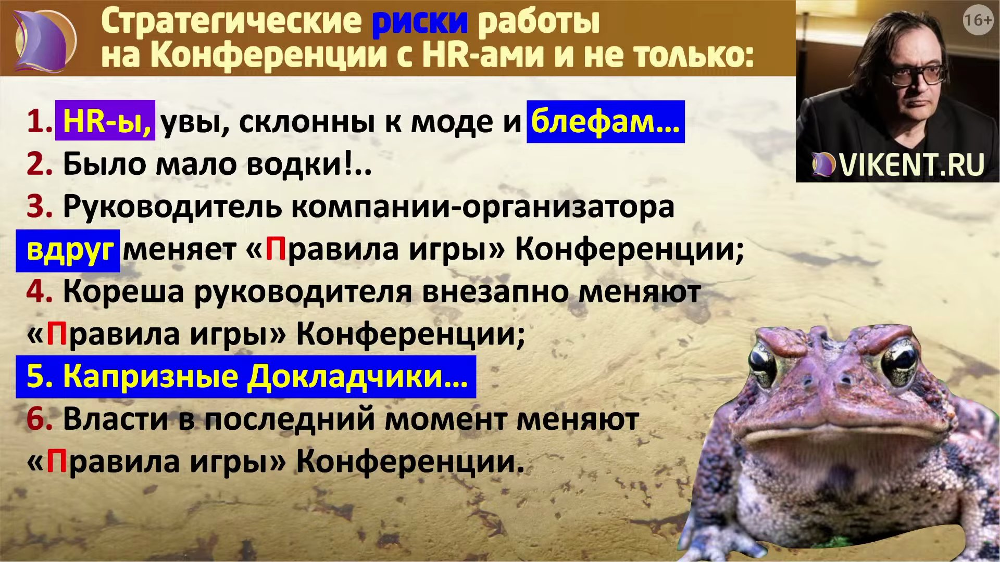

Самое грязное в стараи меню. Ну, как бы, ну, нужно, а не туалет. Туалет моют, а меню не моют, как бы, да. Что самое опасное в делании конференции? Последняя неделя. Вот что самое опасное на выборах, на политических выборах. Последняя неделя, когда идёт вброс компромата, а уже не успеваешь среагировать, ну, просто не успеваешь среагировать и так далее. Так вот, соответственно, скажем, несколько моментов. Кодоровики, они же и чары, учитывая, что это профессия между молотом наковальнем, то есть с одной стороны человек набирает людей и как бы он как бы работодателем лисок работодатель, да? А с другой стороны, работодатель его плющит. Соответственно, мы довольно много с ними работали на наших конференциях. Это люди, склонные к моде и блефам. В IT-сфере умножайте это на 10. В IT-сфере умножайте это на 10, как бы, да. Второе, соответственно, соответственно конференция, мероприятие типа конференции, при том, что там последнюю неделю вы не спите, что-то ещё, вы можете получить дикие претензии. Причём хорошо, если вы получите лично, могут жалоться руководителю, потому что финансируют конференцию компания, что просто-напросто было мало водки. какие-либо объяснения о том, что вообще конференция - это не проводку, как бы, ну, нужно договариваться уже сейчас, там за год или за полгода до конференции. Далее три вот несколько пунктов, которые опыт показывает, что можно договариваться. Мой опыт показывает, что почему я стал делать свои конференции, как бы тяжело это не было бы. По идее, имея обширные знакомства среди там профессуры и доцентов Питера и не только Питера, то есть можно было делать какие-то конференции в восемьдесят четвётом году и позже. То есть нам нужна на один день, максимум на 2 дня небольшая вузовская аудитория, человек на 50 вот по дружбе бесплатно или даже мы готовы немножко заплатить, как бы, так далее. Вот. То есть для любого для любого вузовского преподавателя они говорят: "Игович, да, да, это ерунда, я просто заявку напишу, никто проверять не будет. Дайте мне список". То есть всех ваших пропустим, пропустим там и так далее, и так далее. Вот так вот опыт показал, когда люди начинают понимать вузовские преподаватели, что они проводят какое-то своё мероприятие, мы пристраиваемся в качестве секции, к нам начинают приходить идиоты, нас начинают как-то строить преподаватели. как бы забывая обо всех своих обещаниях, начиная требовать аномальные суммы за какую-то паршивую аудиторию накануне накануне проведения, то есть и так далее, и так далее. Вот поэтому самое опасное, вы можете даже подписать какой-то договор с руководителем, но вы видите, есть руководитель компания организатора. Если ему позвонит замминистра и скажет: "Петрович, я не знаю, как зовут человека, я у тебя завтра выступаю". Вот деньги, как обычно в конверте. Уверяю вас, ваш руководитель, вашей компании согласиться за миминистра, а не с вами, уважаемый Алексей Александрович. Далее могут позвонить крыша или сказать в бане. Вот могут быть некоторые капризные докладчики, которые напросто просто-напросто будут увиливать до конца. Увиливать до конца от, соответственно, репетиции доклада. Выпускать без репетиции нельзя. Нельзя. А как бы на на конференцию пойдут бухимию, то есть как бы и так далее, и так далее. Если Алексей Алесанч вам нужны в красках сказать, что вытворяют участники и докладчики, ну вы знаете, как со мной связаться. Для вас бесплатно, для вас бесплатно, я скажу. Поэтому могу сказать, что проведение конференции, когда вы не владели всего, весьма мозголомно. Мозголомно. И повторяю, всё хорошо до последней недели. Всё хорошо до последней недели, когда здесь чары с понтами, как бы я вижу, ну, я вижу риск, несколько рисков я обозначию, но это не всё. То есть бывают гораздо большие чудеса. Нужно, ну, нужно звоните. Опция звонок ВКонтакте, ну, предупредите, что будете звонить и так далее. Вот. Ну, а мы идёмте дальше. То есть, да, идёмте дальше. Вот вы видите, да, енот, как бы красавец енот не лежит, он просто ему естественно это запрещено, естественно дерёт обои, естественно. И здесь как бы другой как бы наш коллега спрашивает про риски онлайн-конференцию. Он сам проводит онлайн-конференцию, будет вторую проводить. Давайте посмотрим.

---

## [01:11:15]

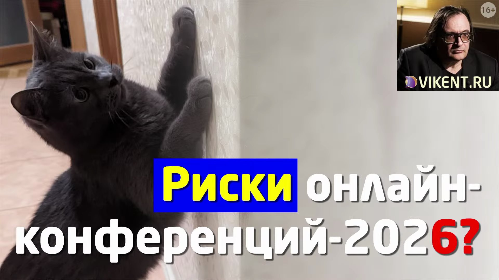

Давайте посмотрим, как бы, и так далее. Вот как бы, да.

---

## [01:11:30]

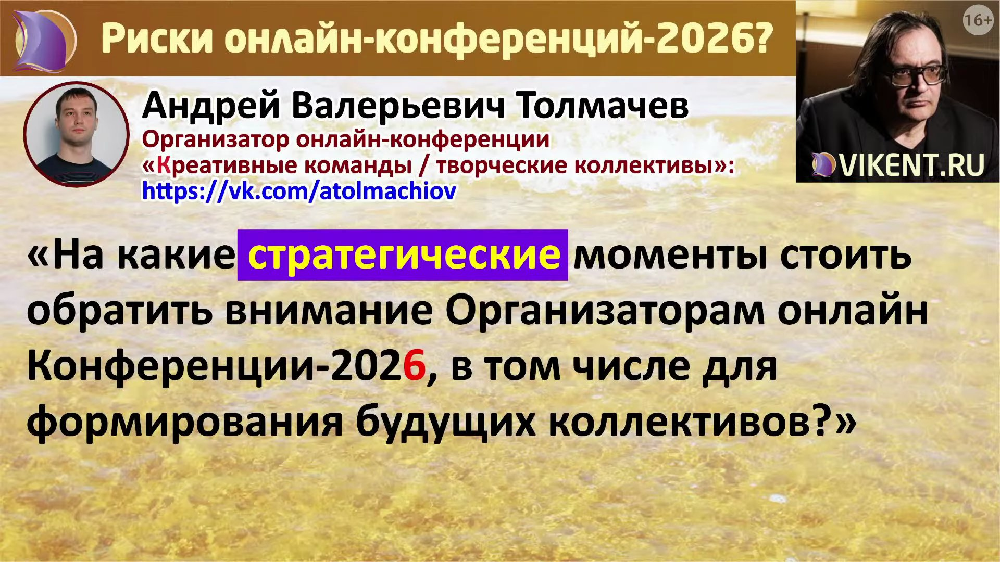

Итак, Андрей Валерьевич Толмачёв в этом году, за него извинюсь, там были некие обстоятельства, вот не смог Андрей Валерьевич повести, но будем надеять, что в 2006 году он проведёт свою вторую конференцию, соответственно, по коллективам и творческим командам и так далее. Вот. Ну давайте, соответственно, м снова заповедь. заповедь её надо повторить, что, соответственно, имеет смысл думать именно серии мероприятий, именно серии мероприятий и так далее, и так далее, и так далее. Вот как бы соответственно чрезвычайно важно, когда мы свои судьбы соединяем, думать не только какая у нас будет помпезная свадьба, а, соответственно, как бы после свадьбы будет много дней, и, соответственно, как бы, ну, и муж, и жена несут какие-то обязанности, вот должны в чём-то себе отказывать. Ну, подсистемы объединились в надсистему, и, соответственно, права подсистем уменьшились. Некоторые тызовский закон, применимый к семейной жизни. Не все его понимают. Ну, давайте посмотрим мой ответ. Мой ответ. Мой ответ посмотрим. Соответственно, как бы есть как бы типовые риски.

---

## [01:12:45]

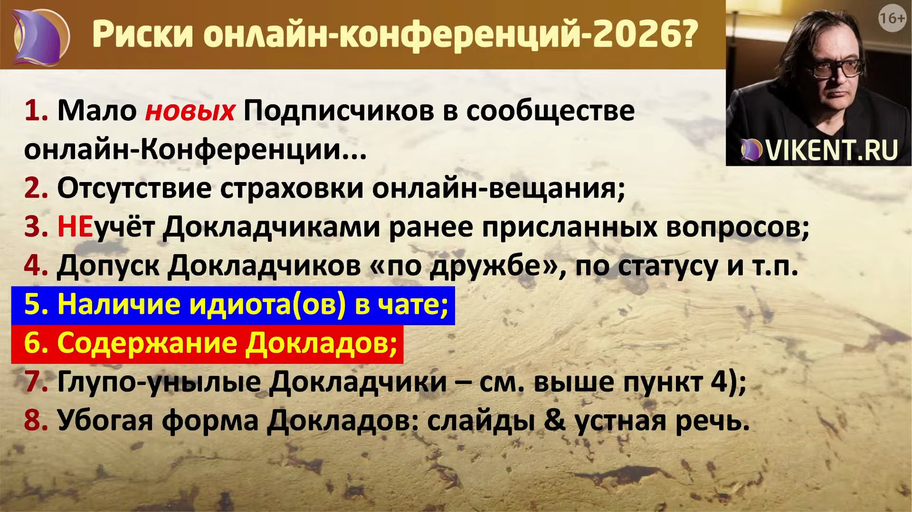

Соответственно, когда Толмачёв слушает коллегу Калугина, Калугин Толмачёва, то есть для первой конференции это нормально, для второй, для третьей, для пятой - это плохо, то, соответственно, в сообществе должно быть несколько сотен, ещё раз, несколько сотен подписчиков, которые данной тематикой интересуются. Что делать? Сказано раз в 10, соответственно, дальше надо принять к исполнению. Соответственно, как бы понятно, что сейчас большие проблемы с интернет-вещанием, поэтому должны быть какие-то страховочные варианты, которые тоже обсуждаются. То есть вещания без страховки нехороши. Как бы некоторая интересная штука проводилась в августе конференция очередная Константином Сергеевичем Калугиным, имеющае название прогнозирование аварий катастроф. И утречком воскресенье выяснилось, что, соответственно, в Ижевске, откуда планировалось вещание, соответственно, ну, просто просто нет интернета нужного. Соответственно, к чести через название прогнозирования аварии катастроф Константин Сергеевич Калугин успел перебраться в другой город. Успел перебраться. И славно прошла конференция. Конференция неплохая, конференция растущая. Значит, большое спасибо Константину Сергеевичу. Он умеет прогнозировать некоторые типы аварий и катастроф, чего я желаю в пункте два всем, как бы, да. Соответственно, как бы люди на конференции очень чуткие. Просто-напросто, если вы не учитываете вопросы, даже, может быть, глупые вопросы, соответственно, на вас кто-то обижается. Пункт четвёртый. Ну, как правило, опять-таки, вот это, может быть, даже назвать эффект последней недели. Начинают прорываться какие-то друзья, друзья друзей. Я тоже выступлю, то есть с погаными слайдами, без репетиций и так далее. Без репетиций, как бы множественное число. То есть на наших конференциях, если мы проводим по технологии викенд, одна из репетиций с Игорем Леонардовичем Викенть. Вчера была серия репетиций. Вот как бы, то есть доклады уже были, ну, скажем так, они опережают по своей тематики то, что делают другие люди, не наши. Опережают то, что их можно усилить. Да, конечно, их можно сделать очень сильными, но для этого мы должны заниматься с каждым докладчиком дня два-три. 2-три по 2-3 дня у меня, к сожалению, нету, потому что я долж должен туда остановить все проекты, но они приличные. Но тем не менее просто репетиции с организатором конференции и репетиции с викен это просто заповедь. Как бы слово хочу умножает докладчика на ноль сразу же без разговоров и так далее. Вот как бы да. Соответственно, если без репетиции, почему это важно? Получаются глупо унылые докладчики. Потому что если докладчик уступает после сильного докладчика и особенно докладчицы, сам прекрасно понимае, что несёт ерунду, то будет глупо, уныло и на онлайн-формате люди просто отключаются и разбегаются, когда очный формат, ну, как-то вставать, выходить из зала тяжело и так далее, и так далее, вот и так далее. Вот. И, соответственно, восемь восемь опыт показывает, что просто опыт показывает последних конференции, не буду, естественно, называть авторов, то у многих авторов у них может быть очень неплохое содержание, но почти что у всех нужно дотягивать слайды и дотягивать, ну, устную вещь, потому что, ну, вот как бы онлайн-доклад его надо как-то, то есть есть специфика онлайн-доклада, потому что, допустим, докладываю Интересная женщина, просто интересная женщина, ну, какая украшение конференции и так далее. Вот если же мы не видим интересные женщины, докладчик, мужчина, как бы не преподаватель, говорит хорошие, ну, правильные вещи, но немножко как бы не красочно, то люди просто отключаются. При том, что содержание может быть хорошим. То есть вот в в онлайн-формате очень важно и так далее. Это некие основные риски. Вот, соответственно, когда у вас будет время, позвоните, может быть, совместно с коллегой Каримовым. Просто расскажу трюки, которые вытворяли участники и докладчики на очных и, ну, и на онлайн-форматах. То есть, ну, вы должны знать, популяризировать популяризировать эти трюки я не буду, значит, на своём онлайн конференции. Ну, а мы идёмте дальше. Дальше. соответственное развитие докладчиков онлайн-конференций. Соответственно, как бы есть такой критерий, который в книжках по конференционному бизнесу, я их изучал довольно много, не встречается.

---

## [01:17:45]

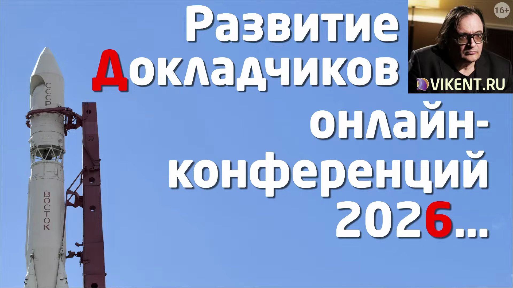

Значит, как бы, как можно оценить одна из, я об этом написал, отвечая на уточняющий вопрос. То есть, допустим, когда то есть вот у меня практически ежедневно на столе появляется прекрасно изданные труды по каким-то гуманитарным конференциям, где а почти все почти все, значит, соответственно, доктора наук и которые проводятся в Москве и в Питере, соответственно. То есть какой-то очередной толстенный том страниц 300-400 там и так далее. Т доктора наук, как правило, там один хороший доклад. Соответственно, то, что делается сейчас онлайнконференциях, у нас, в принципе, довольно ровное качество либо всех, либо почти всех, то есть квалифицированного большинства. Вот как бы это вот некоторые критерии. Если это происходит из года в год, это уже очень хороший результат. для того, чтобы усилить любой доклад, который, ну, я потронироваю, скажем так, я научный руководитель. Мне нужно 2-3 дня и заниматься с токо только с докладчиком. У меня двух-трёх дней нет, хотя повторяю, это возможный вариант. Возможный вариант. Ну вот как бы он требует просто времени. Но зато, значит, мы позанимаемся 2-3 дня. В среду ночью я сдаю вёску. Слайды вот эти слайды со среда, со среды на четверг я сдаю. Но у нас не будет для всех занятия воскресенье. Будет один хороший доклад докладчика, которого я дотяну. Ну вот сами сделайте выбор. Давайте посмотрим вопросы. Давайте посмотрим вопросы. Следующий слайд. Вопросы Ксения Саны Колугины.

---

## [01:19:45]

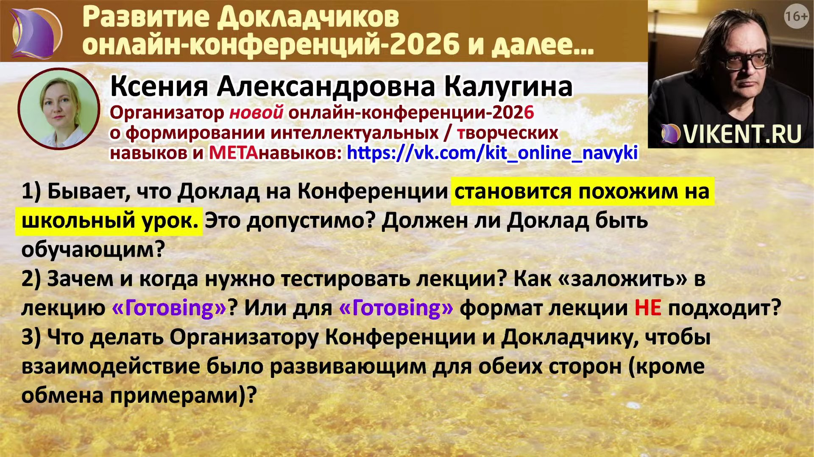

То есть, соответственно, в конце в конце января, по-моему, 25 января, воскресенье, она проводит первую конференцию по навыкам. творческим, интеллектуальным. Я постоянно приписываю слово метанавыком и так далее. Вот как бы уже расписанные докладчики. В принципе, ещё, ну, не самое позднее время обратиться, но скоро уже будет поздно. Ну, действительно, будет поздно. Соответственно, первый вопрос. Такой грех действительно есть у школьных педагогов. В принципе, это такой, ну, если человек нормально выступает, этот грех простительный. Плюс обычно я делаю несколько трюков для такого человека, и, соответственно, человек перестаёт быть похожим на школьного учителя либо школьную учительницу. Это относится к формам. Соответственно, зачем и когда нужно тестировать лекции? В принципе, в принципе, когда лекции идут по новому материалу, почему я прошу, то есть почему я прошу, почему я прошу задавать вопросы после каждой лекции? После каждой лекции, почему я прошу делать уточняющие вопросы после опубликования программы? То есть, по идее, по идее у нас было таких несколько попыток. Так получается, так складывается график, что я должен отдать слайды на вёску по новым материалам, соответственно, в ночь со среды на четверг. То есть у меня есть 3 дня на, в общем-то, мягко говоря, очень новый материал. То есть я не читаю как бы не о законе Ома, где безумное количество материалов. Я читаю некоторые уникальные материалы, по которым, мягко говоря, материалы, может быть, и есть, но они разрознены в буквальном смысле слова в сотнях источников, и, мягко говоря, их надо выцепить. То есть у меня есть три дня на подготовку уникального материала, да, и по идее просто не получается. То есть я как бы готов в среду ночью, в среду ночью почитать сначала какой-то избранной группе, ну а потом отправлять навёску. То есть где-то что-то я не попаду, но я могу это исправить. Это исправить, отвечая на вопросы наиболее таких, ну въедливых, въдливыхдовых учеников. Поэтому вот как бы новые лекции желательно тестировать. Соответственно, у меня хорошо заточенное ухо, когда я слышу доклады по тематике, которые, ну, которых я более-менее разбираюсь, но я очень, ну, десятки людей могут это подтвердить. Соответственно, я секу, и форму, и форму, как бы, да. Соответственно, сложилась некая традиция готовинг - это склонность к действию, то, соответственно, вы можете призывать, и это правильно. На мой взгляд, докладчик в конце лекции, у нас такая традиция есть, то есть может призывать, допустим, если вышла книга, призывать купить книгу. Мой совет на это использовать максимум один слайд, как бы большого ажиотажа это не вызовет. Ну, уже проверено, да, можно призывать присылать примеры, писать письма, то есть, ну, разумно, если уж мы дошли путём траты времени, нервов, денег и сил, соответственно, на конференцию показать свою открытость общества, повторяю, не очень надеясь. То есть опыт показывает, что на какие-то призывы, ну, русская интеллигенция, соответственно, состояние делать репост, не лайки, а репосты уникальных материалов в 1-2% случаев. Ну, русская интеллигенция всё доказала, уже всё доказала, как бы, да, соответственно, скажем, да, по поводу организатора конференции, как бы, ну, конференции действительно это некоторый барьер, который нужно взять. Давайте посмотрим, что исходя из моего опыта, а я здесь как бы съел зоопарк, как бы зоопарк, не собаку, а зоопарк. Соответственно, здесь вот то есть конференция - это аналог некого проекта, который идёт ряд лет.

---

## [01:24:00]

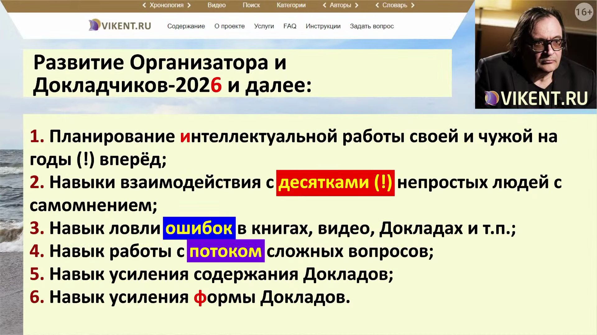

И, на мой взгляд, организатор, вот организатор вот как бы конференции и докладчики, которые сознательно относятся, как бы вот вот что их ожидает. Соответственно, сюда не входят две категории докладчиков, которые у нас были и так далее. Вот бывают докладчики, которые что-то выступают на конференции один раз и всё. Когда материал очень новый, то есть человек просто не умеет систематически работать. То есть это, в принципе, ну почти бессмысленно. Ну только если конференция не поводится один раз и просто нужно наполнить докладчиками. Второй момент, лентяй докладчица, либо лентяй докладчик. Такие у нас тоже были, которых, соответственно, и организатор тянул, и я тянул. Опыт показал, что тянуть не надо. Люди всегда неблагодарны. Люди никогда не понимают, что их там вообще тянули за ушу. Вот. Хотя им даже это сообщалось в лобт на закрытых созвонах, что вообще мы вас тянем и в виде исключения. люди не понимают. То есть поэтому мой совет от капризных докладчиков, докладчики, которые выступить хотят один раз и чтобы их заметил Путин, соответственно, как бы вот расставаться без сожаления, без сожаления, даже если они в проактивите или рядышком с ним и так далее, и так далее, и так далее. Вот. То есть система конференций, система конференций, она ставит некоторые навыки, она вынуждает трудиться и, ну, являющим таким некоторым мотивирующим, мотивирующим фактором. То есть как минимум нужно поставлять свою работу на год, на год в институте, в институте, в вузе, как бы, мягко говоря, этому не учит. Ну и ещё одно видео. Давай следующий слайд. Давайте следующий слайд. Соответственно, вот некоторые конференции перечислены, правда, без дат.

---

## [01:26:00]

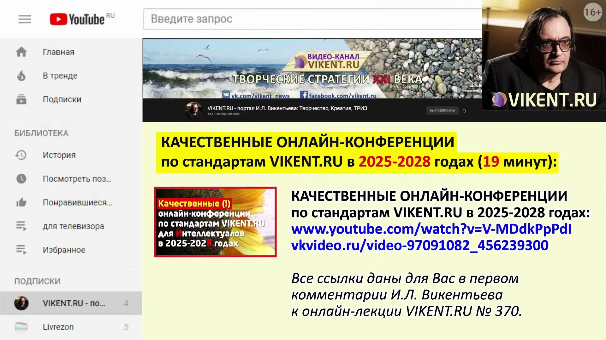

Соответственно, вот сейчас пойдёт конференция Верченко 5 октября, последняя конференция пятого года, и, соответственно, уже будут ясны все даты конференции, конференции следующего года. Соответственно, участники могут вписываться, вступать в сообщество, докладчики вступать в сообщество и начинать обсуждать, начинать обсуждать с организаторами, с организаторами их доклады. Львины докладов у нас заказные, то есть их предлагаю я, их предлагает организаторы. Соответственно, не возброняется предложить тему докладчикам. Поэтому мы сразу должны сказать, что, как правило, когда докладчик предлагает тему, очень очень большой риск процентов 80, что тему вы завалите именно потому, что у вас что-то болит, сверхбит, вы предлагаете эту тему, то есть как знакомиться с мужчинами. Были такие у нас темы несколько раз от дамочек. Всё это кончилось печально. До сих пор, по-моему, не познакомились. Пишут ВКонтакте ерунду, как бы, ну, и так далее. Вот как бы, да. Вот поэтому, ну, вот так вот. Ну, повторяю, это тема, тема закрытых переговоров. Никто никогда не узнает, как бы. Ну, на обратите внимание, домашняя задания связано с этим видео, в том числе. Ну, идёмте дальше. Идёмте дальше. Да, мы чуть-чуть выйдем за полтора часа.

---

## [01:27:30]

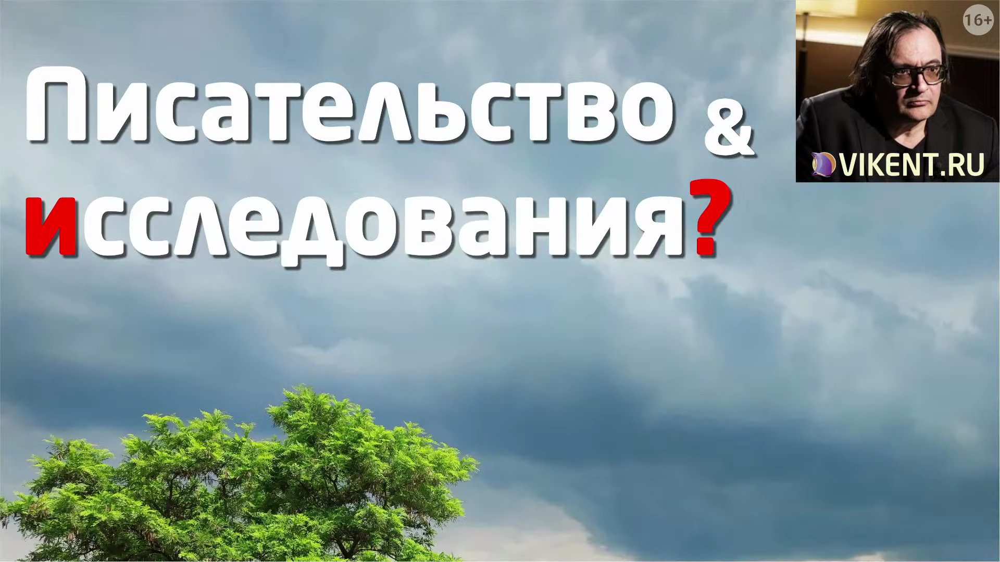

Большое спасибо, значит, ээ коллеги Толмачёва за фотографию, как бы за фотографию. Такой такие небеса, писательство. Ну, как-то понятно, что это русское поле и над ним летят такие небеса. Андрей Валерьевич Толмачёвым большое спасибо. Давайте посмотрим вопрос высланный, кажется, из Минска. Давайте посмотрим. Давайте посмотрим. Посмотрим, соответственно, скажем, ээ, вот есть некий вопрос, да, из Минска, правильно я был, как бы человек прислал вопрос и так далее. Вот как бы, да.

---

## [01:28:00]

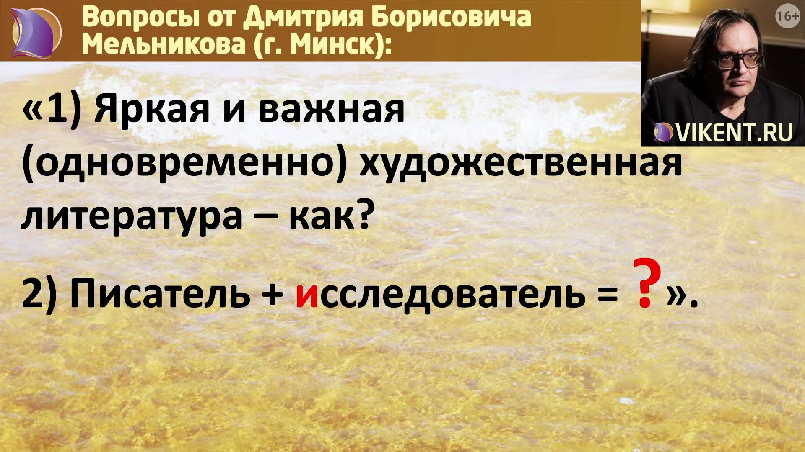

А вот, значит, на мой взгляд, то есть на мой взгляд, как бы можете обидеться, пожалуйста, мой совет как бы не заниматься ерундой. Мой совет не заниматься ерундой. Я на этот похожий вопрос уже отвечал. Соответственно, пункт номер один. Что я вам чрезвычайно рекомендую сделать? Просто-напросто по векам. То есть данные доступны, их можно собрать за неделю, если вы будете работать для для не для меня, для вас. Другое дело, что это может быть публикация, чем предлагаем публиковаться у нас Дзен. Соберите количество просто-напросто такую штучку постройте. Значит, XV век в столице Европы количество писателя в крупных городах Европы. Париж, Лондон, Берлин, ну и так далее. Вот, соответственно, количество читателей можно или количество литературных журналов. То же самое по картинам. Количество живописов в Париже, количество людей, способных, ну, помимо короля, наслаждаться картинами. Соответственно, если вы такое соберёте такие таблички, даже не очень точно, вы поймёте, то есть вы поймёте, что сейчас сейчас в столице Минск - это столица Беларуси, в Москве и в Пити и так далее. Вот как бы писательство находится на третьем этапе, на глубоком третьем этапе, на котором могут быть отдельные интересные произведения, но вообще это способ прожить жизнь в Бог. Прожить жизнь в Бог. И над этим над сильно висит соотношение соотношение числа писателей и, соответственно, числа потребителей. Потребитель, ну, по научным реципиентов. Это может быть читатель, это может быть слушатель, это может быть зритель. Зритель - это если картины и так далее, и так далее, и так далее. Вот, соответственно, м, соответственно, давайте посмотрим следующий слайд. Следующий слайд. Можно сделать другую проверку, тоже можно сделать публикацию надо вз тема 1738.

---

## [01:30:15]

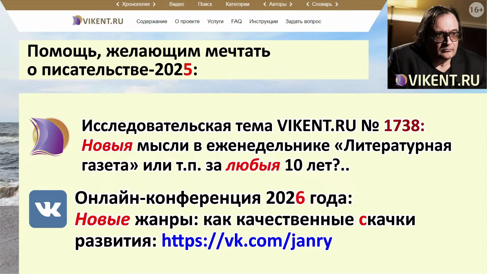

Впервые даю персональную тему, персональную тему. Соответственно, есть орган Союза, Союза писателей России, литературная газета. Так получилось, что моя мама выписывала его несколько десятилетий. И ещё в школе я понял, пункт номер один: писатели не могут выражать мысли кратко. Пункт второй: у писателей, я настраиваю на этом, как бы каких-то мыслей нет. То есть, э, третья мысль, она будет сложная. Возьмите учебник по геологии, и там где-то, скорее всего, близко к началу, где обзор, будет написано примерно следующее, что как бы первый раз человек познакомился с металлом, потому что какие-то куски медико вулкана, и человек их подбирал, делал какие-то, ну, какие-то и на продажу или какие-то, значит, ну, устройства для обработки там чего-то там зерна. Соответственно, очень редко там после очередного извержения, там размы дождём и так далее, и так далее, и так далее, вот появлялись новые куски, новые куски и прочее, прочее, прочее. В XX веке пришли геологи, просветили, просветили и выяснилось, что настоящее залегание жилы меди жилы меди, соответственно, ну, минимум 50 м вглуб. Ну, на поверхности иногда выходят какие-то кусочки, но это ерунда. вообще нужно рыть 50 м. То же самое я сегодня об этом говорил. Соответственно древние писатели могли нам сказать истину в античности. Грубо говоря, они подбирали то, что лежит просто на поверхности. И, пользуясь тем, что они были грамотны, могли сообщить это письменно, как Аристотель, либо устно, как Сократ, которого записывал, соответственно, Платон из больший сдвижки по времени, соответственно, скажем, ксенофонд. И, похоже, Ксенофон там и и Платон придумывали заката, что-то там додумывали, да. Поэтому, соответственно, если есть силы, мой совет не заниматься ерундой. Для того, чтобы быть исследователем, нужно овладеть методиками исследования, курс о которых будет продолжено следующее воскресенье. Всё, что лежало на поверхности, уже сказано. Плюс помните, что если вы хотите быть писателем, вы, соответственно, вступаете в добровольную конкуренцию с большим количеством людей. В Союзе писателей СССР было 10.000 авторов. Вы 20 авторов назовёте. Хотя из этих 10.000 вы назовёте вот, ну и так далее. Вот. Ну и, соответственно, такая маленькая радость, чтобы вам было не так гойко. Соответственно, писатель Проханов, писатель Проханов написал рок-оперу, называется "Хождение в огонь". Значит, информация есть, даже сайт есть у них, посмотрите. Ну вот, повторяю, писательство ушло в подсистему написания сценария рок-оперы. Проханов ни разу не рокер. Ну и так далее, и так далее, и так далее. Вот как бы, но тем не менее Проханов написал рокопирую. Я не прикалываюсь, проверяйте меня и так далее. Вот поэтому мой совет, если у вас есть силы, писательством не заниматься. Плюс посмотрите, вот есть как бы конференция по развитию жанров. Человек собирает несколько десятилетий материалов, Роман Стефанович Флореску. как бы основной тезис этой конференции будет о том, что как бы создаёшь новый жанр, и жанр тебя вытягивает из ерунды. Поэтому те, кто может, ну не занимайтесь ерундой и делайте репосты нормальные, как бы, да. Вот, соответственно, скажем, да. Ну, давайте дальше идёмте. Ну, соответственно, в двух шагах от Невского во дворе библиотеки Маяковского сфотографировал подсолнух, как бы в двух шагах от Невского. Если бы мне кто-то сказал, что там есть подсолных, и пока сам не увидел, не поверил бы. Не сорванный, кстати. Ну, для питерцев оговорка, да. Давайте посмотрим вопрос с Дальнего Востока.

---

## [01:34:15]

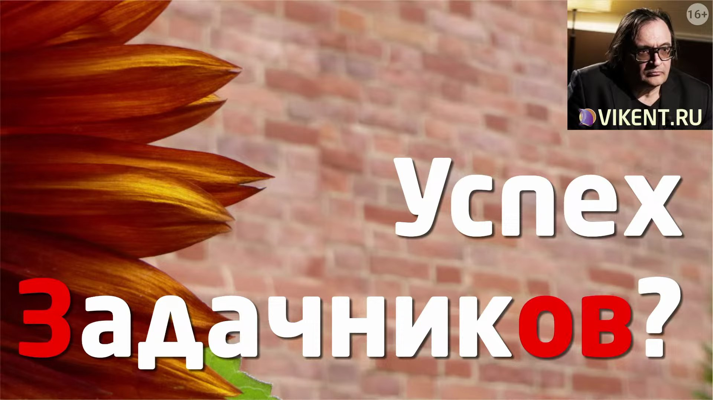

Сейчас назревают несколько задачников. Они постоянно проходят вычитки. даются они тяжело, то есть даются они тяжело и в вычитке, и в составлении, а безвычитки они бессмысленны.

---

## [01:34:30]

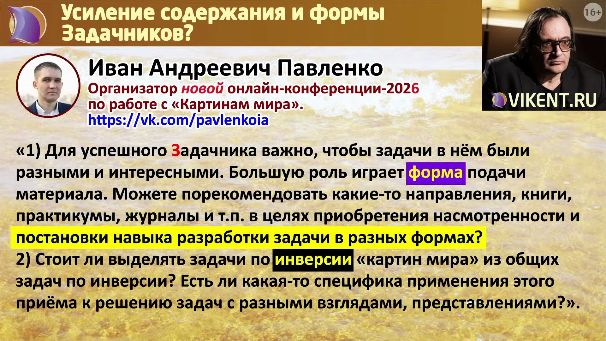

Соответственно, сообщаю ещё раз, ни я, ни авторы задачников, пока мы не обнаружили теорию составления задач, теории составления кейсов. Ну, как бы какие-то банальные какие-то банальные утверждения типа того, что желательно, чтобы задачи шли от простого к сложному, ну, как бы, ну, это банальность, как бы, и так далее, и так далее, и так далее, вот как бы, да, соответственно, но тем не менее такая проблема существует. Поэтому, соответственно, я думаю, что мы сделаем некоторый круг. То есть, когда выйдут, я думаю, что они в каком-то виде выйдут ближайшие год-два задачники, их можно будет уже изучать, сравнивать. Как бы мы сделаем какой-то небольшой шаг в познании по поводу как вот новой профессии человек, который делает задачники. Такая профессия пока, ну, не существует, наверное, только у нас. Так, ну, давайте, тем не менее несколько советов, что можно сделать и так далее. Извините, на несколько минут, за полтора часа я выскочу. Давайте посмотрим. Значит, соответственно, постоянно советую. Значит, есть 13 приёмов занимателей науки по перельману. То есть, допустим, можно скучно рассказывать физику.

---

## [01:36:00]

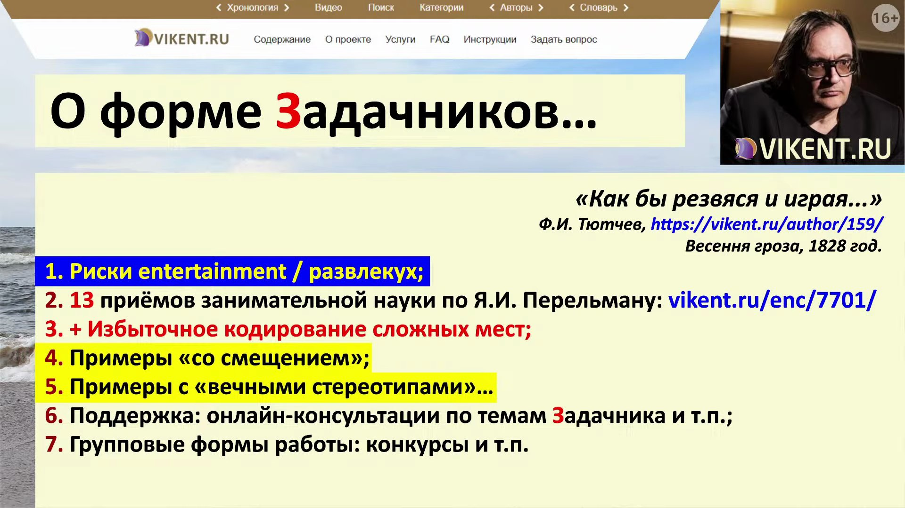

Яков Исидович Пелиман заимствовал это без ссылок у Тисандие. Тисандие французский астроном и физик. Вот без ссылок. Ну действительно очень интересно, когда какой-то фокус построен на физике и запоминается, выучивается гораздо легче, чем просто некий скучный учебник физики с формулы. С формулы. Это действительно материал открытый, изучайте. Значит, дальше, соответственно, как бы есть некоторые риски. Пункт один закрашен синим. Сейчас очень модно поговаривать как бы о обучение с развлечением и так далее. Вот я готов на эту тему говорить, когда мне представит представить какой-либо серьёзный научный либо методический материал, как бы когда вот учение с развлечением, серьёзный материал, как бы, то есть, да, поэтому риски, то есть в определённом смысле как бы дальше начинается разговор о поколении Z, о том, что они ходят вместе с папой, с мамой на собеседование, на свою первую работу, ну, и так далее, и так далее. Вот как бы вот, ну вот тем не менее, да, то есть задачник, он предполагает труд. Задачник предполагает труд, потому что так порастают под давлением. Нервные связи порастают под давлением. Это знают сержанты всех армий мира, сержанты, работающие и офисры в учебных подразделениях и так далее. Да. Соответственно, пункт третий о форме задачников. Мы об этом говорили, как бы на вычески это вылезает. Некоторые места могут быть непонятны. Ну, избыточное кодирование. Что это будет? Это будет схемы, видео, карикатуры, рисунки, сравнительные таблицы. Это дело десятое. Есть несколько стандартных решений, которые сейчас перечислил. Далее, соответственно, как бы некоторые примеры со смещением. Некоторые примеры со смещением и так далее. Вот. То есть, соответственно, как бы, если вы хотите, если вы хотите как бы [музыка] рассказать хозяйкам, ну, хозяйкам, женщинам, как бы, как готовить, как бы что-то, какие-то национальные блюда их национальности, да, то, соответственно, вы можете получить очень много ехидных вопросов, и вас поймают, вас поймают как бы на каких-то неточностях, незнании там местных сортов и так далее. Вот. Вот если же этой же группе женщин, ну, например, естественно, условной, вы расскажете как бы о подготовке тех же самых блюд с небольшим смещением, то есть соседней республики, по другую сторону горы, типа по мир и так далее, и так далее. То есть всё очень похоже, те же самые принципы, но немножко иначе. вас будут внимательно слушать, потому что как бы это не совсем про нас, хотя про нас вот этот педагогический приём есть. Другое смещение, когда, например, например, соответственно, я немножко работал с редакцией журнала Юный техник, ну, просто как бы они были на смене в Артеке, поэтому как бы разговаривали. Соответственно, юный техник, они делали исследования, читало большое количество взрослых инженеров. Из названия журнала следую, что это как бы для детишек. Ну вот если там интересные картинки, вкусно написано, то масса инженеров что-то читала через юный техник. Вот, как ни странно, тоже смещение. То есть как бы как бы для детей читают папы, а читают папы взрослые инженеры и так далее. Вот пятое. Хорошо заходят примеры с вечными стереотипами. Смотри методику. Сейчас она покажем в очередной раз. Игорьче Викинтьева. Приёмы пиар. Они хорошо идут так далее. Да. Далее. Шестое. Если собирается какое-то сообщество, будет ли это раз в квартал, будет ли это, не знаю, там каждую субботу, значит, ну там это зависит от сообщества. В принципе, очень-очень хороши консультации. Причём, как правило, на консультации выходят, сами выходят, их уговаривать надо. А лучшие, худшие либо лентяи, либо люди, которые хотят что-то скрывать, они не выходят. Есть такой как бы признак у таможенников всего мира в аэропорту, что если какой-то человек стоит в очереди на посадку в самолёт и начинается от таможни прятаться за колонну, его нужно брать за хобот, потому что как бы вот человек, ну, между собой и таможня делает как бы искусственную преграду, используя ресурс колонну на значит что-то скрывает. Есть высокая вероятность, что везёт что-то, ну, то, что не надо вести для тому можно. Так вот, соответственно, ну, здесь то же самое. То же самое, если есть что скрывать, человек начинает торговаться по поводу репетиций, консультаций и так далее, значит, есть что скрывать, в том числе свою глупость, там неготовность слайдов и так далее. Вот как бы, да. Ну и, соответственно, сем групповые формы работы, честные честные конкурсы. Потому, ну, честные конкурсы, которые, соответственно, ну, допустим, проводятся просто очно, например, очно как бы либо как бы поводится в онлайн-формате, но чтобы не успели списать, чтобы не успели загуглить и так далее, и так далее. Вот. То есть явно нужно продумывать слой задач для таких конкурсов, которые невозможно быстро загуглить. Что невозможно? Возможно, это исследоская такая тема, очень такая ехидная для преподавателей высшей школы. Темы рефератов, курсовиков и так далее, которые невозможно задач, которые невозможно быстро загуглить для преподавателей высшей школы и, значит, для старшеклассников. Соответственно, если останутся вопросы, то, соответственно, задавайте. Да, забыл пример со смещением, даже записал себе. Соответственно, есть сказка, все её знают, про трёх поросят. И там есть такой стрёмный стрёмный момент. Волк почему-то на эти несчастные хижины дует. Волк дует, они там разваливаются, ну и так далее. Вот, значит, как бы странно странно дующий волк. Оказывается, первичная сказка была про эльфов, но эльфов неправильно перевели, как бы, и эльфы там боролись с ветрами. Ну, короче, из-за неправильного перевода всё кончилось, как бы поросятами и волком. А ветер остался. Ветер остался. Ну, хотя изначально были эльфы. Ну, такой стрёмный пример со смещением. Давайте следующий слайд, который нам уже надоел, наверное. Ну вот, соответственно, как бы можно смотреть эту книжку. Там, значит, кое-что есть мною сейчас названо. Сделано совершенно сознательным. Ну и давайте посмотрим два видео. Два видео. которые, соответственно, полезны по этой теме. Два наших автора. У них, на самом деле, больше докладов, больше докладов.

---

## [01:43:15]

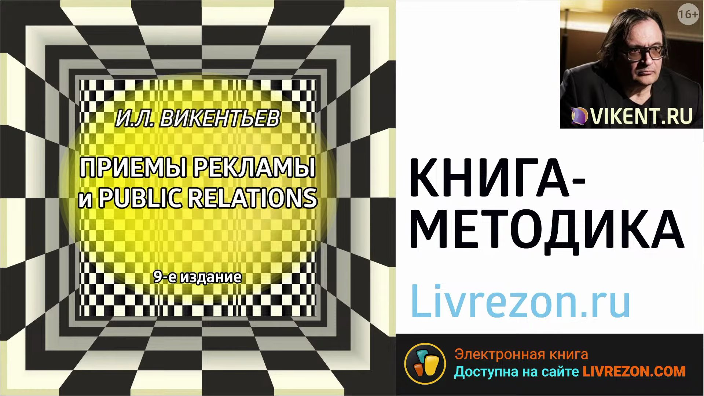

Можно к ним обращаться, они пришлют. Можно ко мне обращаться, я перешлю к ним, они вам пришлют. Именно по инверсии. Именно по инверсии. Ну и приступаем к последнему, значит, блоку.

---

## [01:43:30]

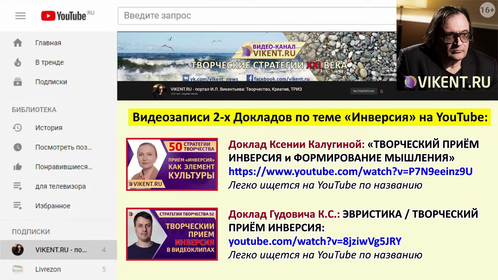

Ух ты, я немножко на 10 минут уже перелез. Но это действительно последняя тема. Вот это, значит, фотография Василия Александровича Верщенко, Москва.

---

## [01:43:45]

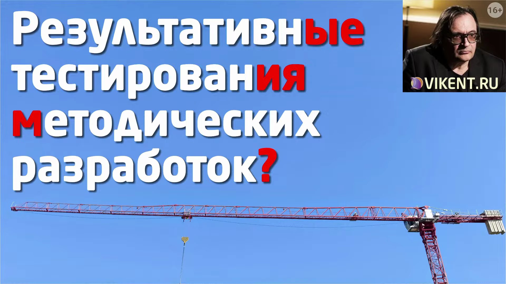

так далее. Вот, соответственно, значит, первое, значит, тестирование - это некий добровольный акт от автора. Недаром в области программирования есть специальная, не очень престижная профессия, не очень оплачиваемая тестировщики программных продуктов. Это не очень престижное, но с тем, чтобы просто, ну, автор не сам не нервничал, а занимался другими вещами. Ну, такая профессия нарождается. Давайте посмотрим. Давайте посмотрим. Соответственно, давайте, ну, повторяю, как бы всё написано и так далее. Давайте я прокомментирую табличку. То есть предупредив, что это добровольный ад, но его не миновать именно именно в задачниках, в тренажёрах и так далее, решебниках.

---

## [01:44:30]

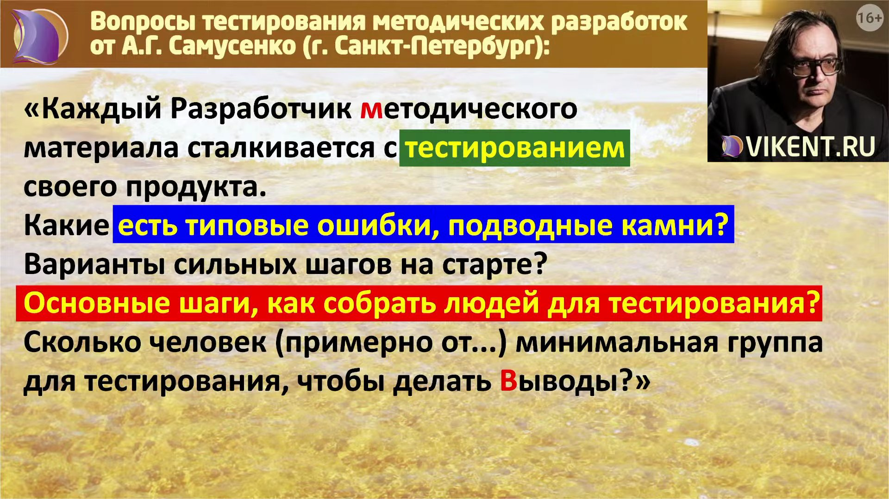

Так, давайте следующий слайд. Там табличка должна быть, да? Значит, соответственно, как бы тестирование возможно разного уровня. Соответственно, начинаем снизу.

---

## [01:44:45]

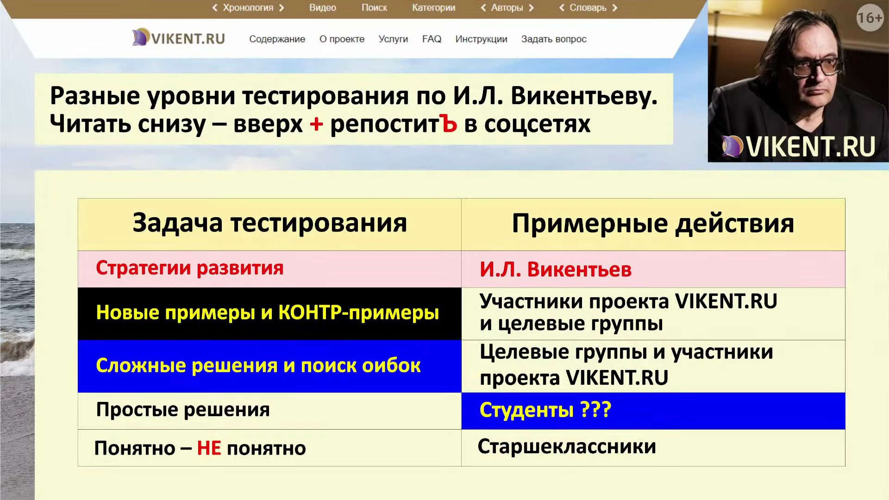

Значит, мой опыт говорит, что если за мелкие деньги, мелкие деньги, ну, грубо говоря, бутылка пива, ну, или там чашка кофе старшеклассникам, если старшеклассники из более-менее пыличной семьи, они очень хорошо находят понятно, непонятно в текстах, в рисунках и так далее. Вот. То есть вот мы это задача тестирования понятно, непонятно. Блестяще работают старшеклассники, у них так гормональная буря. Они очень чувствительны. Студенты ленивы. Студенты начинают торговаться с преподавателем, у них такой рефлекс, за что они получат автомат. Поэтому здесь стоит знак вопроса. То есть, то есть единичные студенты, единичные отобранные студенты, наверное, опять-таки, за небольшие деньги, возможно, что-то сделают. Возможно, что-то сделают за какие-то блага и так далее. Вот. Но студенты в целом, как бы, это такие торгаши за зачёт автомат. За зачёт автомат, соответственно, скажем, как бы вот некоторые сложные решения и поиск ошибок. поиск ошибок, соответственно, ну, обращайтесь, посылайте, мы бесплатно делаем вычитки. У нас есть некоторые коллеги, которые очень неплохо, очень въедливо находят. Ну и потом совет вступа А благодарить авторов, благодарить и вступать в переписку ВКонтакте. Вступать в переписку ВКонтакте и так далее. Соответственно, поиск новых примеров и контрпримеров, соответственно, как от каких-то людей, хотя это написано, из целевых групп, вы можете получить, когда вы что-то издадите, и это будет распространено тиражом хотя бы в несколько тысяч экземпляров. Какая это будет вариант? Бумажный, электронный, неважно. Минимум несколько тысяч экземпляров, соответственно. как бы со мной летом начиная здороваться на Невском проспекте, когда видео вышло тиражом, как бы моё, то есть я без шапки, без всего, как бы 30. 000 просмотров. С 30.000 со мной начинают 100.000 точно начинают, да, данные экспериментальные. Значит, 3.000 - это вот 3-5.000 минимум. Тогда можете надеяться на единичные примеры. Наши люди, как правило, если вы просто просите, примеров не присылают за речайшим исключением типа Андрея Валерьевича Толмачёва. Не все это, кстати, понимают. Вот как бы что-то труд некоторый. Обычно, если у вас состоится какой-то доклад, вышел продукт, люди начинают понимать, что, ну, с вами имеет смысл иметь дело. Вы серьёзный человек, вы не одноходовщик. Поэтому рекомендация делать доклады периодически из кусочков докладов делать статьи для дзнен три-четыре страницы. Три-четыре страницы, потому что всегда есть материалы. Вот как бы ну и готовить продукты на выход. Продукты на выход. Тогда можно надеяться на новые примеры и особенно контрпримеры. Вот что-то непонятно, ну, обращайтесь, так далее. Переходим к благодарностям. Уф. Да, мы сегодня нормально прилетели без заминок. Модератор у нас были сбои. Модераторы, да, сбоев не было у нас. Да, соответственно, благодарности.

---

## [01:48:15]

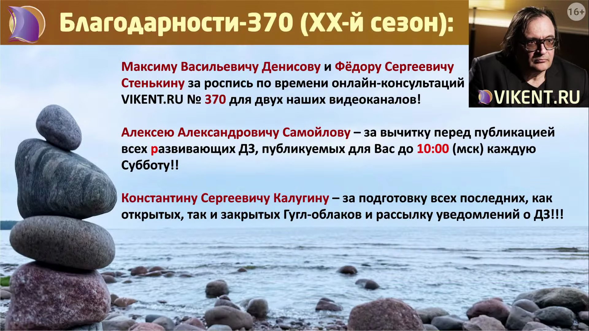

Благодарности, значит, кто нам помогает. То есть я как бы не один. часть вещей как бы помогают делать коллеги, за что им большое спасибо, потому что без их работы, соответственно, вещание было бы, ну, худшего образца. Ну, давайте посмотрим, посмотрим следующий слайд. Как бы мы уже идём к концу. Соответственно, вот сюда вот потихонечку, потихонечку переводится видео с Ютуба. Вот видео Ютуба, но это очень тихонечко, очень медленно в течение лет. В течение лет. Идёмте дальше.

---

## [01:49:00]

Кто понимает, кто понимает, как бы, что мы делаем и что моё здоровье, мягко говоря, хреновое, ну, пожалуйста, счета перед вами, пожалуйста. Да.

---

## [01:49:15]

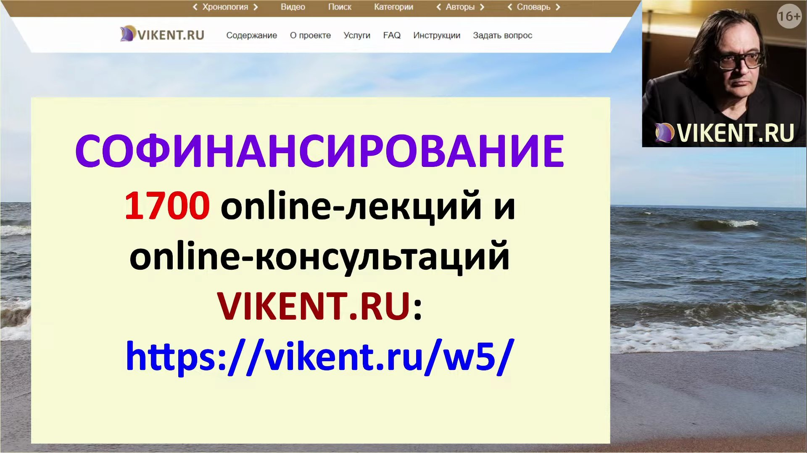

И, соответственно, на ответы по три тематики по жизни Генкачальшура требуется время в домашнем задании, которое опубликовано вчера, соответственно, просьба задавать вопросы. Пусть эти вопросы может прислать любой человек. Ограничение единственно на русском языке. Иногда кто-нибудь из Австралии, из Арабских Эмиратов пытается блеснуть английским, значит, как бы, ну, идите вы в Эмираты или в Австралию, как бы у нас рабочий язык русский. Ну, и последний момент. Последний момент, соответственно, у нас церемонное общение под видео. Церемонное общение под видео. И, соответственно, через 5 минут и ВКонтакте, и на Ютубе я поставлю свой комментарий.

---

## [01:50:00]

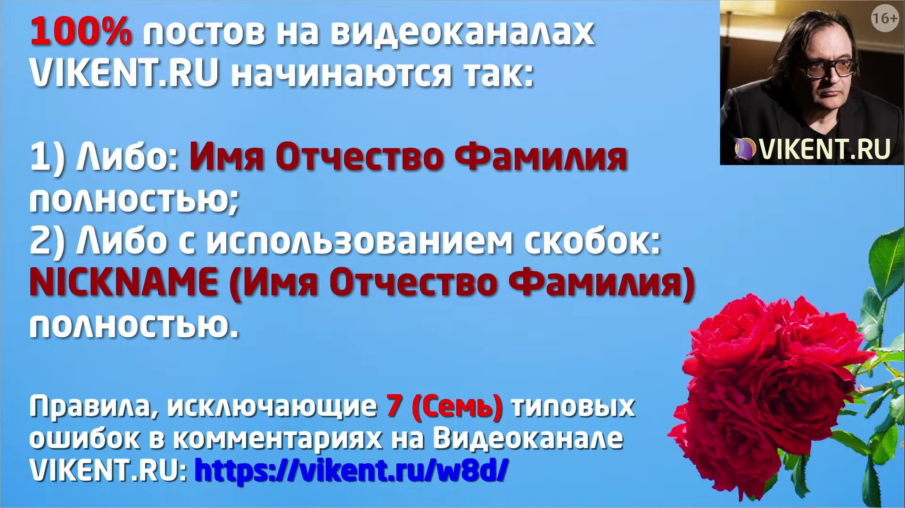

На Ютубе он будет первый закреплённый. ВКонтакте такой опции нет. То есть он рано или поздно съедет вниз, где будут ссылки на рекомендованные мною тексты и видео. Большое спасибо Александру Олеговичу Романову, как бы, и Анатолию Александровичу Жачку. Левызон за помощь в сегодняшнем вещании. Всего вам доброго. Соответственно, пишите письма, заходите вконтакте.

---