# Лекция 371

---

## [00:00:00]

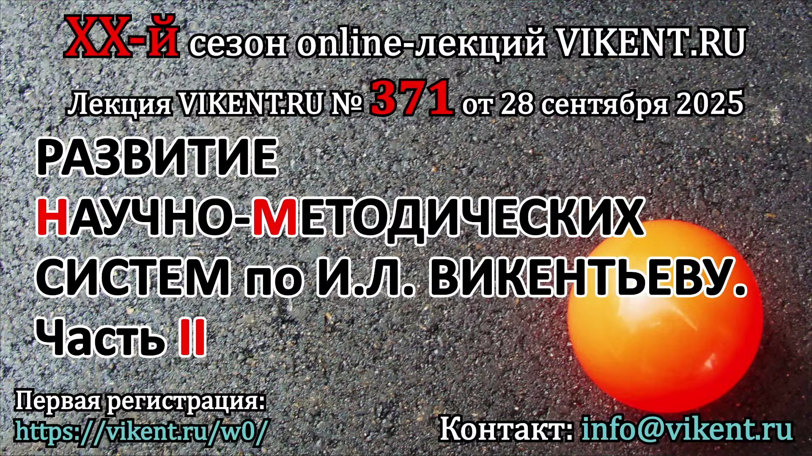

Добрый день, уважаемые зрители. Соответственно, у нас сегодня вторая лекция, вторая часть по курсу, вот в которой написано развитие научно-методических систем. Соответственно, если выбирать между научной честностью и массовостью просмотров, я выбираю традиционно честность. и должен предупредить, что если вы недавно у нас, то, соответственно, нужно будет посмотреть. Сейчас мы покажем, где на Ютубе либо в видео ВКонтакте первую часть. Более того, у нас принято какие-то наиболее важные моменты конспектировать. Если кому-то что-то неясно, лучше спрашивать, потому что материал, в принципе, скажем так, не самый простой. Обычно я говорю, что материал обычно, но непривычный. Сейчас я должен сказать, что мы используем сочетание абстракций, поэтому, соответственно, требует определённого внимания. Соответственно, и оговорка, что если будут неполадки, которые сейчас с трансляциями идут по всему русскоязычному пространству, мы не прекращаем, мы делаем резервную копию. И, соответственно, там ночью, утром или завтра, в понедельник мы это дело выложим. Давайте посмотрим. Давайте посмотрим. Значит, все последние, а, извините, это вот некоторый как бы эпиграф.

---

## [00:01:30]

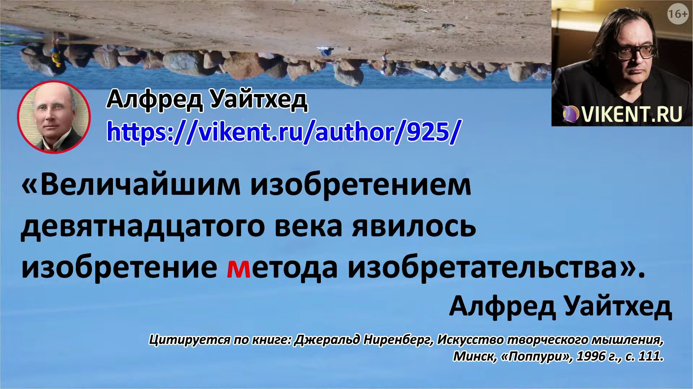

И его нужно понимать следующим образом, что этот эпиграф, таких высказываний много, что в XIX веке в развитых странах Альфред Уайтхд - это Англия, Великобритания, стало понятно, что если мы хотим извиваться, то, соответственно, мы должны делать эксперименты научные. Мы должны делать справочники и полагаться на это, а не на какие-то там неспособности от солнца, как бы не на какие-то божественные откровения, не на дар Божий, ну и так далее. Вот. Давайте посмотрим.

---

## [00:02:15]

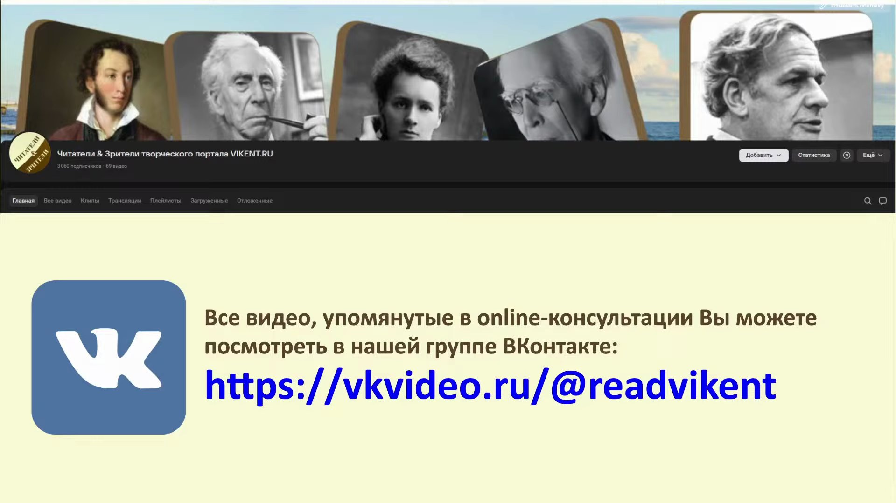

Давайте посмотрим сейчас, где у нас, да, давайте посмотрим, да, вот здесь вот все последние лекции и консультации ВКонтакте, значит, соответственно, есть для вас, в том числе и повторяю, первая часть, которую, если вы что-то начинаете не понимать, ну, следует внимательнейшим образом посмотреть и законспектировать. Ну, запускаем тогда такое, ну, предууведомление видео. Давайте запускаем видео сейчас, как бы, да.

---

## [00:02:45]

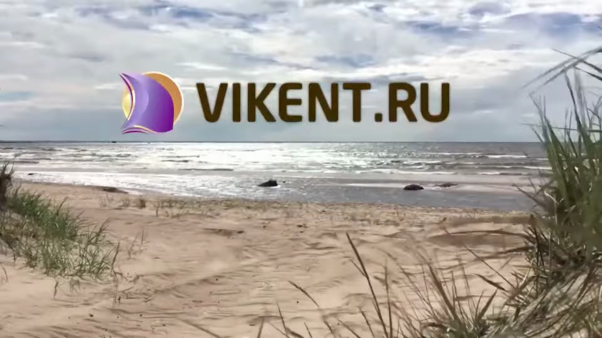

---

## [00:03:00]

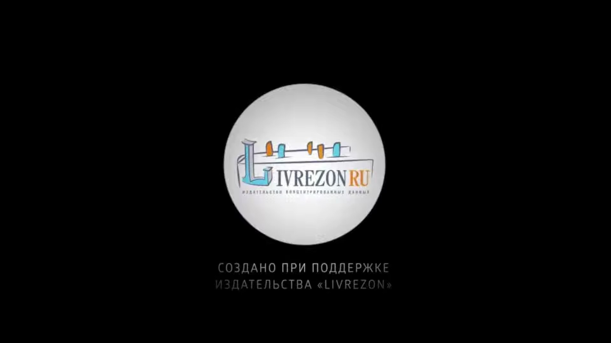

[музыка] [аплодисменты] [аплодисменты] Данный курс читается в рамках проекта Викент, который является крупнейшим порталом Европы по изучению творческих личностей и творческих коллективов. Материалы для этого проекта собирались мной с 1979 года. Надо предупредить, что наши материалы несколь сложные, сколько непривычные для обычного мышления, поэтому нужно смотреть их очень внимательно и слушать, а также рекомендуется записывать.

---

## [00:03:15]

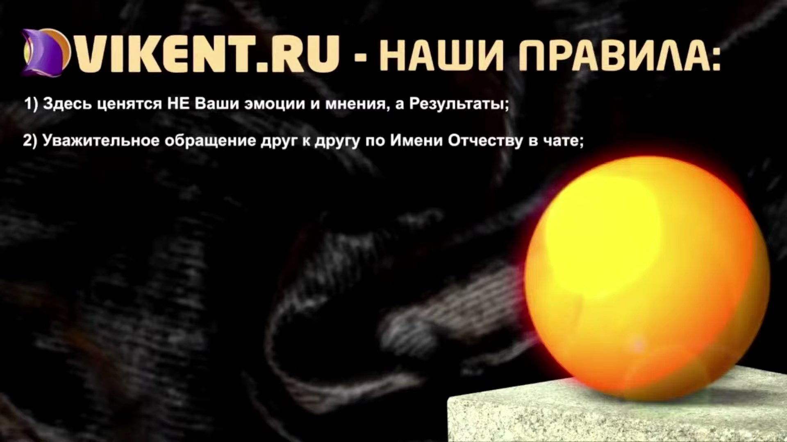

Как вы будете вести конспект в компьютере или в блокноте, это ваше дело.

---

## [00:03:30]

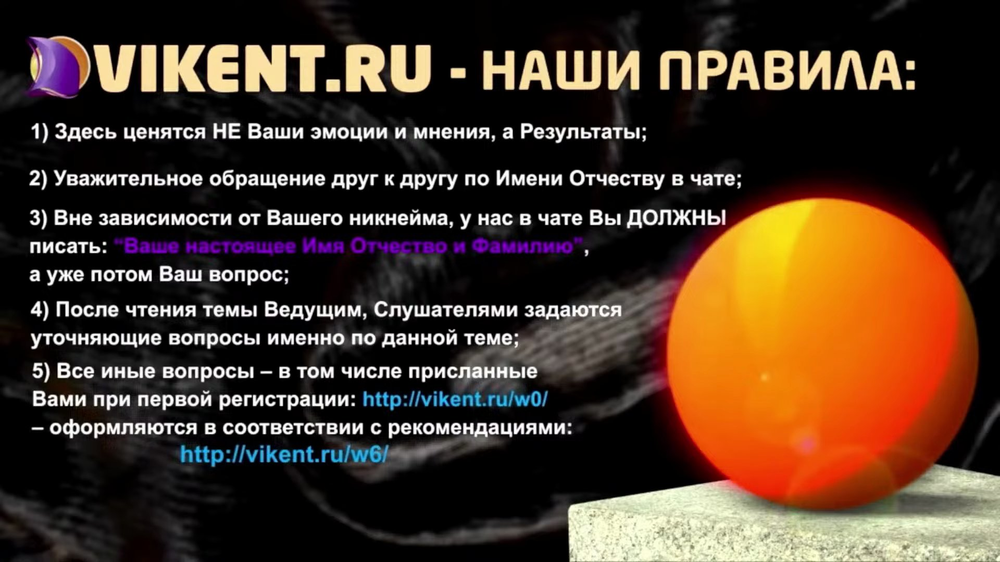

Лично я рекомендую вести в блокноте, посконо удобно не только записывать, но и зарисовывать те идеи, которые оглашаются в рамках нашего курса. Соответственно, у нас принято в Русской академической научной традиции обращение со всеми исключительно по имени Отчества.

---

## [00:03:45]

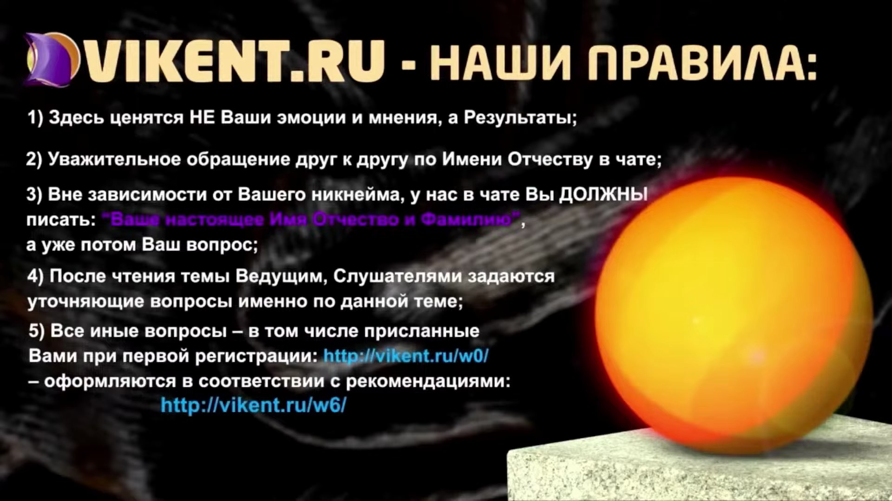

Поэтому, если вы зарегистрированы в Ютубе как Красная Шапочка, пожалуйста, это ваше право. Но у нас в чате вы будете писать себя как Красная Шапочка, а в скох полностью имя, отчество, фамилия. Ну, в противном случае вы просто будете удалены модератором.

---

## [00:04:00]

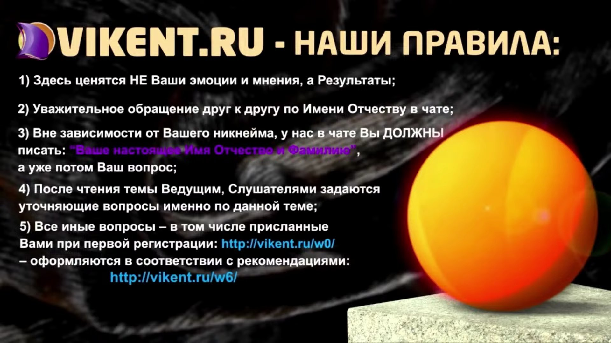

Причём удалены навсегда. Соответственно, у нас есть вопросы, несколько видов. Первый вопрос - это в конце какого-то логического куска, когда закончилась тема, и они задаются в чате. Если ваш вопрос существенно отличается от объявленной тематики лекции, то вы снизу экрана видите, как его задать по специальному формуляру.

---

## [00:04:15]

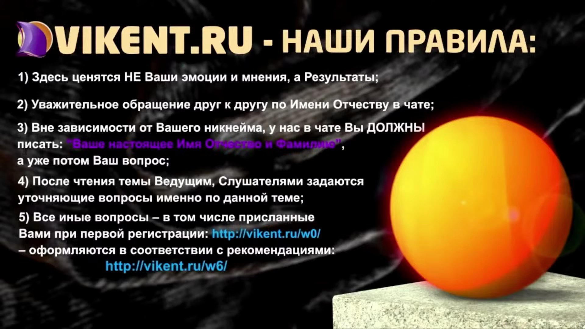

Ну вот оглавление. И, соответственно, как, как правило, оглавление было опубликовано аж в среду, учитывая сложность, определённую сложность сегодняшнего материала.

---

## [00:04:30]

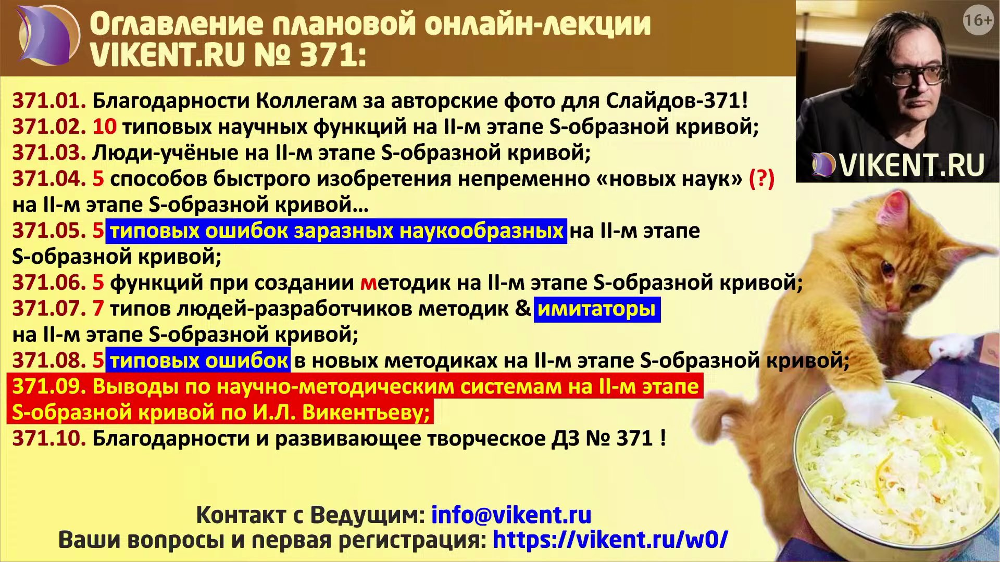

И колоссальное спасибо всем, кто задаёт уточняющие вопросы. То есть, мм, очень по-разному можно разворачивать каждый пункт. Более того, некоторые пункты у нас уже немножко были, но я постараюсь сделать с другими акцентами. То есть вот уточняющий вопрос, это такая находка. И большое спасибо, кто задаёт. Кто не задаёт, ну, постарайтесь задавать, потому что, повторяю, я ещё до лекции мне очень важно понять, вот какие делать акценты. Соответственно, организационные объявления, они следующие. Следующее воскресенье, это 05 октября, будет конференция, вторая онлайн-конференция бесплатная. Василия Александровича Верченко по такая с бизнесуклоном по клиентоориентированности и по созданию достопоримечательностей. Соответственно, судя по по всему, докладчиков будет больше десяти и, соответственно, она, ну, съест много времени и так далее, и так далее, и так далее. Вот поэтому я решил не делать, что люди устанут, и большинство докладчиков они же участники, соответственно, онлайн-курса. Поэтому 05 октября не будет ни лекции, ни консультации. Ну, точнее, консультации, скорее всего, будут. Ну, для докладчиков, для кого-то ещё, да. Это первое. Второй момент. Два раза уже публиковал. Пошли первые вопросы на 19 октября. Это вопросы по биографии Генкса Учальшу, создателя Трис, создателя жестл, курса о развитии творческого воображения и так далее. Вот пока вопросы пришли от людей, которых я не знаю. То есть как бы и, честно говоря, читать их печально, потому что, ну, грубо говоря, эти вопросы свидетельствуют о том, что у людей по поводу ТРИС просто, я не знаю, кого они читали, кого они смотрели, но не Альшули. У них, к сожалению, полностью задурена голова. Девятнадцатого я постараюсь такие термины не употреблять. Ну, соответственно, на этой неделе, на следующей неделе я попрошу тех, кто у нас на онлайн-курсе давно, те, кто делает какие-то самостоятельные разработки, персонально попрошу задать вопросы по Альшулеву. Кроме того, получено письменное согласие семьи. Если будут какие-то именно вопросы по жизни, значит, крупнейшего гения XX века, соответственно, семья ответит. Но такие вопросы нужно присылать заранее. То есть в идеале в идеале сегодня вече между вечером и ночью, завтра в понедельник задать вопросы как бы вот на 19 октября. То есть, когда мы будем, у нас будет плановая онлайн-консультация, и мы будем говорить, будем говорить про гехсочальшут, gст и так далее. Ну а между 0 пятым, когда не будет онлайн-лекции и не будет [музыка] каких-то консультаций, будет конференция Верченко, соответственно, Василия Александровича, то, соответственно, бонус будет потом по третьему этапу. по третьему этапу, возможно, у нас будет две лекции, потому что на третьем этапе там как бы нужны много Шекспиров, чтобы описать. То есть там начинается чёрт знаешь что и в науке, и в методике, и так далее, и так далее, и так далее, и так далее. Вот как бы второй этап мне удалось запихать в одну лекцию. Вот третий этап вряд ли удастся, потому что материалов очень, ну, по третьему этапу вообще как бы, ну, можно делать вообще отдельную книгу, судя по всему, с большим количеством конфликтов и так далее. Вот. Ну, давайте посмотрим дальше. Вспомогательный материал. То есть, пожалуйста, электронная версия бесплатна. Кто-то что-то не понял, где скачивать, пишите мне в идеале ВКонтакте или в вопросах. Мы дадим ссылочку очень точную. Можно скачать.

---

## [00:08:45]

Да, это не быстрое чтение, сразу говорю. Это материал более лёгкий, чем сегодняшняя лекция, но принципиально не быстрое чтение. Далее благодарности. Далее благодарности. Значит, после лета прислано довольно много материала, за что большое спасибо. Для иллюстрации эти материалы вы сегодня увидите, то есть так или иначе. Большое спасибо.

---

## [00:09:15]

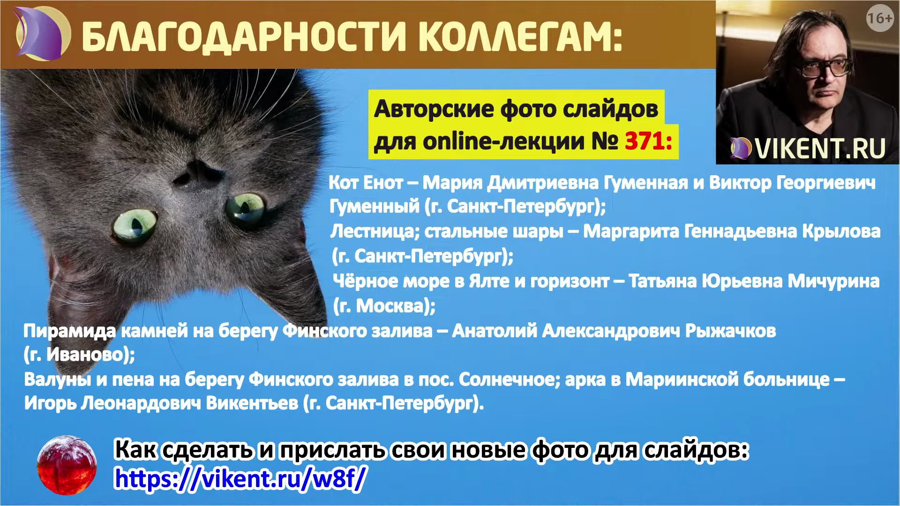

Кто хочет прислать какие-то свои летние материалы, вот снизу вы видите ссылочку, там, ну, рассказано вот какие материалы нужны, какие нужны, какие фото нужны для слайдов, ну, и так далее. Вот давайте посмотрим далее. Значит, соответственно, вот есть, кто хочет софинансировать, понимая, значит, уровень нашего проекта и так далее, и так далее. Вот, пожалуйста, ворота открыты. Там два счёта: Сбербанка и ЯндексДеньги и так далее, и так далее, и так далее. Вот как бы они идут и на книги, и на развитие проекта, и, к сожалению, на моё лечение.

---

## [00:09:45]

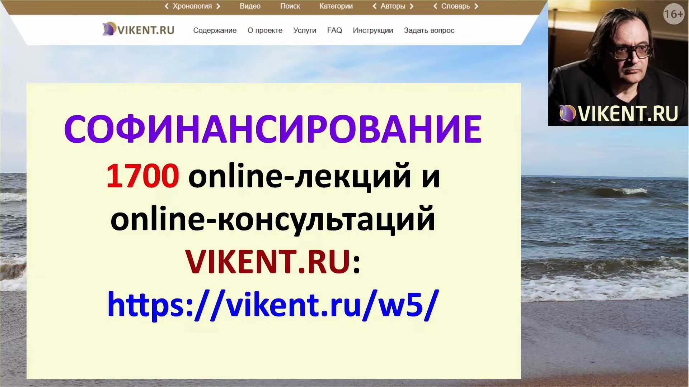

К сожалению, должен такую голоку сделать. Ну и последнее. Последнее, значит, соответственно, пожалуйста, для новичков у нас принято очень такое сверхвежливое, может быть, демонстративно вежливое обращение друг с другом, потому что мы занимаемся непростым делом, прямо скажем.

---

## [00:10:00]

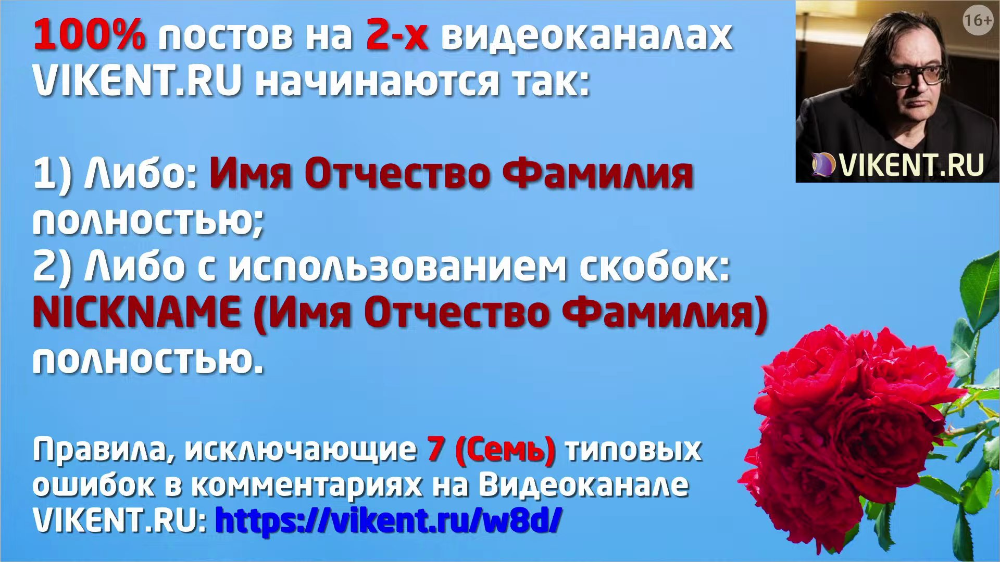

И здесь, ну, постоянно есть ошибки. Постоянно есть ошибки. То есть, допустим, вот сейчас как бы идут консультации докладчиков и, соответственно, иногда таких консультаций две-три, две-три докладчики опытные. И тем не менее, ну, в каждом приближении есть какие-то досадные ошибки, которые нужно править, править, править, править, править. Поэтому, как бы, мы избыточно вежливые. чтобы хоть как-то скомпенсировать, когда приходится иногда говорить докладчикам неприятные вещи, что нужно доделать, что нужно переделать и так далее. Вот. Ну, это распространяется на весь курс. Значит, предуведомления сделаны. Давайте посидим немножко на следующем слайде. И, соответственно, здесь нужна оговорка.

---

## [00:11:00]

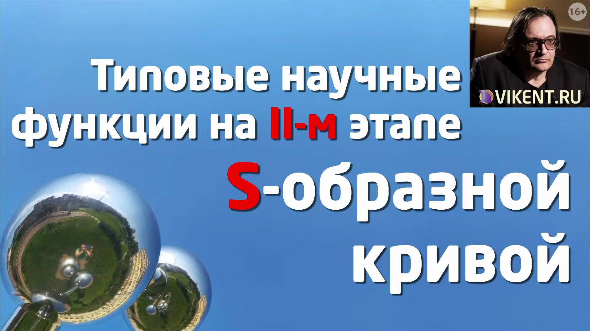

Большое спасибо Маргарите Крыловой, Маргарите Геннадие Крыло с Питера. Эти шарики нам очень понравились. Это её фотография. Соответственно, соответственно, у меня в черновиках как бы ещё одна книга по развитию европейской, американской и российской науки. То, но, но надо сделать, так сказать, дали бы юриисты арбитражную оговорку, что я чуть-чуть им большими прыжками, большими скачками покажу некоторые, ну, научные функции. Но вот то, что, потому что для нас наука, как ни странно, не более, чем ресурс, не более, чем питательная среда, на которой делаются методические системы. Поэтому то, что я буду рассказывать, это крохотный срез от моих накопленных материалов, которые, повторяю, требуют, ну, это ещё отдельный спецкурс по развитию по развитию науки. Второй момент, который, ну, вот просто надо так, пока я это сейчас говорю, прикинуть, что, допустим, вот сейчас слушатели, кто присутствует в чате, допустим, вы просто хотите ставить какие-то, ну, для себя, может быть, для детишек, может быть, для внуков, ну, кому что, какие-то эксперименты дома, и вы хотите просто приобрести оборудование, то, что есть в хорошей школе, в кабинете физики, в кабинете химии. Ну, сейчас, соответственно, всё открыто. Вы можете походить по различным организациям, кто комплектует школы этим оборудованием, и вы поймёте. То есть либо вы покупаете бюджетную иномарку, либо вы покупаете оборудование. Причём это оборудование соответствует оснащению лаборатории там, ну, приблизительно XV, начала XIX века. То есть для ведения даже простых школьных экспериментов, как бы, ну, ну, мягко говоря, простых школьных экспериментов, всё это как бы требует, ну, некоторых отличных от нуля финансов. Вот. Тем не менее, сегодня будет показано много ходов, которые фактически требуют преимущественно воли и некоторой такой, ну, наблюдательности, наблюдательность, ну, естественно, интереса к внешнему миру. Вот давайте посмотрим некоторые типовые функции. При этом, скажем, условно говоря, там парочку томов, парочку томов как бы развития науки я опускаю.

---

## [00:13:30]

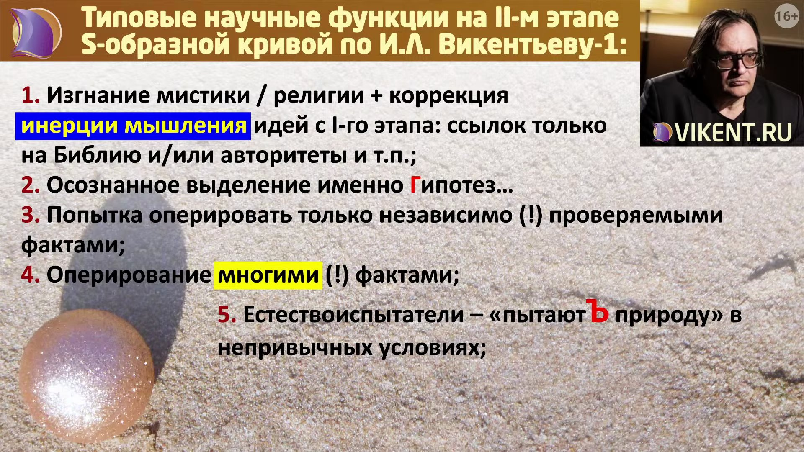

Вот поэтому просто-напросто я использую такой очень простой, мы о нём много раз говорили и будем ещё говорить способ. Просто-напросто, когда мы переформулируем как бы науку, разлагаем на функции, всё становится чрезвычайно прозрачно, пространно и так далее. Вот, соответственно, несколько иллюстраций я расскажу. Ну, соответственно, начну с первого. Я его, естественно, читаю. Соответственно, момент, который, насколько я помню, не рассказывается ни в школе, ни в вузе. когда организовалось первое работоспособная, потому что до этого были неработоспособные академии, то есть королевское научное общество в Англии, соответственно, Роберт Бойль, соответственно, избрал Роберт Боль, учёный избрал такой девиз. Фактически это про область академии наук та результативная академии наук, пото что есть масса нерезультативных академий наук, ничего на словах. То есть, соответственно, как бы люди не сразу это понимают. Я сейчас о первом пункте. Почему? Потому что до этого времени, соответственно, об королевском обществе как бы есть на портале Викенд. Не нравится Викенд, пожалуйста, в интернете полно материалов. Соответственно, до этого было принято ссылаться на Писание, то есть на Библию, на каких-то старцев, на каких-то авторитетов типа Платона Аристотеля. И вот англичане набрали каянства и провозгласили: "Ничего на словах", да? Есть разные переводы, как это по английский будет тоже на портале, по-моему, на портале есть, как бы как бы, ну, по крайней мере, найти можно, да. Вот обратите внимание, что вот стоит такая вот функция, да. Пункт два. Очень интересная вещь, которая не освоена до сих пор. Старая и следстя тема пока никто не взял. пока, к сожалению, никто не взял. Соответственно, масса людей, то есть я это вижу, к сожалению, ежедневно и у мужчин, и у женщин. Просто я смотрю свою ленту ВКонтакте, её пытаюсь даже чистить, но всё равно масса людей, ну, судя по их личным страницам с высшим образованием, они не понимают, где факты, вот, где анекдоты, байки, а где гипотезы. Это немножко разные сущности. Ну и, соответственно, какие-то умные учёные там на уровне, по крайней мере, там века Xго, они отделяли, где факт, где закономерность, где закон. Закон, закономерность - это разные сущности, а где гипотезы. Делаю некую подсказку. В зависимости от этапа сообразной кривой, гипотезы могут быть хорошие и плохие. То есть я не стал рассматривать, первое побуждение было рассматривать гипотезы поесообразной квой, потому что на разных этапах хорошо играют разные гипотезы, поскольку, ну, совсем бы заплёл голову, совсем бы заплёл. Вот ещё одна книга, скажем так, так далее и так далее. Вот как бы, да. Далее, пункт третий. Обратите внимание как бы, что вот очень ценное здесь слово будет слово независимо. То есть, соответственно, как бы история знает сегодня та сегодня такие премьер будут, скоро они начнутся, когда некие весьма не глупые люди, взрослые, там, имеющие высшее образование, там какие-то научные степени, достижения и так далее. Вот когда, соответственно, м влюблялись в своё детище, то есть по-человечески это очень понятно и это очень, я бы сказал, сериально. имею в виду телевизионные сериалы, когда что-то делаешь, влюбляешься в своё детище, влюбляешься в своё детище и так далее, и так далее. Вот тогда и сажали как бы безумное количество ошибок. Ну хорошо, если этот человек не преподаёт и как бы не несёт глупость студентам. Но масса таких людей пишут разную фигню и, к сожалению, преподают в том числе московских, питерских университетах. Некоторые даже академики. Некоторые даже академики и так далее, и так далее, и так далее. Вот вот независимая проверка - это когда ряд квалифицированных учёных нечто проверил и сказала: "Да, это так". Одна из болезней гуманитарных наук, в том числе психологии и педагогики, что, соответственно, данные, полученные одним исследователем, необязательно воспроизводятся другими исследователями. Это некая проблема, которай замалчивается, но тем не менее ожидает очень коварно ожидает как бы на как бы последующих этапах. То есть когда мы пытаемся уже делать методики, если мы работаем с плохой, как любит Анатолий Александрович говорить, фактурой, то, соответственно, получится как бы, как говорят в Сибири, блин, компот. Блин, компот. То есть факты, ну, желательно иметь какие-то надёжные, проверяемые, доказанные и так далее. Вот. Далее, в отличие от первого этапа, действительно хорошо хорошо работать со многими фактами. То есть меня постоянно спрашивают: "А сколько? " Ну, соответственно, как бы м практически м годами, читая московские питерские конференции, имеются тези докладов или полностью доклады практич еженедельно. Вот я могу сказать, что масса гуманитариев пишут как бы, выступая с тезисами, как бы обобщая один-два примеры. Это культурологи, философы, методологи, психологи, ну и так далее, пофиологи и так далее, и так далее. Вот. То есть, соответственно, на единичных примерах ни теории научные, ни методики не построить, как бы. Ну, для нашего курса это азы, как бы, для докторов наук это как бы вот, ну, стран странный момент. Странный момент, как бы, и так далее. То есть примеров должно быть много. Там хотя бы десятки, ещё лучше, сотни ещё лучше, тысячи, ещё лучше тысячи, да. Пункт пятый. Пункт пятый. Соответственно, очень хорошо это заметил Фрэнсис Бекон, что появились естественные испытатели, которые пытают природу. То есть они помещают, в том числе природные объекты в в условия в условия, которые либо очень редко встречаются в природе, либо вообще не встречаются. Если вы внимательнейшим образом, у нас такой доклад был по нобелевским премиям, первым Нобелевским премиям по физики в начале XX века, вы увидите, что масса Нобелевских премий было потому, что люди работали с аномально высокими давлениями. И, соответственно, различные объекты при аномально высоких давлениях ведут себя совершенно иначе. при очень больших при очень больших давлениях либо при очень низких температурах. Далее начались различные пучки там энергии и так далее, и так далее, и тайны микромира. Соответственно, никто даже не знает, а бывает, бывало ли когда-то или, может быть, в далёком космосе бывало вот такие стрёмные условия. Ну, соответственно, помещение объекта изучения в очень стрёмные условия. И мы, соответственно, получаем некие небанальные результаты. Константин Сергеевич Станиславский практиковал так называемый этюдный метод. Этюдный метод для подготовки актёров, как ни странно, это нечто похожее на пункт пятый. Немирович Данченко, его партнёр, ну, относился скептически к итюдному методу. Так вот, что такой чудный метод, я постараюсь сказать птичьего полёта, кого интересует, потому что скорая конференция по навыкам в январе, это может пригодиться. И тюдный метод - это не репетиция, это исследование. Поэтому он, ну, делается примерно следующим образом. Соответственно, вот какая-то сцена, режиссёр ещё не придумал, режиссёр не придумывал, как это дело сыграть. Бывает такое вот. Поэтому он просто призывает, что сейчас вот кто-то там войдёт, либо появится сверху с лестницы, либо, наоборот, вылезет из будки суфлёра. Просто реагируйте естественно. И, грубо говоря, наблюдая на реакцию профессиональных или непрофессиональных актёров, ну, режиссёру удаётся сбить инерцию мышления. То есть он поставил актёров в непривычные условия. То есть, ну, поставим себе бульдог Монти, давненько его не было, но бульдог Монти вылез из софлёвской из софлёской будки, как бы и прямо на сцену. Ну, как люди будут реагировать? Ну, наверное, по-разному они будут реагировать. Главное, что быть естественным. Это некая подсказка, некая подсказка для режиссёра. Может быть, его пробьёт на интуицию и так далее. Вот пойдёмте посмотрим следующие функции. Следующие функции и так далее. Вот как бы, да. Соответственно, далее, ну, нужно понимать, сейчас будут такие примеры, что если у нас амбициозно, я пока не методик, я просто про такую классическую науку, надо изучать, нужно изучать новые объекты.

---

## [00:23:00]

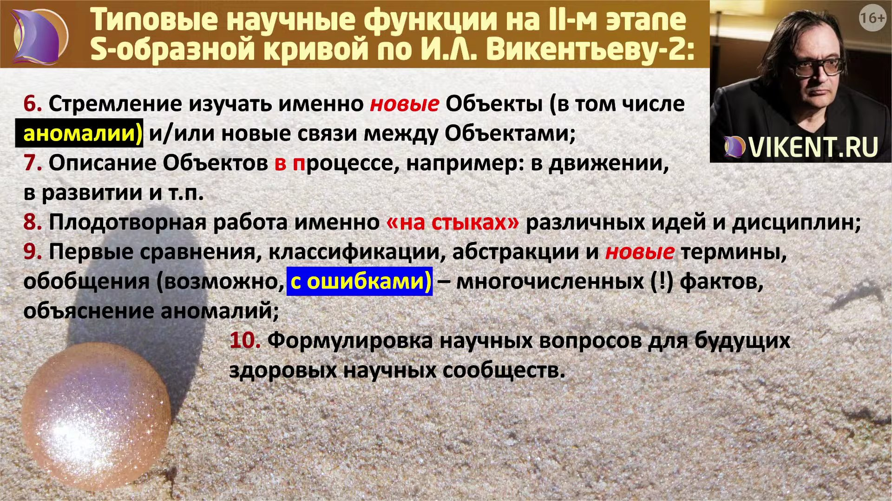

И, соответственно, чрезвычайно интересна была бы карта. Кто хочет, можно её создавать, но это несколько лет труда. Как, допустим, просто-напросто вот по мере развития науки люди лезли всё более и более дальние. регионы, то есть люди лезли там в глубины Азии, глубины в глубины Африки. То есть, допустим, современные геологические открытия, как правило, связаны с тем, что обнаружен очередной хребет на дне океана. То есть всё, что на поверхности, уже изучено. То есть хочешь состояться в географии, что-то сделать новое в географии, ну, нужно есть там на дно океана, ну или вообще изучать там луну, то есть географию, Луну тоже и так далее. Вот пункт седьмой. Пункт седьмой. вещь, которая у нас на курсе постоянно приветствуется, мягко говоря, масса составителей школьных учебников гуманитарных не знают, то очень полезно рассматривать объект изучения в динамике, как объект развивался, как объект развивался, какие были скачки в процессе изучения, ну, объекта изучения. То есть, допустим, меня чрезвычайно интересует, допустим, не педагогика зрунывная. Я неплохо себе представляю историю педагогик вообще разных. Неплохо, прямо скажу, неплохо представляю себе, да. Меня интересовало бы учебник только скачки в истории педагогики. Ну, то же самое скачки в истории литературы. Ну, берём любой более-менее массовый предмет. И когда мы понимаем скачки, такая качественные скачки, динамика, как бы как бы эволюцию либо набу деградацию, мы как бы ну начинаем просто глубже понимать реальность. Соответственно, восемь классика, они она была у нас много раз, как бы большое количество высказываний учёных, что часто что-то плодотворное, плодотворное ждёт на стыках различных дисциплин. Кроме того, что ждёт что-то плодотворное, в Москве есть несколько деятелей, ну, это такая социальная болезнь столиц, то есть которые, грубо говоря, работают сразу же на двух полянах. То есть когда математикам они рассказывают, что они, да, выступают на различных конференциях, математикам они рассказывают, что они первые среди психологов, а когда попадают на психологические тусовки, например, соответственно, они рассказывают, что они первые математики. и математики, и психологи доверчивые. В Питере такое тоже есть, но гораздо меньше. То есть, то есть на стыках можно и делать науку, можно и блефовать. Можно и блефовать, но это блеф так докторов наук и академиков. Докторов с кем-то я лично знаком даже и так далее, и так далее. Вот, вот, и прочее, прочее, прочее. Соответственно, соответственно, [музыка] далее вот начинается первое, они могут быть с ошибками, сравнения, классификации, абстракции и новые термины. Причём, опять-таки, наука как бы движется и иногда появляется потом от этого будут люди будут отказываться. штука, которая проходится даже в школьном курсе физики. По крайней мере, я проходил. Люди придумали эфир нам. До этого они придумали теплород, после этого они отказались. То есть появляются какие-то такие технологические времянки, которые потом люди будут отказываться. Главное вовремя заметить и от этой технологической штуки вовремя отказаться. И, соответственно, пункт десятый - это экзотика. экзотика, как мы знаем. Соответственно, очень мало кто проявляет такую научную честность по отношению к будущим поколениям. В этом отношении у нас будет в самом конце сегодня пост эпиг Анри Понкаре, который в этом деле понимал. Ну, почитаете, можете его тиражировать в социальных сетях. Сейчас будет несколько примеров. Примеров будет мало, потому что я экономлю время на методике. Повторяю, это материал, это материал на несколько книг по развитию науки там и так далее, и так далее, и так далее. Просто, значит, большими скачками несколько примерчиков. Давайте я прокомментирую. Соответственно, вот отец Павел Александрович Флоренский, который я внимательнейшим образом изучил, соответственно, скажем, масса гуманитаев, е, большим периотетом цитируют, но я читал очень внимательно.

---

## [00:27:45]

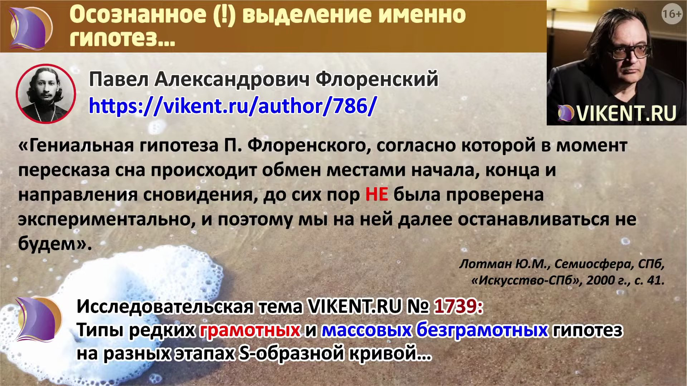

Насчёт гениальной гипотезы Флоренского, мягко говоря, не уверен. Вот как бы Флоренский вот это такое вот чудо, чудо, которые, соответственно, [музыка] очень легко подменяет сущности. То есть это такой кандидат в задачник по лже науки, хотя у него есть там ряд очень простеньких изобретений, тем не менее такой кандидат по изучению как бы м по изучению лженауки. Ну в данном случае я как бы показываю как бы, что есть какая-то гипотеза. Вот в моём понимании она плохая. В моём понимании она плохая. И Михайлович Лотман её отменил и так далее, и так далее, и так далее. Вот как бы, да, так далее. Вот, да. Вот, соответственно, моё отношение к похожим вот таким как бы неразделению гипотез и реальности, что вам запомнилось, что опыт показывает, можете этот опыт следующим летом проделать, что каждый из наших зрителей может лично поцеловать жабу. Жабу. Где найти жабу, не знаю, в вашем городе. Но, соответственно, в отличие от сказок, как бы ничто не произойдёт. как бы вот как бы отличие гипотезы и фантазии про жабу и реальностью. То есть соответственно, кто мне не верит, но идите следующим летом и целуйте жабу. Как бы поверьте мне, можете не верить мне. Ну ничего не произойдёт, в отличие отличие от сказок. Давайте посмотрим следующий момент. Он такой более научный, что ли. Вот, соответственно, как бы вот обратите внимание, что опять-таки некоторый момент, когда, напомню, стихотворение, я отвещал совершенно сознательно, использовал строчку из Маршака.

---

## [00:29:30]

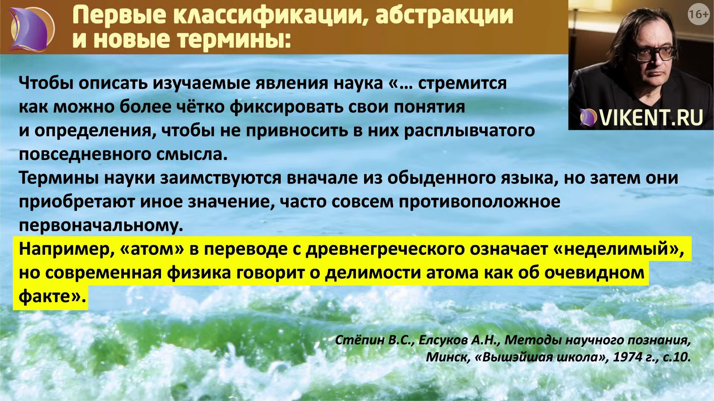

Многие из детства её помнят, что у него есть стихотворение багаж, что, однако, за время пути собачка могла подрасти. То есть собачку везут далеко в поезде. И, соответственно, сдавали щенка, а вырос здоровый пёс. Однако за время пути собачка могла подрасти. Так вот, соответственно, для любителей опираться на какие-то темые слова и так далее, и так далее. Вот, вот обратите внимание, что как бы по мере развития развития слова могут приобретать, ну, противоположный смысл. Причём очень важная, очень тонкая оговорка, что противоположность может быть не одна. Мы об этом уже говорили в прошлый раз, как бы адресуя вас докладам Ксении Александровны Кологиной и Сергея Кеева Сергеевича Гудовича, противоположность может быть не одна. Это некое тонкое понимание, тонкое понимание научной и методической деятельности. Кто не понял, что я сейчас сказал, спрашивайте под этим видео, будем отвечать. Вот это пойдёт в вопрос под этим видео пойдёт в домашнее задание в наступающую субботу. То есть воскресенье 05го не будет ни лекции, ни а домашнее задание - это святое там и так далее. Да. Давайте дальше посмотрим дальше. Следующий пример. Вот посмотрите, пожалуйста, вот очень интересный момент.

---

## [00:31:15]

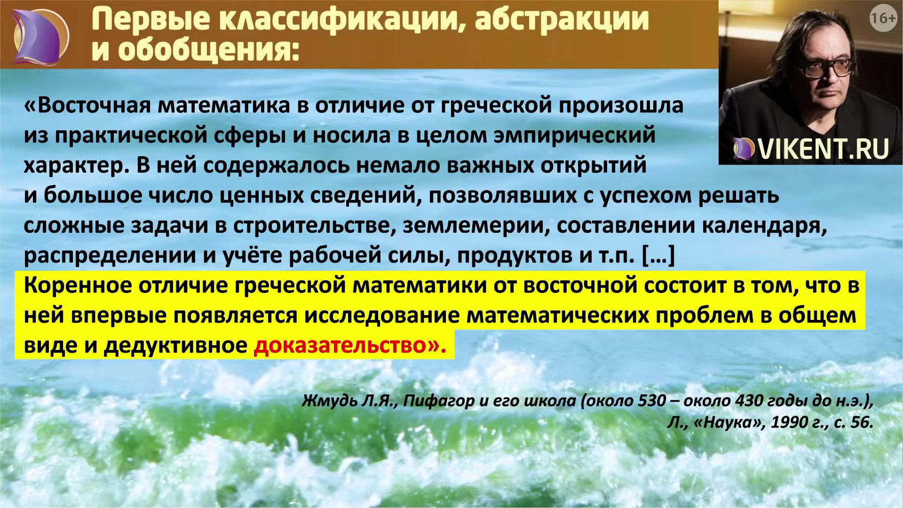

многим вбили в школе и, соответственно, и соответственно как бы физмат школых они этим живут. То есть большое количество людей считает, что как бы исходит из таких классических норм логики, математики и физики о том, что, допустим, вот все треугольники имеют сумму углов 180°, 180° и так далее. Вот. Вот обратите внимание, как бы некая идея, которая требуется, предъявляется к науке такой, ну, типа математики, физики, химии, такой точным наукам от древне греков, то вообще вообще надо доказывать, какие-то выходки в стиле Флоренского они, ну, мягко говоря, или Балаваска, которая сегодня тоже будет, мягко говоря, не проходит. Вот необходимо доказывать. Так вот, очень интересный момент, что на сегодняшний день в методиках, которые мы перейдём немножко попозже, каких-то доказательств не требуется. Доказательств не требуется, что просто-напросто, если что-то у кого-то начинает работать, то это и доказательство, соответственно. А вот там на логику, на математику точный момент как бы и не надо. Ну, кроме того, соответственно, как бы зря они показывают очень простой опыт в школе. Ну, такую, конечно, нужно показывать в элитных школах. Вы можете показывать вашим детишкам. Берёте любой надувной шарик. Вот. Ну и там, по-моему, в шестом классе проходится, что сумма углов треугольника 180°. Рисуете ли ребёночек рисует фломастером, ну, желательно нетким, чтобы не прое шарик. Треугольник. Какоя сумма углов, которая воняется 180°? Вот надуваете шарик. И о ужас на ваших глазах. То есть треугольник становится немножко криволинейным и сумма углов треугольника больше, чем 180°. Больше, чем 180°, так далее. Вот как бы, да, соответственно. И ещё одна штука, как бы не буду вас спрашивать, не буду мучить чать. Соответственно, приведу такой термин. Может быть, вы слышали, то есть, ну, вы слышали, что появилась такая такой есть такой теме, не появилась, точнее такой темсть доказательная медицина. Доказательная, что вообще вообще какие-то медицинские м манипуляции надо там доказывать и так далее, и так далее, и так далее. Вот докладываю вам, что, соответственно, это сделал Архчибальт Кахрейн в 1972 году. То есть, обратите внимание, в науке, в некоторых науках доказательства как бы знали до нашей эры. В некоторых науках к доказательствам перешли аж в 1972 году. Вот, ну, книжку выпустил, то есть где по поэтому, ну, грубо говоря, породил новую витку, новую ветку медицины и так далее, да. Ну, идёмте следующее. Смотрим следующий. Смотрим слайд, как бы, да. Да. Вот Карл Линей. Вот Карл Линей. Здесь мне очень важно говорить, потому что я уже начинаю прокладывать линию к методикам. Так вот, Карл Линей обычно считается, что выдающийся шведский биолог. Соответственно, вы видите, что он сделал. Но надо сказать, что он ещё занимался и языком шведским.

---

## [00:34:45]

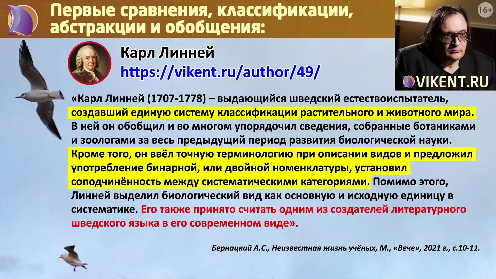

И, соответственно, он начинал бы один из успешных выращивателей искусственного жемчуга. Это обычно не знают. для нас ценно тем, что обратите внимание, что, ну, Карл Линей вошёл в историю одним своим достижением, но обратите внимание, масса таких хорошо работающих учёных, они работали сразу по многим направлениям. Ну и правильно, что как бы, ну, правильно, что по многим направлениям делали. Ну, кроме того, обратите внимание, что опять-таки это первые попытки классификации, абстракции и так далее, и так далее. Вот частично работает и до сих пор. Соответственно, давайте посмотрим теперь типы людей. Типы людей. Типы людей, которые бывают на втором этапе, сообразны кривые. Соответственно, здесь нужно большое спасибо Татьяне Мичуриной. Фотография Ялты.

---

## [00:35:45]

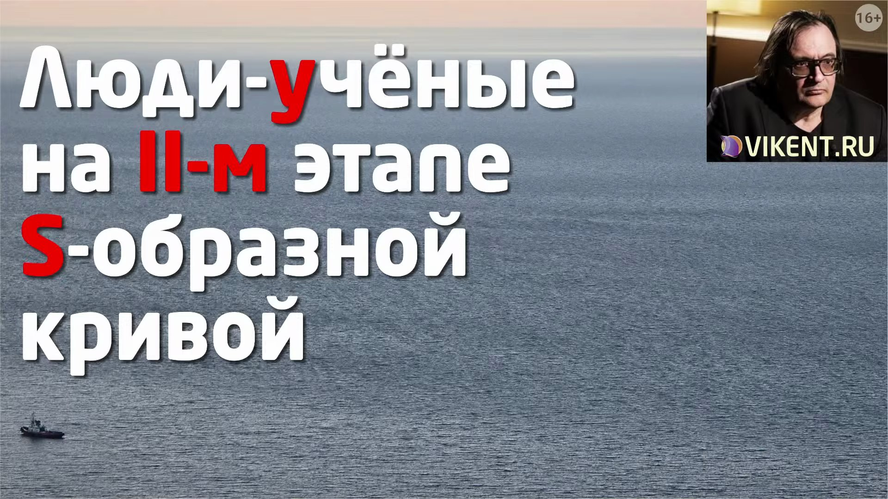

Ялты с горки. Значит, смотрите, значит, есть такой человек, которого знают как сексолога Игорь Семёнович Кон, который, соответственно, ну, мало чего сделал сам, но он преимущественно ездил в США, переводил как бы американских как бы авторов, знал английский язык и публиковал. То есть читал много произведений икона, не нашёл каких-то оригинальных идей. Вот. И в своей биографии Игорь Семёнович Кон, он уже помер, он не скрывал, что в советское время он пытался зарабатывать, поэтому он как бы там пытался защищаться и кандидатом наук, и к доктором наук несколько раз. И, соответственно, как бы для заработка, для такой заработок, как бы защищаться на ерунде. Так вот, у Игоря Семёновича Кона, это есть в его автобиографии, соответственно, его диссертация по эстетике Чернышевского, она была имела порядковый номер 406. Вы понимаете, что как бы я читал Черношевского внимательно, то есть, соответственно, нет там материалов для 406 406 более 400 диссертаций. Ну нету, нету, нету. То есть Чернышевский вот если в одной фразе, в одной фразе запоминающей можно сказать, что чернешевский показывал, что обоснована картина мира, когда есть изящные худенькие дворянки. Это очень изящно. Они там двигаются, танцуют и так далее, и так далее. Это очень изящно и так далее. Вот другая картина мира, когда есть крестьянская баба, которая должна быть желательно толстая. То есть как бы и такой термин как бы, ну вот для животных зажировка на зиму. Ну вот, соответственно, потому что у неё там на ней хозяйство, она должна просто в неурожайные годы и выжить, и работать, и там кормить детишек, и так далее, и так далее, и так далее. Вот на этом, в общем, эстетика Чернышевского, по крайней мере, такого с птичьего полёта заканчивается. Заканчивается. Ну, 406 диссертаций. Ну, это повторяю, я привожу просто, да, я пересказал как бы тексты самого Чернышевского и так далее. Вот при желании там какие-то крапинки на исе можно найти, но якобы пересказал. Так вот, какие люди учёные, обратите внимание, я пошёл сначала функции, потом вы сейчас то же самое увидите, какие люди, учёные характерны для второго этапа. Сначала давайте посмотрим стихотворение, известное стихотворение Чернышевского. детишкам его как бы полезно читать. Ну, здесь вообще вот первые четыре строчки, как бы они самые важные. Они самые важные, самые наглядные и так далее.

---

## [00:38:45]

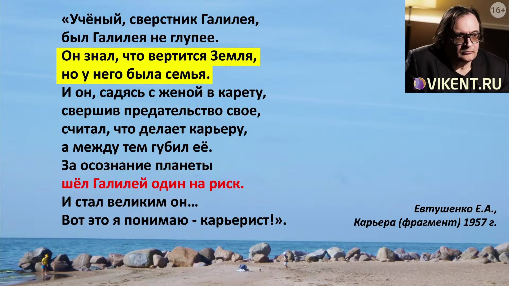

Могу сказать, что очень точно написано. Очень точно написано, потому что Евтушенко как бы сам был достаточно вертляв. Поздний Евтушенко тем более, но тем не менее вот первые четыре строчки очень хороши. Вот шёл Галилей один на риск. Да, да, да, да. Ну давайте посмотрим, давайте посмотрим, как какие же люди бывают на втором этапе. Вот.

---

## [00:39:15]

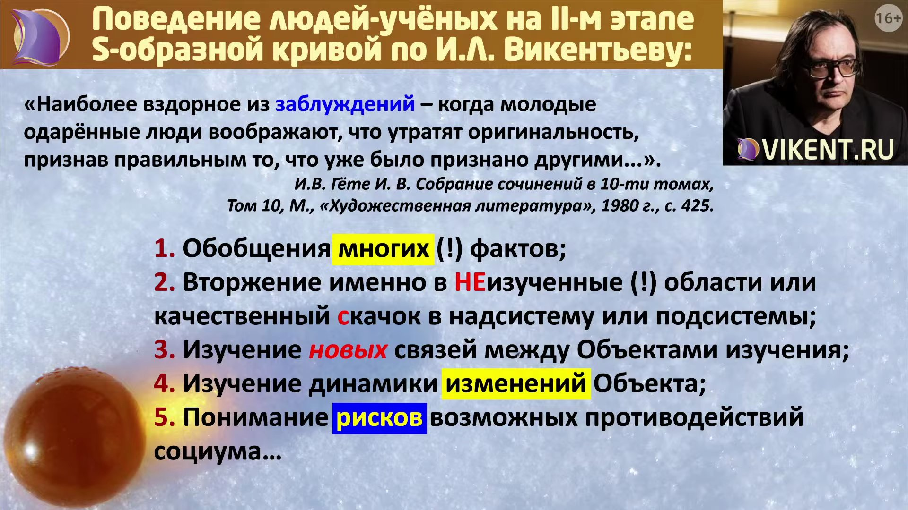

То есть обратите внимание, это фактически очень близко к тем функциям, которые есть. специально вытащил из Гёта некую оговорку, что по дурости ещё играют гормоны, более характерно для мужчин, молодых людей, точнее, девушки здесь более покладистые. То есть молодые люди даже в науке по молодости, по глупости, по гормональной глупости любят повыделывается, вот как бы я один, как бы, и так далее, и так далее, что является некоторой чушью, как бы такой, ну, нормальной научной чушью. Вот опять-таки как бы есть некоторые вещи, соответственно, которые мы сейчас посмотрим. Ну это люди, такая пауза, чтобы вы отдохнули, соответственно, быть, ну производные как бы от функции. То есть хочешь хорошо как бы работать на втором этапе, вот примерно нужно соответствовать, ну тому, что сейчас написано на экране. Либо можно отлистать, посмотреть то, что было сегодня в начале лекции. Ну давайте я постараюсь подобрать несколько примеров, как которые, как мне кажется, должны произвести впечатления. Да, да, примеров, повторяю, очень много, да, соответственно, давайте бегом. Соответственно, наш автор, соответственно, он закончил два класса. Закончил два класса. Сейчас недавно вышло, вы видите, как бы я, к сожалению, сдал библиотеку.

---

## [00:40:45]

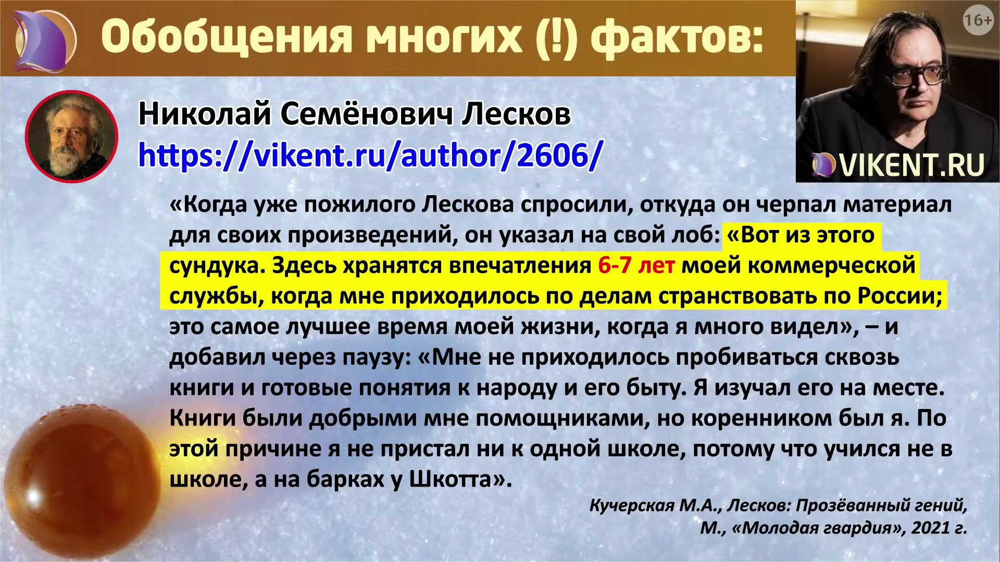

Когда я сдал библиотеку, я обнаружил, что не выписал страницу. По-моему, в районе восьмидесятой страницы Куческая, которая попадаёт как бы литературных курсах в Москве, описывает как бы вот эффекты, что Лисков был комивоежором, таким разъездным агентом. Он окончил два класса всего лишь в школе, но смог написать 12 томов. И если говорить честно, как бы ему хватило впечатлений на всю жизнь, на 12 томов. Более того, как бы, судя по всему, человек был, ну, литературно одарён. И как бы очень часто эти 12 томов там и так далее, и так далее, вот это какая-то журналистика, публицистика, то есть каких-то таких произведений, ну, типа война и мир у него, к сожалению, не получилось. То есть для нас, я готовлю к восприятию методик, к сожалению, он занимался публицистикой. И если смотреть изли, занимался он ерундой. Повторяю, хотя литературно даён, хотя написал несколько там известных произведений, там полевшу в том числе и прочее, прочее, прочее, прочее. Соответственно, аналогичные истории сразу же вот тоже даже не погружаясь в портал были у Островского, который какое-то количество лет драматурга Островского, Николая тоже Николая Островского посидел в суде, и ему хотелось на всю жизнь, как бы он набрал материалов, набрал материалов для обобщений. Далее такой автор, который, ну, как бы сейчас он уже немножко подустал, Житков ЧСТ. Житков через Т, который тоже много путешествовал, много видел и писал для детишек, что он видел. Максим Горький, соответственно, то есть, то есть на на этих впечатлениях, то есть чрезвычайно важно, что это не один и не выдуманный из потолка факт. Факт, то есть и людям это хватало, в общем, в общем-то, на всю жизнь. Соответственно, масса профессоров, гуманитав этого не знают. Можете меня проверять, заказывайте в Москве, в Питере, в каких-то, ну, крупных библиотеках доклады конференций, последних конференций по гуманитарным. Вы увидите, там приводятся единичные примеры, то есть, грубо говоря, там, ну, неначем обобщать, просто неначем обобщать. Класть в основу методику. Единичные примеры, ну, совсем нельзя. Но непроверенные примеры тоже нельзя. Давайте посмотрим дальше. Следующее будет симпатичное фото. Вот смотрите, некоторый уважаемый профессор Литкий, вы в первой строчке видите, и он отправил, ну, как бы, не знаю, что делали мужики вокруг него, наверное, бухали.

---

## [00:43:30]

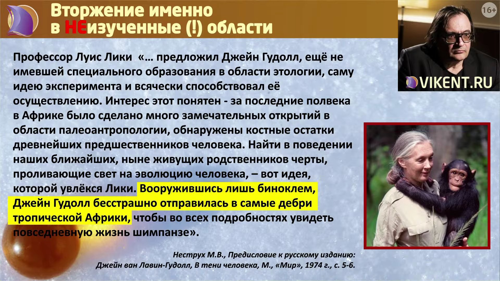

Что ещё могут делать мужики? Он отправил девушку, которая, выожившись лишь одним биноклем. Вот Джейн, Джейн Гул очень уважаемый специалист. И он отправил её вот этот, да, XX век, XX век отправил исследовать. Ну, по внешнему виду очень похоже на шимпанзе. Похо по внешнему виду. Мы специально сделали не, соответственно, не кружок у Джейн, как бы она есть на портале, а мы сделали такую фотографию, чтобы вы могли посмотреть. То есть, соответственно, то есть, ну, нужно просто сознательно лезть в неизученные области. То есть, да, это риск. Да, это риск. Да, это риск. Гораздо уютнее, значит, сидеть в Москве и в Питере и писать ерунду. Соответственно, в 40-50 лет возникает вопрос, как бы, который хорошо озвучил поэт Андрей Вознесенский. А нафига? Вот, а нафига всё это было, вот это всё изображение научной деятельности и так далее, и так далее, и так далее. Как бы, да, приведу ещё несколько м примеров и так далее. Вот, соответственно, вот, ну вот в данном случае она поехала, значит, в Африку. Соответственно, как бы можно не ехать в Африку, как бы, ну, здесь нужно нужно этим заниматься. Готовится в 2006 году как раз конференция Романом Стефановичем Флареску, как по этому поводу. Соответственно, возьмём такого врача Абрама Соломоновича Зальманова. Вторая буква А. Зальманов. Зальманов, который просто врач. И врач стал заниматься м на территории России просто-напросто капиллярами. В чешском организме безумное количество капилляров. Они их знали с древности, но никто толком вообще капиллярами не занимался. И если вы почитаете Абрама Соломоновича Зальманова, я его читал, так, соответственно, там просто-напросто, ну, просто никто не занимался. Но есть типичный неизученный объект. Поэтому, соответственно, он сделал ряд научных достижений. Естественно, что-то понимается медицины, что-то не понимается, но он это сделал. Другой пример вообще без оборудования. Без оборудования просто на основании наблюдений. Эндрю Стил 2Л. Эндрю Стил, отец астероопатия. астроопатия. Он очень внимательно обнаружил, обнаружил, кого интересует в сети много как бы об этом написано и так далее. Вот мне казалось, что Стил есть на портале. Что-то я сходу на своём же портале не нашёл. Может быть, собирался поставить, может быть, поставлю. Он стал заниматься таким такой штукой, как фассы. Что такое фассы? Соответственно, ну, посмотрите анатомический справочник или там какую-то статью. в энциклопедиях и так далее. Вот. И учитывая, что у меня есть знакомый очень хороший остеопат, который меня чинил, чинил, причём чинил контрольное время 40 минут. За 40 минут он меня очень хорошо чинил, то есть из очень плохого состояния. То есть поэтому я свидетельствую, что хороший астропат - это находка. Другое дело, что не все остроопаты хорошие, другое дело, да, и так далее. Соответственно, он лес лес как бы лес новые неизученные области. Они могут быть далеко. Территориальная Африка далеко. Вот, соответственно, они могут быть под носом, но просто-напросто туда никто не залезал. Соответственно, это риск. Как правило, если залезаешь одним из первых, то риска почти нет, потому что поле непаханное, и можно просто столбить свои, ну, участки территории. Давайте посмотрим следующий пример. Вот, соответственно, здесь это не вошло, точнее, я отрезал, потому что, ну, получается, там серия слайдов. Вот Чарльз Дарвин хорошо понимал, что как бы его работы вызовут протест.

---

## [00:47:45]

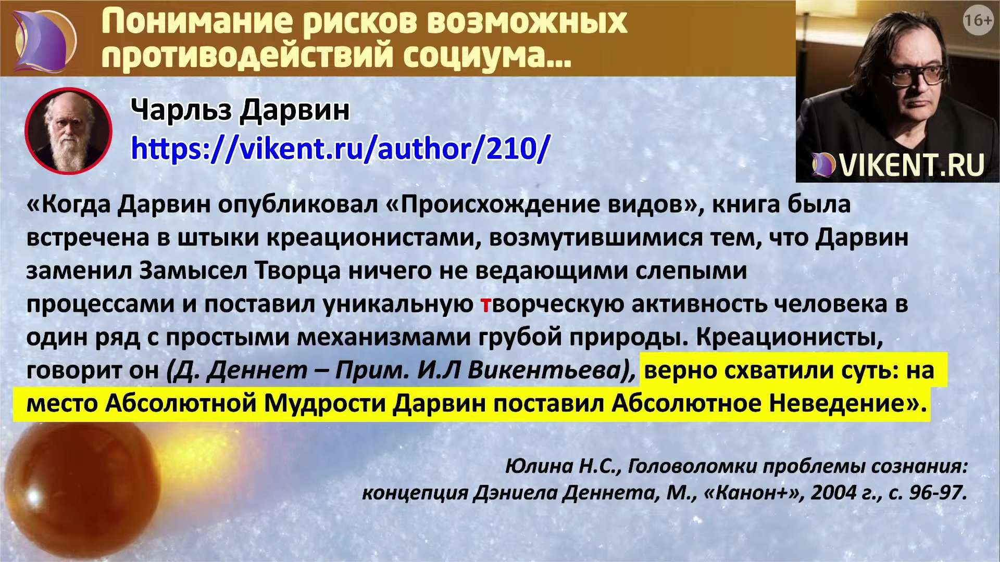

Более того, как бы обычно по незнанию Дарвину часто приписываются более агрессивные высказывания его учеников, что человек произошёл от обезьяны. Это не Дарвин. Это не Дарвин, это ученички и так далее. Вот если вы почитаете самого Дарвина, особенно как бы Дарвин как бы первое издание, сделано много очень много оговорок как бы о животных и так далее, и так далее, и так далее, и так далее. Вот Дарвин как бы жил в середине XIX века и прекрасно понимал, даже при всех оговорках, даже попытках не задевать как бы какие-то божественные идеи, будет противодействие. Противодействие. Ученички были более такие агрессивные, более напоистые и так далее. Они как бы, ну, лезли на спор и так далее, и так далее, и так далее. Вот как бы лезли. Вот сам Дарвин, особенно в первых изданиях, он был чрезвычайно деликатен. Он, что называется не наезжал. Что он называется, наезжал. Другой пример. У нас в Москве работал Владимир Демихов. Гимихов точно есть на портале, который делал различные опыты с собаками. Соответственно, я не буду, естественно, сейчас рассказывать, кто хочет, тот почитает. Соответственно, об этих опытах как-то узнал Кристиан Бернард в ЮАре, в ЮА, в стране ЮА, Южная Африка. И, соответственно, Кристиан Бернад вошёл навсегда в историю медицину поводу пересадки сердца. И а в девяносто шестом году, соответственно, да, естественно, Демихова, пока он жил, пока он жил, значит, соответственно, то увольняли с работы, то давали место для крохотной лаборатории в подвале где-то и так далее, и так далее. Вот. Ну, вообще в 1996 году шунтирование Ельцина опиралось на то, что делал Демехов, которого травили всю жизнь, которую травили Владимир Демихов, Москва и так далее, и так далее, и так далее. Вот как бы, да. Поэтому, соответственно, здесь вот возникает штука, которая ближе к третьему этапу расцветёт. к третьему этапу начинается, о котором мы будем говорить через 2 недели, как бы возникают различная борьба, интриги, и очень многие учёные и разработчики сходят с дистанции, потому что им кажется, что они делают благо для людей, как бы, ну, мягко говоря, а люди в это не врубаются. Причём, как бы, люди с высшим образованием, со степенями, ну, и так далее, и так далее. Далее, очень хороший материал. Давайте посмотрим. Далее, соответственно, некая болезнь социальная. Давайте следующий слайд. Некая социальная болезнь. Изобретение новых наук. Фотография моя в посёлке между посёлком Солнечное и Репино.

---

## [00:50:45]

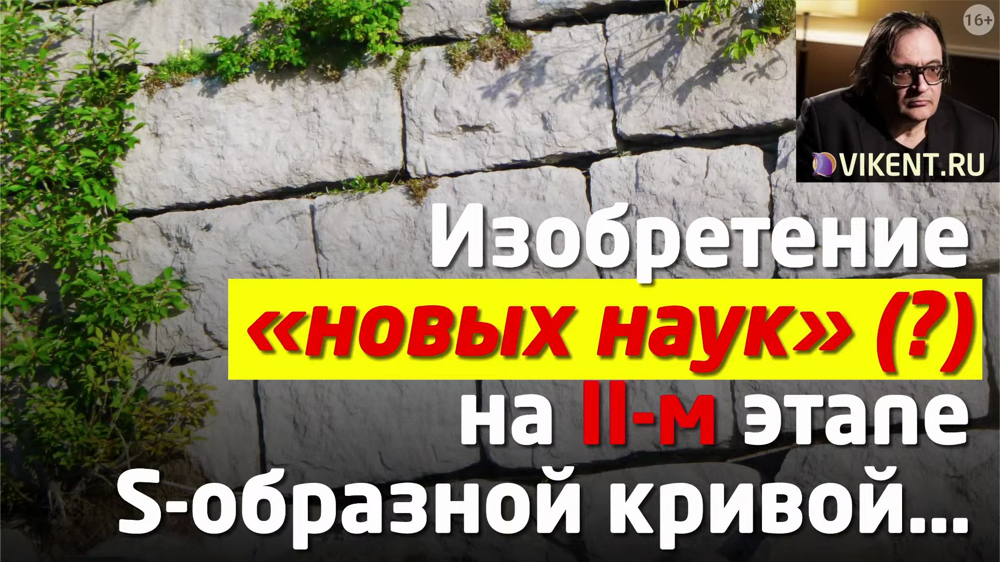

Это основание, это финское основание неких дач. Неских дач до сих пор стоит неразрушенное, как бы, да, изобретение непременно новых наук. Вот. Ну воспримите как стёп. Воспримите как стёп. Ну, давайте посмотрим как бы тоже на языке функций. Соответственно, значит, в отличие от первого этапа, такое бывает чрезвычайно редко. Соответственно, м соответственно люди понимают, что есть некая ценность, и люди начинают, Альшуля в этом случае использовала термин глобать.

---

## [00:51:15]

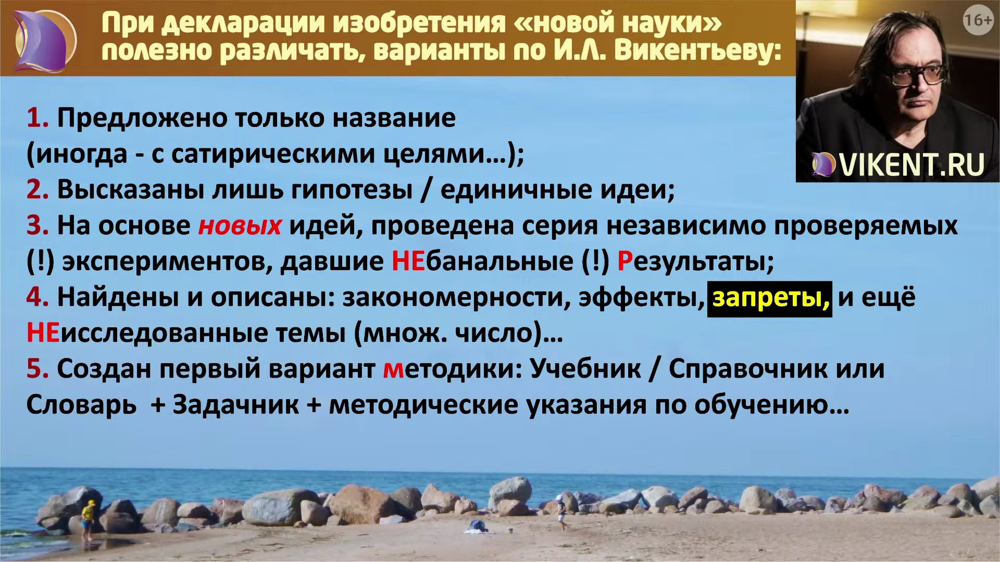

Они начинают глобать и, соответственно, предлагать сразу новую науку. Ну, соответственно, значит, пункт номер один, как бы, как бы некоторые предлагают только некое новое название. Я хотел сделать хотел сделать, соответственно, на портале Викенд такую подборку, потому что вот о том, что нужно изучать творчество, как бы я нашёл несколько десятков материалов. Они где-то в черновикав оставились. Я не поставил, потому что, учитывая реальную квалификацию людей с высшим образованием, я могу это поставить, я могу это написать даже крупным шрифтом, что это такие начальные шизовки, но меня будут мучать вопросами. А вот в XV веке такой-то в последнем томе своих собраний сочинений сказал, а что по этому делу почитать. Мой ответ, что это шизовка, это вообще не надо читать. как правило, на российскую интеллигенцию не воздействует. Как правило, не воздействует. Так вот, соответственно, значит, как бы когда, ну, люди на полном серьёзе считают, что они вот вот если они предложили название, они придумали новую науку. Повторяю, наука. Вот у нас через через слайд через слайд будет, допустим, краткий рассказ про Петра Энгелимеера, как бы российский инженер, о том, что он первый предложил первый предложил заниматься изучением творчества. Точно нет. Точно нет. Таких таких предложений бы у вас античности полно. Просто-напросто как бы нужно это знать, когда или так далее, да. Значит, второй момент, как бы высказа лишь гипотеза единичной идеи. В этом отношении очень характерный момент теория Льва Гумелёва, которая постоянно называется теория Льва Гумелёва по пассионарности. Если внимательно почитать, а, труды Гумелёва, то, соответственно, он делает постоянные оговорки, что, соответственно, гуманитарии не умеют работать научными методами, а он не умеет. Значит, если очень внимательно, ещё более внимательно читать Гумелёва, то, соответственно, в год перестройки он много выступал. Соответственно, питерская преимущественность пити, питерская интеллигенция на очных встречах задавала много ехидных вопросов. И в самых-самых последних и малотиражных своей публикации Лев Гумелёв стал оговаривать, что у него не теория пассиональности, а у него гипотезы. Причём гипотезы довольно плохие, я бы сказал, висящие в воздухе. То есть, ещё раз, гипотезы имеют разный вес, так можно сказать, да? Далее, соответственно, соответственно, пункт третий уже уже что-то есть, но это может быть какие-то группы научных результатов, но насчёт того, что это именно новая теория, новая наука - это большой знак вопроса. Ну, люди хотят как лучше, люди хотят прославиться, люди как минимум прославятся, иногда хотят денег и так далее, и так далее, и так далее, как бы, да. Соответственно, создан первый вариант методики. Первый вариант методики. в моём понимании очень грамотно всё сделал Альшулю, как бы, и он сам придумал, потому что он сразу же как бы, ну, сделал как бы и учебник, как бы, и как бы различные как бы задачи, задачники и методические указания по обучению выпускал почти ежемесячные и так далее, и так далее, и так далее. Вот, соответственно, кто задумывается от методиков, на закрытых консультациях, я уже глотку сорвал, это говорю, соответственно, там сделать там одну небольшую книжечку и считать, что вы сделали методику. К сожалению, не потому, что я, а потому, что так милостен. К сожалению, не получится. К сожалению, не получится. Ну давайте посмотрим. Вы немножко именно стебовые поимел. Соответственно, известный логик. Известный логик. Он предложил несколько наук, как он считал, как он считал. Некоторые науки серьёзные, а некоторые науки, да, он как бы вот вы можете поднять как бы его биографию, вот, пожалуйста, приметый отвергнутый вообще как бы бухал, как бы, то есть он понимал в этом дело.

---

## [00:55:45]

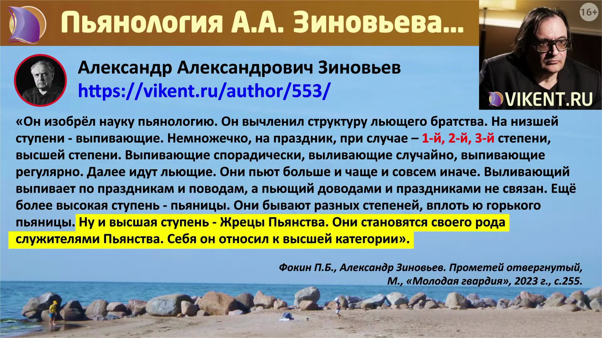

Помимо Венечки Иофиева он тоже понимал это дело. Но это такой стёп в данном случае стёп Зинов. У него есть несколько претензий на науки в моём понимании несерьёзных, хотя претензии есть. Ну, хотя они несерьёзны, но они гораздо более обоснованные, чем у лиц у лиц, которые предложили лишь не более, чем название. Не более, чем название. Давайте посмотрим типовую ошибку историков. Вот, соответственно, в 1910 году Пётр Энгелимее подложил, написал книжку. Потом он выступил с некоторым, я бы сказал бы, голоштанным призывом.

---

## [00:56:30]

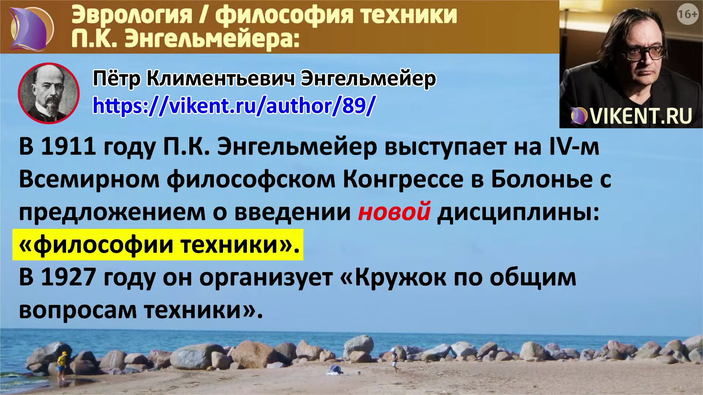

Голоштанным призывом, как бы, а давайте делать новую дисциплину. Периодически такое можно увидеть в социальных сетях. А давайте соберёмся в кучу и сделаем. Ну вот, соответственно, как бы публика на это не откликается. Соответственно, как бы публика капризная, я преимущественно русскоязычная публика, потому что когда у человека есть какое-то ядро либо кристалл по Эмилю Конетти 2Т, соответственно, вот на на этот как бы кристалл, вот на этот ресурс как-то публика может наращиваться, могут начать помогать. Головстанные призывы, ну вот, к сожалению, не работают. Значит, эта штука, ну, кто хочет собирать, пожалуйста, как бы анонсы новых наук благодаря социальным сетям. В принципе, это такой доклад. Я бы сделал бы сделал бы конференцию именно 1 апреля, потому что это это это смешно, но это смешно. Соответственно, тем не менее, допустим, да, вот в двадцам году он организует кружок, кружок, соответственно, в конце двадцатых годов жизнь забросила в Баку, и он издаёт книжку. Книжка, значит, соответственно, потрясающее название творческая личность и среда в области технических изобретений. Соответственно, как бы Баку небольшой город. Я несколько раз был в Баку и консультировал. Соответственно, есть гипотеза уточнить у Генаха Сауловича сильное подозрение, сильное подозрение, что в молодости, соответственно, Генна Сауча Альшули как бы почитал эту книжку, по крайней мере, может быть, его знакомые почитали, то есть это как-то монтируется. Было или не было, ну, это вот опять-таки я демонстрирую, что такое гипотеза. То есть я гипотезу высказал, доказательств, что он читал, у меня нет, как бы. Хотя, да, как бы в книжках Альшулера есть ссылки на Энгельмейра, который прокукарекал. Кукарел. Спасибо ему за кукарекание, но повторяю, кукарекание, к сожалению, не работает даже среди интеллигенции. Далее давайте посмотрим более серьёзный замах психиатра. Более серьёзный замах психиатра. Выходила серия публикаций, выходила, к сожалению, хороших фотографий не нашли. Если кто-то найдёт, пришлите. Нам фотография сигалина нужна, желательно цветная.

---

## [00:59:15]

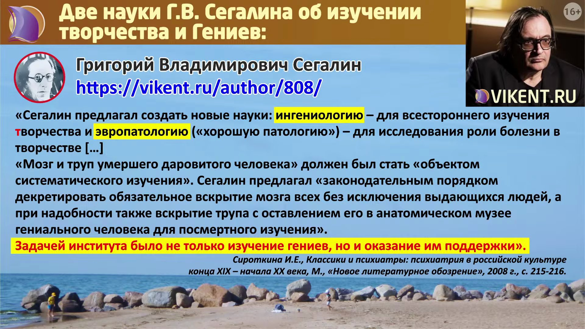

Вот иногда такое срабатывает у нас, да. И, соответственно, скажем, вот вещь более, ну, более серьёзно, то есть было какое-то часть изданий, соответственно, моделировать Сигалин не мог. Ну, соответственно, если бы ко мне бы обратился бы помощник режиссёра, который что-нибудь снимал про гев, у него был бы месяц времени до съёмок, я ему посоветовал бы почитать Григория Владимировича Сигалина. Они довольно много выпускали различные литературы. Ну, как психиатры и как бы подобные ему это писали. Там масса бытовых деталей, характерных для гениев тоже. А киношники очень любят какие-то интересные детали. Ну, для кино им, для кино нужно. То есть, ну, надо сказать, что смоделировать гениев Ггою Владимировичу Сигалину не удалось. Хотя по сравнению с Энгельмеером, по сравнению с Энгельмеером примерно тот же замах, как бы большое количество как бы фактов, но моделировать не мог. Моделировать не мог. Осталось как такой исторический феномен. феномен, то как исторически, поставляя себе интерес, исторически, методически не поставляют, соответственно, и так далее, и так далее, и так далее. Вот как бы, да. Соответственно, давайте посмотрим, значит, в очередной раз, в очередной раз посмотрим, значит, почему здесь моя книжка. Значит, кто там не знает или кто знает, тем более, соответственно, вот обратите внимание, как бы вот эта книжка именно книгаметодика, то, соответственно, там есть очень простые модели, которые работают большого количества людей, очень разного социального статуса, образования и так далее.

---

## [01:00:45]

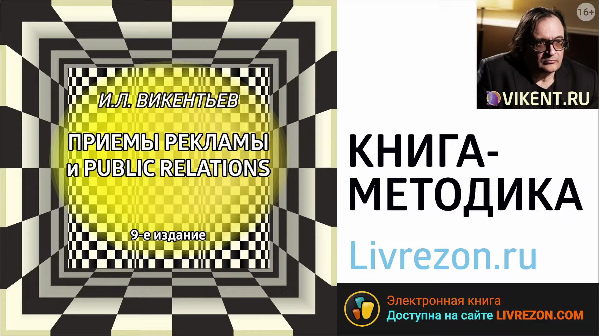

Вот как бы, да, вот ни Энгельмеев, ни тем более Сигалин как бы ну не смогли не смогли ну дотянуться до методики. Хотя по идее по идее как бы ну никто не мешал, никто не запрещал. То есть, пожалуйста, давайте посмотрим некое ещё приближение к методике. Приближение к методике. Вот малоизвестный, малоизвестный человек, который в свою жизнь занимался целым пучком направлений. То есть он среди геологов известен. Он выпустил некую книгу, вы увидите о чём. Вы видите о чём?

---

## [01:01:30]

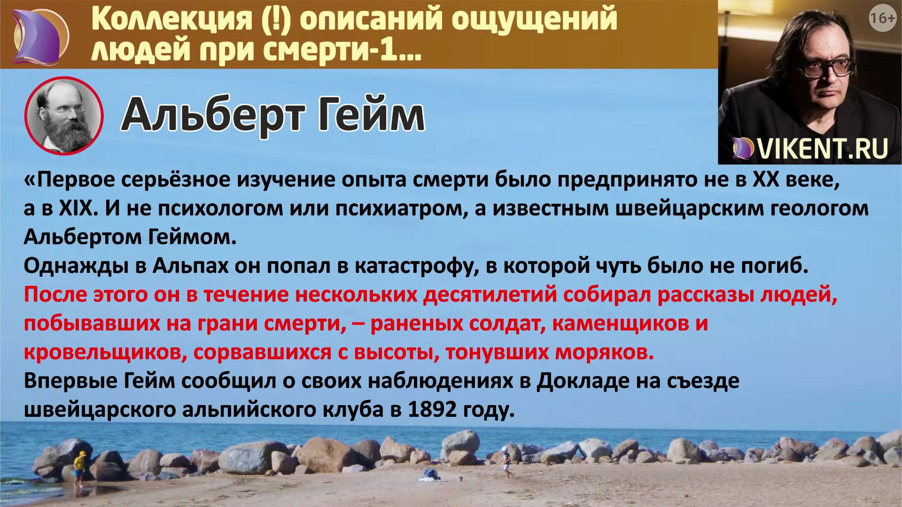

как бы, кроме того, самое симпатичное его занятие, ну, правда, для меня симпатичное, я думаю, что для большинства из вас тоже, он написал м не некое руководство по выращиванию фаунлендов. Это такие симпатичные, здоровенные псы. Там коричневые бывают, чёрные бывают, чёрные с белым. Ну, очень симпатичные, здоровенные псы. То есть как бы вот чуть не поставили фотографию пса как бы вместо Альбета Гиме. Так вот, обратите внимание. Вот здесь вот человек потихонечку есть какие-то данные. Вот с этими данными как-то уже можно работать. Научные данные, и они далеко не единичные. Он не высасывал их из пальца. Не высасывал их из пальца. Не высасывал их из пальца. Соответственно, как бы вот повторяю, но некоторый зуд сделать науку имени себя, он как бы, ну, присущий русской интеллигенции всегда об этом помните. В принципе, это ещё одна книга. Ну и так далее, и так далее, и так далее. Вот. Но мы бежим дальше и так далее. Вот. Да. А вот, извините, извините, извините. Ну да, как бы нужно было показать ещё, ещё надо было, конечно, не фаулен, да, врезать в пляж. Заряне, извините, заранее вырезали симпатичного пса. Ну, Господь с ним.

---

## [01:03:00]

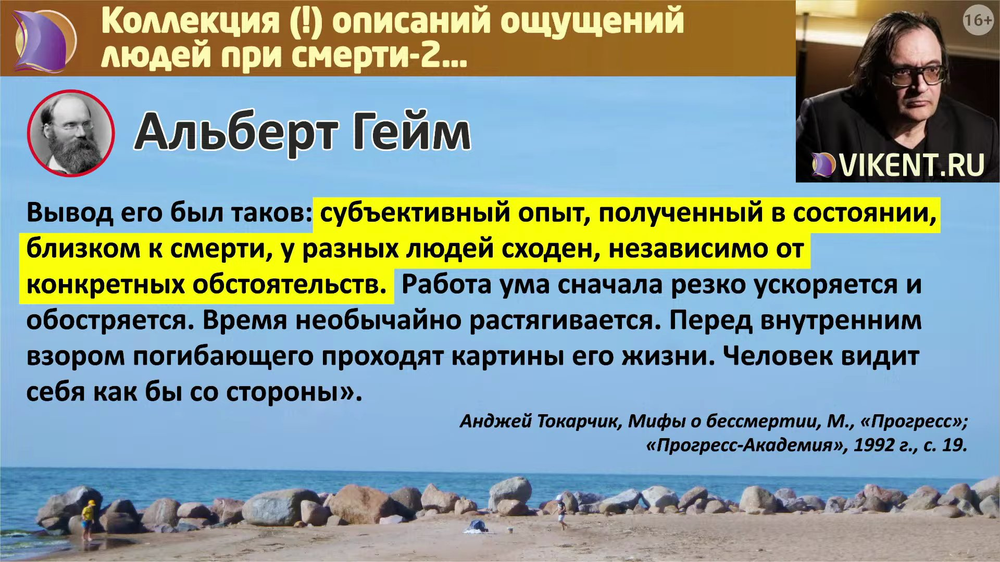

Идёмте дальше, да? Идёмте дальше. Да. И вот типовые ошибки наукообразных. На втором наукообразных, то есть учёными назвать это нельзя, как бы Давайте посмотрим, давайте посмотрим скульптуру, которая есть в Эрмитаже.

---

## [01:03:15]

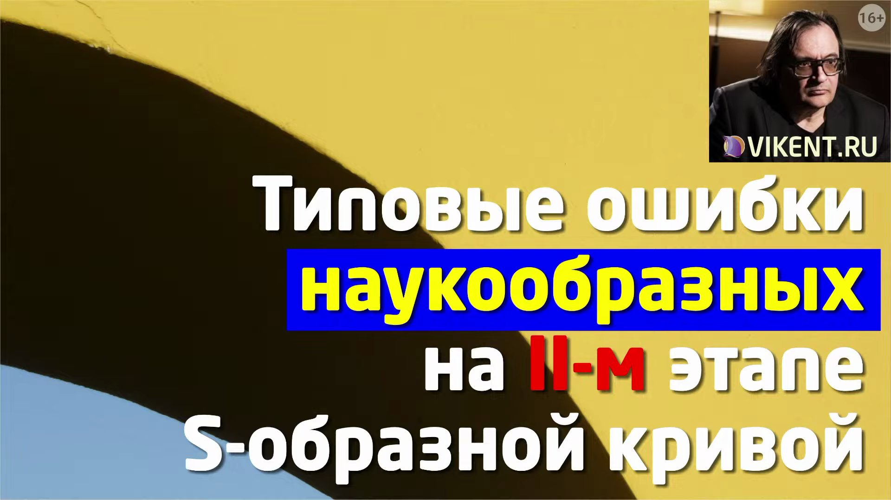

Соответственно, вот я, честно говоря, эту скульптуру видел, но не заметил. То есть, наверное, был слишком юный. То есть это где-то было то ли в вузе, то ли в школе, в старшей школе. Ну, Юрую Михайловичу Лотману в этом отношении можно доверять, как бы, вот, и так далее, и так далее.

---

## [01:03:30]

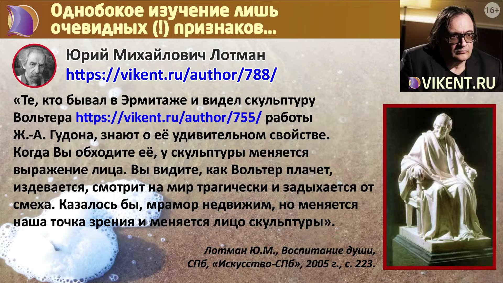

Вот так вот есть некоторый момент. У нас сейчас пойдут большое количество примеров на эту штуку, что начинающие исследователи или исследователи, кто хочет непременно быстрого результата, они хватают за какой-то случайный признак. И, соответственно, после схватив этот признак, пытаются пытается девоч как как бы науку. Ну, есть аналогичная пыча, её все знают, когда несколько слепых мудрецов подошли к слону, кто-то взялся за хвост, кто-то за хобот, кто-то за ногу. И, ну, более интеллигентный пример с Вальтером. То есть люди ухватывают некоторый случайный признак, ну, и пытаются на этом не очень прочном, не очень прочном основании, соответственно, строить какую-то теорию. А вы понимаете, на гнилых фактах строить не науку, не тоже довольно сложный объект, объект наук, методики, то есть, извините, я говорился, но, мягко говоря, не получается. Так вот, посмотрим типовые ошибки, в которых вляпываются академики, члены-корреспонденты, доктора наук, о доцентах. А доцент я даже не говорю. Давайте, пожалуйста, следующий слайд. Давайте, давайте, давайте так далее, да. Соответственно, вот шифрование своего незнания.

---

## [01:05:00]

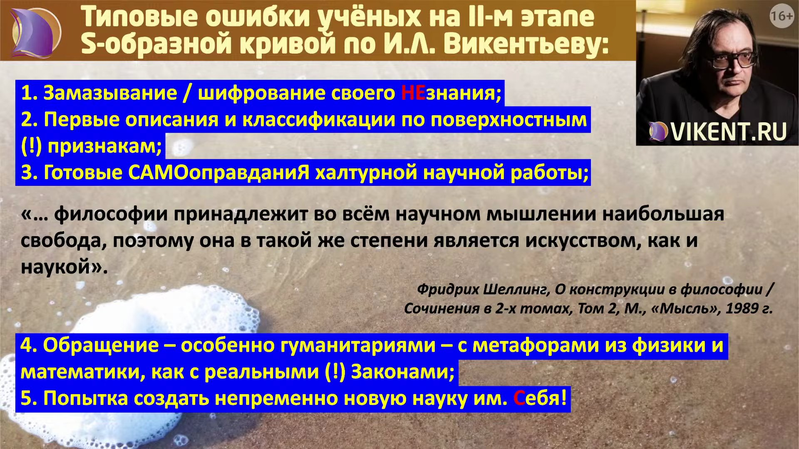

Ну вот я несколько раз перечитывал Антона Семёновича Макаренко, но только в исследованиях. То есть есть группа людей, которые исследуют биографию Макаренко, там письма в архивах, что-то ещё. Вот у Макаенко я не жалуюсь на на профессиональную память, значит, шеститомника дважды перечитывал, соответственно, так далее. Вот Макаренко не говорит о том, что он не знал, как работать с девочками, проститутками. Ну, у нас стоит предупреждение, там плюс там 16 или 18. Меня над головой, да, вот как бы, ну да, то есть вот то есть девочки, которые кто-то из них был изнасилован, кто-то стал зарабатывать, то есть перевоспитывать такую девочку с помощью сборки фотоаппаратов бессмысленно. Она скорее развратит коллектив учеников, коллектив преподавателей и так далее. Вот, соответственно, но проблема есть, и проблема остаётся в самых разных странах мира. девочки-проститутки, может быть, это как бы неприятно, но тем не менее. Соответственно, скажем, да, пункт два. Соответственно, я проводил какое-то количество конференций по маркетингу, пиах, рекламе, ну, и так далее. Вот. И, соответственно, я припирался с рядом докладчиков, которых так и не выпустил, потому что докладчики исходили из очень простой модели. Как правило, это докладчики из Москвы, то есть это из крупных городов. Что, соответственно, что самое важное, я буду сейчас парадиировать этих докладчиков, не называя фамилии, естественно, самое важное - это потребности. Нужно, Игорю Леонадовичу составить список потребностей, и потом у нас вашу книжку изучать не надо, всё гораздо проще. Есть потребности и пошли. Соответственно, есть не некий польский автор. К сожалению, вылетело из головы. Кому нужно, напишите под видео, я приведу данные. у которого есть хорошая книга. Он не перечисляет, но он указывает, что он изучил 120 списков подобных потребностей. И и из них, в общем-то, я пересказывал содержание оба книги, ничего не следует. Постараюсь показать. То есть обратите внимание, я сейча буду как по корнеге многие, да? И гляч и смотрите, есть такая потребность в здоровье. Да, полностью согласен. Далее начинается усложнение. Советский влач врач, российский врач, получив диплом, должен различать минимум 10. 000 болезней. Ещё накладываем, уже что-то начинает мешать. Далее, допустим, а когда человек заболел до отпуска, непосредственно перед отпуском, ну, соответственно, семья не поехала отдыхать, надо ухаживать за больным, плохо. Билеты покупали заранее, не заметили, что там есть сноска, что дискаунтер, билетов обратно не понимают, деньги сгорели. Ну, ну, ну и так далее. Вот. Далее. Человек заболел десятущими болезней уже, не дай бог не на территории России, не дай бог, что знает где, там созвоные там со страховыми компаниями, там непонимание врача на его языке, ну, и так далее, и так далее. Вот. Далее, человек заболел уже после отдыха, завтра выходить на работу. Сотрудники ждут, клиенты ждут, партнёры ждут, покупатели ждут. Человек подвёл большое количество людей. Подвёл большое количество людей. Соответственно, составить список потребности можно. То есть, повторяю, вот этот польский автор рассказывает, что таких списков ему известно 120, мне известно меньше, чем 120, но я с этим имел дело. Вот вроде бы, да, да, да, да, да. На самом деле не работает, не работает. И вот на втором этапе, на третьем этапе это будет уже просто не то, что куст, это будет лес, лесок такой как бы, да, люди начинают подготавливать готовые самооправдания как бы для своей собственной халтуры, причём для себя, для ученичков и так далее, и так далее. Люди просто готовые самооправдания, соответственно, через Ну кому нравится больше термин психологические защиты по Ани Лигманду Фридам, ну, пожалуйста, пожалуйста, пожалуйста, да, пожалуйста, так далее, да, соответственно, скажем далее. Пункт четвёртый. Я в предыдущий раз об этом говорил, впервые рекомендовал книгу не из нашего круга западных авторов. Пересматривайте первую часть. Некоторый грех гуманитариев довольно частотный, когда они оперируют некоторыми сущностями из физики и математики как метафорами. Причём не оговаривают это. Неквалифицированный читатель даже даже даже с высшим образованием начинает повторять, тиражировать эти глупости, не дай бог на голову студентов, как бы, да. Ну и пятое, как бы некоторый зуд придумать, придумать некую новую науку. В принципе, это возможно. В принципе, это возможно. Ну, как бы как бы сначала наука, потом как бы некоторые новые желания. Сначала наука, потом некоторые новые желания и так далее, и так далее, и так далее. Ну, естественно, ещё раз повторяю, простейший способ проверить это некоторые независимые испытания. ту книжку, которую я показал, ну, протестировано, мягко говоря, учениками много раз, как бы некоторые пытались там найти какие-то ошибки, дополнить, но как-то пока не удалось. Давайте посмотрим дальше, да? Давайте посмотрим дальше. Здесь нас ждут исслеские темы. сеские темы, то, соответственно, такое, ну, довольно головолунное, значит, мой совет как бы, то есть, грубо говоря, собрать какие-то новые науки прогукаэконы в XX веке, в XX веке с помощью социальных сетей и поисковиков легко.

---

## [01:11:00]

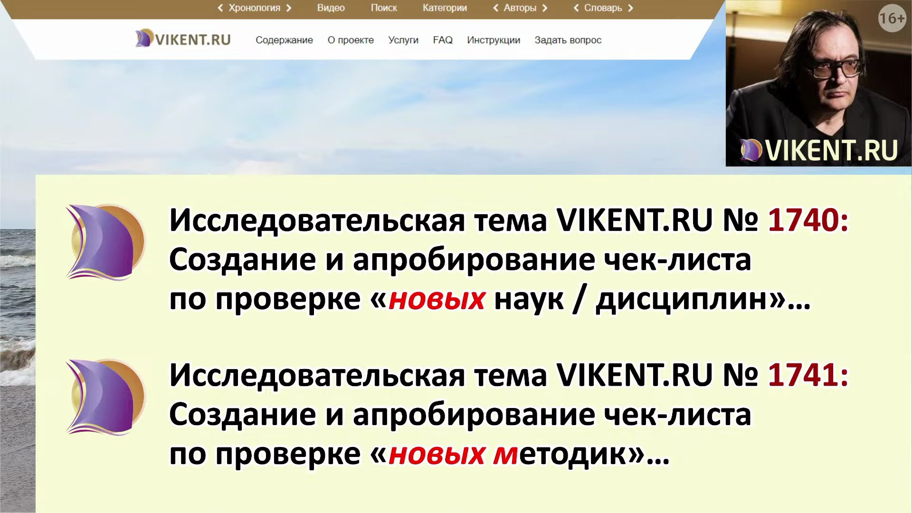

Вот. Но создать чек-лист, чек-лист как бы немножко сложнее, но вещь такая головоломная, интересная и так далее. У нас в 2026 году есть несколько конференций, куда вполне как бы, ну, вполне организаторы, я не договаривался, практически уверен, что при хорошем качестве легко как бы возьмёт. Возможно, возможно, но этого нужно получится и книжка, возможно, получится. В принципе, вот попыток изобрести новые науки, новые методики, их довольно много. То есть, повторяю, на первом этапе будет очень быстро. Ну, просто поисковики просто будут выдавать их пачками, как бы, и так далее. Вот с чек-листом помедленнее будет уже. Ну и так далее. Вот давайте дальше, да? Соответственно, идёмте дальше. М, вот такой классический пример, которому не хватило независимых испытаний.

---

## [01:12:00]

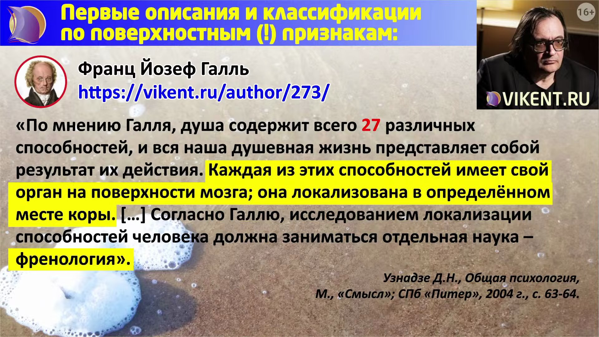

Соответственно, Франц Иозеф Галь, австриец, соответственно, что-то заподозрил Наполеон. Наполеон и хотел бы даже притянуть притянуть как бы что он смущает парижский народ. Но как бы Франц Иозеф Галь был настолько в авторитете в Париже, что Наполеон, на всякий случай император, да, как-то его не смог упрятать в тюрьму. Не смог упрятать в тюрьму, как бы, да, вот как бы так далее. Вот, соответственно, вот Франц Иозеф Галь, общет нашёл какие-то, возможно, единичные какие-то примеры, которые подтверждают шишки на голове. Ну вот опять-таки он ухватил как те мудрецы, значит, хвост ногу или хвост слона, вот как бы и как бы уходил какие-то поверхностные признаки или, допустим, как вот списки потребностей или как, допустим, просто скульптуральптера с разных точек зни, и так далее. Вот. Но вот здесь вот очень интересный момент, который я решил оговорить. Это запланировано было через 2 недели, но я решил сказать и здесь, и через 2 недели. Благодарю за вопрос, за уточняющий вопрос Кирилла Сергеевича Гудовича, что если делать правильные преобразования вот от каких-то фактов, то, соответственно, можно сделать, ну, небанальные научные, пока научные, не методические результаты. Так вот, соответственно, если вы посмотрите, когда работал Галь, ну, грубо говоря, лет через 15 появился Пьер Флоранс. Пьер флуанс иногда через у, иногда через а и так далее. Вот. Соответственно, в отличие от Йово Галя, соответственно, он полез и стал вмешиваться, ну, тут неприятный будет момент, в мозг животных. Сейчас мозг животных, соответственно, он удалял. И, может быть, это не очень приятно, но это научно очень было плодотворено. Выяснилось, что какие-то сложные навыки. Через 15 лет после животное просто лежит. Ну, грубо говоря, оно существует. Вот. Ну, оно существует, как бы, то есть какие-то есть там выделения, ну, и так далее. Может, есть, но то, что мы бы назвали сложными навыками, зверюшки зверюшки утарачивают. Это такой большой очень прорыв, потому что это, ну, грубо говоря, это 1835 год. 1835 год. Флунс сейчас говорю, не про Галь был чуть-чуть пораньше, ответственно и это я всегда с удивление смотрел на людей в XX веке, ну, как тоже пытались основать свои науки, что какие-то сложные действия там типа счёт, литературные способности, речь, педагогические способности, у какие-то, ну, сложные навыки и так далее, и так далее. Они распределены по разным участкам мозга. Всё это шевелится, всё это очень динамично, да, если как бы часть мозга у человека как бы утрачена, потихонечку эти функции переползают на другие участки мозга, ну, с некоторыми потеями. С некоторыми потеями. То есть Флоранс доказал как бы очень важную штуку. Очень важную штуку, что мозг такая довольно сложная система. довольно сложная система и сложные навыки, сложные способности в них участвуют так или иначе, ну, я не сказал весь мозг, но разные участки мозга. У Франции зафагали как бы так тупо всё локализовано. Именно есть 27 различных способностей. Напоминаю недавний указ президента. Обратите внимание, указ, у нас была сумка на него. Кто хочет, может в сети достать. Есть указ президента о том, что есть 17 ценностей. 17 ценностей. Далее, я не шучу, зря мне не показали этот указ. Зря не показали мне указ. Ну, умные поняли, неумные, если честно, ну, меня не очень интересуют. Идёмте дальше. Парам-пам-пам. Парам-пам-пам. Соответственно, вот высказывание Артура Шпингара. Вот. И это имеет прямое отношение, когда люди начинают придумывать какую-то как бы науку или как бы методику.

---

## [01:16:30]

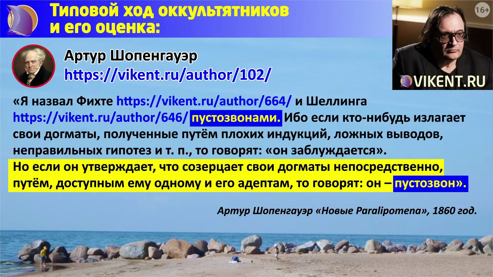

Соответственно, очень яркие представители в XIX веке, чуть попозже Шепенгарова, это Елена Балаваская, которая как-то обнаружила Махатом. Махатом где-то где-то в Индии. Никто их, естественно, не видел. Потом это уже в нашем веке подхватили Николай и Елена и Елена Рех. Соответственно, и Рехезжал в Москву. Потом пыталась после смерти Николая Рехалица Елена Рех в Москву. И писала большевикам письма, что, соответственно, махатмы махатмы через неё будут указывать коммунистам, как бы, что им делать. Я не утю не утригиваю. Ну, бывает у девушек, девушек Пеклинева, их сын Юх, соответственно, был поумнее. Он хотел вернуться в Москву, но он уже без Махатом. Он просто смог переехать в Москву из Тибета. Ну, просто как знаток востока и многих восточных языков. Он был поумнее, да. Такой, соответственно, типовой ход окультятников, что, соответственно, вот, ну, в общем-то, всё, всё, всё видно, всё видно на экране и так далее, и так далее, и так далее. Вот мы сейчас были. Теперь мы наконец перелезаем к самому важному. Ух ты, господи, сколько времени уже. Да, к самому важному, ради чего всё делалось. Ещё раз благодарю за шарый Магайту Геннадьевну Крылову из Питерана. Да, соответственно, скажем о методических работах. Так, давайте посмотрим дальше. Следующий слайд. Мы, наверное, немножко за полтора часа выйдем, ничего страшного.

---

## [01:18:15]

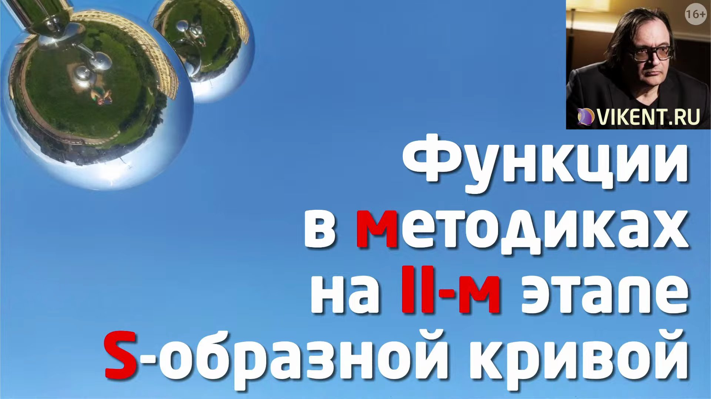

Так вот, где начинаются такие вот методики, за которые можно уважать человека и которые методики проста, хорошо сделанная методика, соответственно, стоит, ну, и вклит стоит уже несколько тысячелетий.

---

## [01:18:30]

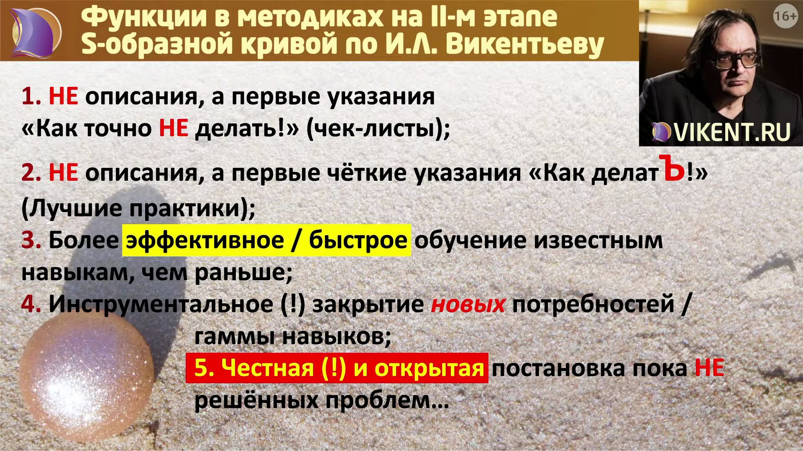

И вклит стоит геометрия, да. Соответственно, могу на собственном опыте сказать, что хорошо сделанные методики стоят десятилетиями. Ну, так далее, и так далее. Вот, соответственно, десятилетиями. Так вот, первая самая простоя форма чек-листы. Как вот точно не надо делать, вот не надо делать таким образом. И, соответственно, дальше хорошо бы перейти всё-таки хотя бы первое указание. А как всё-таки нужно делать? Что именно делать? Там рисовать. делать фотографии, кормить детишек. Это следующее дело. Далее, далее. Вещь, которая расцветёт на третьем этапе, но начинается на втором. Соответственно, есть чья-то методика чата, например, моя. Ну, соответственно, как её можно эффективнее либо быстрее, то есть с меньшей ресурсов преподавать? Большинство, допустим, большинство каких-то вещей, если внимательно посмотреть, сделать приветсколыку Бержасаеву, быстрый как бы ФСА анализ, они дожимаемые, то есть просто-напросто это можно оптимизировать. То есть безумное количество вузовских курсов, как бы вузовские курсы - это как преподавание, это некие методические дисциплины, они вполне дожимаемы. Опыт второй мировой войны показал, что можно очень быстро, гораздо быстрее готовить лейтенантов, как бы, ну, если оптимизировать программу обучения. педагогика, что такое как бы оптимизация педагогического процесса, оптимизация учебников, мягко говоря, они знают, как бы, да, соответственно, как бы вот инструментальное закрытие некоторых новых неизвестных потребностей, ну, и честная открытая постановка на перспективу нерешённых проблем. Соответственно, зная примерно какие методики рано или поздно появятся, рано или поздно появятся, можно за годы, иногда за десятилетия, но если за столетие это как бы, ну, слишком круто, ну, не поймут, не оценят, то, соответственно, можно спокойно заниматься. И сейчас будут примеры, когда, в принципе, даже денег не нужно. Ну, некая наблюдательность и воля, суперспособности не нужно, наблюдательность и воля. Вот без воли никак. Много раз уже говорил, что если можно было бы покупать волю рус русским людям, то это супертовар начала третьего тысячелетия. То есть воли катастрофически в стране не хватает. Давайте посмотрим. Давайте посмотрим как бы следующий слайд. И вот математика Леонард Эйлер. Леонард Эйлер. Вот посмотрите, пожалуйста.

---

## [01:21:30]

Опять-таки, мне чрезвычайно здесь важно, у него есть математические работы. Не буду вас утомлять. Кто хочет, смотрите. Можно на викенд смотреть, хотя на викенде, по-моему, его математических работ нет. Лучше смотреть математические энциклопедии. Но обратите внимание, если действительно человек хороший математик, соответственно, то, соответственно, Элли положил положил, соответственно, м свои усилия, и он дал идею, идею некоторых зубчатых колёс. Но если вы будете рассматривать, ну, не знаю, профессиональные зубчатые колёса там в бытовой технике, в автомобиле, где-то ещё, но не в детских игрушках. В детских игрушках вы увидите, что они там такие треугольнички. Так вот, Эйлер, Эйлер разработал, что эти колёса, эти колёса, соответственно, да, Эйлер - это XV век, на всякий случай. XV век вы видите, да, они должны вот их контур этих колёс, прошу мне поверить, кто не верит, проверьте меня, они должны идти по эвольвенте XV век. Соответственно, инженеры могут меня лгать и математики, но я скажу, вот когда зубья делаются по эвольвенте, там они, то есть сокосновение зубьев шестерён приближается к трению как бы качения, качения как бы и они подальше от трения скольжения. Вот. Ну, я как бы с точ точ выразился с точностью до метафоры, точностью до метафоры, то, соответственно, следующее изобретение вот таких вот колёс, которые там вот учитывали, что есть разные виды трения, трения качения и трения скольжения, сделал уже наш инженер как бы как бы Новиков. И он сделал в пятидесятых годах, ну, как бы, ну, два века прошло, как бы новое открытие. Соответственно, одна из причин, почему не пошла машина Паскаля, не могли сделать там зубчатые колёса, короче, саму машину разрушали, то есть сами разрушались, но не работали. То есть, значит, вот, то есть вот зацепление шестерёнок, зацепление шестерёнок как бы необходимо. Значит, мне здесь было как бы важно показать, что хороший, крепкий математик, вот если он действительно хороший математик, он как бы пачками пачками даёт, ну, масса каких-то полезных, прикладных, лучших практик пачками. Вот не нравится Бернули, можно вспоминать Эллер, можно вспоминать семейство Бернули, извините за оговорку и так далее, и так далее. Вот, и прочее. Давайте посмотрим вообще как бы интересную работу, да. Вот австралиец, Алан, как бы Пис и так далее. Вот, соответственно, он был некоторым коммерческим агентом, и у него была, судя по всему, Барбара.

---

## [01:24:30]

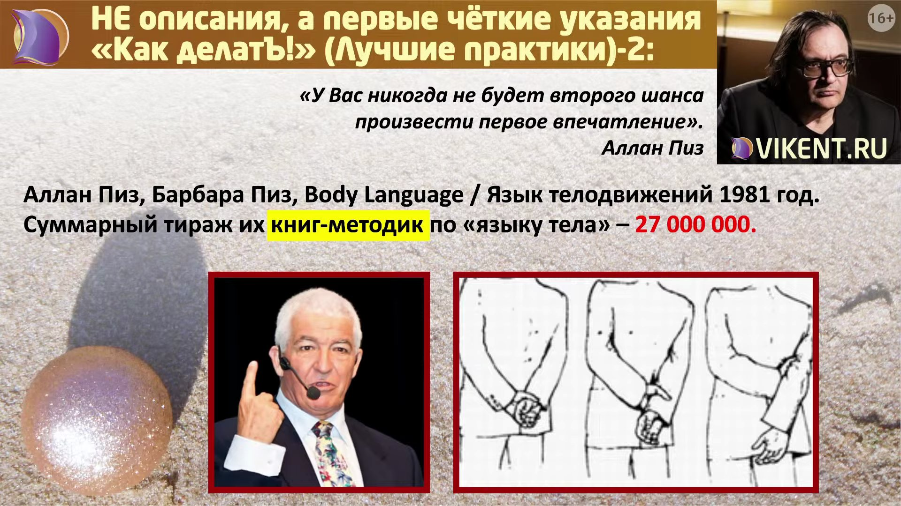

Барбара жена, и они выпустили та коммерческий агент, но наблюдательный. И, соответственно, он выяснилось, что, соответственно, нужна только наблюдательность, ну, какие-то записи. Ну и чтобы женщина вдохновляла, они выпустили книжку, вы видите в восемьдесят первом году язык телодвижений, что нужно было воля, наблюдательность, ну, как-то какие-то записи вести, фотографии делать. Суммарный тираж, соответственно, 27 млн. Ни оборудования, ни денег, ничего. После одной из очных конференций мне кто-то из участников, ну, в принципе, я помню, кто, в данном случае, неважно, прислал фотографию и прокомментировал, что Игорь Леонардович, когда докладывают мужчины на ощный конференции стратегии творчества, вы не нервничаете, а когда докладывают девушки, вы, соответственно, вот нервничае. Вот тут примерно как тут поза. Я подумал, подумал, подумал и вынужден был согласиться. Это правда. Очень интересно, что без этих фотографий, как бы присланных мне и комментарии участника конференции, спасибо, пользуюсь случаем, передаю, может будет смотреть, как бы это дело. Я про себе такой правды не знаю. Ну действительно, это правда. Я за девушек больше нервничаю и так далее. Правда, как бы следующий шаг. Почему я больше нервничаю за девушек, да, квачес? Ну, честно говоря, не знаю. Далее, обратите внимание, 27 млн и так далее. Вот как бы я не уверен, что Алан Пис и умная Барбара Пис, они вообще знают слово доказательства. Ну, немножко понимаю в бизнесе и могу сказать, что если его книжка, я не у меня этих данных нет, это мои фантазии, те гигипотезы, условно говоря, увеличивает у у наблюдательных людей, соответственно, продажи на 10%, то вот и получается 27 млн. Ну или просто-напросто, ну то есть, грубо говоря, доказатель, что вот в стиле математики, что всегда, во всех случаях там вот эта поза, то есть не просто чешуися локоть, а просто человек нервничает, человек нервничает, как бы, и так далее, и так далее, и так далее. Приведу один метафорический пример, что если по центральному телевидению в России пройдёт какой-нибудь фильм, выступление о том, что если есть огурцы с крупными пупырышками, то, соответственно, станешь более привлекательной для женщин, ну либо для мужчин, соответственно, и потом обратиться к к академикам, селекционерам, то академики селекционеры такой огурец вырастить за год откажутся. То есть они скажут, что селекция должно вырасти много поколений огурцов. То есть минимальный срок - это там 7 лет для селекции нового сота. Но, соответственно, всегда найдутся люди, я даже могу сказать, где они найдутся, в Москве, которые будут делать инъекции в огурцы, которые будут на принтерах распечатывать пупырышки и приклеивать. То есть, если люди платят, если люди платят, как бы никаких доказательств, никаких проверок не нужно. Никаких проверок не нужно. Это работает вперёд. Это работает вперёд, как бы, да. Ну, соответственно, и обратите внимание, вдохновляющий пример Алана Пиза, как бы, как бы, и его жены, как бы, они вот из нуля, из ничего при фактически нулевых бюджетах, нулевых бюджетах стали мировыми знаменитостями. Соответственно, соответственно, вот как бы до запуска. Вот мы сегодня как раз вот несколько минут говорили с Анатолием Александровичем Жичковым, что, соответственно, и коты, и псы тоже изучают хозяев и иногда очень точно, иногда как право, точнее, очень точно понимают своих хозяев. То есть они нас тоже изучают, хотя они не читали Алана Пиз, но тем не менее. Да, давайте дальше посмотрим. Да, давайте посмотрим дальше. Вот, соответственно, есть техника развивается, возникают новые потребности. Новые потребности. Вы видите, книжка 75 семьдесят пятого года. Мне эта цитата очень как бы лично близка, поскольку схожими как бы изобретениями то только для космоса мои клиенты занимались.

---

## [01:29:00]

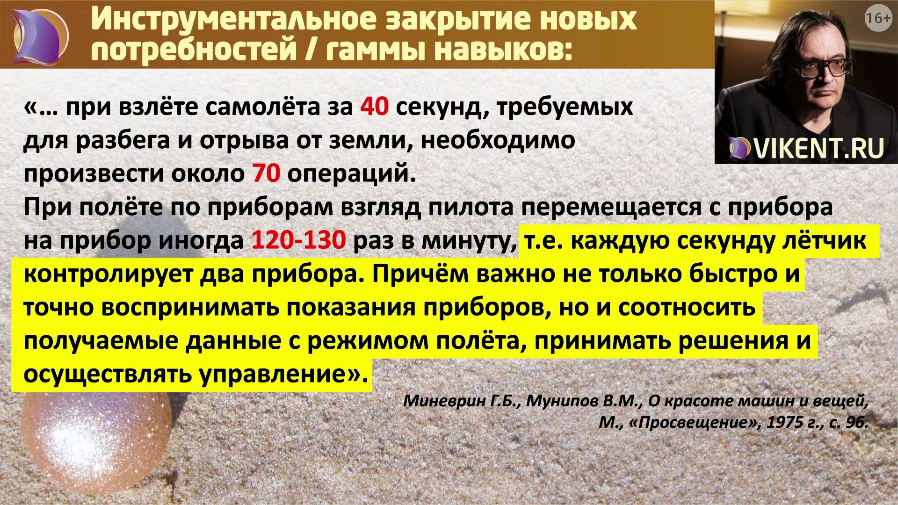

могу сказать, я не имею права как бы разглашать как бы количество операций. Ну, для космоса, вы догадываетесь, ещё круче, ещё круче. Вот кто первый закроет, ну, тот тот и молодец. Тот и молодец, тот и молодец. Давайте идёмте дальше. Давайте идёмте дальше. Вот давайте досмотрим дальше. Давайте смотрим дальше. Вот, соответственно, люди разработчики. Вот. И на втором этапе есть такая вот некая мешанина. С одной стороны появляются люди на первом этапе, как вот такая педагогическая деятельность мало выражена.

---

## [01:29:45]

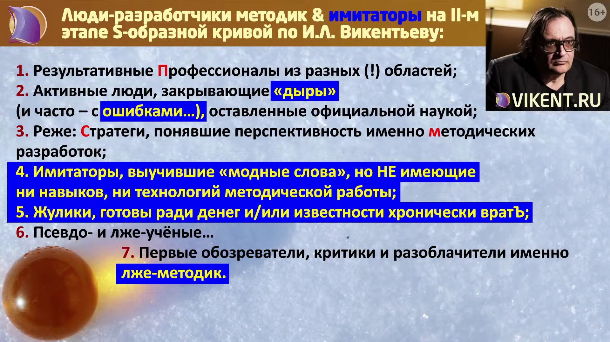

Нужно обучать, ну, может быть, сына, дочь, ближайшего помощника, ближайшего сотрудника. То есть это какие-то единичные люди. Единичные люди. На втором этапе дело, некое дело развивается, и сюда вовлекается большое количество, большое количество людей. Кто-то ради славы, кто-то по такой вульгарной причине, а больше никуда не берут. Соответственно, один из недостатков моего курса, соответственно, он фактически бесплатный. фактически бесплатный. Соответственно, периодически к нам залетают люди, вообще не способные к труду, вообще несподобные к труду и так далее, и так далее. Вот как бы залетают они не потому, что они хотят заниматься, потому что курс ходи хороший, как бы, вот, соответственно, но тем не менее, как бы, и так далее, да. Соответственно, как правило, такие вот жулики появляются в столицах, в крупных городах, потому что в небольших городах все перекрывается общими знакомыми, разговорами, сплетнями, интригами. И в маленьком городе просто трудно долго блефовать. В Москве, где живёт 10% России, блефовать очень легко, можно десятилетиями. Таких примеров, таких примеров массы. Ну, давайте посмотрим дальше, так далее. Вот. Значит, кто не знает, кто не знает, соответственно девятнадцатого у нас ответы на вопросы Патрис.

---

## [01:31:30]

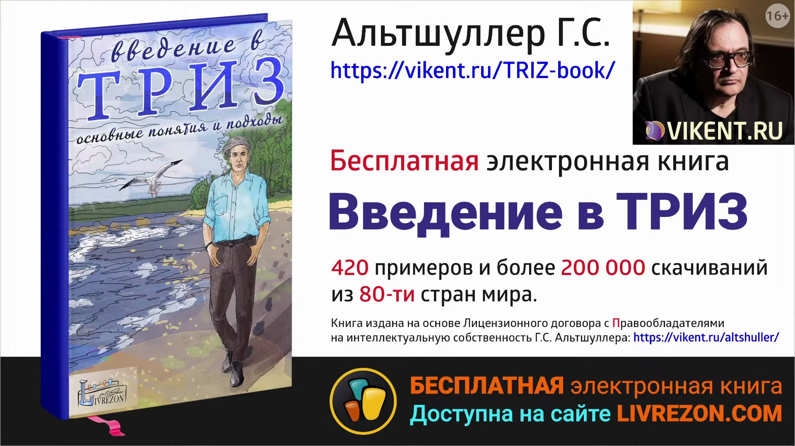

Вот как бы один из крупнейших или крупнейший гений XX века, Генна Совоча Альшу, который сделал как бы чистыми руками и чест честный, как так пучок методик. То есть кто хорошо знает рис, он понимает, что я сейчас сказал. Кто не знает рис, ну, проверяйте меня. книга бесплатная, сделана для вас и так далее, и так далее. Вот. А мы идёмте к следующему слайду, давайте. Да. Вот. Да. Соответственно, м, соответственно, вот учитывая, что приходят разные люди на втором этапе, повторяю, один один из мотивов, он такой странный, а больше уже нигде не берут.

---

## [01:32:00]

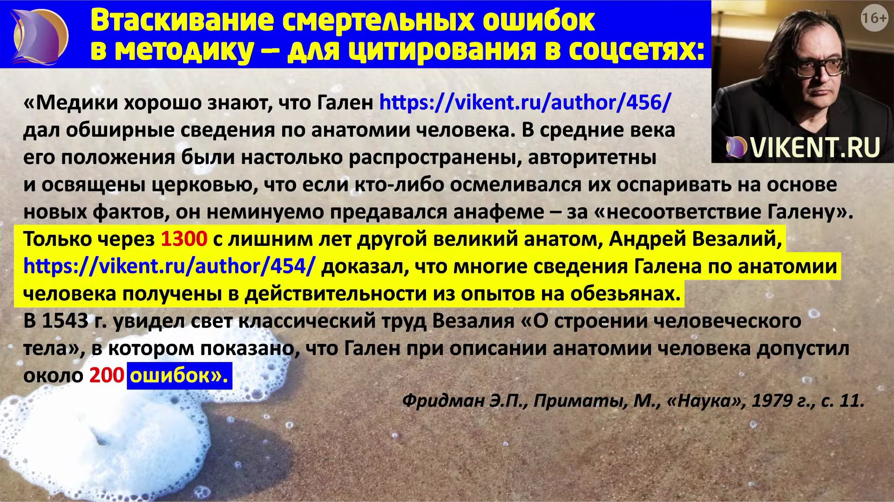

Больше нигде не берут, а хочется. Вот такой пример. К сожалению, его не рассказывают в школе. Соответственно, жил был Гален, как бы, который работал, который работал с гладиаторами. С гладиаторами лечил. И, соответственно, с одной стороны понятно, что там какие-то уникальные травмы и так далее, и так далее. Вот. И он написал некоторый учебник, по которому лечили, как бы, и, соответственно, лечили долго. Вы видите, сколько прошло, 1.300 лет. возник Андрей Виязалий. Визалий, который, соответственно, ночью посещал французские кладбища и анатомировал трупы. И, соответственно, он обнаружил, что Галена, видимо, гладиаторов не хватало, соответственно, и масса вещей он описал, соответственно, м так, на примере обезьяна. Соответственно, у меня есть некая книга, я её цитил когда-то. То в те времена, значит, ну, соответственно, обезьяны были в Африке через речку. Вспоминаем, где Гали, где Рим через речку, то есть через Средиземное море. Либо некоторые говорят, что обезьяны какие-то были даже на юге Италии. Ну, там тепло, наверное. То есть, короче, обезьяны были, их можно было легко достать. Ну и, соответственно, в современном программировании масса глюков из-за того, что люди берут какую-то программу, вот как бы уже готовый кусок какую-то готовый кусок кода и, соответственно, смешивают с другими. Смешивают такой кулинарный термин с другими. В результате всё глючит. В результате всё глючит, но тем не менее, да. Вот обратите внимание, как люди приходят, пытаются делать некие методики, методику хирургии. Вот сколько людей из-за этого как бы там без наркоза лечили на всякий случай. Тогда ещё наркоза не было в те в те времена. Как бы сколько людей отправились к проотцам, как бы, ну, история умалчивает. Пример печально. Ну, вот как люди втаскивают ошибку очень легко, как бы. Ну, книжку издал, книжку издал, церковники её не проверяли. Какие доказательства в методиках? Я об этом уже говорил. Идёмте дальше. Да, мы чуть-чуть побольше сегодня займёмся. Там материал хороший. Соответственно, у меня были знакомые, я их расспрашивал: "Вот есть Порфей Иванов и так далее, и так далее".

---

## [01:34:45]

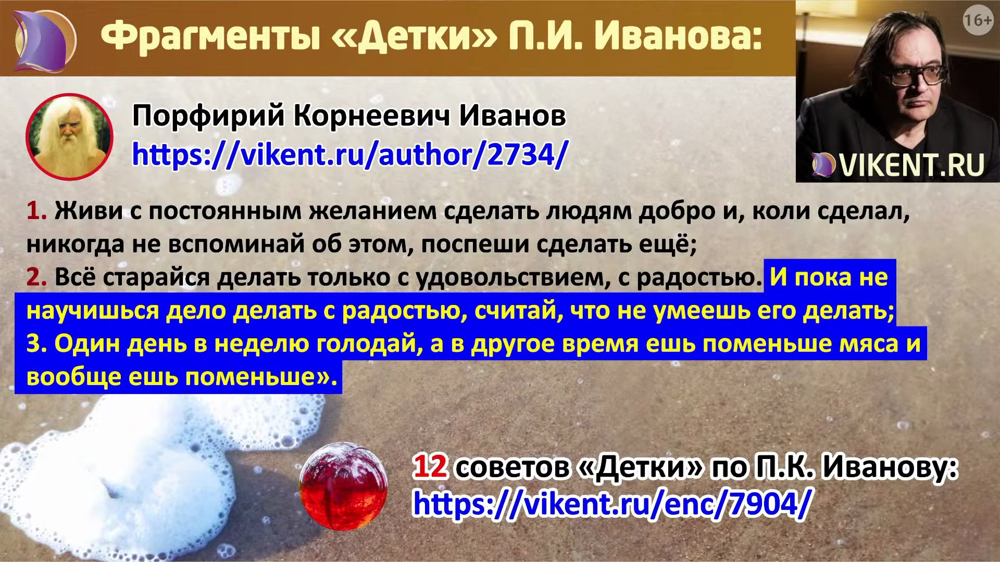

Вот я спрашивал и людей, которые ездили в Порфею Корнеевичу Иванову и спрашивал знакомых докторов, которым я доверяю. Причём, как правило, это доктора, типа заведующее отделение, там кандидат наук и так далее, и так далее. Вот. Вот если даже кто-то сейчас попытается после лекции не писать вопросы порис, как я просил, а там вот как бы выходить там голеньким на улицу, то я не медик. Ну как бы какое-то количество заболеваний вам гарантировано. Вам гарантировано. Соответственно, вот это ещё раз пример, как люди как бы достаточно без, то есть из того, что получается у одного. Вот что я хотел сказать. что, соответственно, у бизнес-тренеров, консультантов, коуче есть такая присказка: "А я вот так вот делаю". Из того, что ты так делаешь, не означает, что так получится у других. Какие были проверки на других? Были ли контрольные группы? То же самое вопросы к педагогам. Как правило, ни черта не было ни у педагогов, ни у кучи, ни у психологов. С этим чрезвычайно слабо, но они вечно втаскивают какие-то ошибки, какую-то фигню в свои продукты, плюс рекламируют и так далее, и так далее. Дальше люди наивные мужчины и женщины, ну, к сожалению, за это как бы за это тоже платят. Давайте теперь, ну, страху нагнал. Пример пример.

---

## [01:36:15]

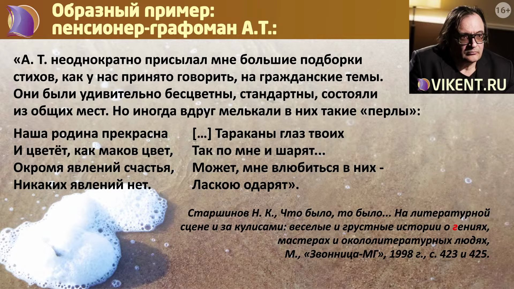

Соответственно, сразу же правый правый правый стишок. Вот обратите внимание, значит, как бы, то есть сравнить сравнить как бы женщину с тараканом, это, конечно, это, конечно, нужно. То есть пенсионеру делать нечего. Пенсионер вот там описан, я не знаю, пенсионер АТ, то есть какой-то пенсионер АТ сравнивает и сразу же посылает в журнал. То есть пенсионер АТ не выступал явно на женской аудитории. То есть, потому что женщины бы ему объяснили как бы, что, ну, как бы, мягко говоря, это безкусие как-то сравнивать женщину с тараканом и так далее. Вот похожие примеры есть у они у меня есть, но просто берёк время у Твордовского, который был и атлет редактором нового мира, там такое как бы тоже есть, тоже есть, так далее, так далее, так далее, так далее, как бы, да, так далее. Ну, как бы здесь, как бы не совсем методика, но механизм. Механизм как бы человеку что-то нужно было для рифмы. Человек даже не думая, что, ну, как бы сравнивать женщину, ну, вменяемую старакану мягко, просто плохо. Вот. Ну, по крайней мере, в русскоязычной культуре это грех. Это грех и так далее. Вот. Давай, давайте идёмте дальше. Давайте идёмте дальше. Ну и так далее. Ахков больницы, Маринской больницы. Идёмте дальше. как бы типовые ошибки, методики и так далее.

---

## [01:37:45]

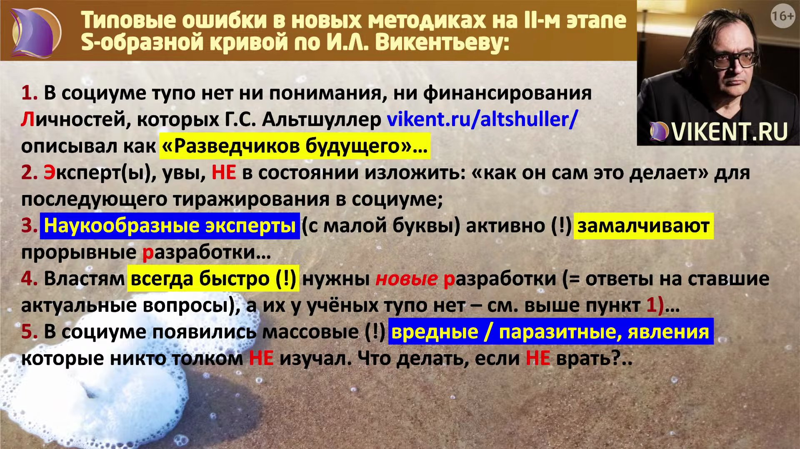

Вот, соответственно, соответственно, как бы вот начальству на начальству начальство вечно сейчас одну секундочку начальству вечно нужно что-то быстрое и завтра, быстрое и завтра. недале, как сегодня кто-то, кто сейчас есть в чате, мне прислал очередной как бы очередная тусовка в Москве, где поглушена масса каких-то третьеразряных иностранцев, которые будут рассказывать про будущее России, то есть как бы по будущей России. Кому очень интересно, напишите мне письмо, то есть я вам дам ссылочку. 7-8 октября в Москве будет, значит, такой, судя по всему, некоторый блеф. То есть третьестепенны иностранцы, то есть, чтобы нельзя было проверить, будут рассказывать про будущее России 7-8 октября будет это будет в Москве. Москвичи, пожалуйста, кто хочет, пожалуйста, вышлю вам ссылочку, как бы, да. Так вот, как бы, соответственно, обратите внимание, как бы начальство-то нужно вот всегда быстро. Вот всегда быстро, быстро, соответственно, не получается. Приведу несколько весьма печальных примеров. То есть были Карл Маркс и Фридерх Энгельс. А они написали многое о многом, но тем не менее как бы детально, что такое социалистическое общество, они не написали. То есть стада стада философов стада философов, соответственно, так и не сделали, как нужно жить в присоциализме. Докладываю вам, что в Советском Союзе больше всего докторских защищалось по философии. Докладываю вам, да? Докладываю вам, как бы, да? То есть как бы, да, вот, ну, не смогли сделать, смог это сделать какие-то контуры наметить человек тоже доктор наук, ну, такой заслуженный доктор наук. Напоминаю парадоксально, в сталинское время Ивану Ефремову, Фантасту, сначала присвоили докторскую, а потом он закончил горный институт в Питере. Ну, некоторый парадокс, сначала докторская, потом закончил как студент в горный институте. Так вот, Иван Ефримов в своих романах пядесятые-шестидесятые годы пытался предсказать некоторые контуры будущего, соответственно, его посла посло КГБ и так далее, и так далее, и так далее. Вот. То есть сами не могут, сами не могут что-то сделать. Стада философов, в частности, Иван Ефремов, Иван Антонович Ефрем, ещё несколько счётных людей пытаются помочь родине, соответственно, ну, как бы разваливают после его смерти, соответственно, его критотеку, значит, шпиони за ним и так далее, и так далее, и так далее. Там следующий грех у нас будет, мы сейчас вам покажем, то есть буквально как бы и так далее. Вот как бы, ну, остальные вещи сейчас мы вам частично покажем. Что-то будет непонятно, спрашивайте. Давайте идёмте дальше. Давайте идёмте. Да. Вот обратите внимание, типовой грех.

---

## [01:40:45]

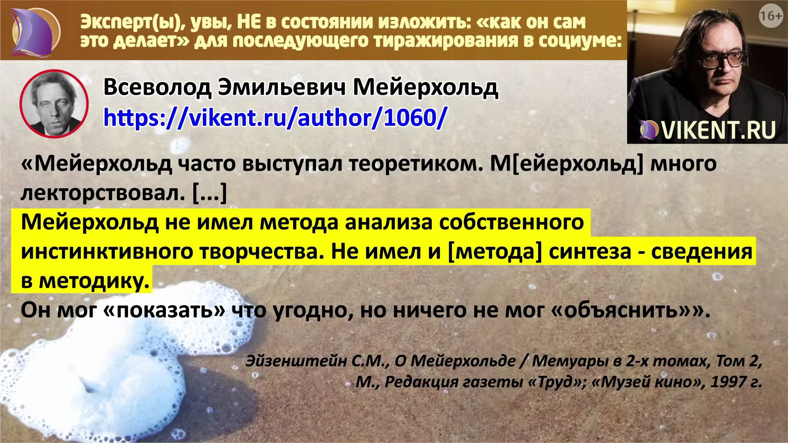

Типовой грех в методиках, это уже не наука. Все вот милимир ходят. Хорошо подвешенный язык может показать вот, ну, изложить. Изложить. как бы теорию он не может. Вот он не может. Он не может как бы, да. Соответственно, об этом пишет Эйзенштейн. Соответственно, как бы я уже не стал как бы здесь додавать. Соответственно, Эйзенштейн Эйзенштейн как бы преподавал очень хорошо. Он преподавал слишком хорошо. И, соответственно, студенты, которые у него учились, в его присутствии не могли что-то придумать. Потому что он их подавлял. То есть другая крайность. Слишком Эзейнштейн слишком хорошо поподавал, подавлял, подавлял. Ну, ну, ну не мог. То есть это методически, то есть, то есть нельзя иногда очень хорошо делать, иногда нельзя. Как-то не парадоксально. Давайте дальше. Далее. Типовая манипуляция. Гуманитария делают до чёрта. Малоизвестная штука.

---

## [01:42:00]

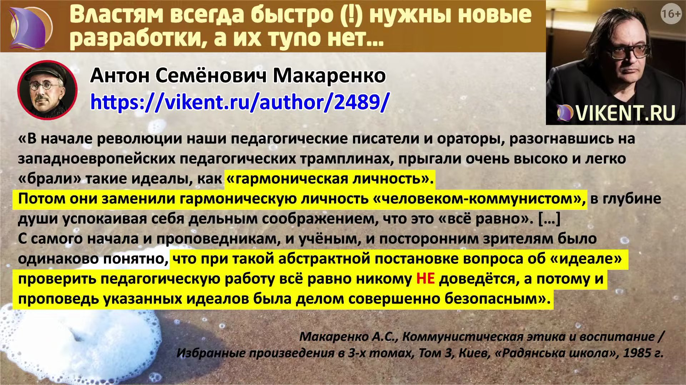

Соответственно, Макса Энгельса мало про человекасоциализм. Это есть отдельные глухие упоминания. И масса людей по заказу партии писали ерунду. Соответственно, писали они абсолютно безответственно. Проверить это невозможно. И фактически можно было изобретать с потолка всё, что угодно. Это продолжилось потом в шестидесятые, семидесятые годы докторами наук, профессорами, соответственно, психка МГУ и СПВГУ. То есть читать это стыдно. То есть в шестидесятые, семидесятые годы я на них вышел, ещё будучи студентом. И мне, студенту, инженеру было стыдно читать профессору. Просто стыдно, соответственно, скажем, да. Соответственно, кого чрезвычайно интересуют фамилии, ну, поищите, что в семидесятые годы писали про личность Макранса про более ранние времена. Ну и, кроме того, как бы это такая хорошая подводка, стоимость гения, который работал заранее, по выражению Альшулера, был разведчиком будущего. И когда родина доползла до некоторого рубежа, на этом рубеже есть какие-то уже проверенные научные факты, какие-то методические разработки и так далее, и так далее, и так далее. Вот сколько стоит гений? Очень много. А быстро, даже если начальство хочет, ну, смотрите, 7-8 октября Москва будет очередная тусовка. Сколько на неё потрачено денег, судя по всему, много. Ну, давайте. Да, меня там не будет с гарантией. Да, да. Соответственно, вот Конор Лорет, да, как бы, да, вот вот вот посмотрите, пожалуйста, некоторый такой тонкий эффект.

---

## [01:43:45]

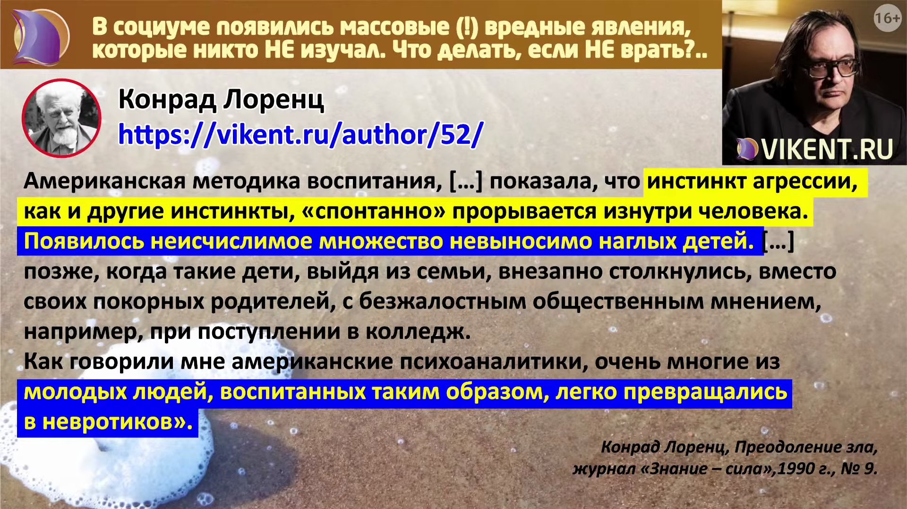

Соответственно, появилось такое как бы м масса теоретиков на Западе, слава богу, в России меньше. Так как насколько важна спонтанность? То есть идеи нету, ну, важно быть спонтанным. Это привело к появлению таких вот агрессивных детей. Ну, рано или поздно эти дети, соответственно, сажались на шею родителям, потом хомили в школе, соответственно. То есть до сих пор в российских вузах не обучают студентов, а что делать с матерящимся учеником, там, с ученицей, матерящийся или дерущейся с учителем или с другими детьми? А вот что делать, как бы трогать дичё нельзя, трогать дитё нельзя и так далее. Вот. То есть зияющая, зияющая дыра. Ну, рано или поздно детёныш заканчивает школу, окунается во внешнюю реальность и с гарантией реальность более жёсткая, чем школа, соответственно, получаем гамму неврозов, гамму неврозов и так далее, и так далее. Вот, и прочие, прочие варианты, как бы, да, так далее, варианты. Ну, давайте переходим уже к выводам тогда. Переходим к выводам. Извините, немножко затяну и так далее, так далее. Соответственно, ещё раз повторяю, как бы м мы мы не говорили про науку, мы только показали несколько акцентов, но не более того, как бы, да. Соответственно, я использовал две модели, очень каждый из которых очень просты, но на их пересечение можно прогнозировать, соответственно, может быть, не очень точно, но тем не менее можно прогнозировать.

---

## [01:45:15]

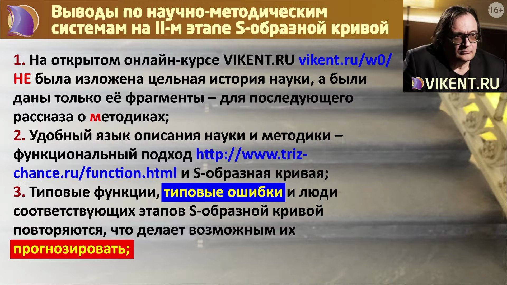

Это функциональный язык. Что такое функциональный язык? Проведена ссылка и S-образная кривая. Что такое S-образная кривая? Смотрите первую часть, там есть ссылка. Не найдёте, спрашивайте. Следующие выводы как бы, значит, соответственно, можно делать удачное слово. Кто-то в комментариях подарил, спасибо большое, не помню, кто и так далее, как делать перескок. Соответственно, вот как бы зная типовые ошибки, зная типовые функции, и можно делать перескок. Дальше некоторые вывод, который сегодня получился благодаря вопросам Кирилла Сергеевича Гудовича. Соответственно, если вы делаете правила, правильные ходы, то вы можете начинать с чего угодно. Но если у вас есть более-менее проверяемые факты, соответственно, путём нескольких преобразований, скорее всего, не одно предпреобразованиние нескольких, вы можете выскочить в область исследования, каких научных или методических мирового уровня. То есть нужны некоторые более-менее проверенные факты, то есть нез потолка и несколько преобразований. Ну, скорее всего, почему не одно? Одно уже люди освоили. несколько преобразований. Иногда в этом может помочь наставник. В ряде случаев для этого даже денег. Ну, нужны какие-то буквально карманные деньги в XX- XXI веке. Никаких таких безумных атомных установок, которые есть у физики, они, соответственно, скажем, не требуются. Вот очень важный момент, который здесь написан, постоянно повторяется. Давайте следующий слайд.

---

## [01:47:15]

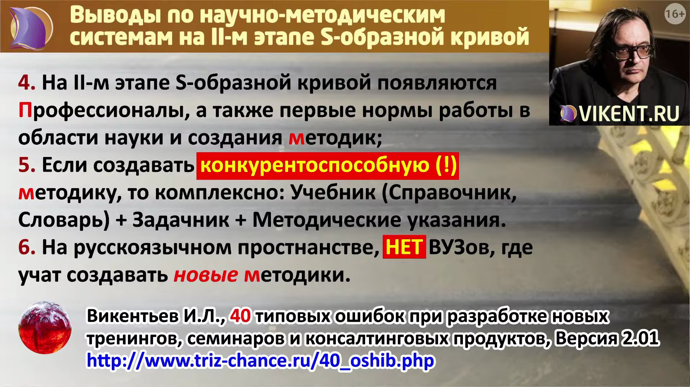

Важна научная честность. Если вы хотите врать, неважно кому, людям, себе, как бы, то, в общем-то, прилетит и в науке, и в методиках это прилетит. Соответственно, ряд людей, которые были удалены в кур с курса, они соблазнились бесплатным его характером и регулярно мне врали, просто-напросто врали, врали, врали, не выполняли собственных обещаний. То есть, повторяю, это такой научно-методический разврат. Соответственно, кто хочет, ну, может власть там себе дома. То есть я не являюсь специалистом в домашней жизни, как бы кто хочет делать свои разработки методические, вот ещё ещё раз честность, научная честность, методическая честность и так далее, вот как бы давали, да? Соответственно, давайте переходим к благодарностям. Большое спальшое спасибо, что до подождали.

---

## [01:48:15]

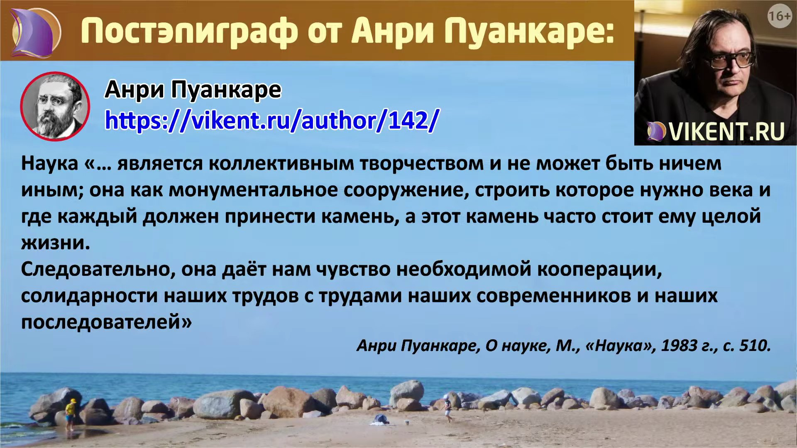

И вот то, что я обещал Аннарипункаре, он понимал то, что, ну, нужно быть честным и что мы, ну, более-менее прогрессивные и волеевые люди, ну, движемся, пытаемся двигаться вместе. Что это кооперация? Апнкар продуктивно работал, значит, соответственно, в XIX веке преимущественно. Ну, и так далее. Вот теперь давайте благодарности. Одно извинение. Одно извинение. Значит, я Андрея Валерьевича Толмачёва добавил.

---

## [01:48:45]

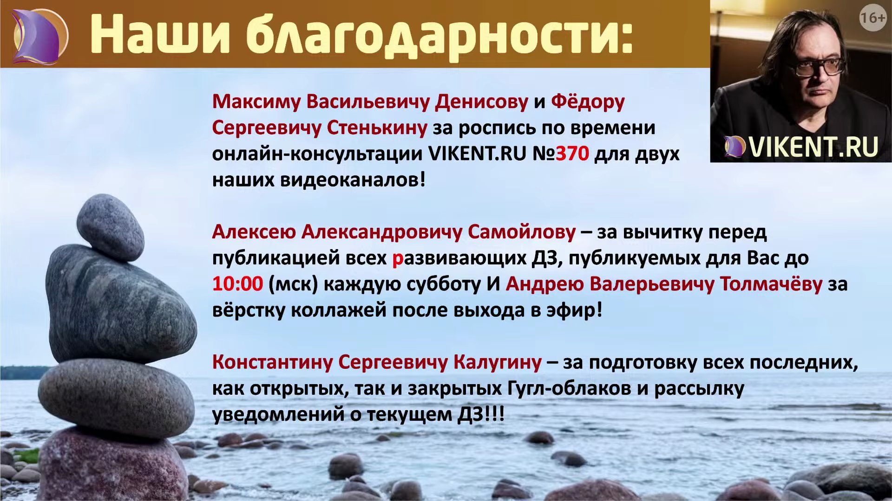

Андрей Валерьевич, большое ему спасибо. Каждый раз делает коллаж, каллаш из прошедшей онлайн-лекции полностью на его усмотрение. Я ничего не указываю. И минут через 10 после окончания лекции этот калаш публикуется. Ну мы мы постим его. Значит, большое спасибо. Большое спасибо коллегам. То есть я как бы делаю не один. Я делаю не один. Отдельное спасибо издательства Либозон, кто делает трансляцию. Были ли у нас сбои в трансляции? Нет, сбоев в трансляции не было. Останавливаюсь религиозным. То есть как бы у всех сбои как бы, а у нас нет, как бы, да. И напоминаю, что, соответственно, я получил ряд вопросов на пятого у нас не будет ничего. На 19 октября консультация по Жестл курс РТВ. Соответственно, я получил несколько вопросов о новичков, которому лжетризовс задуили голову, я уже получил. Соответственно, если я в течение недели это не получу от опытных докладчиков, я буду надоедать письмами персональными ВКонтактеми, чтобы опытные докладчики, там, авторы книг и так далее задали вопросы, значит, по, значит, Альшули, Утрис, ЖСТЛ и РТВ, потому что, ну, это эталонные материалы во многом, хотя там тоже есть ошибки. талонные материалы и нужно время, чтобы нам могла ответить семья по отдельным деталям биографии. Соответственно, всего вам доброго. Минуты через три-четыре я сделаю и ВКонтакте, и на Ютубе описание основных ссылок, которые были сегодня. Кстати, ссылок было немного. Всего вам доброго. Ноль пятого мы не мы не работаем. Всего вам доброго. Отдельное спасибо всем. Значит, давайте ещё один кадр. Да, давай. Да, ещё кадр.

---

## [01:50:45]

Извините, раньше сказал. Извините, извините. Да. Всего вам доброго. До свидания.

---