# Лекция 374

---

## [00:00:00]

Добрый день, уважаемые коллеги. Сегодня у нас будет достаточно длительная онлайн-консультация о крупнейшем гении, соответственно, минувшего столетия, который открыл новый ресурс, новый параметр, новую координату, координату творчества. Потому что остальные физики, химики и другие получатели Нобелевских премий, они развивали то, что было уже известно. У нас сегодня онлайн-консультация будет точно длиннее полутора часов. 84 слайда- это довольно много. И, соответственно, как бы если будут какие-то перебои со связью, соответственно, мы продолжаем и завтра утром и на Ютубе, и ВКонтакте будет выложено то, что я как бы обещал. Соответственно, вы увидите большое количество ссылок на тексты и на видео. Мы не стали такую пометку делать на на соответствующих слайдах, но, соответственно, наиболее важные ссылки на тексты и на видео для вас, чтобы руками не набирать, они будут, соответственно, в почте Игоря Леонардовича Викентьева. Это я, который вы, соответственно, скажем, увидите. Итак, соответственно, давайте переходим к первому слайду, к первому эпиграфу. И вот вы видите, эпиграф как бы очень характерный, это не Генрих Сочаль Шулер, но это времена его такой, это эпиграф из поэта времена его такого становления, если можно сказать, и так далее, и так далее, и так далее, и так далее.

---

## [00:01:45]

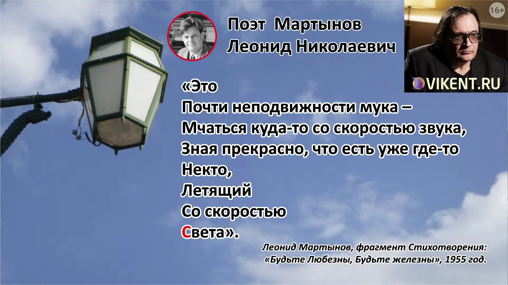

Вот, насколько я понимаю, Генна Русовича Альшулеву подобные вещи всегда нравились. Соответственно, я сейчас как бы буду продолжать говорить. У нас есть правило, номер нашего вещания 374. Соответственно, у нас все в чате регистрируется имя, фамилия, имя, отчество, фамилия. Если кто-то ошибся, зарегистрировался фамилия, имя, отчество, ничего страшного. Соответственно, если вы гистрируетесь иначе, через несколько минут, когда мы перейдём, собственно, к первому вопросу, а первый вопрос рабочий день гения, рабочий день Генесовачаль Шулера, соответственно, вы будете удалены. Обратите внимание, это не просьба, это просто-напросто, ну, условия нашей работы. Кого интересует, почему так, пожалуйста, вы можете задать вопрос. У нас будет очередная консультация, открытая 16 ноября. Я подробно отвечу, почему у нас именно такие, а не другие правила. И вот, соответственно, ещё пусть это повисит. Соответственно, когда делается сайт м как сайт альшуchли alchul.ru, ру. Соответственно, семья высказала гипотезу о том, что очень полезно будет раздел именно по истории, по истории м по биографии Генхучаль Шулера. Когда сайт был создан, соответственно, выяснилось, что посещаемость вот именно истории Гена Хасауча Альшу, повторяю, крупнейшего гения XX века, всего лишь 2%, то есть очень мало. То есть и это есть своя правда тех людей, которые кто-то из них преподавал трис, кто-то из них там просто интересовался. Люди искали какие-то инструменты. Тем не менее я придерживаюсь в сегодняшней консультации логики семьи Генсауча Альшууллера, потому что вот стратегически в творческих дисциплинах, а ты, безусловно, творческая дисциплина, нужно учиться у лучших, нужно учиться у гениев. и стратегическая линия. Стратегическая линия, соответственно, у нас будет именно вот, скажем, по его биографии и, ну, как бы что делать дальше. Отсюда, собственно, и заголовок. Давайте посмотрим. Давайте посмотрим. Давайте посмотрим.

---

## [00:04:15]

Соответственно, сейчас больше всего нас смотрят ВКонтакте, хотя параллельно сейчас идёт вещание и в Ютубе, и ВКонтакте. Ну, кому, где угодно и так далее. Вот, соответственно, ВКонтакте есть полностью открытая группа, никаких там секретов нет. Желающие могут подписаться. Периодически там есть, прошу нас отличать от других, и публикуются именно профессиональные материалы по трис и, соответственно, смежным темам. Далее некое объявление, которое мы будем напоминать целый год. Сейчас вы увидите, в чём дело. Давайте следующий слайд. Итак, следующий слайд. У нас грядёт столетний юбилей в следующему году Геннавича Вальшулера. И мы сегодняшнего вечера, сегодняшней ночи начали собирать соответствующие вопросы на портале.

---

## [00:05:00]

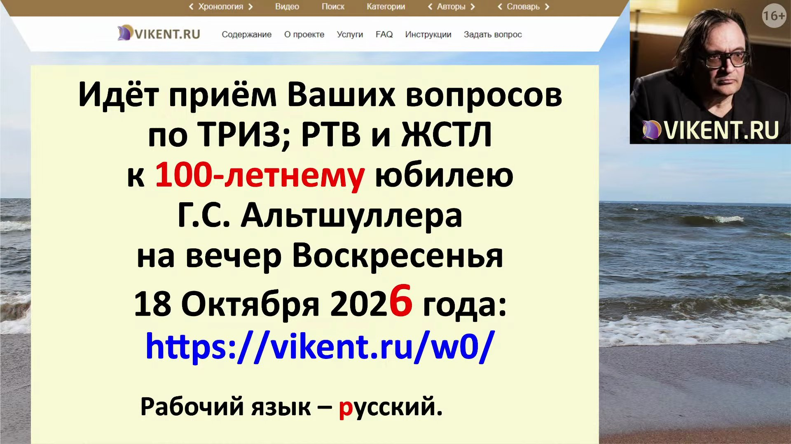

Я прошу их не присылать мне по там письмен в видемейла или ВКонтакте, потому что когда собираются в портале, мне понятно, мне понятно правовая основа. То есть там сделана оговорка, что я могу это открыто публиковать. открыто вам отвечать и так далее. Или по каким-то неведомым мне причинам вы стесняетесь, у нас предусмотрен режим аноним. То есть я знаю, кто прислал вопрос, но тем не менее никто никогда этого не увидит. Отдельная просьба нашим согражданам, поживая за границей, то есть Австралия, Эмираты, Вьетнам и так далее, и так далее. Вот у нас рабочий язык русский. Я рад за вас, что вы вы освоили какие-то другие языки. Но к столетнему юбилею Геннасовича Вальшулера, соответственно посымаются только на портале и только, повторяю, на русском языке. Соответственно, [музыка] соответственно, мы переходим к следующему следующему слайду. Большое спасибо всем, кто задал там более тридцати уточняющих вопросов.

---

## [00:06:15]

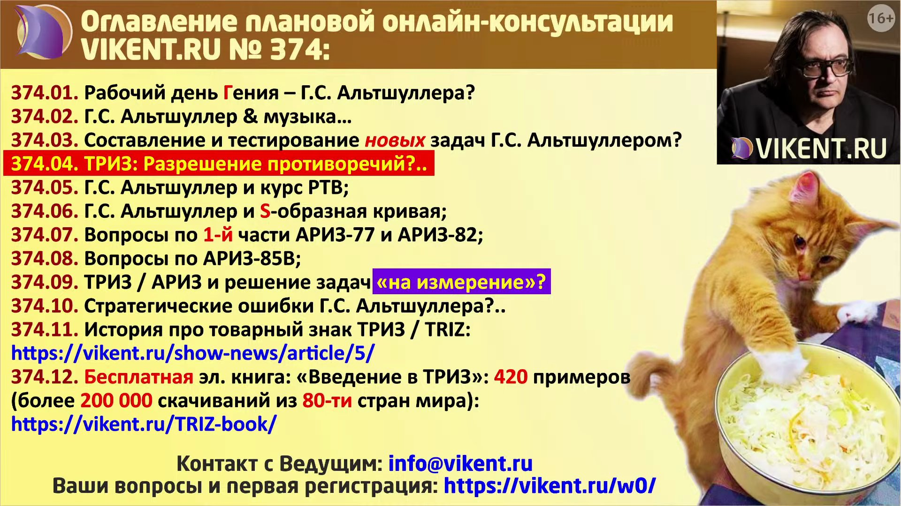

Это позволило нам отхич некоторые ветки, соответственно, ну, может быть, перенести на следующий год, то есть, потому что на следующий год явно будет короткий спецкурс по биографии гения гени Генаха Сауча Альшулера. Отдельная благодарность семье вы сегодня увидите ряд комментариев написан семьёй, которая обладает уникальным знанием, которое не обладают другие люди. Соответственно, сегодня будет высказывание первое, скоро вы уже увидите самого Генасовоча Альшува. Он был очень продуманный человек. И если что-то он нам оставил, неважно, в виде машинописей, в виде рассказов на семинарах, в виде высказывания на конференциях Петрозауске, то это было сделано абсолютно сознательно. Абсолютно сознательно. То есть лирическая растрёпанность - это не прогена Христосовича Альшулера. Второй момент. вы увидите. Ещё раз большое спасибо, некие некие тексты из семьи, которая прислала в этом году. Вам ещё раз большое спасибо и мои, соответственно, высказывания Игоря Анадовича Викева. А иногда эти высказывания могут не совпадать. Ничего страшного. Ну вот на то и нужно изучать биографию великого человека. Теперь давайте посмотрим. Давайте посмотрим как бы первое высказывание Альшулера. Вот, соответственно, Альшулер и семья извели в Баку в отсутствии интернета и социальных сетей пять пишущих машинок и, соответственно, с тем, чтобы информировать о развитии ТИС 200 школ.

---

## [00:07:45]

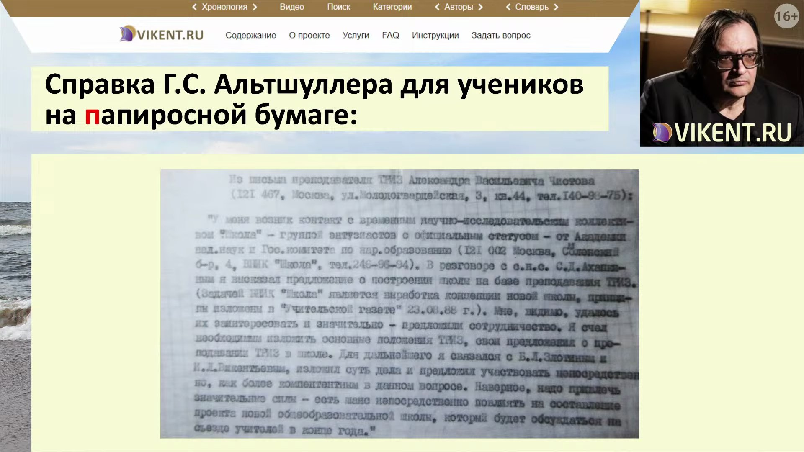

То есть частный человек в СССР имел 200 школ. 200 школ. 200 школ. Соответственно, чтобы больше экземпляров влезало в пишущую машинку. Это была папиросная бумага. Прочесть, ну, при очень большом желанию этот слайд нужно остановить, прочесть. Если у кого-то будут вопросы, ну, задавайте под видео, соответственно, как бы мы постараемся вам ответить. Это вот как раз один из материалов Альшууллера. Ничего там такого сверхособенного нет и так далее. Вот ещё один акцент, который люди не верят. Сегодня разлика три об этом скажу. Люди считают, что где-то есть какой-то тайный трис. И вот если как бы как бы кто-то этот тайный трис нет, заботами Альшулера, заботами его семьи, всё, что касается трис и смежных дисциплин, опубликовано, открыто. То есть никакого тайного трис нет. Есть ряд закрытых разработок, например, моих, которые я не публикую, который доступен только продвинутым ученикам. Ну, об этом, об этом речь впереди, но я занимаюсь немножко как бы своим направлением, поэтому я прошу отличать. Мы сегодня не обо мне, мы сегодня про Геннасовича Ашуле. Давайте посмотрим дальше. Давайте посмотрим дальше, что нас ожидает. Мы сегодня несколько раз будем показывать, соответственно, итак, стараниями Анатолия Анатолия Александровича Жачкова. Соответственно, мы установили мировой рекорд для 30 видео. Вот есть шестиминутник, он есть на Ютубе.

---

## [00:09:30]

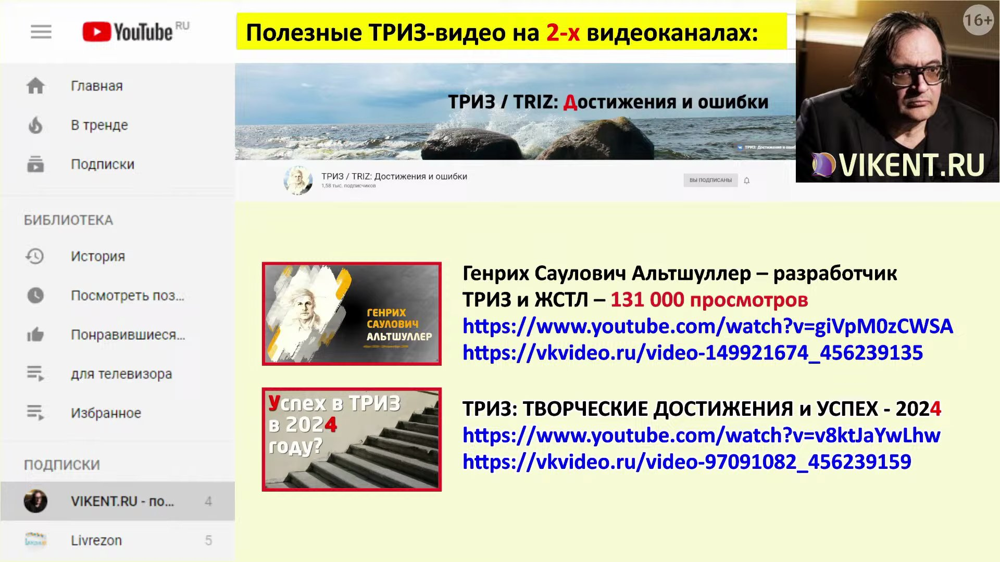

И на Ютубе он набрал 131.000 просмотров. Это такой рекорд для любых три с видео, любых видео про Альшууллера и так далее, и так далее, и так далее. Вот там очень компактно всё сказано. Я его пересмотрел перед сегодняшним вещанием, как бы, и что бывает чрезвычайно редкого, хотя я автор сценария, мне это понравилось. Очень толковый ролик. Соответственно, на ВКонтакте он набрал всего лишь 3.000. Но мой совет тем, кто интересуется ТИС, начинает работать в ТИС, что-то не понимает в ТИС, этот ролик нам удалось в 6 минутах очень многое сказать, очень многое сказать и так далее. Вот, соответственно, далее есть вещи, которая обязательно смотреть, если вообще вас интересуют, куда движется ТИС, проблемы ТИС и так далее, и так далее. Вот. Хотя нам написано 2024 год, ну, соответственно, трудно менять обложку. То есть мы можем поменять обложку, но как бы не стали этого делать. Соответственно, это можно поставить и двадцать пятый год, и двадцать шестой, и двадцать седьмой, и двадцать восьмой год. Соответственно, это смотреть нужно несколько десятков минут. Вещь может быть эмоционально не очень приятная, но чрезвычайно полезная. Поэтому смотрите, обязательно смотрите, кто считает, кто считает нужным. Вы видите небольшой портрет Генрисовича Альшулера. Он нарисован Олегом Геннадьевичем Ивановым в 1986 году. Соответственно, он есть на заставке и он есть здесь. Соответственно, кто этот порты использует? Соответственно, ну, просьба соваться, что художник Олег Геннадьевич Иванов портрет сделан по моему заказу в 1986 году. Соответственно, давайте посмотрим следующий слайд важный. Соответственно, вот у нас будет выходить бесплатные конференции, их будет семь вещей, семь как бы направлений.

---

## [00:11:30]

Там слова трис нет, хотя некоторые доклады уже сейчас обсуждаются, некоторые доклады близки Трис. Вы видите, конференции пока бесплатны, их будет семь штук. Соответственно, сверху вот этого сообщества ВКонтакте висит анонс, кто считает нужным, соответственно, узнать, чем чем будет мы будем заниматься в 2026 году, пожалуйста, милости просим. Соответственно, дальше все разбиваются на две части. Уже сейчас можно задавать вопросы организаторам. Там все организаторы перечислены. Вопросы организатора можно задавать неоднократно, если вы хотите стать докладчиком. Соответственно, то есть как можно раньше, то есть как можно раньше сегодня ночью, завтра утром, сегодня ночью, завтра утром пишите организатором, потому что каким бы вы не кем бы вы не были бы, насколько вы не считали бы себя таким экспертом в проблеме, соответственно, требуется время. Это очень длинная технология подготовки доклада. Довольно длинная технология. Кого интересует, почему она длинная, почему так они иначе, пожалуйста, я уже сказал. Третья неделя ноября, 16 ноября. Я вам подробно отвечу. Но для этого надо задать, для этого надо задать вопрос. Давайте дальше посмотрим, кто сегодня прислал слайды. Точнее, прислали их прислали самые разные люди.

---

## [00:13:00]

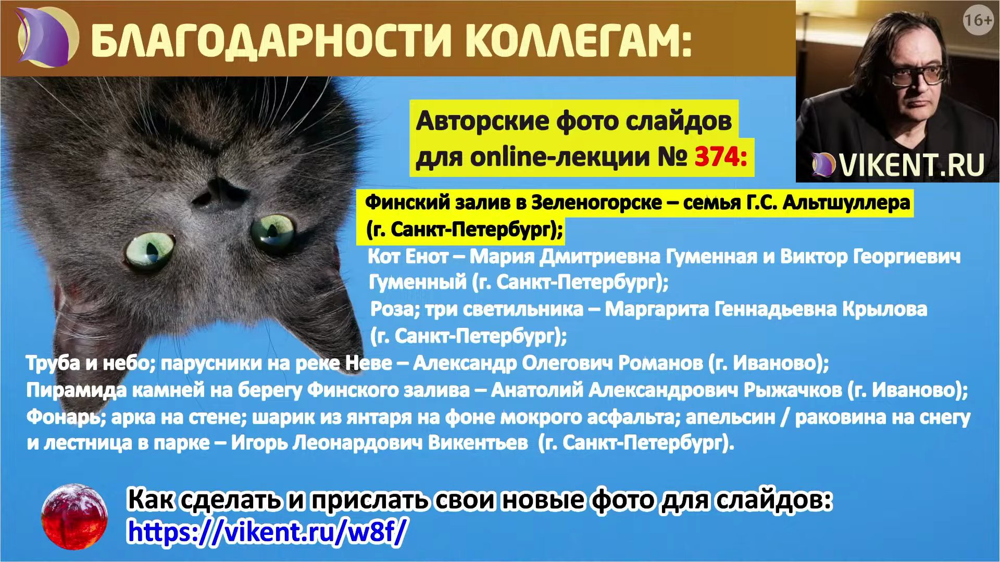

Спецблагодарность, соответственно, скажем, семье Генксовича Альшулера, когда которыя Альшулер очень любил море, жил в Баку, на берегу Каспия. Ну, мы решили, сейчас семья переехала из Петрозавородска в Петербург, и просто мы используем это фотографи многократно увидите фотографию. Ну, кроме того, в разные годы люди присылали фотографии. Всем большое спасибо. Кто хочет что прислать, ну, соответственно, большое вам спасибо. Теперь очень важный момент. Давайте посмотрим ещё, прежде чем я буду отвечать. Соответственно, вы можете софинансировать видео. То есть сегодня будет длинная онлайн-консультация. Наиболее важные моменты мы сделаем видеокаротыши. Кто хочет профинансировать это видео, соответственно, YouTube дорожает.

---

## [00:13:45]

Соответственно, нужно, вы можете, можете, точнее, вы можете, если вы хотите, прислать финансы по двум счетам: Сбербанк или, соответственно, ЯндексДеньги. Там два счёта на этой странице портала. Соответственно, нужно сделать приписку, то есть подарок трис, донат трис, пожертвование трис. То есть два слова: подарок, донат, пожертвование и слово трис. Тогда нам будет понятно, что это исключительно на на развитие вот этого видео, которое сейчас мы как раз и записываем. Да, давайте идёмте дальше. Сегодня много материалов, потому что это там чуть-чуть тороп. Соответственно, у нас принято, кого интересует, почему, кто у нас впервые, спрашивать, ответим.

---

## [00:14:30]

Вот именно такое церемонное общение. Сейчас будет первый, начнётся первый ответ на первый вопрос. И у нас работают два немилосердных модератора, которые, кто не выполняет мои указания, мои показания на этом курсе являются имеют силу закона. Если вам неприятно, терпите. Соответственно, они будут выкошены, и все сразу понимают, вот по каким правилам мы работаем. Вот по таким правилам мы работаем. Давайте переходим к первому вопросу. И прошу двух модераторов, соответственно, выкосить из чатов тех людей, кто не в состоянии выполнить правила, которые написаны у нас везде 374 раза.

---

## [00:15:15]

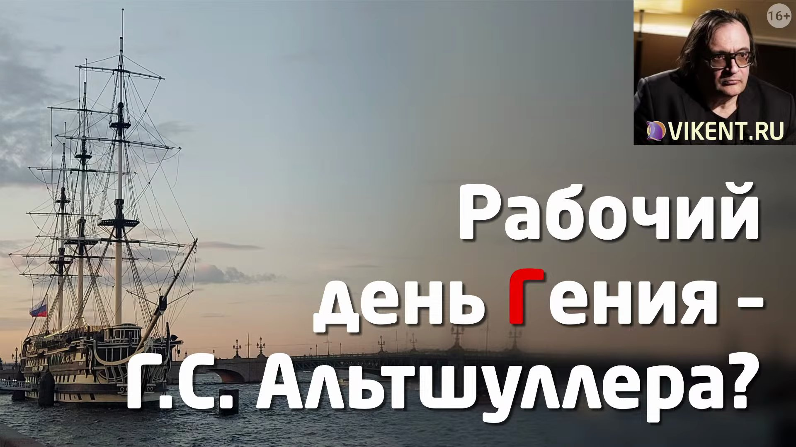

Итак, некоторый вопрос, который интересует многих. И как вот строился рабочий день гения? Давайте посмотрим. Давайте посмотрим вопрос, как он был прислан. Итак, вопрос одного из организаторов конференции Жексалыка из Астаны.

---

## [00:15:30]

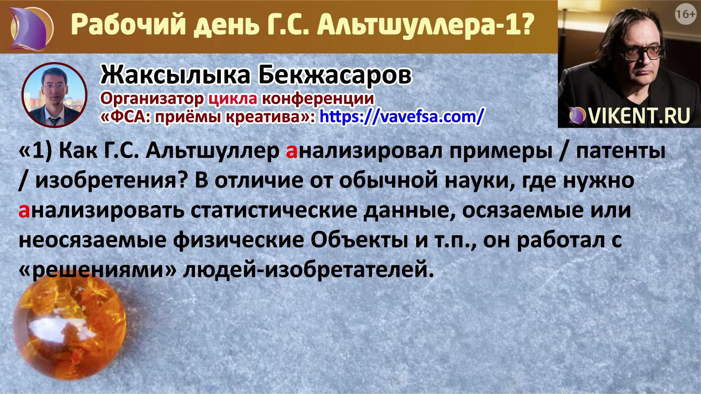

Соответственно, я не читаю вопрос. Я думаю, что вы сами это состояние сделаете. Соответственно, давайте второй. Давайте второй. Вот такой рабочий вопрос. В книгах, в книгах этого нет.

---

## [00:16:00]

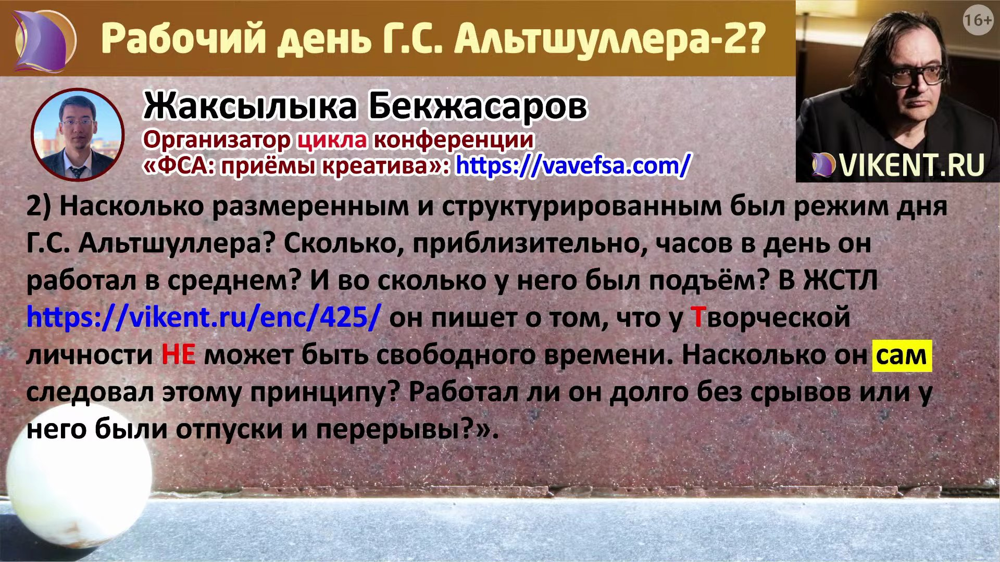

Вот, соответственно, давайте посмотрим ответ семьи. Я не зачитываю, то есть зачитываю. Соответственно, если кто-то не успеет, вот как раз эта фотография, это и фотография семьи.

---

## [00:16:15]

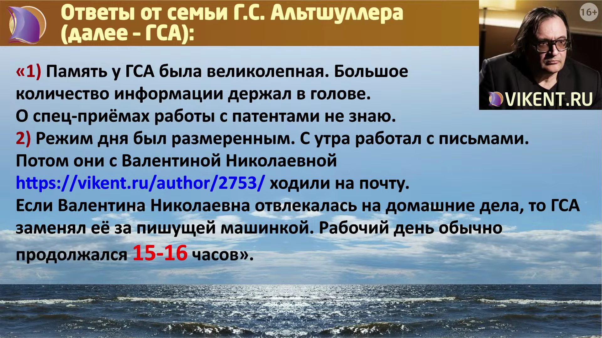

Соответственно, очень кратко надо сказать, что жена и помощник, писатель Фантаст Валентина Николаевна Журавлёва, она же первый инвестор, трист, то есть она писала отзывы отзывы на литературное сочетание азербайджанских авторов, и это был один из источников финансирования семьи. Ну, очень много помогало. Соответственно, Альшулю многократно на больших собраниях тризовсов, на всех конференциях, которые проходили Петрозауски, Геннасовича Альшу рассказывал про Валентину Николаевну, как она ему помогает, и, соответственно, говорил рекомендацию. Это было даже до появления же СТЛ, что молодые люди обращение к мужчинам и шить жену Складовскую, имеется складовская, которая потом стала складовская Qжды навлески. Работоспособная женщина, бо работоспособная женщина. Один раз это было очень пикантно. При мне человек спрашивал, Альшу, что жена Стивы не даёт ему денег, не даёт ему денег на подписку журнала Изобретатель и рационализатор аж 3 руб. Вот. Ну, Альшу в своём стиле покомментирую. Ищите Складовскую. Ищите складовскую. Соответственно, давайте дальше. Давайте дальше. Вот, как ни странно, как ни странно, вы увидели, что данные семьи похожие вещи сам Генкс Учнкратно рассказывал, никаких главных трис секретов нет.

---

## [00:17:45]

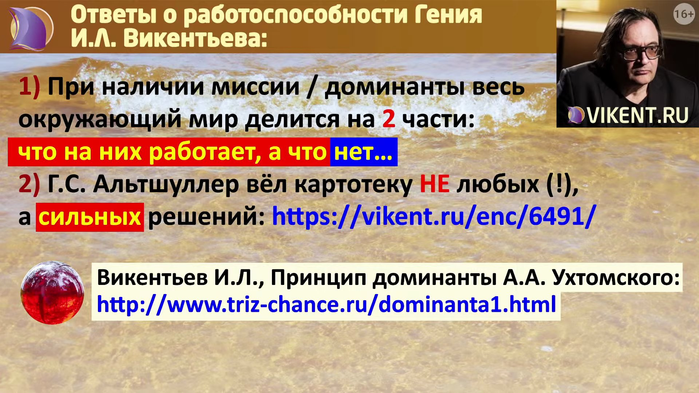

То есть очень большая работа, 15-16 часов в день, то есть ещё больше увеличивать, но просто-напросто нужно временно здоровый сон. Соответственно, вот здесь вот какие-то будут мои акценты. Сразу повторяю, вот сейчас уже мои акценты, это указано в заголовке, о том, что когда мы имеем некую миссию, мы имеем некую доминанту, всё становится чрезвычайно просто. Весь мир делится на две части неравные, я бы сказал бы. То, что работает на миссию развития и то, что не работает, ну или хотя бы вбок. Всё, что в бок, вычёркивается. Остаётся малая часть. Ну и, соответственно, человек работает. Кто не знает, что такое доминанта, насколько она коварна, насколько она сильна, ну, желательно знать статью. Она очень часто у меня воровалась и опубликована не под моими координатами, соответственно, в интернетах. Вы можете первыисточник вот посмотреть. Ссылка для вас. Более того, эта ссылка, она будет в моём комментарии сверху. Мой совет знать близко близко к тексту. Второй момент. Второй момент, который мне нужно было сказать, на своём курсе об этом говорю бесконечно. Те, кто попадают в первый раз, не врубаются. Соответственно, очень важно, что Генс Сауча Альшулер десятилетиями десятилетиями вёл картотеку не любых, а сильных решений. Не любых, а сильных решений. И это позволяло сделать тыск, который и сейчас работает, например, на передовых предприятиях Китая, Америки, ну, ряда других стран, Кореи имеется в виду Южная Корея, как бы, да, Южная Корея и так далее. Вот так вот. Соответственно, я многократно, десятки раз слышал от коучей, что они узнали, что есть такие ТС приёмы, и они радостные мне рассказывали, что через год будет очередная наша конференция, наша конференция Нетризовская. И они, у них там богатая лента ВКонтакте, и они быстренько сделают свой трис под свои проблемы. Соответственно, опыт показал, что они не слышат главного слова, которое у нас выделено красном, что нужно собирать не все решения, то есть не мусор, который есть ВКонтакте и так далее, и так далее. Вот, а, соответственно, собирать именно сильные решения. Если вам непонятно, что такое сильное решение, соответственно, пожалуйста, по нашим правилам фамилия, имя, отчество задавайте вопросы. Ну, когда сформируется это видео, то есть сейчас писать в чат как бы не стоит, ну, и так далее, и так далее, и так далее. Так, давайте следующий слайд. Давайте следующий слайд. Следующий слайд. Соответственно, и ещё как бы одно дополнение тоже от Викентьева. Соответственно, как бы вот сейчас уже вот-вот выходит электронная книга бесплатная, которая имеет такое, ну, может быть, не очень вкусное название.

---

## [00:21:00]

162 летские темы Викенд, которые были на курсе. То есть, то есть в очень многих видео, которые есть на Ютубе, это есть ВКонтакте, есть и светские темы. Их уже более более, соответственно, вы видите, 1.700. Соответственно, ну, мы взяли такие наиболее поставительные, наиболее вкусные, наиболее актуальные. И чрезвычайно важно, соответственно, как бы заниматься какими-то новыми темами. Альшуль пытался иногда давать темы персонально. В частности, мне было предложено заняться геометрическими эффектами. Это было сделано, в частности, мне. Соответственно, иногда, меня это не касается, иногда он даже писал некоторую первую главу, допустим, для человека и так далее, и так далее. Вот. Но опыт показал, что, мягко говоря, продолжить предложенные исследоские темы не могут. Ну, соответственно, исследоская тема, она, если вы в неё верите, ну, как бы жёсткостью миссии, жёсткостью она вытягивает вообще из болота и позваличности развиваться. То есть хорошая тема развивает личность. И здесь появился бельчон. А бельчон у нас появляется там, где что-то хорошее, такой пытливый бельчон. Ашуле его не видел. Уже после смерти мы его сделали такого бельчона. Думаю, что он бы ему понравилось, насколько я его знаю. Да. Ну давайте дальше посмотрим. Давайте дальше посмотрим. Следующий слайд. Вот как раз вот такая книжка электронная. Повторяю, она бесплатная. Вероятная, насколько я понимаю, она выйдет на этой неделе.

---

## [00:22:45]

Ну следите, соответственно, за нашими ресурсами. Она будет проанонсирована, её можно бесплатно скачать. Соответственно, как бут домашнее задание по этой книжке, соответственно, вероятно, вероятно, через годик, вероятно, через годик мы там сделаем там, ну, какое-нибудь круглое число, там 175, что-нибудь в этом роде или 200, может быть, сделаем избные иследственские темы и сделаем бумажный вариант, бумажный вариант этого темника. Соответственно, эта вот книжка бесплатная, она крохотная, то есть в виде там Вордовского либо Google облака, она занимает около 50 страниц, но она сверхконцентрированная, то есть там перечисленные темы и плюс ссылка на видео, где можно посмотреть более подробно. То есть формально её можно прочитать там, не знаю, это меньше чем за час. неформально. Её можно читать месяцами, потому что, ну, каждая тема исследоская, каждая с переднего края науки и методики, то есть это делается небыстро, но исследовательские темы, если заниматься всерьёз, соответственно, соответственно она вытягивает личность, она вытягивает небольшие коллективы. Большие коллективы, как правило, ну, уже приходят потом. Ну, продолжаем, продолжаем ответы. И идёмте дальше. Идёмте дальше. Соответственно, опять-таки ответы семья Альшули, ответы семья Альшу и так далее. Вот вы читаете, вы читаете. Ну вот просто нет места для отпусков.

---

## [00:24:15]

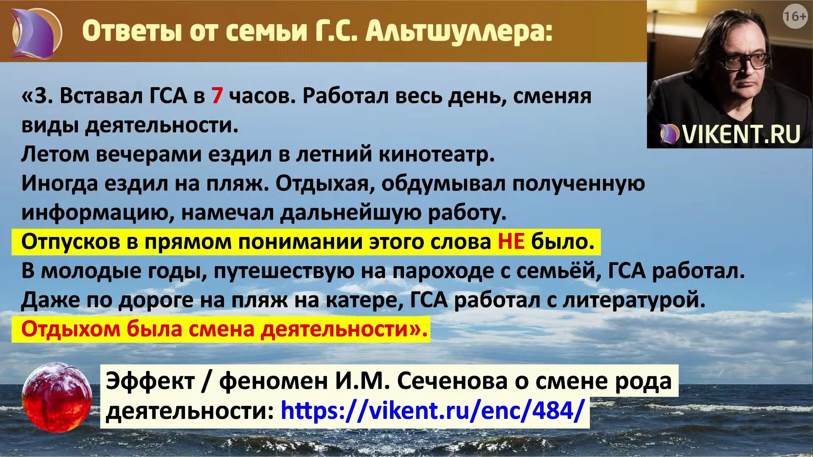

Вот нет места для отпусков. Нет места. Нет места для подпусков. Соответственно, кого интересует более глубокое психофизиологическое обоснование, это эффект, феномен Ивана Михайловича Сечинова. Это классическая работа 1901 года, то есть самое начало XX века. Самого начала XX века, то есть смен, смена смена в виде деятельности. Как вы видите, никаких тайных секретов, тайных секретов у Альшуле, у Генасовича Альшулера не было. Работа, работа, работа и работа. Ну и такие, ну, сильные цели. Сильные цели и так далее. Вот, к сожалению, к такому не все возможны. Давайте посмотрим дополнительные материалы. Следующий слайд, пожалуйста. Итак, соответственно, эти ссылки уже для вас заготовлены. Я их опубликую, когда видео сформируется.

---

## [00:25:15]

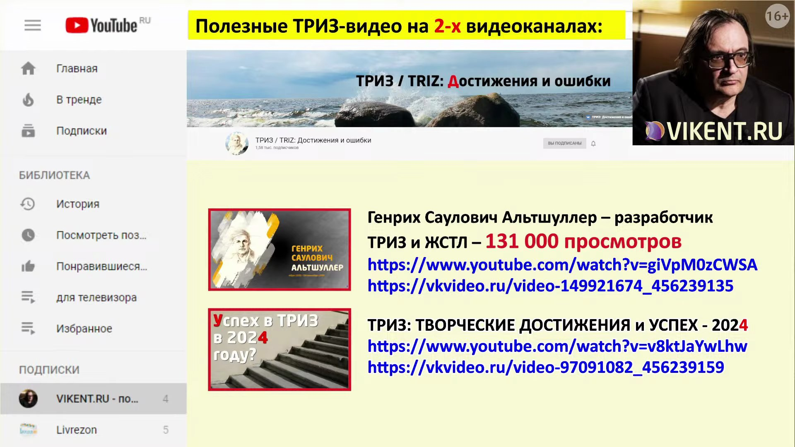

То есть мы сегодня закончим и минут через пять я опубликую и на Ютубе, и ВКонтакте. Итак, вот ещё раз вот есть некое-то рекордное видео шестиминутное про генахсоучая. И, соответственно, вот три строчки достижения успеха - это скорее протризовцев. То есть какой ерундой не стоит заниматься, как и что следует делать, ну, этим тысячелетия от Рождества Христова. Второе видео может быть эмоционально неприятно. Может быть неприятно, но оно чрезвычайно полезно. Чрезвычайно полезно. Рекомендую смотреть небыстро, очень внимательно. Естественно, везде можно задавать вопросы, не дублируя их, и я вам буду отвечать. Всё. Значит, мы прогнали первый блок. Сделаем отдельный каротыш, наверное, из него. Давайте переходим к следующему блоку вопросов. Итак, альшулер и музыка.

---

## [00:26:15]

Я совершенно некомпетентен в этом вопросе. Здесь отвечала полностью семья. Давайте посмотрим. Давайте посмотрим. Соответственно, прислал Кирил Сергеевич Гудович.

---

## [00:26:30]

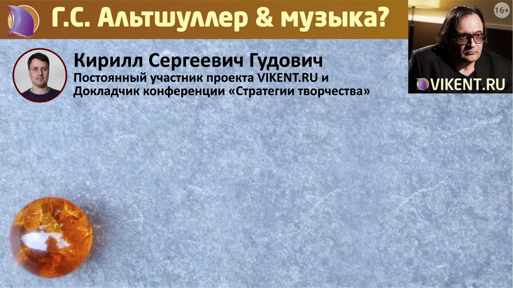

Это единственное место, где я очень Кирил Сергеевич задал массу очень подробных вопросов, как бы, ну, исходя из своего опыта занятия музыкой. Он м занимается музыкой и так далее. Это единственное место, надеюсь, Кирил Сергеевич на меня обидится. Я снял, чтобы как бы не запутаться. Не запутаться, потому что, во-первых, я не понимаю как бы в музыке, а- второе, чтобы не перепутать с тем, что отвечала семья. Давайте почитаем, что по этому поводу ответила семья.

---

## [00:27:00]

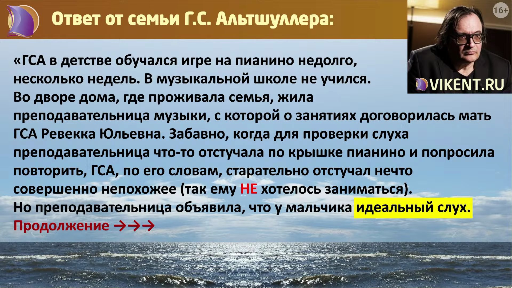

Она ответила, ну, грубо говоря, по всем вопросам Киева Сергеевича. Читаю внимательно. Я пока глотну тёплого. Угу. Альшу, рассказывая про свою детство и юность, говорю, что он был мальчиком с таким с непростым характером. Это он сам рассказывал про себя многократно. В книгах этого нет. Это на собраниях различных тезисов было только. Ну, я надеюсь, вы почитали. Если вы не почитали, давайте ставьте на паузу, почитайте завтра. Соответственно, вы видите, отец журналист, да, журналист, в том числе, в том числе делал обозрение и так далее. Вот так далее вот как бы, да.

---

## [00:27:45]

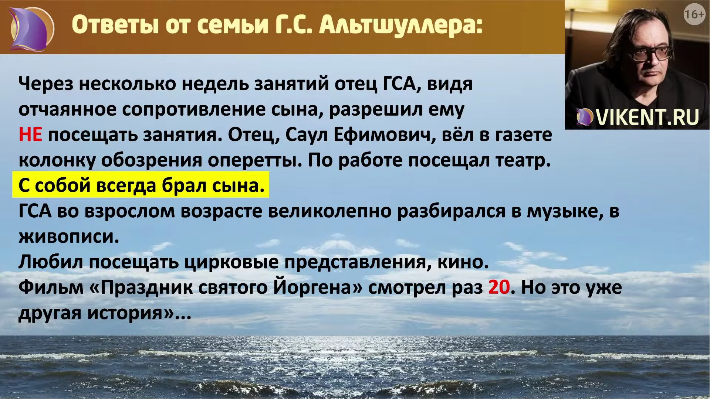

Значит, ответено, если вам что-то ещё интересует, то, соответственно, перешлите, посылайте мне, я перешлю семье Альшуле и так далее, и так далее, и она вам ответит. И она вам ответит. Ну, давайте посмотрим ещё, да. А вот вот что рекомендовано, поскольку мы это может быть сделаем каратриш, соответственно, что полезно смотреть потрис, вдохновляться и хорошо работать. А мы переходим к следующему слайду, следующему следующей серии ответов. Следующей серии ответов.

---

## [00:28:15]

Соответственно, большое спасибо Маргаритик Крыловой, Санкт-Петербург. Соответственно, Трис строится на задачах. Трис строится на задачах.

---

## [00:28:30]

То есть, то есть, если в курсе трис нет задач, то это, соответственно, не курс трис, без справка альшулера в книге, в частности, в найти идеи это тоже есть. То есть стандартный курс минимальный и кардидал 120 часов очных. Ну, понятно, что очные можно преводить в онлайн. И каждый решает, очень важная оголока, которую делал Альшули, каждый решает письменно. Письменно 230 задачек 200. Значит, масса преподавателей три, которые берут с вас деньги, сейчас вещают в интернет, сами эти 200 задач не решили. 200 не решили. Критерий Альшу минимум 120 часов плюс 200 задач письменно решённых. Письрешённых. Он очень расстраивался, когда был вынужден переехать из Баку Петрозаводск. вынужденным в Баку тогда стреляли. Это отдельная история. Про это никто не спросил. Поэтому в этом году об это поэтому и не рассказываем. Что ему пришлось оставить, как он говорил, на балконе большое количество разборов задач Патрис. Ну давайте посмотрим нашего вопрошающего. Итак, человек проводит серию конференции Константин Сергеевич Калугин. И, соответственно, соответственно, который сейчас пишет свой задачник.

---

## [00:30:00]

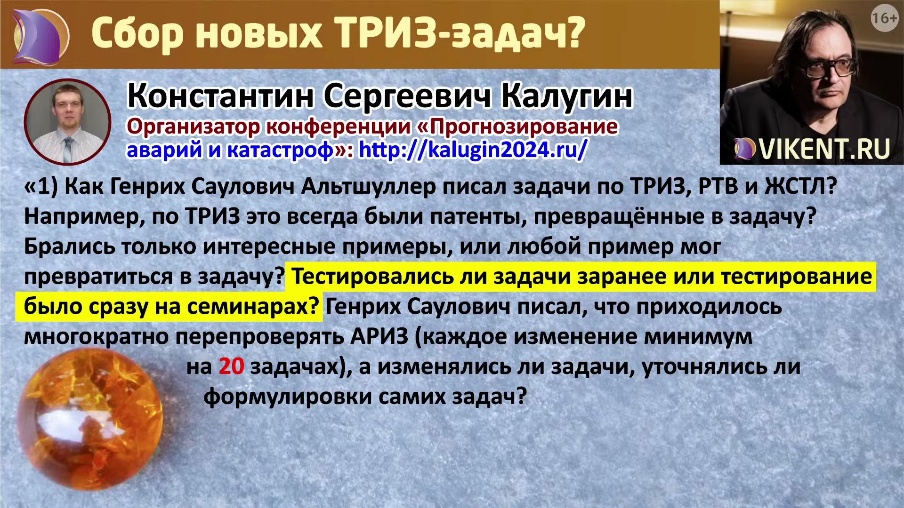

Задачник пишется, любой задачник, который пишется у нас, пишется очень тяжело, потому что, ну, люди должны его понимать. То есть, то есть дело не в том, чтобы люди купили задачник. Такой цели нет. Есть цель, чтобы, если задачник приобретён, неважно, платно, бесплатно, чтобы люди им пользовались. Поэтому без тестирования мы задачи не выпускаем. Причём тестирование проходит многократно. Давайте посмотрим второй вопрос. И здесь я бу я буду уже отвечать, соответственно. Да, соответственно, да. Давайте, давайте, давайте, давайте, значит, давайте теперь мой ответ и так далее.

---

## [00:30:45]

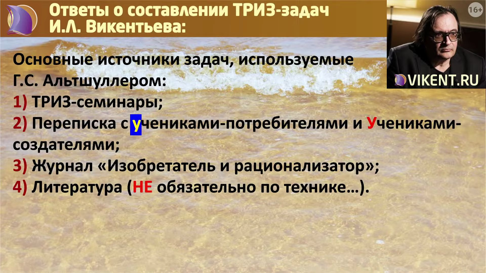

Вот, соответственно, пункт один, значит, в рамках ТРИС, в рамках ТИС, соответственно, какой-то отдельной теории по созданию задач, по созданию кейсов разработано не было. Значит, львийную долю задач, которые до сих пор почти все они рассекреченые, соответственно, составил сам Генрих Рочальшулер. Соответственно, откуда эти задачи брались, источники? Соответственно, на каждом три семинара была практика, опять-таки начатая Геннавича Альшулею, что какой бы не был бы семинар, то есть он был бывали подлиннее, бывали покороче, необходимо, чтобы слушатели сделали бы какой-то письменный разбор своей задачи, в том числе сложной, в том числе, которая кажется нерешаемая. Сейчас, соответственно, эта практика, к сожалению, покращена, учитывая не очень высокую квалификацию тезисов, которые сами не умеют решать задачи. К сожалению, это чрезвычайно печально. Второе, соответственно, было 200 школ, но переписка 200 школ - это которые вот как-то там занимались, получали материалы, работали по книгам. Количество людей, пишущих генущую Айшулю в отсутствии интернета социальных сетей была было большее большее, да, чем 200, да, и соответственно некоторые из них подлагали задачи, в том числе актуальные и нужные. Кроме того, допустим, были ученики более приличные, которые, допустим, просто-напросто часть задач присылали. Например, Игорь Леонардович Викинтьев - это я. Мои задачи, вы можете увидеть в издании, найти идею, найти идею и так далее, и так далее, и так далее. Вот как бы, да, избелетени изобретений. Кроме того, раньше был очень хороший журнал, очень хороший журнал изобретатель и рационализатор. Вки в каждом номере колоссальное количество изобретений. Колоссальное количество, журнало небольшое, очень много. Сейчас, к сожалению, по классической сообразной криевой журнал просто-напросто озогнулся. Ну и литература, литература, повторяю, специального, специального как бы теории созданной не было, созданно не было и так далее. Вот, соответственно, как бы тестирование тестирование новых задач проистекало с помощью первой небольшой группы, то есть вокруг Ашулера в Баку всегда было какое-то количество людей, с которым, как они мне рассказывали в разные годы, это были разные люди, обсуждались некоторые новые материалы. То есть, ну, это логично, люди живут в этом городе, они приходят в квартиру Альшулев и так далее. Вот второе, как бы наиболее известные преподаватели, наиболее известные школы Тыс, самая большая школа ТИС была всегда питерская. Питерская школа Тыс. Она, может быть, была не самая, может быть, качественная, но она была самая большая. В Москве не не состоялась. То есть московские трицы всегда были вечно вечно слабые. Соответственно, моя моя гипотеза, что просто очень Москва, очень много соблазнов, то есть у людей нет времени сосредоточиться. Соответственно, рассылались какие-то новые материалы, они тестировались таким-то образом. Каких-то тайн, новых процедур, новых процедур и что-то ещё, ещё вс на работу не было. Тема остаётся открытой. Те, тема многократно ставилась уже уже на моём курсе, пока тема не закрыта. То есть как тести, как создавать, как тестировать, как публиковать. Ну, концепция нового задачника, новых кейсов и так далее, и так далее, и так далее. Вот на Западе есть чемпионаты по чемпионаты по решению кейсов. У нас тоже что-то пытаются делать. Ну, то, что мне довелось видеть, честно говоря, это смешно. Поэтому, к сожалению, к сожалению, повторяю, как бы вот такой полезный приём, который я могу выделить, если кто-то может выделить другой приём, пожалуйста, это какая-то небольшая группа опытных людей, у которых есть, ну, преподавательский опыт, на котором очень быстро можно обкатывать новые материалы, новые задачки. Всё. Но прежде чем выпускать это большим тиражом и публиковать в книжках. А мы идём дальше. Идём дальше. Соответственно, полезные материалы. Полезные материалы.

---

## [00:35:15]

Соответственно, вы видите сообщество ВКонтакте профессиональное, далее профессиональное сообщество в Ютубе, профессиональное именно Патрис. И, соответственно, есть Дзен. Дзен. Там периодически появляются материалы Патрис, то есть либо близкий Трис, либо близкие Трис. Соответственно, кто считает нужным, да, всё бесплатно, всё открыто и так далее, и так далее, и так далее. Вот, кто считает нужным, пожалуйста, кто считает нужным, пожалуйста, подписывайтесь. Ну и вперёд. Вот. Идёмте дальше. Соответственно, известная фреска, известная фреска другого гения. И вот написано слово специально так сломано, это не ошибка, это так специально задумано, разрешение противоречий.

---

## [00:36:00]

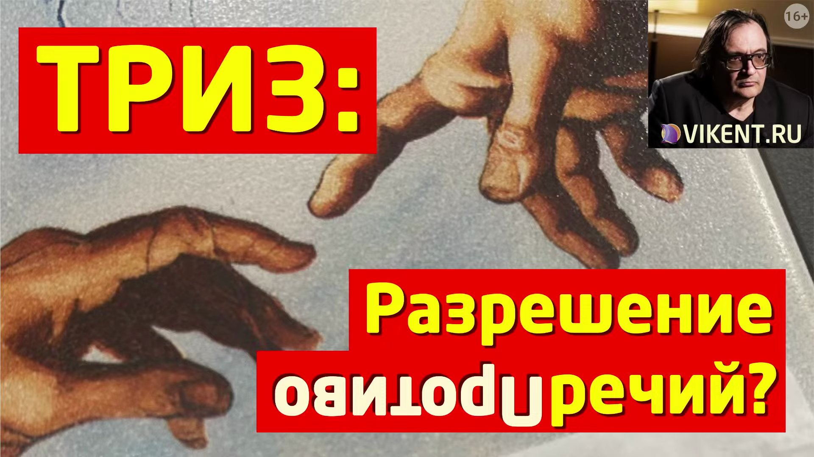

Вот здесь вот начинаются некоторые сложности. Начинаются некоторые сложности и так далее. И давайте посмотрим вопрос, потому что он из Италии. Давайте посмотрим вопрос из Италии. Соответственно, Италии и, соответственно, я продолжаю говорить, продолжаю говорить. Вы читаете, соответственно, м в средневековье, в Италии.

---

## [00:36:30]

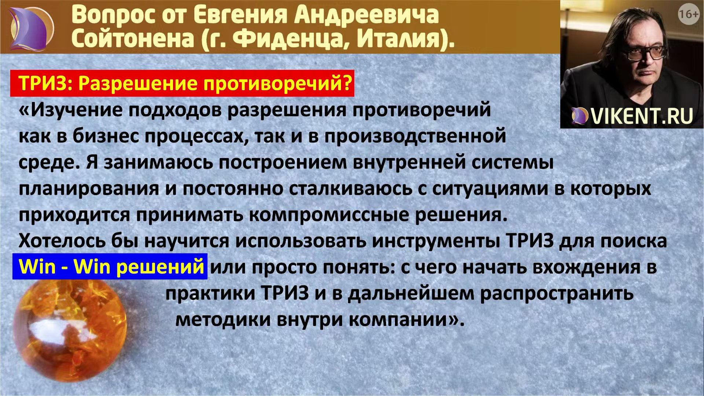

В Италии вы видите, а также в соседней Франции, а также в Бельгии, ну, и в других таких странах примерно в том направлении считалось, что трюфель, я имею в виду грипп, грипп трюфель, соответственно, образуется от того, что молния шарахнула в лес. То есть вот била молния в лес, да, била, образовался какой-то странный гриб, очень вкусный, который сейчас ищут с собаками в Италии, во Франции, Бельгии и других странах. Ну и так далее. Вот, соответственно, существует некоторые некоторый миф. И, соответственно, в очень многих информации про Трис сказано примера следующее, что, соответственно, ТИРИС построен на на разрешении противоречия. Вот я должен мгновенно исправить это. И в уточняющих вопросах это тоже встретилось, что одна из трисмоделей - это выявление, скажем, обострение и разрешение противоречий. У нас есть видео, соответственно, где специально по этому поводу мы выпустили давно уже, где рассказывается следующее, что, соответственно, философы о том, что бывают противоречия, знали ещё до нашей эры, 2. 000 лет назад, более 2.000 лет назад. Соответственно, марксистко-лениской философии, когда я учуся в вузе, плюс я выписывал журнал Вопросы, академический журнал вопросы философии девятого класса. И пока не встречал философа, который знает историю философию лучше меня не встречал. Соответственно, нам проводили два примера разрешения противоречия. Корпускулярно-волновой дуализм. И второе - это революционные массы семнадцатый год, октябрьская революция. То есть когда нечто строится, некая теория философская на двух примерах, это это тьфу. Это тьфу. Так вот, гений Генхсоча Альшулира в том, что, соответственно, философы несколько веков, ну, 2000 лет говорили, говорили, говорили о том, что бывают разрешения противоречия. Он сделал некоторые механизмы, где их взять. Сейчас вам покажем и так далее, и так далее. Вот, соответственно, по разрешению противоречий есть, опять-таки справки на папиросной бумаге Генрасаль Шулера, что, соответственно, давайте тызосы бросились изучать какие-то философские труды, построенные на двух примерах. Я не утрирую, это правда, к сожалению, да, и так далее. К сожалению, это правда, да, что вот не надо просто-напросто надо делом заниматься. собираете просто примеры. Соответственно, далее как бы есть некие американские писания о том, что возможно вот это выиновые решение, когда две стороны выигрывают. Надо сказать, что очень частный и неработающий случай. Очень частный и неработающий случай. Например, просто-напросто, допустим, я очень хорошо это знаю, приводу свой пример, хотя подобные примеры проводил Альшулер, когда он рассказывал про одну из конференций, как бы в Новосибирске, тризовская конференция, и как глупили местные философы, соответственно, аналогично. Так вот, если Игорь Леонадович выступает на чужой, не на своей, на чужой конференции, вот у решений не получается, когда все выигрывают, потому что все прекрасно понимают, как бы вот кто такой Завкафедры, которые проводят эту конференцию, кто такие партнёры завкафедрой, гости завкафедрой, кто такие студенты, кто такие преподаватели и так далее. Соответственно, как бы, значит, единственный способ не давать, не выпускать Игоря Леонардовича Кентива, то есть у меня выступать как бы, ну, например, на тему разрешения противоречий, потому что остальные, ну, просто превращаются в ноль, очень быстро превращаются в ноль, да. Вот поэтому уин, как бы, но или я должен как бы ухудшать свой доклад, а это нереально. Поэтому тема тема тема задачник по разрешению противоречий, чтоб навык встал, я это экспериментально проверю. У меня такой задачник в скрытом варианте есть. Я его проверил на детях. Соответственно, каждый ребёнок, каждый старшеклассник должен порешать десятки задач на противоречия. Дальше начинает щёлкивать интуиция. То есть не два примера на науку, соответственно, а на каждого ребёнка десятки задач. задач, тогда этот механизм становится. Плюс, ещё раз повторяю, в классическом трис, в классическом трис противоречия одна из очень хороших моделей, но как бы Генриксовачальшу не успел сделать именно ну свой задачник свой задачник по этой тематике. Соответственно, эта тема многократно всплывала. Здесь у нас нету иследовской темы, потому что это старая иследская тема. Кто считает нужным, могу сразу сказать, это головоломно, можно сказать, что это мировой уровень. Можно сразу сказать, что это стоит публиковать в Китае, ну а потом на английском языке. Так где же посмотреть о разрешении противоречия? Смотрим следующий слайд. Вот, пожалуйста, есть книжка. Есть книжка. Она есть как бы вот вы видите сверху ссылка, она есть для компьютеров, для ноутов. Соответственно, вот на этой же странице вы видите сверху викенд Facebook. Бук, там есть ссылка на издательство Livon. Livризон выпустила книжку, которая читается и на ноутах, и на и на гаджетах, и на компьютерах.

---

## [00:42:15]

Соответственно, то, что вот выпу на викенд, там две ссылки, две ссылки, соответственно, это, ну, не для не для гаджетов, то есть ноуты и ноуты и компьютеры. Соответственно, там 420 примеров. Вы видите количество скачиваний, рекордное, рекордное количество скачиваний и так далее. Вот и так далее. Вот. Соответственно, в распечатке такая книжка тоже есть небольшим тиражом выпущена. Вот на обложке сконструированное фото Геннасовича Альшулер такого не было. Гуляют гуляют по бейгу залива. Более того, это некое наше любимое место на бейгу бухты Окунёвы. такого никогда не было. Это синтезировано, но он очень любил море. Мы тоже любим море. Это вот искусственно соединено. Искусственный, да. Соответственно, написано бесплатная электронная книга. Соответственно, в распечатке, повторяю, 500 страниц. Предупреждение для мужчин, которые я делаю всегда. Не пытайтесь, не пытайтесь её освоить за один вечер. Но там внутри есть и раздел про противоречия, разрешение противоречия и так далее. Хотите, хотите быть номером один, кто делает задачник по выявлению, разрешению противоречий, я вам готов помогать. Готов помогать бесплатно. Бесплатно на всякий случай и так далее, да. Соответственно, давайте немножко мы этого будем касаться на ближайших конференциях их будет семь штук, которые запланированы на наступающий 2026 год.

---

## [00:44:00]

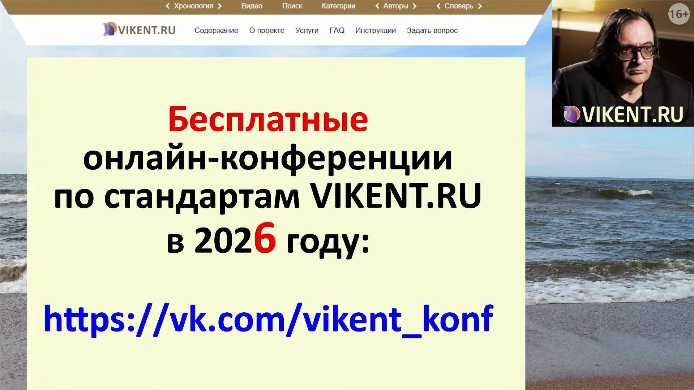

2 ноября на продвинутом, закрытом, продвинутом курсе. 2 ноября - это воскресенье. У нас образовался закрытый курс. То есть у Альшулера секретов не было, а у Викенте секреты есть. Так вот, 2 ноября мы это будем обсуждать. Допускаются туда не все. Допускаются туда не все. Соответственно, вот на этой ноте мы переходим к следующему. К следующему. Давайте.

---

## [00:44:30]

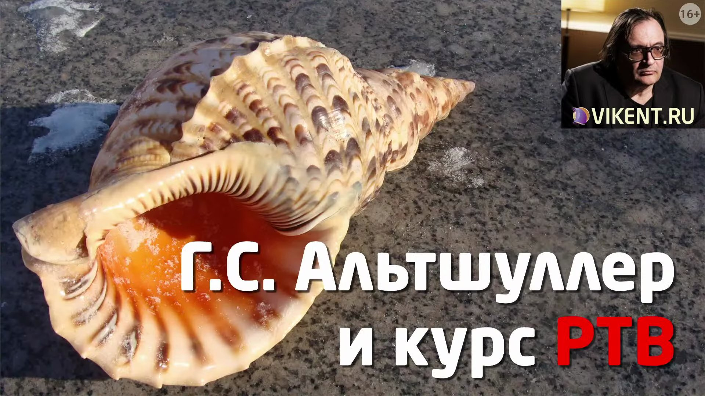

Итак, Генч любил моря. Думаю, что похожие похожая раковина ему понравилось. И курс по развитию РТВ развития творческого воображения. Соответственно, ээ вот эпиграфом не стали выносить на на, ну, чтобы раковину хорошо показать. Есть хороший эпигф. Иногда Альшули, особенно ранний Альшули, либо поздний Альшульев, когда выступал передцами, иногда проводил некоторые цитаты из Гербета Уэлса. Так вот, потом я обосну это более подробно. Есть такая красивая цитата из Грбыта Уэлса, что перед каждым паровозом бежит тень лошади. Перед каждым паровозом бежит тень лошади. Давайте посмотрим, собственно, вопрос. Вопрос и так далее. вопрос и так далее, да. Итак, соответственно, значит, Алексей Геннадьевич занимается графическими решениями. Графическими решениями. Имеет соответствующие доклады и так далее, и так далее.

---

## [00:45:30]

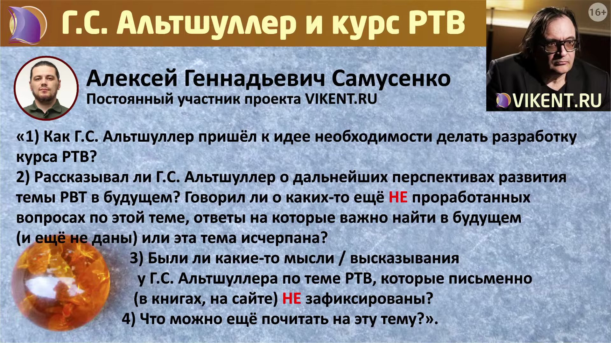

Графические решения, в том числе графические решения для педагогики, для педагогики и так далее. Да. Вот. И вот он прислал Севелосов. Сею вопросов. серии вопросов, серии вопросов, так далее. Вот курс развития творческого воображения, как бы, да, давайте посмотрим, да, если вы не успеваете, я быстро говорю, быстро говорю, ну завтра, завтра это видео стоит пересматривать, стоит.

---

## [00:46:15]

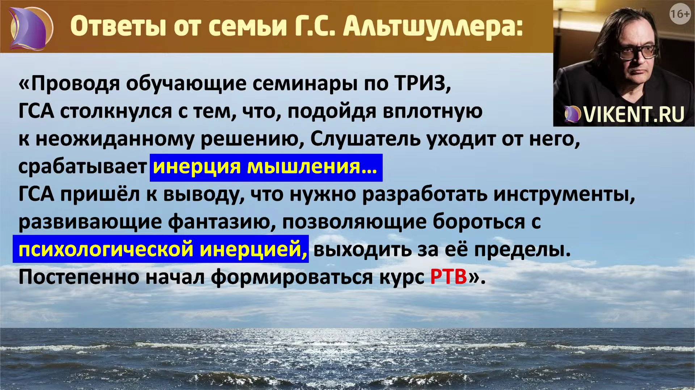

Вот, пожалуйста, ответы семьи Альшу, что, ну, во-первых, и Генрих Сочальшу, и Валентина Николаевна Журавлёва, писателифантасты, они работали в пятьдесятые-шестидесятые годы преимущественно. Далее появился какие-то первые варианты Трис, первые варианты Арис, о который мы сегодня тоже поговорим. И дальше вы видите, ну, неоднократно и письменно, и устно Генрвича Альшу нечто похожее, нечто похожее рассказывал. Более того, у него есть формулировка, она вошла даже в книге, что курс РТВ нужен для, цитирую Альшулера, это не я, это Альшулер, прыгучести мышления. Прыгучести. Ну, соответственно, я бы сказал, наверное, чтобы делать качественный скачок или диалектический скачок, ну, Альшулю называл этого писатель Фантаз, как же прыгучить мышление. Теперь давайте мы посмотрим и вспомним эпигриф Гербета Велса. Сказано было незказано было не Давайте здесь, значит, я даю свой вариант, он немножко отличается. Соответственно, вот вы видите в те годы, соответственно, лично Генрис Ашули, у него есть ряд малоизвестных работ, он развивал, он считал, что фантастика, одно из назначений фантастики, сегодня нам это пригодится, это некоторый такой некий прогноз, некий прогноз, как бы написанный, может быть, в литературной форме, который, может быть, подсказывает, может быть, вдохновляет и так далее, так, может быть, ориентирует и и так далее.

---

## [00:47:30]

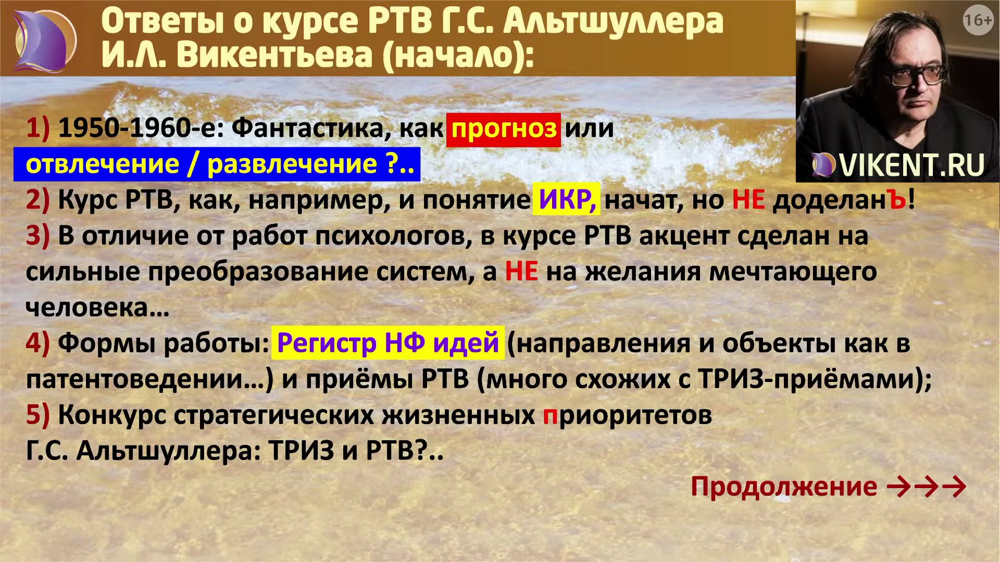

Вот, соответственно, есть другое направление фантастики, соответственно, которое, надо сказать, сейчас победила. Сейчас победила это развлечение, отвлечение. На меня неоднократно выходили какое-то количество людей, писателей фантастов, как бы за годы моего существования. И они фактически всегда зарядчайшим исключением производили, как говорят в быту чрезвычайно странное впечатление. Ну, выходили и выходили. Таких людей как бы много как бы, да. На меня сегодня несколько человек странных весьма выходило. Ну, не фантастов, правда, да. Соответственно, ну, я посетил, значит, по персональному приглашению некоторые несколько лет назад в Рощина, это под Питерем посёлок фестиваля фантастов, я увидел, впервые посетил, что вообще кто занимается такой вот развлечением, отвлечением под видом фантастики, ну, чрезвычайно странные люди. Чрезвычайно странные люди и так далее, и так далее, и так далее, и так далее. То есть, если мы начинаем заниматься фантастикой как развлечением, отвлечением от жёсткой действительности, то, ну, получается чрезвычайно странные люди. Я ничего больше не говорю. Кто хочет, такие фестивали проходят по всей стране, ну, соответственно, как скажем, посетите. Соответственно, другой термин Альшулера, что в том числе, извините, в том числе с помощью фантастики нужно готовить разведчиков будущего, как он это понимал. Соответственно, на свой страх и риск есть некоторый человек, который, значит, делает какой-то прорыв. Причём, соответственно, это прорыв в науке, прорыв в обучении. у него есть рассказы фантастические по этому тему. А потом ленивое человечество потихонечку достигает его уровня. Ну, человек на свой страх и риск уже сделал работу за человечество. Соответственно, это похоже на название первой книги поэта Евтушенко "Разведчики грядущего", который был опубликован в это первая книжка его была в 1952 году. Ну, у Евтушенко тоже, ну, как бы сходные идеи есть. Ну, это, повторяю, мы победили в войне. И вот такое оптимистическое восприятие, что надо прогнозировать и достигать, оно было. Соответственно, пункт второй от меня, кого интересует более подробно, не сегодня, задавайте вопросы. Соответственно, чрезвычайно важно профессиональное понимание, что базовое понятие ИКР, идеальный конечный результат, выделено жёлтым и фиолетовым, соответственно, начат позволяет решать некоторые класса задач, но не все. Есть неоднократные справки Альшулера, то требуется разработать понятие ИКР. Такого я не помню, но, вероятно, нужен задачник, отдельный задачник по идеальному конечному результату. В книгах этих материалов нету. В книгах, соответственно, то же самое курс Артв неоднократно начат, неоднократно начинался Альшулером. И далее он признавался. В книгах этого нет, но на петрозаводских конференциях он об этом публично, многократно говорил, что в начале семидесятых годов возникла развилка. Ему эмоционально, ему, как писателю, очень хотелось заниматься РТВ и заниматься три два гигантских направления. Гигантских направления. И, соответственно, нужно просто было просто правильно расставлять приоритеты. Поэтому курс РТВ многократно передавался под надзором Альшуля разным людям, но какого-то большого толчка, к сожалению, к сожалению, он не получился. Поэтому курс РТВ, что я хотел сказать, это написано в пункте два, курс РТВ не надо воспринимать как нечто сделанное, например, как трис. Это не очень доделанный курс, о чём, соответственно, его, ну, первый разработчик многократно публично, открыто признавался. Вот это чрезвычайно важно понимание. Пункт третий тоже, что, мягко говоря, нигде в книгах нету, но есть в справках, есть при личном общении и так далее, и так далее, что, соответственно, психологи принимают дальше я буду использовать термин Виктора Степановича Чиномыдина, курс РТВ как некий мечталкий человек. В данном случае Альшулер поступал очень жёстко. Он просто-напросто анализировал идеи, ну, желательно известных фантастов и, соответственно, выделял. А, а что позволило сделать? То есть с помощью какого преобразования, ну, скажем так, с помощью какого преобразования, вот в математике количество преобразований ничтожно, то есть плюс-минус ещё несколько действий возведение в степень, да, количество преобразования математики ничтожно. Количество чисел математики, как прикладной математик, могу вам сказать, бесконечно. То есть количество преобразования единично, количество чите очень глубокая мысль, к сожалению, не учит в школе. Так вот, Альшулер собирал эти преобразования и вот это некоторые преобразования есть в ТРИС. Соответственно, есть много похожих на Трис преобразования. Он их и называл приёмы. Есть в курсе РТВ. ТВ, но работа не закончена. Соответственно, формы работы, регистры научно-фантатических идей - это стопка машинописных листов, не полностью заполнены примерно 3. тысячи страниц, который был прерван. Просто на это нужное время, нужно в советские времена была проблема достать фантастическую литературу, где были изложены, соответственно, некоторые идеи. Значит, вот регистр научно-фантастических идей хорош. Если мы думаем о стратегии, не обязательно с ним соглашаться. Просто на если нас интересует транспорт будущего, там просто есть такой раздел: Транспорт будущего. И там на нас вываливается масса идей умных людей. Плюс, соответственно, также также, ну, сбоку есть как бы курс РТВ, который больше построен не на объектах, а на то, что называется приёмы, называется преобразование и так далее, и так далее, и так далее. Вот. Но это, повторяю, не закончено, ну, временно заморожено. Оказалось, что заморожено навсегда. Соответственно, скажем, вот конкурс стратегических жизненных приоритетов. Ну, Альшули был вынужден сделать некоторые выборы, которые он сам как бы сам говорил. Давайте посмотрим следующий слайд. Соответственно, скажем, вот я уже об этом сказал, что ученики не дали какого-то и так далее. Соответственно, то, что происходило на моих глазах, это текст мой, не Альшу, не семьи мой, соответственно, курс РТВ очень тяжело читать.

---

## [00:55:00]

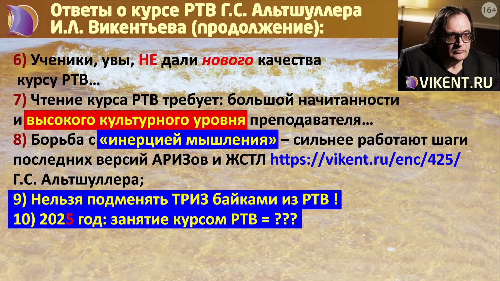

Моё объяснение, если у кого-то есть более лучшее, пожалуйста, указывая фамилию, имя, отчество под этим видео опубликуйте. Первое. Ну, ну, нужно хорошо знать фантастику. Чтобы хорошо знать фантастику, нужно хорошо знать сказки. Чтобы хорошо знать сказки, нужно хорошо знать мифы. То есть, мягко говоря, мягко говоря, нужно быть хорошо начитанным. При этом в ССС, даже если вы очень хотели быть хорошо начитанным, просто книжки нужно было доставать. Ну, доставать, доставать. Кто жил вмес, хорошо понимает, что я сказал. Плюс вещь, которую Альшулир писал в своих поздних произведениях, что нужно повышать свой культурный уровень. Очень часто спрашивают, что это означает. Ну вот, ну примерно это и означает. То есть если преподаватель просто-напросто пересказывает какие-то байки Альшулера по фантастику, аудитория мгновенно чувствует, что это вот, ну, уровень преподавателя. Человек может пересказывать чужие байки, но не более того. То есть чтение курса РТВ сложное, ещё более сложное чтение курса ЖСТЛ, которым мы займёмся 20 6 октября, жизненной стратегии творческой личности, либо другое название м теория развития творческой личности. Это будет, соответственно, следующая консультация в следующее воскресенье. И РТВ и ЖСТ требуют очень высокого культурного уровня, большой начитанности и так далее. Вот, соответственно, пункт восемь. Пункт восемь. То есть изначально, и здесь просвечивает Вес, тот эпигов, который говорил о том, что вот борьба с инерцией мышления, да, действительно, когда мы смотрим какие-то диковатые идеи, смотрим, причём смотрим концентрированно не в литературе, а вот, допустим, в каталоге научно-фантастических идей, который заморожен, который не пополняется, да, может сработать, но исходя из педагогического опыта, могу сказать, что жёстче, жёстче работают и и не требуют высокого уровня. Первые шаги Ариза, первые шаги Ариза, который очень технологично который очень технологичный, который имеет внутренние проверки, тоже деланные Генахом Соучем Альшулером. То есть РТВ гораздо красивее, чем первые шаги Ариза. Но в моём понимании возражения понимаются, возражения понимаются. Лучше работают первые шаги Ариза, а как бы не РТВ. РТВ очень красиво, но требует очень высокого уровня преподавателя, очень высокого, ну, культурного и так далее. Вот, соответственно, вот нельзя подменять байками, байками из РТВ занятия. Соответственно, несколько раз на показанной вам конференции люди хотели взять темы ПРТВ и заложить. Пока я эти темы снимаю, поскольку я научный руководитель всех семи конференций, которые будут в двадцашем году. Объясню свою логику. Она мо можно критиковать, можно дополнять, то есть можно заниматься термином темой РТВ и так далее. Вот как бы продолжать дело Альшу. Соответственно, если вы глава Союза мультфильма, если вы глава крупного издательства, то есть вопрос, на который по крайне получил ответ, то есть соответственно хорошо, вы вы хорошо научили детей, студентов, пенсионеров творческим творческим преобразованием для усиления воображения. Следующий шаг. Ну, следующий шаг снимать видео, писать книги. Дальше, а кто это будет издавать? Кто это будет распространять? кто это будет оплачивать? Вот ехать на фестиваль фантастов, которые занимаются развлечение, отлечениями, то есть без ответа на этот вопрос, а чем будут заниматься ваши ученики? Соответственно, в моём понимании РТВ временно временно, по крайней мере, не стоит заниматься. Ну, у кого есть сильные другие ответы, пожалуйста, давайте под этим видео обсудим. Вдруг я что-то не знаю, не понимаю и прочее, прочее, прочее. Значит, фамилия, имя, отчество и предложение сильных решений. Пожалуйста, давайте посмотрим ещё концовку этого крытыша. Да, пожалуйста. Кого интересует по взрослому, профессионально, так далее, и так далее. Вот, вот открытые сообщества, значит, я их контролирую. Там профессиональные, не любительские, а профессиональные материалы. Профессиональные материалы. И переходим к следующему вопросам.

---

## [00:59:45]

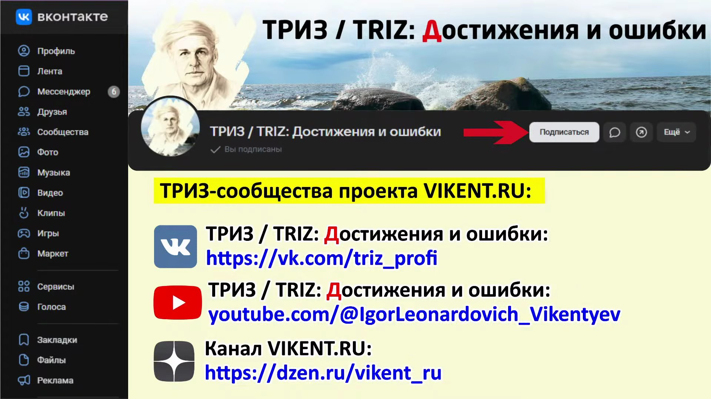

Переходим к следующему вопросу. Соответственно, скажем, моя фотография Шуля и S-бразная кривая. Если кто-то не знает, что такое S-бразная кривая, соответственно, мы сегодня неоднократно показывали вам группу ВКонтакте. Сейчас идёт курс пособразный кривой, очередной, почему курс.

---

## [01:00:00]

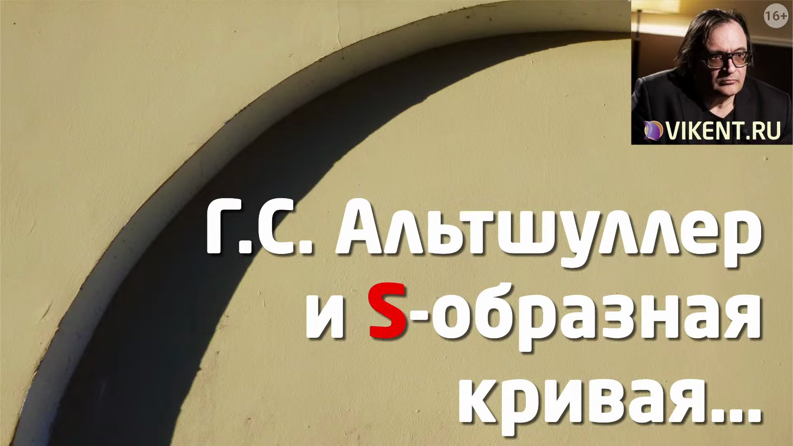

Повторять я это не буду, ну, просто надо смотреть, и это непростые часы смотрения. То есть за несколько вечеров вы сможете это освоить. Сейчас мы осваивать ничего не будем. Давайте переходим к вопросу Кила Сергеевича Гудовича, который не сокращён. Да, который вот вопрос, который не сокращён. Значит, что такое S-бразная кривая? Смотрите, смотрите, смотрите, смотрите сами ищите.

---

## [01:00:30]

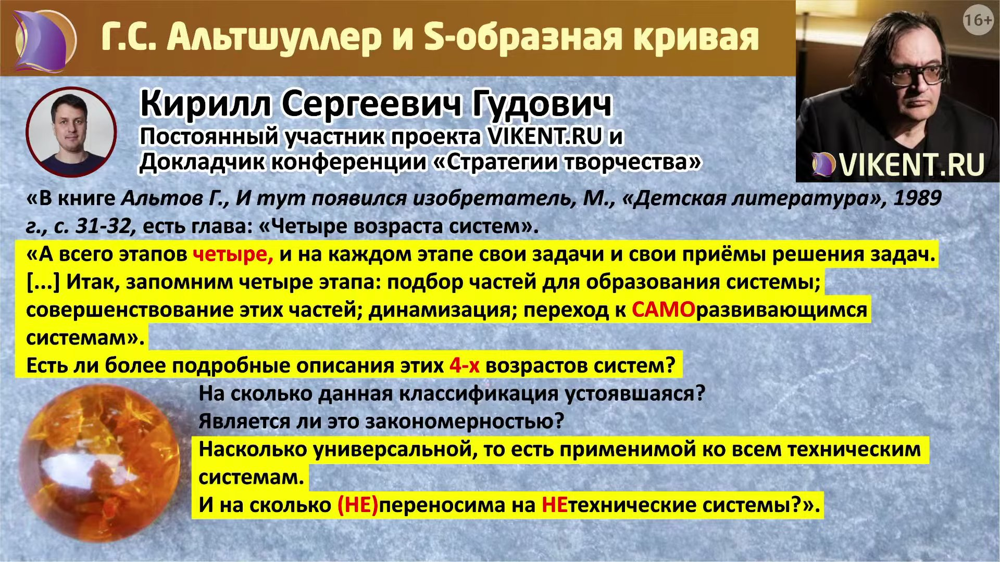

Соответственно, скажем, ну, это некое описание в развитии. Об развитии. И вот, соответственно, вот, соответственно, давайте переходим уже к ответу. Переходим к ответу и так далее. Вот. Соответственно, сообразная кривая, значит, соответственно, в декабре уже скоро декабрь, в декабре в Питере двадцать пятого года были декабристы, соответственно, скажем, а в Европе в начале того века, сейчас я забыл, по-моему, в двадцать шестом году 1800 открыли S-бразную кривую.

---

## [01:01:00]

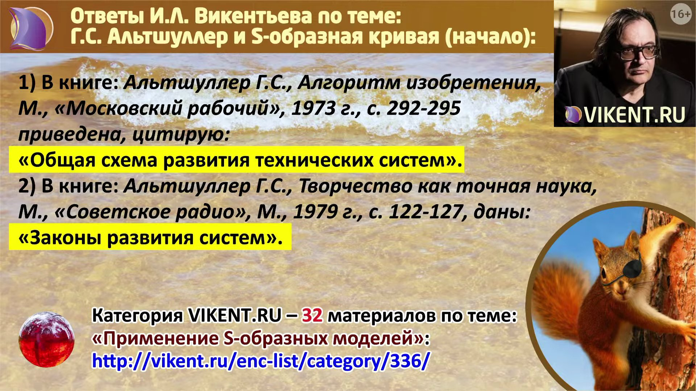

Очень важный момент. Генеч Альшулер не открыл сообразную кривую, поскольку она уже была открыта ещё в начале X века. Это очень важно. Но на похожие вещи в других терминах он вышел. Он вышел самостоятельно, просто изучая развитие техники. Соответственно, есть общая схема развития технических систем. И вы видите, где она опубликована. Это такая таблица, как бы, к сожалению, к сожалению, кто хочет, кто хочет и кто понимает, кто хочет, что понимает, по идее это серия плакатов, но только нужно, ну, у него это сделано исключительно в виде текста, и это трудно весьма усвоить. Весьма усвоить. Поэтому вот то, что первая ссылка, первая жёлтым, соответственно, ну, хорошо бы это сделано. Соответственно, в более поздних версиях, соответственно, он назвал это законы развития систем. Соответственно, после издания книг было большое количество замечаний, в том числе от учеников, что законы - это, например, закон ома, то есть более жёсткий, то есть, то есть скорее для техники это они более вероятностные и правильнее говорить закономерности развития техники. сильных возражений от Альшулера, что закона или закономерности не было, но есть такой термин за РТС, закономерности развития технических систем, которые, соответственно, в ТИС используются. Соответственно, вот вторая книга, вот этот кусок, значит, приведён в бесплатной электронные книги, которые вы сегодня ночью можете скачать, пожалуйста, СШ и так далее. Вот. То есть, соответственно, иногда Альшулер использовал теми сообразная кривая. Он с ним познакомился из литературы, хотя на очень похожие выводы он вышел сам и в других словах. Кто хочет глубоко ознакомиться, кто что делал по поводу сбразных кривых, вы видите ссылку. Сразу скажу, как бы, если вы так раздумчиво читать, возможно, не на один вечер. Ну, на один вечер. Ну, значит, вы молодец, вы очень быстро соображаете. Давайте посмотрим. где можно более подробно почитать почитать ПАТРИС и S-бразной системы. Вот электронная книга, мы её уже сегодня показывали. Рекомендуем. Рекордное количество скачиваний. Ну, для Трис рекордное количество скачиваний и так далее. Давайте идёмте дальше.

---

## [01:03:45]

Соответственно, соответственно видео, которое тоже полезно посмотреть. Видео, которое тоже полезно посмотреть. Вот. Повторяю, а какие-то секреты нас ожидают. Секреты в продвинутой группе 02 ноября с одинати с 11 до ночи. С 11:00 до ночи. Ну, идёмте к следующем.

---

## [01:04:00]

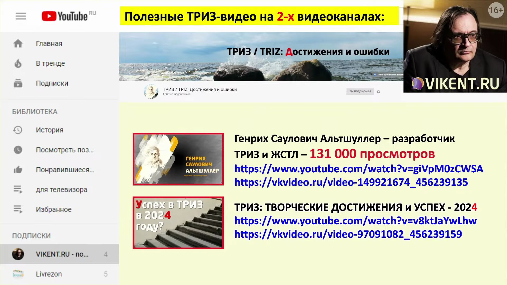

Следующих группе вопросов. Следующий группа вопросов. Итак, вы видите некую трубу, там дальше некое небо. Небо. Серия вопросов по аризам.

---

## [01:04:15]

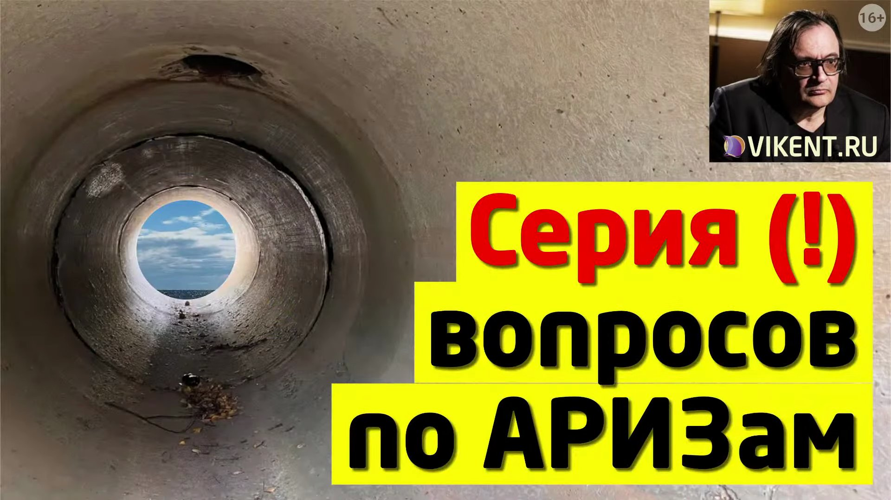

Арис алгоритм решения изобских задач, который очень трудолюбиво, очень тщательно, одно из любимых детищей Генса Чальшулева делался несколько десятилетий. И соответственно вы увидите в конце Ариза обычно есть какой-то номер. Сегодня вы увидите Арис 77 и Арис 85. Ну, точнее заголовки такие. 77 - это год изготовления данной версии. Семьдесят седьмой. Ну, восемьдесят пятый, соответственно, это восемьдесят пятый год. Давайте, соответственно, посмотрим, посмотрим на вопрос. На вопрос. Соответственно, Дмитр Александрович Матвеев, значит, как бы вот нас спрашивают, что действительно есть Арис85.

---

## [01:05:00]

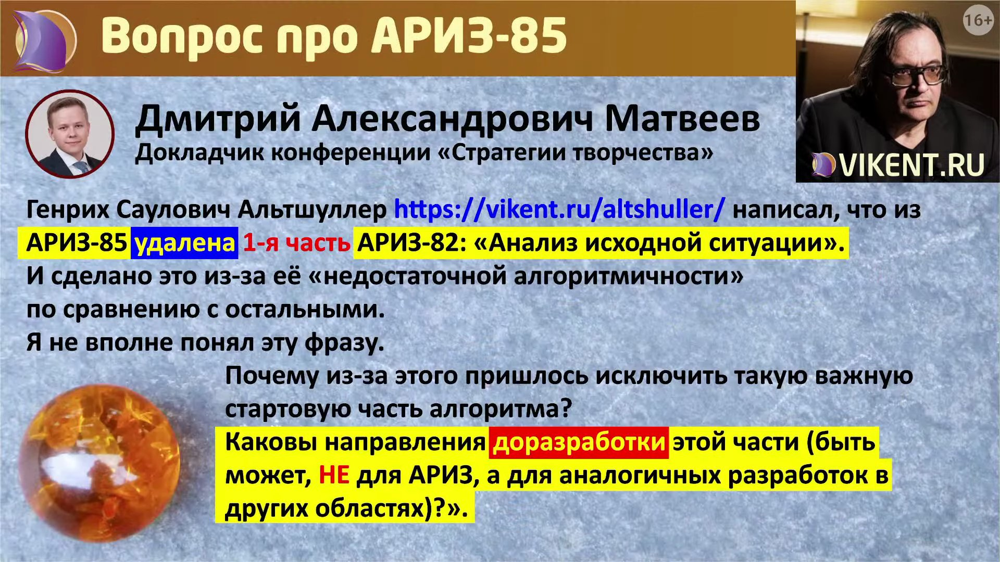

Арис 85, есть Арисы 82, то есть, ну, их много, целый пучок. И, соответственно, некая часть, некая часть она просто была генесомом физически удалена. Физически удалена в Арис. Сейчас вы увидите Арис 77. Я кратко это покомментирую профессионально. Соответственно, она была, она была, соответственно, сейчас будет много слайдов под мы их так прощёлкаем довольно быстро. будет микро микро, соответственно мои комментарии. Ну давайте слайд Арис 77 сего семьдесят седьмого года, который удалён. Соответственно, если внимательно посмотреть Арис 77, то семьдесят седьмому году в шестидесятые, семидесятые годы на русском языке были изданы различные работы американских авторов. И сейчас могу сказать некоторую вещь.

---

## [01:06:00]

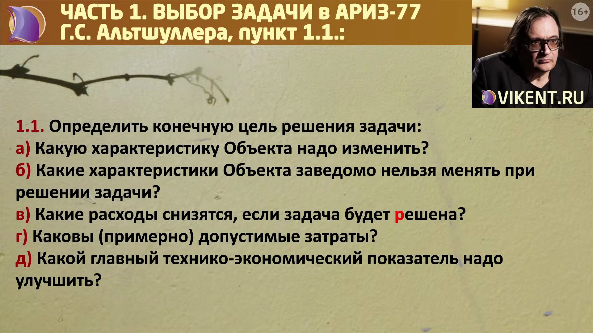

Кто читал много американской литературы переводной или как бы на на языке, он знает, что, соответственно, очень часто пишется, у человека есть одна идея, одна идея, и, соответственно, человек пишет книгу. Вот если у человека есть маленькая заметка, то он пишет статью. Но это такой вот американский принцип, потому что как бы книжка пишется не для того, чтобы научить. Для того, чтобы научить, это книжки Альшули писал. А для того, чтобы продать свои услуги, продать свой курс университету, для этого пишут и так далее. Так вот, как бы вот эти некие американские книги, если их собрать такую стопку, я думаю, что это будет такая метровая скобка стопка изданные там по кибернетике, по системному анализу, системному подходу. Соответственно, как бы Альшурли как бы вышел на сходные вещи. частично он их читал, частично это независимо, проводя семинары, скажем, он как бы собрал нечто вот первую часть вот Ариза 77, который нужен для выбора задачи, выбора, ну, и немножко постановки задачи. Вот если очень внимательно вы сейчас посмотрите эти слайды, они немножко, некоторые из них пересекаются с бизнес-планом. Значит, что я хотел сказать? место метровой метровый метрового столба книг американских, где в каждой есть одна мысль и желание заработать, есть вот несколько наших слайдов, где всё это сведено воедино, ну, неким мастером, неким мастером. Смотрим следующий слайд. Смотрим следующий слайд. Ну, это можно просмотреть, это можно распечатать и так далее. Вот. Вот обратите внимание, здесь системный подход. Системный подход. Соответственно, сверхжелательно сверхжетельно это проиллюстрировать, проиллюстрировать рисунками. Из текста люди из опыта преподавания, я могу сказать, это не берут. Давайте дальше.

---

## [01:08:00]

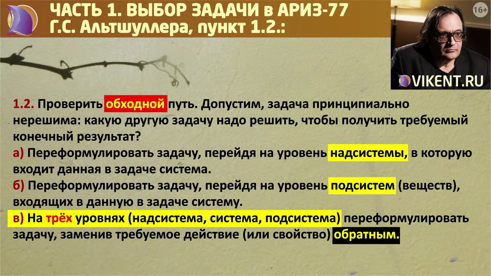

Да, да. Дальше вот слово обходная. Обходная, соответственно, ну, обходная, те, кто называется на курса, это функциональный подход. То есть не, ну, не прямое решение, а какое-то обходной функциональный подход.

---

## [01:08:15]

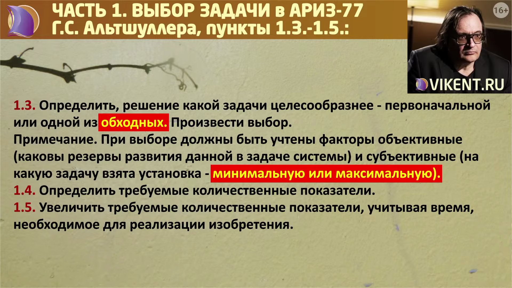

опять-таки какая-то большая задача, амбициозная задача или минимальная. Потом вот минимальные задачи выродилось в ресурс в рамках и арис и трис в ресурсный подход. Ну идёмте дальше. Сейчас надо пролистать. Пролистать соответственно скажем, да? Вот, соответственно, Альшули обнаружил пункт 1.7 обнаружил, что некоторые сочетания сильных приёмов бы иногда работают.

---

## [01:08:45]

И, соответственно, скажем, он и назвал, это было не очень удачное название, этому есть целая история, я её уже рассказывал. Кто хочет, спрашивайте ещё раз. Не очень удачно назвал словом стандарты. То есть стандарты - это такие отборные отборное сочетание приёмов эвриистических, отборное сочетание эвриистик. Соответственно, вот здесь вот как бы уже есть отсылка на первые стандарты. Всего их там более 70. Ну давайте дальше. Давайте дальше. Да. Да. Обратные обратные задачи это инверсия. Это инверсия. Значит, по поводу патентной информации, повторяю, это отдельный курс, как работать с патентной информацией.

---

## [01:09:30]

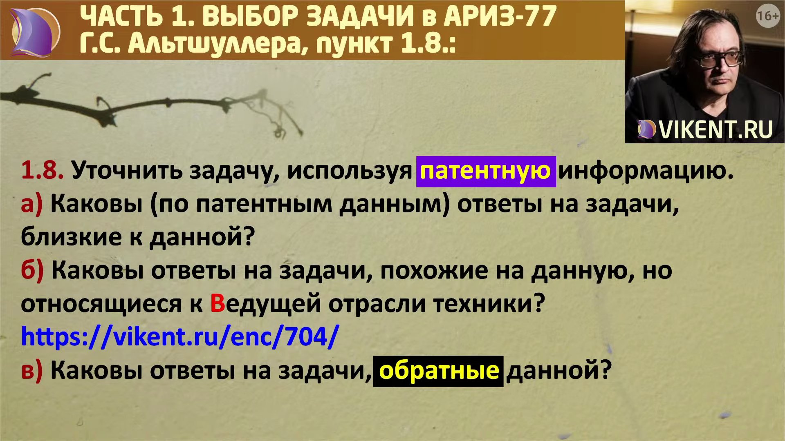

То есть, насколько я знаю, систематически продирал бюллетень изобретений, которые выходят еженедельно в истории три истока Игорь Леонардович Викентьев. Соответственно, вот, то есть это пункт хороший, абсолютно правильный, но, во-первых, нужно, это адский труд. Вот, во-первых. Во-вторых, нужно иметь поставленные навыки, продирать еженедельно довольно толстый момент и так далее, и так далее, и так далее, и так далее, и так далее. Вот, соответственно, соответственно, давайте и последний момент. Мы тут порывали цитирование, соответственно, повали цитирование, соответственно, и последнее. Покачать ситуацию. Значит, сходная вещь, сходные вещи есть у как бы Френьса Бэкона и Джона Стюарта Миля.

---

## [01:10:15]

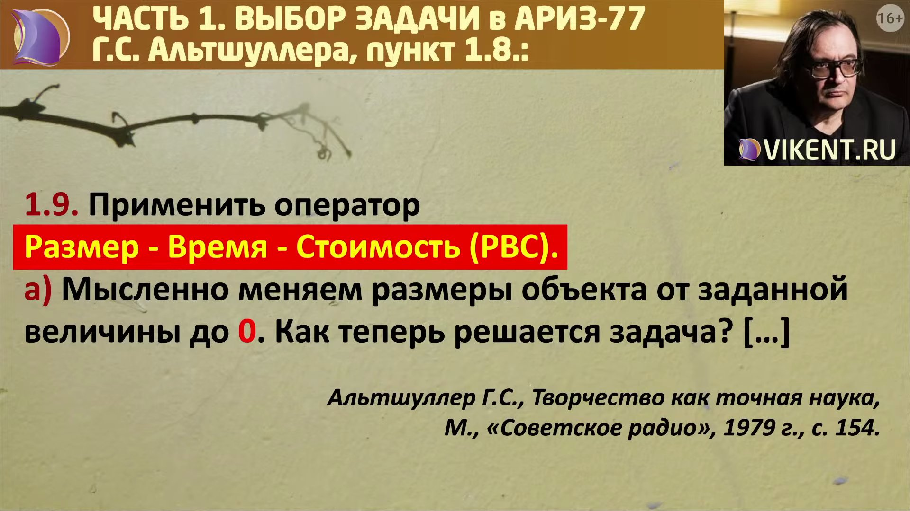

То есть, когда мы берём некоторые показатели, в принципе, некоторые такие показатели есть и в курсе развития творческого образния не обязательно размер время,стоимость. Ну, например, блеск. Блеск, ну, способ отражения. То есть есть полное поглощение, есть, наоборот, стопроцентное отражение в оптике, да. Так вот, некоторые параметры покачать. Мы указали один пункт, чтобы не занимать большое место. Соответственно, когда у нас просто-напросто размер как бы фактически как бы ноль и, соответственно, устремляется, как говорится, математики к бесконечности и, соответственно, блестящий тренажёр. Соответственно, соответственно, почему вот эта часть была отсечена? Значит, мой опыт преподавания, в данном случае я говорю свой опыт преподавания, как бы он заключается в том, что если человек, ну, просто обладает низкой культурой, то есть какой-то обычные традиционный серый вот серые траблшуры, что-то в этом роде, да, то, соответственно, вот на этой стадии человек начинает подгонять, подгонять свой ответ, значит, вот, ну, с помощью вот этой части, соответственно, риск сделан не для того, чтобы чтобы подгонять. Далее вот так называемая идёт вторая часть, вторая часть Ариза, которая была сделана со встроенными проверками и гораздо и гораздо, ну, хорошо. Сам Альшулер объяснял это очень интеллигентно, как Дмитрий Александрович Матвеев сказал, что просто-напросто первая часть недостаточно алгоритмична. Да, она действительно недостаточно алгоритмичная. Если работает культурный человек, на каждом этапе возникает грозд идеи. Некоторые некоторые пункты требуют, например, ну, например, недели. Недели - это очень мало для патентных исследований. Вообще, как бы для патентных исследований требуются месяцы. То есть патентные исследования - это поиск по патентам разных стран мира. То есть японские патенты на японском языке, иероглифы, там на, естественно, на английском, на немецком, на французском, ну и так далее, и так далее, и так далее, и так далее. Вот поэтому, соответственно, инструмент очень хороший. Вот эта часть, да, его ждёт большое будущее, но его нужно делать, ну, класть на машину большое количество примеров. Естественно, нужен задачник. задачник. Если это будет сделано качественно, это такой нормальный результат мирового опыта. Ну и несколько лет жизни, то есть за за вечер это не составить, как бы, да, такая такой выбор задачи, выбор задачи стоит сделать, стоит сделать. А американские книжки в метр или в полтора мра ну читать не стоит. Соответственно, немножко подробнее поговорим об этом 2 ноября. Но не для всех. Не для всех. Идёмте дальше. Следующий вопрос. Соответственно, обратите внимание, арис, последний Арис, к которому имел отношение сам Генрих Сучай Шулею. В было три модификации в восемьдесят пятом году А, Б и В. Последний в. Ну, давайте посмотрим вопрос.

---

## [01:13:30]

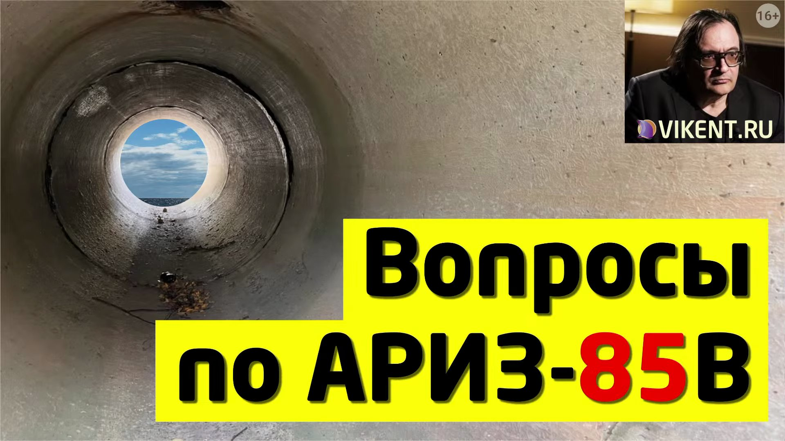

Последний вопрос от руководительницы конференции, первой конференции 2026 года. ответственно сразу чтение Калугины Калугины, да, соответственно, скажем, соответственно вот жабён относится ко второму пункту, то, соответственно, есть некоторые культура цитирования. Жабён - это символ ошибок.

---

## [01:13:45]

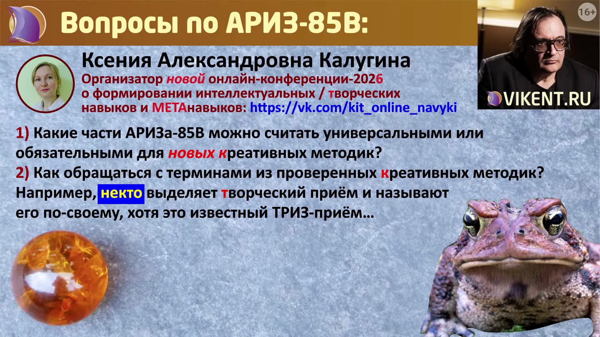

Соответственно, значит, сам Генр Сауч это было устно, в книгах этого не было, это было в справках, это было устно. на конференциях говорил о двух основных мотивах, почему люди не ссылаются на 30. Потому что уже восемидесятым годам его книжки были изданы большими тиражами, то есть там более 100.000, там хорошо было 100. 000. И, соответственно, если человек говорит что-то про изобретательство, про творчество и нет ссылки потрис, значит, есть два мотива, как сказали бы криминалисты. Первый мотив не знает, то есть то есть серость, то есть серость. Второй ещё хуже, то есть знает и не даёт ссылку, потому что боится конкуренции. Могу сказать, что вот это и сейчас продолжается. Масса людей, кто крутится вокруг Трис, боятся давать точные ссылки на первые источники, потому что первые источники, хотя и несколько десятилетий, но тем не менее тем не менее м сильнее, чем те бредни, которые вы можете услышать там на Ютубе, на, значит, ВКонтакте и так далее, и так далее, под вывеской трис, которую читают люди, не поврешавшие 200 учебных задач. 200 учебных задач и прочее, да. Так вот, давайте ответим на первый вопрос, потому что обён относится ко второму пункту. Шуль его прокомментировал сам. Давайте следующий слайд. Следующий слайд. Так далее. Вот хорошо. Идём большом. Итак, вот некая структура Ариса 85 с птичьего полёта. Опять-таки вылез бельчон.

---

## [01:15:30]

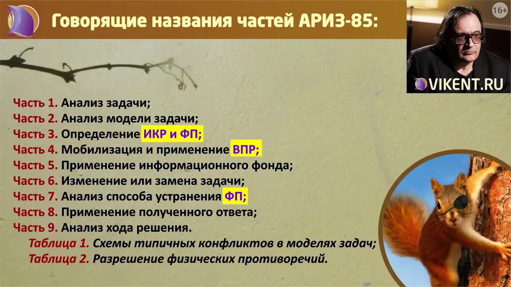

Тут всё написано. Ну вот часть ноль, часть ноль. Выбор задачи было в предыдущем разделе. ИКР и ФП - это идеальный конечный результат. и физическое противоречие. Впр вещественно-полевые ресурсы, соответственно, как бы ФП противоречие и так далее. Вот, соответственно, на мой взгляд, то есть я не вижу каких-то методик, например, там делание социальных изобретений, о чём речь впереди и так далее, и так далее. Не сегодня, а 26 октября, которая будет сильно отличаться от этой схемы. Кроме того, есть два сильных приложения, но их нужно просто выучить наизусть. Где их взять? Ну, мы сейчас вам как бы мы вам уже показывали электронную книгу. Ну, надо скачать бесплатную электронную книгу и выучить наизусть, если вы хотите работать. Вообще, как бы, в Аризе есть изумительная логика. Единственное ограничение, которое я говорю от себя, соответственно, о том, что всё-таки Арис построен на железных задачах. То есть, если у вас задачи имеют выраженные объёмные обратные связи, извините, если у вас как бы ваша система имеет сети решения, разноуровные сети, если ваш как бы объект имеет различные нелинейности и так далее, и так далее, вот то, соответственно, как бы нужны новые инструменты. Ещё ещё раз. Арист всё-таки построен на таких электротехнических примерах, поэтому было много попыток запихивать ариск куда угодно, как бы, и пытаться там сделать, но как бы это как бы не очень не очень, ну, это, мягко говоря, не очень пошло. Не очень пошло, соответственно. Ну, идёмте дальше.

---

## [01:17:30]

Вот полезные ресурсы, на которых можно повысить в течение года свой уровень. То есть, если позанимаетесь на год, то, соответственно, начнёте что-то понимать приличное, потому что сейчас фактически нет ни вуза, ни академии, ни курсов, где вы можете качественно освоить ТРИС и как бы, а, особенно его развитие. Разви развитие. Идёмте дальше. Идёмте, следующий слайд. Соответственно, два тяжёлых видео, тяжёлых видео, требующих пересмотра и конспектирования.

---

## [01:18:00]

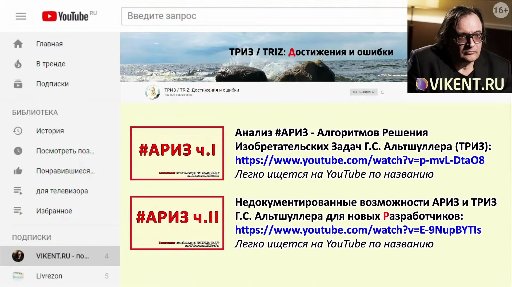

Есть ещё третья часть. Она Третья часть не для всех, она закрыта. Третья часть, она не для всех закрыта. Вот кого интересует Арис, то есть и данные части прочитаны не по Арис, как реша отдач по Аризу. То есть этим я прекратил заниматься в девяностых годах и так далее. Это как создавать свои методики, учитывая сильные идеи Арис, как переносить идеи Арис на свои методики. Сразу говорю, это тяжёлое, ну, надо смотреть, надо советоваться и прочее, прочее, прочее, прочее. Ну, давайте идёмте дальше. Давайте идёмте дальше. Идём. Соответственно, вот есть втрис, это причём сама Шуль разделял, есть задачи на изменение, и большинство патентов патентуется на изменение чего-то, чего-то, соответственно, ну, например, транспортного средства.

---

## [01:19:00]

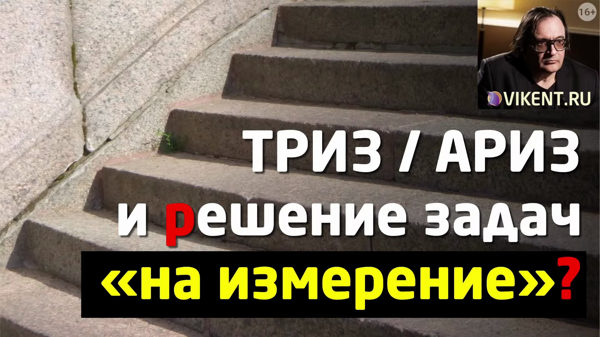

И есть задачи, которые образуют м отдельный совершенно класс. Он и в патентовидении выделяется, и альшулевы дела задачи на измерение. ну, как бы говорящее название и так далее. Вот, соответственно, как бы здесь большая переписка моя личная с Гехачаль Шулером. Более того, часть курса этого сделана, часть даже опробована и так далее. Вот, соответственно, давайте посмотрим вопрос, слоны вопрос. Значит, сегодня консультация, а не лекция, соответственно. Итак, вопрос нашего докладчика, соответственно, вот так далее.

---

## [01:19:45]

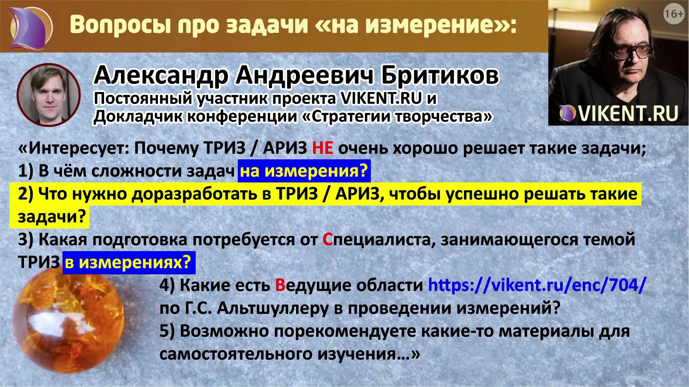

Вот как бы, да, соответственно, параллельно напоминую, параллельно напоминаю, извиняюсь, параллельно напоминаю средневековый спойд, сколько чертей может уместиться на кончики иглы, то есть задача на измерение средневековые. Соответственно, постараюсь ответить. Сейчас будет первый краткий ответ, потом гораздо более несколько более детально. Соответственно, вот очень интересна история Геога Ома, который, соответственно, в 1826 год то же самое, как кто-то открывал в Европе сообразную кривую, а Георг Ом сделал два прорыва, которые не проходятся в школе. На самом деле он больше прорывов сделал. Значит, первое, он придумал такие единицы, как ток напряжение сопротивления и свевёл в очень простую форму, да, электрических цепей. На всякий случай для электриков, напоминаю, есть закон Ома и для магнитных цепей. Так вот, соответственно, задачи на измерение, как бы они очень похожи на решение научных задач. И, соответственно, как бы они имеют некую свою специфику, соответственно, как бы, то есть просто впрямую, как бы я сегодня не рассказываю впрямую тризовцы профессиональные, не Альшулер, с Альшулером я не взаимодействовал, неоднократно в моём присутствии сыпались как бы на решение задач именно на измерение. То есть они примыкают к научным задачам, к научным. И частично это разработано, но это такой курс, который, значит, стоит делать. Стоит делать. Соответственно, ээ само мнение геноксовучальшу есть соответствующая переписка. Я могу предъявить, что называется и так далее. Вот он считал, что ветка ветку включать ветку измерения в арис для исследования не нужно. Арис и так большой, гигантский. Это как бы некая отдельная разработка. Ну, я полностью согласен с шефом. Полностью согласен с шефом и так далее. Давайте посмотрим, посмотрим книжку. Значи очень небольшая, очень хорошая книжка, соответственно, написана Альшулевым в надежде, что кто-то возьмёт и будет как бы, да, она немножко стоит денег, деньги перечисляются семье, поэтому смело покупаем, смело покупаем, смело пользуемся.

---

## [01:22:00]

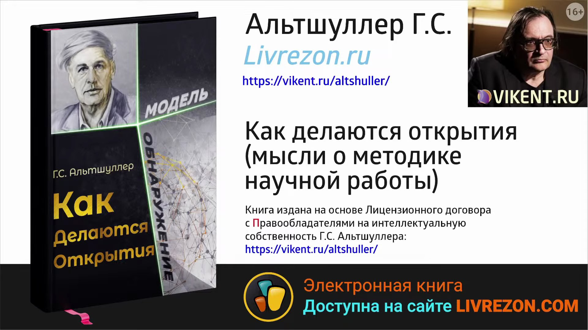

очень небольшая книжка в электронном виде и так далее. Вот, соответственно, ну, повторяю, ну вот требуется задачник, соответственно, м здесь убрано. Убрано, значит, кто хочет этим заняться, мой совет написать мне. И первое, что, ну, первое, что скачать эту книжку, оплатив. Второе, посмотреть на портале Викенд пять канонов Джона Стюарта Милля. Миль 2Л. Если не расслышали, ну, пишите по почте, пишите лучше ВКонтакте, это быстрее. Почту читаю не я. Всю почту читаю на всякий случай не я. Мне её пересылают, а ВКонтакте читаю я. Поэтому имеет смысл. Поэтому как бы и Альшую, и я, значит, ну я, точнее, сле за Альшулем считаю, что это отдельная ветка, которая вот Альшулер сделал, что мог. Ну, дальше надо подхватывать. У меня какие-то разработки есть по этой части, но я повторяю, это некое направление на всю жизнь. Некое направление, да, это мировой уровень на всякий случай, мировой уровень и так далее. Вот как бы, да. Вот, соответственно, идёмте дальше. Вот что стоит на что вот чем что стоит подписаться, что стоит изучать, где стоит смотреть некие профессиональные, качественные материалы.

---

## [01:23:30]

А мы переходим к очень частотному вопросу, который мы вынесли. Соответственно, вот, как вы видите, лестница. А было ли какие-то ошибки у Альшулера?

---

## [01:23:45]

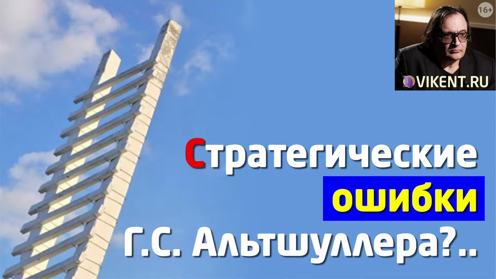

То есть как только начинаешь про Альшулера рассказываю, соответственно, из зала, неважно, очно или онлайн, кто-то обязательно спросит: "А какие всё-таки были всё-таки какие были ошибки у гения? " Ну, понятен, понятен человеческий интерес. Давайте давайте спокойно спокойно это дело разберём. Давайте посмотрим. Давайте посмотрим. Давайте следующий слайд. И вот Роман Стефанович Флареску. В данном случае он просто прислал сходный вопрос. Роман Стефанович Флареску, короче, занимается криз несколько десятилетий, поэтому как бы он не новичок, он там много чего знает и так далее, и так далее, и так далее. Вот как бы, да? А вот так далее. Вот, да.

---

## [01:24:15]

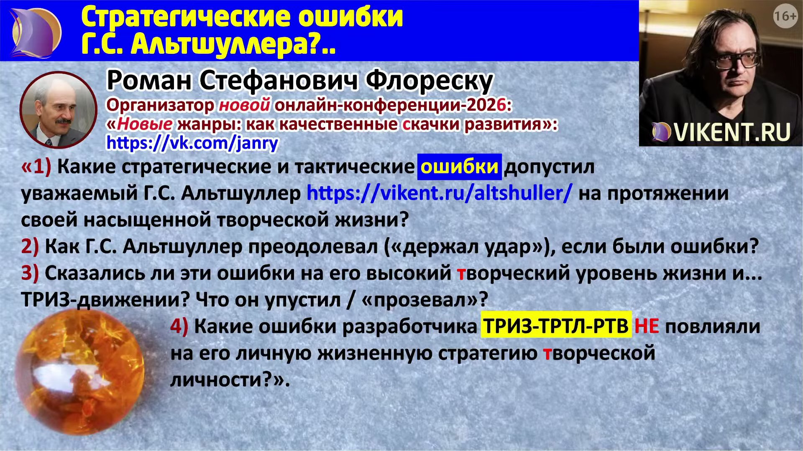

Соответственно, я надеюсь, что вы почитали, почитали, соответственно. Короче, повторяю, вопрос очень типовой. Очень вопрос очень тивой. Соответственно, должен напомнить, должен напомнить, что это вот есть такая книжка, она тоже стоит некоторых денег.

---

## [01:24:45]

И, соответственно, скажем, есть более поздний вариант Альшулера. более поздний вариант от Джули, где он, естественно, думал, думал об ошибках и достижениях и в варианте жизненной стратегии творческой личности, которая содержит 88 ходов и и соответственно каждый ход сделан очень хитро творческой личности, начиная с детства и до после смерти. Я об этом рассказывал, поэтому кто считает нужным, ну, может запросить получить ссылку. Соответственно, есть слабый ход, такой традиционный обывательский ход, есть сильный ход и есть контраигра, есть возражение внешних обстоятельств. Внешние обстоятельства - это и семья, и начальство, и власти, и так далее, и так далее. Так вот, соответственно, таких ходов жизненной стратегии творческой личности, которая составлена на основе изучения биографии выдающихся людей, м Альшулю нравилось слово еритик. Соответственно, редакторам оно не нравилось, соответственно, и поэтому есть книжка "Как стать гением?" В варианте Альшулера: "Как стать ретиком? " Вот таких слабых ходов, таких слабых ходов, которые вынужденно делают школьники или взрослые, соответственно, их там более 88, потому что иногда эти слабые ходы ветвятся. Ветвятся. Так вот, допустим, давайте посмотрим ответ семьи на этот на похожий вопрос. На похожий вопрос, как бы, да. Вот, соответственно, скажем, м Альшули уже болен. Альшу в Баку. И вот достают ученики. Ну вот ученики.

---

## [01:26:30]

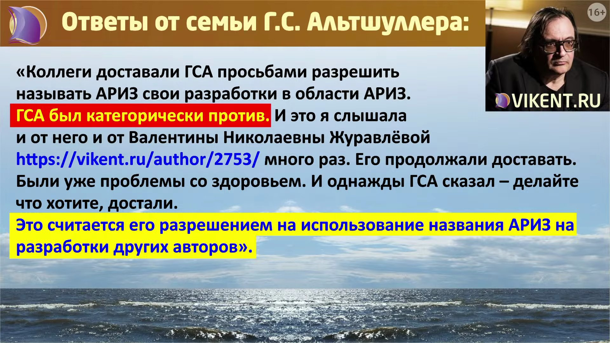

Понятно, что когда ученик пишет что-то от себя, это стоимостью равняется ноль. Когда есть бренд Трис Арис, то этот бренд раньше был приличный. Сейчас, к сожалению, ученики его уронили ниже некуда. К сожалению, ниже некули, но это проблема учеников и так далее, так далее, так далее, и так далее. Вот как бы, да. Соответственно, по этому поводу об учениках хорошо сказал Шекспир. Давайте посмотрим. Это об учениках. Это об учениках. Это об учениках и так далее. Вот как бы, да.

---

## [01:27:15]

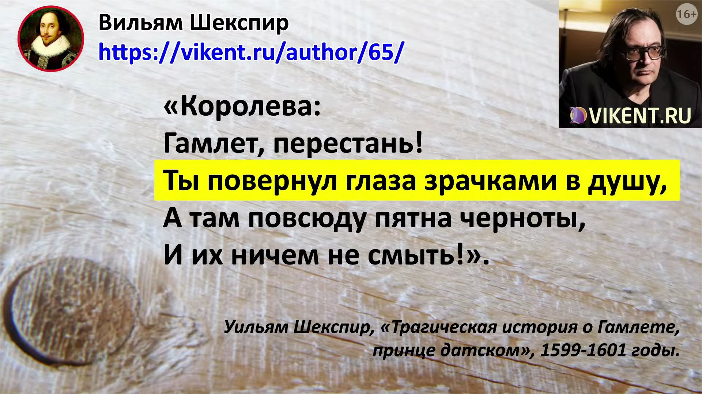

Вот давайте дальше посмотрим некоторую схему из теории критики. Соответственно, давайте посмотрим. Так вот, соответственно, нам это понадобится. Я присутствовал, когда лично присутствовал, когда Геннасовича Альшулер, один человек из города Иванова, сразу скажу, я не помню фамилию, никакого отношения к нашим модераторам, которые сейчас с нами работают из города Иванова и к издательству Левых зон, этот человек не имеет.

---

## [01:27:30]

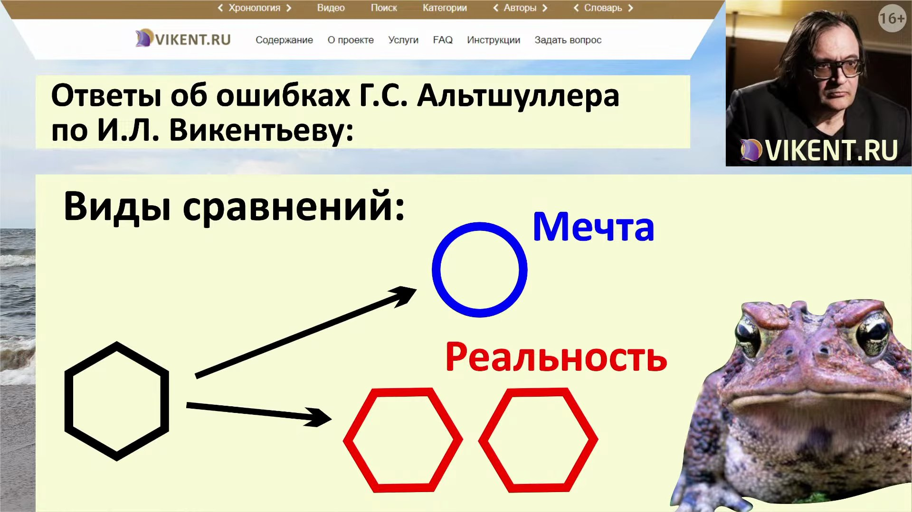

Ну, к сожалению, я не запомнил его фамилию. требовал, как ни странно, требовал от Альшура сделать, цитирую, текстильный трис с тем, чтобы ему продвинуться по работе. Так вот, есть некая болезненная вещь вот в некоторые, ну, гзах теории критики, которую мы разрабатываем, что, соответственно, масса людей, они хотят они сравнивают свои хотелки, мечталки, то, что говорил Чериномы с некоторой своей мечтой. А давайте-ка Геннасовоч Альшулю вы за недельку до второго быстренько так разработаете мне текстильный трис. Значит, почему текстильный трис бред? Как раз исследования Альшулера показывают, что если мы берём какую-то одну область, то там есть какие-то решения. И даже текстильный трис можно сделать, но он будет слаб, потому что как раз очень сильные прорывы заключаются один из механизмов в том, что переносятся решение, например, из авиации в текстиль или из космоса в текстиль, ну или, наоборот, из текстиля в космос. Такое есть, но для этого нужно, ну, иметь какую-то очень неслабую базу патентов, уметь работать. Но люди так устроены, что они, соответственно, выдают за это свои мечталки. Соответственно, нужно сравнивать, например, достижения того же Генсаучаль Шулера с академиями наук. Их много. А что для изобретателей сделали академии наук СССР? А что сделал МГУ? А что сделал Ленинградский университет? Это уже сравнение с реальностью. Это некое опускание человека на землю. Опускание человека. Каждый раз в Петрозаводске и ещё раз повторяю, Альшули очень продуманный человек. Если он что-то на съезде тризовцев, на конференции, извините, рассказывал Петро Лазаводский, это было не зря. Некоторые вещи было, некоторые были, ну, в машинописных копиях, но не все. Соответственно, я помню очень хорошо два рассказа Альшулера. Опять-таки, я помню, что я рассказываю про ошибках Альшулера. Мне хотелось бы обозначить уровень учеников. Первый момент, когда он рассказывал, что получил письмо, которое написан, что требую прислать мне книжки по ТРИС с тем, чтобы я там освоил ТРИС. Он рассказывал, что в этот момент как бы, ну, судя по датам написания письма, письмо было отправлено из Севастополя. Он где-то недалеко пролетал с семинара, и я помню эту цифру, он имел в кармане 2 руб. 2 руб. То есть, ну, сниму тризвис. Тризвес требует, естественно, бесплатно прислать книжки по три с тем, чтобы он этот триз освоил. Ну, уровень тризов. Дальше я ухожу в многоточию. Второй момент интересней. Лично я практически никогда не использовал, хотя такую штуку нужно возобновить, наверное. Соответственно, другой асказ Альшу через какое-то количество лет тоже в Петрозаводске на конференции тызовсов, когда он зачитал, к сожалению, фамилию не помню, но из себе, из себе, значит, написано в хамском, в хамском стиле, что вы тормозите, тормозите, соответственно, преподавание курса ТИС на нашем вонючем заводе. Ну, слово вонючие, как вы догадываетесь, это от меня. Немедленно вышлите мне плакаты потрис. Но сейчас как бы человек получает там PDF-файл, JPEG файл, он идёт за свои деньги, распечатывает, соответственно, так далее. Вот тогда, соответственно, плакаты изготавливались вручную, и это было, ну, стоило каких-то денег. Ну и, соответственно, люди воспринимали Геннавича Альшулера как минимум какой-то такой институт, который, соответственно, по первому хамскому требованию в далёкую Сибирь, значит, там по поводу там денег, это как-то вот у ТИЗСОв такая тема сложная, сложная у них тема, сложная тема вообще. Оплатить услуги семьи, например, оплатить оплатить права Альшулера, это сложно. Сложно. не давим здесь, соответственно, вылиз вылез жабён. Так вот, давайте посмотрим. Перехожу к ошибкам. Поэтому повторяю, нужно очень хорошо понимать уровень тызовцев. Итак, при живом альшуле, при живом альшуле, соответственно, у многих учеников, причём это в том числе высказывалось ему в глаза, вызывало возражение его увлечение фиполиями.

---

## [01:32:15]

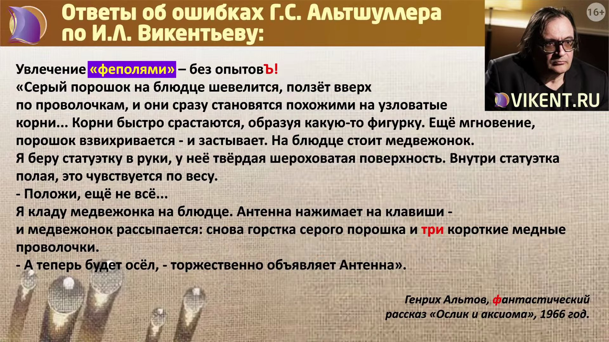

то, что получило название феполие, то есть феоромагнитный порошок и магнитное поле, либо феомагнитная жидкость и, соответственно, так далее. Вот, соответственно, я сегодня об этом говорю. Альшулер сам писал, написал очень хороший фантастический рассказ, вот такой очень вдохновляющий, то есть, на мой взгляд, как бы его полезно включить в школьную программу. Фантастику он писал под псевдонимом Генных Альдов. альтов, генных альтов вы видите шестьдесят шестого года. И, соответственно, там описана некая идея то, что вся фантастика Ишуля - это некоторые такие изобретательские, открывательские идеи. Ему эта идея чрезвычайно нравилась. Так вот, надо сказать, что до Ашули как бы Майкл Фародей, соответственно, м как бы понял, что, допустим, электромагнитное поле гораздо сложнее, и вот так вот не получится. К сожалению, соответственно, один из знакомых наших семьи, известный изобретатель, я я в Питере живу, Георгий Ильевич Баббат, у него есть книжки по электромагнитному полю и так далее. Вот он тоже писал, что как бы это очень сложно. И я, как практикующий изобретатель, профессиональный, работающий на заказ, в том числе, могу сказать, что человек действительно очень любил, очень любил как бы вот свою такую идею. И, соответственно, вот решение с помощью там фермагнитного магнитного магнитного поля и феромагнитной жидкости или там железных опилок, они, ну, мягко говоря, были преувеличены. Такие решения есть и так далее, и так далее, и так далее. Вот. То есть, соответственно, какой здесь можно сделать вывод, что, конечно, нужно было ставить эксперименты. Используя тот же самый курс РТВ, о котором сегодня спрашивалось, совершенно понятно, что нужно просто использовать не только железные опилки, а, например, шарики. Можно использовать смесь шариков там разной степени магнитности. Ну, не буду грустить аз термина. Можно использовать вообще не магнитные шайки и магнитные шайки. Можно использовать различные смеси тел Платона. можно гонять по по оператору РВС, который мы сегодня показывали. Слабое поле, очень сильное поле, ну и так далее, и так далее, и так далее. Кого интересует на закрытом, на продвинутом курсе, соответственно, спрашивайте, но я расскажу более подробно. То есть, соответственно, то есть без экспериментов, без экспериментов рекомендация вот использовать магнитное поле, феромагнитный порошок немножко висит в воздухе. Даже у гениального Гена Сауловича Альшу, даже у гениального гениального человека. Давайте посмотрим на следующую ошибку, которую я тоже делал. Соответственно, вещь, которая в моём присутствии ни разу Альшую не говорилась, может быть, говорилась, но я не знаю. Кто знает, напишите.

---

## [01:35:30]

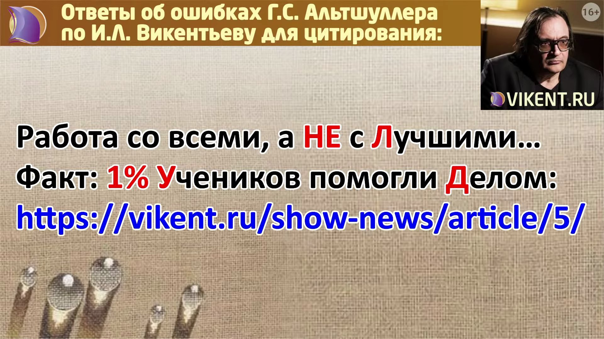

Соответственно, он человек был воспитанный, культурный и пытался работать со всеми. Повторяю ещё раз, 200 школ Трис, отсутствие интернета, отсутствие социальных сетей, Альшулер и семья, помогающая ему, извела пять машинок на паперосной бумаге, размножающие новые материалы. Ну, так далее. Вот. И за свесни Альшули пытался работать с каждым человеком вот высылать книги, ну, буквально каждому человеку, который ему написал в Баку на проспект Нефтепереработчиков и так далее. Вот. Ну, соответственно, произошли некоторые события. Некоторые события. Вы можете посмотреть их посудки. Альшули уже, ну, скажем так, прекратил своё земное существование и, соответственно, ушёл в пост эншпиль. И, собственно, Валентина Николаевна Журавлёва впервые, впервые жена и помощник обратилась к тызовцам с просьбой не делать одну глупость, которую вы можете почитать по ссылке. Ею было разслано 324 письма. Соответственно, 1% учеников, о чём вы можете прочитать, 1% учеников, несоотношение 8020. А в творческих в творческих дисциплинах это соотношение вырождается в 101 100 и1 10 и1 не 8020 как Вильфреда поэта ну и так далее да так вот 1% помогли делом то есть к вопросу о качестве учеников которые соответственно к сожалению к сожалению не ценят к сожалению не ценит то что сделал альшулев и в нынешние времена Да, мягко говоря, к сожалению, не хочет ценить то, что сделала семья, потому что вот просто-напросто нужно было 200 школ делать распечатки, и семья работала на это. Никакого института, никакого института у Альшура, который печатает плакаты и так далее, и так далее, вот не было. Первый инвестор Трис Валентина Николаевна Журавлёва. Спрашивайте, спрашивайте, отвечаю, отвечаю. Поэтому повторяю, у гения были ошибки. Соответственно, в ЖСТЛ таких ошибок шагов восемьдесят, а ошибок ещё больше. Это просто, ну, слабые обывательские ходы. Соответственно, жестл тоже не читается за один вечер. Читать нужно чрезвычайно внимательно и думать, соответственно, как бы вообще зачем я живу. В ЖТЛ таких ответов большое количество. А мы сегодня очень быстро идём, то есть почти в полтора часа укладываемся. Мы тихонечко переходим к окончанию. Давайте финал. Соответственно, вот приличные ресурсы, на которые рекомендую подписаться. Всё открыто, пожалуйста. И идём дальше. Идём дальше. Идём дальше.

---

## [01:38:30]

Соответственно, Нива. Фотография Александра Олеговича Романова на Ниве. Вот. А Шулю, кстати, Питер очень нравился. Питер более точно осенний Питер более точно он примнеет говорю.

---

## [01:38:45]

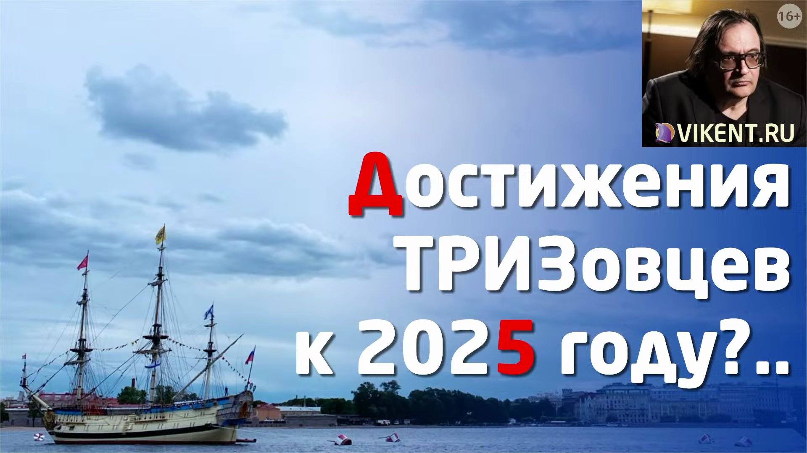

Ну, идёмте дальше. Есть типовой очень неприятный вопрос. В данном случае его озвучил Андрей Валевич Толмачёв.

---

## [01:39:00]

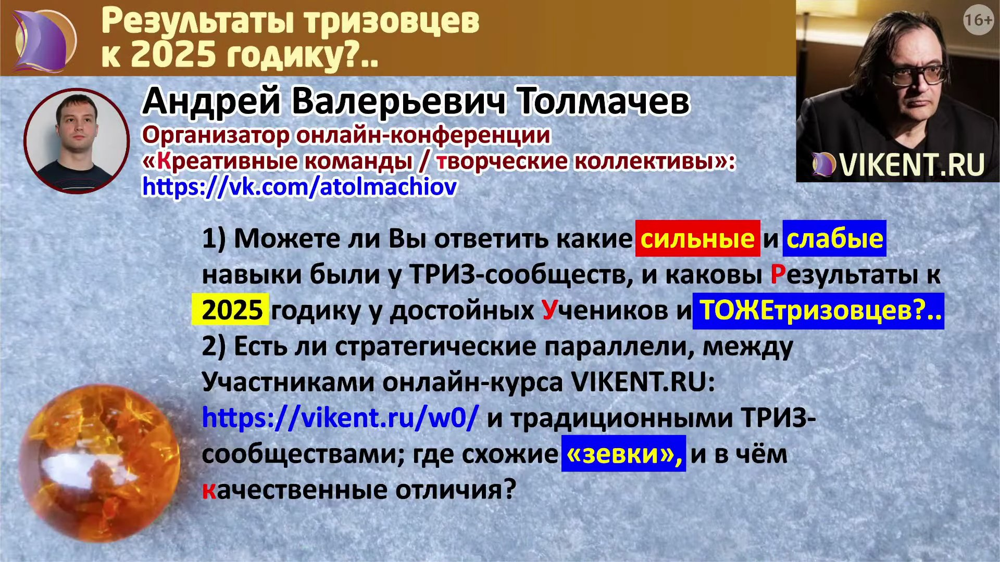

По ряду причин мы пожелаем Андрею Валерьевичу возвращаться к конференции. у него задумана одна уже проведена, сейчас будет вторая конференция, сейчас он с больницы, возвращаться из больницы и так далее. Вот. Но он как бы задал очень такой мм частотный вопрос. Есть гений Альшули. Ну, дальше вы видите, а что сделали тызовцы? Что сделали тызовцы? Соответственно, как бы Давайте по Давайте посмотрим дальше. Дальше, дальше посмотрим, соответственно, скажем, да, вот некое такое вдохновляющее понимание Альшулера, чем надо заниматься, чем надо заниматься, соответственно, чем на тот же самый рассказик после Крексиума я бы включил бы его школьную программу вместо той ерунды, которая там проходится.

---

## [01:39:45]

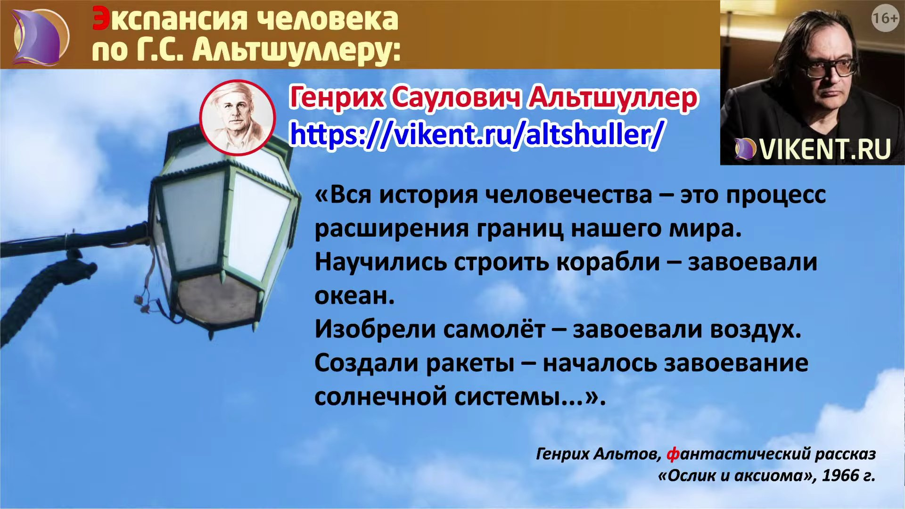

Давайте дальше. То есть я десятки раз отвечал на вопросы, где сделали проигрыши тризов. У нас привыча жабён. Жабёно появляется в районе ошибок. Бельчён в районе чего-то хорошего.

---

## [01:40:15]

Первое, значит, в конце восьмидесятых годов, восьмидесятых годов, то есть в тот век, ну, люди поняли времён даже первой кооперативы, что трис - это не некое увлечение на кухне, на кухне и так далее, и так далее. Это профессия. И если ты заниматься, то заниматься профессионально. Вот. То есть вот профессионально заниматься. Пункт два, который до сих пор не поняли. До сих пор не поняли. Точнее, понял, понял около 1%. Помните, я уже сказал, что есть соотношение 101. Около 1%. Понимаю, что если учиться творческим дисциплинам, помимо 30 другие творческие дисциплины, то стоит учиться у лучших. Только у лучших. То есть наставник только лучшие в стране, в Европе, в мире и так далее, и так далее, и так далее. Вот. Да. Пункт третий, очень важный, очень важный, что опять-таки это было понятно уже в восьмидесятые годы, Трис перешёл на коллективную стадию развития. Вот вот над этим выпуском, который мы сейчас все смотрим, я тоже его смотрю, обычно работает 10-15 человек. Им есть благодарности в начале, если внимательно посмотрите, вы увидите. Им благодарности будут в конце. Сейчас мы к ним перейдём. То есть 10-15 человек делают вот эту вот онлайн-консультацию. Всем им колоссальная благодарность. Пункт пункт четвёртый. Различные гибриды, вот которые сделаны за вечее воскресенье, потому что завтра семинар. Вот типа трис и окультятина плюс трис и NLP плюс трис и психологии и так далее, и так далее. Вот на любую науку поставьте. Не жизнеспособны. Нежизнеспособны. Кого интересует, что жизнеспособна, задавайте вопрос. Соответственно, скажем, пункт пятый, некие самооправдание. Почему у меня нет достижений? Я преподаю триск и у меня нет творческих достижений. То есть есть такая поговорка у торговцев, что продаватель шампуня не должен быть лысым. Ну правда, есть шампуни для лысых, правда, да? Так вот, соответственно, если мы попадаём творческую дисциплину, в частности, у нас должны быть некие творческие достижения. Вот смотрим пункт пять. Пять, да, соответственно, скажем, пункт шесть. Об этом будет конференция Ксении Александры Калугиной 26 января, наступающего двадца шестого года. Если не поставлена технология работы, если не поставлены просто-напросто навыки работы, то, соответственно, ну, ничего и не будет. Вы можете читать свою ленту ВКонтакте до посинения, но просто выделять лучшие примеры, там обобщать, делать эгоистики. Ну, это учится только у нас на курсе. Честь на курсе, да, соответственно. И давайте посмотрим видео, которое полезно всем посмотреть. Всем посмотреть. Оно эмоционально может быть неприятно. Да, это правда. Оно есть на Ютубе, оно есть ВКонтакте.

---

## [01:43:15]

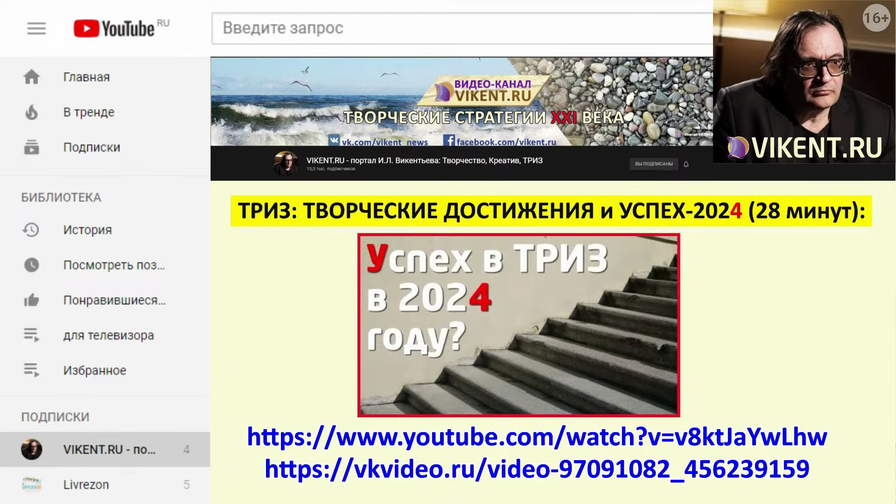

Но тем не менее, кто хочет связываться с ТРС профессионально, профессионально, нелюбительщина, если вы дерзнули преподавать три похожий дисциплины, ну, мой совет знать близко к тексту. Близко к тексту. Значит, опять-таки, почему близко к тексту, опять-таки, можете меня спросить, но это так. То есть это так, да. Вот. И давайте почитаем некоторое не очень оптимистичный финал. Потихонечку ближеся к концу. Да нет, ещё, извините, ещё как бы от Альшулия. Классификация тызов от самого Альшулия. Это Альшулио.

---

## [01:43:45]

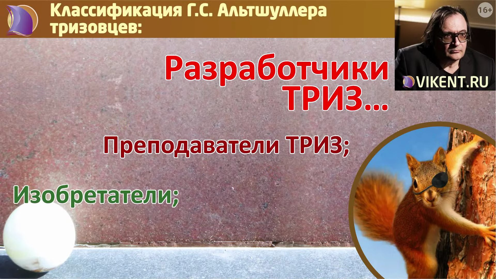

Это есть изобретатели. Есть изобретатели, есть преподаватели и есть разработчики. Мой преподавательский опыт, как бы, а я занимаюсь три профессионально, почему-то очень важная гавока. с 1979 года. Вот, соответственно, говорит о том, что минимумом нужно заниматься трис минимум и другими подобными дисциплинами на двух уровнях. То есть и разрабатывать, и преподавать, и преподавать, и изобретать. Ну, пишем задачник. Естественно, нужно, ну, как бы уметь немножко изобретать и преподавать. Ну, и ещё лучше, если мы сразу же перекрываем три уровня. Поэтому, если в третьем тысячелетии от Рождества Христова другой гений мы хотим сделать какую-то карьеру в три, ну, мой лично мой совет Викинива Леонардовича пикрывать пикрывать три уровня. Давайте посмотрим сейчас инвестное фото. Оно у нас уже было инверсное фото и так далее. Вот вот фото про умного человека, правну Александра Сергеевича Пушкина.

---

## [01:45:00]

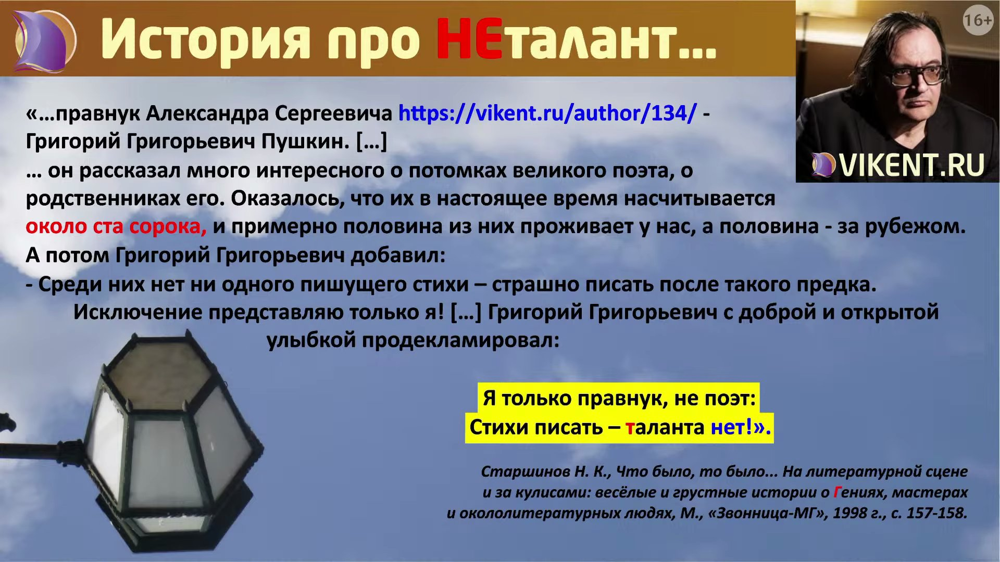

И вот как бы описывает старшинов. Таршинов. Снизу ссылка. Таршинов был долгие годы редактором в литературном журнале Юность. Так вот, соответственно, управнука Александра Сергеевича Пушкина хватило Остарумия написать одно стихотворение, одно стихотворение за свою жизнь, и которым он как бы отсекал любые попытки на фоне Пушкина пописать стишки. Хотя понятно, что стишки бы пользовались бы ограниченной популярностью, что-то ещё и так далее. Я только правнук, не поэт. Стихи писать таланта нет. Ну, к сожалению, всегда с точки зрения рифмы не получается, но вот по идее для тызсов надо вот вместо слова таланта ставить слово навыка. Нет, навыка. Навыка. Навык ставится. Единственное место, которое сейчас осталось, где такие навыки разрабатываются на открытых и закрытых наших мероприятиях, это сейчас курствиикенд. Курс викенд. Вот нравится это кому-то или не нравится, соответственно. Ну давайте посмотрим какие-то разумные ресурсы, которые стоит освоить, пожалуйста. Они были сегодня многократно. Не были многократно. И как я уже говорю, да, я думаю, что мы мы будем 2 часа. Нет, мы очень быстро я сегодня говорю.

---

## [01:46:15]

Соответственно, вот ресурсы, которые стоит освоить, подписаться, давайте благодарности, соответственно, скажем, да, соответственно, значит, кто хочет участвовать в конференции, запись только через организаторов, соответственно, и работа, закрытая работа, никому не показываем.

---

## [01:46:30]

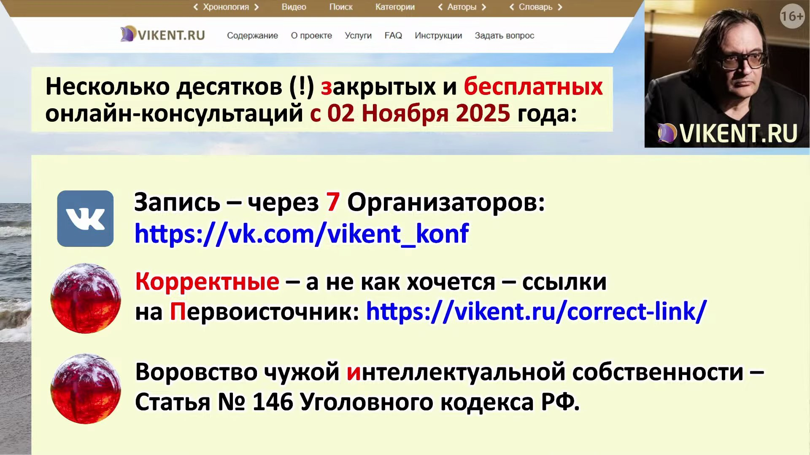

2 ноября, воскресенье с утра до ночи, так далее. Вот. Соответственно, если вы читаете Альшулера, пожалуйста, выучите раз и навсегда, значит, как делать корректные ссылки. Альшулер это чрезвычайно расстраивало, и он призывал. В книгах этого нет и так далее. Вот. Ну, соответственно, для россиян воровство чужой интеллектуальной собственности, так далее. Статья 146 Уголовного кодекса. Ну, пожалуйста, пожалуйста, ну, это пожелание Шуля. делайте корректные ссылки, корректные ссылки и так далее, и так далее, и так далее. Вот. Да, давайте посмотрим дальше. Мы уже заканчиваем. Соответственно, большое спасибо коллегам, благодаря которым вы сегодня увидели видео. Значит, кто в больнице, пусть выздоравливает.

---

## [01:47:30]

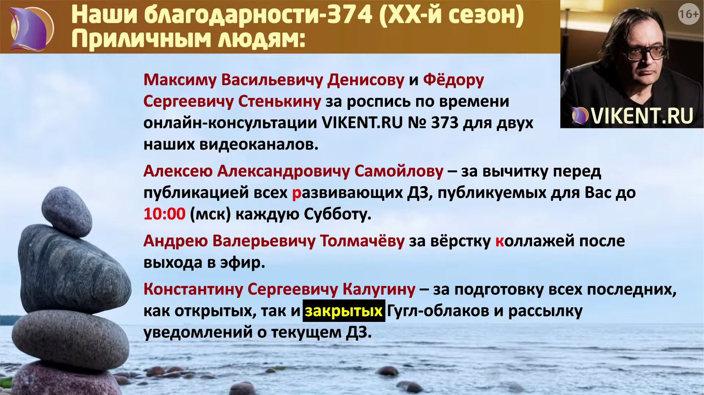

А мы переходим к последнему, по-моему, слайду. У нас последний слайд, да? Нет, как бы, да, вот сейчас идёт спецскурс. Он серьёзный, он навороченный, как Татьяна Викторовна Кирсанова написала.

---

## [01:47:45]

Ну я ей верю вот так далее, что каждое видео нужно пересматривать три раза. Ну что-то в этом вроде есть, как бы, да? То есть сейчас идёт очень тяжёлый курс по созданию своих продуктов. Он полностью открытый, но он тяжёлый. Он есть ВКонтакте. И повторяю, рекомендовано пересматривать каждое видео три раза. Да. Кто хочет, пожалуйста, соответственно 26 октября присланы вопросы по ЖСТЛ. Мы будем рассказывать про последнее детище гениальный прорыв Альшулера. Как жизненная стратегия творческой личности 26 октября. Вещь, как я не буду пытаться быть вежливым, вещь неприятная. и мужчины, и женщины в момент чтения этого курса или знакомства, они будут проигрывать психологически, морально проигрывать, потому что, используя выражение Альшулера, очень трудно состязаться со сборной гениев. То есть вот какие выводы из сборной гениев сделал Ге гений Геносчальшимы. Это полностью открыто. Последнее будет не будет не очень комфортно, чрезвычайно полезно. Ну, очень хорошо ставит голову на место, у кого они у кого они есть. Ну, давайте посмотрим. Соответственно, кто считает, нужно пофинансировать эту лекцию? Соответственно, нужно написать, ну, а перечислить, б написать донат трис, донат подарок трис, пожертвование трис.

---

## [01:49:15]

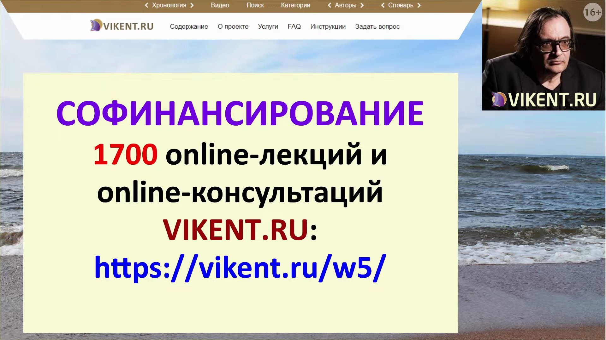

То есть мы будем знать, что, соответственно, как бы эти денежки надо отправлять именно вот по этому назначению, с тем, чтобы это видео распространилось также хорошо. Также хорошо. Соответственно, всего вам доброго. Через несколько минут и ВКонтакте, да, правила у нас ученица иммунные, вопросы тоже задаются имя, фамилия, отчество, иначе мы вас выкашиваем.

---

## [01:49:45]

Соответственно, соответственно, через несколько минут и ВКонтакте, и в Ютубе мой комментарий Викенть Иголенадовича Викентьева, где будут указаны основные ссылки на наиболее важные материалы, соответственно, в виде текстов и в виде видео. Ну, также там будут указаны на ресурсы, которые стоит подписать. Значит, благодарю семью Геннасовича Альшулера, которая нам помогала и раньше помогала. И благодарю группу Левызон, издательство электронных книг, которая сегодня тоже отмодерировало. Были ли у нас зависания? Спрашиваю я у модераторов. Значит, зависания у нас не было. Значит, всё готово уже можно пересматривать. y

---