# Лекция 375

---

## [00:00:00]

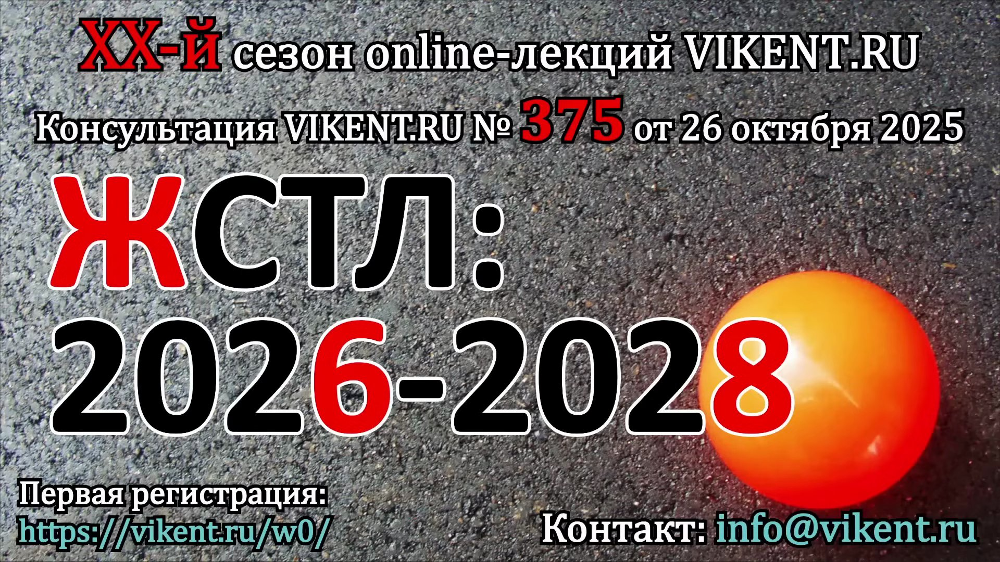

Здравствуйте, уважаемые коллеги. У нас сегодня продолжение короткого спецкурса к девяносто девятилетию гения XX века Генриса Чальшулера. И, соответственно, в прошлое воскресенье мы говорили о Трис и РТВ. Сегодня мы говорим о последней крупной разработке, который гений XX века придавал очень большое значение. Соответственно, у нас рекордное, почти рекордное количество слайдов 90. То есть мы выйдем за пределы полтора часа, возможный перерыв трансляции, но мы делаем резервную копию. И завтра, соответственно, и на Ютубе, и на Ютубе, и ВКонтакте, соответственно, ну, будут это данная видео выложено. Смотрите его желательно очень внимательно, сверхжетельно конспектировать, смотреть на ускоренные скорости, смотреть это видео, телевизор - это бесполезно. Лучше сразу же не смотреть. И тогда, соответственно, пожалуйста, давайте, прошу, сейчас будет несколько видео, несколько слайдов, извините, несколько слайдов. Итак, вот давайте посмотрим.

---

## [00:01:15]

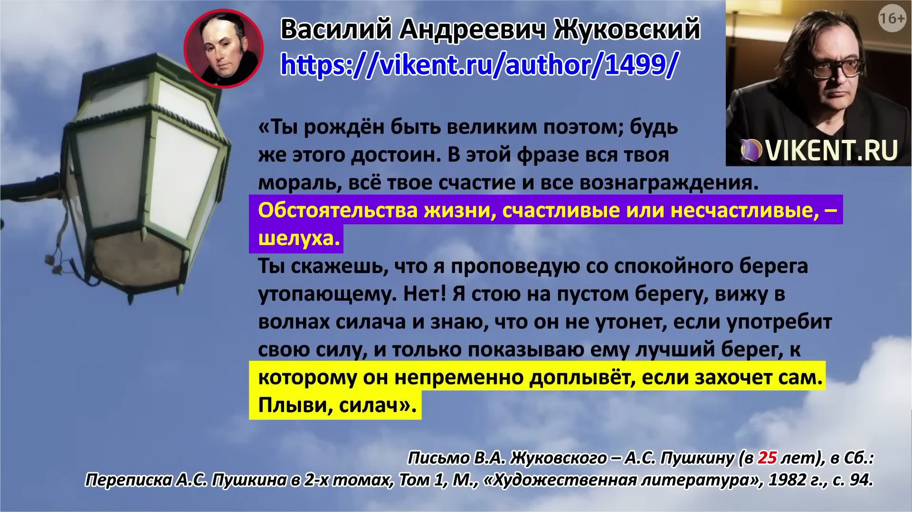

Это опубликовано, это очень такое напутствие, напутствие Жуковскому, который признавал, что ученик Пушкин его превзошёл. Но эту фразу известна всем. А вот это вот уже из переписки она как бы дана как бы, ну, какая она не зачитанная. Соответственно, Генаксовича Альшули, особенно в последние годы считал нормальным, ещё раз, нормальным, чтобы ученики его превосходили, но, к сожалению, очень, мягко говоря, это не случилось. Соответственно, очень важно оговорить, что где-то в семидесятые годы, вероятно, вероятно это означает гипотеза, вероятно было какое-то письмо из ЦК КПСС, потому что Хаущёв сказал, что к восьмидесятому году у нас будет коммунизм. До коммунизма было далеко. И, соответственно, по косвенным данным, можно догадаться, что масса докторов наук, профессоров Москве и Питере, соответственно, по психологии, по философии, соответственно, стали писать книжки о советском человеке, о личнике советского человека и так далее. Вот придумали они из своей дурной головы. Ничего они не сделали. Мы к этому примеру сегодня ещё вернёмся. Соответственно, по рассказам Геннасовича Альшулера сегодня будет много материалов, которые есть либо в переписке, либо рассказывалось, либо рассказывалось, либо данные из семьи, которые не публиковались ещё. Так вот, Генрикс Альшули рассказывал на конференции по Три Петрозаводски, что примерно, насколько можно было понять, в конец шестидесятых, семидесятых, соответственно, он завёл себе, как он говорил, папочку, папочку, куда он всего лишь складывал какие-то выиски про выдающиеся достижения, выдающиеся личности. Соответственно, потом как бы это происходило более 10 лет. Потом в середине восьмидесятых он стал читать целевым образом книги про выдающихся людей и создал гениальную гениальную жизненную стратегию творческой личности, до которого психологам, коучем, методологом, философом ещё как бы, ну, лет 50, ещё лет 50, а он создал отсюда как бы первая мораль. первая мораль. Соответственно, по приказу партии, по приказу партии, даже если платятся деньги, мгновенно теория личности не создаётся даже даже профессоры. Это первое. Если кто-то захочет сказать: "Ну, это был поздний Советский Союз, всё понятно" и так далее. Вот, соответственно, отправляйтесь вы в минувший четверг и посмотрите это, что очень легко найти на Ютубе, совещание, которое открывал президент России по поводу демографии. Это двухчасовое видео. Соответственно, президент поставил задачи по демографии. Дальше, если смотреть очень внимательно и конспектировать, вы увидите большое количество блифующих людей. Это было в этот четверг, которые занимают чрезвычайно ответственные должности. Поэтому считайте, что это такое домашнее задание для продвинутых, которое мы сегодня более обсуждать, более обсуждать не будем, как бы, да? Соответственно, следующий момент, который когда встречается с текстом ЖСТЛ, продвинутые какие-то мужчины или женщины, соответственно, с амбициями и так далее, вот они всегда проигрывают при первом прочтении сборной гениев. То есть не зря генов соучали. Сам гений обобщил жизнь более тысячи гениев. Ну, преимущественно Европы не зря. Поэтому первое, что делает человек, умный, развитый, что-то ещё, что-то ещё, 40 годиков, может быть, доктор наук, может быть, член-корреспондент, может быть академик, он проигрывает начисто, то есть просто как бы сборный гениев. Отсюда есть два выхода: рычайший, единичный, меньше процента. человек должен начинает понимать, что перед ним некий новый океан, открытый гехом Соуча Альшулевым, который ближайшие несколько десятилетий можно совершенно спокойно осваивать. Для этого нужно, в принципе, желание и работа. Желание и работа. Соответственно, второй момент, соответственно, чем занимаются 99 и де в периоде русской интеллигенции, в том числе со степенями, люди начинают себе врать, что жестл - это не так, а они кручест, потому что у них есть духовность. Это цитата. Это цитата и неоднократная. Соответственно, GTL вещь обидная. Вещь обидная для амбициозных людей. Пожалуйста, пометьте и, пожалуйста, подумайте, какую дорогу вы выбираете. Меньше процента или 99 вы будете себе врать. Мне соврать вам не удастся. Ну, в силу того, что я профессионал очень пыличного уровня, но себе вы совыте. Следующий слайд, пожалуйста. Соответственно, предыдущее видео, которое, ну, можно посмотреть, смотреть его тоже нужно внимательно на двух видеохостингах.

---

## [00:06:30]

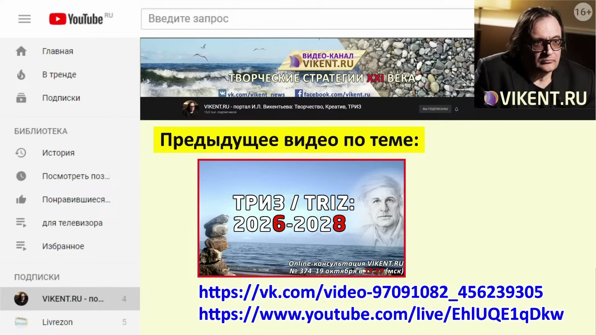

Сразу скажу, мы не стали заполнять слайды, потому что, ну, чтобы осталось место, остался воздух. Вот все эти ссылки, когда я закончу сегодня излагать материал, соответственно, будет мой первый пост. Он будет и на Ютубе, и ВКонтакте, и там все наиболее значимые ссылки бу будут даны, в том числе вот на это вот первое видео. Соответственно, давайте посмотрим следующее. 2026 год, соответственно, это год столетия от рождения Геннасовича Альшулера.

---

## [00:07:00]

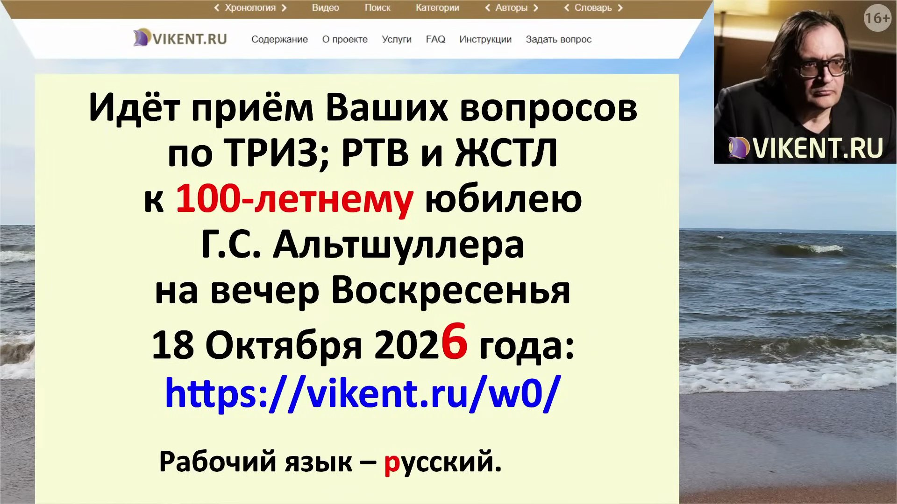

Уже начат приём вопросов, потому что мы планируем в октябре делать расширенный спецкурс по проблемам близким ЖСТЛ, как бы последней крупной разработки Альшулера, который он считал, что люди должны заниматься. А теперь давайте посмотрим установочное видео по тем правилам, про которые мы общаемся на уникальном курсе. >> [музыка] >> Данный курс читается в рамках проекта Викенд, который является крупнейшим порталом Европы по изучению творческих личностей и творческих коллективов.

---

## [00:07:45]

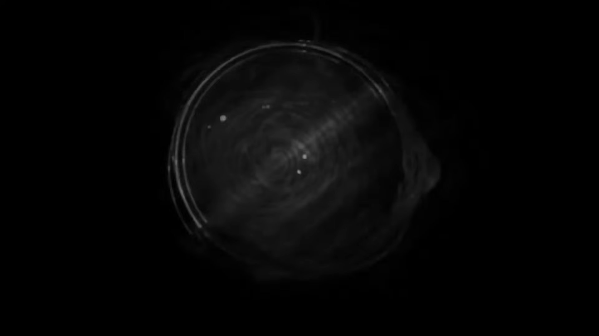

---

## [00:08:00]

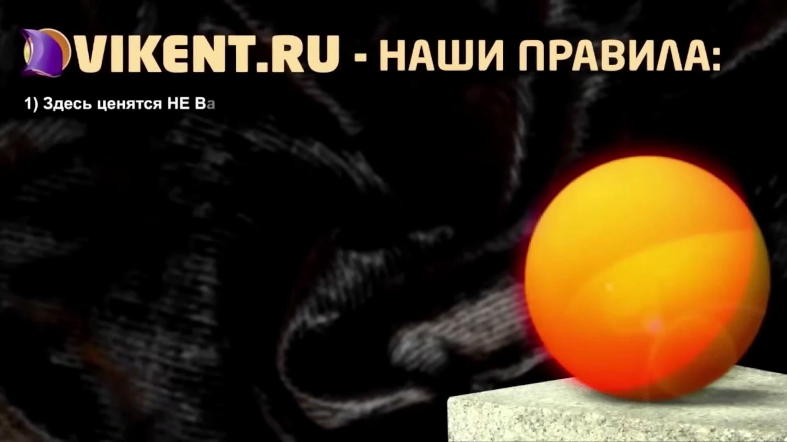

Материалы для этого проекта собирались мной с 1979 года. Надо предупредить, что наши материалы несколь сложные, сколько непривычные для обычного мышления, поэтому нужно смотреть их очень внимательно и слушать, а также рекомендуется записывать.

---

## [00:08:15]

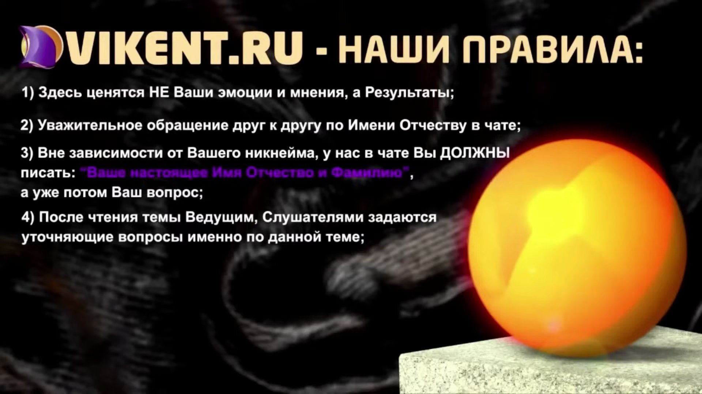

[музыка] Как вы будете вести конспект в компьютере или в блокноте, это ваше дело. Лично я рекомендую вести в блокноте, поскольку иногда удобно не только записывать, но и зарисовывать те идеи, которые оглашаются в рамках нашего курса.

---

## [00:08:30]

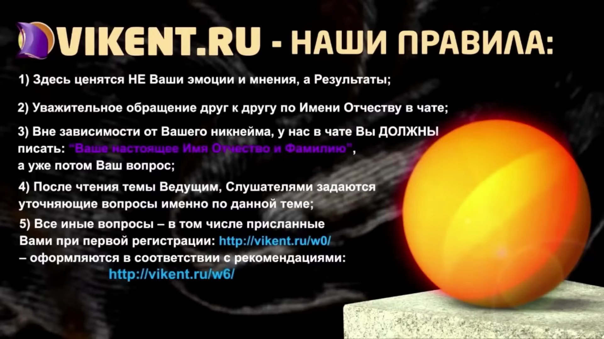

Соответственно, у нас принято в Русской академической научной традиции обращение со всеми исключительно по имени отчества. Поэтому, если вы зарегистрированы в Ютубе как красная шапочка, пожалуйста, это ваше право. Но у нас в чате вы будете писать себя как Красная Шапочка, а в скобках полностью имя, отчество, фамилия. Ну, в противном случае вы просто будете удалены модератором.

---

## [00:08:45]

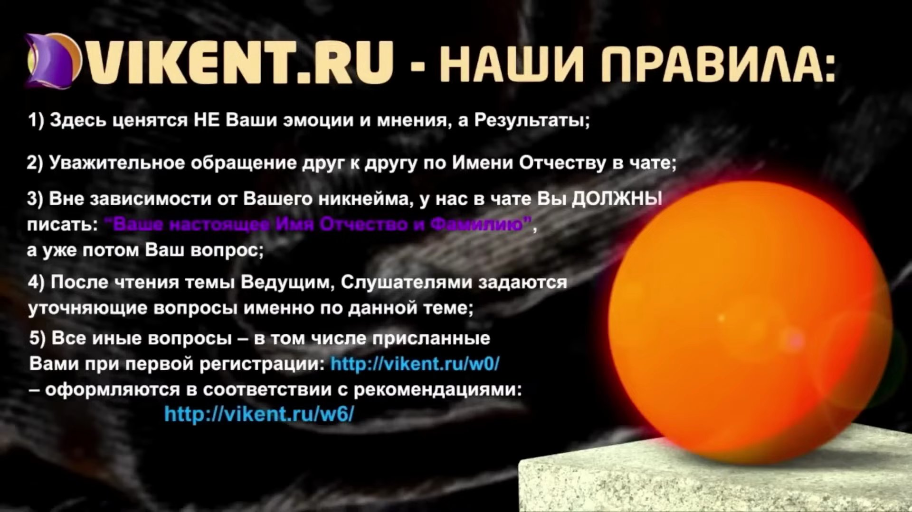

Причём удалены навсегда. Соответственно, у нас есть вопросы, несколько видов.

---

## [00:09:00]

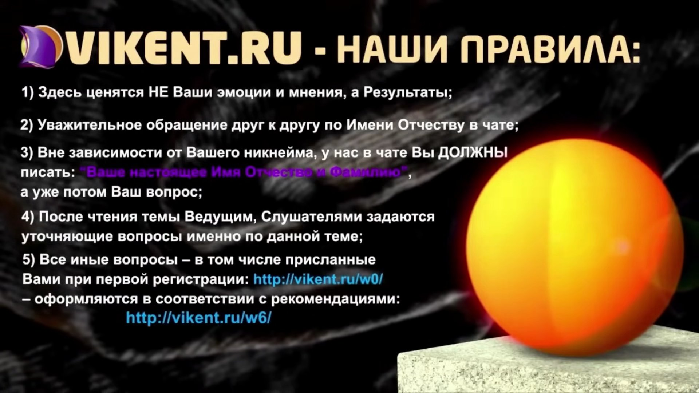

Первый вопрос - это в конце какого-то логического куска, когда закончилась тема, и они задаются в чате. Если ваш вопрос существенно отличается от объявленной тематики лекции, то вы снизу экрана видите, как его задать по специальному формуляру.

---

## [00:09:15]

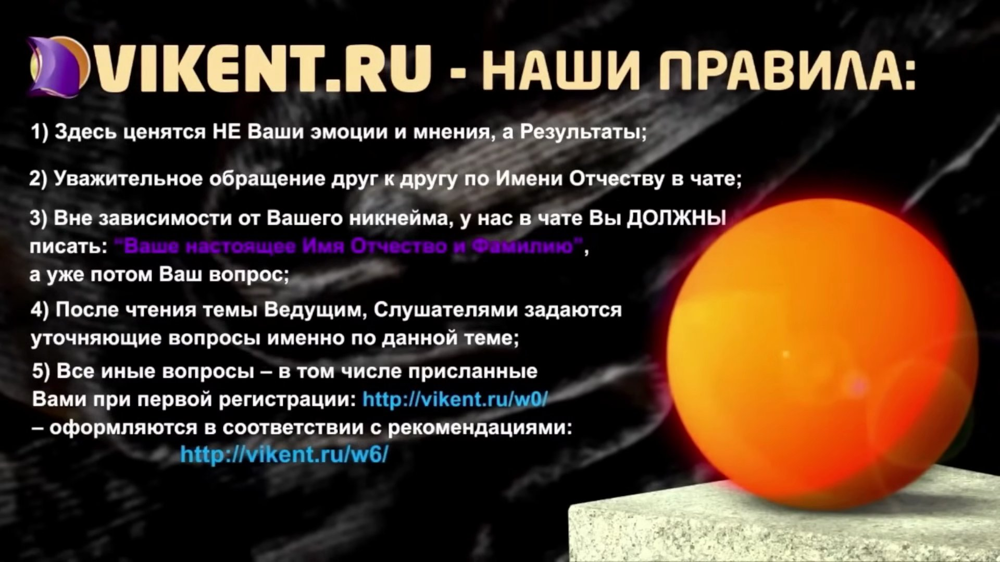

Соответственно, вот оглавление, оно было опубликовано, мы постарались в среду.

---

## [00:09:30]

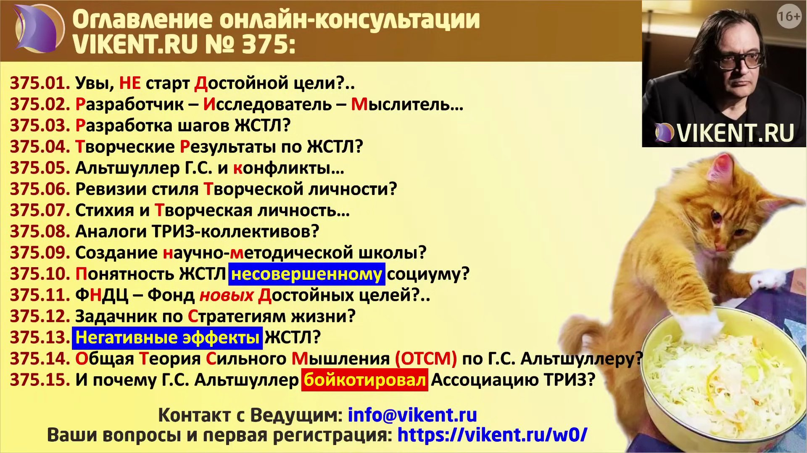

Соответственно, большое спасибо, потому что получилось суммарно 45 вопросов и ответов, которые позволили мне уточнить, какие акценты мне делать, потому что явно многомерная тема. Это явный курс такой, ну, как бы на квартал, на квартал, если вы читаете, соответственно. Ну, у нас сегодня одна большая консультация, поэтому заранее большое спасибо. Давайте посмотрим сокращения, связанные же СТЛ, которые нам пригодятся. Соответственно, это написание самого Генахсаучаль Шулера.

---

## [00:10:00]

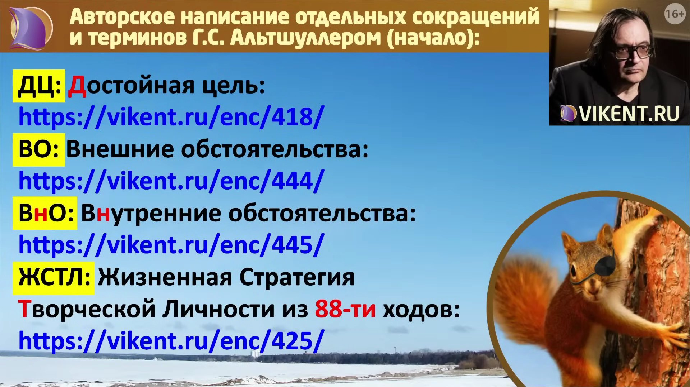

Масса терминов, относящихся к Gst, он писал именно большими буквами. Большими буквами. Это первый слайд, соответственно. Давайте второй слайд. Второй слайд, соответственно, второй слайд. и так далее. Вот как бы, да, второй слайд. Итак, жизненная стратегия творческой личности - это 88 ходов, поэтому Ашуле призывал их количество увеличивать, как бы, которое описывает описывает жизнь человека с юности и до после смерти.

---

## [00:10:30]

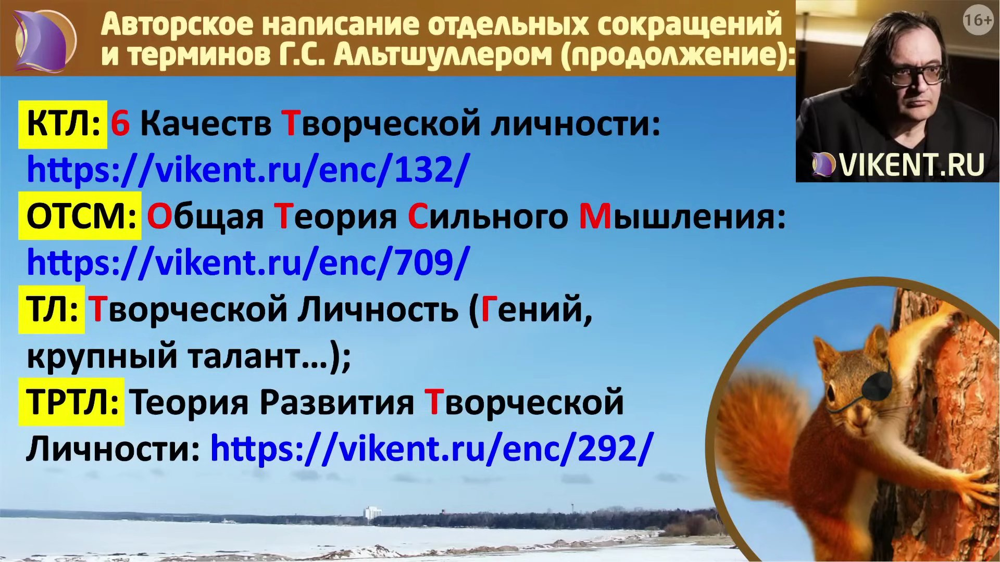

Причём после смерти никакой мистики окультятиной религии нет. Мы сегодня об этом чуть-чуть поговорим, как бы, ну, немножко час терпения и поговорим. Давайте посмотрим бонус, бесплатный бонус. Значит, недавно, недавно, на прошлой неделе вышла книжка, там есть целый раздел ПЖСТЛ моя, она бесплатная.

---

## [00:11:00]

Соответственно, сейчас мы её немножко потестируем, как бы это второе будет тестирование. И, соответственно, как бы в следующем году, двадцать шестом, наверное, доведём количество тем, да, большего числа, то есть там 175 или 200 там или 222, то есть не знаю. То есть, в принципе, таких тем 1.700, то есть по желанию можно сделать. Поэтому понимаются, она бесплатная, понимаются дополнения, вопросы по этой книжке. где-то с Нового года пойдут просто домашние задания в стиле скачать эту книжку и, соответственно, там сделать свои дополнения. Книжка крохотная, то есть в страницах это 48 страниц в Орде. Она крохотная, но тем не менее. Идёмте дальше. Соответственно, как бы вот вот как бы материалы, где публикуются материалы ПАТРИС ЖСТЛ и ВКонтакте, ВКонтакте, скажем, милости прочем- это открытые вещи. Соответственно, если вы не хотите заниматься трис на кухне, как делает большинство людей, неудачников, ну, желательно желательно, ну, читать читать отсюда материалы, они профессиональные.

---

## [00:12:00]

Далее, далее давайте посмотрим благодарности. Отдельная благодарность Рустаму Макстатовичу Ижбаеву, который съездил на могилух Чальшу Петрозагоске и убрал её. То есть петрозаводские тризовцы даже это не в состоянии делать.

---

## [00:12:30]

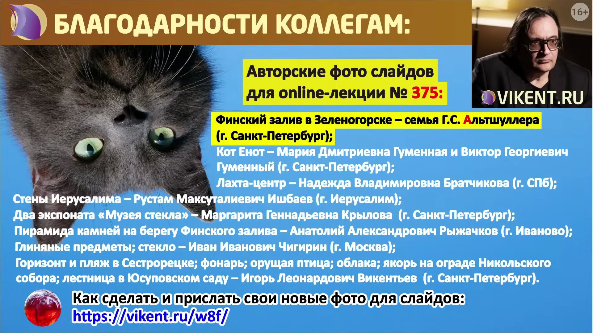

Сегодня вы увидите фотографии Рустава Максуталивича из Иерусалима. Большое ему двойное спасибо. Остальные представлены на экране. Давайте дальше. Соответственно, кто понимает, что мы делаем, для чего мы делаем, какого уровня мы делаем, пожалуйста, у нас есть два счёта. Вы можете это не обязательно профинансировать. Профинансировать, да?

---

## [00:13:00]

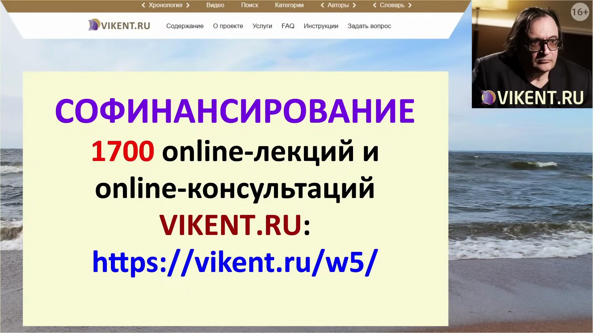

Далее, соответственно, кто у нас недавно или впервые, мы церемонно, очень церемонно, соответственно, общаемся друг с другом. Кто это не понимает, нарушает, идёт вон.

---

## [00:13:15]

Неважно, это мужчина или женщина. Вторая без предупреждений идёт вон. Остальные видят, что человек идёт вон, и, соответственно, церемонность общения нашего увеличивается. Кого интересует, почему так, а не иначе, задавайте вопрос на 16 ноября, открытый консультационный день. Я очень быстро проскочил введение. Давайте переходим к вашим вопросам. То есть всё, что Да. Всё, что сегодня будет делаться, это не то, что мне хотелось изложить, а то, что вы спрашиваете. Давайте посмотрим первый вопрос. Первый вопрос, так далее. Вот. Да, давайте посмотрим первый вопрос. Слайд с вопросом.

---

## [00:14:00]

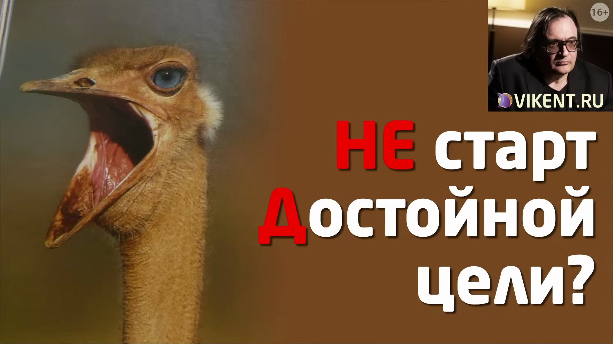

Давайте. Соответственно, человек, который занимается несколько десятилетий, соответственно, очень хорошо знает тезисов изнутри. Роман Стефанович Флареску проживает в городе Бельс, Республика Молдова.

---

## [00:14:15]

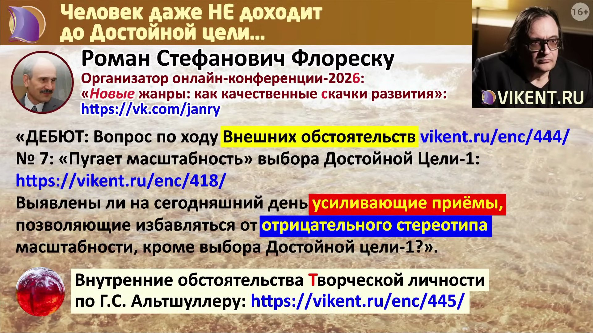

И вот он, насмотревшись как бы на различных людей, вот так вот спрашивает, спрашивает, спрашивает, как бы, да, соответственно, как бы в данном случае я постараюсь ответить от себя, от себя. То есть у нас сегодня будут ответы от меня, от Генна Христовича Альшулера и от семьи Альшулера. Почему мы можем не совпадать? Соответственно, соответственно при занятии творческими дисциплинами, ТРИС явно творческая дисциплина, другие творческие дисциплины, там кино, музыка и так далее, вот она требует творческих достижений. То есть, если у преподавателя нет творческих дисциплин, творческих достижений, вот к нему возникают очень большие вопросы. Вот. Более того, более сильный тезис, творческие достижения должны быть регулярными. На мой взгляд, у тризовцев, соответственно, уже можно говорить, что прошло несколько десятилетий, потому что были широко опубликованы материалы по ТРИС уже в семидесятые годы XX века. То есть прошло уже 55 лет, где-то 50-55 лет прошло. Соответственно, кризисом мешала. Первое, некая лень, второе глупость и некие готовые самооправдания, почему они ленивые и глупые. Кого это интересует? Свой вопрос Роман Стефанович повторил как бы под программой ВКонтакте. И также он повторил его в Фейсбуке, кому это ближе. Соответственно, мой совет, кто интересуется Трис, выучить на изусть первые 10 психологических защит по Аннифрейд. Ссылка там поставлена. Если не найдёте, ну, ничего, ничего, ничего страшного, пожалуйста, соответственно, спросите под видео, я дам ссылочку и так далее, и так далее, и так далее. Вот. Соответственно, вот эта вот гремучая смесь, лень, недальновидность, неумение работать, плюс готовые самооправдание, они сожрали некую жизнь. А когда вы человеку уже лет там 50-60, ну, учиться уже поздно. Учиться уже поздно, к сожалению. К сожалению и так далее. К сожалению, уже поздно. Ну, как бы давайте посмотрим некоторый пример, который мне показался весёлым. Мне показался весёлым. вылезла жабёного баба, жабёного жена в шляпке. Страшно духной. Это означает, что можно смеяться, как бы, да.

---

## [00:17:00]

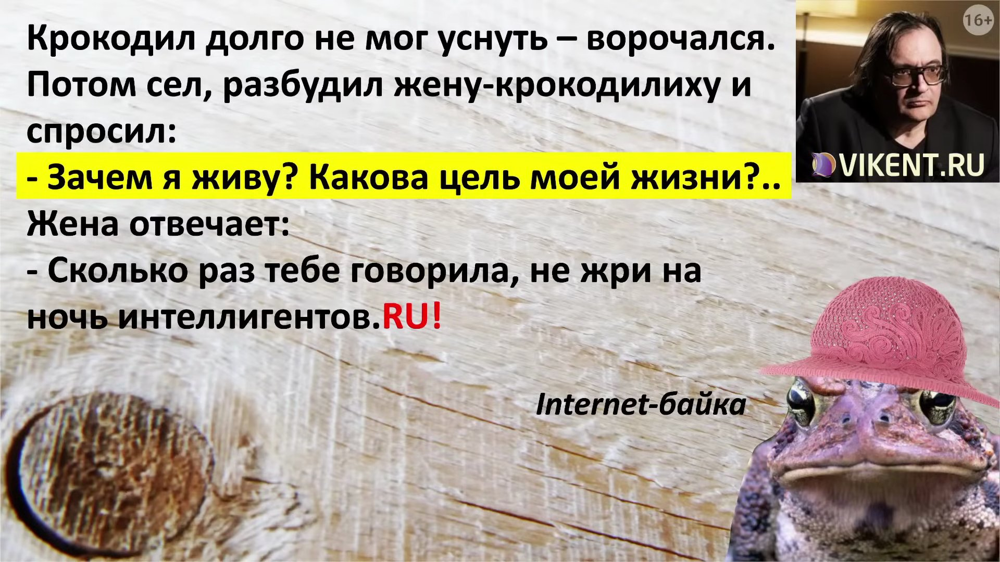

Вот я надеюсь, вы почитали, соответственно, как бы вот, то есть есть категория людей, с которым даже как отделовые цели можно не обсуждать. Давайте посмотрим, что полезно почитать по схожей теме самого Генна Хсауча Альшулера. Давайте посмотрим. Посмотрим. Желательно, кого интересует ответ на вопрос Романа Стефановича, спокойно, никуда не спеша, выключив телевизор, почитать материалы самого Геннаха Сауловича Альшулера.

---

## [00:17:30]

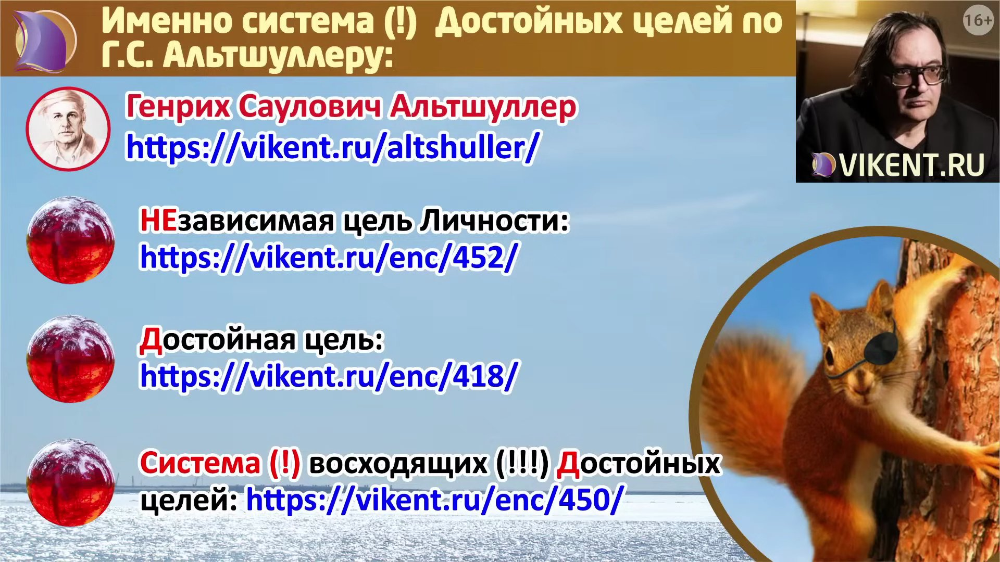

Ну и прикинуть, почему вы, почему ваше окружение есть, есть минимально работающие инструментарии, то есть это не призывы, есть минимально работающие инструментарии, вокруг этого почему вы не достигаете, почему вы не достигаете? Соответственно, это здорово развивает. То есть никакой мистики, окультятины в этом нет. Давайте дальше перейдём уже к моим исследованиям, к моим исследованиям. Да, я буду предупреждать, где Альшуля, где его семья, где я. Соответственно, очень удачный термин возник в переписке Сергеем Сергеем Владимировичем.

---

## [00:18:15]

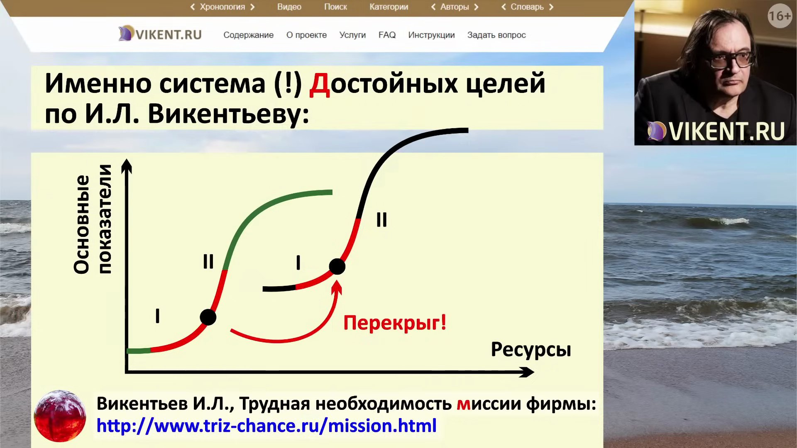

Господи, фамилия вылетела, Сергеем Владимировичем, нашем коллегой из Минска. Вот слово перепрыг. Слово перепрыг. Так вот, соответственно, на мой взгляд, чрезвычайно интересная и научная, и какая-то иная жизнь, и динамика достойных целей, когда вы переходите с конца первого этапа, как бы начала второго этапа, соответственно, на следующую сообразину, выше, выше, соответственно, там начинают лезть как бы какие-то дегенераты, начинает лезть власть, и всё становится неинтересно. Если таких сообразий нарисовать серию, то, соответственно, соответственно у нас получается такая вот некая лестница восхождения, где есть с одной стороны первый результат, с другой стороны некая относительная значительная свобода. Соответственно, подобные прыжки, подобные прыжки без наставника, это опытса показал, это такой бред. Некая история, которую коммунисты не любят рассказывать, хотя знают. Соответственно, когда ЦК КПСС в ССС выкупала у немцев рукопись диалектика приода Энгельса, дали на отзыв Эйнштейну. И Эйнштейн написал, что, соответственно, научные ценности, диалектика природы Энгельса, по которому нас учили в вузах, соответственно, не представляют. Ну, не представляют, соответственно, она не доделана. И, соответственно, мы сегодня поговорим, что просто-напросто масса тезисов как бы путают вещи, когда какие-то части методики не доделаны, а некоторые методики сделаны. Так вот, если методика уже сделана, хотя бы в первом варианте, ей стоит доверять и стоит делать перепрыг. Стоит делать перепрыг. То есть как бы я поцитирую коллегу, который слово перепрыг очень удачное и но не моё. Соответственно, дальше посмотрим. Давайте, соответственно, поздний Генсу Альшулер, когда человек задумывается, зачем я жил, как я жил и так далее. Вот он использовал такие вот теменны: разработчик, исследователь, мыслитель, соответственно, и как бы точных определений он не дал, но интуитивно понятно, что как бы это масштаб достойной цели.

---

## [00:20:30]

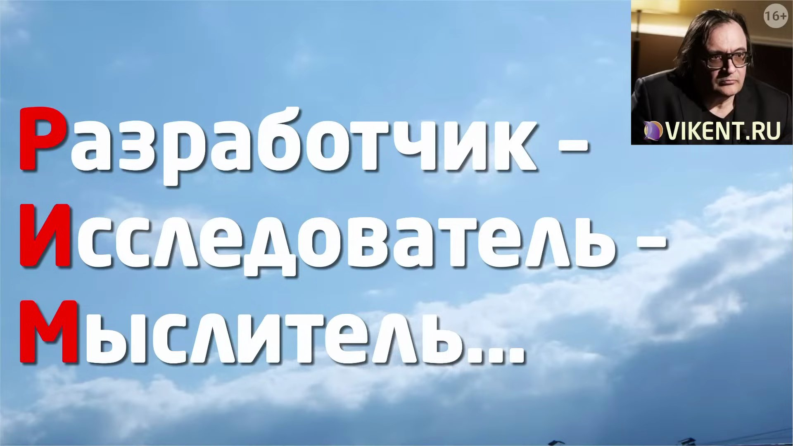

Достойная цель - это не точка, это некая лестница, которая только что вам была показана. Это перепрыгивание с одной сообразной кривой. У нас было две из-образных кривой. На самом деле их явно может быть гораздо больше. Давайте посмотрим вопрос. Давайте посмотрим вопрос. Так вот вопрос как бы, да, хотя хотя на него уже ответил.

---

## [00:21:00]

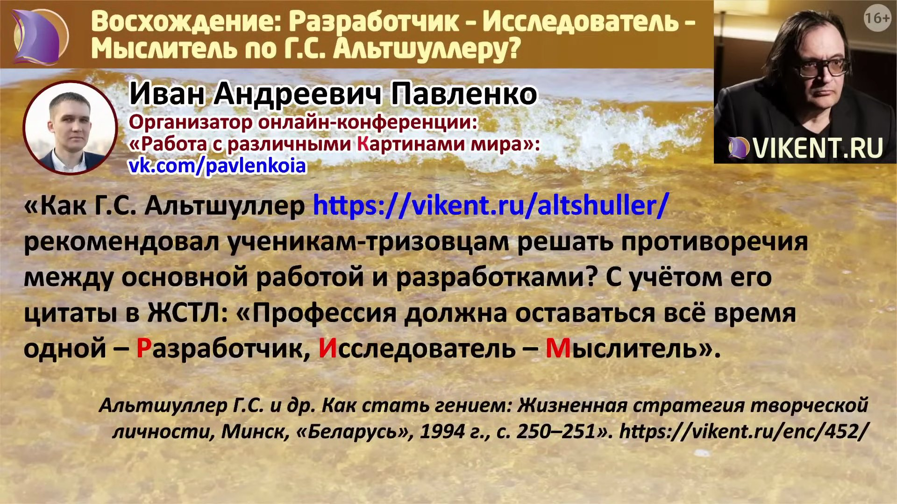

Соответственно, Генрих Сович Альшулер считал, что нужно осваивать смежные профессии. Соответственно, как бы, особенно на ранних этапах некие идеи нужно популяризировать. Ну для этого нужно быть, я так это называл, ну, заниматься журналистикой, литературой. Соответственно, я для этого сделал, скажем, программу Лучшие в мире приёмы журналистики. Я это для этого сделал очень крепенький мастер-класс по написанию книг и статей и так далее. Вот давно не походил, кстати, да? То есть это технологизировано. Сейчас, соответственно, многое уходит видео. Ну, нужно много снимать. Снимать надо качественно и качественно качественно делать. То есть ответ Альшу заниматься как минимум смежной профессией. Соответственно, Альшуля проводил семинары Патрис. К сожалению, он не знал. Ну, было бы более грамотно делать то, что делал ренслист. То есть ренслист проводил ну, наверное, такой, ну, новейший истоги истории мастер-классы. Мастер-классы, когда проводится обучение небольшого количества учеников, и при этом присутствуют другие преподаватели, ну, музыки, музыки, ну, или трис, то есть, ну, ближе к тому, что делал Генрис Чальшу, это, конечно, мастер-класс. мастер показывает как бы других мастеров как бы что он делает, но он тогда используется теменнари Патрис. Значит, если я не ответил дополнительные вопросы под этим видео. Давайте дальше. Итак, разработка, разработка шагов ЖСТЛ и так далее. Вот, соответственно, кого интересует следующий слайд, пожалуйста. Советские психологи, философы написали тонну ерунды про развитие личности, человека, человека ближайшего будущего и так далее.

---

## [00:23:00]

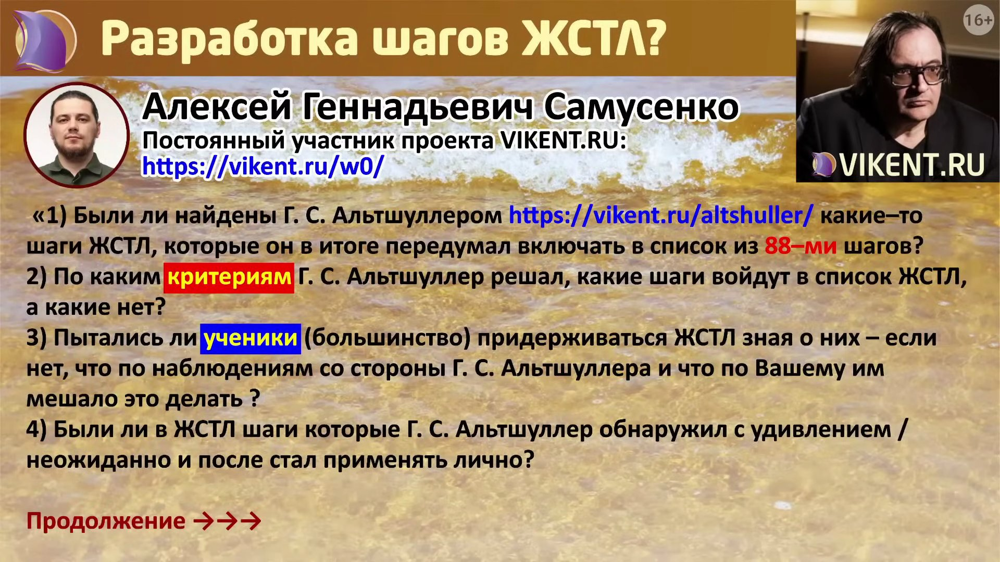

Мне студентам было стыдно читать эти профессорские бредни. Фамилии не называю, потому что у дураков профессоров есть дети, есть внуки с теми же фамилиями и так далее, и так далее, и так далее. Вот. Ну, пока я говорю, соответственно, как бы вы видите вопросы Алексея Геннадьевича Смысенко, как бы из Питера, так далее, которую, скажем, он спрашивает как бы, да, тогда далее вот как бы, да, значит, стандартный измеритель, стандартный измеритель, который предлагал Альшулер, я считаю несколько иначе, но сегодня вещи Геннеса Заучи, а не мой. Соответственно, всё измеряется степенью приближения к достойным целям. Причём достойная цель- некая сущность, имеющая такой самовозрастающий характер. Соответственно, очень интересный момент, о который советские профессора дураки не знали. Термин, который был рождён Карлом фон Клаузвицем, как в сво в его публикациях о стратегиях войны - это трение. Что такое трение по Клаузевицу? Соответственно, вы можете найти в интернете. Ну, соответственно, советские психологи, философы, методологи его не знали, как бы, а как бы это некоторый аналог внутренних обстоятельств по генах случа.

---

## [00:24:30]

Ну, давайте посмотрим следующий вопрос, как бы, да, допустим, да, соответственно, как бы, значит, по поводу как бы шагов, значит, здесь как бы трудно сказать. Каждый каждый шаг GL - это некоторый скачок. И для разных людей, это мой ответ, да, на мой взгляд, для разных людей это, ну, как бы разное. Есть выдающиеся физики, выдающиеся химики, у которых там хорошо, если был там один-два ученика, соответственно, которые не создали школу, которые получили выдающиеся там или математические результаты, физические результаты. То есть они вообще не тратили себя на создание научной школы. Вообще не тратили. Им было тяжело. Это вещь чрезвычайно неблагодарная. Соответственно, скажем, новые внешние обстоятельства, да, конечно, они выявлены в моих исследованиях. Соответственно, есть вещь, которую я многократно наблюдал, что человек более-менее хорошо работает, когда вообще плохо. Когда человеку плохо, вот, как ни странно, когда становится более-менее хорошо в скобках подсказка с помощью Игоря Леонардовича Викентьева у человека срывает резьбу, человек, например, начинает хомить наставнику, например. То есть это ещё некое такое, не знаю, штука, которой как бы у Генкса учальшу, в общем-то, не было. Соответственно, кого интересует? Судя по всему, Генцавич Альшулер, он интересовался личностью сразу же после Второй мировой войны. Давайте посмотрим. И вот, соответственно, из как бы азербайджанского КГБ доби добыта рукопись его книги. И, соответственно, как он иногда говорил, он говорил преимущественно, это устно, это не опубликовано, что Трис для него не более чем модельный объект для изучения высокого творчества.

---

## [00:26:15]

Вообще нужно заниматься изучением творчества. Вот книжка, повторяю, книжка каких-то таких ах секрет не содержит. Кто кого интересует, полезно, оно стоит небольших денег, полезно скачать и, соответственно, так далее. Вот. Вот, соответственно, давайте теперь посмотрим структуру шага. Я в очередной раз, я уже несколько раз это делал, я прокомментирую. Так вот, шаг по ЖСТ, до которого психологи, коучи, философы, методологи не доросли, это некая методическая система. То есть есть стрелочка, стрелочки слева направо и справа налево. То есть такая сложная методическая система. Читаем снизу.

---

## [00:27:00]

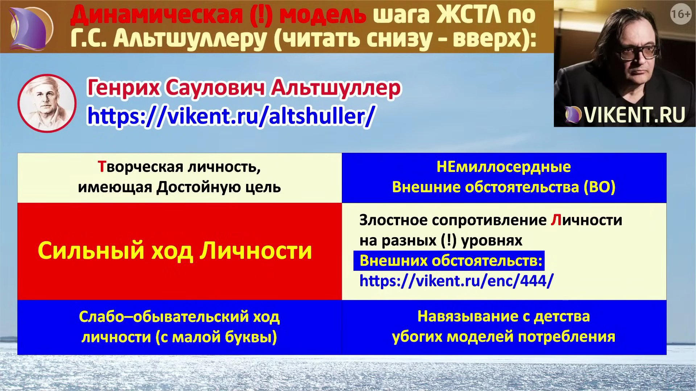

Ну, первое, то есть слабый обывательский ход. как бы с малой буквы человек делает как бы попроще. То есть при мне, при мне Петрозаводский, некий молодой человек, тызовец, ну, совсем дурак, спрашивал всех Генхачаль Шулера, как бы ему заниматься трис, вот если жена не даёт ему 3 руб на подписку журнала Изопытатель ирвенциализатора. К сожалению, это цитата. К сожалению, это цитата. Вы понимаете интеллектуальный уровень тризовса, понимаете, да? Соответственно, скажем, да, соответственно, далее повыше. Вот такие ходы делать не нужно. Соответственно, в классике GLЛ по альшу есть 88 ходов и там, ну, чуть больше, то есть в районе сотни слабых обывательских ходов и так далее, и так далее. Вот как бы и прочее. Далее есть сильный ход личности, такой, ну, как бы шажок по некоторой лестнице, ведущий ведущий ведущий ведущий наверх. Ведущий наверх, как бы, да. Соответственно, как бы при этом нужно понимать, что, соответственно, как только вы начинаете чуть-чуть чуть-чуть выделяться из общей массы, вы сразу же обязательно получаете от внешних обстоятельств по башке. внешние обстоятельства. Что это будет? Это будет ближайшее окружение, включая семью, преподавателей университета, как бы академиков, которые призывают вас заниматься этой темой. Это может быть правительство, то есть всё, что угодно. Соответственно, сейчас будет вставка от меня. То есть я начинал порывался рассказывать в прошлый раз, как бы, ну, надо проговорить что-то типа ещё раз, чтобы просто люди, ну, ученики в данном случае уже мои были готовы. То есть пример проверен несколько раз. Итак, начиная с во семидесятых, в том семидесятых, многократно, многократно я пытался договориться о проведении конференции по трис со знакомыми, доцентами и профессорами питерских вузов. Питер тире культурная столица. Это они по себя придумали, да? Соответственно, м всегда говорили, что это элементарно сделать, потому что если вы, Игорь Леонардович, не заказываете актовый зал, не заказывайте большую лекционную аудиторию, а просите всего лишь аудиторию на 40 человек, на один день, я просто подаю заявку от кафедры и, соответственно, приходите. Так вот, ни разу, в общем, это было много раз, доценты, профессора не смогли такую договорённость выполнить. Далее, это переполучается какой-то девочке. И, соответственно, просто-напросто приходишь со своей конференции, со своей конференции и девочка, которой это перепоручено, телефон отключен сотовый, естественно, приходит открывать помещение. Девочка студентка минут за 10. Аудитория не проветрена, в аудитории грязь. Я, естественно, и письменное устно просил открыть аудиторию за час, чтобы проветрить, подмести. Ходил с венником. Правда, без совка. Совок я делаю обычно из газеты. Обычно из газеты. Второй момент. Соответственно, второй момент, всё идёт нормально. В последнюю неделю перед как бы как как бы конференцией, соответственно, мне начинаются какие-то звонки со знакомой кафедрой, что соответственно как декан обиделся и декан хочет пойти на мою секцию. Вот на мою секцию, пожалуйста, пусть приходит, как бы, да, так далее. Второй момент, как бы начинаются безумные звонки, что заведующий кафедры идёт, да, я забыл сказать, что обычно я примазывался к другим конференциям вузовским, просто просил, ну, просто идут ряд секции, давайте сделаем секцию мою, да, что как бы заведующий кафедры хочет выступить, собственно без репетиции именно на моей секции. И глядач Викитвчик жадный на время, соответственно, всё расписано. Соответственно, масса людей, в том числе из Нью-Йорка, прилетела на эту конференцию, в том числе или из Швеции приехала, только только на Викентьева. Соответственно, я не могу пустить заведующего кафедрой, поскольку я должен убирать свой доклад, либо отрезать потихонечку от докладчиков, и в таком случае заведующего кафедры сожрут. То есть без репетиции люди его сожрут просто, да? А конференции я делаю неплохо, прямо скажем. Ещё более шизофренические случаи. заведующий кафедры просит пустить тоже без репетиции своего племянника из Пскова или Новгорода и так далее. Вот. То есть, что происходит? Вместо того, чтобы просто-напросто заказать просто-напросто м ну и провести нормальную секцию конференции, секции конференции доценты и профи культурной столицы. Кстати, в Москве в МГУ было то же самое абсолютно. как бы они не в состоянии это выполнить. Как бы принципиальное отличие, ну, мой интеллектуальный уровень, хотя не кандидат и и не доктор, хотя много раз предложено, соответственно, ну, мягко говоря, немножко возвышается над средневузовским уровнем российских столиц. Поэтому, соответственно, как бы вот как только вы начинаете чуть-чуть выделяться, будьте готовы к тому, что от внешних обстоятельств вы, соответственно, получите. В принципе, в физико-химии это называется реакция лашителье. Формально она проходится в курсах и в школе, и в вузах, но как проходится, соответственно, так и забывается. Соответственно, посмотрим дальше. Давайте, давайте посмотрим дальше.

---

## [00:33:00]

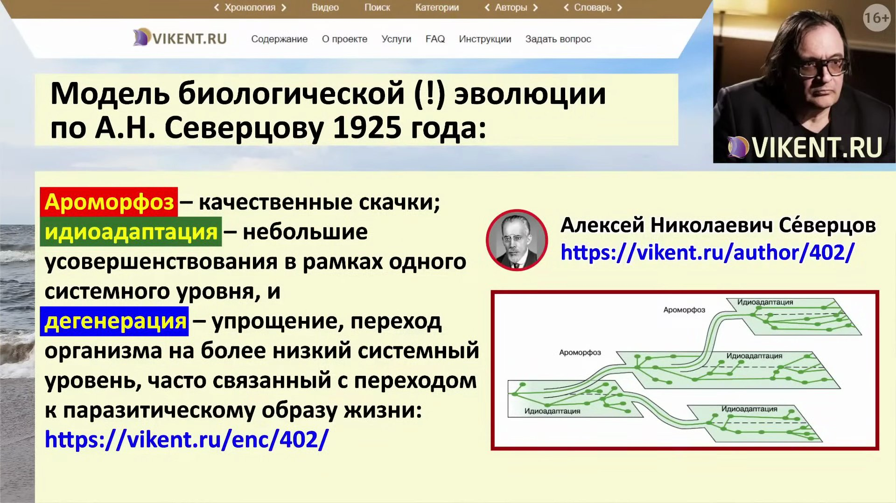

Соответственно, как бы ещё в 1925 году на похожие вещи только для биологических систем вышел Алексей Николаевич Северцев. Ударение на первое и так далее. Судя по переписке с Генахом Саучем Альшувым, по крайней мере, до моего сообщения он об этом не знал. Давайте там другие немножко термины и для биологических систем. Итак, соответственно, есть скачки. Есть скачки. Вы видите, как люди ароморфоз, это по север, переходят как бы с одного качественного уровня на другой как качественный уровень. Далее в некоторые плоскости, несколько плоскостики идут небольшие усовершенствования, небольшие доделки, соответственно, и Северцев называл это идеоадаптацией, иадаптацией и так далее. Надо сказать ещё раньше, соответственно, Алексея Николаевича Серцева. Об этом писал и физик, и философ Велигим Остольт, что есть учёные романтики, их удел делать скачки, делать прорыв. Есть учёные классики, которые вычерпывают вот то, что то, что как бы в плоскость, то есть иоадаптацией занимаются. Генхуч Альшули и прожил свою жизнь, и занимался ЖСТЛ. Каждый шаг - это скачок над собой и над, соответственно, внешними обстоятельствами. Приэто ещё раз, ещё раз, каждый шаг, динамическая система и творец, развивающаяся личность должна быть внутренне готова получать как бы даже от учеников как бы неблагодарность, даже от учеников, ну, и так далее, букет хамства, ну, и прочее, прочее, прочее, прочее. Идёмте дальше. Соответственно, с чем сравнить Альшулер? Вот, пожалуйста, было некое движение в рамках СЕФ. Совета за экономической взаимопомощи, который возглавлял профессор Александр Иванович Половинкин.

---

## [00:35:00]

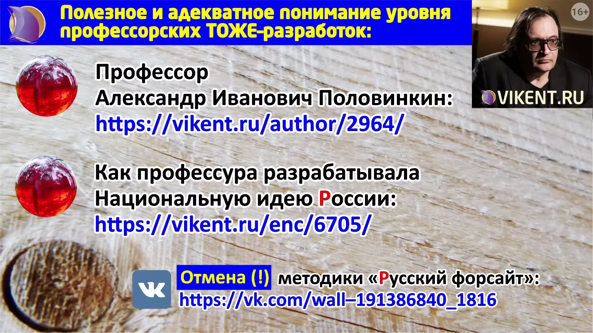

Мой совет внимательно прочитать страничка текста, как жил человек, ректор Волгоградского политеха. Вот. И чем он закончил? Он уже умер. Далее очень желательно посмотреть, как профессура, философская профессура не разработала национальную идею России. Было две попытки. Далее, как, соответственно, агентство стратегических инициатив сначала просто провалило, но потом закрыло методику, методику как бы как бы скачков под названием русский фарсайт. Кто хочет серьёзно заниматься и понимать интеллектуальный уровень, в том числе профессуры, вот, ну, мой совет, мой совет - это дело, мой совет - это дело изучить. Читать надо, естественно, не торопясь, не под телевизом. Кроме этого, кроме этого, давайте посмотрим видео. Давайте посмотрим видео. Смотрите, есть видео, они есть и ВКонтакте, и на Ютубе.

---

## [00:36:00]

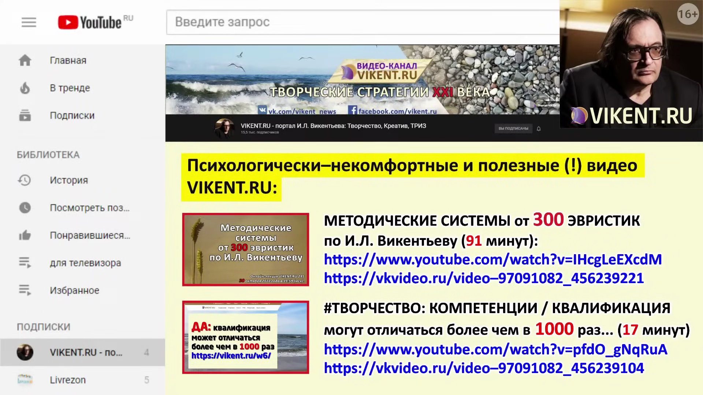

Соответственно, вот психологически это очень некомфортно. Соответственно, по второму видео, что уровник квалификации компетенции у людей, которые говорят похожие слова, может отличаться более чем в 1.000 раз. на самом деле в 3. 000 раз, в 5.000 раз по проверяемым параметрам. Вот второе видео у амбициозных людей обычно вызывает истерику. Это неправильная реакция, это реакция пачелогической защиты. Правильная реакция понимать, что перед вами незатоптанный океан, ещё незатоптанный океан. И на курсе викенд единственным в стране вам за счёт пенсионера Викентьева и его учеников вам помогают не делать глупости. Ну, кто услышал, тот молодец. Кто не услышал, вот спецпросьба, когда соберётесь помирать, есть такая традиция, не надо звонить мне и каяться в ваших ошибках. У Тризов уже есть такая традиция. Пожалуйста, я занят, не надо меня беспокоить. Идёмте дальше. Иерусалим. Смотрим, смотрим следующий слайд.

---

## [00:37:15]

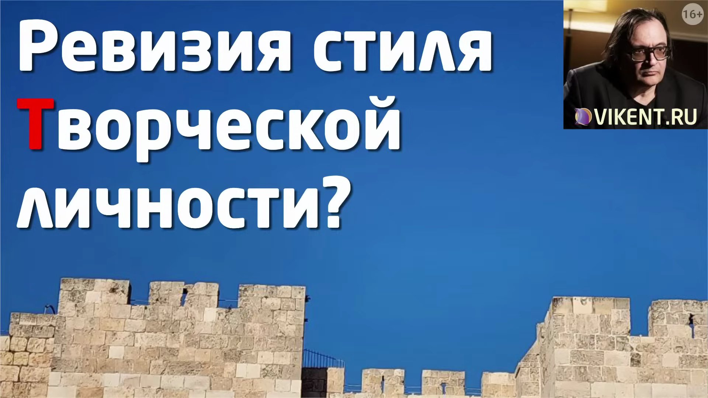

Итак, вопрос из Москвы. Вопрос из Москвы и так далее. Вот как бы действительно действительно вот некоторый гасмейсер, некоторый гасьмир, он как бы вот немножко отдыхает, берёт паузу, что-то ещё.

---

## [00:37:30]

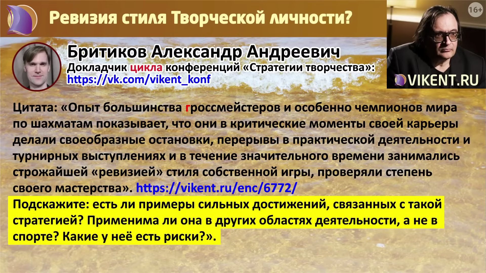

Вот на мой взгляд, то есть такое, ну и как бы если почитать каких-то акультетников, мистиков, то мне раз в неделю примерно ВКонтакте попадается. Как бы я не чистил свою ленту ВКонтакте, всё равно они полезают, то иногда нужно взять паузу и так далее. Вот, на мой взгляд, это некая ошибка. То есть то есть условно говоря, нельзя здесь нельзя путать две вещи. Значит, на мой взгляд, здесь уважаемый Гасместер, он как бы перепутал две вещи. То есть, если вам нужно отдохнуть, я сторонник, хотя теории такой нету, как бы отдыха в течение дня. Отдыха. У меня бешеная нагрузка, причём десятилетиями бешеная нагрузка, и я научился отдыхать в течение дня. Не факт, что вы сможете повторить. Я сделал ошибку, не записывая промежуточные стадии. То есть вот нынешние отдыхи не факт, что вы сможете повторить. Другое дело - это как бы переосмысление. Для пересмыслений, в отличие отдыха, соответственно, у нас есть конференции, конференции, которые вдохновляют, позволяют себя сравнивать с лучшими. У нас есть открытые консультации, каждая третья неделя месяца открытые и бесплатные, то есть бесплатные за мой счёт. Они стоят денег, но это делается за мой счёт. И, соответственно, закрытые тоже бесплатные консультации, они идут весь день, с утра до ночи. Были даже рекордные вещи, когда хитрый Сергей Александрович Резников консультировался в районе часа ночи уже понедельник. Уже уже понедельника. Такое тоже бывало. Соответственно, вот на конференциях и на консультациях можно определять стратегию. стратегию самостоятельно определять. Как правило, как правило, ну, моя база данных, а она на сегодняшний день крупнейшая, скорее всего, в мире показывает, что, ну, это не очень хорошо. Это не очень хорошо. Долже должен быть результативный наставник. Не верите? Ну, пожалуйста, делайте пробы. Пожалуйста, делайте пробы. Я не уговариваю. Не уговариваю. Чем больше живу, тем меньше уговариваю. Я предоставляю возможность, это правда, но не уговариваю. Давайте посмотрим ссылочку. Соответственно, кто не знает, у нас запланировано семь пока бесплатных онлайн-конференций.

---

## [00:40:00]

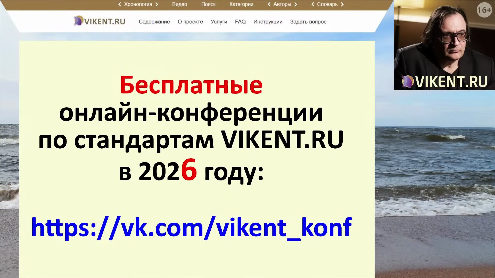

Соответственно, они стоят сверху вот этого вот открытого сообщества. Соответственно, просьба, а, делайте репосты. Второе, задавать вопросы организаторам. Они все там перечислены. Кто хочет регистрироваться, кто хочет быть докладчиком, пожалуйста, как бы сообщите об этом организаторе. Начнём готовиться. У нас 2 ноября, следующее воскресенье, занятий не будет. Весь день, соответственно, где-то там с 11:00, соответственно, до 10:00 вечера, по крайнем пока, может больше 10, больше, чем до 10:00 вечера, идут закрытые консультации именно по докладам двадцать шестого года. Соответственно, хотите быть докладчиком, не тяните, не тяните, не тяните. Соответственно, давайте идёмте дальше. Альшулию конфликты, соответственно, давайте смотрим дальше, да, это фотография Надежды Владимировны Братчиково. Это Газпром в Питере. Ну, просто она хитро вывернула это дело.

---

## [00:41:00]

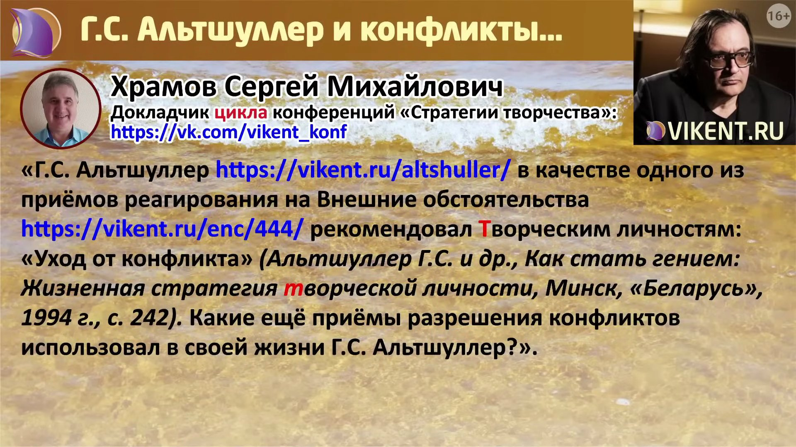

Соответственно, Сергей Михайлович Храмов, город Брест, занимается конфликтами, и он спрашивает про конфликты. Значит, в личном обсщении Геннавич Альшули был, а, воспитан, деликатен, как бы не играл на обострение. Аналогичная стратегия была у Дмитрия Дмитриевича Шестаковича, то есть деликатен, воспитантен и так далее. Вот. Значит, и у Альшуля, и у Шестаковича, ну, и также у других людей это мгновенно заканчивалось, когда когда некие-то общения, разговоры начинали заниматься, начинали касаться дела. Одно из первых одно из первых изданий Жизнь стратегии творческой личности было выпущено в Ангарске. Набор делали какие-то алкаши в типографии. Там просто было много грамматических ошибок. Суть это не изменяла, но Гендерик Альшули отказался распространять этот тираж. Ну, весь тираж перешёл в макуатуру. Весь тираж пришёл в макуатуру. Соответственно, скажем, он был, скажем, жесток, когда дело и нетерпим, когда дело касалось вот таких вот важных моментов. Значит, соответственно, привожу в один пример, я его уже один раз рассказывал, соответственно, который в данном случае посчитал нужным рассказать. Итак, происходит очередной конференция в Петрозаводским, куда потом тогда он ездил ещё из Баку, соответственно, переехал в Ашулию. Ашулию плохо себя чувствует, это видно. Это, в принципе, всем людям, кто просто внимательно смотрит на шефа, это очевидно. И, соответственно, по инициативе одного не очень умного петзавод петрозаводца, соответственно, зачем-то был приглашён на съезд Борис Палыч Никитизин. Напоминаю, это человек, который там своими детьми заставлял ходить по снегу, там пыгать заборов, снег, что-то ещё. То есть как бы как бы воспитание вот такого человека талантливого и так далее, да, как бы. И, соответственно, Альшулер с казался больным, и он не присутствовал на выступлении Бориса Павловича Никитина. Вот это Борис Павлович Никитина выступает. Я с ним переписывался с Борис Павловичем Никитиным. И наша семья всегда выписывала, то есть килограммы литературы. То есть вот мы всегда ходили на почту, потому что всё это не запихивалось в почтовый ящик. Вот. И, соответственно, было такое неплохое издание за рубежом, я бы сказал бы, советский Facebook, где опубликовалось, что где делается. И, соответственно, мне было не лень. Я боюсь Павловичу Никитину выслал большое количество заметок. Ну, большое, десятки. Десятки заметок. Типа того, что в префектуре такой-то в Японии выяснили врачи на шестнадцати испытуемых мамах японских, что не просто нужно прикладывать ребёнка груди и напивать, а 10 минут к правой стороне груди не кормление, а после прикладывания напивать, а потом 10 минут к левой стороне груди. Ну и так далее. Вот. Вот. И соответственно, скажем, Борис Палыч Никитин, соответственно, откровенно попсил. То есть он задавал, как он попсил, то есть то есть он пересказывал эти заметки, не зная, что я присутствую на этом же съезде, в таком стиле. А почему все японцы умные? Учитывая, что мне пришлось как патентоведу много работать с японским патентом, могу сказать, что японские патенты одни из самых глупых. Если сравнивать как бы, например, с американскими, то даже просто стыдно сравнивать, как бы, и так далее, и так далее. Вот. Потому что все японские матери, то есть не какой-то опыт в каком-то университете в префектуре. Все японские матери сначала на 10 минут к левой груди, потом к правой груди и так далее. Когда это повторилось раз пятый, я понял, что Борис Павлович Никитин, уважаемый, соответственно, он так попсит, и ему просто нравится внимание. И вот он закончил, он закончил, входит альшур, то есть в оговорённое время, и, соответственно, около 100 человек, вы сегодня их увидите, они просто-напросто уходят, уходят за Борис Павловиче Никитина фае он продолжает вещать. То есть Геннахч Ашули видеть своих своих учеников человек пять, то есть остался я и ещё несколько человек, но, к сожалению, я не сфотографировал и так далее. Вот. Ну, это просто-напросто к качеству, просто качеству как бы людей, качеству конфликтов, ну, и так далее, и так далее, и так далее, и так далее. Вый случай Альшулер был взбе взбешен, потому что как опытный лектор, он, вероятно, последние реплики Никитина слышал и как бы, ну, мог оценить его уровни. То есть, соответственно, то есть можно как бы съезду конференции ТИС, соответственно, рассказать что-то из за рубежом, и она просто вся покинет шефа и уйдёт слушать фае, значит, какие-то, ну, не очень инструментальные рассказы. Давайте послушаем. Давайте посмотрим. Давайте посмотрим ещё раз.

---

## [00:46:15]

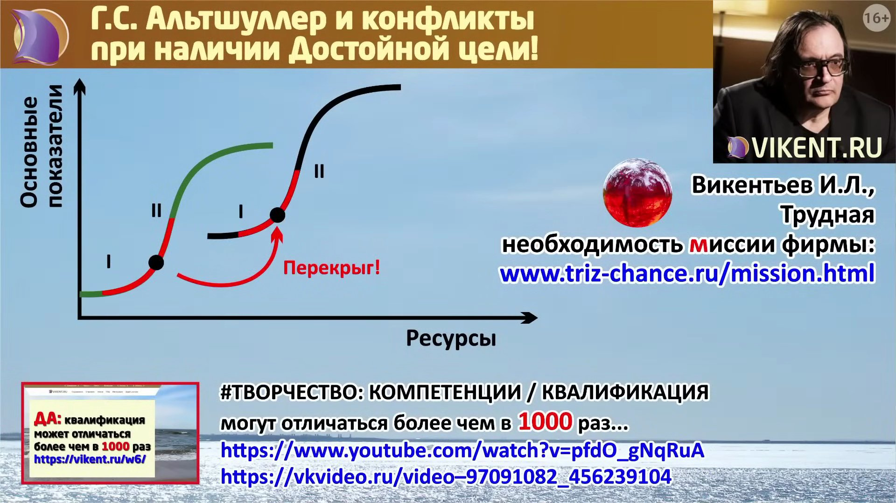

Соответственно, перепрыг Темнин подсказал Сергей Владимирович Крупенин. Извините, что в прошлый раз я забыл. очень удачный перепык. Я уже раньше немножко обосновал, это уже мои данные, что вот как бы эти сообразные краевые, их много образуют лестницу. И если вы хотите быть немножко независимы, немножко независимы как бы в том числе от себя самого, не как Борис Павлович Никитин, то, соответственно, мой совет вам делать пипги. Большое спасибо и извинения Сергеем Владимировичем Крупениным и так далее, и так далее, и так далее, и так далее. Вот как бы, да. Так вот, теперь продолжаю какие-то принципиальные вещи. Соответственно, и Альшулер сам рассказывал про себя, и ученики рассказывали три истории вот про его принципиальность. Итак, очередной семинар на Урале. И люди отпечатали Арис и от большого ума, соответственно, они поставили, что автор Арис не Альшулью, а, соответственно, два преподавателя этого какого-то местного института повышения квалификации. Семинар начался так. Генсувич Альшу попросил одного из преподавателей Триф взять помойное ведро. Помойное ведро и всех участников семинара, которому выслана методичка, соответственно, вырвать первый лист, первый и, значит, соответственно, погрузить в помонное ведро. Поэтому преподаватели, которые сду поставили свои фамилии, это называется плагиат, они при этом присутствовали. другой другой семинар не на Урале, не помню где. Соответственно, какая-то конференция, но не тризовская, чужая конференция. И присутствуют некоторые комсомольский деятель в такой в стиле такого комсомольского бодрячества шуткует, естественно, ни в ТИС, ни в РТВ. Ажастни, может быть, ещ не понимают. Соответственно, Гену выходит докладывать и из песни слова не выкинет. объявляет, что я буду выступать после того, как будет убран  с микрофоном. Это было ещё и в СССР. Ну, вы понимаете, да? Соответственно, журнал из Третья байка, журнал Изобретатель и рационализатор наконец поумнел, как бы до этого он глумился над трудами Генрикса Учальшу. профильный журнал глумился к вопросу о внешних обстоятельствах и, соответственно, как бы подлагает предлагает из методического текста часть часть убрать, потому что у нас там какой-то сельхозюбилей, места в журнале не хватает и так далее. Вот на что, соответственно, Генсульшу просит передачи руководству одному из руководителей разговор идёт по телефону как бы что он подчинённых посить передать начальнику. Соответственно, то есть в принципиальных вопросах как бы ни в выражениях, ни в действиях Лена Выцавич не стеснялся. И могу сказать на на длительном как бы на длительном пути, что он был прав. Он был прав. Большинство вот таких вот людей хороших слов не понимают, а для всех остальных ещё и ещё раз дико некомфортноя по нервам, что компетенция людей, говорящих внешне похожие слова, может отличаться в 1. 000, 3.000, 5.000 раз, ну и так далее, и так далее, и так далее. Вот. А мы переходим к следующему ответу. Я немножко тороплюсь, потому что вы мне 90 слайдов надо всё-таки не растягивать. Давайте следующий слайд, да? Соответственно, моя фотография, соответственно, лестница в Бесуповском саду, который виден у меня из окна.

---

## [00:49:45]

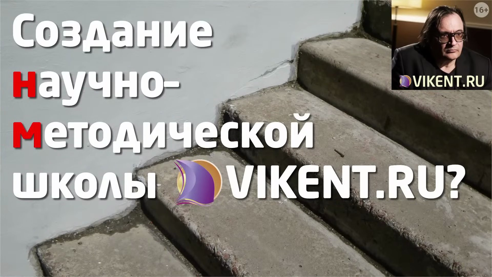

Давайте посмотрим вопрос Ксения Александроны Калугиной. Значит, у Ксени Александро Калугиной скоро конференция в конце января.

---

## [00:50:00]

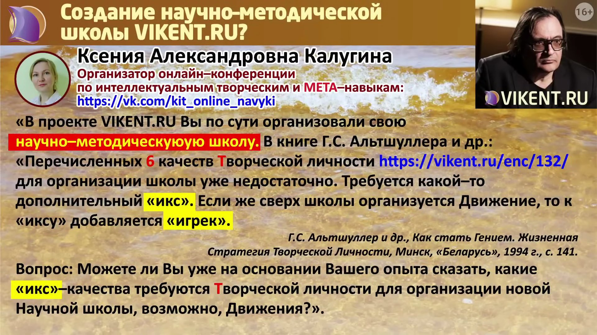

Вот вы видите там, чему она будет посвящена. Советую записываться. Советую записываться. Отсутствие интеллектуальных навыков - это то, что сожрало сожрало большинство тызовцев. тезисов, которые не реализовались, которые не реализовались и так далее. Вот, соответственно, соответственно, дальше некота. Надеюсь, вы прочитали, прочитали. И, соответственно, я здесь буду отвечать не полностью, поскольку у меня есть свои соображения, но мне сегодня я рассказываю не о своих соображениях, а про гения XX века Геннаха Совича Альшулера. Давайте посмотрим. Давайте посмотрим некоторые примеры. Человек, ну, скажем, тоже гений XX века.

---

## [00:50:45]

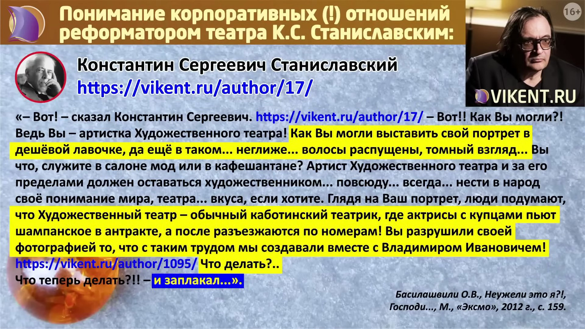

Итак, некая молодая актриса, ну, естественно, в голове у неё ветер, она снялась в Москве, как бы у фотографа даже не голый, даже не голый, как бы, а просто у неё были распущенные, у неё просто были распущенные волосы. Константин Сергеевич Станиславский, который положил на свои театры и на свою теорию жизнь в буквальном смысле слова, как бы он просто увидел, что она немножко немножко вульгарно выглядит. Я как бы становлюсь религиозным, кажу такую фразу: "Слава богу, что Константин Сергеевич не видел ленту ВКонтакте или в Фейсбуке. Слава богу". И заплакал. И заплакал, как бы. Ну дура ученица. Ну что я могу сказать? Дура ученица, как бы, да, дура ученица. Так, давайте дальше посмотрим. Дальше посмотрим, как же, да, далее.

---

## [00:51:45]

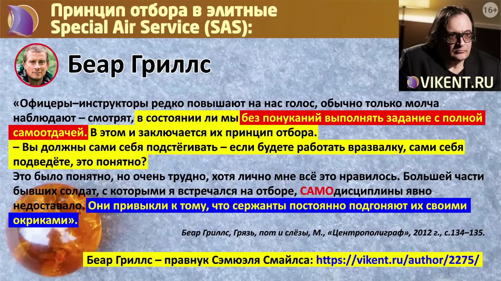

Очень известный английский выживальщик, выживальщик Биах Грилс, правнук Самуэла Смайлса, который в XIX веке начал начинал писать книжки по самосовершенствованию. И, соответственно, скажем, это принцип отбора в элитные, в элитные, ну, фактически десантные части. И Биарх Гриус описывает, я там, ну, как бы взял самый такой вкусный кусок. Он описывает, естественно, несколько подробно. Кто хочет почитать, пожалуйста. Вот эта книжка есть. Ну, похоже, самое удачное я сделал. То есть речь идёт о создании школы. То есть, соответственно, когда Генна Сувич умер, к сожалению, школа стала очень стремительно разваливаться. К сожалению, он даже это как бы предсказывал и так далее, и так далее, и так далее. К сожалению. Дальше давайте быстренько покажем слайды. Слайды это мои ответы. Зачем я делаю? Значит, очередная консультация у нас 16 ноября. Я ничего не зачитываю, ни у чего не комментирую.

---

## [00:52:45]

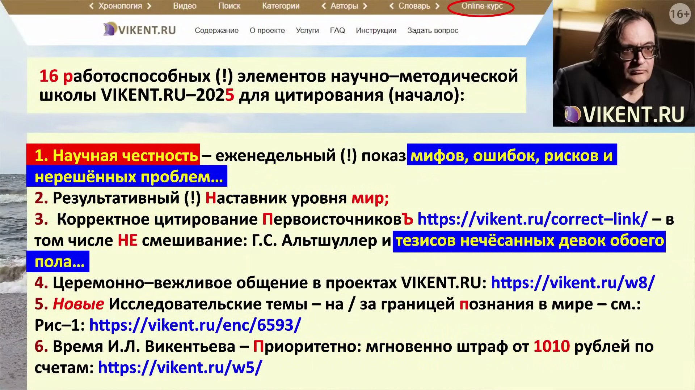

Я даю как бы такую наживку. Кто хочет, задавайте подробнее поговорим, потому что Ксения Александровна спросила, грамотно спросила, у неё конференция, ну, как бы нехорошо рассказывать о себе. Ну, как бы, ну, скажем так, в духовном присутствии Генуча Альшува. Поэтому это не более, чем платформа для ваших вопросов. Давайте следующий слайд. Ничего не рассказываю. Шестнадцатого готов отвечать. Просто помечайте, помечайте пункты, помечайте вопросы. Давайте дальше. Давайте дальше, да? Давайте, давайте дальше и так далее, так далее, и так далее.

---

## [00:53:30]

Вот, соответственно, да, и, соответственно, дополнение к этому слова - это электронная версия бесплатная. Вот тут я недавно как бы дважды его перечитал, дважды, честно говоря, подзабыл. Там безумное количество примеров незацитированных. Незацитированных помимо как бы содержания. Стоит стоит подчитывать. Стоит подчитывать. Лично я подчитывал бумажную версию. Может быть, в издательстве они остались, но бумажная версия стоит денег. И это правильно. Идена хорошо. Ильна хорошо и так далее, и так далее, и так далее, как бы, да. Вот как бы так далее. Давайте, давайте. Соответственно, фотография, насколько я понимаю, сколок стекла сделана Иваномчевым Чегириным, город Москва. Вот Москва. Спасибо. Спасибо. Смотрим вопрос.

---

## [00:54:15]

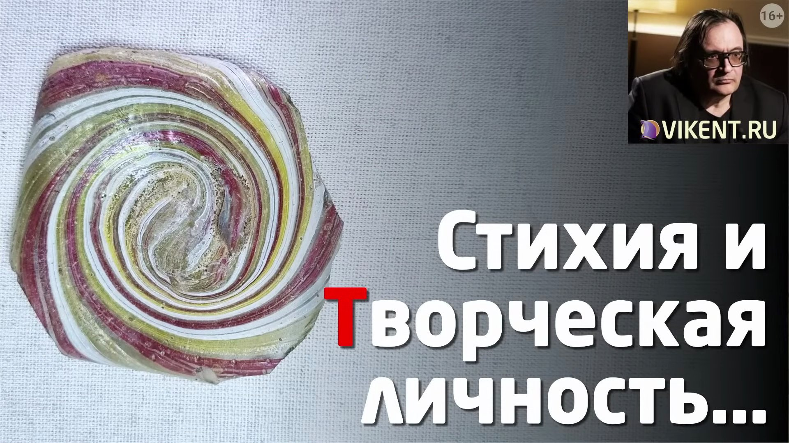

Смотрим вопрос. Сам сам Альшули продиагностировал, что сильного ответа, сильного ответа у него нет. Сильного ответа. И так, внимательно читая, Сергей Киевович, Кирил Сергеевич Гудович на нам это дело процитировал.

---

## [00:54:30]

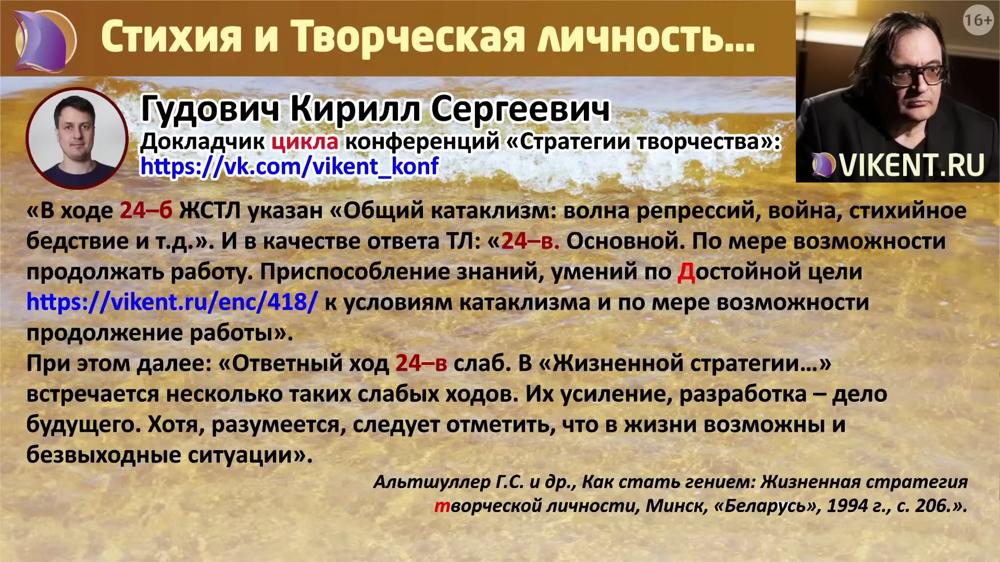

Нам это дело процитировал. Соответственно, соответственно в разные годы ещё не было ЖСТЛ опубликовано, Геннасович Айшулер говорил такую максимум. В книжках этого нет, что в принципе ну желательно пытаться прогнозировать. Вторая фраза, которая очень часто рядышком шла с этим, что, соответственно, человечество не придумывало некую экспресс-диагностику, экспресс-быструю диагностику дураков. То есть вокруг Геннекса Учальшу и очно, и заочно вертелось очень много, в том числе странных людей, но, соответственно, вот как бы их диагностировать, их диагностировать как бы вот быстро не получалось. Поэтому частично, частично, соответственно, значит, ответ Генеча Альшулера - это прогноз. Это первый ответ. Второй. Ну, второй, нужно делать какую-то диагностику дураков. Частично в моём курсе диагностика дураков, хамов, не умеющих себя вести и так далее. Вот частично это сделал. Я много раз это показывал, но сегодня вечер Альшулера, а не мой, поэтому, кто не знает, запрашивайте, напишу, как бы, да. Соответственно, от себя могу добавить, что масса тризосов, естественно, бесплатно, как бы оно как бы бедствовало, оно бесплатно походило обучение в девяностых на моих семинарах. Как только как только, соответственно, какой-то очередной ты появлялся на моём семинаре по бизнесу, как бы моя какая-то очередная жена это выучила уже, и, соответственно, тризус что-то откалывал чрезвычайное странное. Чрезвычайно странное. Значит, как бы самое мягкое, что откалывало Тризус, когда люди все представлялись на семинарах, они говорили следующее, что вот эту вот бизнес-силую мы разрабатываем вместе с Игорем Леонардовичем Викентием, что является стопроцентной ложью. То есть я разрабатывал. Более того, тызовцы были не способны делать вычистки. Ну, заявлять публично на семинаре, что мы разрабатываем их вместе, не спрашиваем моего согласия, это тезисы были гораздо. Как-то сама по себе всплывала фраза Альшулера, что надо прогнозировать. Сейчас трисы по возможности просто не допускаются, просто не допускаются на какие-то наши мероприятия, но чтобы не было неприятностей. Ну, давайте дальше, давайте дальше посмотрим, да. Вот, соответственно, скажем, несколько материалов. Несколько материалов у это не совсем Альшулера. 131 материал Альшулера сверху идут вне конкуренции.

---

## [00:57:30]

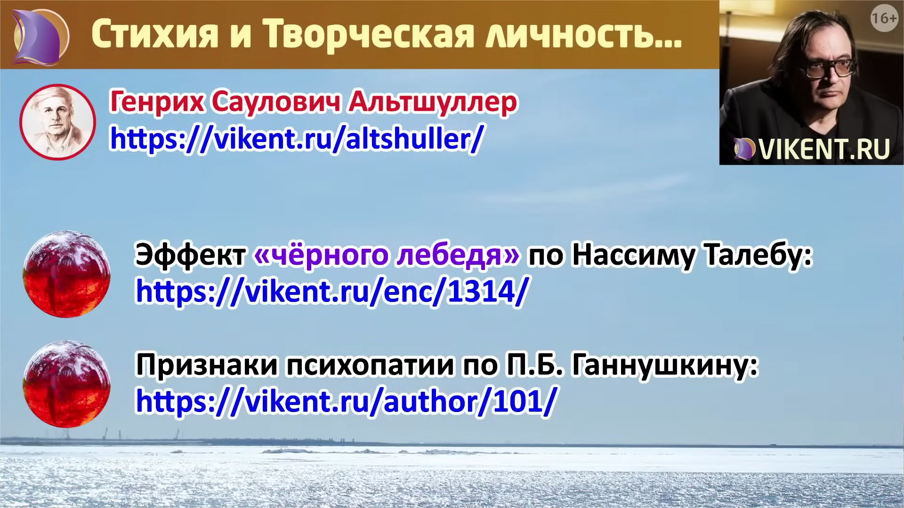

Соответственно, пример, который я приводил в ответ в ответить Кирилу Сергеевичу Гутовичу ВКонтакте, что, например, Дмитрий Дмитриевич Состакович вместе с работниками консерватории. Консерватория у меня под боком здесь рядышком как бы с одной стороны суповский сад, с другой стороны консерватория питерская, Ленинградская имени Рымского Корсакова, имени Рымского Корсакова на трамвая доезжал то, что сейчас называется Ленинский проспект. Тогда Ленинского проспекта в Ленинграде не было. Вот и там рыл окопы. Шатакович рыл не умел. Рыть не умел, быстро уставал. Но как человек такой добросовестно, как бы он себе купил специальную лопату, чтобы рыть и так далее, и так далее. Очень ответственно к этому относился, рыть не умел. Исследователи творчества Шестаковича считают, что, ну, легендарная, она же седьмая, она же ленинградская, она же блокая симфония седьмая, которая исполнялась, соответственно, в дни блокады в Питере. Сейчас даже вышел фильм по этому поводу. Соответственно, как бы, ну вот вот если бы не личные переживания Шастаковича, который потом переехал, был перевезён в Куйбышев, она, скажем, многое ему дала, то есть, ну, многое дала. Ну, я не специалист по Шестаковичу. Ну, в данном случае я цитирую близко. То есть, соответственно, скажем, с точки зрения экспансии Творис даже неблагоприятные обстоятельства пытается использовать для своего творчества. Повторяю, Альшули считал этот ход слабо разработанным. Идёмте дальше. Фотография Ивана Ивановича Чегиерина. Идёмте дальше. Да, идёмте дальше. Идёмте дальше.

---

## [00:59:15]

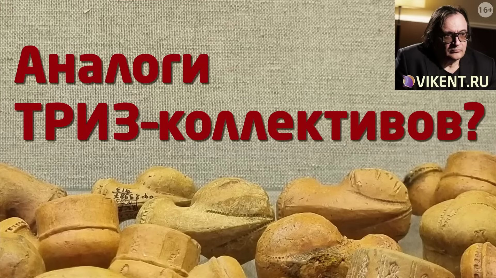

Итак, Кисана Татьяна Владимировна, город Уфа, как бы, соответственно, вы видите, вы видите и так далее. Вот как бы, да, соответственно, соответственно как бы в трис школах, в три школах ишло это от Альшулера.

---

## [00:59:30]

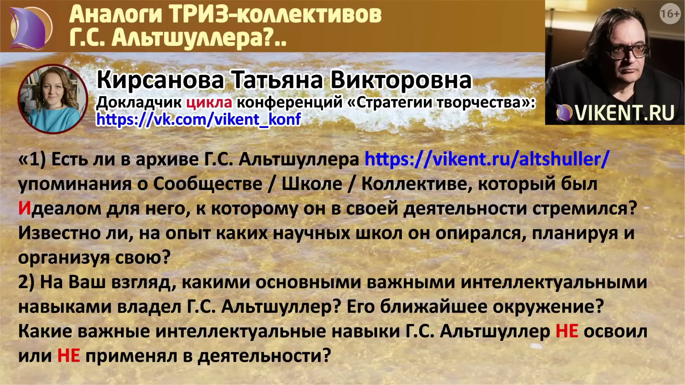

Преподаватели очень жёстко дело происходило в советские времена всегда находился идиот, который начинал говорить, что а давайте помыслим, допустим, политику СССР с помощью триза. Вот. То есть, соответственно, в принципе, и сейчас можно получить за подобные вещи, но тогда можно было с гарантией просто-напросто и быть закрытой школу Трис и подвести преподавателя. Ну, такой обычно появлялся. Поэтому преподаватели ТИС по указанию Генрихсовича Айшули очень жёстко оговаривали, что в школе ТИС занимаются только только ТРИС, железками, изобретательством. Но политикой мы не занимаемся. политикой мы не занимаемся, да, соответственно, соответственно методом исключения, то есть, соответственно, ряд тезисов приезжали, привозжали Генусовуча Альшу в Баку пообщаться лично и оформляли командировку у отколовшихся от него ученичков. Соответственно, есть справка от Генасовича Альшулева, она у меня тоже есть. Соответственно, о том, что, соответственно, вы определитесь, то есть если вы отмечаете справку у отколовшихся учеников, ну, пусть они вас и консультируют. Если вы, соответственно, приезжаете ко мне, то, ну, вот не будет отмеченной командировки, как бы, да. Соответственно, журнал Трис, членом коллегии которого я являлся, соответственно, и много я сделал, чтобы он вообще существовал на этом свете. открылся в девяносто первом году. Поэтому единственный, то есть, ну да, с тем, чтобы было позвонить в СССР по некоторым направлениям, нужно межгород, тем более за границу заказывать за несколько дней телефонный звонок. Поэтому, соответственно, методом исключения реальный путь размножения материалов, соответственно, это пишущие машинки. И семья в Баку извела пять пишущих машинок, печатая справки Альшули о новой разработке на папиросной бумаги. Значит, зовцы о вкладе семьи слышать не хотят, денег платить не хотят, упоминать семью не хотят, ну, ведут себя как, ну, мягко говоря, недостойные люди. Поэтому, соответственно, как бы вот некая такая вот как бы аналог интернет, но с помощью папиросной бумаги Альшулер выставил, вероятно с нуля. То есть семья не знает аналоги каких коллективов использовал Генносчашую. Я тоже не знаю как бы какие аналоги. Если кто-то знает, какие аналоги он использовал, ну, соответственно, пожалуйста, напишите под этим видео по нашим правилам. Ну, давайте дальше. немножко. Давайте немножко дальше. Соответственно, пункт три. Пункт три мы по показываем. У нас были занятия, пожалуйста, к электронной книге. Всё, что касается противоречия, там есть.

---

## [01:02:30]

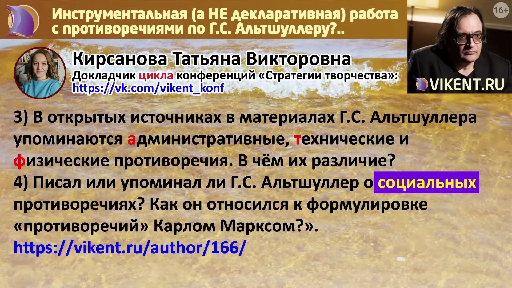

Сразу предупреждаю, без личного прорешего несколько десятков задач на противоречие тема будет неусвоена. Соответственно, заниматься Карл Максом бесполезно. Бесполезно. Соответственно, вы можете прочитать историю винтовки Фридериха Энгельса. Там он формулирует противоречие, но это не более чем несколько примеров. Несколько примеров. Соответственно, некоторые вещи, которые и тызовс и масса интеллектуалов не понимают. Соответственно, Карл Макс, Фдих Энгельс, они говорили о том, что будет грядущая эволюция. Эволюция случилась в России в 917 году. Хотя, по идее, должна была случиться в Европе. И, соответственно, Иосиф Бесаронович Сталин требовал от интеллектуалов создать какое-то учение по поводу социализма. Соответственно, сейчас принято хихикать. Соответственно, интеллектуалы СССР такой курс создать не смогли. Соответственно, Сталин за своим авторством сделал компелятивный, так называемый, краткий курс, изданный в 1938 году. Да, это компелятивно, да, заставляли заучивать и так далее, и так далее. Вот. Но нужно понимать, что Маркс, Энгельс, Ленин не слабые, не слабые люди, но как бы теории социализма они не создали. Соответственно, поэтому приходится делать компиляцию. краткий курс Сталина, над которым сейчас принято смеяться. Ну а вы сделаете национальную идею России. Соответственно, несколько раз на философском факультете, соответственно, в Питере её пытались сделать по по заказу правящей партии. И профессора философии это дело провалили. Кто прозевал ссылку, ну, запрашивайте дам. Соответственно, окончилась Вторая мировая война. В Кэмль ночью был вызван логик асмус. И, соответственно, попыхивая трубкой, Сталин ему сказал, что, соответственно, нахкомы не умеют думать, члены правительства не умеют думать. И он заставил Асмуса, соответственно, выпустить в 1947 году учебник логики. Соответственно, я не против логики. Ну, как бы у нас было много курсов логики в специальной группе, специальной группе. в нашем в нашем вузе и так далее, и так далее. Вот. Но как бы просто сделали, я его слепил из того, что было. Соответственно, в традиционной логике как бы нет, например, скачков. Ну, а по идее наркомов как раз нужно обучать, обучать скачкам, нелинейностям и так далее, и так далее, и так далее. Вот поэтому, соответственно, значит, что я хотел сказать, что противоречие - это одна из моделей, я её излагал. основый, опубликованный в бесплатной электронной книге, но это отдельный курс, это отдельный задачник, который до сих пор не составлен, как бы, да? Соответственно, дальше посмотрим ответ семьи Альшуля. Ответ семья Альшуль. Значит, здесь как бы он просто заковычен, то есть читайте, пожалуйста. И просто такая справка. Нигде в переписки этот человек не упоминается. Поэтому я решил поставить, что, соответственно, вот некий француз, он переписывался.

---

## [01:06:00]

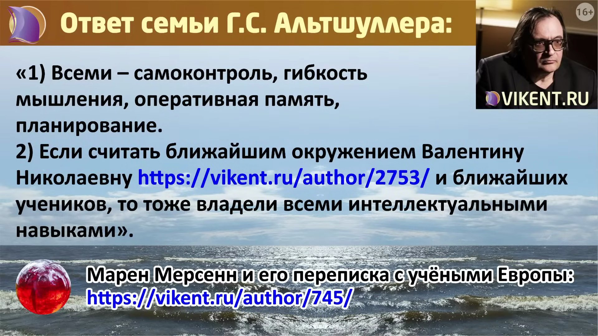

Это было просто. Их всего лишь было несколько десятков. У Альшули количество учеников шло на сотни. Вот, соответственно, он переписывался. Научная переписка. Потом как бы это новая сообразина кривая, ставили появляться некие научные журналы и вперёд как бы, да. Соответственно, дальше давайте покажу типовые работы.

---

## [01:06:30]

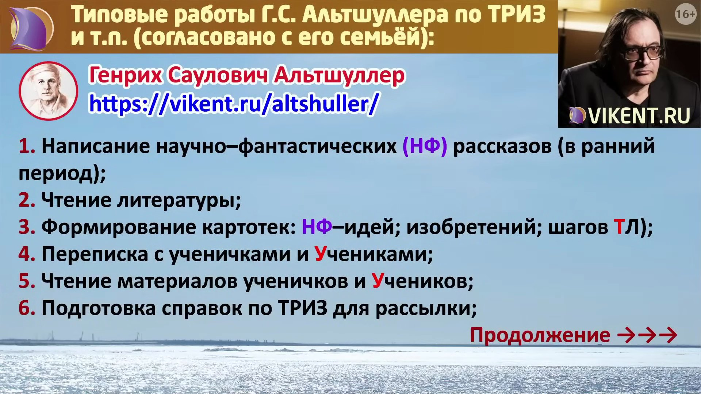

Значит, типовые работы, значит, я вытащил это из переписки и из общения с Альшулевым, показал семье, семья чуть-чуть добавила, соответственно, вот типовые работы Альшура в течение дня, недели и так далее. Вот, соответственно, давайте задавайте вопросы, будем выяснять в семье, буду смотреть в справках Альшули неопубликованных, ну и так далее, и так далее. Давайте следующий слайд. Давайте следующий слайд. Да, фотография из парка дубки в сестрорезке на как бы да. Значит, стоп.

---

## [01:07:00]

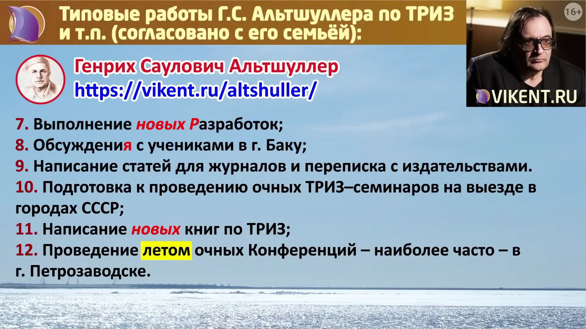

Значит, соответственно, Игорь Леонардович Викинв перешёл из правого верхнего угла в левый в левый угол. В левый угол. Альшу разъяснит и не ищите.

---

## [01:07:15]

Вот, соответственно, вы видите конференция Патрис. Вы видите точную дата у дома культуры машиностроителя. дома культуры и машиностроитель. Вот люди, которые в том числе провалили, провалили то, что завещал гений. Ну, идёмте дальше. Преимущественно провалили. Давайте дальше. Вот система учёта времени по Альшулеру. Соответственно, об этом чуть-чуть есть в книгах Альшулера. В данном случае я вставил как бы некоторое рассуждение.

---

## [01:07:45]

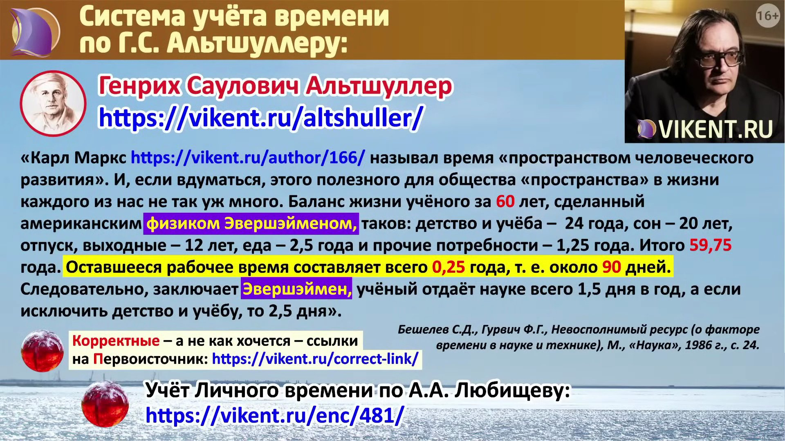

Похожее рассуждение проводил Айшулер, значит, похожие рассуждение проводил Любищих, похожие рассуждения проводил я и так далее. Вот, значит, почему я привёл вот этого человека физика. То есть я решил, думаю, что Альшуву это понравилось. Думаю, это моя гипотеза, потому что это не физик, это некий фармаколог, который вот так вот шутковал, шутковал, как бы выдумав в себе псевдоним физика. На самом деле он хромаколог. Ну, соответственно, очень важная мысль, которая здесь есть, которая есть в тайм-менеджменте, что чистое время на работу, чистое время на работу весьма невелико и желательно потратить его вот, ну, хорошо. То есть вещь, которую я думаю, что мы вот-вот сейчас найдём. То есть у меня гигантский стул, гигантский стул дома. Я думал, что мы сейчас начнём такие очные стажировки в Питере, потому что просто что у меня лежит на столе, как я работаю, на что я отвлекаюсь, на что я не отвлекаюсь, это очень хорошая школа. Ну, как бы сужу по своим питерским ученикам и так далее, и так далее, и так далее. Вот. Ну, я сейчас, мягко говоря, приболел и, мягко говоря, ну, не достажил, к сожалению. Так вот, соответственно, скажем, как бы Ашули очень слненил время. и сделал некую оговолку, как бы, что вот учёт времени по любище, кто не знает, посмотрите, полезно, но Любищев себя держал в ежовых руковицах. Он до пенсии, до старости вёл учёт в тетрядочке. Альшулер бросил вести такой учёт и пользовался, ну, некоторыми примерными оценками и расстановкой приоритетов. Всё, что касалось работы сверхжёстко, мы уже об этом говорили. всё, что как бы, ну, там вторично, третично, как бы, ну, и как бы Господь с ним. То есть это это не так важно. И ещё одно замечание именно от Генекса Учальшилира, что просто сам учёт времени, там поминутный какой-то ещё, он просто жрёт время. То есть как бы как бы это нехорошо, как бы это нехорошо. Ну и, соответственно, кажем, да, как бы учёт личного времени. Ну, давайте дальше посмотрим некие полезные сути. Вот, соответственно, как бы некоторые полезные ссылки, полезные ссылки с товарным знаком нам помогал мой ученик Владимир Валерьевич Усков, вот, который сейчас работает с мэрией Петербургом, лип Филиппом Кирковым, ну и помогал нам, соответственно, как бы вот в этой истории.

---

## [01:10:30]

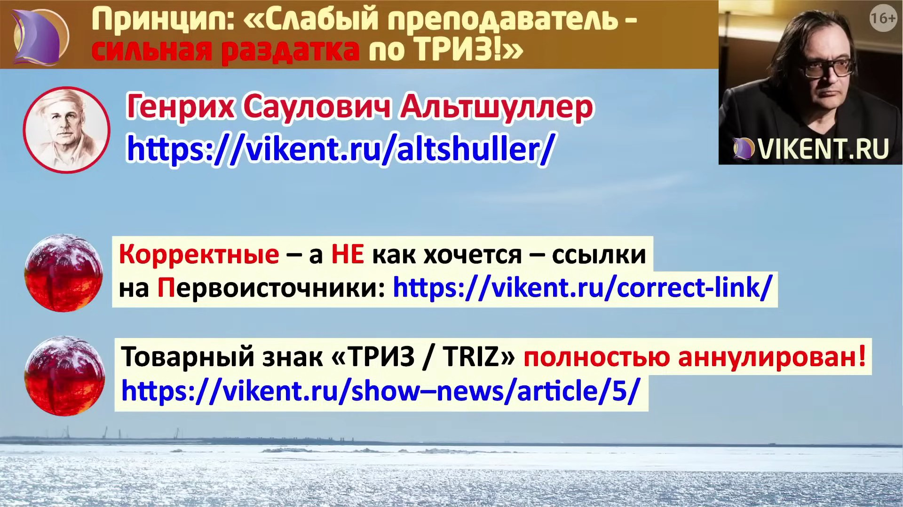

Значит, соответственно, вот в этих работах 131 работа. Вы видите по ссылке Альшулера. Ещё ещё помимо времени, учёта времени, это полезно. Какое-то время этим полезном заниматься. Это должно перейти в интуитивное ощущение. Альшулер постоянно выставлял себе высокие критерии. Высокие критерии есть на каждом шаге GTL. И, соответственно, ориентируйся на них. Если это не так, и вы можете это доказать, милости просим. Пожалуйста, фамилия, имя, отчествотома, сообщайте под видео. Давайте посмотрим по две темы ещё левских. Две темы, давайте две темы. Там, соответственно, тема противоречия. То есть нужен задачник по противоречиям.

---

## [01:11:30]

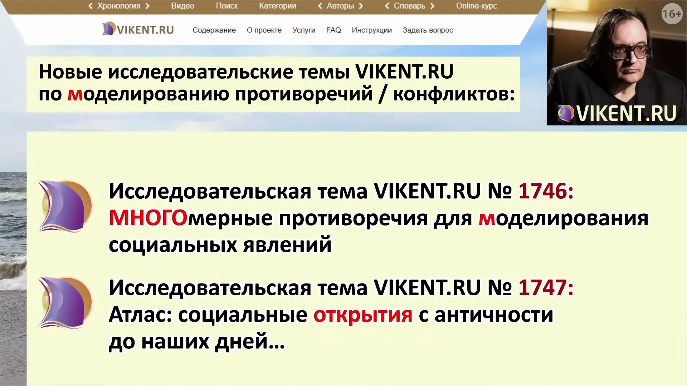

Вот, соответственно, могу сразу сказать, что как бы как только вы переходите к системам типа обратные связи, сетки, многоуровневость, вы одним противоречием не отделаетесь. Точно. Часть работы мною сделана. Вот я понимаю, как её делать. Ну, бессмысленно. И, соответственно, вторая работа не социальные инновации, а социальные открытия с с античности до наших дней. Это такой крупный скачок. Думаю, что есть справка Альшулера двухстраничная, что этим полезно заниматься. То есть базовая идея Альшу. Ну, данная формулировка поднадлежит мне. Ну, а мы идём дальше. Что нам ещё остаётся делать, как бы, да? Ну, вот, соответственно, книжка, где есть раздел по противоречия. Посмотрите, посмотрите. Тема противоречия как бы декларировать в трис, но нужен задачник.

---

## [01:12:30]

Нужен задачник для постановки навыков. Давайте дальше фотографию Надежды Владимировны. Опять Газпром. Опять Газпром. Фотография Надежды Владимировна. Спасибо и за это. Давайте посмотрим. Давайте посмотрим.

---

## [01:12:45]

Так, хорошо. Идём. Соответственно, вот из Объединённых Арабских Эмиратов на русском языке нам как бы написали и так далее. Вот нам написал, значит, как бы Кирил Анатольевич, который в детстве занимался у меня. Значит, некоторые краткий ответ, краткий ответ от самого Геннасовоча я дам.

---

## [01:13:00]

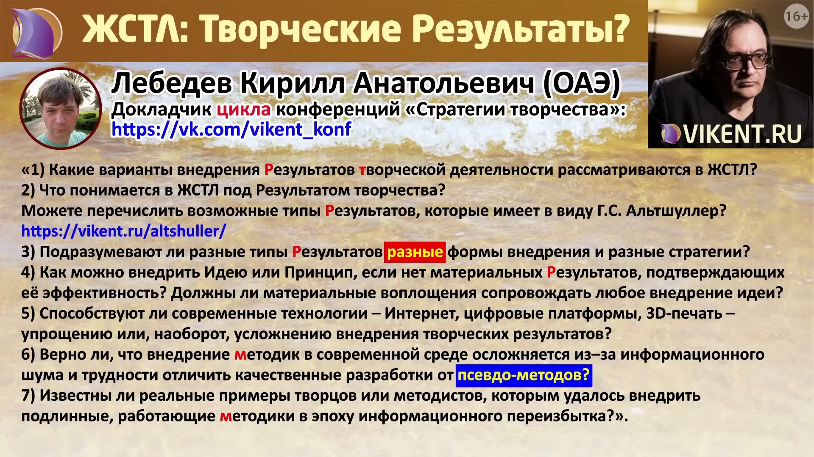

Вот если интересует что-то, я не доотвечу, то есть я постараюсь ответить с птичьего полёта, потому что надо отдать должное Кириллу Анатольевичу. Соответственно, по идее это вот на полтора часа. То есть я постараюсь ответить с птичьего полёта. Если не отвечу, ну, значит, придётся делать в двадцать шестом году полтора часа отвечать на эти вопросы. Значит, сейчас будет. Давайте дальше. Давайте дальше. И вот чрезвычайно внимательно читаем. Через просто читаем. Я отвечаю через некоторую метафору.

---

## [01:13:45]

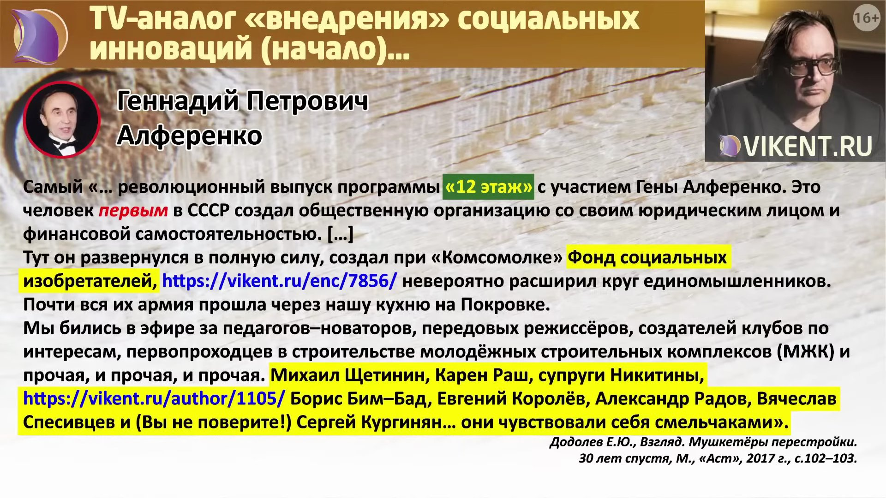

Итак, человек рассказывает. Додолев, Евгений Додолев рассказывает, как на Первом канале, то есть канал очень высокорейтинговый, который смотрит миллионы, который смотрит миллионы, проходит некоторая передача. Вот поэтому те люди, кто придут эту передачу, соответственно, как бы считают себя программа взгляд, что это некие битлы перестройки. так далее, и так далее. Далее перечислены масса людей Михаила Четинина, супруги Никитины, о Никитином посовике я уже сегодня говорю и так далее, и так далее, и так далее. Вот вы видите, некая инициатива человека из города Омск. Омск он в Сибири на всякий случай. Соответственно, это поводу внедрения социальных инноваций. Далее контрольный вопрос. Просто-напросто можете навести справку поводу Геннадия Петровича Аференко. можете навести справки по поводу взгляда. А где, а где? Вот Альшулер создал 3.000 страниц фонд фантастических идей. А какой фонд социальных инноваций создан Геннадий Петрович Алференко с помощью вещания на более десятки миллионов? Десятки миллионов, может быть, сотни миллионов. Может быть сотни миллионов. Пожалуйста, результаты на стол. Пожалуйста, результаты на стол. Кто не не понял, что я сейчас спрашиваю, но смотрит дальше, да? Давайте далее. Частичный ответ. Частичный ответ.

---

## [01:15:30]

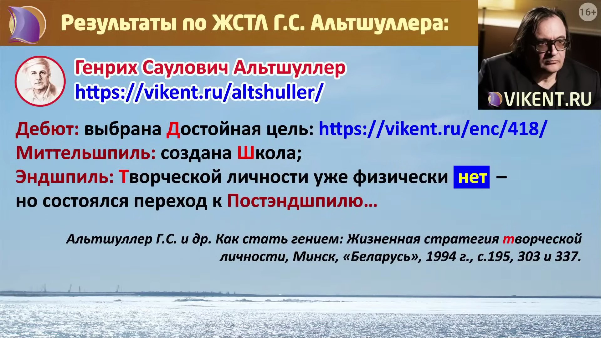

Повто я считаю несколько иначе. Ну, в данном случае сегодня не мой вечер, а гения Альшулера. Значит, первое. Вот есть некая достойная цель без самооправданий. Чистая достойная цель. И дебют. Дебют, юность выбора достойная цель. Митльшпили, шахматный термин. Альшу этого не скрывал. Создана некая школа в двнегреческом смысле, то есть некое сообщество единомышленников, учеников. Эншпиль Эйншпиль и как бы постэншпиль, особенно постэншпиль. Постэншпиль творческой личности физически уже нет. Ну, ну остались приличные ученики. Соответственно, таким неслабым людям, как Ленину, педагогу Куманка, извините, должен глотнуть, физику Ландау создать свои школы, которые бы действовали после их физической смерти, не удалось. Ещё раз. гением, гением, включая самого Альшулера, создать школу, которая плодотворно работает, значит, после его физической смерти, к сожалению, не удалось. Если вы считаете, что в три ученички что-то после смерти, физической смерти не случайшили что-то сделали, пожалуйста, результаты под этим видео, под этим видео, пожалуйста, под этим видео, да, так далее, да. Соответственно, дальше давайте смотрим печальный материал. Если вам за 50 лет, мой совет смотреть. Мой совет смотреть. Соответственно, в комментариях это будет ссылка пока только на Ютубе.

---

## [01:17:15]

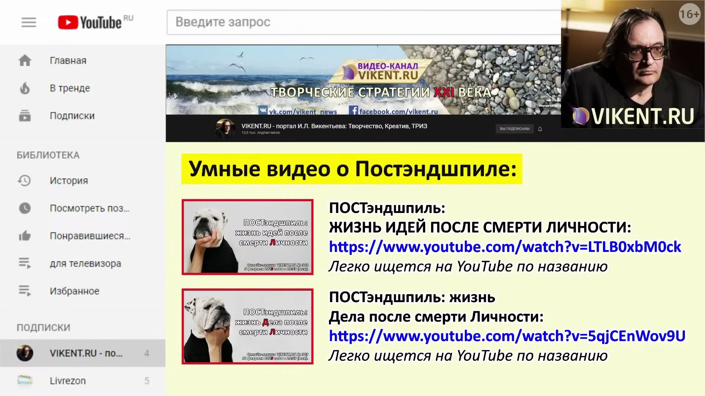

Если очень-очень нужно, просите, будем переносить. Просите, будем переносить. То есть не будете просить, не будем переносить вКонтакт, как бы. То есть это, повторяю, такой интеллектуальный слам. Вот на идее хальшули, но читаю я. А что такое постэншпили, например, можно какой-нибудь примеры Глеана? Ну вот, соответственно, любой юист скажет, что был Наполеон, были его победы и был кодекс Наполеона, который лёг в основу масса конституции различных, ну, относительно развитых стран. То есть Наполеона уже не было, но его идеи, как его кодекс, соответственно, он как бы вот был сделан. были были отцы основатели Америки. Соответственно, вся Южная Америка передрала свои идеи с Конституции Америки, но там творится бардак, управляют наркокартели. То есть, ну, чего-то у них там не получилось. Ну, какие-то не те ученики, латинские американцы. Ну, давайте посмотрим дальше. Дальше я продолжаю отвечать Кириллу. Давайте, значит, итак, продюсер Первого канала Константин Эрст.

---

## [01:18:30]

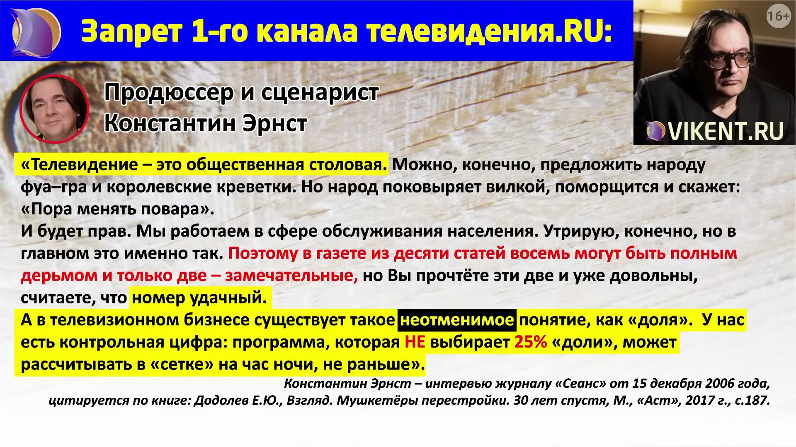

И, соответственно, канал канал соответственно по медиопоказателям работает на таких не самых взыскательных людей, соответственно, скажем, и, соответственно, нужна доля. Соответственно, вот подобные материалы, которые идут сейчас, Первый канал не покажет никогда, поскольку нужна доля. никогда не покажет. Никогда не покажет. Вот. И прочее, прочее, прочее, как бы. Ну, кто не успел прочитать, ну, идёмте дальше, как бы. Идёмте дальше. Завтра почитаете, завтра почитаете, мы идём дальше. Поэтому, если я сейчас там не ответил для Кирилла, для Кирилла это полтора часа. Извините. То есть, ну, не сегодня не помещается. Доспрашивайте, доспрашивайте.

---

## [01:19:15]

Вот, можете сами придумать ответы. Давайте. Итак, понятность жест несовершенному социума. Тоже Иерусалим. Тоже Иерусалим и так далее. Вот, да, фотография Стамалевича Ижбаева.

---

## [01:19:30]

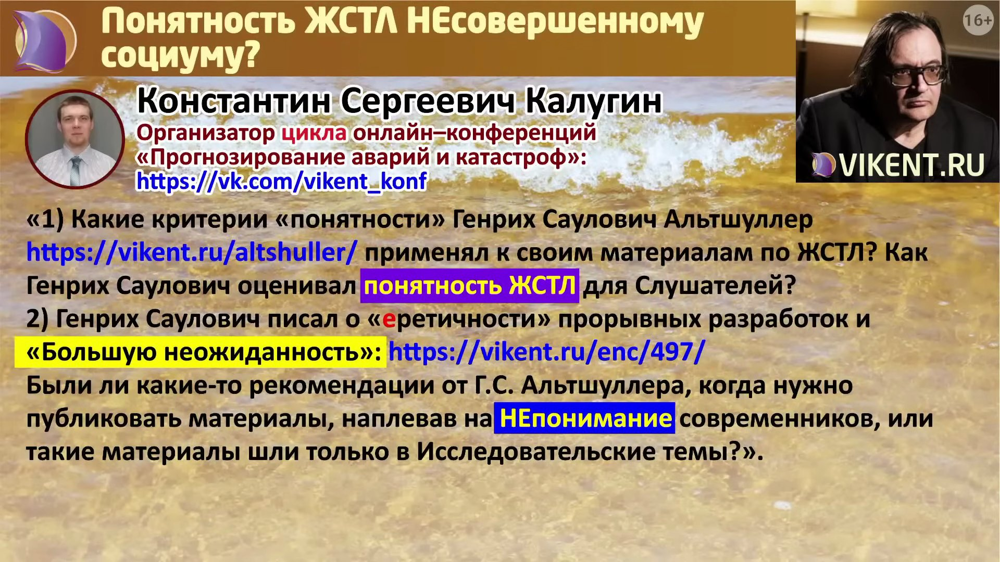

Соответственно, Геннавича Альшу, которую уже было плохо со здоровьем, как бы его была идея о том, что нужно просто-напросто написать учебники по основным как бы предметам школы и по одны по стандартным предметам вуза. То есть такой, ну, получебники, полузадачники, ну, допустим, по географии. География читается в любой школе. Если брать там географические открытия, устройство компаса и так далее, и так далее, вот там как бы и прочее, то, соответственно, там действительно на материале географии можно, ну вот географию можно изложить не по континентам, географию можно изложить по по тризадачам. Естественно, всё это было провалено, и Генуч Альшули видел внедрение внедрение трис идей из ЖСТЛ. Соответственно, вот через учеников вот такое вот вовлечение. Соответственно, когда идёт не просто изложение географии, как это делали древние греки, там излагается то, что они знают и так далее. Вот, а опять-таки там через ресурсы, разрешение противоречия, ну, кому что нравится. К сожалению, это не было сделано. Значит, то, что было связано со мной, значит, курс по геометрии и, соответственно, курс о том, как можно хорошо и грамотно, главное быстро писать. Главное быстро писать, я сделал, сделал и так далее, и так далее, и так далее. Вот. Ну, к сожалению, к сожалению и так далее. Вот. Соответственно, и есть некоторый преподавательский опыт. Альшуля об этом не говорил. Это говорит Игорь Леонадович Викинтьев. То есть при некотором опыте преподавания как бы, ну, я хорошо вижу, слышу, понимаю, какие вопросы будут преподавателю, какие куски слайда, доклада, вещи, книжки будут непонятными. Но это просто-напросто опытва ощного преподавания и так далее. Вот. Ну и, соответственно, следующее воскресенье с утра до 10:00 вечера, как минимум до 10:00 вечера, соответственно, мы этим будем заниматься. Мы этим будем заниматься. Да, такой закрытый курс. Идёмте дальше. Идёмте дальше. Итак, излезкие темы, соответственно, скажем, да, а вот оче очень важный момент в отсутствии их автора.

---

## [01:22:00]

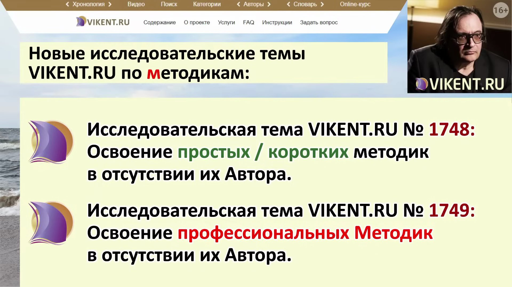

Гена Алексевича Альшуле и на конференциях, и в конце своих семинаров всегда давал, не всегда, очень часто, точнее, давал такую задачу, что произошёла какая-то авария на земле. авария на земле. Ну, в постейшем варианте полетел какой-то мощный астероид. Соответственно, знания, которые уже наработано на Земле, были утрачены, но где-то отдельные люди сохранились, они потихонечку начинают размножаться и, соответственно, как через аварию с астероидами передать им все накопленные знания. Иногда он уточнял, что он хотел бы передать и идеи ТИС, ЖСТЛ и так далее. Вот такая очень интересная задачка на воображение, как бы вот, которую давал Геннасовича Шулев. Понятно, что задача имеет много разных ответов, системов ответов и так далее. Вот как бы и так далее. Вот. Далее очень важный момент. Масса людей, особенно впервые слышащие о Трис, считаю, что есть какой-то тайный трис. И, соответственно, если как бы подарить Игорью Леонардовичу Викентеву коробку конфеты, коробку коньяка, и то, и другое я не употребляю, соответственно, он тайный трис откроет. Никакого тайного трис нет. Всё, что можно было как бы по трис опубликовано. Игорь Леонардовича Викинв. Вот у Игорь Леоновича Викинцева, да, действительно, есть разработки, которые не всем показываются. Да, это правда. Да, это правда. Почему? Ну, заслужили, заслужили, заслужили. Это правда. Далее давайте посмотрим. Да, чрезвычайно нескромно. Это моё видео, но это уже классика.

---

## [01:23:45]

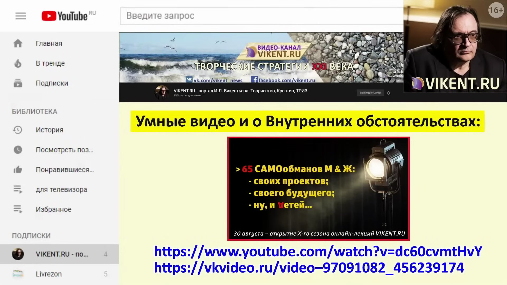

Кто хочет поумнить, включая профессуру, мой совет не спеша, может быть, записать себе в январе, то есть, когда, ну, будут относительно свободные дни, внимательно посмотреть, внимательно поконспектировать ошибку. которую мы сделали, её легко исправить. Надо бы сделать плакат, который можно скачивать и распечатывать к этому видео. Кто хочет, может сделать, согласуйте со мной. Ну, будем будем распространявать бесплатно, как бы. Да, да, видео бесплатное. Видео бесплатное, пожалуйста, для тех, кто понимает. Ну, идёмте дальше. Фотография. Фотография Маргарита Геннадьевна Крылова, Санкт-Петербург, музей стекла.

---

## [01:24:30]

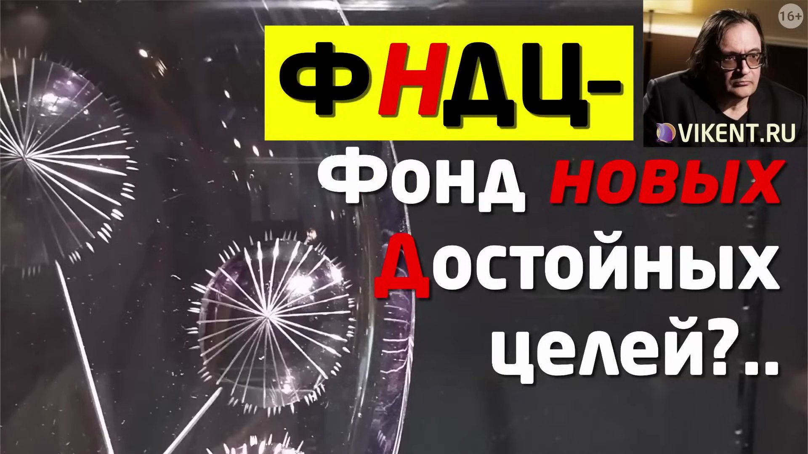

Давайте посмотрим вопрос опытного Романа Стефановича, который десятилетиями наблюдает трис изнутри из Молдавии. Ну, он выезжает в Россию, но тем не менее наблюдает из Молдавию, как бы, да, и так далее, да. Вот, соответственно, я начинаю отвечать.

---

## [01:24:45]

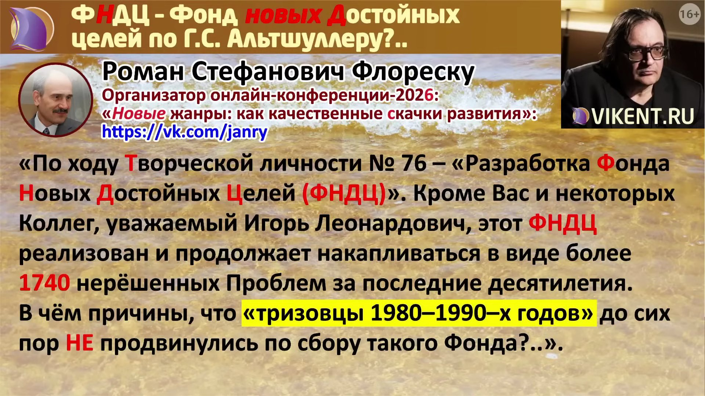

Соответственно, на мой взгляд, не стоит смешивать. То есть Геннасовыча не видел портала Викенд. Он не видел на он видел очень коротенький набор моих исслеских тем для старшеклассников, но большого набора, то есть, который сейчас у нас есть, там больше 1740, по-моему, сейчас будет 1. 750, вот-вот будет, да, он не видел, поэтому говорить, что это переход достойные цели нет. Соответственно, ты как могилу, как задачник по противоречиям, как школьные вылоские учебники, всё это провалили. То есть фонд достойных целей не собирается. Я собираюсь резкие цели и признаюсь честно, то есть главный мотив, если я что-то не знаю, а я, мягко говоря, в творческой креативной деятельности понимаю много, много, соответственно, соответственно как бы я маркирую, что открыто маркирую своё незнание, надеюсь, что приличные ученики, то есть есть разные ученики и ученицы, есть приличные, есть неприличные. Соответственно, это дело исследует. Иногда это даже выполняется. Давайте посмотрим ответ семьи. Да, соответственно, Лати - это Ленинградский электротехнический институт.

---

## [01:26:15]

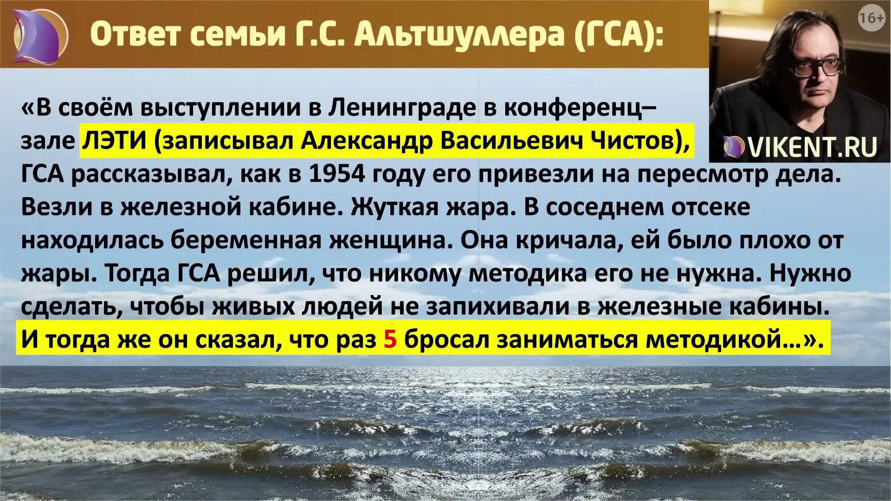

Александр Васильевич Честов, мой ученик, к сожалению, покойный, сотрудник московской мэрии. Московской мэрии, очень любивший разные магнитофоны, гаджеты. Поэтому, то есть записывало несколько человек Альшулера, но осталась только запись Александра Васильевича, к сожалению, покойного. Вот. Ну вот вы видите некоторые нравственные нравственный выбор Айшулера и почему нужно заниматься социальными инновациями, почему нужно заниматься, да, фотография тоже семьи это Зеленогорск. Зеленогорск, так называемый золотой пляж. так называемый золотой пляж, ответ семьи. Далее посмотрим. Значит, посмотрим. Это уже моя книга на прошлой неделе вышла. Здесь есть раздел жестл. И, вероятно, в следующем издании, вероятно, ну, по крайне мы с издательством планируем, оно будет в следующем году.

---

## [01:27:15]

Он вырастет этот раздел. Вырастит этот раздел. Есть и будет бумажный вариант. Но это повторяю ещё раз. отличаете Генаховчая, семью и меня. Это мы как бы пытаемся говорить на одну тему, но всё-таки это разные разные источники, как бы, да, меня можно ругать, пожалуйста. Так, дальше идёмте следующий слайд.

---

## [01:27:45]

Опять-таки лахтацентр. Лахтацентр садачник по стратегиям жизни. Давайте посмотрим. Вот давайте посмотрим, да, соответственно, действительно в ЖСЛ есть встроенный такой крохотный задачник, значит, для творческих личностей.

---

## [01:28:00]

Соответственно, я всем, кого консультирую по задачам, рекомендую задачи выставить от простого к сложному. Значит, здесь, ну, как бы меня опровергают, пожалуйста, меня можно опровергать. Значит, на самом деле противоречие разрешается очень простым образом. Значит, ряд текстов, который вошёл в Жестл, выслал Игорем Леонардовичем Викенть. И Альшуле поблагодарил за это. Значит, в Минском издании на странице 24. Можете проверить, пожалуйста. Да, соответственно, но тем не менее примеров не хватало. И задачник написан очень больным человеком, очень болеющим человеком. Читатели не хотят об этом слушать, поэтому придётся повторить. и такому остаточному принципу. Поэтому, соответственно, ну, не было уже сил выстраивать от простого к сложному, хотя это такой очень мощный педагогический принцип. С другой стороны, понятно, что такие высокоуровневые задачи, головолумные, сложные задачи, они различную шушу сразу отсекают. Тоже возможный ход. Но, повторяю, насколько я знаю, задачник писался в конце и, соответственно, просто, ну, вот нужно был просто не более чем пример. Моя рекомендация от простого к сложному. Соответственно, мнение Генасовычальшу мне, к сожалению, неизвестно. Неизвестно. Если оно вам известно по этому теме, ну, пожалуйста, не я один помогал. Ашуле, давайте напишите под видео. Давайте, идёмте дальше. Соответственно, окажем вот как бы что мы делаем? Что мы делаем? Пункт восемь открыт. Пункт восемь открыты. Кто хочет, можете предлагать ещё. Кто ещё?

---

## [01:29:45]

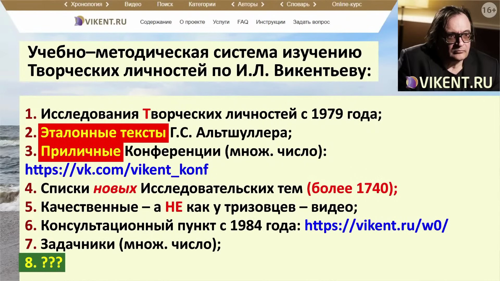

Кто кто ещё? Вот, соответственно, идёмте дальше. Соответственно, вот некоторые материалы. И, соответственно, у нас есть как-то подписываются очень мало на ЖСТЛ.

---

## [01:30:15]

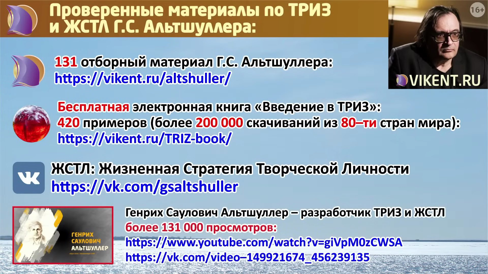

Мы даже одно время делали видео по шагам, но как-то очень тяжело себя сравнивать с гениями, и как-то это не очень шевелится. Благодаря стараниям Анатолия Александровича Ржаськова мы установили, мы много чего чего сделали, мировой рекорд в области три с видео. Т уже более 131.000 просмотров, просмотров, просмотров. Кто хочет, кто хочет как бы войти в мир гения, ну, пожалуйста, пожалуйста. А я продолжаю отвечать на вопросы Кирилла Лебедева, частично, частично на заданные вопросы Павленко. Давайте посмотрим некоторые чудеса. Итак, Владимир Мукусев, человек, который был наставником команды и взгляда, в том числе любимца глупых и очень глупых женщин Влада Листьева.

---

## [01:31:00]

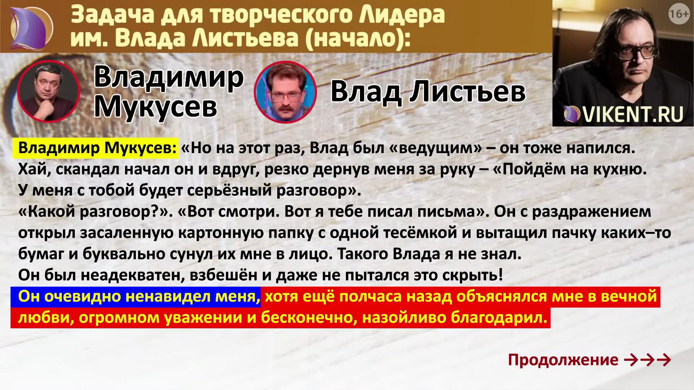

Вот, соответственно, так получилось, я не хотел этого. Так получилось, когда я присутствовал при общении, неприятном общении личном Генхаучале с какими-то его там ученичками, ученичками. Ну я не стал пересказывать. Я использую, в том числе отвечаю и Павленко, и Лебедеву. Описываю некую историю, пересказанную Мукусевым. Мукусьевым как бы по разным косвенным, по разным косвенным признакам, как бы мы лично с Мукусевым не знакомы, хотя у нас есть общие общие контакты, но Мукусев не склонен к воронью, хотя тележурналист, но не склонен. Ну вот почитайте, какие чудеса делают ученички и ученицы. Почитайте, почитайте. В данном случае мужской пример. Давайте дальше. Читайте, почитайте, почитайте, почитайте, почитайте. Ну, кто не дочитал, почитайте завтра. Почитайте завтра, исходя из гипотезы, что Мукусев, как бы он, как правило, говорит правду.

---

## [01:32:15]

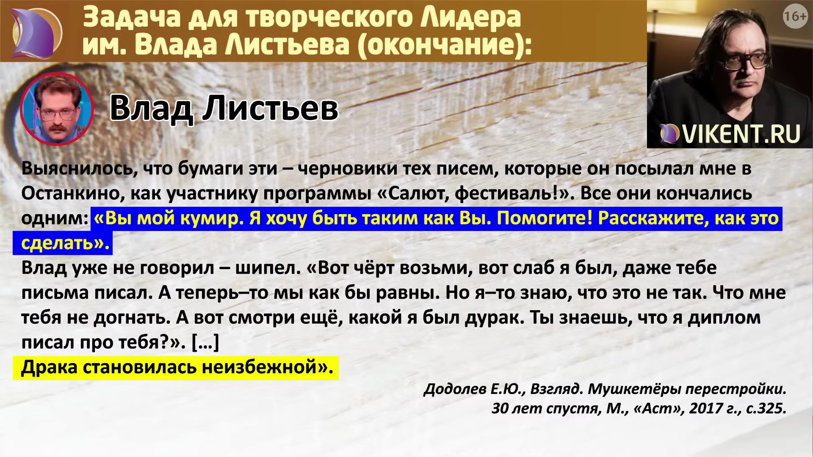

Ну, а мы идём дальше. А мы идём дальше. Иерусалим. Идёмте дальше. Тина Иерусалима. Итак, Сергей Владимирович Купенин. Негативные эффекты ЖСТЛ. Надо сказать, что подобные вопросы задаются постоянно.

---

## [01:32:45]

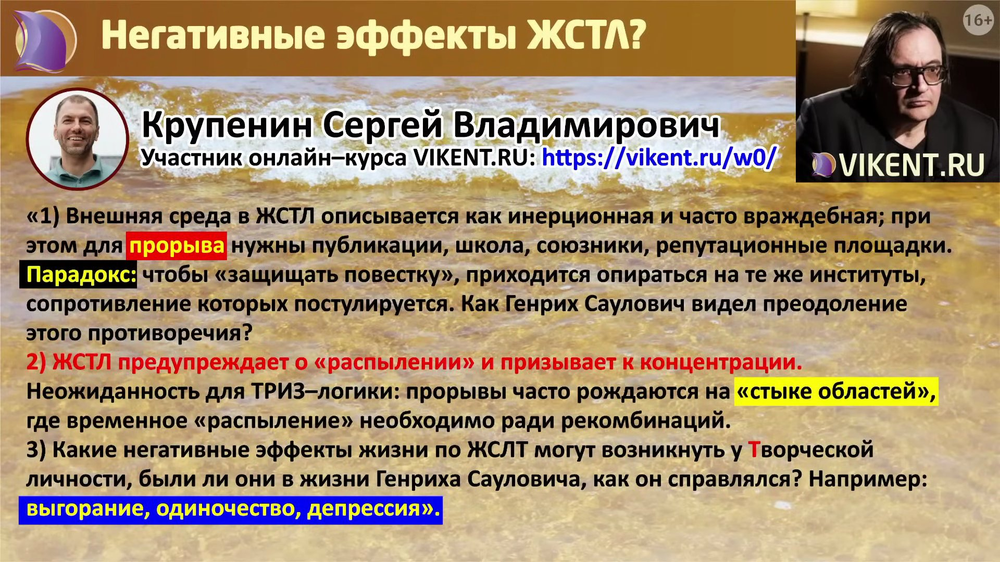

А что буде? Что мне будет, если я буду как бы практиковать GTLЛ? Ну, первый ответ, который у Альшулера, кстати, его не было. Не знаю, почему. Может, он где-то проводил ответ Игоряча Викентьева. Ну, как минимум, вы не будете деградировать, как как минимум. Как минимум. Вот, соответственно, как бы поводу как бы соответственно соответственно теперь переходим к пониманию Альшулера. Соответственно, ещё до появления ЖТЛ, давайте ещё до появления ЖТЛ. Соответственно, Альшуля в своих, в том числе, фантастических произведениях рассказывал о том, что фактически почему-то существует налог на творчество. То есть, как только человек начинает выделяться из Сыды, соответственно, реакция Лашетелье.

---

## [01:33:30]

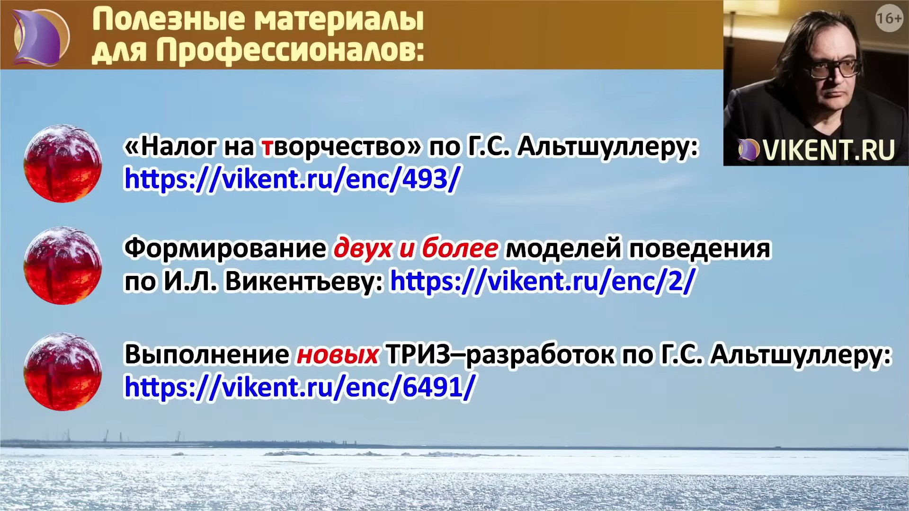

Альшуль увлекался химии, наверняка знал про реакцию Лашителье, хотя фантастических своих произведениях не цитировал. В данном случае ссылка идёт на канонический текст Жестл, как бы, а не на фантастические произведения. Ну, он как бы налог на творчество с семидесятых годов того века он рассказывал, да. Далее мой совет у Альшулера, вот это тоже нет, что развитая личность, развитая личность, соответственно, ну, желательно должна иметь две и более модели модели поведения, то есть модель поведения с учениками, как бы, и модель поведения на хирургическом столе. Я вспоминаю то, что со мной делали в пятницу, в эту минувшую пятницу. Соответственно, она несколькоразлична, то есть, ну, и желательно как-то этим управлять. Как бы я лично очень люблю, когда хирургу меня удобно как бы оперировать, и мы расстаёмся, когда хирург улыбается или даже смеётся. Обычно не удаётся это сделать. Вот. И так далее, и так далее, и так далее. У хирургов это, ну, очень тяжёлая работа. Я считаю, хирургом нужно им помогать, помогать, помогать. хирург помогает мне на стали, я помогаю хирургу, как бы, да, соответственно, скажем, да, и вещь, которая десятилетиями, ещё раз, десятилетиями, она была известна семидесятых годов, распространяла их на паперстной бумаге, тризовцы не отсилили. Чрезвычайно простые рекомендации, как делать новые разработки класса ТРИС. Вот. Ну, не осилили. Ну, не осилили. Что сделать? Ну, только смотреть на залив и в Сестрорецке. Фотография моя. Идёмте дальше. Имёте дальше. Мы чуть-чуть уже пере так далее. Вот мы уже идём к концу. То есть я тороплюсь.

---

## [01:35:30]

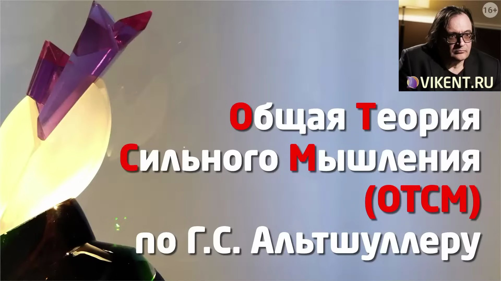

Итак, общая теория сильного мышления. Соответственно, как бы термин Альшулера, фотография, фотография Маргариты Геннадьевны Крыловой, Санкт-Петербург, опять-таки музей стекла. Давайте поблагодарим Маргариту Геннадью идёмте дальше. И, соответственно, скажем, как же вот я сегодня проводил эту метафору, что диалектика приуды Энгельса по оценке Эйнштейна научно ценности не представляет.

---

## [01:36:00]

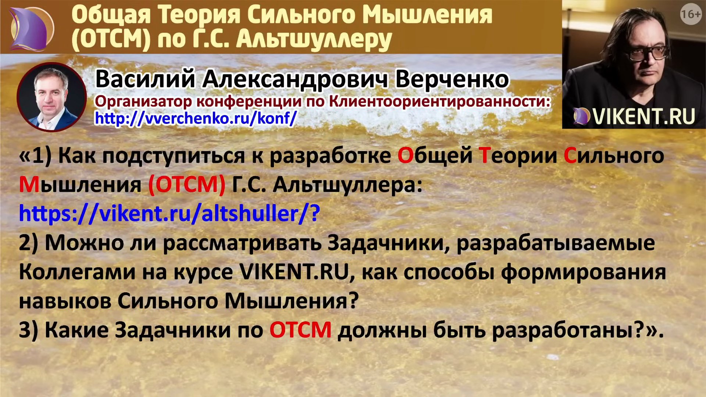

Поэтому общая теория мышления такой термин действительно Альшулер говорил, это был стандартный ответ. А что будет после ТИСи? А что будет после Жстл? Альшу говорю, что нужно просто сделать ряд классных работ типа Трис. а потом приступить к обобщению. На сегодняшний день можете проверить через поисковики, поскольку они ничерта не сделали, захватили какие-то училки, которые плохо знают Трис, плохо знают РТВ. Ну, соответственно, используя классические психозащиты Анны Фейд 1936 года, они занимаются как бы нет, а они занимаются сильным мышлением. Поэтому пока это некоторый блеф. Соответственно, версия Альшулера, соответственно, нужно просто сделать несколько классных работ, а там посмотрим, когда они будут сделаны. Не знаю. Ну, надеюсь, что те, кто сейчас в чате, ну, будут этому способствовать. Будут этому способствованы, соответственно. Ну, давайте идёмте дальше. Идём в очень хорошем темпе. Мне нравится. То есть я думаю, что дольше. Соответственно, большое спасибо и всячески пожеланию выздоровления Андрея Валерьевича Толмачёвым, как бы, да, как бы, да, вот Лев Давидович Ландау.

---

## [01:37:15]

Вот, соответственно, вот не надо не надо оправдывать своё убожество не надо оправдывать своё убожество. Фонарь около Никольского собора в Санкт-Петербурге. Не надо оправдывать свою и так далее. Вот. Вот. И переходим к последнему крупному разделу. Иерусалим. Иерусалим. Догскали фотографию, поставили эту фотографию этого как бы, ну, этого замечательного города.

---

## [01:37:45]

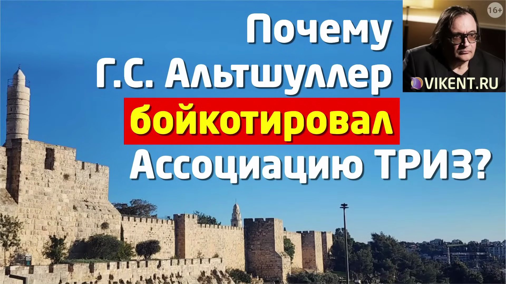

Соответственно, есть есть враньё, что Генхсоуча Альшулер учредил ассоциацию Трис. Как человек, входящий в правление ассоциации Трис, его очень долго уговаривали. Он махнул рукой и разрешил. Более того, когда голосовали за ассоциацию в Петрозаводске, он сказался больным. он физически не присутствовал и согласовал это дело по телефону. Поэтому это некое вороньё. Теперь переходим к умному вопросу. Соответственно, вот Константин Сергеевич Калугин, он спрашивает, спрашивает. Большое ему спасибо за уместный вопрос. За уместный вопрос. Уместный вопрос. Надо восстанавливать историческую справедливость.

---

## [01:38:45]

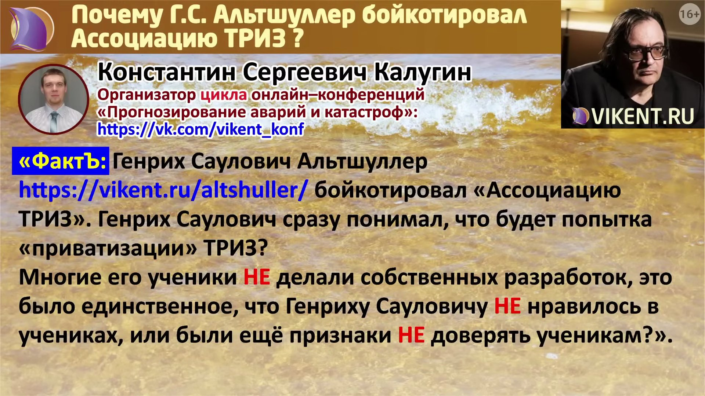

Вот. Давайте посмотрим. Давайте посмотрим. Давайте посмотрим на тризовцев. На тризовцев вот то есть довольно много людей.

---

## [01:39:00]

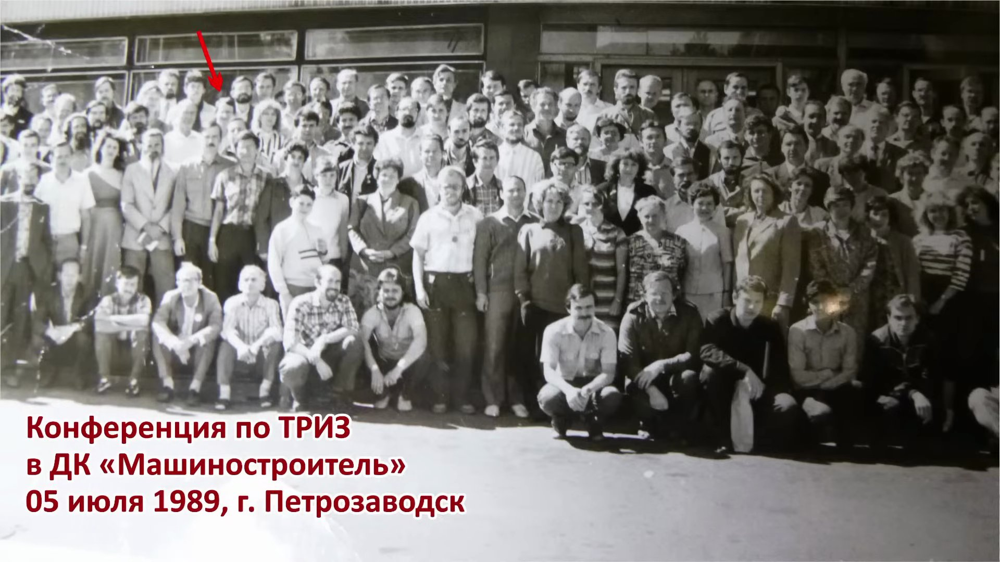

Довольно много людей. Дальше смотрим ответы семьи. Я не буду никак комментировать. Ответы семьи, да, ответы 2025 года. То есть у семьи было время прочувствовать, продумать, ну, и так далее, и так далее, и так далее.

---

## [01:39:15]

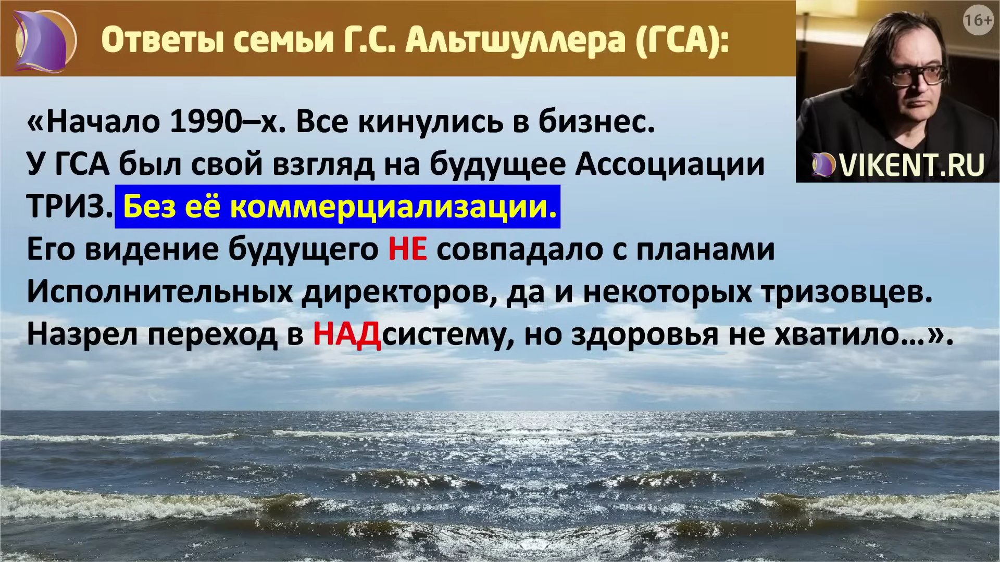

Вот как бы, да, я думаю, что все прочитали. Я полностью, да, я лишь присоединяясь к семье, полностью подтверждаю. То есть некоторые очень неприятные вещи от израсов я не сообщаю как-нибудь на потом, как-нибудь на потом. Ну и так далее. Вот давайте посмотрим последний слайд. Соответственно, читать только жёлтое. Маяковский. Вот первое, к сожалению, от изосок.

---

## [01:39:45]

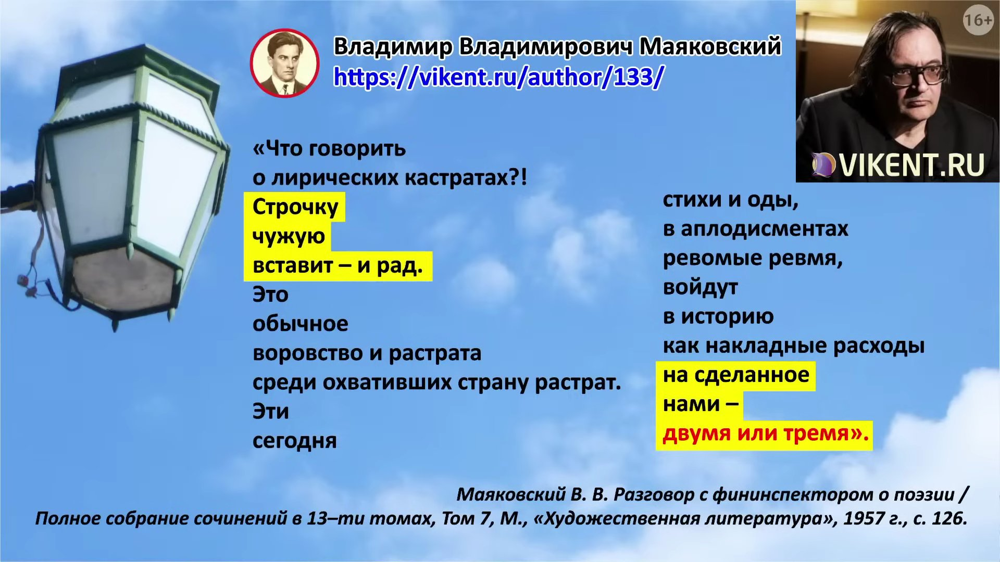

Первое жёлтое выделение. Второе Маяковский. Соответственно, это вызывало споры, соответственно, кто это? Кто это? Два или три поэта поколения? Это Пастернак, это Маяковский, это Кирсанов. Семён Кирсанов имеется в виду. Кто это? Кого это он назвал? То есть, ну, это литературоведом. Советую совместить то, что писал Жуковский Пушкину, поэтический эпиграф, и постэпиграф, постиэпиграф Владимира Владимировича Маяковского, который кое-что как бы понимал в поэзии. Кое-что понимал в поэзии. Ну, соответственно, мы переходим к финальной части.

---

## [01:40:30]

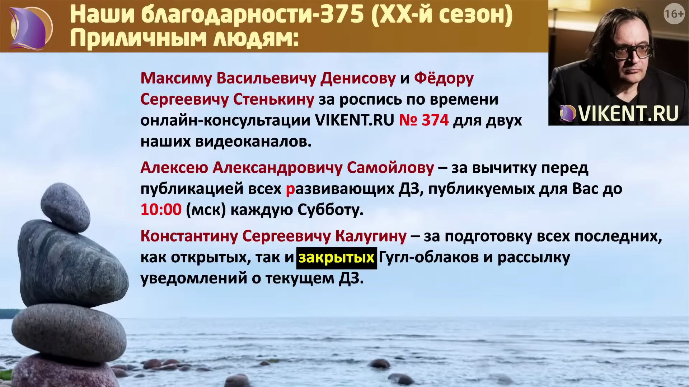

Давайте поблагодарим, поблагодарим всех коллег. Фотография Анатолия Александровича Жачкова, Бухта Окунёва. Вот бухта окунёвая. Давайте дальше. Далее. Значит, близкий по идеям Альшули близкие, но это мой спескус. Он полностью открытый.

---

## [01:40:45]

Соответственно, люди, понимающие в материалах, считают, что одна лекция должна стоить тысяч15 с носа, но он бесплатный. Ну, как бы до сих пор люди не очень не очень адекватно понимают, сколько сколько стоят методические объяснения. Соответственно, некое софинансирование, пожалуйста, следующий слайд. Кто считает нужным, пожалуйста, можно мани, можно рублями, кто считает возможным, нужным, пожалуйста, пожалуйста. Соответственно, у нас 2 ноября будет закрыты, продвинутые консультации. Закрытые, продвинутые консультации, а вот и так далее.

---

## [01:41:30]

будет, соответственно, ну, домашнее задание будет 1 ноября, это суббота опубликовано, задание - это святое. Соответственно, соответственно, кто хочет, может задавать вопросы. Домашнее задание этой недели: посмотреть это видео, возможно, оно непростое. Не стесняйтесь задавать вопросы. Если очень стесняетесь задавать вопросы, ну, есть режим аноним, ну, присылайте где-то на 16 ноября. Ну, соответственно, я в режиме аноним, соответственно, отвечу. Далее, далее. Особенно кто у нас недавно, значит, у нас очень принято, очень изысканно вежливое обращение. Кто это не понимает, идёт вон.

---

## [01:42:15]

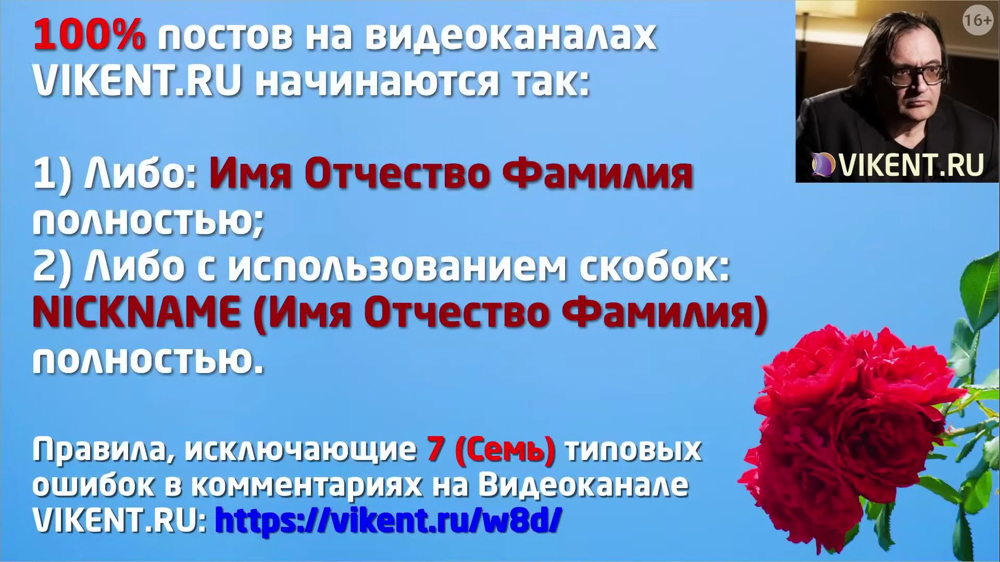

Идёт вон. Ну, как бы как у нас пынято, как у нас пынято. Минута ты через тчеты. ссылки, ссылки на наиболее полезные видео, наиболее полезные тексты будут и ВКонтакте, и в Ютубе под этим видео. Вопрос модератора: Были ли технические сбои? Сегодня нет технических сбоев. Соответственно, завтра днём, завтра, ну, как минимум, к вечеру будет составлен коллаж. Коллаш, и, соответственно, он будет размещён ВКонтакте. Ну, кто хочет, можете ещё раз его срепостить. Всего вам доброго. Соответственно, 2 ноября не будет ни лекции, не консультации. Будут закрытые консультации. Будут закрыты и подвинутые консультации. Большое спасибо издательство Левыризон за организацию бесперебойного вещания. Всего вам доброго.

---