# Лекция 377

---

## [00:00:00]

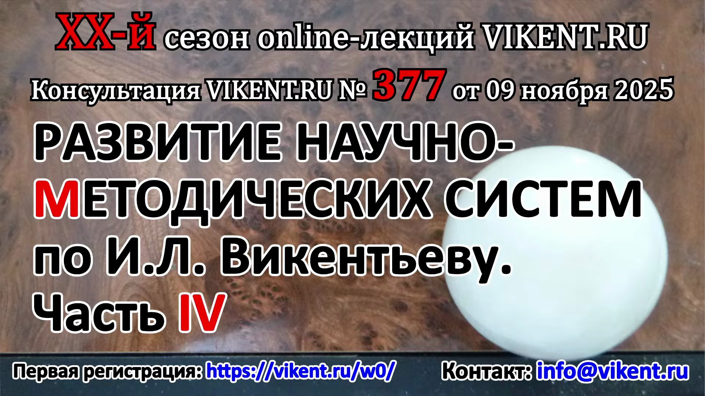

Итак, добрый вечер, уважаемые коллеги, и добрый вечер или иновое время дня, кто нас будет смотреть, соответственно, в записи. Итак, сегодня, как видно на обложке, четвёртая лекция спецкурса. Вскоро мы вам покажем, где посмотреть предыдущие три. Поэтому предыдущие три сверхжелательно смотреть чрезвычайно внимательно. Лучше всего конспектировать тетрадку или блокнот, имеется в виду рукой и в бумажной. То есть не надо метаться между различными окнами на экране и так далее, и так далее, и так далее. Вот. Соответственно, давайте посмотрим эпиграф. Эпиграф. Тут тоже тоже надо посидеть.

---

## [00:01:00]

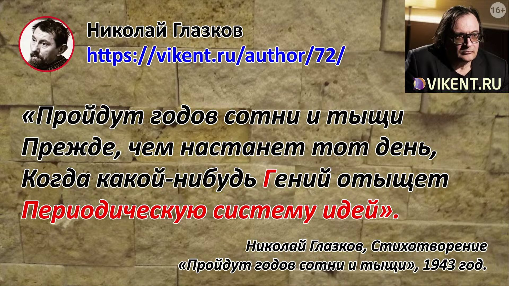

Итак, эпигф человека, которого не печатали и который считается отцом советского советского самыздата, то есть са советского, то есть то, что она распространялось в списках и так далее, вот его не печатали и так далее. Вот видите, довольно, ну, довольно древняя цитата сорок третьего года. Ну, действительно, вот классное название, которое у нас выделено, периодическая система идей. Соответственно, для тех, кто у нас смотрит впервые, вам нужно будет посмотреть, скоро покажем, повторя предыдущие три, но на всякий случай я поведу ещё метафору и так далее. Вот. То есть, допустим, допустим, упрощая, скажем так, что задача некого учёного либо учёных получить некий результат. У нас пескурс называется научно-методические системы. Задача методиста - это как-то упаковать, преподать, записать с тем, чтобы обеспечить какое-то более массовое использование. Иногда функции учёного и функции методиста пересекаются. То есть человек ещё и рассказывает и делает общедоступным своим трудам то не всегда. уместна некая метафора, ну, с точностью до метафоры, что у учёного учёного и методистов есть единый огород. И на этом огороде у каждого учёного своя грядка. И он, один учёный, выращивает лук ради, ну, луковицы. Вот на соседней грядке другой учёный выращивают лук ради то, что называется перья. Вот, ну, зелёные такие длинные штучки и так далее. Вот методист из всего этого делает какой-то салат, куда идут несколько овощей. Вот. А какие-то овощи могут и не пойти. То есть вот задача, повторяю, методиста - это и преподавание, и дожимание. То есть он делает из научных. Для нас м наука - это некоторый ресурс, некая подложка, некоторый корм, из которого методисты, разработчики, другое название, они делают нечто, ну, такое вот, ну, более общеупотребимое. Представляете? Не всегда научные результаты можно напрямую использовать большим количеством людей, даже, соответственно, с высшим образованием. Ну и теперь давайте посмотрим как бы второй слайд, где написано, где посмотреть. Соответственно, посмотреть предыдущие три видео с похожим названием. Вот можно ВКонтакте, можно ВКонтакте и можно в Ютубе. Можно в Ютубе. Это полностью открыто и так далее. Вот ещё одна оговорка: "Не стали затемнять, забивать последующие слайды.

---

## [00:03:30]

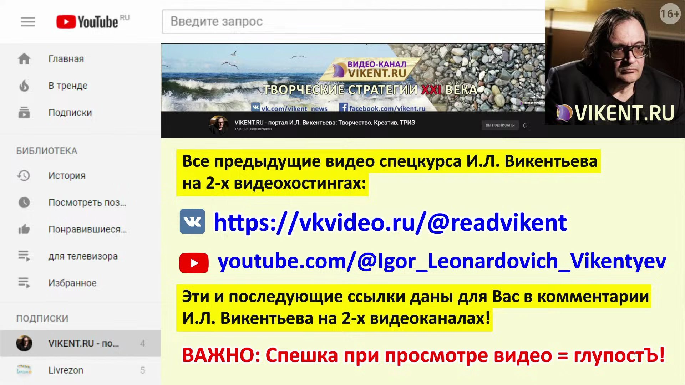

Соответственно, ссылки на какие-то тексты, ссылки на какие-то видео, вот мы закончим где-нибудь там 22:30 по московскому времени и будет в моём первом посте. И, ну, с тем, с тем, чтобы не добирать руками". То есть такая оговорка делается в начале, ну, а потом мы такую оговорку уже не делаем, но если увидели ссылку, как бы наиболее важные, не все, наиболее важные ссылки, они будут, соответственно, в посте Игоря Леонардовича Викендия. Давайте посмотрим наши правила. Вот наши правила, которые мы соблюдаем.

---

## [00:04:30]

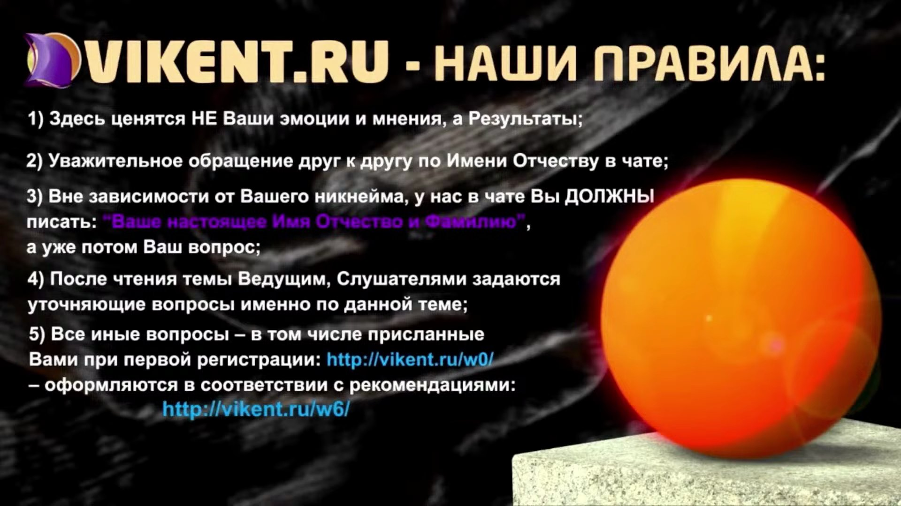

Данный курс читается в рамках проекта Викент, который является крупнейшим порталом Европы по изучению творческих личностей и творческих коллективов.

Материалы для этого проекта собирались мной с 1979 года. Надо предупредить, что наши материалы не сколь сложные, сколько непривычные для обычного мышления, поэтому нужно смотреть их очень внимательно и слушать, а также рекомендуется записывать.

Как вы будете вести конспект в компьютере или в блокноте? Это ваше дело. Лично я рекомендую вести в блокноте, посконо удобно не только записывать, но и зарисовывать те идеи, которые оглашаются в рамках нашего курса.

Соответственно, у нас принято в Русской академической научной традиции обращение со всеми исключительно по имени Отчества. Поэтому, если вы зарегистрированы в Ютубе как Красная Шапочка, пожалуйста, это ваше право. Но у нас в чате вы будете писать себя как Красная Шапочка, а в скобках полностью имя, отчество, фамилия. Ну, в противном случае вы просто будете удалены модератором.

Причём удалены навсегда. Соответственно, у нас есть вопросы, несколько видов.

Первый вопрос- это в конце какого-то логического куска, когда закончилась тема, и они задаются в чате. Если ваш вопрос существенно отличается от объявленной тематики лекции, то вы снизу экрана видите, как его задать по специальному формуляру.

На курсе соединяются люди разные культуры из разных стран, из разных городов. Эти правила, они обязательные. Они обязательные. Соответственно, кто не выполняет, модератор без предупреждений удаляет из чата и так далее. Так, соответственно, традиционное большое спасибо.

---

## [00:06:15]

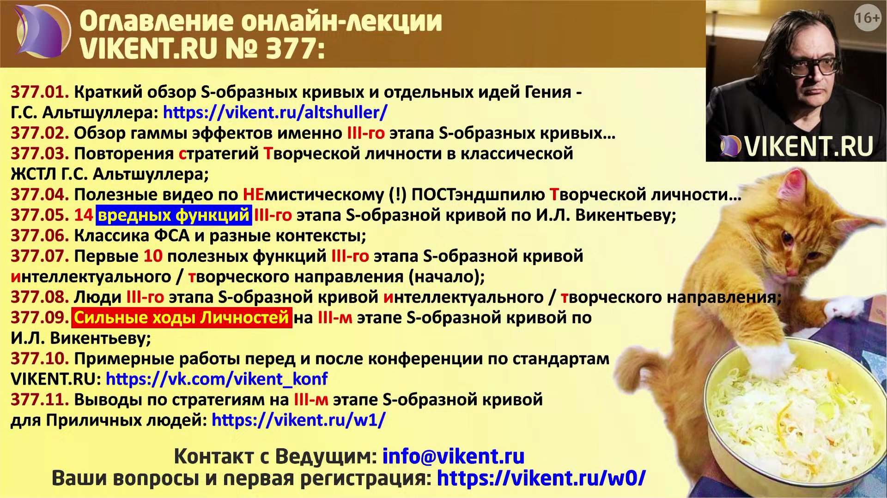

Прошло какое-то количество очень разных уточняющих вопросов. То есть программу мы стараемся, как бы не тяжело это не было бы, опубликовать в среду. То есть эта программа была ВКонтакте опубликована в среду. И, соответственно, пришло какое-то количество вопросов, которое позволяет мне уже для всех, большое спасибо авторам вопросов, уточняющих, сделать программу более доступной. Это как бы первое. То есть, соответственно, как бы это такое правило, правило среды еженедельно. В среду, в крайнем случае, в четверг задавать уточняющие вопросы. Это очень серьёзная ваша помощь мне. Мне становится более понятно, с чего непонятно, как нужно рассказывать. Второе организационное объявление, я ещё повторю, у нас следующее воскресенье не лекции. У нас очень быстро налетела, значит, соответственно, третье воскресенье месяца. И это ответы на вопросы приблизительно, ну, более 400 направлений творческой и научной деятельности без ограничений. То есть единственное ограничение на русском языке. На русском языке можно задать. Вот вы видите, последняя ссылка викенд. W0. Ну и как второе ограничение, уже некоторые вопросы поступили, оно, естественно, желательно задать максимум в понедельник до обеда. Даже не до вечера, до обеда, потому что мне нужно с вашими вопросами ещё работать. Вот. Вот, соответственно, идёмте дальше, давайте посмотрим. Большое спасибо, включая семью Альшулера за те фотографии, из которых мы изготовили слайды.

---

## [00:08:00]

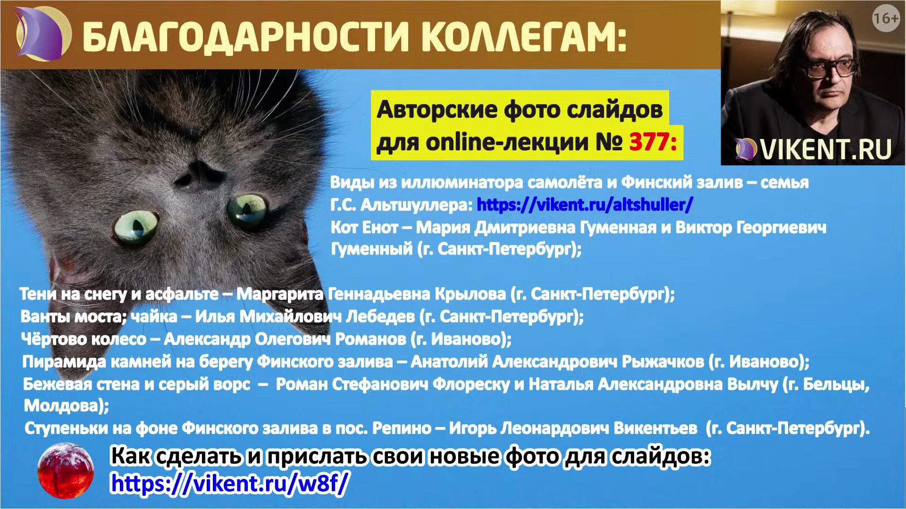

Их 54, по-моему, 54 или 52, то есть не очень много. Давайте посмотрим новую книжку бесплатную. Да, вот новая книжка. Она совершенно умышленно сделана бесплатно.

---

## [00:08:15]

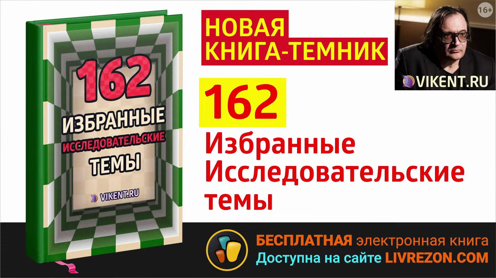

То есть её как бы можно скачать, её можно читать на сайте издательства как бы, то есть она сделана бесплатно. Она коротенькая, то есть она коротенькая, то есть, но важно не, скажем так, важно не торопиться. Важно не торопиться, потому что там фактически есть там введение, заключение, которое тоже полезно почитать. Это 162 такие отборные темы. Всего их сегодня вы увидите 1750 уже тем, вот, которые вот, ну, я свевёл в эту книжку. То есть эта книжка - это некое приложение к курсу, то есть потому что там 1.750 тем, это уже много. Давайте идёмте дальше. Соответственно, соответственно, вот как бы ваше софинансирование, мы наши видео размещаем. Вот кто может принять участие, а за заранее спасибо. Заранее спасибо.

---

## [00:09:15]

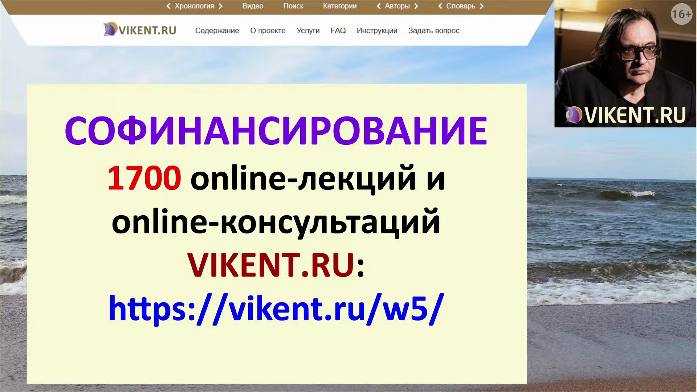

В этом году очень неравномерно, то пусто, то густо. То есть обычно у нас с этим всё нормально, но вот в этом году как-то вот то пусто, то густо, честно скажу, как бы, да. Вот и часть вещей, часть вещей как бы идёт на моё лечение, то есть донаты либо на лечение, либо на продвижение визуальным. Это можно указывать, не стесняться. Далее, соответственно, у нас есть правила общения, которые, как ни странно, очень много Давайте следующий слайд. У нас есть правила общения на двух видеоканалах. Вот мы общаемся так и никак иначе. Даже муж и жена у нас общаются по фамилии, имя, отчество и так далее, и так далее. Вот есть некая единая стилистика, которая очень многое нам позволила выстроить. Ну и, собственно, переходим непосредственно уже к спецкурсу идём дальше.

---

## [00:10:00]

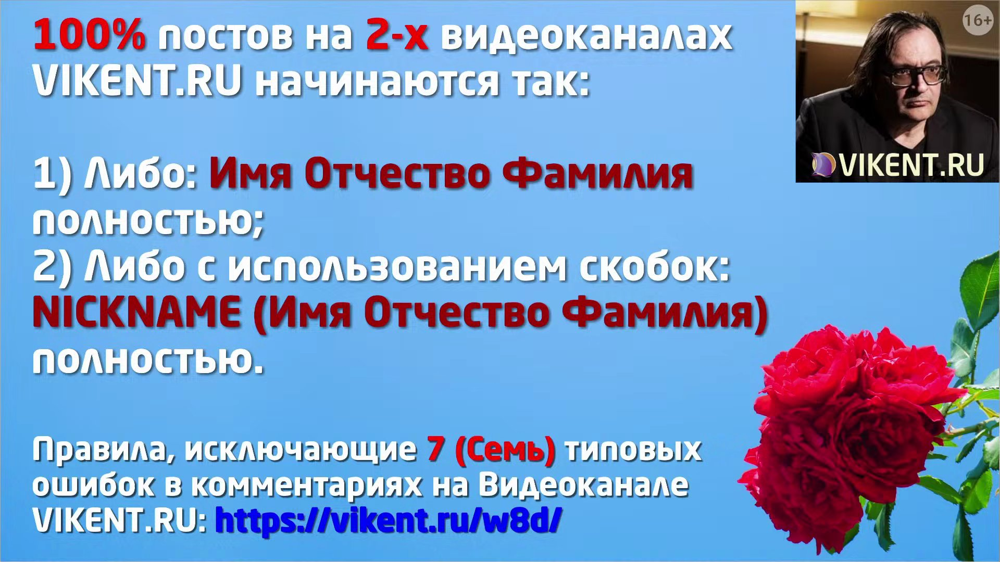

Соответственно, вот вы видите фотографию семья Шулера из самолёта.

---

## [00:10:15]

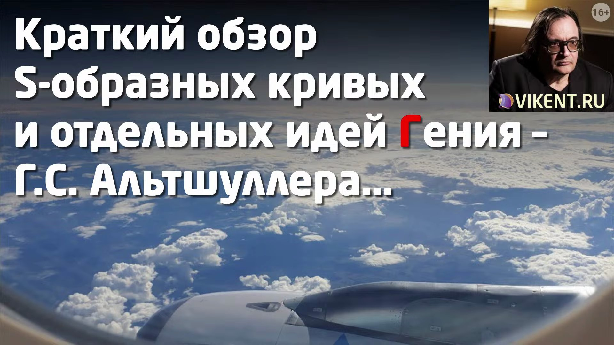

они летят в Крым, соответственно, отдыхать и так далее. Вот. И, соответственно, первый терис, который сегодня будет повторяться много раз, как бы обычно люди себе в различных таких научных, методических, научных проектах не представляют, что если они всерьёз занимаются каким-то делом, это может происходить 3 года, 5 лет, 10 лет, 15 лет, там 30 лет, 50 лет, как у меня там, допустим, да. Да. Далее есть некое обратное влияние. То есть дело имеет обратное влияние на личность. Если вы занимаетесь ерундой, то, соответственно, также дело влияет на вас, соответственно, скажем. То есть есть масса очень таких многообещающих людей, которые к 40, к 50 годам откровенно поглупели. Это даже видно через видео. Есть масса людей, которые как-то вот начинали вроде бы буквально из тени, не очень такие заметные, у которых тут, ну, нормальные лица, нормальная одежда, соответственно, к соп годам. Давайте посмотрим нашу любимую сообразную кривую. Я здесь немножко посижу на этой теме. Соответственно, что мы здесь нарисовали? мы нарисовали упрощённо к третий этап собразной клеевой, где есть несколько фундаментальных вещей, имеющих отношение к жизни.

---

## [00:11:30]

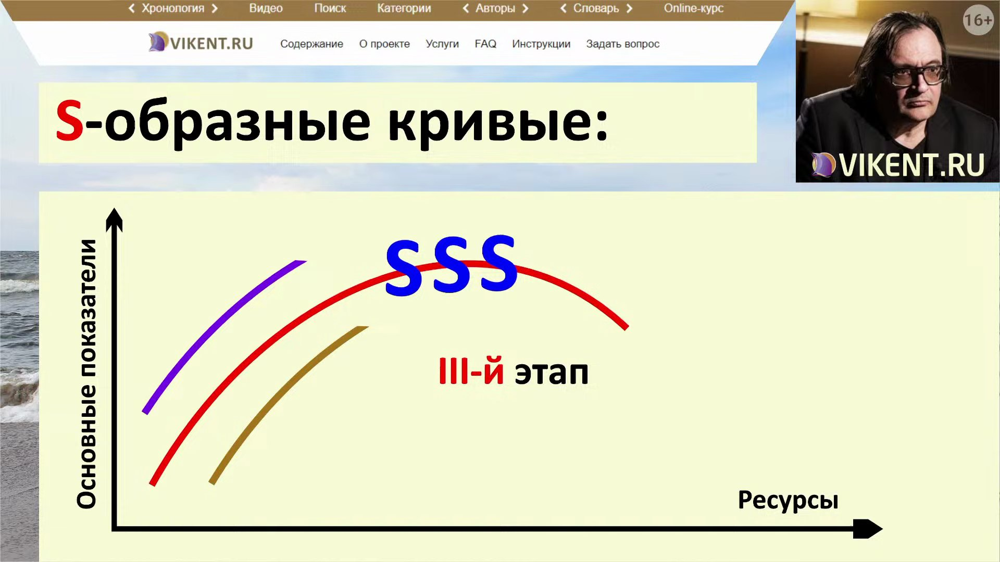

То есть, соответственно, у нас к третьему третьему этапу сообразно кривой так получилось. Значит, у нас уже была лекция, какие учёные бывают, чем стоит заниматься, чем не стоит заниматься на этом этапе. Повторяю, для нас наука, учёные, научные результаты - это грядка, ресурс, подложка и так далее, и так далее для методических обобщений. Соответственно, как бы у нас так получилось, что было пару лекций, пару консультаций, точнее по генахчаль Шульлера. И сегодня в основном я буду говорить про жизнь. Вот как раз когда дело дело имеет обратное влияние на человека, на разработчика, который занимается. И, соответственно, как бы через воскресенье, по что следующее воскресенье консультации, напоминаю, жду вопросов, мы будем заниматься, ну, в очередной раз, хотя такие вещи уже были, это как раз какие продукты вот стоит выпускать на третьем этапе, какие продукты не стоит выпускать. Так вот, значит, соответственно, как бы ещё и ещё раз. На третьем этапе есть массаобразных кривых. Мы нарисовали их пять. Сейчас скажу, почему пять. Шесть, точнее, шесть нарисовали мы их шесть, но самых их гораздо больше. То есть есть красная некая скривая. Не очень важно, что это на самом деле, да? Рядом какие-то идущие, и это чрезвычайно ваше, с другой скоростью S-бразные кривые. То есть, например, по одной сообразной кривой мы откладываем результаты, по другой кривой мы откладываем как бы количество и качество людей увлечённое. Кроме того, вы видите ещё таких три из-образных криевой в латинской буквы с, то есть есть такой эффект, который новички могут приня воспринять за некую там истину, что-то ещё, что-то ещё. Особенно новички из Москвы, ну или любого столичного крупного города. Соответственно, масса людей любит читать переводную литературу. Кто-то дальше раньше покупал на Амазоне, чтобы быть в курсе в курсе событий. Так вот, такая средняя книга среднего американского профессора, именно американского там. Она содержит, как правило, одну мысль. Она служит целью продажи продажи этой книги самого профессора какому-то университету. Каких-то других целей, как бы книга американского профессора не содержит. Напоминаю, не вредно посмотреть две последние консультации про Гена Хасовича Альшулера. Генна Христовича Альшулер не успел, не успел, но он хотел научить мир изобретать. Насчёт всего мира не получилось, как бы. Ну и так, ну это отдельное. Кто хочет, смотрите, да. Так вот, надо понимать, как бы, что, соответственно, масса таких попсолюбов, попсоделов, открывается какая-то новая, коротенькая, сообразная кривая. На третьем этапе уже масса людей, масса людей вовлечены в дело. Это такие вот маленькие эссы, мы называем их коротко живущие, но народа уже полавков сидит много. Очень важный ещё аспект. Как правило, даже у докторов наук идей нет. Как нет идеи докторов наук? Ну совсем нет у докторов идеи. Вот так вот как бы, да, мы об этом сегодня ещё будем говорить. И, соответственно, вся эта агава очень разного качества, с очень разными этическими признаками устремляется. И совершенно неважно, это управление по слабым сигналам, несколько десятилетий назад была такая мода. Это какой-нибудь экзистенциальный коучинг, как бы вкус просто коучинг уже был. Это экзистенциальный коучинг. А они устремляются и, соответственно, сжирают эту сообразную кривую. У наивной аспирантский, причём из хорошей семьи, где девушка привыкла, что родители ей не врут, и она не врёт ни бабушки, ни дедушки, как бы не родителям, возникает ложное ощущение, что экзистенциальный коучинг, управление по самым сигналам, как бы русский форсайт и прочее, это вот не это тренд. Это тренд. Это не тренд. Это просто-напросто инициировано американским профессором Дуаком, которого нечто я выпустил на Amazоon, наш купили, перевели и, соответственно, как и всё в Америке, продаётся последнее, уникальное, не имеет аналогов и так далее. Как правило, это чушь собачья. То есть мне неизвестна книга американского профессора, которую я выпустил бы на свою конференцию. Кто понял, что я сейчас сказал, как бы, ну, молодец. Кто не понял, смотрите нас дальше. Соответственно, давайте ещё раз посмотрим уже на слайдах. Возможно, стоит делать снимок экрана и можно репостить в социальных сетях и так далее. Вот как бы, да. Вот первое очень целебное понимание, особенно честным девушкам. Вот пункт номер один, он для девушек. То есть девушки пока не ввязались, пока не ввязались в наш курс, они, как правило, не подставляют объём обмана наших и зарубежных профессоров.

---

## [00:16:45]

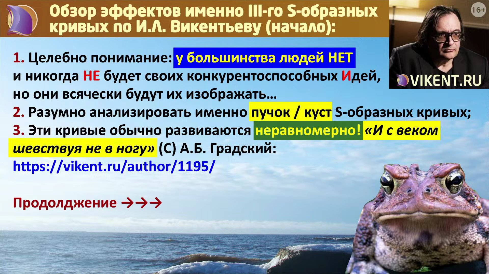

О доцентах я даже не говорю, то, соответственно, у большинства людей идей нет. Идей нет, то есть от слова совсем. И они их вынуждены списывать, придумывать, искусственно повышать значимость и так далее. Второе, то есть если вы не хотите несчастье в жизни, это говорится уже и для мужчин самых, включая пенсионеров, значит, стоит, чтобы вы либо ваши внучки, ваши ученики занимались бы именно пучком сообразных криевых. Какая-то криевая по массе пычи, сегодня тоже об этом будем говорить, может не сработать, может не может не развиться, может загнуться. в своё время загнулись пейджеры. Но если вы ведёте несколько куст, пучок изобразных крывой и гамму изобразных крывых, то, скорее всего, как бы вот что-то выстрелит. Сказать сразу же, особенно без консультации со мной, что выстрелит, немножко немножко затруднительно. Ну, учитывая, что я неоднократно как бы и в разных разных странах как бы делал весьма успешные прогнозы, как бы, ну, для тех, кто у нас занимается на курсе, существуют и открытые, и закрытые консультации. Ближайшие 16 ноб, повторяю, я об этом можно поговорить. Далее ряд эффектов. Мы об этом говорить будем мало. Сегодня чуть-чуть тронем, может попозже. Соответственно, вот строчка из онкомпозитор, в принципе, ну и поэт тоже Александр Борисович Градский, москвич, соответственно, и с веком шествие не в ногу. Так вот, как бы сообразные кривые развиваются с разной скоростью. У нас есть профессиональные химики, вот как бы технологи. Напоминаю такой термин кинетика. Когда у вас какое-то есть варово, идёт какая-то химическая реакция, там идёт много параллельных процессов. Ну, это, в принципе, знает любой руководитель. И, соответственно, в разных подразделениях разные химические процессы, разные людские процессы идут принципиально с разной скоростью. Ещё раз, принципиально с разной скоростью, то есть неравномерно. Это порождает гамму, в общем-то, не очень изученных эффектов. Это такая как бы исследская тема. Исследская тема. Что-то похожее я уже давал, поэтому это отдельно не обозначено. Ну кого интересует недоизученность собразной кривой и жизнь? Чья жизнь? Человечья жизнь? Ваша жизнь. Просто понимаете, что когда есть параллельно вы надзираете над чем-то, неважно над людьми, над химическими реакциями, биологическими реакциями, начинается кинетика. Это эффектов объясняется тем, что процессы идут с разной скоростью. То есть, ну, например, там лекарство регулирует там скорость всасывания, там влечение там через катализ каких-то реакций, ускорение, ну и так далее, и так далее, и так далее. То есть просто обратите внимание, то есть у нас не один процесс. То есть ради чего я се это говорю, да, как бы. Ну давайте посмотрим следующий слайд. Я тоже поговорю, он тоже важен для жизни. Соответственно, пункт четвёртый, значит, жизнь сложна. Жизнь сложна. Соответственно, я не видел, я не очень большой знаток, но, по идее, вот чрезвычайно важно показывать старшеклассникам, показывать показывать в студенчестве и показывать аспирантам и докторантам некий фильм, когда выясняется, что у некого главного учёного вообще нет идей вообще.

---

## [00:20:15]

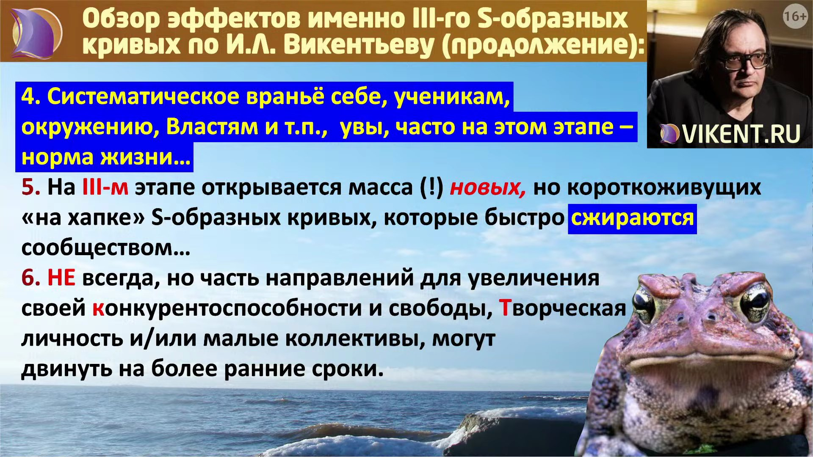

И, соответственно, оставшееся время жизни, то есть пока человек живёт, соответственно, человек занимается фигнёй. То есть человек изображает, что якобы у него есть идеи, да, поэтому зарабатываются там неврозы, психозы и так далее, и так далее. Вот и у человека, и у ближайшего окружения, и у семьи, и у пёсика могутни быть заработаны, и у кота. Ну, соответственно, вот какого-то хорошего фильма по научных кредисов какие-то кусочки были. Ну, такого фильма нет. Если кто-то знает, ну, давайте пришлите ссылочку, будем его всем рекомендовать. Ну, желательно на русском языке, конечно, дальше, да. Соответственно, пункт пятый, то, что я как раз говорил, когда все сидят по лавкам, и у большинства людей это очень цинично, это очень жестоко, как бы никаких идей нет. Если вы обижаетесь на профессуру и на доцентов, ну, представьте себе, что у вас преподаватели вуза мгновенно радостно кивает, сидит группа 25 студентов, все балбесы или и балбески в женском варианте. Никаких идей нет. Их интересует только зачёт. Только зачёт поратите занятия, да. Так вот эти вот какие-то коротко живущие эффекты есть. Нельзя их путать с некоторым делом жизни. То есть, ну да, мы сегодня о жизни. Ну, с тем, чтобы не быть несчастным. Ну, если кто-то хочет быть несчастным, то как бы замечательно. Соответственно, есть такая интернетбайка очень точная, надо сказать. То есть думаю, что она построена наблюдение за жизнью, что сантехник пришёл на заказ. Ну, сантехник пришёл на заказ, разолся в передний и наследил ещё больше. Ну, кто видел живых сантехников там трезвых и нетрезвых, то как бы понимают, о чём я сказал. Вот хотите несчастья, не слушайте эту лекцию. Хотите, как бы, ну, пожалуйста, пожалуйста, пожалуйста. Да. Соответственно, очень удачной теме нам подарил Сергей Владимирович Крупенин. Перепрыг. Перепыг. Мы мы об нём уже говорили, то, соответственно, чрезвычайно интересно работать не на всём, не на всей мсообразной крылой, в частности. На третьем этапе желательно не работать, желательно пытаться сместить на второй этап. А ещё стратегически, ну, это и единичные люди в столетии такое на такое способные. Единичные люди в столетия, когда мы работаем где-то в начале второго этапа и потом прыгаем на следующую сообразную кривую и так несколько раз. Это абсолютно реально. Никакой мистики. Почему? Потому что начало второго этапа - это и свобода относительно, относительное, конечно, это и результаты, это и хорошие отношения. Это здорово. Потом, соответственно, придёт бюрократия, придут идиоты, троечники, всё зарегламентируют, и, соответственно, даже то, что вы сделали, всё будет зарегламентировано. И, мягко говоря, удовольствие от жизни никакого. А у нас сегодня вторая про жизнь, про вашу жизнь. Давайте посмотрим следующий момент. Сладящий слайд сложный. Так вот, есть жизненная стратегия творческой личности. Специально очень длинная ссылка для тех, кто будет смотреть впервые. Соответственно, пересказываю близко к тексту, как пересказывал Генрих Руча Альшулер.

---

## [00:23:45]

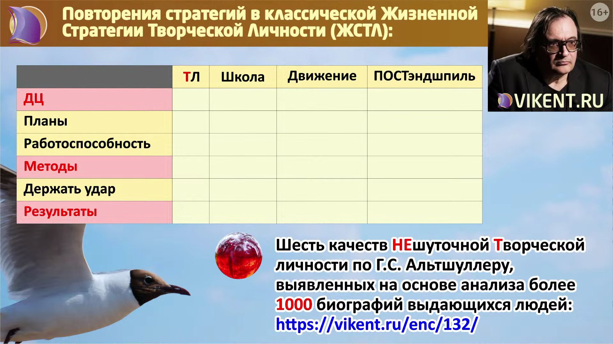

Соответственно, Генрис Руча Альшулер как бы несколько десятилетий вырезал из газет, из журналов вывески выдающихся людей. Соответственно, где-то к середине восьмидесятом минувшего века, XX века, вот как бы он стал почитывать книжки по выдающимся людям. И после чего состался такой, ну, первый, второй вариант, так называемый, жизненной стратегии творческой личности от детства, от детства до постэншпиля. Постэншпиль, вы видите, тут написано. В общем, сразу предупреждаю, что постэншпиль не мистическая вещь. Соответственно, параллельно различные профессорствующие идиоты и у нас и за рубежом. Соответственно, вы можете взять сборники таких сборников навалом. Читать их не стоит. То есть я советую как бы взять в библиотеке и и не читать. Ну, поставка для чайника, да, различные теории личности. Так вот, соответственно, там есть 88 ходов от детства до без всякой мистики после смерти. без всякой мистики после смерти. То есть, условно говоря, все люди делятся на те, которые подготовили своё состояние после смерти. То есть, по идее, после смерти нужно подготовить приличных учеников и учениц, которые будут без всякой мистики развивать дело. Масса умнейших людей, там, типа Ленин, Сталин, Карл Макс, Энгельс, ну, ну, выдающиеся люди и так далее, и так далее. Они это дело не оселили. Кто очень хорошо знает историю коммунистического движения, со мной согласится. У Иисуса, ну, как бы человек в основе нашей культуры, но, мягко говоря, с последователями было тяжело, мягко говоря, мягко говоря и так далее. Так вот, соответственно, сам Альшули на месте таких ходов 88. Значит, и как бы они периодически повторяются в тексте жизненной стратегии творческой личности, которое детально расписано, что делать, что не делать. Мы сегодня об этом говорим. Вот что делать в творческой личности. Дальше творческая личность обрастает каким-то небольшим количеством учеников. Это в древнегреческом смысле называется школа. То есть вот была школа как бы у Платона, как бы была школа у Аристотеля, ну и у других некоторых греков и так далее. Вот иногда эта школа как бы перерождается в некое движение. Ну, допустим, есть явное движение физиков-яюльщиков, которые постоянно рассказывают, постоянно врут, что они создали очередную безопасную атомную электростанцию. Традиционно врут, то есть с этого началось движение воронья социуму. Ну, физиков, ядерщиков много. Постоянно, вы знаете, происходит аварии на атомных кристации. Соответственно, вот далее планы. У нормально функционирующей школы должны быть некоторые планы. Причём, опять-таки должен быть пучок, куст, как бы Альшули предпочитал в данном случае термин набор планов. Далее, как бы лежание на диване и общение как бы в стиле интеллектуального ананизма без домашних заданий, без решения задач, без выполнения докладов. Социальных сетях не есть работоспособность. Не есть работоспособность. Гуманитари это не знают. Вот, соответственно, инженеры, физики знают, что нужно постоянно выдавать новый результат. Профессиональные изобретатели это знают. Далее штука, которой мы, в общем-то, на списку все занимаемся. Нека некий новый океан. Хотите пустыня, пустыня. Хотите космос, космос. То есть учёные много чего сделали, начиная с античности, мягко говоря, как это передать несовершенному человечеству. Вот для этого существуют различные методы, методики, ещё более конкретные вещи, которые, в принципе, серьёзно на русском языке занимаются только у нас на курсе. Ну и несколько ответвлений учеников, которые там читают свои собственные курсы. Соответственно, есть такой термин взятый из бокса Генесом чайшулевым держать удар. То есть, соответственно, как только творческая личность, это может быть миловидная девушка, мне это очень обидно. Вот это может быть матёрый человек там двухметрового роста, начинает немножко выделяться, он, соответственно, получает, ну вот минимум, минимум как бы по Альшулеву минимум 88 подлянок. Минимум восемь. Они описаны все, даже больше, около 100 подлянок и так далее, и так далее, и так далее. И из-за глупости, недальновидности, зависти. То есть, ну, весь набор инстинктов идёт, как бы, и так далее. Вот. Соответственно, то же самое повторяется на уровне школы, то же самое повторяется на уровне движения, то же самое повторяется на уровне постэншпиля, когда творческой личности вот из первого стал физические, как говорил Ашулер, физические творческие личности нет, но есть какие-то приличные, их, как правило, очень мало. И большинство неприличных ученичков, неприличных. К сожалению, это так вот кого интересует, ну, вспомните какое-то массовидное явление, ну, хотя бы христианство. Ну, и, соответственно, как бы не имея результатов, это некоторый интеллигентский блев, интеллигентский блев, что, соответственно, нужны результаты. Мы сейчас совершенно сознательно в новом году придумали семь пока бесплатных онлайн-конференций. То есть нужно только желание ваше участвовать. Ну и хотим в это дело втянуть побольше людей, на бесплатные конференции. Мы хотим, чтобы они были, естественно, хотим, чтобы были качественные. Естественно, без ошибок никуда мы не обойдёмся, что-то будет с ошибками. Ну, мы хотим это сделать. Мы хотим это сделать, чтобы люди просто приучались бы. Если вы замахиваетесь на науку, если вы замахиваетесь на методику, если вы замахиваетесь на творческие результаты, должны быть результаты. вот проверяемые, даже сильнее скажу, независимо проверяемые результаты. Соответственно, пришла переписка. Пришла переписка. По-моему, это не было в уточняющих вопросах. Почему несколько раз на последних консультациях я указывал такой вот диапазон 2026-2028 год? Вот сейчас те конференции, которые я задумал, а я, ну, как бы являюсь таким, ну, что ли, и продюсером, и научным руководителем этих конференций, вот 3 годика, 3 годика такая классическая германская классика проведения конференций, я примерно порассматриваю, кто что должен делать, чтобы, соответственно, стране наладить приличные конференции, потому что надеяться на МГУ, СПбГУ, Российские академии наук, множественные чтобы они делали качественные конференции по науке и креативу. Нельзя. Они уже всё доказали за истёкшие десятилетия. К сожалению, я не шучу. Есть контрдоводы. Проводите под этим видео. За это мы не наказываем. Давайте посмотрим некоторую штуку. Вот сейчас симпатичный пёс Монти. Это английский бульдог. Ну вы видите, Монти в задумчивости. Вот есть только на Ютубе. Пока не перенесли ВКонтакте. Если, ну, то есть их так, ну, как бы м вещь неприятная, то есть психологически смотреть, что будет после вашей жизни.

---

## [00:31:30]

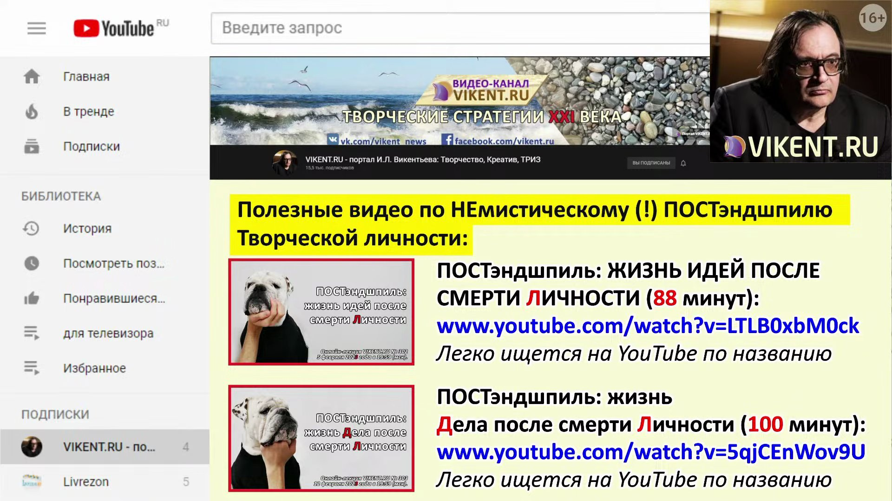

То есть вот, соответственно, я думаю, что бу буду просить где-то сделать новогодний подарок, перенести вКонтакт, хотя смотреть неприятно, что будет после вашей смерти. Будет масса дерьма. Вот что будет после вашей смерти и отдельные такие крохотные лепестки. Крохотные лепестки, ну, и так далее. И тем не менее, как бы, если не работать, то вообще только одно будет, как бы вот вот что будет, да. Поэтому посмотреть это чрезвычайно неприятно. Вещь малоисследованная. Повторяю, никаких кой мистики здесь нет. Никакой мистики здесь нету, как бы, да? Значит, кто хочет поговорить вслух, какие были приличные, неприличные, соответственно, ученички у Будды, у Конфу у Конфуса этим материалом свободно владею. Ну и заодно поумнее беседах со мной, как бы, и так далее, и так далее. Вот. Соответственно, я сказал, что сегодня мы про жизнь, про жизнь, про амбициозные планы. И давайте смотрим следующую фотографию семьи Альшулира. Тоже полёт в Крым. Тоже полёт в Крым. И вот начинаем смотреть функции. Начинаем смотреть функции. Никуда не торопимся.

---

## [00:32:45]

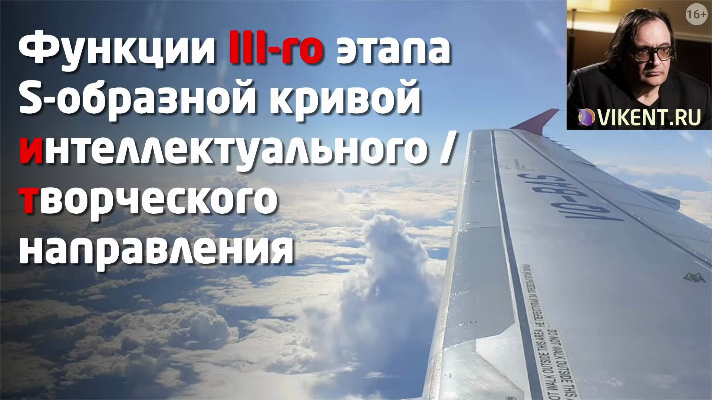

Давайте посмотрим вантовый мост в Питере. Вантовый мост в Питере. Давайте посмотрим. Вот, соответственно, и вот есть Гётта. Гётте. Соответственно, напоминаю, что в принципе Паэмуфаус Гёте, Гёта как бы вот в 186 году её выпустил, потом ещё переделывал. В принципе, он эту поэму писал 60 лет.

---

## [00:33:00]

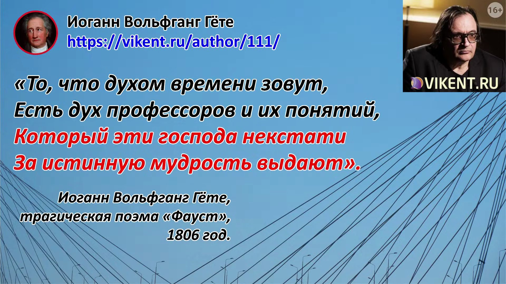

Ну, честно говоря, там рассмотрен как бы как бы один кейс, ну, может быть, несколько кейсов, как бы, и она известна во всём мире. Альшу рассмотрел 88 кейсов для гуманитариев. 88, больше, чем несколько. Больше, чем несколько. Поэтому в мире это неизвестно. То есть обратите внимание, что я сейчас сказал. Кто хочет поумнить, ну, уже помнил. То есть, в принципе, простенькие кейсы Гётта известно во всём мире. Настоящая работа по гениям, по искушения, про обходы искушения в количестве 88ми вариантов. Ну, грубо говоря, в стране занимаюсь я ещё несколько людей на русском языке. Всё, как бы. Ну, а мы думаем, мы думаем. Фотография Маргарита Крылова. Ну, мы идёмте дальше, да? Так вот, давайте идёмте дальше посмотрим на жалобу. Соответственно, считается, что одна из самых сильных королев, викторианская Англия, королева Виктория. И, соответственно, как бы англичане очень как бы тщательно оберегают свою девочку, как бы королеву.

---

## [00:34:15]

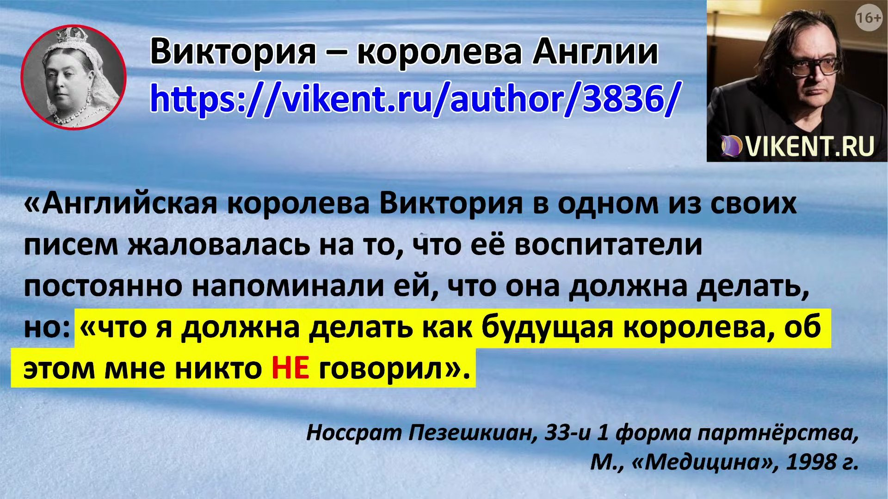

То есть это эталонное произношение, как бы эталонное поведение и так далее, и так далее, и так далее. Вот, соответственно, Желана в XIX веке можете навести справки, написано, где этой ссылки не будет в сноске. То есть биография королева Англии, это самостоятельно, дополнительно. Кто хочет, я не буду давать в комментариях. Соответственно, вы видите, соответственно, а что должна делать будущая королева к вопросу о методиках. Вообще, мягко говоря, никто как бы вообще и не озаботился. Вот судя по тому, какие дегенераты сейчас возглавляют большинство европейских стран, как бы, ну, как бы некая болезнь вернулась. Некая болезнь вернулась, как бы, да. Ну, давайте посмотрим дальше. Посмотрим дальше. Давайте дальше посмотрим. Соответственно, вот 14 вредных функций. Всегда люди спрашивают: "А это вот все? " Нет, значит, всегда. То есть как бы вы можете построить квадрат 14 на 14.

---

## [00:35:15]

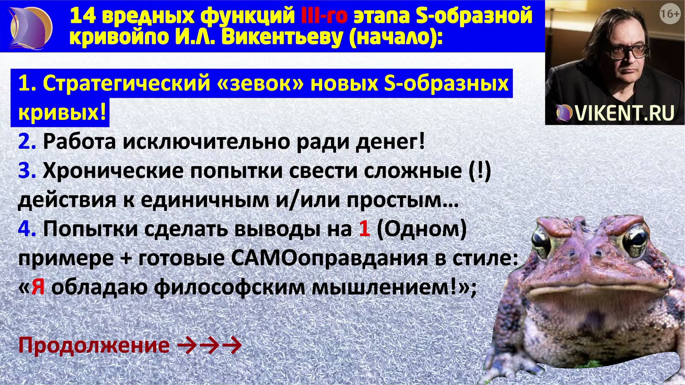

Соответственно, ну, вы понимаете, что там будет несколько сотен пересечений и быть как бы и количество функций будет большое. Здесь написаны вещи, в которых так типично вляпываются, в общем-то, умные люди. Умные умные люди. И в принципе этого достаточно. То есть составлять эти перени, то есть если кто-то захочет с по моящи к концу года, их количество может довести до 100. Возникает вопрос, кто их будет читать? Соответственно, где-то в 2006 году Анна Фрейд, как бы, опираясь на работы своего папаши Зигманда Фрейда к его дней рождения, кбилею, нашла там десятка или дюжину, не помню сейчас сколько, психозащит. В принципе, достаточно их знать наизусть, и, в общем, всё станет ясно. Ну, люди защищают диссертации. И, соответственно, в англоязычных источниках сейчас говорится о том, что количество психозащит доведено до 200. Соответственно, их никто не знает. Вот, соответственно, психозащитый вы можете щелчком мыши выучить как бы с нашего сайта посмотреть более подбно. В сети есть вещь, если вы работаете с людьми, чрезвычайно полезная как бы ваша нелюбовь к человечеству после выучивания списка наизустьсь, соответственно, соответственно уменьшится, уменьшится, уменьшится, уменьшится, уменьшится, ну и так далее. Так вот, соответственно, первая стратегическая ошибка умных людей, профессоров, академиков, членов корреспондентов, директоров НИИ, ну и так далее, и так далее. Вот это стратегический зивок новых и сообразных кривых. То есть, то есть вот, ну вот, к сожалению, к сожалению, мы об этом немножко говорили. Кто хочет поговорить ещё, спрашивайте, будем говорить. Второй момент. Это знали, в принципе, древние греки. возможно, знали ещё до кто-то до древних греков, но к древне греки уже точно знали, что, соответственно, можно быть рабом своего дела. Можно быть это ещё, ну, как бы относительное счастье. Можно быть рабом своих денег. Это совсем плохо. Всех денег не заработаешь, денег не украдёшь, в могилу их не возьмёшь, как бы, да. Соответственно, пункт третий типичная вещь, характерная для гуманитариев. То есть, соответственно, 3че очень похожая штука. Кажется, что они похожие. Ну, я вкладываю чуть-чуть разные смыслы. Задвоил, задвою очень похожие вещи. То есть на столе у меня постоянно присутствуют какие-то тома московско-питерских конференций. Большинство докладчиков, которые гуманитарная профессура, гуманитарная профессура и так далее. Вот. То есть гуманитарная профессура из курса арифметики в начальной школе усвоила ту истину, я даже скажу парадигму, что решение может быть одно и то же одно. И, соответственно, веками, ещё раз, гуманитарная профессора веками пытается сложнейшие явления, которые она изучает, то есть социум, искусство, педагогика, те же самые методики свести там к к одном к одном-двум переменным. Соответственно, там почитать книжки популярные по программированию, посмотреть просто учебник средней школы, где учится решать там систему неравенств, систему уравнений. Ещё есть системы дифференциальных уравнений. Есть ещё есть уравнения матфизики. Есть ещё смешанные системы уравнений, по которым летают ракеты, а я дипломированный ракетчик, как бы. То есть для гуманитария это такая вот вообще как бы высокая латынь. Вот, соответственно, скажем, вот пункт 3че, как бы, если человек, не дай бог, ещё и аспирантом это появивает, это несчастье. Это несчастье. А когда несчастье, у нас вылезает жабён, симпатичный, как быжабён. И, ну, и пялится на нас, как бы. Ну, давайте посмотрим следующие. Количество 14 наиболее типовые. Вот посмотрите, можете не верить мне, пожалуйста, не верите. Это до посинение у нас разрешается. Соответственно, как бы вот первый русский космист, соответственно, Николай Фёдо Фёдорович Фёдоров.

---

## [00:39:30]

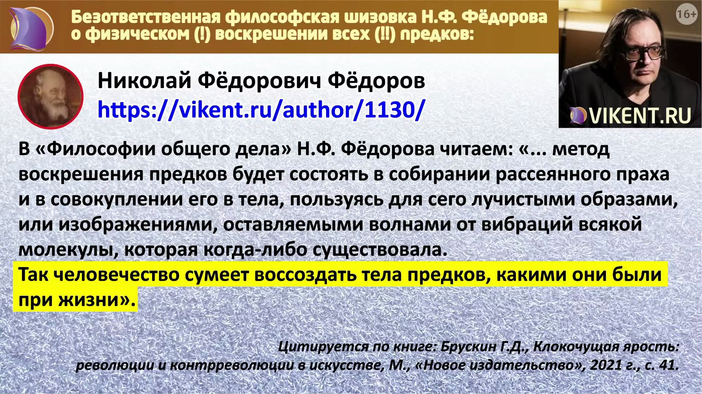

Он явно перечитал религиозный литературы. ссылки на портале там есть. Соответственно, и он призывал вообще всех всех всесх людей, кто помер на земле, соответственно, возродить. И вы дальше видите детальное описание проекта, как он собирался это сделать. Значит, обратите внимание, такая вот модная шизовка. То есть гуманитарии очень любят, учитывая их реальный интеллект, первый русский космист, какая блестящая идея, вот, и так далее, и так далее. Вот просто нет, это очень удобная отмазка. То есть это такая вот нормальная шизовка, клиническая шизовка. Клиническая шизовка, которой, соответственно, несколько веков можно размахивать, ни хрена не делая. Несков можно размахивать, ни хрена не делая. Ещё раз, как бы, да. Соответственно, я повторяю, мы сегодня про жизнь и прочее, прочее, прочее, прочее. Ну, давайте посмотрели забойный пример. Кто не знал, но почитайте, почитайте, кто пишет. Соответственно, скажем, вот пункт пять. Пункт пять, соответственно, интернет, социальные сети увеличили там число списываний там, ну, многократно.

---

## [00:40:45]

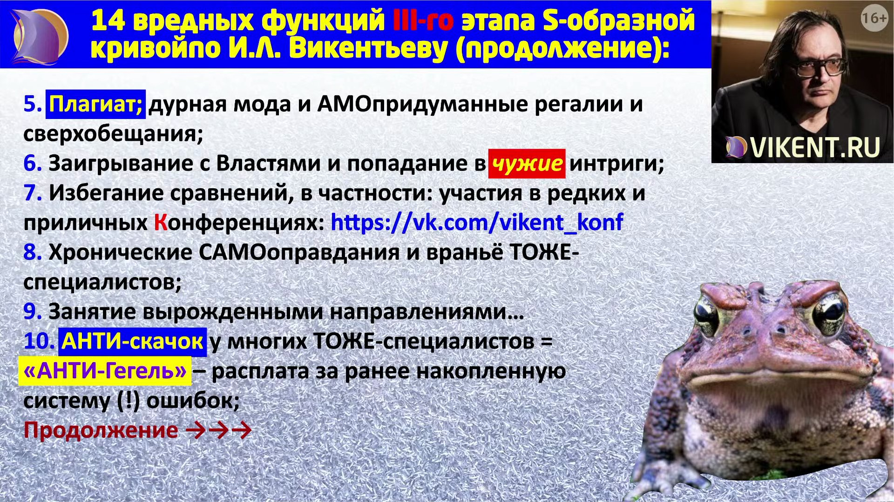

Считается, что в социальных сетях есть проценты, то есть проценты. Разные авторы как бы, соответственно, как бы так как бы верстальщик зевнул букву С, не ама, а самопридуманные регалии. Соответственно, несколько процентов само придуманной регали в пункте пятом у нас написано так далее. Вот, соответственно, просто-напросто подворовывание чужих результатов на науку, на методике это тоже распространяется. Поэтому на моём курсе мы очень требуем требуем, то есть вплоть до невыпуска на конференцию, чтобы люди ссылались на первые источники. Я вижу как бы периодически публикации каких-то людей, которые нас немножко занимались. То, что нужно ссылаться, у них из головы улетучивается через пару месяцев, как они пократили у меня заниматься. Вот, как правило, кончается это плохо. Как правило, кончается это плохо. То есть там целая гамма реакции и так далее, и так далее. Пункт шестой. Заигрывание с властями и попаданием в чужие интриги. Соответственно, пожалуйста, изучите Кирилла Серебренникова, который там через знакомых в правительстве вывел себе Googleцентр. Вообще внимательно посмотрите. То есть в моём понимании на старте рождения ГГ-центра в Москве как бы было ясно, что дело дело кончится плохо. Ну, посадкой кончится дело, тюрмой и так далее, и так далее, и так далее. Вот. Ну, соответственно, люди этим как бы занимаются, как бы, да. Соответственно, пункт седьмой - это некоторый диагноз. Соответственно, вот я вещаю из Питера, из культурной столицы, где с 1984 года, соответственно, у меня было в разные годы по-разному. Иногда это было еженедельно по субботам, иногда один день в субботу. Соответственно, у меня были они по-разному назывались бесплатные консультации по Трис. То есть мне многое дано, я многое в свою жизнь сделал, и мне этически кажется, что я могу бесплатно, естественно бесплатно этим поделиться. Соответственно, если человек тоже чем-то интересуется, ты есть в Питере и не пришёл на какую-то мою консультацию в 1986 году, там кошка рожала, жена рожала, ну, любые варианты, сестра приехала, да. Так вот, если человек занимался, как бы там, условно говоря, в восемьдесят шестом, девяностом, 2006, году, вот грядёт двадцать шестой год и как бы не посетил какие-то мои бесплатные мерятели повышения квалификации, соответственно, на него смотрит жабён, и жабён знает название вещества, которое у этого человека в голове, и вы его знаете. Если вы не знаете, ну, подойдите к ближайшему забою, обойдите его с другой стороны и почитайте. На заборе обязательно написано, что такого человека находится в голове. Значит, почему человек не участвует в конференциях, консультациях и так далее. Вот. Ну, потому что здесь что-то совершенно неважно, это мужчина, это женщина, это студентка, студент или так далее, и так далее. Вот. Потому что нужно будет узнать о себе правду. Как как бы я не смягчал, ну, придётся как бы узнать себе правду. Поэтому восемь на третьем этапе очень умные люди, которые всегда не забудут отдать отдать 3 руб. взятые у вас в долг, в долг как бы на горе Ильбрус в минувшем веке вам отдадут 3 руб. уже в этом веке. Это очень актуально. Соответственно, люди начинают врать. То есть врёт профессура, врут доценты, врёт проекты по научной части. проекты про обучение и так далее. Третий этап опасен тем, что ложь бывает может быть и на первом этапе, ну там скорее смесь с мифами, может быть на втором этапе такая чистосе сердечная ложь что-то не вырубается. На третьем этапе есть масса соблазнов, просто вра, ну, соответственно, скажем, люди, соответственно, врут себе, ближайшему окружению и так далее. Вот как бы, как правило, каким бы человек умным не был бы, олимпиадник или что-то ещё, как бы, ну, ещё щенок, ещё щенок, щенок интересный щенок, не врубается, потом начинает нормально, не всегда, нормально лезть в петлю. Ну, бывает абсолютная утрата, учитель обманул, ну, и так далее, и так далее, и так далее. Ну, потому что дурак, потому что дурак, да. Пункт девять. Соответственно, на третьем этапе чрезвычайно распространено занятие некоторыми вырожденными направлениями, чрезвычайно удивлёнными, что никто не спросил. Например, есть действительно научные задачи, есть есть как бы научные задачи, что где, когда есть научные задачи, а есть журнал Квант и некое олимпиадное движение. То есть, когда есть не какое-то количество в стране мужчин, мужчин, иногда это кандидаты наук, физмат наук, как правило, химических наук иногда, которые занимаются олимпиадниками. Далее, как у профессионального и такого очень неслабого патентовида, я о себе, то есть я имею право на такие реплики уже. возникает вопрос: а вот, допустим, можно заниматься с олимпиадниками, заниматься какими-то вырожденными, неестественными задачами по математике, по физике специально их придумывать, а как бы нельзя ли подемонстрировать наставник олимпиадников мне некоторые небанальные изобретения? Я очень квалифицированный патентовет. Вот, соответственно, это такая сложная форма лжи, когда люди занимаются, мы занимаемся КВН, мы занимаемся что, где, когда, вот мы и так далее, и так далее. Вот как бы мы занимаемся Comedy Club и интеллектуально развиваемся. Нет, вы занимаетесь интеллектуальным анонизмом, который, как вежливый человек я назвал вырожденное направление. Остерегайтесь. Остерегайтесь. антискачок, который я назвал как бы антигегель. То есть напоминаю пример самого Гегеля, который есть у него в книжке о том, что вот вода нагревается, нагревается, нагревается и в какой-то момент, соответственно, сложились всё как бы, значит, все плюсики, весь нагрев и пошёл пах. Произошёл качественный скачок, то есть из жидкого состояния вода имеет новое качество. Пошёл пах. Соответственно, как бы и похожие примеры тиражируются в различных учебниках философии. Соответственно, это поистекает, скажем, где-то пару веков уже. Пару веков такая нормальная, крепкая, с твёрдым знаком, крепкая философская глупость. Соответственно, есть и антигель, когда человек, причём, повторяю, это может быть какой-то перспективный доктор наук 30 лет, это может быть какой-то инженер опытный, ушедший на пенсию в 60 лет. и начать что-то вещать на Ютубе, на Ютубе, ну и так далее. Вот ВКонтакте, когда собрали большое количество минусов, и это, то есть антигегель, то есть собрал не плюсы, минусы, и антигегель догоняет. И, соответственно, то есть возникает некая социальная болезнь, которая очень характерна для коучей и вообще для коучей, для НЛПстов, части тезисов. Человек не может не врать. человек не может не врать, человек не может не врать, особенно при виде живых людей, рассматривая их как клиентам и так далее. Вот. И, соответственно, демонстрируя нервномерность третьего этапа, то есть есть список явно формируется, это одна из сегодняшних и светских тем, социальных болезней. А докторов, докторов по социальным болезням в стране нет. То есть я не могу считать себя доктором по социальным болезни. Мне лень этим заниматься. Если человек идиотствует, почему это может быть мужчина, это может быть женщина, но туда тебе и дорога, туда тебе и дорога. Можешь идиотствовать дальше. Ну, пожалуйста. То есть как бы как бы я сейчас себя плохо чувствую. Мне не не до того, чтобы кого-то хватать перед падением в обыв. Перед падением в обыв, соответственно. Да, да, это грустно, да, это пониру. И давайте посмотрим ещё как бы до 14:00 доведём следующий слайд как бы давайте, да, соответственно как бы вот на третьем этапе всегда есть обманы. Вот просто сразу же, то есть поэтому стратегически, особенно молоденьким девушкам, воспитанным, молоденьким мальчикам, каже, который здуру выиграл районную олимпиаду и считает себя умными, воще с дуру лучше вообще не вляпываться.

---

## [00:49:30]

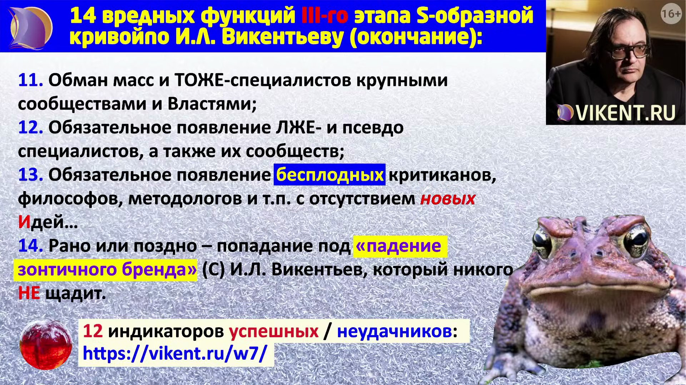

В дуще вообще не вляпываться. Лучше искусственно под моим руководством смещаться на второй этап. как бы он будет всегда. Соответственно, появляется арда, как бы сидящая по лавкам псевдо и лжеспециалистов. И, соответственно, веяние времени они даже начинают объединяться в сообщество. То есть не просто лже и псевдолюди, но тем тем не менее они начинают как бы так далее объединяться и прочее, прочее, прочее, прочее, прочее. Более того, есть паразиты, которые на них паразитируют. Одно время, на мой взгляд, пропаганда, имеется в виду кремлёвская пропаганда, на мой взгляд, это толком не использовала. В сети гуляли некоторые записи Сергея Удальцова, который, ну, как бы был посажен, даже думаю, что справедливо был посажен действующей властью. И, соответственно, была как бы в их компании гораздо более умная женщина, которая вместо борьбы с властью просто вышибала на себя, на шубу, на квартиру. Ну, фантазии у девушек небогатые, прямо скажем, я проверял, небогатые фантазии у девушек, как бы они вышибали средства и так далее. Вот, то есть как бы, да, как бы, то есть американцы давали деньги на Водольцова, а это потом переходило, соответственно, уже к тому вторичному, третичному паразиту. Неко некоторые девушки, которая вышибала, как бы эти видео одно дело гуляли, но как бы крымская пропаганда их не оседлала. То есть всё как бы ради всё деньги давали на протест против, значит, Кремля, а ушли они на шуму. На мой взгляд, как профессионального перщика власть недожала. Власть недолго. Далее 13. Появляются люди профессиональные балтуны типа политологов. То есть политологи ничего сказать не в состоянии. Они в состоянии уникальная профессия пересказывает первую страницу поисковиков. Политологи, такая стандартная, грустная шутка моя, они даже, по-моему, не знают, что есть ещё первые 50 страниц поисковиков. Уровень телевизионной аудитории таков, что можно ни за что не отвечая, соответственно, пересказывать какие-то шизовки, которые на первой на на первы на лентах не новостных порталов, ну и так далее, и так далее, и так далее, и так далее. Вот как бы, да, соответственно, появляются такие бесплодные катиканы и так далее. Вот. Далее, соответственно, вот пункт четырнадцатый очень интересный. Я это термин мой, что здесь происходит. Я это неоднократно наблюдал. Я это наблюдал на трис. Это было чрезвычайно неприятно. Тризовцы слов не понимают. И мужчины, и женщины, и остепенённые. Я это наблюдал на NLP, я это наблюдал на коучинге. Ну и ещё на ряде направлений, соответственно, то есть люди врут как бы вредные функции, и потом они формируют некоторый зонтичный падающий бренд. То есть в NLP есть некоторые осмысленные вещи, которые нужно продолжать изучать, там собирать примеры, ставить какие-то простенькие эксперименты и так далее. Учитывая, что большинство в состоянии только пересказывать без ссылок и с ошибками, неважно книги по NLP, книжки по Трис, ну и так далее, и так далее, вот, соответственно, соответственно, формируется такой антигель. Ну, в данном случае некоторые зончичный бред, что ты не умеют решать задачи. То есть они призывают к этому, но сами не выширяют. Лпиписты валят коммуникации, особенно групповые коммуникации, они валят, ну, и так далее, и так далее. И, соответственно, несмотря на то, что есть осмысленные вещи, некоторые зонтичный бренд падает и давит всех, не разбираясь. Человек был прав, человек работал, не работал и так далее. Вот меня вот последние годы хотители беспокоить знакомые. Вот вот в 2005 году ни разу не беспокоили и в четырнадцатом году, по-моему, тоже не беспокоили. До этого постоянно люди присылают какую-то шизню и говорят: "Кему ребёнку в школу походили ваши тызовсы. Вот Игорьч, мы как бы вас знаем, уважаем через запятую там и так далее". Вот. Но это же шиза, это же ваши. Вот мне очень тяжело объяснять, что я никакого отношения к этим шизовкам не имею. Ну, тоже с то же самое с бизнес-тренингами, то же самое с NLP и так далее. зонтичный быт, зонтичный падает, как бы его даже пытаются искусственного спасти. То есть все годы АвтоВАЗ пускает не какие вёдра с гайками. Вёдра с гайками. В общем, соответственно, в него вливают какие-то инвестиции, но зонченный бренд падает и всех давит. То есть даже тех, кто собирает два вида с гайками, зонченный бренд давит, давит, давит, давит и ничего не сделаешь. Да, можно быть дипломированным специалистом, можно иметь грамоту от руководства, а пле зонечному, падающему зонечному бренду на это наплевать, чем слюной сле. Соответственно, извините, будет жёстко ещё, как бы. Ну мы, естественно, идём дальше. Давайте глянем ещё. Соответственно, по-моему, единственное умное место вот Сурганова выпустила книжку, по-моему, чуть ли не единственное, ну, осмысленное место в её книжке. Вот как бы, ну и просто попалось, я процитирую.

---

## [00:55:15]

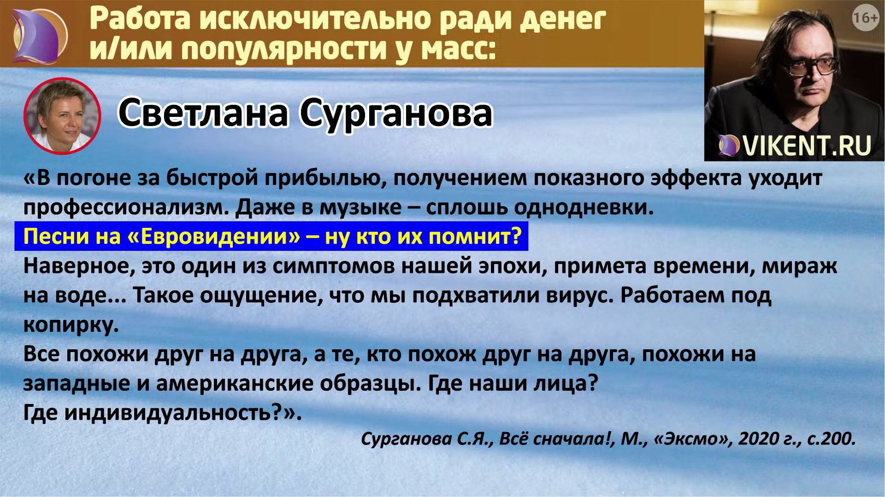

Ну, в принципе, просто пример, чтобы отдохнуть. Фотография Маргариты Геннадьевны Крыловой. Маргарита Геннадиева Крыловой, да. И, соответственно, и вот, соответственно, одна ещё история, я уже несколько лет её не рассказывал, у нас был такой портал трека. Мы её мы её сделали в два человека делали портал трека, трека тренеры, консультанты. И, соответственно, мы делали его без каких-либо вложений. Ну, понятно, что там за регистрацию нужно было заплатить какие-то там чуть ли не 50 руб., что-то в этом роде. И, соответственно, за оди год при нулевых вложений мы сделали 60 подобных проектов, включая РБК. Ещё раз креатив Игоря Ленадовича Викентьева, портал для тренеров-консультантов, как бы и мы обвалили 60 подобных проектов. Ну почему? Потому что Викентиев единственный, кто понимал из 60 игроков, включая РБК, которые большие специалисты по бизнесу, как бы что просто-напросто мы находимся на третьем этапе, тренеры и консультанты. И, соответственно, здесь нужен такой эффект, о котором мы ещё будем говорить. супермаркет услуг. У нас было 25 бесплатных услуг для тренингов консультантов. Такое никто не в стране, не в мире предоставлять не смог. И при нулевых вложениях, ну, я повторяю, 50 руб. - это нулевые вложения. Соответственно, за год мы сделали вообще всех, вообще всех в стране, включая РБК и какие-то другие, чтобы они не обиделись, соответственно, скажем, ну, и так далее, и так далее, и так далее, как бы. Ну, уже поздно. Другой пример сбразного третьего третьего этапа, это, к сожалению, это несчастье, это кровище. Ну, давайте на фоне Сургановы расскажу. Вы надеюсь иногда, что вам попадает в какие-то новостные известия. Это вот сейчас то, что происходит в секторе газа относительно, ну, масштабах России. Небольшой калачок на берегу, соответственно, хорошего моря. Израиль. И, соответственно, вот, соответственно, куда вот это вот большое количество палестинцев переселить, вот вся земля уже распределена. Умные японцы, как бы, ну, и ещё кто-то, соответственно, делают намывные территории. Делают намывные территории. Ну, палестинцы могут бастовать что-то ещё, что-то ещё, как бы. Ну, они вот, да, в Арабских Эмиратах тоже делают намыванные территории. Ну, как бы у нас общежитие нашего института жили палестинцы. Они очень славные ребята. С ними очень славно играть в карты, но намывные территории они не сделают. Почему я глянуч? Потому что третий этап. Ну, давайте посмотрим фотографию Александра Олеговича Романова. Вот. Ну, какой-то есть фанат в городе Иваново, который вот рассвечивает чёртовое колесо м самыми разными цветами. Но я вам показываю мировую знаменитость. Кто занимается фотографией, знают. Итак, Хельмут Ньютон.

---

## [00:58:15]

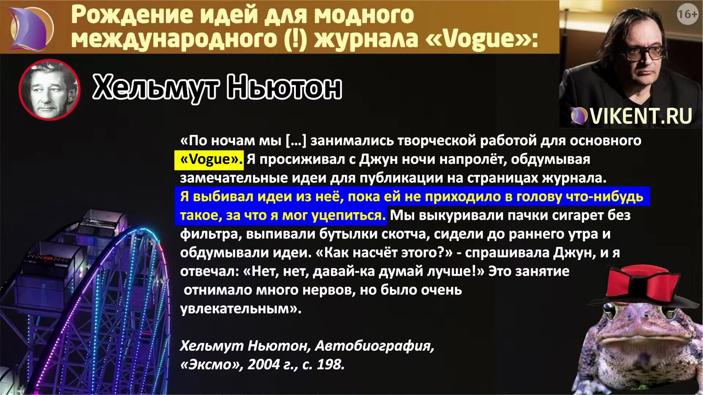

Вылеза Жабёного жена, когдана вылезает сюда в самой дурацкой шляпке. У нас специальная подборка дурацких шляпок. Вот мировая знаменитость, журнал ВОК, соответственно. И вот как Хельмут Ньютон в отсутствии методик просто из своей же из своей любовницы выбивает идеи. Ещё раз. Хельмунд Ньютон, как бы, ну, наберите без меня. Хельмунд Ньютон мировая пьющая знаменитость с точки зрения фотографии. Ну вот тоже, соответственно, то есть, ну не, то есть, ну, ну, во-первых, а, нехорошо выбивать идеи и женщины, вот второе, нехорошо пить, как бы вот нехорошо самому получить деньги и не очень делиться женщин. Ну, всё это нехорошо. И всё это третий этап. Хельмунд Ньютон это многократно описывает, да? Кто хочет почитать в авторобиографию, советую не читать. Нечего там читать, я уже прочёл, как бы, да? То есть, ну, соответственно, далее на фоне именно чёртового колеса, то есть повторяю, это мировой уровень. Вот что бывает в отсутствии методик вот неначитанности вообще в случае серости. Давайте посмотрим далее далее некоторые шизовки властей. Итак, некоторые Евгений Втушенко как бы соответственно рассказывает некоторые случаи, которые им подсказал ЦК ВЛКСМ. Читаем внимательно. Читаю внимательно.

---

## [00:59:45]

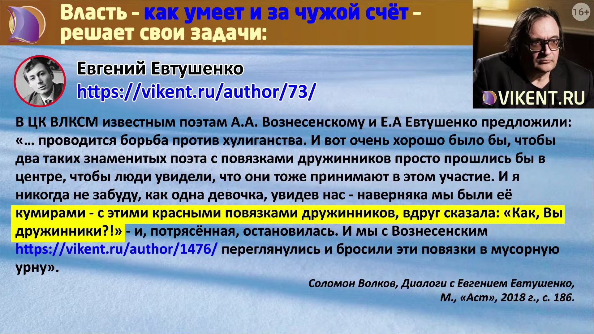

Тогда такого слова пиар, ну, за рубежом оно уже было в Москве. В Союзе такого слова не было. Но, соответственно, вот погулять по улицам Москвы. Два известных поэта, которые знают все в лицо. Соответственно, кажем, ну вот уро уровень такого советского советского пиара. Соответственно, это как раз мягкая иллюстрация, мягкая иллюстрация, что, соответственно, м вы можете заниматься замечательным делом. Замечательным делом. Когда вы начинаете хоть немножко связываться с властями, власть так устроена. Вопрос, скажем так, вопрос не очень исследованный. Вы просто не очень исследованный, но просто-напросто известный. Власть начинает вас потихонечку, в том числе там, давая деньги, что-то ещё, прибирать к рукам. То есть вот, допустим, я могу по себя сказать, как бы, что я независимый эксперт там по ряду там творческих направлений, как бы дальше я ставлю точку. Ещё есть несколько моих учеников в стране, и всё. И всё. Вот как бы как только начинаются гранты, что-то ещё, да, с грантами легче, да, с грантами легче. Соответственно, если вы успешны, вас накладывает на это на это свою лапу, и, соответственно, дальше начинается некоторый ужас, как бы ближайший ужас, ближайший ужас, который мы рассматривали, очень внимательно посмотрите, это опубликовано закон о креативных индустриях. Он опубликован, он уже формально говоря действует. Но если вы просто, если вам за 30, если вам за 30, как бы, ну, вы просто что-то в жизни уже видели, посмотрите. Если вы юрист, тем более посмотрите. Если вам нет тридцати, ну, посмотрите, что что пишет Госдума. Только вот внимательно, просто спокойно почитайте. Ну, общий принцип вас власть всегда вмешивается. И как бы вот насчёт то, что она помогает развитию, это миф из совкового фильма. Совкового фильма, что руководитель обкома помог молодому дарованию и стало счастье. Чушь собачек, к сожалению, очень хотелось бы верить. Ну давайте посмотрим следующее появление власти. Пример покруче. Пример покруче. Вот. Соответственно, вот как бы некоторые сейчас дам ссылку на книжку, вот эту книжку рекомендую. То есть автор малоизвестный, но это один из руководителей не Трофим Денисович Лысенко, а как бы дам ссылку на ээ этого самого, Господи, мы забыли мы ссылку.

---

## [01:02:30]

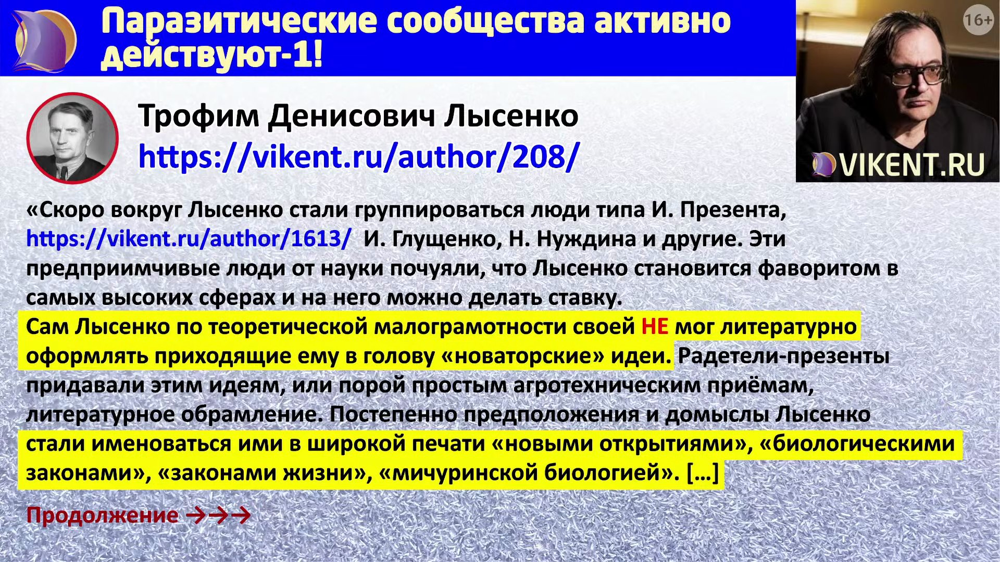

Вот. Да, мы забыли ссылку поставить. Короче, как бы поспросите меня, то есть это цитата из книжки одного из руководителей, значит, СССР, редкая книжка, но он принимал в этом дело участие, ему можно верить. Вот, обратите внимание, Трофим Денисович Лысенко, он даже был настолько интеллектуально плох, что не был в состоянии писать. Соответственно, его окружили различные философы, типа как бы Исаи Present, Present фамилия Исая Present, который, соответственно, там про ветвистую пшеницу, которая увеличит кратно урожай, кратно там несколько раз, ну и так далее. Вот давайте посмотрим. Давайте посмотрим следующий слайд. По-моему, мы зъевнули по-моему зивнули ссылку. Да, мы зивнули ссылку и так далее, и так далее, и так далее. Вот как бы. Ну, запрашивайте. Извините, мы зивнули. Я просто путаю.

---

## [01:03:30]

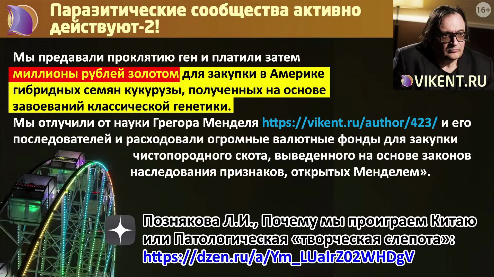

как бы, ну, ну неважно, как бы запросите, кого интересует эта ссылка и так далее. Вот одной рукой мы как бы делаем дурацкий пиар Лысенко, другой рукой мы тратим, значит, золото. Мы тратим золото на покупку за границей как бы, ну, новых сортов, соответственно, растений и, соответственно, животных. Растений животных. Ну, видите, другое освещение в городе Иваново, Чёртового колеса и так далее. Вот как бы и этим занимаются власти. Просто власти решили в меня вмешаться, казалось бы, в биологию и в философию. Ну, до сих пор по кибернетике и по биологии мы отстаём. Большое спасибо власти, которая это вмешалась после войны. До сих пор отстаёл в мире. В мире. Ну, власть вмешалась. Власть вмешалась. Давайте посмотрим дальше.

---

## [01:04:30]

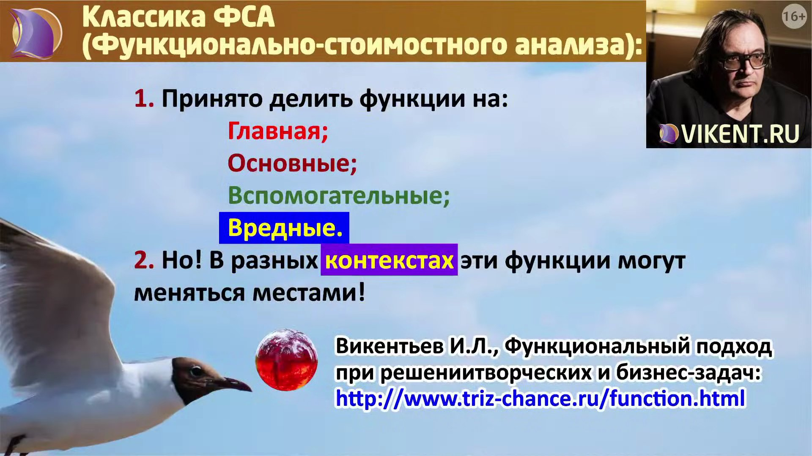

Вот перескакиваем. Перескакиваем, соответственно. Соответственно, перескакиваем. Итак, классический функциональный стремостной анализ. Кто не знает, что классический функциональный стремосной анализ, есть очень коротенькая статья, которую желательно знать близко к тексту. Не потому, что она моя, к этому очень спокойно отношусь, потому что лучше вы не найдёте. Вот в коротком изложении просто тупо нет, тупо нет и так далее. Хотя есть большое количество докторских, в том числе на которые, на некоторые из них, не на все докторские по ФСА, я писал отзыв, я просто попал в профильный институт и, соответственно, скажем, писал отзывы на докторские, которые там потом куча людей подписывала. Надо сказать, что я писал разгромные на дураков отзывы. Их, кстати, начальство попускало. Никакого влияния на посужденное научной степени доктора наук это не влияло. Соответственно, позже мне предлагали много раз защитить и кандидатскую, и докторскую. Ну, понимая, как это происходит немножко изнутри, я отказывался, но я отвлёкся. То есть, соответственно, вот напоминаю, что принято делить функции, как бы, и повторяю, это можно поменять и к технике, можно поменять осторожно, немножко осторожнее, но тоже можно поменять гуманитарному направлению. То есть мне удалось выделить просто-напросто какие-то функции, характерные для письменной речи. И очень хорошо, очень хорошо сделана работа. То есть функциями очень удобно работать. И вот такие функции бывают главные, основные, вспомогательные, вредные. Вредные мы только что с вами посмотрели. Есть важная оговорка, что иногда как бы в сложных контекстах, например, в обществе функции вредные и там полезные могут меняться местами. То есть, соответственно, одно из направлений работы профессиональных, акцент на слово профессиональных диверсантов, не диверсантов, а профессиональных, то есть, соответственно, значит, различные объекты работают по определённым правилам, там неважно, там тец, пароход, что-то ещё. Вот если чуть-чуть, ну, надо просто знать, куда постучать, нарушить, то, соответственно, будто она авария и готова. Не надо ничего взрывать. Вот, соответственно, как профессиональный эротичек и человек, понимающий в морском оружии, могу вам сказать, что вот эти вот безумные дымы, безумные дымы в кино - это как бы пиротехники, потому что профессиональные менёры, профессиональные ракетчики, профессиональные артиллеристы знают, что когда взрыв даёт много дыма, много огня, это просто затраты. Это вредная функция, потому что на дым и на огонь - это затраты. Это затраты. То есть путь вообще взрывается без огня и без дыма, но осколки летят дальше. То есть это пиротехнические пиротехнические радости. То есть для киношников, для киношников вот как бы то, что профессионалы считаются вредными вредными затратами, вредными функциями, дым огонь является основной. Вот. Потому что иначе так не прошибают, не прошибают, господи, как их называются, зрителей. Зрителей. Ну, давайте посмотрим некоторые такой пример. Забавный. Забавный тоже. Это единственный пример в книжке, который есть, по-моему, приличный. Нет, вы там два примера есть. Ещё один пример. Итак, соответственно, Астропович Велначли собирал коллекцию русского искусства, как водится Алиша Усманов.

---

## [01:08:00]

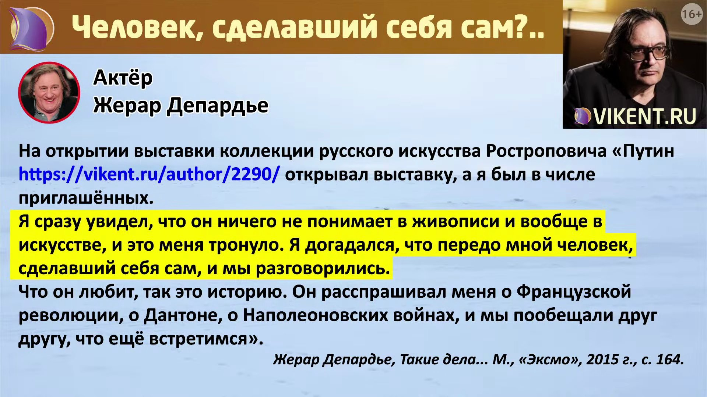

И её выкупил, тут же переподарил России прямо Константиновском дворце в Петербурге. Соответственно, иначе как без актёра жара депарди это было не пидарить. Вот же погде приехал Тезн из Франции. Вот и нашёл родную душу. Вы видите, нашёл родную душу и, соответственно, стали они переписываться, соответственно, так далее. Вот как бы, да. Вот, соответственно, почему я это привожу, соответственно, ну вот, допустим, допустим, как бы вот это не совсем так. То есть, если вы внимательно почитаете, есть биографии президента России, то, соответственно, у него были некоторые наставники. Я не называю этих наставников, но они были. То есть, как правило, на третьем этапе, неважно, девочка, мальчик, даже зрелый человек, без матёрого наставника, матёрого наставника разобраться очень тяжело. И говорит: "А если я считаю себя умным? До посинения, до посинения, пожалуйста. Вот наставник как бы ну очень желателен и вот на третьем этапе, в принципе, на первом, на втором тоже, но на третьем это просто то, что доктор прописал. То есть потому что без наставника может сложиться, ну, если наставника ещё не ссылаться, ложное впечатление, что что-то человек сделал сам. Ну, соответственно, это, к сожалению, не так. Давайте теперь посмотрим некоторые полезные функции. Ну, сам само звучание полезные функции. Давайте следующий слайд. полезные функции говорит о том, как бы вот, да, здесь даны полезные функции не с точки зрения продуктов, это через через консультацию.

---

## [01:09:45]

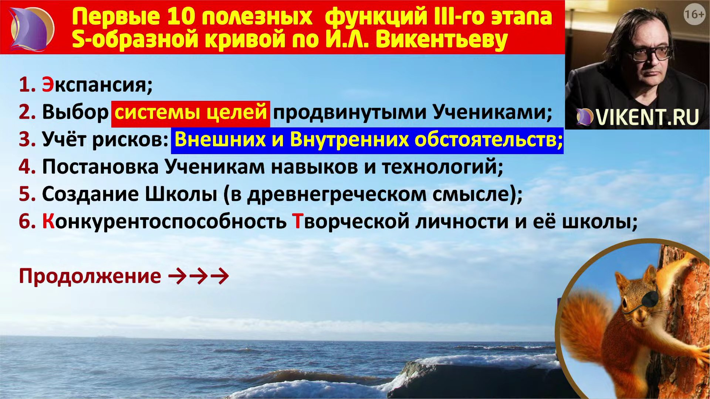

Вот с шестнадцатого будет консультация, значит 16 + 7, как бы вот там, когда там, значит, будет будет ещё одна консультация в конце ноября, там будем говорить про продукты. Сейчас я говорю про про жизнь, потому что, ну, человек занимается делом, хорошо бы этого дела не осложнять. Вот вы видите бельчона, когда у нас влезает бельчон любопытный, и он влезает на фоне некоторой старой финской лестницы. Это старая финская дача врепина. И к ней ведёт некой очень крепкий фундамент. Там три ступеньки. Три ступеньки. Поэтому такое фото и мы и взяли. Вот, соответственно, нужно понимать, что вообще общая такая функция, которая не перечисляется альшулим нигде и так далее, это экспансия. частный частный случай экспансии - это достойная цель и так далее. Вот. Но экспансия шия, шия. Далее, соответственно, честно, хорошо и правильно, если и у лидера, и, соответственно, и у лучших учеников есть ещё и ещё раз именно система цели. Не одна целей, не одна цель, а именно своя цель и так далее, и так далее, и так далее. Соответственно, как правило, очень умные люди, они не врубаются, не врубаются во внешние внутренние обстоятельства. Ссылки на внешние внутренние обстоятельства Темен Генриха Чайшули многократно были даны, ну, на этом спецкурсе. Вот создание школы в древнегреческом смысле. То есть, если человек занимается некоторым делом, соответственно, допустим, Эйлер, Эйлер, математик, то, что он выдающийся математик, никаких, соответственно, возражений нет. Но он так же, как игаоус, он не любил преподавать. И, соответственно, школа является некоторым сильным таким шагом, но не обязательным. То есть, соответственно, как таковой именно такой школы, то есть есть последователи или есть последователи Гаоса, но, соответственно, вот именно школы в таком античном смысле, как ученики непосредственно общение, не сложилось. Но, повторяю, если человек вообще занимается делом, к нему должен присоединяться какие-то люди. Я сейчас смотрю безумно грустные как бы какие-то личные страницы тризовцев. Первое, они чрезвычайно плохо одеты. Это тезис помогли мне сформулировать коллегой из из города Иванова. Я никак не мог понять, что меня раздражает в тызовских личных страницах. Они одеты ужасно. Просто я не о брендовой одежде. Они просто безвкусно ужасно одеты. Просто безвкусно и ужасно одеты. Да. Вот, соответственно, годами годами как то, что им в девяностых годах предлагалось мною многократно заниматься делом, вам может засвидетельствовать романсови флареску, который обычно у нас смотрит как бы вопросы к нему, да? Соответственно, то есть вот если человек занимается нечто несколько десятилетий и нет школы, школы, вот это странно. Странно. И вы не Эли, вы не гас, как бы это странно. Пункт шестой. Как ни странно я называл, у Альшулера тоже этого нет. Как бы конкурентоспособность, но в данном случае нужно понимать, что на третьей этапе есть большое количество негодяев и негодяек, соответственно, которые будут пытаться конкурировать нечестно, то есть воровать, списывать, плагиатить. Плагиат - это уголовщина. 146 статья как бы по уголовному кодексу и так далее. Вот. То есть, то есть они просто даже даже не знают, что можно честно конкурировать, честно конкурировать, поэтому вынуждены думать о конкурентоспособности уже школы и так далее. Вотли этого хода, кстати, нет, хотя он вульгарен. Давайте идёмте дальше. Соответственно, должна быть результативная работа школы. Соответственно, есть очень плохой признак. очень плохой признак. У нас, допустим, идут постоянные консультации.

---

## [01:14:00]

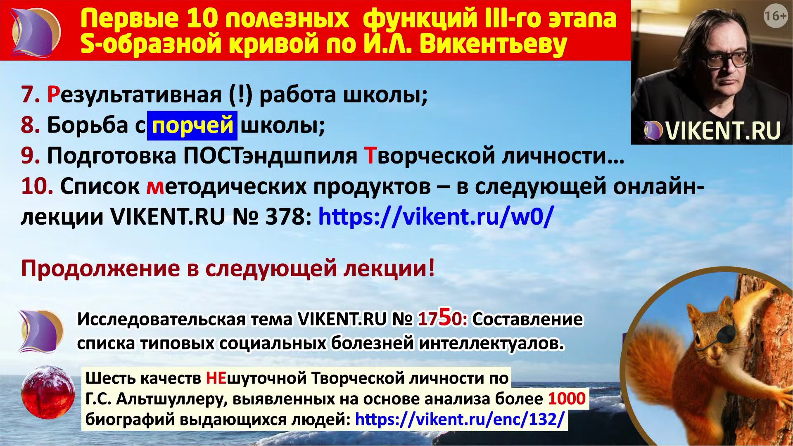

Вот воскресенье прошедшее у нас была с утра до вечера, то есть в буквальном смысле до ночи, даже до ночи, соответственно, десятки были консультации, скажем, по конференциям двадцать шестого года. Двадцать шестого года. Соответственно, вот есть некоторый негативный признак. Соответственно, м я несколько раз поставил эксперимент. Первый раз эксперимент мне позволил, помогла поставить мать, и она уже ушла. К сожалению, большое спасибо Анне Павловне Викентьевой. И, соответственно, скажем, в девяностые годы нам было не жалко, мы всегда много чего выписывали. И, зная интересы тризовцам, ну, как бы мы высылали 51му тризовсу выиски из бюллетеней, изобретений, из журналов, ну, знаю примерно направления. То есть Тризовость интересуется географией, делает как бы задачник, и мы высылаем по географии какие-то примеры. Так вот, соответственно, это продолжалось несколько лет. мать человек старой закалки без всякого компьютера. Она записывала, что кому она как бы выслала. После чего ты часто собирались у нас в коммунальной квартире вот она спрашивала, меня спрашивала, она человек интеллигентная была. А что ты сделали? То есть 51 человек. Так вот, ты не смогли были сделать одну заметку. Ещё раз. 51 человек высылаются готовые отборные материалы. Они не в состоянии сделать заметку о статье, о докладе, о книжке не может быть и речим. Аналогично ВКонтакте, у меня было несколько людей. Я начинал обычно годика через полтора понимать, что человек хочет сделать доклад, взял тему или взяла тему, иногда это женский особь. Соответственно, как бы я высылаю какие-то книжки в ПДФе по теме, я высылаю какие-то видео, выслая отдельные примеры, человек не выходит. Соответственно, через 2 года мне становится просто интересно, сколько человек может заниматься идиотизмом, находясь в неподвижном состоянии. Ну, потом я появиваю общение, ну, лет пять, вот лет пять ВКонтакте, социальные сети, интернет, то есть человек годами не в состоянии просто во что-то превратить уже присланные примеры по теме, не в вот просто не в состоянии. К вопросу о социальных болезнях. Социальные болезни есть. Докторов по социальной Я отказываюсь от лечения. Я не лечу социальные болезни. Думаю, что я смог бы, но я я их не лечу. У меня много чего есть, нужно, чтобы сделать. Соответственно, восемь. Учитывая, что люди приходят очень разные, на третьем этапе начинается эта гниль, на втором этапе может начаться, по крайней мере. Соответственно, с элементами гнили нужно очень быстро, желательно хирургическим способом обращаться. Первый, кто меня навёл, лично меня на эту мысль, был Антон Семёнович Макаренко, который как раз говорил о том, что один такой как бы воспитанник испорченный, соответственно. Ну и сам Макаренко не знал, что делать с юными проститутками. Сам Макаренко, ну, это знают только исследователи этого учества сам. Он пытался вообще их не брать, потому что работать она не хочет. Вот. Но она знает, как зарабатывать уже, да, несчастный человек, но тем не менее, соответственно, лучше это делать хирургическим способом. То есть школу нужно блюсти. Надежда, что сама школа сама себя вылечит. Ну, изучайте историю коммунизма, изучайте христианство, ну, и мы вместе посмеёмся, как бы, да. Далее, девятое, как бы, величайшие умы человечества, величайшие гении. Соответственно, включая, к сожалению, Альшуле, который много для этого сделал, соответственно, большое количество учеников Альшули оказались, ну, мягко говоря, не учениками, а ученичками. То есть, ну, к сожалению, я об этом много раз говорю, к сожалению, вот с тем, чтобы продолжить продолжить дело, это с этим у людей слабо. С этим у людей слабо. Ну, замечательно. Там некоторые люди, я к ним не приналежу, говорят, что Жуков замечательный полководец. А где полководческая школа Жукова? Ну просто где? Просто меня интересует, как бы, да. Вот. Ну и другие замечательные люди. Очень сильный, очень жёсткий вопрос. По федеральным каналам телевидения интервьюеры никогда такой вопрос не задаст. Ну надо учитывать уровень федерального телевидения, ну и так далее, и так далее, и так далее. Соответственно, сегодня мы говорили про жизнь, а вот именно акценты совсем конкретные, методические продукты. Ну, через 2 недели, поскольку шестнадцатого у нас некая консультация. Кто впервые, кто впервые у нас, посмотрите, тема 1750 у нас непрывная нумерация 1750 тем. Значит, в МГУ, СПбГУ, российских академиях наук множественное числа такого нет. Соответственно, вот гениальная работа Ашулера, которая началась с папочки, когда человек несколько десятилетий складывал газетные и журнальные вывески, потом стал прицельно читать литературу по творческим личностям и опять-таки опередил МГУ, СБГУ, академию наук поводу теории личности, ну, и творческой личности. Вот мы сегодня про жизнь. Мы сегодня про жизнь. Прощу, про вашу жизнь. Про вашу жизнь, да. Давайте посмотрим примерчик. Вот есть коротенькая биография. В этой книжке там масса изобретений, кстати. Вот в этой книжке именно изобретения Тесла интересует. Вот эту книжку можно посмотреть. Там выдержки из американских патентов.

---

## [01:20:00]

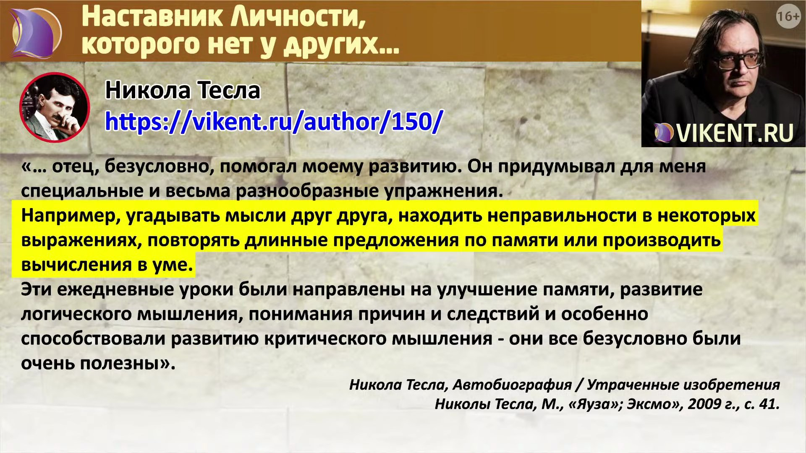

И американские патенты такая, как патентовет говорю, такая традиция уже с XIX века. Американские патенты гораздо более подробные, чем российские. То есть иногда американский патент - это книга. То есть в буквальном смысле это книга. Ну кто видел американский патенты, у них немножко другой формат листов, чем у российский, ну, это книга. Ну вот, соответственно, Тесли повезло, как бы. И обычно, я об этом очень часто говорю, что обычно первый наставник - это родители, это естественно. И, как правило, подготовить ребёнка эмоционально дальше найти какого-то специалиста всё-таки. Почему я так говорю? Потому что, ну, я работал с детьми и часто помогал им делать домашние задания для средней, ну, естественно, старшей школы. Большинство родителей, имеющие высшее образование, даже имеющие научные степени, затрудняются помочь своему ребёнку по литературе, имеют в виду сочинения, по решению задач по физике, по химии. Хотя кандидат наук вот, заканчивая школу, по идее должен это помнить. Но по факту, по факту ещё как бы на уровне начальной школы могут помогать детишкам как бы делать домашние задания или какие-то проекты. Как только попозже, ну вот, мягко говоря, мягко говоря, большие сложности. Ну вот интересный ход, который отец отец, соответственно, Николу настаивал. Никола описывает как бы, ну не всё влезло, а как бы о том, что у него была такая интересная мать. И вот в целом изобретательский талантом он обязан матери. Обязан матери. Кто интересуется Теслой, книжку можно почитать. Там в основном патенты, ну, первая часть - это автобиография Тесла. Ну, давайте посмотрим теперь. Решил всё-таки вставить один продукт и так далее. Вот. Вот посмотрите. Fance list, XIX век. Соответственно, как бы обычно концерты были солянки сборные.

---

## [01:22:00]

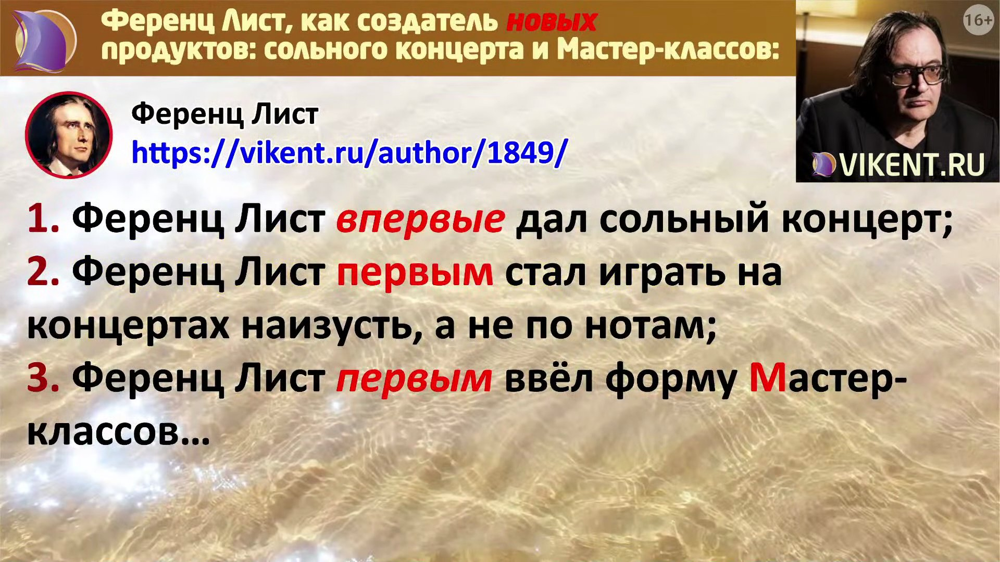

Ференслист и композитор, соответственно, скажем, и пианист, и дал не солянку сборную, то есть различные номера, различные номера, а именно сольный концерт, когда один человек, ну, для этого нужно, естественно, хорошо играть на хорошем инструменте, ну, и так далее, вот в хорошем помещении, да. Далее он, соответственно, стал играть на изусть. Ну, это, соответственно, некоторая некоторый уровень профессионализма. То есть, если быть профессиональным консультантом, вот некоторые вещи и стрис, в частности, нужно знать близко к тексту профессиональным консультанта просто знать на десятилетия. Соответственно, он первым вёл, ну, можно найти какие-то античные аналоги форуму мастер-класса. То есть в интернете можно найти как бы масса щенков, которые пытаются как бы в двух соседних объявлениях устроиться на работку в Пятёрочку и параллельно проводят мастер-класс. Это всё чушь собачья, это инфацыганщина и так далее, и так далее. Мастер-класс, когда человек учит несколько учеников в присутствии других преподавателей. То есть передаётся ноу-хау, передаются какие-то тонкие моменты. То есть, условно говоря, он учит и учеников, и мастер-класс предполагает обучение разработчиков, профессионалов, других мастеров. Отсюда название мастер-класс, а не семинар или тренинг. То есть до мастер-класса надо ещё дорасти. Ну, ференс вист новейшие истории, соответственно, скажем, соответственно, скажем, нас этим богатим. Большое спасибо Феринсу, а мы идём дальше. Мы про жизнь сегодня. Давайте посмотрим интриги. И вот, соответственно, некий человек Геннад Гикмен поставил эксперименты на животных, поставил эксперименты на себе и обращался к властям Англии и Франции, что разрешить хотя бы обезболивание давайте попробуем на уголовниках на с помощью закисей азота.

---

## [01:24:00]

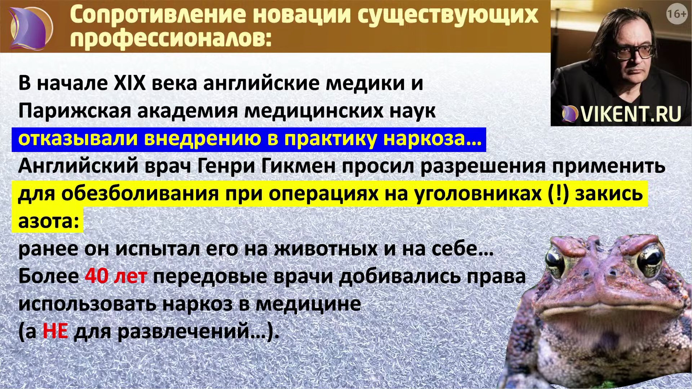

Закись азота была открыта не им. Там там есть несколько претендентов, в частности, Дэви. И, соответственно, студенты и химики, они об этом знали, и они, значит, как бы нанюхивались закисью азота и сихисикали, то есть использовали, ну, как настоящие попсовики, как для развлечения. И несколько десятилетий, посвящённая Англия, посвящённая Франция, ну, в России этим занимался Николай Иванович Пирогов и так далее, и так далее, тоже тоже не без боя. Соответственно, то, что можно обезболивать, обезболивать, как бы на это ушло несколько десятилетий. Это о том, как власти, власти, в том числе специалисты, старые специалисты, соответственно, работают с инновациями. Вот. Ну а нужно делать. Хирурги старой школы до Пирогова должны были делать, соответственно, операции очень быстро, потому что просто больного держали, просто держали руками. Это понятно. адские боли, ну и так далее, и так далее, и так далее, и так далее. Вот. И вот, соответственно, врач Генри Гикмину, как правило, его не медики не знают, ну, и так далее, вот как бы, да, так далее. Вот вы вы всё видите, как люди очень быстро соображают. Одна и такая тонкая вещь, тонкая вещь, порадовавшая. Несколько недель назад прошла конференция у Василия Александровича Верченко, город Москва. И Василий Александрович Веченко, думаю, что он не обидится на меня. Вот, соответственно, он прислал мне благодарность, то есть прошла конференция Верченко, а благодарность от организатора конференции получил я. Благодарность была очень коротенькая, но очень такая тонкая, скажем, что Игорь Леонардович, благодарю вас как бы за коллег, которые, ну, были докладчиками на этой конференции. Соответственно, вы можете посмотреть конференцию Василия Санвича Верченко. Скоро он начнёт выкладывать её. Аналогичные конференции в Москве по близкой темы, которая проводится. Вот, соответственно, как бы в нашем варианте всё было просто. У нас были подготовленные люди, которые нормально, без спешки, без фанатизма взяли темы, соответственно, так потихонечку работали в течение года без пешки, без фанатизма, без факелов. Никуда не надо бежать, с факелом и с топором. И сделали такую очень крепенькую конференцию. Обратите внимание, я не говорю потрясающую, уникальную, а просто других таких конференций такого качества и очень важный критерий такой стабильности. московские конференции, одна звезда, ну и все остальные гарнир по бокам. Так вот, Василий Александрович Веченко очень тонко поблагодарил за подготовленных коллег, которые можно было сделать. Соответственно, если у вас есть миллион рублей, миллионы рублей, 2 млн руб., постарайтесь сделать нечто похожее, как бы на конференцию Василия Сановича Верченко без наших людей. Да, можно в Москве, можно в Питере. Постарайтесь. Можно 3 млн, пожалуйста. Это для умных. Мы сегодня про жизнь. Постарайтесь постарайтесь. Василий Алесандвич Веченко нашёл нашёл правило делания комплиментов тонких. Ещё одно. Вот. Идёмте дальше. Соответственно, вот, да, вот вот книжка, как, которую я рекомендовал, и там мы не пробили фамилию.

---

## [01:27:45]

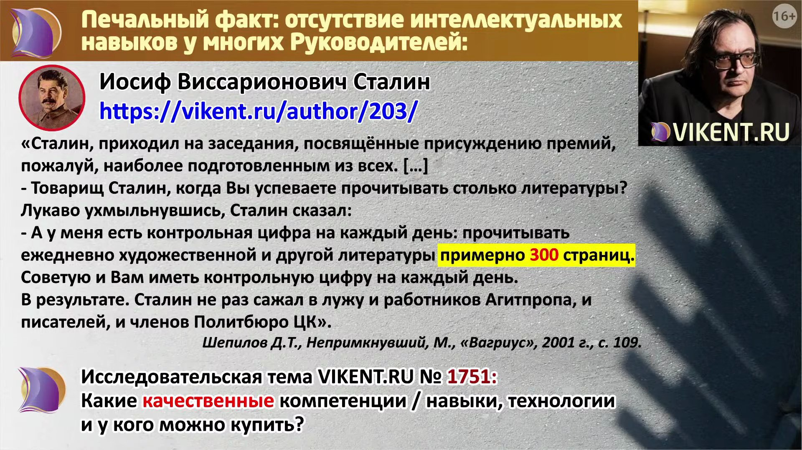

Я путаю Шипилова и Шилипина, в данном случае Шипилов это главный редактор правды, там генерал армии, ну и так далее, и так далее. Вот Шипилов принимал непосредственное участие вот воина Сталина чуть попозже в деятельности нашей страны и приводит очень большое количество очень интересных фактов. Вот книжка малоизвестная, на неё мало ссылок. Кого интересует, многих людей интересует, что было после войны, там влияние Сталина и так далее. Вот. Вот, соответственно, Сталин лично обсуждал различные премии там по науке, по искусству, там по кино и так далее, и так далее. Вот. И, соответственно, Сталин, самоучка, более модный термин автодидакт. автодидактичек, само занимался самообразованием, он довёл до, в общем, такого, ну, средненького количества страниц в день 300 страниц. Это несложно. Это несложно. Так далее. Нужно читать. Соответственно, вот просто просто нужно взять и читать. Взять и читать. Соответственно, обратите внимание, как бы вот очень интересный момент, который у нас сегодня ещё пригодится, что, соответственно, очень малое количество руководителей на соседней странице Шипилов как бы описывает о том, этот пример я поставил, значит, как бы, по-моему, и сюда и поставил, соответственно, в анонс лекции, в анонс лекции, отвечая на вопросы как бы абсолютно безграмотных хрущёв, которые просто-напросто просто как бы просто не умел как бы ни писать, ни читать. И отсюда пошли помощники, референты, которые как бы нечто писали. Господи, Хрущёв не всегда понимал, что он читает. Ну, ну масса, короче, явлений, масса явлений и так далее. Ну вот перед нами возникает эффект антигеля, который как бы, ну, собрал минусы, произошёл некоторый качественный скачок, только в отрицательную область, в отрицательную область и так далее. Посмотрим следующий пример. То есть книжка Шепилова, она интересная по истории. По истории. Вот, соответственно, соответственно, мы уже строим социализм.

---

## [01:30:00]

Вот. И Сталин понял, как бы то, что пишут, какую ерунду академики. его не устраивают. И он говорит о том, что вот у нас нет учебника по учебника по советской экономики. Соответственно, вот поили, кормили на одной из сталинских дач творческий коллектив, чтобы они так или иначе написали учебник по экономике. Вот. Потому что мы строим экономику, а продукта нет. Строим экономику, а продукта нет. Вы понимаете как бы уровень уровень как бы тех академиков, которые соответственно закладывали основу. Закладывали основу. Вот печально. Таких примеров вот у Шипилова. В общем, их серия, их серия, их серия. Мы дали на девственно свежем снегу. Фотография Магриты Геннадиевны Крыловой. Ну, аналогичный пример у нас был, когда Сталин тоже вызывал примерно в эти же годы Валентина Асмуса логика и говорил о том, что как бы не экономики не знают, руководители, думать не умеют. Напишите учебник логики. Асмус написал глупый учебник логики. Как бы руководителям нужна не логика, просто Сталин не знал, что нужно руководителем. Как бы я знаю, но ко мне по этой части никто не обращался. До сих пор. Этот учебник сейчас на всякий случай 2025 год никто не обращался, что нужно руководителям. Ну давайте дальше. Давайте дальше. Обратите внимание, здесь три три цвета сделаны специально, да? Это замёрзший финский залив, около берега, снег. Ну и там где-то где-то там каштат, короче, где-то там каштат.

---

## [01:31:45]

Давайте чуть-чуть поговорим. Я уже об этом сказал, но для закрепления материала давайте немножко поговорим о людях. О людях.

---

## [01:32:00]

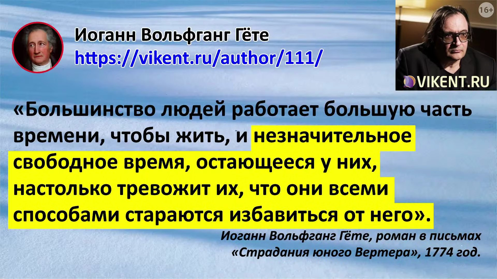

Вот вы видите опять-таки Иоган Вольфнгётте, соответственно, который написал в роман в письмах страдания юного Вертера, излечился, ну вот такой классический приём психотерапии. До сих пор он работает, описывает свои проблемы. Вот. И породила волну, вы не ослышались, волну самоубийств в Европе. То есть стало модно убиваться от несчастной любви. Вы видите, но сам сам выпался, сам вылез, сам вылез. Ну и так далее, и так далее. Вот. Но тем не менее, обратите внимание, что большинство людей работают большую часть времени, чтобы жить. Вот. И крохотное время. Ну, соответственно, мы сегодня про третий этап, но я всегда призываю заниматься пучком неких своих дел. Это адски трудно, особенно вот как бы на начальных этапах. На начальных этапах, пока дело не стало плодоносить. Ну, тем не менее я как бы призваю побеждать, побеждать. Ну, и давайте посмотрим ещё как бы одну антикоучинговую штуку. Давайте посмотрим. Давайте посмотрим следующий слайд. Опять-таки очень интересный момент. Почему я вставил эту такую, в общем, незатейливую мысль? Мне ежедневно, как бы я не чистил свою ленту ВКонтакте, потому что я постоянно пытаюсь от идиотизмов её чистить, ну, как бы Facebook, кстати, чистится лучше Facebook, но я меньше им пользуюсь сейчас по понятным причинам.

---

## [01:33:15]

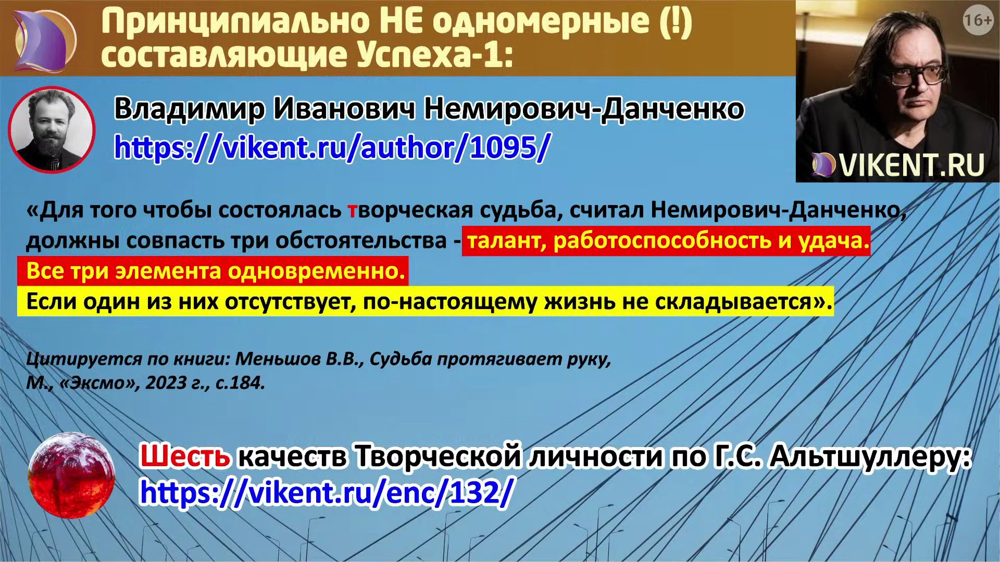

Вконтакте как-то временно чистится лента и так далее. Вот. Соответственно, есть безумное количество, к сожалению, женщин, вроде даже симпатичных, которые фактически ежедневно, хотя я чищу свою ленту от них, пишут ерунду. Пишут ерунду о составляющих успеха и так далее. Вот. Вот Владимир Иванович Немирович Данченко, который построил вместе со Станиславским один из лучших театров XX века, легендарным МХт. легендарным хап, значит, разработали они систему там подготовки, обучения. Он указывал, опять-таки, хоть был гуманитарий, но что-то понимал, минимум три компоненты. Здесь гораздо важно ни какие компоненты, потому что вот все три элемента, понимае, удача. Ну, удачу можно прогнозировать. Удачу можно прогнозировать. Так, то есть, например, обвалить 60 сайтов, включая РБК поводу консалтинга и тренинга в стране, например, как бы, да, это можно обвалить, если вы дело, ну, как бы работают мои мозги, ну, и так далее. Гораздо важнее другая мысль, как бы, что вот как это не одномерное понятие. Вот дамочки просто нулись на одномерном понятии, и коучи просто мужики обманывают цинично, а дамочки просто нулись. И гений, гений, ещё один гений Альшуль, более крупный, чем Владимир Владимир Иванович Мирович Данченко, он выделил на статистике выдающихся людей шесть качеств очекой личности. Сейчас немножко благодаря моим исследованиям можно поспорить, немножко можно допомнить Альшулера, но вот это минимально термина стрис, минимально работоспособная система у Альшулера, не у Немировича, у Альшулера, который уже позволяет работать. И желательно, желательно напомню вам, что у масс людей как бы впечатление об успехе - это, соответственно, вот бежится, бежит со стометровкой, вот кто первый. Соответственно, я просто вам напоминаю, что есть такие не очень известные почему-то, но не очень зрелищный вид спорта, как, например, там десятиборье, иногда называется многоборье. И, соответственно, там есть различные этапы, и это делает один человек. Ну, просто я на память могу как бы сбиться в перечислении, что такое многобое, десятиборье. Посмотрите, вот жизнь, в том числе творческая жизнь, она больше похожа не на стометровку. Стометровку снимать легче, поэтому все знают. А многобои там они где-то плавают, где-то они бегут, что-то ещё снимать тяжелее. Поэтому люди не врубаются, ну, и попадают в добровольные обманы. Идём дальше. Ещё раз посмотрим. Тот же слайд. Тот же слайд, соответственно, скажем, как бы, да, соответственно, бях Грус, соответственно, у него есть, ну, это по-русски, у него есть действительно уникальное видео, где, соответственно, он нам преодолевает там какие-то какие-то льды, реки, горы, то есть совершает там различные подвиги.

---

## [01:36:30]

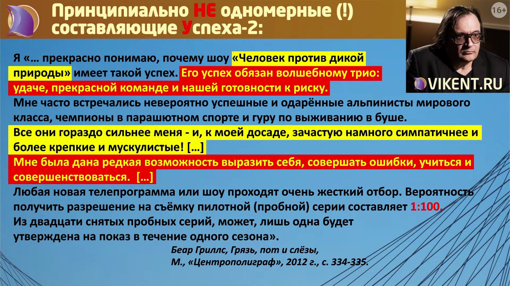

Его, конечно, страхует группа, но в воду он лезет сам. в зимнюю воду, это холодно, но он лезет сам. Вот обратите внимание, другой человек, который, думаю, что Анимировича Данченко вообще понятия не имеет. Вот вообще не имеет понятия, но тем не менее, да, группа его страхует, естественно. Естественно, это страховой полюс, но тем не менее несколько составляющих несколько составляющих жизненного успеха. Я сейчас не про продукты. Про продукты через 2 недели я про жизненный успех. Так вот, ещё один раз рассказывал уже раз пять, соответственно, в восьмидесятых годах несколько человек в ТРИС, наиболее таких, ну, которые, в принципе, прилично более-менее работают, они поняли, что Трис из увлечения перерастает а в профессию и Трис перешёл в профессиональную стадию. Заходя не скрою и посмотрел некоторые личные страницы тризовсов, масса тризовсов до сих пор это не поняли. На всякий случай, учитывая интеллект некоторых, я просто должен сказать, что сейчас 2025 год, а это было понятно в 1986 году. И тызовцы очень обижались, в том числе разные траблшутеры и так далее, что их не берут в тызовские компании. Тызовские компании не берут тызосы, не берут тызовса в компанию. Мы же все друзья. Мы же все друзья, правда, да? Так вот, соответственно, ещё и ещё раз просто посмотрите, из чего состоит десятиборье. Посмотрите то, что писал Биарх Грюс. То есть очень важно, что они Симировичем Данченко указали несколько составляющих успеха. На мой взгляд, эти списки недостаточные, но чрезвычайно важно, что их несколько. И, соответственно, помните про эффект зонтичного бренда. То есть какие-то двоечники и троечники бегают по рынку. И я хорошо отношусь к NLP. Там есть масса осмысленных вещей, правда, бессылок, правда, украденных, в том числе, допустим, у гештальтистов, нописты сами обвалили зонтичный бренд и, соответственно, как бы в России, и, соответственно, в мире. То есть в Москве для кодовиков проводятся семинары, что не брать лпистов, нлпистов просто-напросто на работу. моим ученикам, которые делают крупнейшее такое мероприятие по ложе науки, по ложе науки, соответственно, в Москве и Пите иногда, значит, учёные против мифов постоянно присылают заявки в лже учёных на тызовцев, потому что терпеть это уже, то есть какие шизовки они несут, какие шизовки они несут. Тизовцы, то вообще вы хотите попасть в идеальные каналы вот с вашими шизовками? Напишите, пожалуйста, мне под этим видео. Вы хотите попасть вашими шизовками на федеральные телеканалы? Хотите, попадёте. Хотите, попадёте, да? Ну и так далее, и так далее, и так далее. Ну давайте посмотрим дальше. Итак, как бы, да, значит, соответственно, соответственно вот некоторые сильные ходы и так далее, вот некоторые выводы такие, сильные ходы и прочее, скажем, да.

---

## [01:40:00]

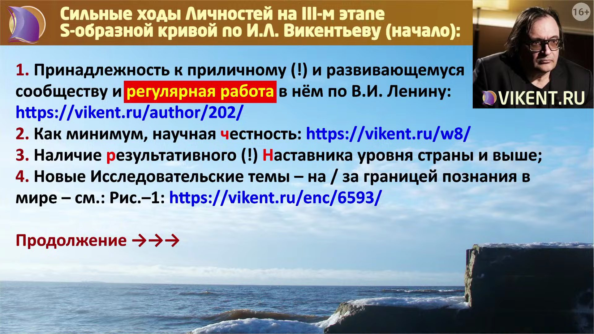

Вот, соответственно, чрезвычайно важно в 2025 году прилежать какому-то развивающемуся сообществу. Ну, простейший пример вот это вот видео, если внимательно наблюдать, то есть кто задаёт уточняющие вопросы, кто прислал фотографию, кто делал монтаж, кто делал рисунки, кто делает коллаж. Андрей Валерьевич Толмачёв делает коллаж, то вы наберёте 10-15 человек минимум. То есть вот просто сделать похожее видео, похожее видео в одиночку теоретически можно. Ну, повторяю, теоретически. Теоретически теоретически. Практически, мягко говоря, тяжело, мягко, да. Пункт два. Пункт два. Совет. Ну, в быту бывает всякое, но как минимум, если вы занимаетесь делом, врать самому себе в деле, как врал Лысенко - это западло. То есть я знаю, что за падло не научные темы, но его понимают даже академики. Даже академики. Даже академики. Соответственно, пункт третий. Годы жизни. Иногда десятилетия жизни может м может помочь наставник. Наставник, соответственно, которые дают некие темы, только некие темы. Сейчас мы их посмотрим в очередной раз. Соответственно, как правило, эти темы, и это честно, не списанные какие-то, допустим, с американских сайтов, там, с латино-американских сайтов, с немецких сайтов, а эти темы впервые в мире. Как только у нас тема не впервые в мире, всегда есть риск, что, соответственно, человек, который этим делом занимается, он вульгарно списал. Ну, просто пользуясь знанием языка, либо заказал себе списать. Ну, давайте посмотрим. Хотя, по идее, все должны узнать. Итак, вот вышла книжечка недавно. Недавно в октябре она вышла. Это их на самом деле больше. Я только что показал 1750.

---

## [01:42:00]

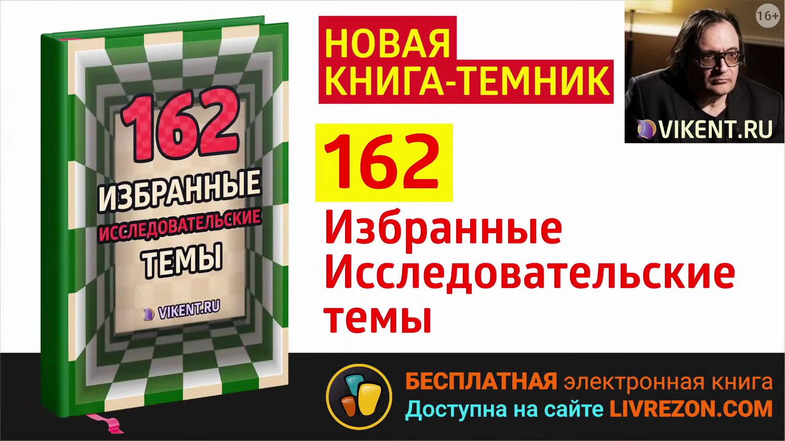

Это некоторые отборные, избранные светские темы. Вот на границе и за границей познания. Никакой мистики нет. Здесь можно спокойно работать, потому что Академия наук крупнейшего института страны амбициозных амбициозных целей боятся. Ну, ну и так далее. Вот книга По моему настоянию и большое спасибо издательства Ливызу, сделана бесплатно. То есть все барьеры сняты. Все барьеры сняты. Ну мы знаем, что есть эффекты, когда человек лет пять получает отборные материалы по своей теме и ни черта не делает. Когда мне это мне это надоедает, я порываю отношения. Ну, потому что это уже вредит моему здоровью. Ну а вредить моему здоровью нельзя. Просто вот на моём курсе вредить моему здоровью нельзя. Надеюсь, на помне общате. Надеюсь. А мы продолжаем далее. Далее. Вот очень важно выработать какую-то процедуру.

---

## [01:43:15]

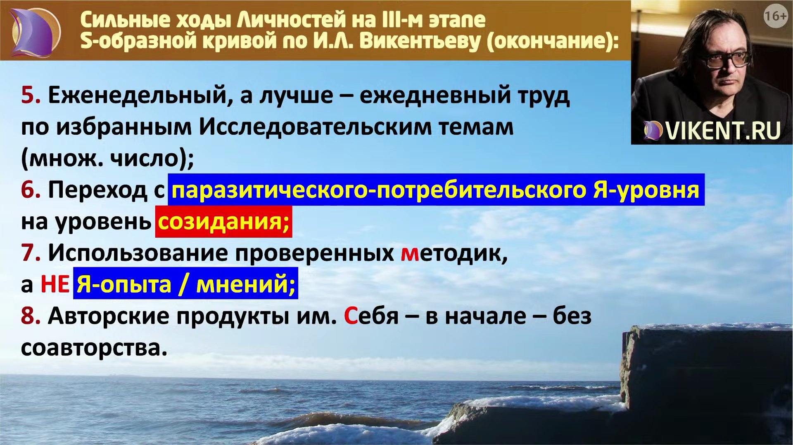

То есть утром на пробежке, вечером гулянка с пёсиком или с котом, игра с котом, положить всех спать, позаниматься или только в субботу, или только в пятницу, или только в выходной после лекции викенде вдохновляющей очередной. Но нужно заниматься очень желательно ежедневно. Иногда есть люди тугодумые у них они долго думают, долго думают. Может быть, и еженедельный труд, но систематический. Значит, вспомни про папочку Альшулера. Одна папочка позволила ему сделать все академии наук и все российские, носоветские университеты. Все. Ну и был партийный заказ разработать челове личности будущего, там коммунизма и так далее, и так далее, и так далее. Да. Соответственно, пункт шестой. Мгновенно слышу человека, который ко мне обращается в социальных сетях. Львиная доля. Львиная доля - это потребители, которые вечно хотят готового, причём в стиле одноходовки. Два поехлопа, три поехлопа. То есть, соответственно, особенно это очень в бизнесе. То есть, как правило, в девяностые годы действительно можно было объявить скидку и иметь успешный бизнес. Ну, просто одноходовка заключалась в скидках и нормально проорать по это. Сейчас такие простейшие решения, как правило, уже не катят. То есть бизнес перешёл к многоходовкам, а масса бизнесменов из девяностых, они до сих пор мыслят одноходовкими. Вот я сейчас скажу слово ум, и у него бизнес пойдёт, как бы, да, заниматься не надо, учиться не надо, ориентироваться на лучшие практики не надо, избегать типовых ошибок не надо. Вот слово ом и будет счастье. Повторяю, фактически ежедневно этот бред я вижу ВКонтакте, хотя я чищу ленту, но контакт сопротивляется. Чистки, к сожалению, Facebook более послушный, там лучше чистится ленты и так далее. Вот поэтому для тех, кто занимается такими туди, желательно переползать на уровень созидания. Созидания, и вам не будет стыдно ни перед миром, ни перед детьми, ни перед окружением. Зачем вы жили, зачем вы жили? И так далее. Соответственно, пункт седьмой. Очень сложная мысль, особенно для некоторых мужчин и амбициозных женщин, что если есть проверенная методика, то желательно поступать по методике, а не как я привыкла. Очень сложная мысль, как бы я постоянно вижу загубленные судьбы, когда человек начинает изобретать своё на ровном месте. Не имея моей квалификации, человек заваливается. Ну, обычно заваливается за несколько лет, но начиная от квартала за несколько лет заваливается с помощью такой методической самодеятельности. Методическая самодеятельность, распространённая в крупнейших городах России, социальная болезнь. Докторов по ней нет. Мне, я бы мог быть таким быть доктором, но мне это не интересно. Восьмое. Я постоянно подговариваю докладчиков и не рекомендую первый доклад, первая книга, первый видеоканал, первый тренинг. Кажется, что проще вдвоём, но вдвоём проще переваливать ответственность и жаловаться мне, что партнёр как бы закосячего. Я рекомендую первые результаты только мона. Ни за кого не прятаться, делать авторские продукты и имени себя. Вы видите на наших конференциях, там, допустим, масса названий докладов, где есть фамилия докладчика. Это сделано абсолютно специально, как бы докладчик отвечает своим именем, докладчик отвечает, соответственно, своим фамилиям. своим фамилиям. Ну и, соответственно, если похожие вещи выполнять, то есть обратите внимание, никаких как уникальных способностей, никакого в ндеркиндерства, никакого ндеркиндерства, соответственно, спокойно выполнять через несколько лет, как бы, ну, если ещ хватает ума советоваться, за несколько раз в своём направлении вы какжем начнёте по проверяемым параметрам в несколько тысяч раз проверяемым поэмо там превосходить, ну, как бы соседи по тому же ВКонтакте. Ну, ВКонтакте просто очень всё как бы наглядно, ну, и так далее, и так далее. Вот. То есть люди, занимающиеся наукой, творческими дисциплинами, креативными индустрии, как бы одинаковые слова, но на это попадаются как бы школьники и студенты, аспиранты, хотя не только они, конечно, и взрослые тоже, что один под одинаковым названием как бы диапазон. диапазон может быть в несколько тысяч раз. То есть количество поработанных книг, количество поработанных биографий, количество поработанных ээ консультаций, количество там консультаций в день, ну, например, там 30 консультаций в день онлайн по разным продуктам, ну, например, да, как бы, да, ну, и так далее, и так далее, и так далее. Вот как бы вот и и соответственно количество законов нашей родины приняты, по идее, вышедший из определённой головы. Ну, например, да, соответственно, и по таким вещам разница между людьми, у которых по паспорту формально есть одинаковые права, одни и те же права. Вот так вот. Разница в компетенциях, квалификации, в метанавыках несколько тысяч раз. Вы видите, появилась третья ступенька финского домика. Появилась она здесь не случайно. Давайте посмотрим светские темы. Мы потихонечку идём к концу уже к выводам ближе.

---

## [01:49:00]

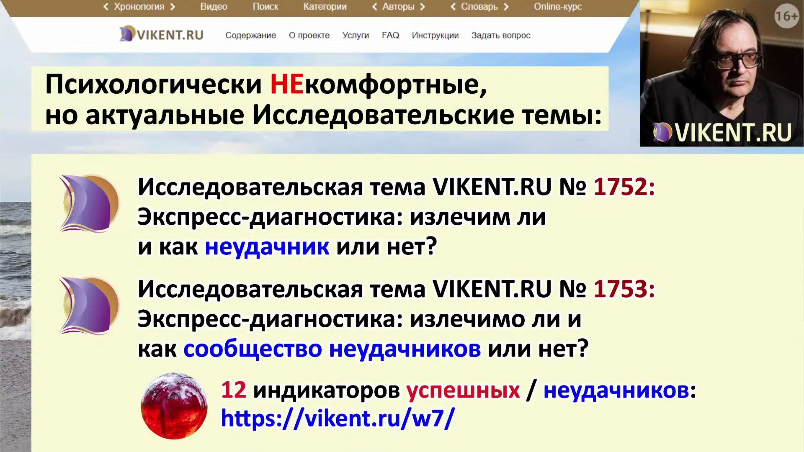

Соответственно, скажем, да, соответственно, по идее и социальные болезни. Я об этом говорю, тема печальная. Я постоянно ВКонтакте вижу людей, которых консультировал, которые ни черта не сделали. У них был шанс. И они, мягко говоря, антибуратина, наверное, они его как бы подойсти зарыли. И как бы у белок как бы забыли, то есть белки зарывают орехи и забывают по белищей дусти. куда они зарили орехи. Ну вот довольно жалкое впечатление производит. Довольно жалкое впечатление, как бы. Ну я сделал моя совесть чита. Я сегодня буду спать чрезвычайно спокойно. Чего, чего я вам желаю поворить на задав вопрос на шестнадцатое число с тем, чтобы завтра я встал выспавшися и с утра стал бы отвечать на ваши вопросы. Да. Ну давайте посмотрим ещё один слайд. Так вот, посмотрите, пожалуйста, для тех людей, кто как бы ходит кругами вокруг нашего проекта и делает глупости. Вот просто-напросто, значит, соответственно, вот мы занимаемся докладами.

---

## [01:50:00]

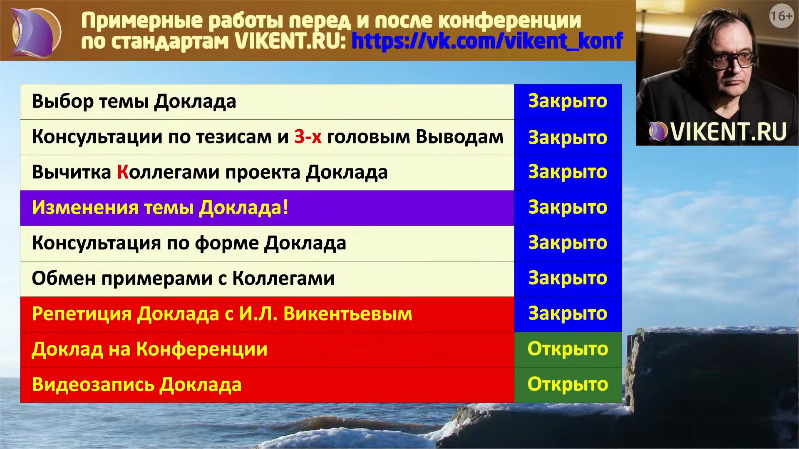

Доклад просто-напросто это не есть цель. Это некая ступенька, которая только что была. Вот они, в принципе, и есть некая ступенька в развитии. То есть качественный доклад человек меняет себя. Человек меняет себя. Вот посмотрите, пожалуйста, по нашей технологии. Причём самое интересное, что это, в принципе, можно делать открыто. Мы иногда публикуем открытые Google облака. Опыт показал, что почти бесполезно. Почти бесполезно. То есть без подготовки и без похождения обучения у меня минимум полгода, лучший год, а лучше ещё несколько лет, люди вообще как бы пишут фигню. То есть поэтому просто-напросто выкашивать фигню какую-то. Ну просто это силы, это силы, это силы, силы. То есть, соответственно, люди видят только то, что помечено зелёным. Зелёным на на на зелёном на курсе пынято обозначать некие ученические щенячьи ошибки. Синим, синим как бы принято показывать такие очень важные стратегические ошибки. Только обратите внимание, те, кто как бы вокруг курса онлайн там годами ходит и ни хрена не делают, ну, по обыч русской интеллигенции, вы вот эта вот часть айсберга, которая синяя, вы не видите. И как бы, соответственно, потом из переписки понятно, что слушая годами, в лучшем случае, в лучшем случае вы освоили там два-три термина, пытаетесь ими щегалять, как бы, а элементарный доклад как бы вы сделаете не в состоянии. И а сколько не в состоянии? А годами не в состоянии. Ну вы не развились, вы не перешли на следующую ступеньку. Конституция не запрещает вам оставаться на нижней ступеньке. Вот на это надо понимать, что дополнительно конституции есть ещё некие законы в жизни, которые, важная фраза, в конституции не прописаны. Я сегодня пытался некоторые акценты поставить. У меня большой опыт с 1979 года по накопленным человеческим глупостям. Ну, извините, что затянул. Переходим к выводам. То есть некоторые выводы будут повторяться. Давайте я проскачу. Да, понимаются вопросы по В принципе домашнее задание. желательно его делать. Оно сделано с тем, что присылайте, да, финский залив, фотографии семьи Альшулера, Зеленогорск, соответственно, ну, как вы видите, снег только вот так.

---

## [01:52:30]

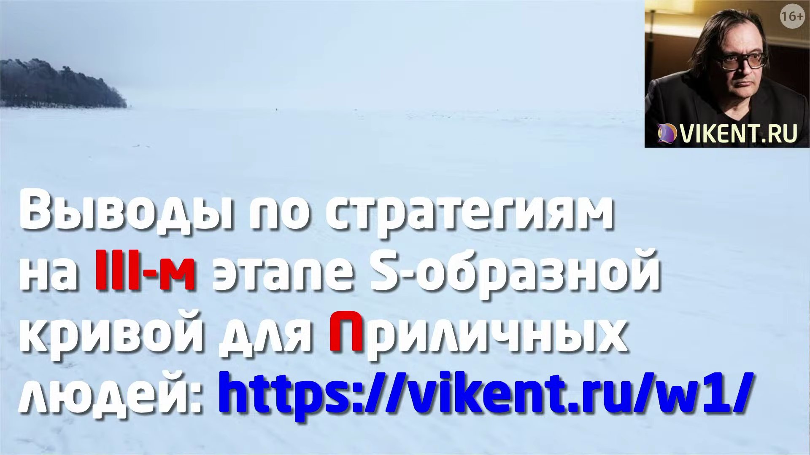

Давайте к выводам переходим, хотя будет повторение, да, соответственно, на длинных дистанциях, то есть если вы увлеклись на неделю выращиванием огусов на подоконнике, у вас ничего не получилось, но и чёрт с ним.

---

## [01:52:45]

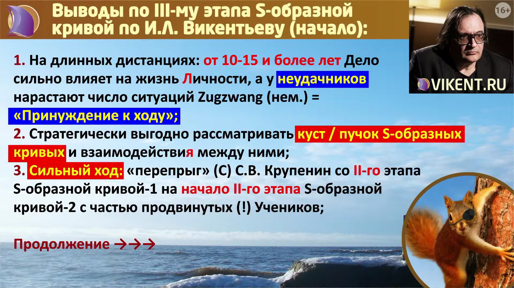

То есть купили, потратились на как бы горшок, как рассаду для грусов там, ну и так рассаду сидела собака, ну и так далее. Ну и чёрт с ним. Ну вот на длинных дистанциях, на длинних дистанциях есть обратное влияние. То есть если вы хотите обмануть жизни, но опыт стаился много раз, как бы не получается. Вот по-немецки написано тукс. Принуждение к ходу. Это чрезвычайно интеллигентно. немцы. Соответственно, это ситуация о шашках или в шахматах, когда любой ход ошибочный. Периодически на меня вываливаются какие-то тызовцы, которые уже шамкают, которые уже давно на пенсии. Они проиграли свою жизнь. То есть как бы ничего, кроме дать им де невозможно. Деньги будут потрачены бездарным. Любой их ход бездарный. любой у сразу же повторяю это могут быть не только тезисы, большое количество как бы как бы науки, как бы методик, как бы творческих дисциплин, креативных дисциплин, всё то же самое. То есть вот если есть амбициозные цели, на длинных дистанциях дело незаметно мстит. Где коварство? Незаметно. Незаметно, когда конференции проводятся часто, у нас семь штук запланировано в году. Это видно, кто вы по отношению к коллегам, когда вообще не участвуете, потому что не дай бог сравниться с Викентиевым и узнать о себе правду. Вот. Ну, соответственно, это путь к деградации. Соответ путь к деградации, да. Вот сюдически вы рассматриваете именно несколько тем. Глотку сорвал, об этом говорил и так далее, и так далее. Вот ещё раз большая благодарность Сергею Владимировичу Купенину за образный такой термин. Будем его навязывать в наших лекциях. что, соответственно, это кажемое счастье, кажемость, что село на одну как бы сообразную кривую и вывезет. Если мы занимаемся какой-то динамичной темой, завезёт в деградацию. Если у вас серьёзные амбиции уровня страны, Европы и мира, желательно сделать несколько перепрыгов. Ну, если вы вообще как бы если вообще как бы из породы Бельчонов, из породы Бельчонов, вот Бельчов как бы он человек амбициозный, вы видите, сувал нос куда не надо, как бы один глаз выбит, ну и так далее, и так далее, и так далее. Вот давайте идёмте дальше как бы, да, вот, да, соответственно, как бы вот пункт четвёртый.

---

## [01:55:30]

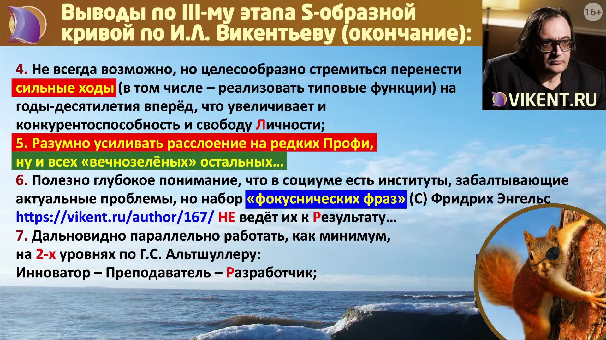

расскажу баечку масса людей попа покчке но ежедневно нет еженедельно я вижу я вижу какой-то бред про даосизм то есть люди как бы с пришёптываниями говорят о том что вот есть теис есть антитеяс и как бы это чрезвычайно как бы круто то что аналогичные вещи были у древних египтян и так далее и так далее они не знают допустим то что теис плюс теис является синтез у Гегеля они походили в институтах, они это тоже не знают и так далее, и так далее, и так далее. Вот, соответственно, пункт четвёртый. Соответственно, чрезвычайно осторожно существуют некоторые сильные ходы. Буду рассказывать через 2 недели. Сегодня я пытался вдохновить. Возможно, мне это не удалось, не знаю, напишите мне. Соответственно, как бы, ну, по крайней мере, это думать. Следующий момент. Я об этом много раз говорю. Как правило, люди не понимают это. на кто вне курса с первого раза не вырубаются. Итак, в конце XIX века, в начале XX века возникли крупнейшие университеты. Ну, в Питере, например, это Санкт-Петербургский государственный университет, это Политех, соответственно, скажем, ну, ещё ряд других. В Москве тоже понятно, что есть ряд крупных вузов. И там в этих вузах большое количество студентов, по количеству студентов они повышают какие-то здоровенные заводы преподавателей. И, соответственно, там есть стада преподавателей, у которых вообще нет идей. Эти преподаватели могут быть старшими преподавателями, доцентами, докторами наук и так далее, и так далее, и так далее. Вот. То есть незаметно в конце X, в начале XX века сложилась некая прослойка людей, трансляторов, которые, вообще говоря, мягко говоря, ничего ничего не не в состоянии сделать сами, но они могут транслировать, особенно гуманитарии некоторые модные идеи. В принципе, есть моды и в математике, в дурной математике тоже есть моды и так далее, и так далее, но это сложнее. Соответственно, именно человек, хорошо воспитанный, девочка либо мальчик, может довериться такому ничего не имеющему человеку и вообще бляпаться. Бляпаться. И это навсегда. Соответственно, скажем, да, соответственно, соответственно, ну, просто помните, я об этом говорю. Ну, очередное предупреждение, очередное предупреждение, что существует прослойка людей. Они, естественно, не собирались врать. Они не собирались воровать, но так получилося, как и говорил один из них, так получилося. Соответственно, пункт пятый очень жестокий, когда люди получают по башке, они начинают бегать-мекать. Но, соответственно, в интересах школы людей надо сить рано или поздно. Ну, есть общий тезис, который я проводил много раз на мои, это стандартная фраза на моих мастер-классах по PR, что как бы люди, большинство людей, воспитанных в России с высшем образовании, они вежливых обращений не понимают, к сожалению. Вот. Вот к сожалению, они не понимают вежливых обращений и так далее. Вот. Ну, ради спасения школы их надо слоить. Их надо слоить, как бы, да. Соответственно, как бы вот пункт шестой как раз, ну, ещё раз, то есть есть целые прослойки людей, есть сумасшедшие, повтоподаватели университетов, которые не в состоянии делать эксперименты, которые в состоянии покупать раньше книжки на Амазоне и их пересказывать. Это считается крутым московским либо питерским уровнем пересказ книжки, купленные на Амазоне, ну или из командировки из США. Там дальше идут очень известные фамилии. Я их не называю. Ну, соответственно, на моём курсе я просто хотя бы анонимно это хорошо бы знать. Соответственно, как бы классическая классификация Альшули, часть классификации. У неё там ещё есть мыслители и так далее, вот так далее. Вот. Но хотя бы нужно закрывать два уровня в том деле, которым вы занимаетесь. То есть может быть инноватор и преподаватель, преподаватель и разработчик. То есть работа на одном уровне. На одном уровне. Вы можете назвать себя мыслителями, философом. Ведёт к некой деградации человеческой, а она, повторяю, не лечится. Ну, кроме того, опасно попасть в какие-то чужие интриги, опасно играть в азартные игры на деньги с властью. Ну, вспоминайте историю Google-центра. Вот с властью опасно играть в азартные игры на деньги. Опасно. Опасно. Я предупредил, опыт показал, что, как правило, то, что называют себя бизнесмены, нкошники различные, как правило, меня не слышат. Ну, туда им и дорога, как бы, туда им и дорога. Ну, давайте, идёмте дальше. Опять-таки Николай Гусков, отец самоездатом. Очень хорошие, как бы, последние четыре строчки.

---

## [02:00:45]

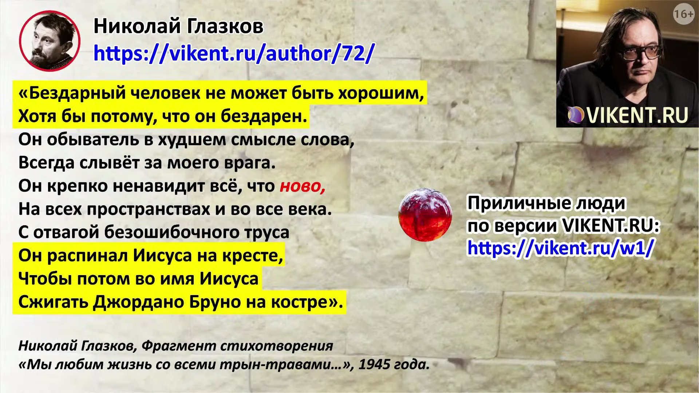

Очень точные, очень точные. И таких людей, таких людей большинство, особенно на третьем этапе. На втором этапе может повести с научным руководителем, с пыличным сообществом крохотным из трёх человек. На третьем этапе, На третьем этапе вы обязательно столкнётесь с психами, жуликами, людьми, которые провалили свою жизнь. И, соответственно, как же как бы не отомстить вам, поскольку человек провалил собственную жизнь? Ещё раз, как не отомстить вам, если вы зависимые, если человек провалил собственную жизнь? Подумайте над этим. Подумайте над. Ну, мы немножко затянул традиционно, извините, соответственно. Ну, давайте как бы благодарности, благодарности. Ну, вот количество и дополнечное количество людей. Соответственно, сейчас вротно минут через 15 Андрей Валерьевич Толмачёв сделает каллаш.

---

## [02:01:45]

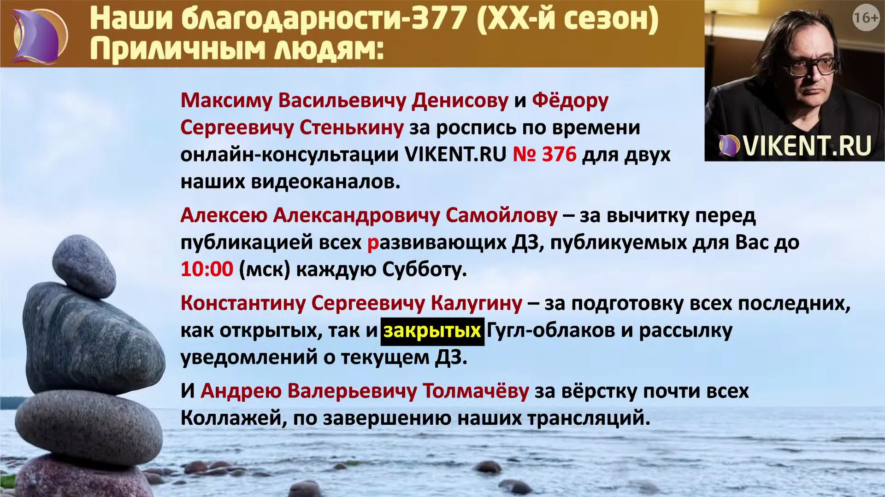

Каллаш, который, соответственно, можно репостить. Можно не репостить, можно не репостить. У меня возникает очень странное ощущение, когда человек смотрит мои лекции годами и не делает репостов. Соответственно, скоро я, наверное, объявлю конкурс Название вещества в голове у этого человека. Вот, соответственно, можно и постить. Напоминаю, желательно сегодня, чтобы завтра утро я встал и поступил бы. Значит, любые вопросы по науке, по научным дисциплинам, точнее, по методологии науки. Любые вопросы по творческим вопросам я перекрываю все. Вот как бы на шестнадцатое число идеально задать до обеда, значит, наступающего понедельника. Кое-что пришло. Ну, ещё есть как бы ещё есть штукшесть-7м штукшесть-7м как бы слотов слотов ещё осталось как бы соответственно в начале декабря все кто выходит на конференцию Александ, господи Ксения Ясанно, извините, Ксения Осана Калугиной по навыкам, метанавыкам, соответственно, у нас будет целый день закрытых консультаций и петиций по навыкам на её конференцию. которая запланирована на воскресенье, на конец декабря. А конференция бесплатная, соответственно, мы её везде анонсируем. Присоединяйтесь. Давайте дальше посмотрим. Давайте дальше посмотрим. А вот как бы, соответственно, вы можете посмотреть все предыдущие видео. Смотреть нужно внимательно. И будет ещё одно важное видео. Важное видео, собственно, по продуктам. Собственно, по продуктам, который имеет смысл в конце второго этапа, в начале третьего этапа будет через 2 недели. Давайте дальше.

---

## [02:03:30]

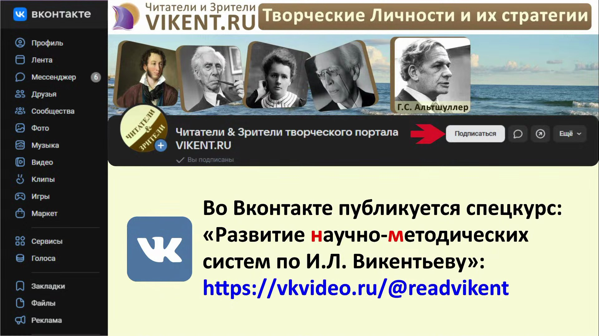

Анатошестнадцатого у нас будет мм консультация. Консультация.

---

## [02:03:45]

Соответственно, кто считает возможным, может пофинансировать как бы как бы в сентябре было финансирование, которое, соответственно, не окупало один приём таблеток, который мне нужен как бы по медицинским показаниям. Мощное финансирование было в сентябре, но потом немножко дело поправилось и так далее. Вот. Ну, соответственно, всё, что можно и всё, что нельзя, очень важное голокое, идёт на раскрутку видео. Всё, что можно и всё, что нельзя. Вот. Идёмте дальше. Идёмте дальше. Ну, соответственно, кто хочет к нам присоединиться, ну, для начала неважно, как вы общаетесь в семье, на работе, вообще не интересует. У нас вы будете общаться по определённому стандарту.

---

## [02:04:30]

Если непонятно почему, спрашивайте. Несколько сотен раз я отвечал на этот вопрос. Почему так? Ну, потому что вас это развивает. Соответственно, прощаюсь с вами до шестнадцатого. До шестнадцатого вторая, желательно прямо сейчас сделать два действия. Задать ваши вопросы на портале. Кому непонятно, пишите вконтакте, дам, соответственно, ссылку или смотрите начало этого видео. Желательно мне завтра с утра иметь уже ваши вопросы. Повторяю, где-то семь слотов ещё есть. И, соответственно, сейчас будет коллаж из который и видео некоторых слайдов делает Андрей Валерьевич Толмачёв. Поздравляем его, как бы относительно он выздол. Большое спасибо ему за это. Соответственно, ну, рекомендуется к репостам. Рекомендуется с репостом, если вообще вы понимаете, чем мы занимаемся. Соответственно, прощаюсь с вами до шестнадцатого числа. Отдельная благодарность за вёстку и за поддержку, а также за высшую бесплатную электронную книгу, издательство Левый зон. Соответственно, Александру Олеговичу Романову, который там под 20.000 слайдов сверстал. Ну, более точно чток 19, соответственно, да, и, соответственно, Анатолию Александровичу Жачкову. Колоссально им спасибо. Ну и также пора нам достать к Новому году. Будет Монти. Монти, английский бульдог. Замечательные пары. Всего вам доброго. Всего вам доброго.

---