# Лекция 378

---

## [00:00:00]

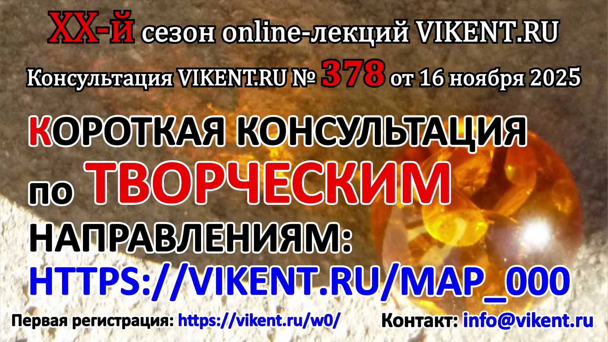

Итак, добрый вечер. Добрый добрый воскресный вечер, уважаемые коллеги. У нас сегодня консультация вопросах, за которые большое спасибо под программы был задан вопрос. Ещё хочется раз подчеркнуть, что у нас бывает несколько форм работы. Сегодня о них поговорим. Есть лекции. лекции предполагают большое количество нового материала. Естественно, учитывая, что курс читается уже там больше 10 лет, неизбежные повторения в лекциях. Вот. Но есть консультации. Консультации, ну, в 100% случаях это ответы наные вопросы. Вот какие м вопросы, на такие я отвечаю. Соответственно, зачайшими исключениями я отвечаю на все присланные вопросы. То есть такого, чтобы я не ответил, но это, повторяю, надо как-то очень постараться. Далее давайте посмотрим эпиграф и параллельно оговорку я сделаю некую. Значит, если будут по обычаю времени какие-то сбои в трансляции, я продолжаю и за, соответственно, завтра мы сделаем резервную копию. Мы эту резервную копию выложим и на Ютюбе, и, соответственно, и, соответственно, ВКонтакте.

---

## [00:01:15]

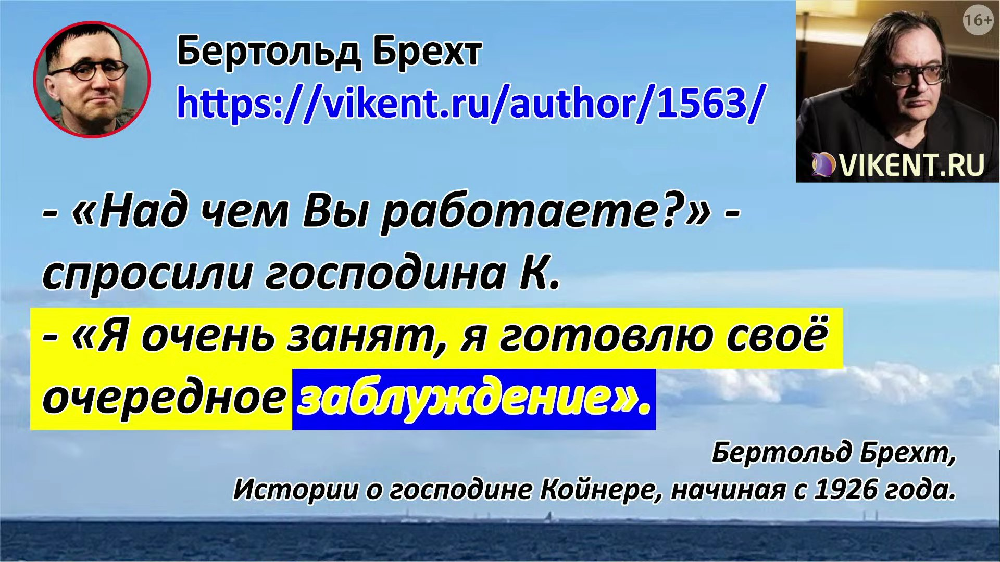

Соответственно, ВКонтакте. Соответственно, учитывая, что сегодня консультация, ряд заданных вопросов, они связаны так или иначе с с чьими-то, с чьми-то вы увидите заблуждение. Соответственно, я малоизвестную такую работу драматурга Бертольда Брихта, который он писал с двадцать шестого года по конец своей жизни, как бы вот я цитил вот это, по-моему, шестое шестая такая вот фрагмент шестой шестой истории о господине, как бы, да, вы видите, соответственно, давайте Сейчас посмотрим. А нет, ещё ещё один слайд. Давайте посмотрим, где мы транслируем. Давайте следующий слайд. Соответственно, кто хочет посмотреть предыдущие лекции, кроме того, у нас идёт спецкурс. Спецкурс по научно-методическим системам. Он будет иметь продолжение. Кто хочет посмотреть, соответственно, есть два способа.

---

## [00:02:30]

ВКонтакте последние 2 года и, соответственно, более 1700 видео на Ютубе. Натубе. Вот, соответственно, кроме того, очень важная оговорка. Все важные ссылки на тексты и на видео, которые сегодня есть, они будут в моём посте. Вот закончим. Это будет где-то там 22230. Я, соответственно, сделаю пост и там, и там на двух видеоканалах, и там будут ссылки. Ссылки на личности, ну, нужно набирать руками, потому что, ну, это такой второстепенный дополнительный материал. Если вы считаете, что необходимо давать и ссылки на все-все личности, ну, соответственно, напишите, мы будем давать. Сейчас мы посмотрим наши правила и потом ещё несколько объявлений.

---

## [00:03:30]

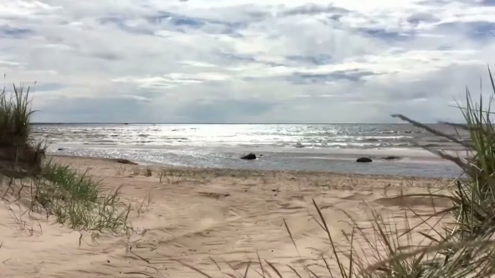

>> [музыка] >> Данный курс читается в рамках проекта Викент, который является крупнейшим порталом Европы по изучению творческих личностей и творческих коллективов.

---

## [00:03:45]

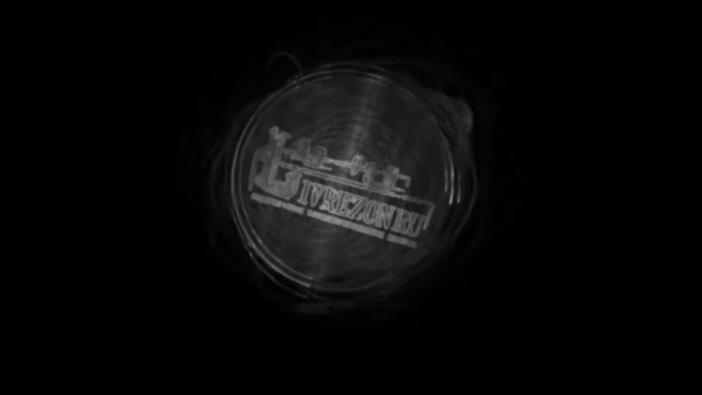

---

## [00:04:00]

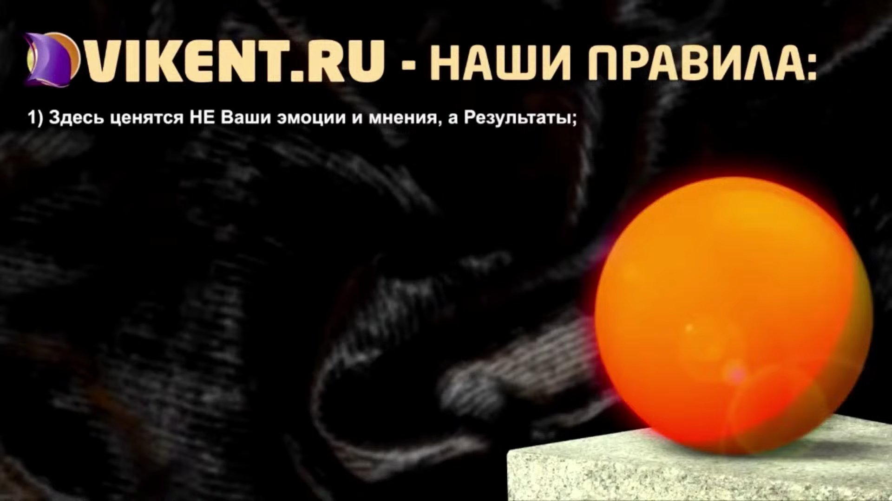

Материалы для этого проекта собирались мной с 1979 года. Надо предупредить, что наши материалы не сколь сложные, сколько непривычные для обычного мышления, поэтому нужно смотреть их очень внимательно и слушать, а также рекомендуется записывать.

---

## [00:04:15]

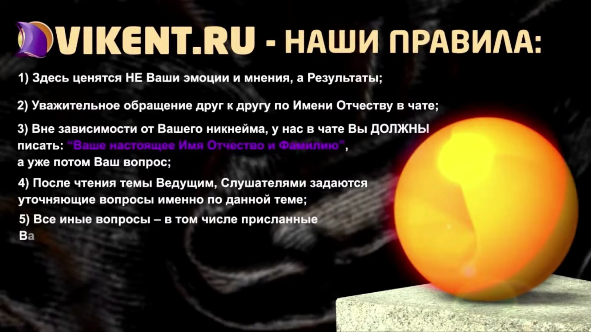

Как вы будете вести конспект в компьютере или в блокноте, это ваше дело. Лично я рекомендую вести в блокноте, посконо удобно не только записывать, но и зарисовывать те идеи, которые оглашаются в рамках нашего курса. Соответственно, у нас принято в Русской академической научной традиции обращение со всеми исключительно по имени Отчества.

---

## [00:04:30]

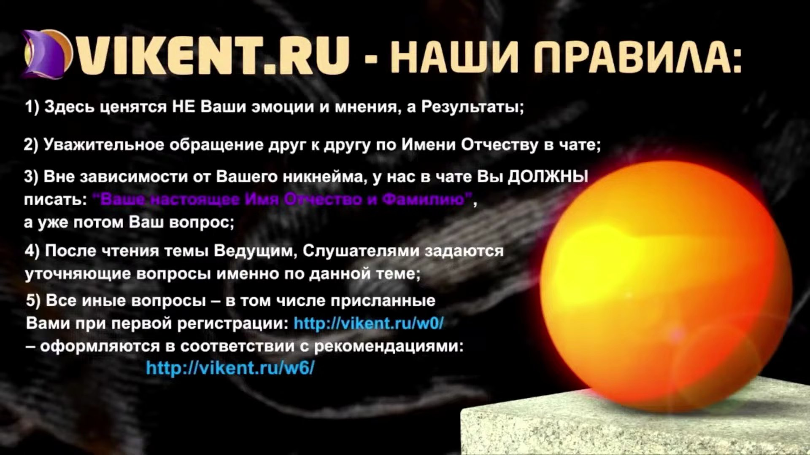

Поэтому, если вы зарегистрированы в Ютубе как Красная Шапочка, пожалуйста, это ваше право. Но у нас в чате вы будете писать себя как Красная Шапочка, а в скобках полностью имя, отчество, фамилия. Ну, в противном случае вы просто будете удалены модератором.

---

## [00:04:45]

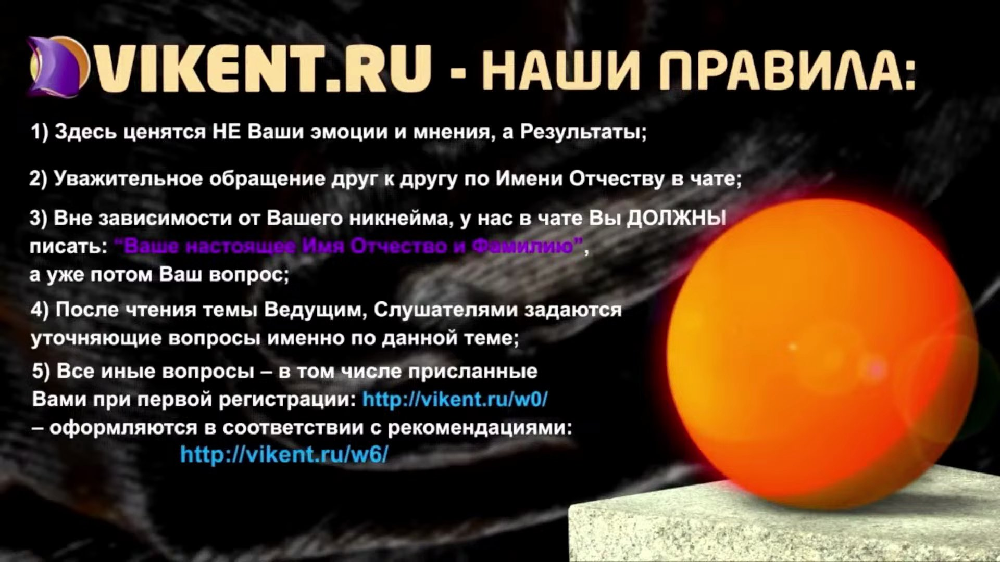

Причём удалены навсегда. Соответственно, у нас есть вопросы, несколько видов.

---

## [00:05:00]

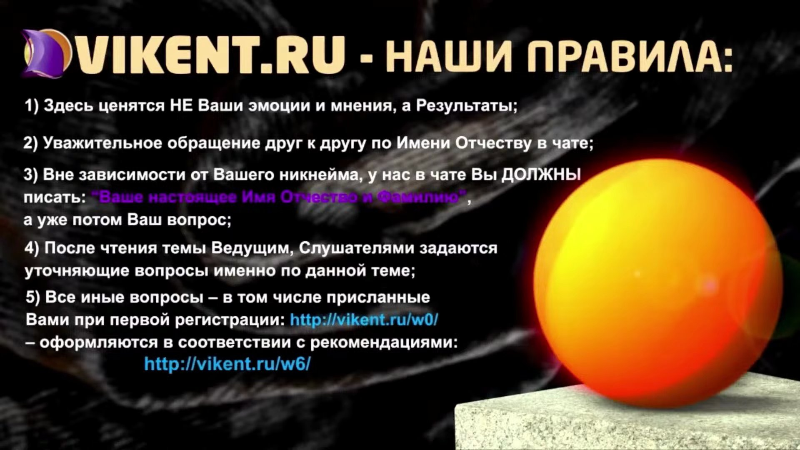

Первый вопрос - это в конце какого-то логического куска, когда закончилась тема, и они задаются в чате. Если ваш вопрос существенно отличается от объявленной тематики лекции, то вы снизу экрана видите, как его задать по специальному формуляру.

---

## [00:05:15]

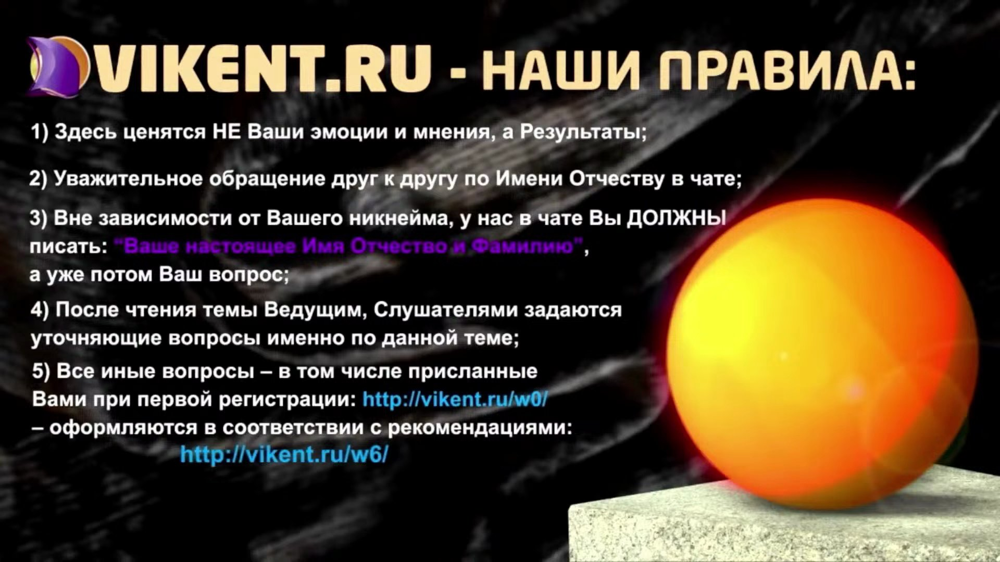

Соответственно, вот программа, она была опубликована, ну, в самых в самыхсамый вещах среды. То есть и полностью буквально, но в среду всё-таки мы успели её опубликовать, так далее. Вот.

---

## [00:05:30]

И, соответственно, находка последних двух лет - это уточняющие вопросы, потому что вопросы вот в этот раз были, то есть они вообще хорошие. Вот этот раз, на мой взгляд, не знаю, как бы, ну, поче не знаю, почему, кстати, не моя заслуга. Это очень интересные. Никаких ограничений на дополнительный уточняющий вопрос у нас нет, особенно на онлайн-консультации. Поэтому призываю всех их задавать мне. Вы очень сильно помогаете. Соответственно, вот не бывает плохих вопросов. Плохих вопросов. Ну, естественно, если они там по теме полностью указаны фамилия, имя, отчество и так далее, и так далее. Вот мне это позволяет понять, куда разворачивать курс, потому что курс, в принципе, он может быть не самый сложный, но он разрастается. И вот какие правильно делать акценты, мне это сильно помогает. Значит, второе объявление, я буду говорить, это год. Соответственно, мы в октябре двадцать шестого года будем отмечать столетие крупнейшего гения в мире, всего лишь деятовича Альшулера. Соответственно, мы уже собираем вопросы, и у нас есть обещание семьи помочь нам ответить на вопросы, связанные с генхом сообущем Альшулию. Поэтому вот их можно посылать, ну, к октябрю следующего года. Один из вопросов, он просто был важный, как бы вы увидите сегодня. Это, возможно, мы его и в октябре тоже ответим, будем копить год данные, что-то выяснять и так далее. Вот. Второй момент, соответственно, 6 декабря никаких занятий не будет. Соответственно, весь день, то есть с утра до до ночи, буквально лету до ночи, значит, Ксения Александровна Калугина и я, мы занимаемся докладчиками её конференции, которая запланирована на конец января. Соответственно, вот весь день мы как бы занимаемся докладчиками. Домашнее задание 6 декабря будет, это святое, а, соответственно, соответственно вот лекции или консультации не будет. Не будет, потому что, повторяю, вот с утра до ночи. С утра до ночи. Далее, последняя консультация. Консультация по нашим правилам. То есть, ну, может принять участие любой человек, главное ограничение вопроса на русском языке и, соответственно, фамилия, имя, отчество указать. При этом, если вы почему-то стесняетесь, а это возникает часто, когда вы сделали какую-то ошибку и как-то писать о своих ошибках публично, соответственно, ну, не очень здорово. Не очень здорово. Возможен режим аноним. То есть я-то знаю, кто как бы пишет. Ну, соответственно, ну, я не говорю, я говорю, что это аноним. Это будет 21 декабря. 21 декабря. То есть, соответственно, у нас там три таких вечных домашних задания. Первое, это просто вопросы по Генна Христосу Альшу. Трис, приложением Трис на октябрь следующего года, двадцать шестого года. Далее 6 декабря ничего у нас не будет. То есть только докладчики, только докладчики и так далее. Вот. И идёт, значит, приём вопросов на 21 декабря. Повторяю, я отвечаю на 100% вопросов. Ещё ещё раз отдельное спасибо. Не стесняйтесь. Мы пытаемся в среду публиковать очередную программу, неважно, это лекция или консультация, и, соответственно, ну, задавать уточняющие вопросы. Соответственно, у нас мы будем продолжим наш курс по научно-методическим системам. Я надеюсь, СДУ, ну, в крайнем случае, в четверг будет опубликована программа. Она, в принципе, ну, в черне она уже написана, в черне уже написана. Опять-таки уточняющие вопросы позволяют мне понять, как мне, ну, какие акценты делать. Акценты могут быть многомерные, не вскрою этого. Давайте посмотрим несколько следующих традиционных слайдов и так далее. Вот. Значит, большое спасибо. У меня есть своя картина мира. Люблю фотографировать залив, люблю фотографировать дюны. Вы позволяете мне расширить мою картину мира. Посылаете разные интересные фотографии, вы их сегодня увидите. Ну и так далее, и так далее, и так далее. Вот они, как правило, мы пытаемся отбирать такие, ну, солнечные фотографии, оптимистичные, хотя наступает зима, хочется спать и так далее.

---

## [00:10:15]

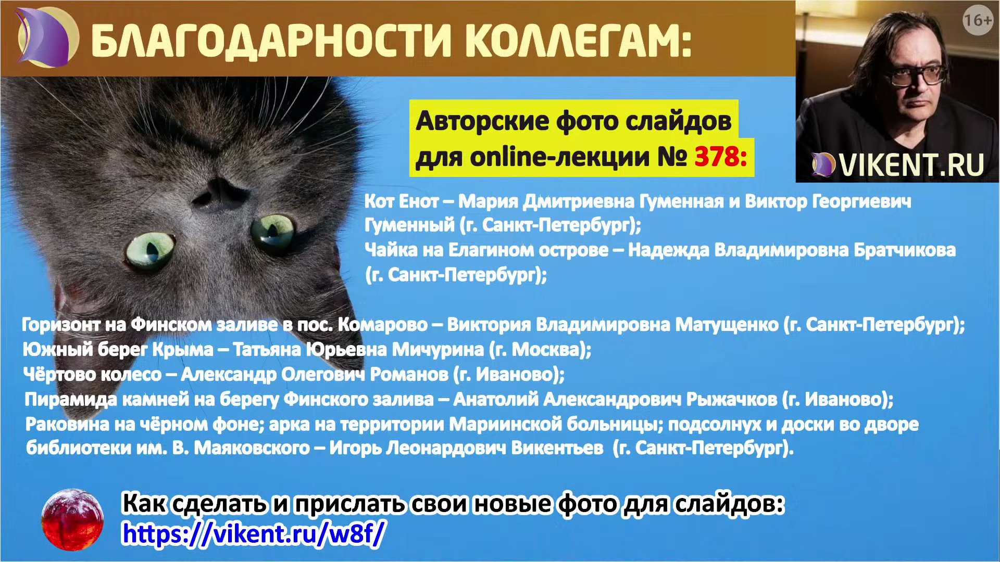

Большое спасибо всем, кто посылает. Соответственно, идёмте дальше. Идёмте дальше. Соответственно, недавно вышла книжка, она вышла под этот курс, и, соответственно, в комментариях было сделано несколько как бы ошибок. Там 162 избранные светские темы. Это не самые лучшие темы, скажем так, которые были так воспринятые.

---

## [00:10:45]

Нет, это просто вот вот именно избранные следские темы, чтобы можно было бесплатно скачать и посмотреть. Это не лучшие темы, потому что в зависимости от он контекста разные темы могут быть, ну, соответственно, лучшими либо не лучшими. И там от темы от дошкольников через бизнес и методологию науки. Методологию науки. Вот. Соответственно, всего тем более, значит, 1.700, более 1.700 на курсе, но искать их по видео ну, мягко говоря, тяжело. Мягко говоря, тяжело. Колоссальное спасибо от человека, который мне помогает с этими темми. Максим Васильевич Денис. Колоссально ему спасибо. Ну и сегодня ещё будет ему благодарность. Ну, идёмте дальше. Пока давайте дальше. Следующие слайды. Да, это бесплатно.

---

## [00:11:45]

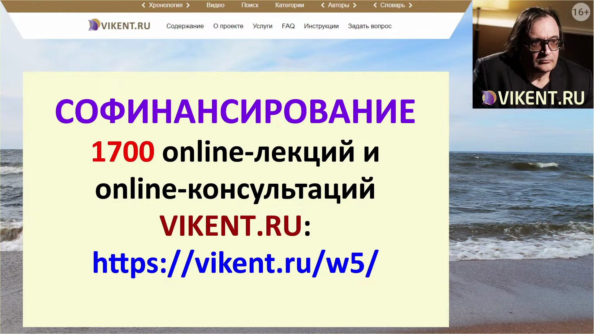

Соответственно, кто кто может пофинансировать, соответственно, наши видео, как бы иногда моё лечение и прочее, прочее, прочее, милости просим. Как бы есть два счёта. Есть два счёта. То есть ваши деньги пойдут на, в общем, замечательные наши проекты, в общем-то, уникальные проекты и так далее. Вот такая же. Идёмте дальше. Идёмте дальше. Идёмте дальше. Соответственно, у нас есть правила.

---

## [00:12:15]

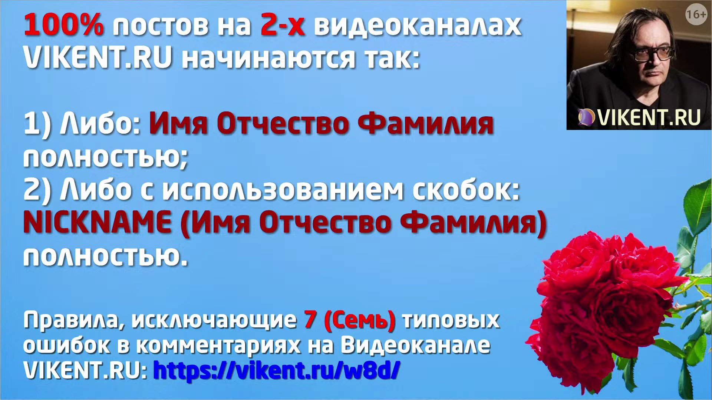

Один из секретов, одно из ноу-хау нашего курса, что у нас есть некая очень такая вот церемонная, подчёркнута вежливая манера общения. И это нам позволило существовать 2012 года. За это время тысячи каких-то попыток как бы типа типа заняться творчеством, оно на наших глазах развалилось, а у нас не развалилось. У нас не развалилось. Один из секретов. Один из секретов. Если кто-то ещё не понял, почему, спрашивайте, почему мы настолько как бы церемонны и так далее, так далее, так далее, и так далее. Вот как бы, да. И, собственно, переходим к вопросам. Повторяю, я отвечаю на те вопросы, которые пришли. Итак, вопрос, который вызвал интерес. Судя по уточняющим вопросам, проверяйте меня ВКонтакте.

---

## [00:13:00]

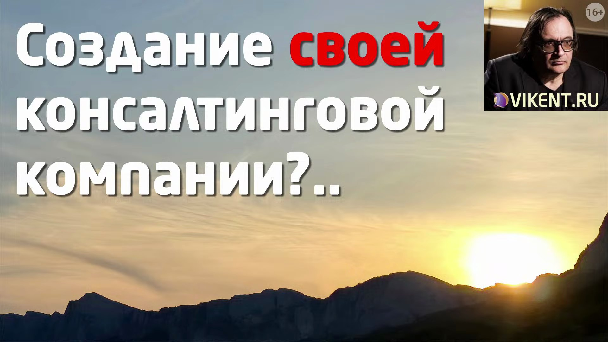

Это вот всё написано на всё написано на слайде, соответственно. Давайте посмотрим, собственно. Я его читать не буду. Давайте посмотрим. Посмотрим. Да, можно слайд уже. Да. Вот, соответственно, некоторые вопросы. Вот на этом мы посидим какое-то количество минут, то есть ничего дальше пока листать не нужно и так далее. Вот я постараюсь, пока вы читаете, начать издалека.

---

## [00:13:30]

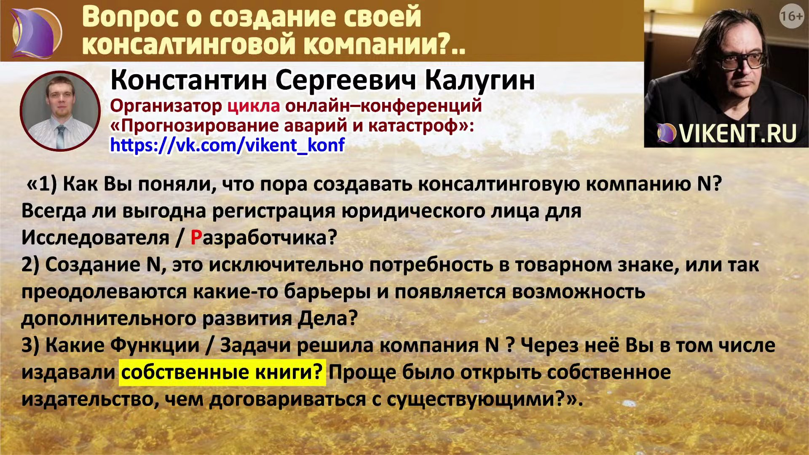

Есть некая блаш. Она же дурь, она же миф, она же ошибка. в российском бизнесе. То есть, соответственно, когда нанимаются владельцем бизнеса, учредителем бизнеса кто-то, обычно это генеральный директор или директор, исполнительный директор, иногда креативный директор, в некоторых ресторанах шеф-повар, то есть есть такие проходные туристические рестораны, там как бы шеф повар баба Клава, и она работает, кстати, небольшую зарплату. Ну, правда, по идее. Правда, приде. Если же это шеф-пова работает в конкурентной зоне, что-то ещё, что-то ещё, что-то ещё, то очень возможно, что помимо зарплаты не слабые, шеф-по ещё имеет процент с прибылью. И, соответственно, когда как бы вот нанимаются, повторяю, там шеф-повар, исполнительный директор, директор, то есть такие важные люди, то они имеют процент прибыли. Соответственно, для того, чтобы они там, ну, работали, у них есть какое-то количество денег, которые им выделяет компания. У них есть подчинённые, у них есть оборудование. То есть, если шеф-повар придумал какое-то конкурентоспособное блюдо, соответственно, наверное, какие-то продукты нужно перепробовать разные от разных поставщиков. Возможно, ему потребуется какой-то аппарат очень быстрой заморозки, там, быстрой отморозки. Вот. Не помню, как о называется, но я знаю, что это дорогие штуки. И компания, соот, естественно, затрачивает очень неслабые миллионы, как минимум рублей, миллионы как минимум рублей, с тем, чтобы, соответственно, высокопоставленный человек, высокопоставленный сотрудник, но вдоле, соответственно, реализовывал свои функции. Так вот, какая какой есть бренд, бред, точнее бред у отечественного бизнеса, она и они иногда хотят нанять консультанта, у которого никаких полномочий нет, который, соответственно, получает на порядке, как правило, меньше денег, чем исполнительный директор, генеральный директоры, да, но генеральные директоры, исполнительные директоры получают из прибыли. в слух в случае успеха там это может быть десятки, сотни миллионов рублей, соответственно, получает очень мелкие деньги. Но по привычке по привычке русскоязычный бизнес считает, что консультант должен, соответственно, не имея никаких прав, то есть консультант посторонний человек, пришедший в компанию, никаких прав нет, в отличие от прав генерального директора, шефпова и так далее. Вот он должен сделать великую работу. Вот это то, что я сейчас сказал, можно в более коротком варианте, можно в стижках, можно в рисунках, можно в схемах, можно стенографически. Нужно знать наизусть понимание, да, понимание, да, и оно даёт большой ключ. Соответственно, следующий момент. Я провёл лично, я лично, значит, мне помогали мои ученики, провёл лично ровно 30 конференций, начиная отвостока, окончая Питере, Москвой, там, Киевом, Минском и так далее. Вот коучий, бизнес-тренеров, константов ровно 30 конференций очных, где просмотрел, соответственно, 30 более, извините, более 3. 000 коучей, запятая бизнес-тренеров и консультантов. львиная доля. Ну, когда это было в России, а не в Киеве, это были из Москвы, из Питера, львиная часть. Были и другие города, но тем не менее. Так вот, очень интересное наблюдение. Соответственно, когда мы проводили, соответственно, я считал, что нужно сделать конференцию доступной, и цены на нашей конференции были там типа там 1. 000, 1.00 руб. То есть иногда было 500 руб., иногда вообще бесплатно. То есть, то есть, потому что консалтингом пытаются заниматься различные славные доценты. Сечасмых, сейчас им стали чуть-чуть платить, а раньше совсем плохо. Совсем плохо. Ну не будем и перед славными доцентами ставить какой-то барьер, не будем на них зарабатывать, будем проводить конференции. Так вот, 3. 000 3.000 различных людей, винная доля платежей, на наш счёт, это люди платили личные деньги. То есть обратите внимание, то есть в безумном количестве консалтинговых, тренинговых, коучинговых компаний безналичных денег не было. Без наличных денег не было. Вот это следующее размышление. То есть статистика серьёзная, 30 конференций. Вот это не кот начхал, как бы не пёсик начхал и так далее, и так далее, и так далее. Более того, соответственно, повторяю, платежи крохотные, то есть, грубо говоря, пообедать, ну, пообедать в питерском ресторане более-менее приличном на такую сумму нельзя. Ну, даже без вина выйдет дороже. Второе, искусственно я занижал цену. ученики, что считали, что я ошибаюсь, вот что как бы вот слишком дёшево, ну что было, то было и так далее. Кроме того, у нас на наших конференциях побывали представители так называемой большой четвёрки консалтингового бизнеса в мире. Ну, кто не знает, что такая большая четвёрка, большая пятёрка, ну, наведите справки. И, соответственно, они пытались нам перегнать там 1.000 руб. из какой-нибудь там Бельгии, из США и что-то ещё, что-то ещё. И пытались меня шантажировать имейлами о том, что вот мы будем платить только из Бельгии. И, соответственно, я проконсультировал, как бы наш бухгалтер, соответственно, поконсультировала крупнейшие консалтинговые компании мира в стиле такого, что вы даёте поучению какому-то банку, который работает на территории России, и он просто по вашему поручению, соответственно, по вашему письму просто перечисляет 1. 000 руб., но не в евро. У нас нет м валютного счёта, просто в обыкновенных рублях. То есть, соответственно, серость большой четвёрки консалтинговых компаний, их наш бухгалтер консультировать. Есть ещё масса способов перечислить деньги из-за рубежа и так далее. Вот. Но это просто так далее, да. Соответственно, отвечая на первый вопрос, как бы, соответственно, если кто-то кто-то некторот строит, ну, для примера возьмём моего клиента Газпром, как бы Газпром и различные структуры. Соответственно, строят, они много строят, и где-то происходит, особенно в сильской местности, то, соответственно, им доставляет песок на автомашинах какой-нибудь частный предприниматель, там, индивидуальный предприниматель, у него есть там два грузовика и карьер. Соответственно, очень возможно, что Газпром, изучив все документы, затребовав копию, копию там всех документов, изучив карьер, согласится ему платить. Соответственно, Газпром, ну и другие такие вот какие-то выдающиеся компании просто-напросто не понимают, когда консультант, индивидуальный предприниматель, либо что-то в этом роде. Соответственно, для знакомых можно вообще не учреждать компании. Знакомые просто расплатятся наличными деньгами либо другими благами и так далее. Если вы работаете только по знакомым и только в вашем городе, то, соответственно, как бы можно и ИП. Если вы начинаете выходить за пределы вашего города, то, соответственно, просто просто, ну, есть такая традиция, то, соответственно, вот какая-то более серьёзная форма, какая-то более серьёзная форма, и крупные компании будут постоянно вам как бы мотать нервы, все документы, подтверждения, там, отзывы и так далее, и так далее, и так далее, и так далее. Вот. Иначе просто не будут работать. Далее различные вузы как бы не мигая, не мигая глядя в глаза врут, что, соответственно, нужно окончить у них какой-то дорогущий курс и после чего стать консультантом. Это ложь. По гражданскому кодексу России вы можете консультировать, то есть любой гражданин России, не только России, кстати, может на территории России консультировать, вообще не имея вообще никаких корочек. То есть консультирование - это советы. Естественно, из этого исключаются какие-то военные вещи, из этого исключаются какие-то аварии, аварийноопасные вещи, из этого исключаются там медицинские вещи. Вы не имеете права проводить операции, даже имея медицинский диплом, но не медицинский диплом хирурга, например. То есть это нельзя. Это нельзя. Это совершенно правильно, как бы, да. Вот, соответственно, скажем, вот это как бы очень важно, то есть никаких коечек не нужно. То есть, соответственно, критическим вариантом, что нужно для консалтинговой компании, соответственно, это некая база данных, база решений, потому что, ну, просто-напросто, если вы просто как бы умный человек, на этом масса людей на моих глазах, ну, более 3. 000 попадалось. Вот просто умный человек - это не консалтинг. Вот просто умный, хотя иногда может помочь. Вот консалтинг начинается и в больших, и в маленьких компаниях с какой-то, как вы будете называть, картотека, база знаний, база решений, база креативных решений. Ну, соответственно, в некоторые отрасли. В некоторые отрасли, если вы проводите именно конференции, то, соответственно, как же можно учредить НКО какое-то НКО и проводить конференции. Поэтому мой ученик, чемпион мира по фандрайзингу из Донецка, из Донецка, вот он ездил на каком-то, я такого как бы джипа не видел. То есть джип размером с автобус какой-то гигантский, поэтому у него НКО. То есть НКО - это не означает, что они нищие. Нет, это совсем не означает. Ну и да, для конференции, соответственно, скажем, конференция это как бы можно сделать, как бы и так далее, и так далее, так далее. будет, соответственно, вот одиндва, я считаю, что я ответил. Если я не ответил, то просто-напросто это, ну, как бы это не вопрос выбора. Хочу, не хочу, просто иначе люди иначе рынок не понимает. Короче, вот повторяю, хотя, повторяю, для конференции можно может хватить хватить и НКУ, НКУ и так далее, и так далее, и так далее, как бы, да. Соответственно, пункт третий. Пункт третий вещь, которую я уже рассказывал. То есть, мм, которая проблема сегодня будет ещё несколько раз говорить, чрезвычайно печальная. То есть я многократно, то есть это не неоднократно связывался с различными издательствами и писал справку для редактора примерно следующее содержание. Уважаемый редактор, уважаемый редактор, моей книге несколько сотен цитат. Пожалуйста, если как бы я при сканированию либо там мои помощники по сканированию там не там поставили точку запятую, пожалуйста, ставьте, даже можете со мной не согласовывать. Ну, пожалуйста, не надо лезть в тексты Чехова, Льва Толстого, там, Меюшковского и так далее, и так далее. Вот как бы это цитаты. таких несколько сотен. Так вот, соответственно, не взявляя такой было такая преамбула, значит, преамбула, значит, сверху красным шрифтом, когда я сдаю рукопись в издательство файли дурак редактор, то есть, то есть я не видел людей, которые сдавали мои бумажные книги, я не видел не дурака редактора. начинает править Чехова, Меришковского, Толстого, хотя письменно предупреждён. В некоторых договорах более поздних я делал предупреждение, что я имею право снять редактора, вообще не объясняя причин вообще. Поэтому, соответственно, то же самое я рассказываю по конференции, то есть договорся с кем-то провести секцию на чужой конференции, что просто, ну, менее затратно было бы, да, люди валят. Вот. что-то ещё валит. Поэтому, к сожалению, был очень часто вынужден с помощью помощников делать вёску, делать конференцию своими силами, поскольку долгие годы, десятилетия не мог найти партнёров. То есть это очень затратно, это не наши профильные занятия делать вёстку, вычитку и так далее, и так далее. Вот. Ну просто-напросто клоуны. Клоуны. Значит, если есть редакторы, которые не клоуны, не клоуны, они могут мне написать начало вашего письма: "Я я редактор, я не клоун". Любые другие письма стираются сразу же просто-напросто. То есть такое это моё требование. То есть это не просьба, это требование как бы, да? Вот, соответственно, как бы далее, соответственно, на мой взгляд, неоднократно, неоднократно консалтинг он, в принципе, развивает, потому что консалтинг - это одна из таких профессий, где сам консультант либо консультанты учатся. Соответственно, повторяю, в моём понимании грамотный консалтинг начинается, когда у вас есть картотека или база данных типовых ошибок, типовых лучших практик. Это вот некоторый минимальный уровень, а не просто вы умный человек. Это этого недостаточно. Этого недостаточно. MBA тоже недостаточно. Так вот, соответственно, я арендовал с помощью коллег помещения в Сентре Питера, и мы сделали восьмичасовое видео, соответственно, где я думал, что коллеги, в том числе питерские и московские, они начнут консультировать. Причём, скажу сразу же, это абсолютно законно. Можно консалтинг разбить на две части по договору, по письменному договору. Первая часть договора. Просто-напросто человек, имея какую-то картотеку, просто задаёт вопросы, и ему это дело оплачивают. Ему это дело оплачивают. Далее, соответственно, человек как бы советуется со мной, ну, заказчик об этом не обязательно знать, и, соответственно, уже какие-то решения предлагает заказчику. по массе направления, которые занимаются коллеги, я могу проконсультировать по по массе, не по всем. Например, вот Роман Стефанович Флареского, он как бы обучает детей живописи. Я не имею права читать что-либо по живописи. Я сам рисую понятно, рисую понятно, но это не является живописью. Я рисую там схемки какие-то, что-то ещё, там технические задания, прочее, прочее, прочее. К сожалению, к моему сожалению, как бы вот 8 часов я сейчас этот проект закрыл. Соответственно, у меня нет подтверждение от коллег, что они там стали консультировать, хотя на старте предлагалось, естественно, бесплатно масса помощи, там готовые договора, как что делать и так далее, и так далее, и так далее. как бы, да, соответственно, наже на мой взгляд, на мой взгляд, этим всё равно, может быть, не тем коллегам, которые были на восьмичасовой записи, другим коллегам рано или поздно, ну, нечто подобное вылезет, рано или неподобное вылезет. Мой совет, прежде чем вы соберётесь регистрировать компанию, Константин Сергеевич, ну, он как бы слышит мои рекомендации, в отличие от ряда других коллег, соответственно. Ну, пусть он позвонит, и я ещё кое-что бесплатно расскажу. Если у кого-то осталось какие-то вопросы, ну, пожалуйста, у нас будет в декабре, 21 декабря, после чего мы уйдём глобально на каникулы, будет консультация. Спрашивать, спрашивайте, спрашивайте. Соответственно, давайте идёмте дальше. Следующее. Итак, вопросы, которые повторяются, ну, каждые там полгода, иногда каждый квартал повторяется и так далее, и так далее, и так далее.

---

## [00:30:15]

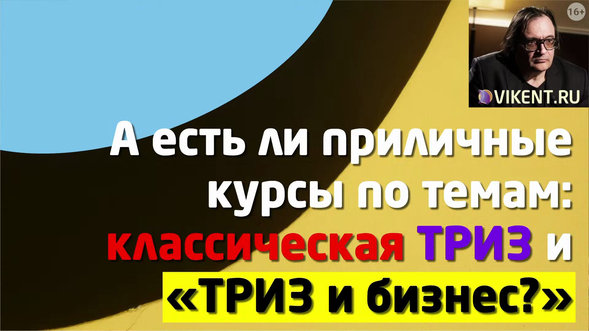

Вот. Да. Значит, я на этот вопрос отвечал десятки раз. Если считать устные консультации сотни раз, ну, вероятно, до людей как-то вот как-то вот легче спросить, чем погуглить. Соответственно, есть крупнейший гений XX века, Генрикса Учальшур, который нашёл новую дисциплину под названием управление творчества. Первая его экспериментальная работа. Он называл это наукой, другие люди называют дисциплиной трис, теории решения изобретательских задач, соответственно, которые можно изучать. И я доказал, что школьники после 4х месяцев обучения под моим руководством решают нерешаемые задачи заводов и ни города. На сегодняшний день эти результаты в мире, ещё раз, в мире не превзойдены. Соответственно, как бы у меня есть мировой приоритет по таким направлениям: трис и дети, трис и политика, трис и бизнес. Я этим выпускал продукты и зарабатывал первый в мире. То есть, пожалуйста, не путайте классический тест Альшуле и ТИС и бизнес, который об этом очень можно, очень хочется поговорить, соответственно, и масса каких-то весьма странных людей, в том числе об этом болтают абсолютно безответственно и нарушая 146 статью Уголовного кодекса России в интернетах. Давайте посмотрим эпиграф и ещё несколько вещей. Ещё несколько вещей. Эпигов шуточный. Давайте шуточный эпигов. Вот Михалков тридцат пятый год, папа, дед Михалков, так далее, и так далее. Вот как бы и прочее, прочее, прочее, прочее. Так вот, соответственно, я делал это очень мягко.

---

## [00:32:15]

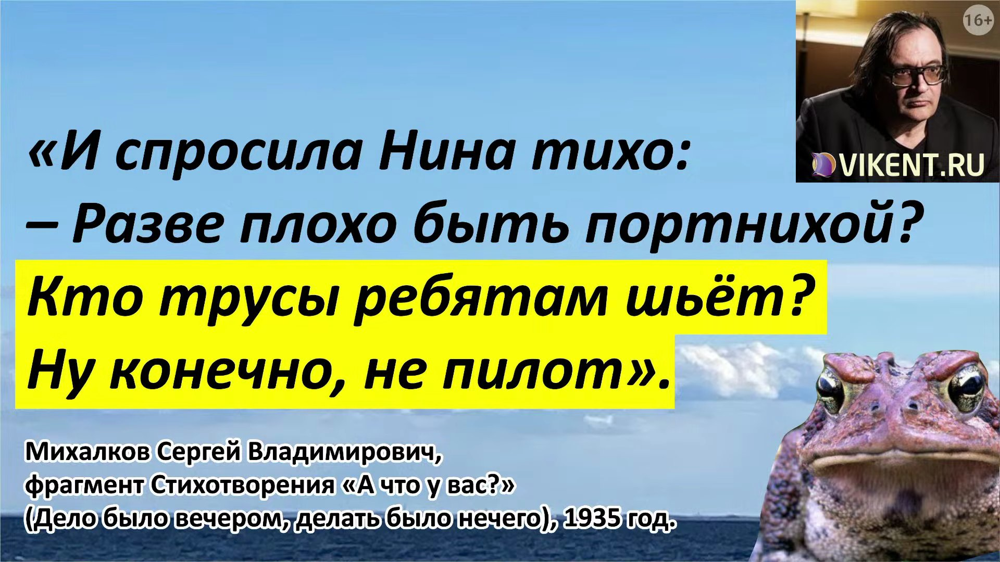

Возможно, Роман Стефанович Флареску напишет в комментариях воспоминания, потому что частично это было частично на его глазах в девяностых годах. Я очень мягко как бы рассказывал людям, что Трис перешёл на профессиональную стадию, соответственно, в девяностых годах того века ещё, то хорошо бы начать этим заниматься профессионально, что стадия любительщины - это семидесятые-восьмидесятые годы того века. Сейчас надо, если заниматься, то заниматься так далее. Вот сейчас я задаю более грубый вопрос, как бы, если меня спрашивают поиск, неважно, очень заочно. Пункт один. К девочкам и мальчикам. То есть я человек в возрасте, поэтому к девочкам и мальчикам. Вы хотите с помощью трис загубить себе жизнь? Да или нет? Это, пожалуйста, чётко напишите письменный ответ. Я его положу в коробочку, через 15 лет вскроем. Так вот, ещё повторяю вопрос. Я абсолютно серьёзен помимо услуг, да, и так далее. Вот хотите ли вы, вот лично вы, значит, загубить свою жизнь? с помощью ТРИС, да или нет? Вот письменно, пожалуйста, письменно напишите письменный ответ и так далее. Без бекани, мекани, просто очень простой вопрос. Вот если кто-то не понимает, ну, ещё раз спросите на шестнадцатый и так далее, и так далее, и так далее, и так далее, как бы, да, и в чём есть дела? То есть, соответственно, как бы три существует, скажем, вот в таком более-менее широком значении в России и в других странах. с восьмидесятых годов XX века. И, соответственно, сейчас напоминаю, соответственно, 2025 год вот уже уже видна как бы начало двадцать шестого, уже выбл снег, ну, и так далее. И, соответственно, как опыты поставлены. Кто мне не верит, можете, пожалуйста, можете в Фейсбуке, можете ВКонтакте изучить сообщество видео. Попытайтесь найти какое-нибудь приличное видео потрис, соответственно, как бы без уголовщины, без уголовщины, где не нарушаются чужие права. Попытайтесь найти просто какое-то видео подснятое, где люди просто прилично одеты. Ну вы просто постарайтесь. Соответственно, вспоминайте мой вопрос. Хотите ли вы с помощью трис загубить себе жизнь? Вот вы хотите себе загубить, то есть опыт уже поставлен. опыт уже поставлен. Соответственно, теперь давайте посмотрим вопросы, я продолжу изложение и так далее. Вот человек, который прислал вопрос, я лично не знаком, соответственно, незнаком, но человек прислал вопрос, прислала, точнее, извините, вопрос. Я это, сонно, отвечаю.

---

## [00:35:00]

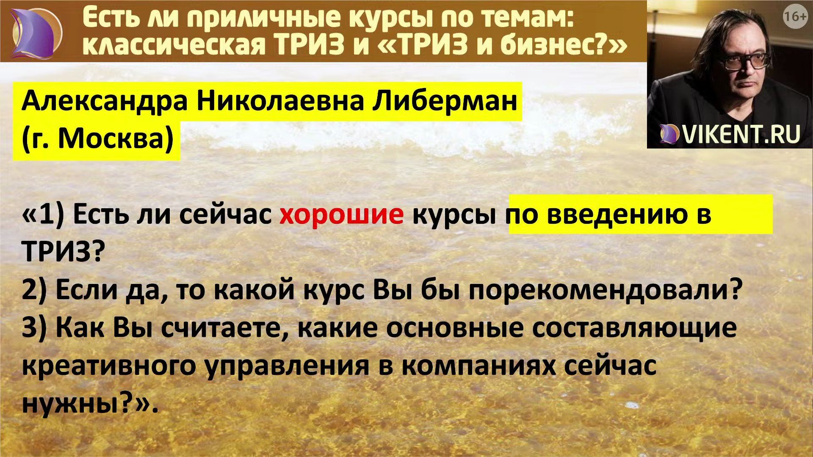

Судя по вопросам, соответственно, человек что-то слышал отс не понимает в нём вообще ничего. Если Александра Николаевна хочет меня обидеться, пожалуйста, пожалуйста, пожалуйста. И, соответственно, как бы могу с птичьего полёта, об этом тоже люди постоянно спрашивают, сейчас Трис как бы перешёл на профессиональную, услышьте меня, не на любительскую, а на профессиональную стадию. И сейчас как бы очень важно, как работают команды. Вот, допустим, в каждом видео я благодарю очень многих учеников. Если вы внимательно подчитаете [смех] всех учеников, включая, кто задавал уточняющие вопросы и так далее, там будет, может быть, 15, может быть, 20, иногда 30 людей работают над одним вот этим вот видео, которые вы сейчас смотрите. Вот. Ну, например, вот это вот дно, честно говоря, не помню кто, но кто-то из это не а может быть и моё даже. Вот он не помню. Вот это просто финский залив снят, песчаное дно, ну и так далее. Вот. Да. Соответственно, если вы хотите заниматься, очень простой вопрос: а зачем? Что вы хотите делать? То есть, если вы хотите прослушать там две-три лекции и потом зарабатывать деньги, пожалуйста, давайте изучим. Изучите, пожалуйста, ВКонтакте и Фейсбуке сообщество тызовцев. Несколько тысяч людей почему-то не смогли это сделать. Почему вы, прослушав несколько часов, считаете, что вы сможете это делать? Соответственно, есть два способа, значит, соответственно, ну, два таких, ну, что ли, может быть, сильных способа занятия три в 2025 году и дальше. Первое, если вы попадаете, а таких команд фактически нет, ну, допустим, вот есть команда как бы наша, есть команды немножко у учеников моих, и всё. И всё, где в мире, ещё раз, в мире, в мире, не в Москве, а в мире, то, соответственно, надо попадать в такую-то команду каждый год. Это очень, может быть, не очень заметно. требования к тем людям, кто в команде, они потихонечку возрастают с тем, чтобы работать можно было комфортно и с тем, чтобы команда была конкурентоспособной. Второе направление, которое сильное и последнее - это когда попав в команду, то есть не в одиночку, в одиночку это бред образца семидесятого года, 1970 года. Вы делаете с с нашей помощью разработки. Понять, стоит вам ввязываться в три или смежанные дисциплины, чрезвычайно просто. Нужно позаниматься полгодика либо год на курсе. курс викенте, потому что его ругают ученики. Вот как бы вот как вот будет созвон, так ученики ругают. Он бесплатный. Бесплатный. Соответственно, правда, некоторые подворовывают и уже платно пересказывают бесплатный курс. Ну, таков уровень русской интеллигенции. Им легче заплатить и слушать, как бы, с ошибками, чем бесплатно послушать у как бы первоисточника, да. Так вот, поработав пол полгода, годик, значит, посмотреть вообще, как бы вам стоит лезть в трис в креативной индустрии на хорошем уровне и так далее. Вот. Потому что есть очень жестокое правило. Несколько тысяч людей испортило себе жизнь. Если вы занимаете стрис, то нужно входить в первую пятёрку, в первую тройку в мире. В мире. Вот. А не на лестничной клетке, ни в квартале, ни в компании. и так далее, и так далее. Вот. То есть постоянно люди спрашивают: "Как, а как бы мне вот трис на троечку такой убогий трис? Значит, жизнь вас достанет. Жизнь вас достанет". Соответственно, как бы у нас очень простая есть форма. Послушав полгодика, годик, соответственно, начинаете делать доклад. Доклад - это моделирование, соответственно, умение излагать, умение разбираться в сложных вещах, некая отдалённая модель консультирования. Соответственно, как же, ну, и так далее, и так далее. Захотите, ну, можете заняться, можете заняться консалтингом. Ну, приведу два очень простых решения. Обоснование, причём такое, знаете, ну, с точностью до такой стопроцентной логики будет продолжение курса по научным-методическим системам, то есть, соответственно, в следующей лекции, план, который уже написан. Итак, соответственно, некие знакомые, точнее врум, давние клиенты, как бы, они занимаются с устройством свадеб. устройством свадеб. И, соответственно, издаётся в Питере некий журнал, который раздаётся. В Москве такое тоже есть, как бы в Москве более шикарный журнал в Заксах, где там платья, соответственно, какие-то музыканты, музыканты на свадьбу, фокусники на свадьбу. Ну, там птички на свадьбу и так далее, и так далее, и так далее. Вот, да. И вот, соответственно, вот, мягко говоря, жили они на журнале. Причём как бы параллельно они сами проводили свадьбы и так далее, и так далее. Вот. Ну вот, надеюсь, не раскрою больших секретов. Ну, все участники свадебного рынка это знают, что, мягко говоря, я не буду называть годы, это было как бы потихонечку, значит, журнал стал сдуваться. То есть кормили стал сдуваться, значит, в питерский. Питерский, московский не знаю, не консультировал. Соответственно, они обратились к Игою Леонардовичу Викентьеву. И Игорь Леонович Викентьев, учитывая, что это прошло много раз, то есть это не является уже секретом, придумал им как бы некую выставку, продажу, где, соответственно, было большое количество скидок. Вот. И, соответственно, выставка была настолько успешна, то есть то есть свадебная выставка, которая периодически проводится, что только в Питере и Ленинградской области у неё её попытались украсть 40 раз. То есть свадебные скидки не через журнал, а через выставку, понимаете, да? Кого интересуют подробности, пожалуйста. Ну, примерно в эти же годы начало нулевых у меня была некая надежда, которая не совсем выполнилась, что хорошо бы сделать нормальный портал по консалтингу, по тренингам, просто и так далее. Вот. И, соответственно, при нулевых вложениях, поэтому мы работали, два человека, соответственно, сделали портал трека. Сейчас он закрыт, ну, потому что мы его не поддержим. Извините, болею. Извините. И, соответственно, при нулевых вложениях, нулевых вложениях мы сделали 60 аналогичных проектов российских сделали. То есть они оказались где-то там на нуле, включая там московские, там РБК и так далее, и так далее. Вот обратите внимание, мы сделали, потому что у нас на треках было 25 скидок для тренеров и консультантов по самым разным направлению. То есть такой магазин супермаркет скидок. Как это делается, будет показано через неделю. На всякий случай подсказываю, подсказываю, как бы это описано, вычислено, ну, и так далее, и так далее. Вот это такой профессиональный, грамотный консалтинг, который, соответственно, как бы почти из нуля делает, но очень не слабые суммы. Очень неслабые суммы, но работу профессионал, извините, Ил Викинтьев, он профессионал. Так вот, давайте посмотрим, какая расстояние от непрофессионалов до профессионала. Давайте сейчас глянем.

---

## [00:43:15]

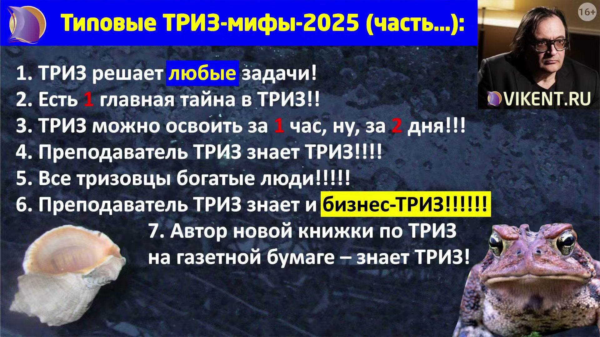

Давайте сейчас глянем. Значит, моя фотография, извините, на неком на некой могиле воинов, как бы в данном случае это важно, как бы, да. Соответственно, есть типовые тризмифы, за которые по идее надо пороть на конюшне. Надо пороть на конюшне, соответственно. Соответственно, я обещал рассказать как бы, ну, кого интересует отдельно, отдельно, ну, я поговорю, конечно, и так далее. Я обещал Сергею Владимировичу Купенину рассказать там пример стандартного залёта тризса стандартного такие. Есть стандартные залёты трабл шуутеров, есть стандартные залёты тризвсов. Я могу часами об этом рассказывать по той причине, что периодически они ко мне прибегают, что надо как-то вытянуть решение, заказчик недоволен, ну и всякое такое. Вот так вот, соответственно, ко мне прибегает очередной тезис, мастерс, на всякий случай мастер тиз. И какой-то небольшой цех выпускают тренажёры для фитнес для фитнесцентров на территории Петербурга. Естественно, я не назову заказчика, естественно. И, соответственно, им нужно как-то регулировать нагрузку. Кто ходил в фитнес-центр, знает, что простейшая регулировка нагрузок с помощью грузиков. То есть тренируем руки, мало грузиков, тренируем спину либо ноги, много грузиков. Но там, соответственно, им потребовалась пружина либо пружины регулируемый жёсткости. От большого ума я неутрирую ни граммо. Не грамму. Мастертс предложил им сильнейший электромагнит и феромагнитную жидкость. Феоромагнитную жидкость. Кто не знает, посмотрите. И, соответственно, регулируем там ток магнита. И регулируется жёсткость пружины. Заказчик - это маленький цех, значит, не принял и устроил очередному мастеру трис очередной скандал. Таких скандалов повторяю часами могу рассказывать. Да. Теперь для гуманитари расскажу, почему был скандал. Это небольшая мастерская. Соответственно, если действительно это дело внедрять, то, соответственно, я то, соответственно, каждой установке мы должны установить сильный магнит. Ну, первое, изготовить сильный магнит - это дорого. Второе, я не уверен, что излучение сильного магнита вообще приветствуется в фитнес-центре. Ну, третье, не факт, что 220 В фитнес-центр справится, нужно тянуть промышленную линию как минимум 380, можно больше. Ну, инженеры электрики могут прикинуть. Третье. Всё, что касается расчёта. Я работал просто ведущем институте Миноэлектротехпрома, поэтому я очень хорошо знаю изменяти отчёты и шли. Соответственно, электромагнитные поля считаются плохо. То есть делаются некоторый примерный расчёт, потом делаются эксперимент и так далее. Вот. То есть, соответственно, на маленький на маленький заводик, маленький цех, который всего лишь должен регулировать жёсткость пружины. И дядя Вася из гаража, который просто, ну, разбирал различные автомобили, он эту пружину сделает. Таких решений много. Ну, мастерс, мастертс, соответственно, не в состоянии это сделать. Соответственно, вот всё, что написано выше, это типовые такие мифы, которые желательно, ну, просто желательно, ну, желательно не верить, если вы хотите не испортить себе жизнь. Если вы хотите испортить себе жизнь, вперёд, вперёд. Моя совесть чиста. Я об этом предупреждал ещё в девяностые, но не все в состоянии слышать. Не все в состоянии слышать. Теперь повторяю, есть трист. Стрис по железком. Это Генсошу Шули гений. Дальше не гений Викентие. Давайте посмотрим следующее. Сибизнес. Давайте посмотрим. Тот же памятник, та же ракушка, тот же жабён, как бы, да. Вот насчёт быстренько изучу бизнес-трис. А где вы собрались бизнес-трис изучать? Я обладаю мировым приоритетом. Масса материалов по бизнес, они закрыты, дозированно даются ученикам.

---

## [00:47:30]

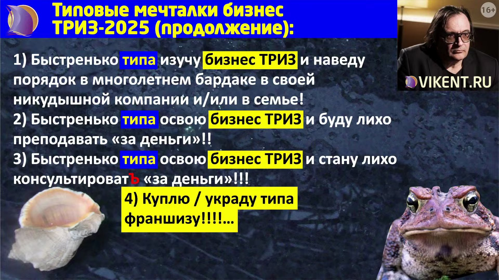

Далее есть поговорка фирменная нашей компании, что, соответственно, как бы инвестиции в бардак этот бардак увеличивают. Если вы думаете, что вы изучите бизнес-тыз в два притопаты прихлопа и наведёте порядок своей компании, это смешно. Вот изучу какой-то бизнес-триз и буду лихо поподавать за деньги. А откуда вы возьмёте хорошие материалы? То, что называется бизнес-трезом, очень часто исходит от чрезвычайно странных людей, которых мы не берём на наши конференции. Ещё раз, которых мы не берём на наши конференции. Но то же самое насчёт лихо консультировать. Насчёт лихо консультировать. Давайте вместе посмеёмся, как бы, да, вот и так далее, и так далее, и так далее. Вот он четвёртое. Куплю, украду, типа франшизу. Соответственно, мы проделали ряд эксперимент в девяностых, в начале девяностых, когда, соответственно, м пытались. Результат плохой, оптимистичный. Значит, соответственно, что я делал и так далее. Это бы делалось десятки раз в разных городах. Ну, можем сделать ещё раз. Итак, соответственно, как бы какой-то человек хочет стать консультантом, соответственно, и говорит: "Давайте, Игорь Анавич, я на вашем семинаре расскажу ваш материал, ваш материал, а вы меня проконтролируете". И, соответственно, там как бы неважно по телефону, очно разные были варианты. Мы репетируем. Человек, как правило, это мужчина. Вот пункт четвёртый я сейчас рассказываю. Рассказывает материал. Причём я проверил. Я проверил рисунки, которые человек рисует на доске. Вот я проверил текст, я проверил примеры, задачки. И, соответственно, кто имеет там хотя бы мимолётный опыт преподавания, мужчина с высшим образованием, с кандидатской степенью всегда валит бизнес-семинар. То есть, когда работает Викентев, люди чувствуют, что там ещё 10 слоёв с гиперссылками. Ткнёшь, получишь ответ с пятого слоя, с третьего слоя, тринадцатого слоя и так далее. Вот. А это просто человек выучил чужой материал, чужой текст и, соответственно, неинтересен. Особенно, особенно на бизнес-семинарах люди бизнесмены, они могут не знать трист, но у них есть некое из большого количества переговоров некогое чутьё. То есть, условно говоря, уровень человека. Вот уровень человека, масса предпринимателей чувствует лучше дипломированных психологов. Кто хочет возражать? Кто хочет возражать? Ну, соответственно, скажем, вперёд, вперёд, пожалуйста. Я поступил честно, я честно рассказал. Вы можете честно не поверить, но мне важнее, что я честно рассказал, как бы. А с вами, ну, Господь с вами, хотя я неверующий. Следующий слайд, который постоянно спрашивают.

---

## [00:50:45]

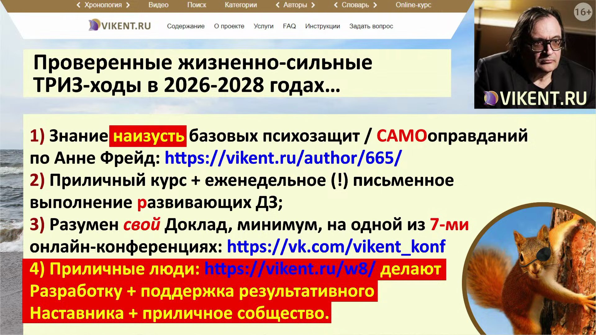

Вот, соответственно, скажем, желательно близко к тексту, там, соответственно, бизнесзащиты, их там с десяток, желательно знать близко к тексту. И, соответственно, как ни странно, для преподавания ты, давайте сначала изучите как бы самооправдание психозащиты Анны Фрейд. Зачем? Чтобы не стать несчастным человеком. Как? Да. Да. Соответственно, надо пройти приличный курс. Вот. Ну вот у нас сочетается некий приличный курс приличными людьми и командная работа там, да? Далее, чтобы понять, вы вообще тянете вот в креативных индустриях, можете консультировать, можно промоделировать, при том, что вам будет помогать. То есть, грубо говоря, вот сейчас идёт вычитка параллельная двух докладов, там несколько десятков человек это дело вычитывают из разных стран, да, на русском языке они вычитывают и так далее. Но это несколько десятков человек будут только вычитывать помимо меня, да. Соответственно, доклад для нас, ну, в том числе и проверка вас, то есть насколько серьёзно при гигантской помощи очень важный акцент, который русская интеллигенция не понимает слова вообще. При бесплатной помощи вы нам ничего не платите. Ну, у нас есть корысть. Нам нужны хорошие доклады. Значит, первая конференция, она будет первой по номеру, и как бы для нашего организатора Ксения Александрона Колукина. Она будет в конце января. Ксения Александровна человек аккуратный, она хочет, чтобы её конференция, ну, была бы качественной, ну, и так далее, и так далее, и так далее, и так далее, и так далее. Вот поэтому, соответственно, вот после после того, как вы пройдёте доклад, а у нас в новом наступающем году намечено сем конференций. В пункте третьем вы видите, где их можно посмотреть, семь конференций. Если вы не найдёте в семи конференциях тематики докладов, то, извините, как бы надо изучать вашу голову. Сем конференций, вы что-то близкое вам должны найти на семи конференциях. Либо Валентяй, либо Валентяй. И давайте не говорить слово трис, там занятия трис и так далее, и так далее, и так далее. Трис. Поэтому ещё, ещё раз, никому из тризовцев не удалось обмануть обмануть реальность. Я этого не знал, но опыт с десятилетиями поставлен. Три смежанной дисциплиной хороший способ, если относиться к этому тяп-ляп, изгадить себе жизнь. Хотите ли вы изгадить себе жизнь? Неважно, вы мальчик, девочка, то есть меня это вообще не интересует. Вот кто хочет, может переспрашивать, уточнять. Так, фамилии я не называю, как правило, никогда и так далее, и так далее. Теперь, что надо посмотреть из приличного? Давайте вот, соответственно, давайте вот, пожалуйста, как к говорит слово трис там, что-то в этом роде. Мой совет посмотреть три видео. То есть, в принципе, ещё сегодня ночью можно их посмотреть. Итак, первое видео. Мы даём ссылку ВКонтакте, хотя о них на Ютбе.

---

## [00:54:00]

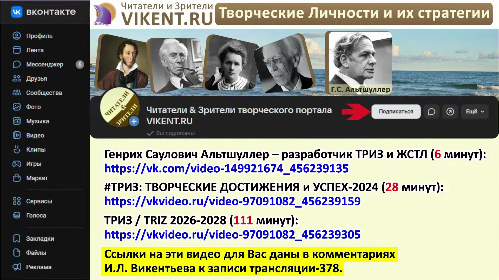

Стараниями Анатолия Октановича Жачкова мы поставили мировой рекорд. Соответственно, там 131.000 просмотров вот этих 6 минут. Видео снято по моему сценарию о Геннахсочаль Шулере. Я периодически пересматриваю очень крепкий сценарий, очень хорошо сделано шестиминутное видео. Ну, тризусом такое делать не в состоянии. Соответственно, три створческие достижения и успех 2024 год. Ну, очень легко обложку поменять и написать двадцать седьмой год. Ничего не поменялось. 28 минут. Это о том, как умные люди делают ошибки, и вы можете их не делать. Хотите, обращаю ваше внимание, Конституция России за ваш счёт разрешает вам делать ошибки. Делать ошибки за мой счёт. Мы это пократили уже давно. То есть было одно время, когда люди делали ошибки за мой счёт. Сейчас это прекращено. Соответственно, Трис 202628 год, там это тоже консультация. Какие вопросы прислали, соответственно, скажем, я как бы и говорю. Ну, уже ВКонтакте там 17.000 просмотров. 17.000 просмотров. Кто хочет как бы поумнеть, ну, умнеет. Это приличные проверенные материалы. Ряд этих материалов, то есть первый, первый и последний, проверены семьёй Геннаха Сауловича Альшуля. Проверено семьёй, как бы, да, и так далее. Ну, кто хочет поумнеть и так далее. Вот. Далее там был ещё вопрос: "А чем заниматься в творчестве?" И так далее. Вот как бы давайте покажу, давайте посмотрим, да? Вот, соответственно, как там чем заниматься там в творчестве и так далее. Вот желательно, желательно, если хотите заниматься какими-то вещ типа 30, что рядом, как правило, проще всего заниматься там, где есть реальная конкуренция.

---

## [00:56:00]

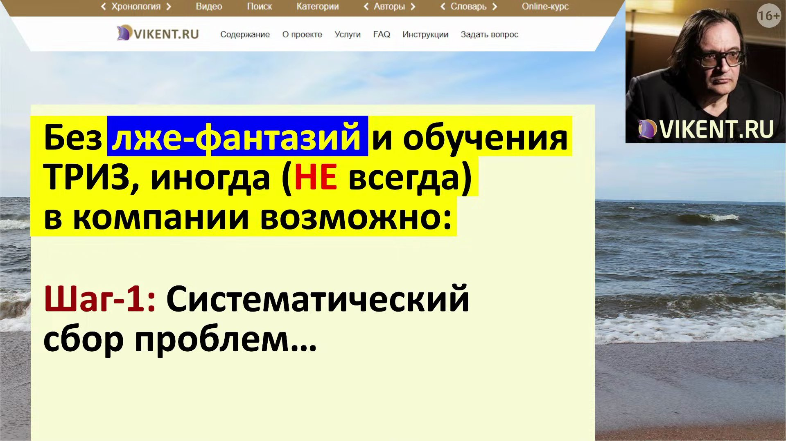

Прошу вас не путать конкуренции, на которую принято плакаться. Масса предпринимателей пока не получили по башке, плачутся на каких-то якобы конкурентов. Они просто ещё не понимают. Они ещё щенки, не понимают, что такое настоящая конкуренция и так далее, и так далее, и так далее. Вот. То есть, когда есть конкуренция, некие решения хорошо внедрять. Обратите внимание, мы преодолели конкуренцию, когда сделали выставку свадебных скидок и имели безумное количество подорожателей. И когда мы грохнули 60 проектов в России, как бы потому что мы считали, что, ну, надо бы сделать приличную конференцию для консультантов, для тренеров, коучей, но они оказались настолько плохи, что не надо делать им ни портал, ни конференцию и так далее. Вот. Соответственно, без обучения ТРИС, без лжефантазий вы можете использовать технологии ранней Тойоты. знакомый был несколько лет назад на Тойоте, натуральной Тойоте в Японии, говорит: "Уже такого нет". Ну, ранняя Тойота, они, допустим, просто-напросто доводили количество проблем, которые были принесены 80 штук, ну, в семидесятых годах на одного работягу. Не, не на инженера, на одного работягу. То есть, грубо говоря, Toyota сделала конвеер покупки проблем, самых разных проблем, которые есть на предприятии. Львиная доля. Львиная доля - это такая полная фигня. Полная фигня. Но просто-напросто, когда есть очень много проблем, очень много проблем, они покупаются руководством, соответственно, как бы е там есть некое золото, некое золото и так далее, и так далее, и так далее. Вот вещь, почему это не идёт в России. Соответственно, начинают глупить сотрудники, которые сразу говорят о том, что нужно увеличить зарплату в три раза, у них ипотека. И второе, не очень честно работают с проблемами руководств. То есть они не дают обратной связи, ну и так далее, и так далее. То есть, соответственно, систематический сбор проблем без всякого атриза, как бы, и без всякого атриза. Ну и честность, и честность. В принципе, на этом уже можно в крупном городе зарабатывать, если вы можете поставить такие фирменные стандарты. В принципе, на эту же тему можно сделать можно сделать и докладват. На всякий случай администрация президента раньше получала примерно 3.000 писем с жалобами в день. 3.000 администрации президента России. Ну а мы что? Мы идём дальше. Мы идём дальше. Если я не отвез, пожалуйста, нука на 21 декабря. И, соответственно, скажем, да, опять-таки, я упоминул честность.

---

## [00:58:45]

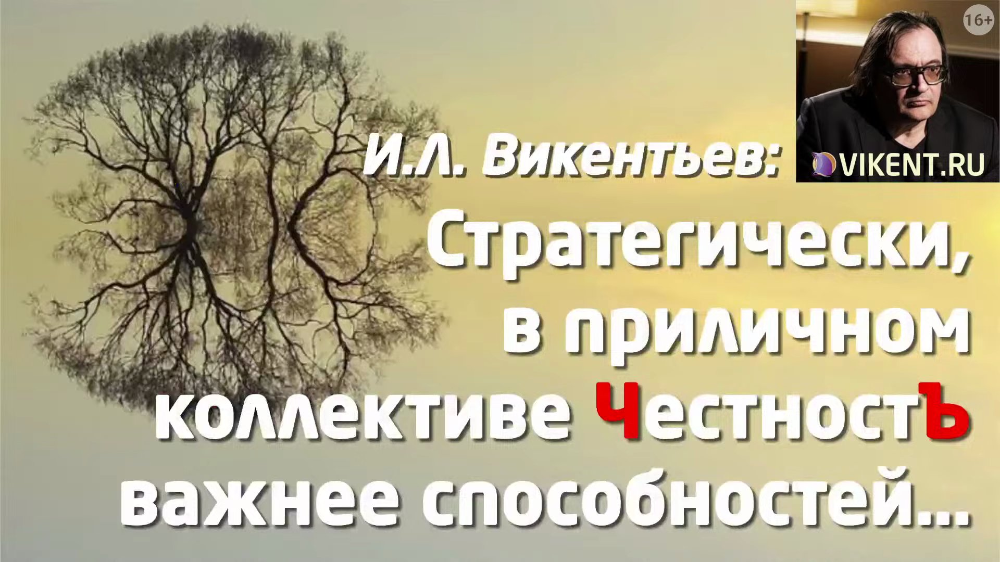

Честность, как бы, это такая страшная вещь. Большинство людей на неё не способно. Ещё раз, большинство людей, включая интеллигенцию, не способно. То есть, допустим, менее процента людей, кто посмотрит это видео, в состоянии сделать его репост. При том, что я денег не беру с людей, значит, как бы даю уникальные материалы бесплатно. Ну вот уровень честности русской интеллигенции 1% однопроцентная российская интеллиген. Кто хочет обижаться до посинения? До посинения от не отскакивает сразу же как бы, да? Вот, соответственно, давайте посмотрим, да, далее, соответственно, скажем, да, вот вот полезные материалы туда же, туда же, туда же и так далее. Вот на всякий случай давайте посмотрим следующий слайд. Следующий слайд.

---

## [00:59:45]

Я в прошлый раз, у меня было даже такой слайд, там было такое название, но проскочил. Проскочил, не говорю. Некоторая заповедь Геннах Случальшуя, который прекрасно понимал интеллектуальный уровень уровень тризусов. В книжках это нет. Это есть в переписках, это есть в обсуждении. Это было очень замечательно смотреть, когда Генноуч смотрит своими глазами голубыми в зал и говорит о том, что преподаватели ТРИС слабы, как бы, ну, ничего страшного, зато сильная раздатка. Так вот, соответственно, Ажули прекрасно понимал, что преподаватели ТРИС слабы, но лишь бы они раздавали сильную раздатку. Частные варианты раздатки, машинописи Альшууллера, соответственно, ну либо книги Альшулера, они сильны. Соответственно, некоторые преподаватели иты слабые почему-то до сих пор считают, что они сильные преподаватели. Ну, судя по тому, что они говорят в эфирах, как бы в эфирах видео, то есть абсолютная потеря астроломия, поэтому итак сильная раздатка. Ну и, соответственно, есть введение в трис, оно есть и для гаджетов, соответственно, оно есть и для таких ноутов и настольных компьютеров. Причём та, которая версия для гаджетов, она читается на компьютерах. Кто-то что-то не понял, ну вот зайдите виkend Facebook, там сделана оговорка. Значит, версия зона. Левызона она бесплатно всё. Всё бесплатно, да? Оно читается и на компьютерах, и на гаджетах. Версию, которую мы сделали, соответственно, скажем, семья проверяла, значит, как бы она, значит, только для ноутов и стационарных компьютеров. Повторяю, это такой сильный материал. Если вы хотите знать, что такой тезис, соответственно, читать нужно чрезвычайно внимательно, внимательно на нормальные вопросы. Мы стараемся отвечать и ненормальные вопросы, ну, и так далее, и так далее, и так далее. Вот. Далее идёмте к некому следующему мифу. Следующему мифу и так далее. Вот. Соответственно, вот не, ну, не удалось нам развернуть чайку. Ну, пусть она так сидит, как бы до конца.

---

## [01:02:00]

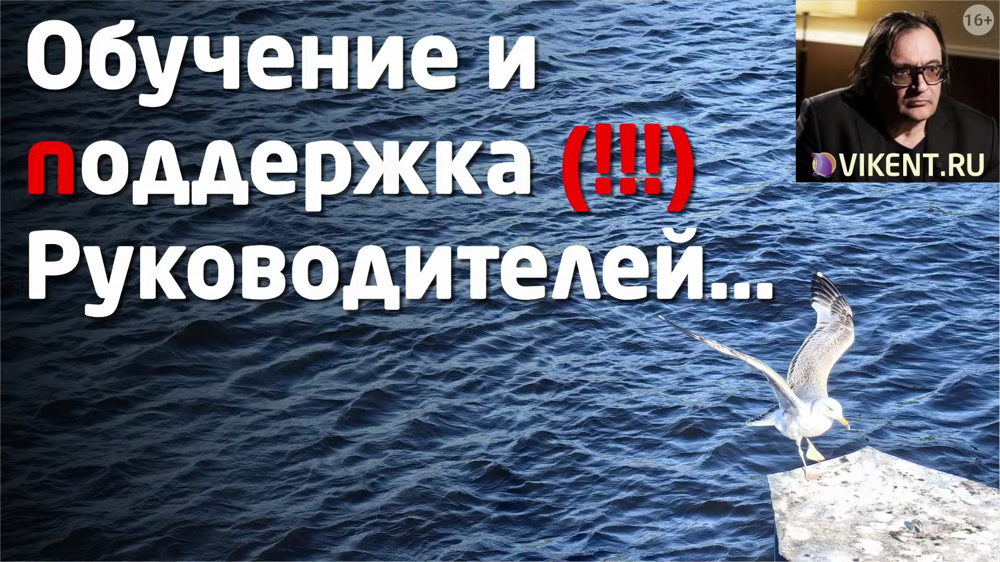

Так. Обучение, поддержка руководителей. Ну, давайте посмотрим вопросы. Давайте посмотрим вопросы.

---

## [01:02:15]

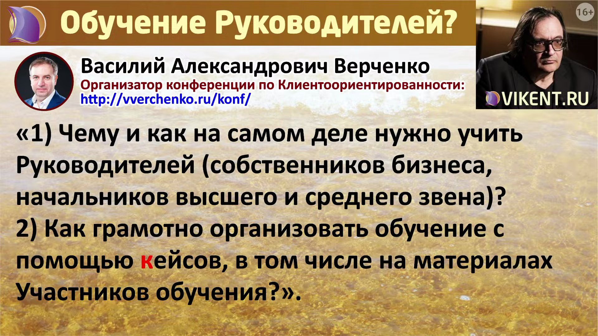

Масса людей, масса людей, соответственно, хочет учить владельцев, руководителей бизнеса, то по очень простой причине у них есть деньги. Учих есть. Более того, иногда руководители говорят о том, что у них нет, у них форс-мажор, то есть платят деньги, то есть при этом как бы платежи могут там быть десятки тысяч, сотни тысяч, миллионы рублей. Пришлите раздатку, то есть просто некогда ехать, некогда заниматься и так далее, и так далее, и так далее. Вот как бы, да. Соответственно, значит, э дальше некты как бы варианты, которые, ну, надо сказать. Значит, пункт номер один, соответственно, руководитель - это некоторый филиал в компании, филиал Бога, соответственно, который особенно ещё это особенно ещё и владелец бизнеса, он же владелец, он же руководитель. Это некоторый филиал богов компании, что будет вытворять наша Госдума, что Что будут вытворять наши партнёры из России? с определенных стран. Извините, сейчас выпью. Из зарубежа не знают. То есть заранее достаточно тяжело сказать, чему нужно учить руководителей. Достаточно тяжело и так далее. Учитывая, что я консультирую, с 1979 года у меня создалось впечатление, что как раз можно заниматься обучением руководителей, если как бы вы хотите заработать денег. Можно, да. Вот я не очень верю, что это обучение будет качественным, потому что у них хронические какие-то форс-мажоры, они там срываются, им там звонят и прочее, прочее, прочее, прочее. На мой взгляд, нужна некая ассоциация, как она будет называться, интеллектуалов. Ассоциация приличных интеллектуалов, ассоциация экспертов, ассоциация там крутых экспертов, это дело десятое. Вот. И так далее, и так далее. Вот. То есть руководителю нужна очень часто поддержка по самым разноразным направлениям. И желательно в течение часа, ну, лучше в течение 5 минут и гарантированно качественно. При этом, допустим, просто-напросто гарантированно качественно означает, что уровень выше, чем у его директора, ну, например, там по персоналу или по маркетингу или креативного директора. Вот что это означает. Соответственно, соответственно, м иначе иначе никак. Иначе никак. Поэтому, на мой взгляд, дело не в обучении, дело в консалтинге. Поэтому это моя проекция. Если вы мне укажете, что в Москве проходит много, много количества обучения, вот сейчас, допустим, человек, который у нас бывает, возможно, сейчас в чате находится, Сергей Александрович Александров, сейчас будет проводить обучение руководителей в городе Москве. Соответственно, вот просто одно из одно из многочисленных объявлений обучении руководителей уже более 100.000 просмотров. Уже более, ну, просто-напросто прикиньте, прикиньте, да, прикиньте, прикиньте ваши возможности. Далее, соответственно, далее, соответственно, если вот руководитель постоянно обращается в некую условную ассоциацию, которую коучи, психологи, не кнощи, будучи упомянутые консультанты в России создать не смогли приличную ассоциацию. Я их видел, я их знаю и так далее. Многократно отказался как бы сотрудничать и войти в состав. он многократно отказался, да, то, соответственно, некоторые консультации проходят примерно минут пять, да, это платные консультации минут пять. Допустим, бесплатные консультации докладчиков идут 20-30 минут, иногда больше. Иногда на меня вываливается в социальных сетях какой-нибудь новичок типа интересуюсь атеизм. Я его пытаюсь отправить на обучение уже у себя, на бесплатное обучение. либо кому-то из молодых коллег для стажировки, поскольку, то есть, допустим, ну, просто тратить время на новичка, который не знает, что он либо она будет делать сегодня вечером, но сейчас я интересуюсь атризом. То есть человек не знает вообще никаких азов. Соответственно, нужен нужен минимум час, полтора часа, значит, какие-то вещи разжёвывать. Мои ближайшие планы тратить на новичков час-полтора вообще не входит. Сначала правила игры у нас постоянно ужесточаются. Сначала и новички, и старички, они начинают делать стабильные доклады и должны доказать мне, что мои траты времени в них, они имеют смысл. Вот такие вот как бы пироги. Соответственно, кто хочет в крупных городах, может найти такой журнал Генеральный директор. Причём мой совет брать первые номера, потому что первые номера были интересные. Потом журнал, ну, классически, в моём понимании классически загнулся по S-бразной Кривой. Что делать, я знаю, но генеральный директор ко мне обращался исключительно как автору статьи. И, соответственно, скажем, я отказал. А мог бы сделать функционально стремостной анализ, он мог бы жить. Ну не обратились, как хотите. То есть как бы я никогда не настаиваю. Вот. Ну давайте посмотрим дальше. Продолжаем, да? Вот, соответственно, скажем, про обучение и поддержку руководителей, соответственно, как бы тем не менее возможны некоторые ходы без фанатизма, без фанатизма и так далее, и так далее.

---

## [01:08:15]

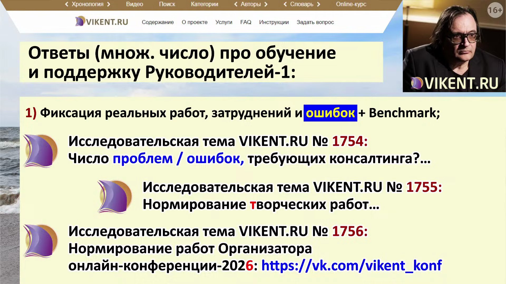

Вот, соответственно, очень желательно руководителю, причём руководитель даже подразделение, в принципе, это может быть умный школьник, это может быть умный студент, аспиран, установить себе некоторый эталон. Эталон. В прошлый раз я показывал, когда Сталин смеялся над интеллигенцией, что он читает, поставил себе планом читать каждые сутки минимум 200 страниц. Ну, 10 страниц, скорее всего, это такая вот средняя книга. Средняя книга. Средняя книга, да. Ну, в общем, иногда это называется бенчмаркинг. То есть просто-напросто вы ориентируетесь на лидеров. Если вы не знаете на кого ориентироваться, надо ориентироваться на лидеров. Не факт, что лидер сосед, не факт, что лидер родителей, не факт. Теоретически это возможно, не факт. То есть желательно выбирать лидеров в мире. Ну и пытаться как-то с ними крышиться и там так далее, так далее, и так далее. Вот как бы крешиться и прочее, прочее, прочее, прочее, прочее, да. Соответственно, скажем, вот есть некоторые темы для интересующихся консалтингом. Вот, ну, в том числе это и путь к руководителям. Какое количество проблем, задач в месяц падает на руководителя и примерно какие это проблемы? Ну, по отраслям. пораслям. Обычно м руководители становятся более договороспособными, когда они попадают в зону конкуренции. То есть они понимают, что они становятся сыном своей матери. Вот которая очень гордилась, что он был директором завода. А завод перенесён перенесён просто в Китай. Он просто стал сыном Мишей. Был Миша, директор завода, а завод перенесён в Китай, там где Да. владельцами зову, да, реальными владельцами. А Миша пошёл к своей маме вот есть её вкусные котлетки, как бы для далее вещь, которая у нас возникнет с неизбежностью, она, в принципе, уже лет 10 зреет, что-то похожее даже у нас было, это она вылезет, вероятно, с новыми акцентами как бы в наших семи конференциях. Может быть, в этом году, сейчас пока конференции просматриваются до 2028 года, может быть попозже, но армирование творческих работ. Сколько времени Ксения Александровна Колугина отводит на переписку со своими докладчиками в неделю? Вот очень хорошо бы это знать. Ну, хотя бы с точностью до получаса. Вот сколько времени у неё уйдёт на вёстку слайдов, вот сколько денег у неё уйдёт на резервный интернет. Я Ксению Александру поминаю, потому что у неё конференция ближайшая конец января. Вот, соответственно, ну, аналогичная тема, близкая, близкая тема по конференциям. Ну, то же самое по конференциям. Частично это пересекается с работами в области руководителей, соответственно, так далее, и так далее, и так далее, и так далее. Вот как бы, да. Ну, давайте пойдёмте, соответственно, скажем так, одну секучку, да? Давайте дальше. Давайте дальше. Вроде всё сказал, да? Давайте дальше.

---

## [01:11:30]

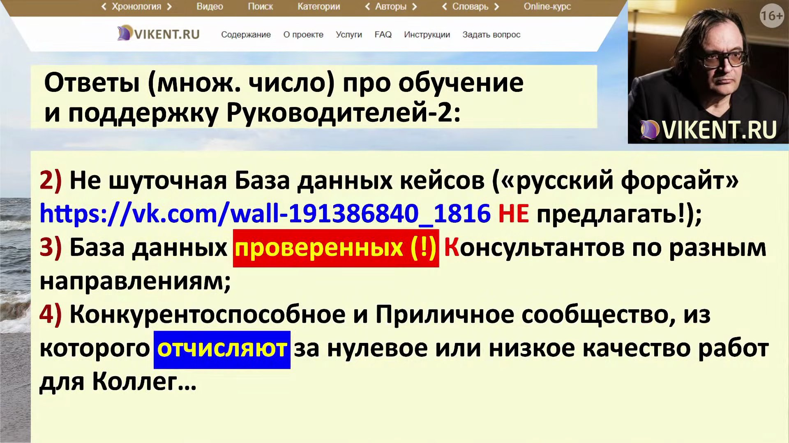

Давайте следующий слайд. Давайте следующий слайд. Так вот, соответственно, значит, да, вот это вот моя фотография во дворе Маяковки вот чуть-чуть за кирпичной стеной шумит Невский проспект.

---

## [01:11:45]

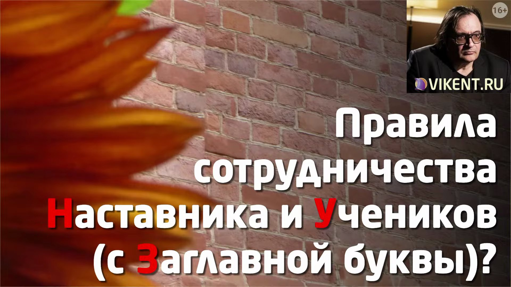

То есть подсолнув почти на Невском. И самое удивительное, за в течение лета никто не тронул. Ну давайте почитаем вопросы, так далее. Вот.

---

## [01:12:00]

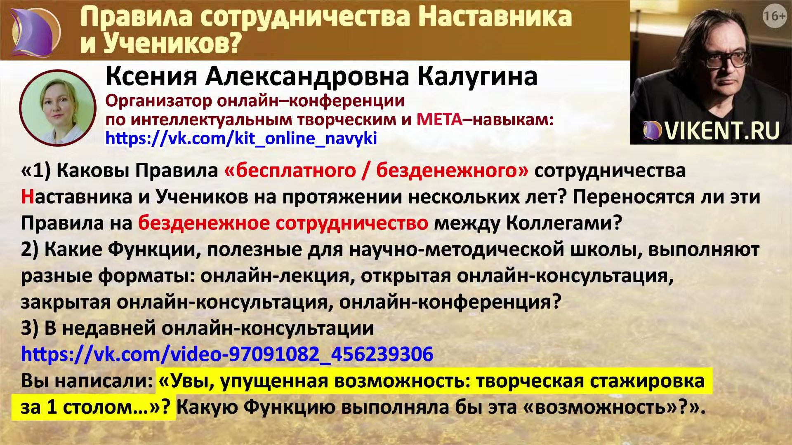

Вот вопрос, упомянутый Ксей Александровной. Вот, соответственно, как бы далее ссылка на её сообщество. Соответственно, вот такие правила я не спешу, я специально не спешу. Соответственно, учитывая учитывая, что как только мы начинаем вводить материально-денежные отношения, возникает нефилософский вопрос: а сколько стоят мои лекции? Пока они принципиально там путём различных комбинаций, различных комбинаций, это мои проблемы. Они делаются бесплатно. Русская интеллигенция, 99% русской интеллигенции, русскоговорящей это вообще не хочет понимать. Это называется психозащитой по Аннифрейд. По Аннифрейт и так далее, и так далее, и так далее. Поэтому, соответственно, делается очень потихонечку. Ну, на мой взгляд, на мой взгляд, есть некие принципы, которых я придерживаюсь. Это не означает, что это хорошо, но тем не менее. Значит, мне представляется, что сотрудни сотрудничество наставника и ученика или ученицы, они хороши и многолетние. То есть у нас постоянно появляются какие-то люди, которые побежали, урвали кусок какой-то, считая, что как бы они очень умные и так далее, и так далее. Где-то урча его едят в кустах. где-то в кустах. Как бы это, ну, плохой пример, хороший пример. Кто интересуется, пожалуйста, на мой взгляд, ну, может быть, даже для в этом году уже поздно, в следующем году это просто доклад, в том числе, думаю, что его можно запустить Ксении Александровне по по навыкам. Это сотрудничество Маи Михайловны Плесецкой и Пьера Кардена. Они десятилетиями сотрудничали, не всегда на финансовой основе. И, ну, всё было такое как бы всё было, ну, как бы как бы хорошо, как бы хорошо. То есть была друг друга поддерживали всячески. Два гения. Два гения, когда играют два гения, это это сильно. Это сильно, как бы, да. Соответственно, скажем, по поводу форматов чуть попозже отвечу. Специально сделали некоторый кусок и так далее. Вот то, что касается коллег, то, что касается коллег, то есть конференция становится больше. Возможно, кому-то нужно будет сделать сообщество, возможно, кому-то нужно будет сделать сайт. Но, как правило, внутрикорпоративные расчёты, они идут по минимальным ценам. Минимальным ценам, как бы я, честно говоря, не хотел бы в это дело влезать, как бы, ну, хотя бы потому, что я не знаю цену на изготовление сайтов и так далее. Соответственно, третий вопрос действительно некая упущенная возможность. Я уже думал, какая мы это сделаем. То есть я просто знаю из опыта такие опыты случайно получились, что когда человек сидит рядом со мной, как бы он просто видит, что я не отвлекаюсь, и это происходит не отвлечение часов там 15-14, как бы. Соответственно, жена входит в комнату, и жена ничего не говорит. То есть почему? Потому что это означает, что я должен отвлечься на несколько секунд. То есть то жена входит в комнату и ничего, то есть вообще ничего не говорит. То есть она понесла кофе, она понесла там чай, она что-то ещё может там принести и так далее, и так далее. Как бы ей не хотелось поговорить. Вот женщины начинают умнеть. Женщины начинают умнеть, если их муж работает 15 часов в сутки, лет 35 подряд. Лет 35 подряд, соответственно, скажем, начинают умнеть. Начинают умнеть, как бы, да. Соответственно, так вот просто люди при том, что я это говорю, увидят, что действительно на столе разложена масса картонов, потому что они от ветра не улетают с какими-то планами. То есть это сделать то же самое в компьютере можно и очень легко, но я как бы месяцами вижу одни и те же картоны, и они у меня все в голове. То есть для того, чтобы посмотреть то же самое в компьютере, нужно открыть файл, что-то ещё, а так чрезвычайно наглядно, то есть масса картонов. То есть люди подмечают какие-то мелочи, что ги стоит неправильно. Почему? Потому что когда я иду мимо, я эту гирию поднимаю. Это такой микроодых, ради бога, извините, по пути в туалет. Вот такая масса каких-то микровещей. Я их не вижу, но люди, побывавшие, посидевшие там пару дней со мной за одним столом, они как-то себе наматывают на ус. Они видят живой пример, что такое настоящая работа высокого профессионала. высокого профессионала, я уже могу смело, не мигая себе говорить так: "Ну, а русская интеллигенция в состоянии не делать репосты в одном проценте случаев от просмотров". Далее посмотрим. Это ответ на пункт два Ксения Савны. Давайте посмотрим. Давайте посмотрим следующий слайд. Вот Александр Олегович Романов по моей просьбе заверстал. Соответственно, вот есть открытый аналь лекции. Это публикация новых разработок.

---

## [01:17:30]

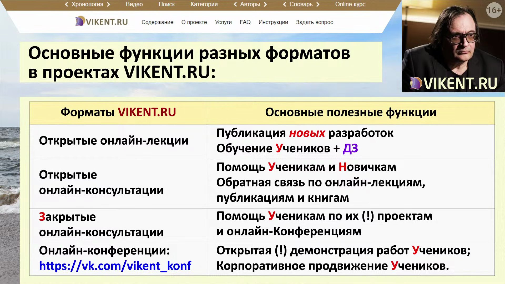

обучение учеников. Могу сразу же сказать, что никаких запретов у нас умышленно нету. Соответственно, есть большое количество людей, которые слушают, даже пишут с благодарностью, что им что-то это даёт. Опыт показал, это очень жестоко, потому что это незаметно. Без делания домашнего задания вы материал не понимаете. К сожалению, я ничего не могу сделать при всём желании. Ну, мой педагогический опыт семьдесят девятого года и очный, и онлайн последние годы без ДЗ, без своих проектов, ну, почти бессмысленно. Почти бессмысленно. Вот так далее и так далее. Ещё лучше и дзды. Хотя бы попробуйте начнёте что-то понимать в этой жизни больше. Возможно, я попрошу сейчас Василия Александровича Верченко, как человека суперакного, и это по его теме, соответственно, сделать опрос и доклад, что у докладчиков, соответственно, что что как выполнение докладов развивает докладчиков. Давайте Василия Сановича Верченко попросим, похлопаем ему в эфире, и пусть он в 2006 году осенью нам такой доклад сделает. Такой доклад сделает. Соответственно, открыты онлайн-консультации, то есть накапливаются какие-то вопросы, то есть есть какие-то неточности, есть педагогический брак. Педагогический брак есть почти всегда. Почти всегда, даже на отработанных материалах. Соответственно, вот для этого есть консультации. Закрытые консультации - это преимущественно либо проекты, либо проекты, либо, соответственно, скажем, докладчики. Иногда и и, потому что, в принципе, хороший доклад, как бы он обычно заканчивается там пятью, шестью, иногда дюжиной новых сельских тем, новых направлений, из которых можно выбирать. открытая онлайнконференция, это лучшие европейские традиции, то есть как бы нельзя замыкаться, как это делают исы. Мы публично показываем, публично показываем, чего мы можем достичь, чего мы можем достичь за полгода, год. Ну вот примерно такие назначения. Если у кого-то есть дополнение, не сочтите за труд, пожалуйста. Считайте, что это домашнее задание, пожалуйста, соответственно, пускайте, напишите, напишите. Извините, я оговорился. Давайте следующий слайд. У нас сегодня онлайн-консультация, если я отвечаю на вопросы. Давайте почитаем вопрос. Почитаем вопрос. Доска, лежащая на Невском, снята здесь на всякий случай. Давайте почти на неском, точнее так. Давайте почитаем слайд, что там за вопрос.

---

## [01:20:30]

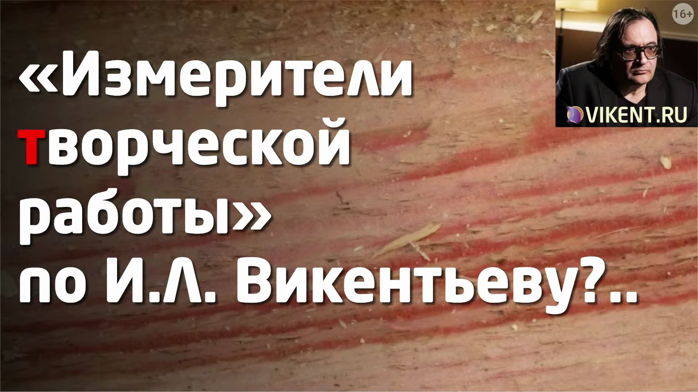

Итак, гений, гений XX века, Генух Учальшу, он, соответственно, предлагал измерять творческих личностей, творческие коллективы, их степенью приближенности к некоторым таких амбициозным, достойным целям.

---

## [01:20:45]

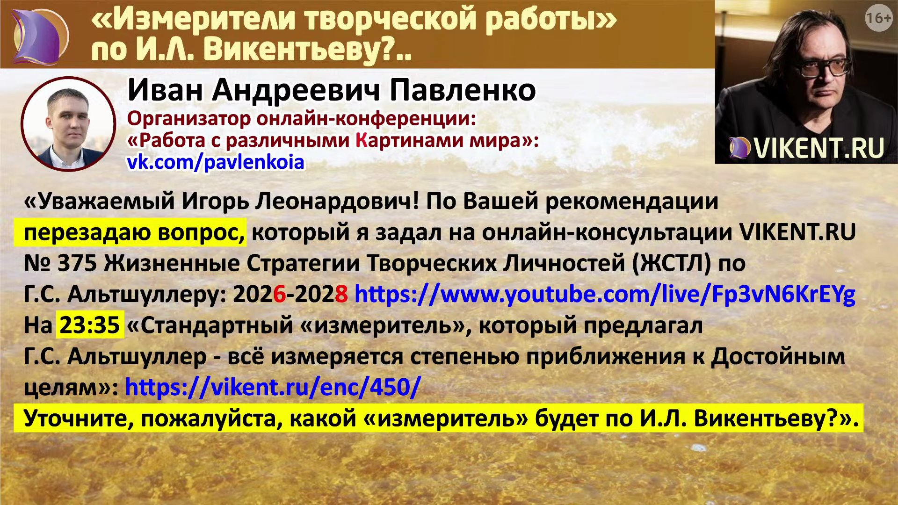

Что такое достойная цель? Соответственно, я ни разу не рассказывал. То есть, потому что гений написал, есть его текст, две странички. Если человек не может прочитать две странички, вот не надо ему заниматься у нас на курсе. Ну просто не надо, не надо, не надо. Поскольку это была консультация по Геннасовича Альшулию, я и несовался. Стандартная триз ошибка, когда люди рассказывают некую мутную смесь из гения и, соответственно, собственно шизолог. То есть в массе видео - это смесь, повторяю, некоторых положений гения и шизок очередного не очень грамотного там траблшутера либо тызовса, к сожалению, не очень грамотного и так далее, и так далее. У нас исповедуется такая классическая норма, начавшаяся с древнего Рима, о том, что вот меня спросили про Альшулера, про Ашулер я ответил: "А то, что делаю я сам, надо задать вопрос, тогда я отвечу". То есть я не мешаю себя и не мешаю Шуля. В данном случае адвокат, практикующий юрист, адвокат Иван Андреевич Павленко, соответственно, один из адвокатов, кто у нас занимается, из евыстов, соответственно, он спрашивает, что именно считает Викентев. Викентьв отдаёт, снимает шляпу, отдаёт должное Генучальеву, но считует считает несколько иначе. При этом надо честно сказать, что Игорю Леонардовичу Викентьеву было несколько проще, потому что один из исследователей Пушкина Эйдельман, Эйдельман говорил очень честно, что как бы я знаю больше о друзьях Пушкина, потому что я знаю, кто, допустим, на Пушкина стучал, а кто не стучал. Ну, сейчас скрытые архивы и так далее. То есть Пушкин этого не знал. Так вот, соответственно, Альшули нас покинул, ушёл в другой мир, если он существует. И, соответственно, наблюдая за тризусами изнутри, за их жалобами, болями, прочими, прочими штуками, соответственно, как бы у меня немножко другие измерители и так далее. Давайте посмотрим эти измерители, я их чрезвычайно кратко прокомментирую и так далее. Вот давайте посмотрим.

---

## [01:23:15]

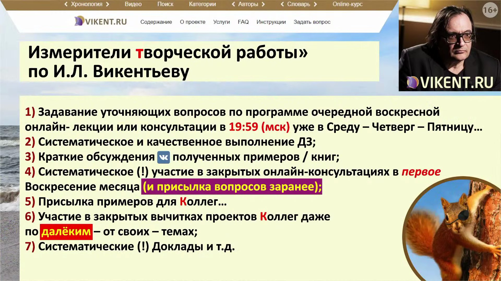

Да, соответственно, вот как бы достойная цель- вещь тяжёлая, ну, кто почитает, тяжёлая. И, соответственно, она очень часто среди тризусов декларировалась и ни черта не делалась. Я сторонник более такого постепенного восхождения по ступеням. То есть образ этого лестница такая лестница. Начало очень простое и в принципе доступно старший классне Q, старший классный Ц и так далее. Соответственно, вот просто-напросто всем предложено многократно, десятки раз опубликована интереснейшая программа, опубликована уникальная программа. Почему бы вам не задать уточняющий вопрос? Никаких ограничений нет, это бесплатно и так далее. Пункт два. Ну, сколько раз, я не знаю. Может быть, Максим Васильевич Денисов, он такие вещи любит делать, скажет: "Сотни раз сказано, что без выполнение домашнего задания у вас возникает иллюзия, что вы разбираетесь в триф, вы разбираетесь в творческих личностях и так далее, и так далее, без выполнения домашних заданий, внешне простых. Это иллюзия. Иллюзия, да. Соответственно, третье, краткое обсуждение полученных примеров, примеров из книг, ну, откуда-то ещё. То есть, соответственно, есть ряд людей, то есть я каждый день, включаясь сегодня, я посылаю тем людям, кто у нас делает доклады, по имуществом, кто у нас делает доклады, я посылаю примеры. Соответственно, раньше я посылал примеры, вообще как бы, ну, всем, кем мог. Сейчас у меня, мягко говоря, мягко говоря, как бы я не буду проводить подробности, это неприлично, не то медицинское состояние, поэтому как бы, ну, спектр, к сожалению, если вы думаете, что мне хочется сужаться, вы ошибаетесь, не хочется ужасаться. И вот, соответственно, некоторые люди, некоторые люди они просто отвечают спасибо. Некоторые люди отвечают подробнее: "Ой, спасибо это будет я поставлю это в качестве эпиграфа". Некоторые говорят, некоторые говорят: "Это вообще супер спасибо. Это пример на мой доклад в 2027 году". То есть пункт третий. Я, если я посылаю пример, откуда-то я могу вычитать примеры. Сегодня несколько примеров я послал нашим докладчикам, несколько примеров из книг, то, соответственно, я должен как бы понимать, что человек вообще живой, что живой, то есть как бы, да, вот и так далее, и так далее, и так далее. Соответственно, пункт четвёртый очень плохой признак. Вот у нас будет 6 декабря, соответственно, Ксения Александровна приложит усилия, чтобы на неё вышли все докладчики, кто будет на конференции. Если какой-нибудь докладчик не выходит 6 декабря, то есть теоретически это будет отвлечение Ксения Александровны Кологиной, это будет отвлечение меня, а я могу как бы в этот момент, извините, находиться в лежачем положении. Не буду уточнять, где, не буду уточнять, где не то есть человек с 6 декабря мне накот разные дряни, и я как бы приложу все усилия, чтобы отконсультировать. А 7 декабря я могу лежать пластом. И, ну, извините, мне тяжело, помимо того, что у Слександровны есть кот и два ребёнка. Два ребёнка, как бы, у неё тоже есть чем заняться, поверьте мне. Поверьте мне. Вот, соответственно, скажем, пункт пятый. Иногда люди присылают примеры, это уже из социальных сетей, из книг, из видео, для коллег, для канала Эмы, которая фильтрует глупость там зажеучёных и так далее, и так далее. Это хорошая практика. Соответственно, участие в закрытых вычиках. То есть сегодня вычитываем одного человека, дальше дальше коллектив, состав этого коллектива немножко меняется. Я его немножко меняю. Высчитывают другого человека. Как правило, когда какая-то рукопись прошла, несколько десятков человек, ну, человек получает и моральный толчок, и моральный толчок, и, соответственно, толчок примеров. Соответственно, при этом все авторы, кто присылает доклады на вычиску или новые разработки, пользуясь случаем, как бы фиксирую следующее. Обычно люди заходят один раз ваш закрытое Google облако, поэтому поблагодарите, ну, Google облако там за вычиску человека. Если это очень интересно, напишите красный краткий ответ. Но желательно вести переписку ВКонтакте или где-то ещё, потому что большинство людей, ваше Google облако, в отличие от вас, вам лучше заходить. Автору автору Google облака ежедневно заходит один раз, как бы, да. Вот поэтому пункт шестой. Очень интересный момент. У нас такого довода, что тема далёкая от меня. Тема далёкая от меня, поэтому я учитываю такого бабского варианта у нас нет. Так, он наказуем, вообще такой вариант, даже наказуем мною. Значит, почему? Вот как раз потому что эта тема далёкая от вас. От вас мод наиболее интересных решений. Решения могут простые: эпиграф, постэпиграф, картинка, ну, что-то такое вот, байка и прочее, прочее, прочее, да. Далее человека, который делает систематические доклады. Я думаю, что Василий Санович Верщенко не откажет. Соответственно, нужно изучить, что даёт систематическая практика докладов. При том, что я понимаю, что у всех проблемы, у всех болячки, у всех дети. Я всё это прекрасно понимаю, прекрасно понимаю. Лёжа пластом, лёжа пластом. Я это прекрасно понимаю, прекрасно понимаю. И так далее, и так далее, и так далее. Поэтому ещё ещё что я хотел сказать. Альшуль Евгений. Достойная цель - это очень круто, но не сразу и не для всех. Давайте начнём с нижних этапов восхождения. Вот систематические выполнения вот подобных работ, они ставят мозги на место. Вот если вы думаете, что вот просто-напросто человек сам себе способен поставить мозги на место, ну почитайте внимательно. Почитайте внимательно, соответственно, как бы уточняющие вопросы и мои ответы на них, и всё станет ясно. Всё станет ясно. Мы классно идём, укладываемся в полтора часа. Так, давайте идёмте дальше. Да, идёмте дальше, да? Идёмте дальше. И, соответственно, тема, которая, ну, понятно, что очень больная, очень царапающая преодолевание жизненных кризисов. Был задан вопрос в уточняющих вопросах, что а можно ли поставить такой навык? Ну вот на то и жизненные кризисы, на эту и чёрный лебедь. Что такое чёрный лебедь? Ну можете посмотреть.

---

## [01:30:15]

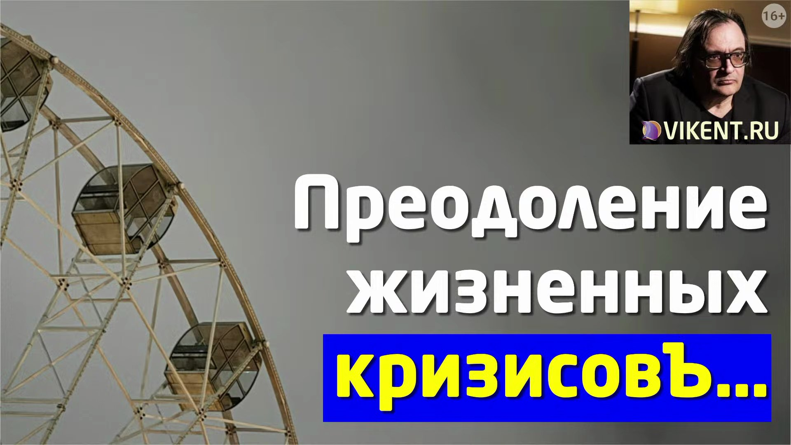

Ну то, что, ну то есть это можно немножко сгладить. Можно сгладить, но поставить навык такого полного равнодушия и так далее, и так далее. Вот как бы на мой взгляд. Далее я должен рассказывать несколько неприличных как бы историй про йогов и дзенбудв, которым мне рассказывали люди, которые практиковали с ними жизненный кризис. Но а эти истории, к сожалению, неприличные. К сожалению, неприличные. То есть даже у них это как-то фигня. Но тем не менее, давайте посмотрим. То есть посмотрим мне здесь кольшулю. Давайте, да, сначала почитаем. Извините, тороплюсь. Я тороплюсь. Вот, да, это вопрос был прислан на юбилее. Это первый вопрос, присланный на юбилей Айшулера в двадцать шестом году.

---

## [01:31:15]

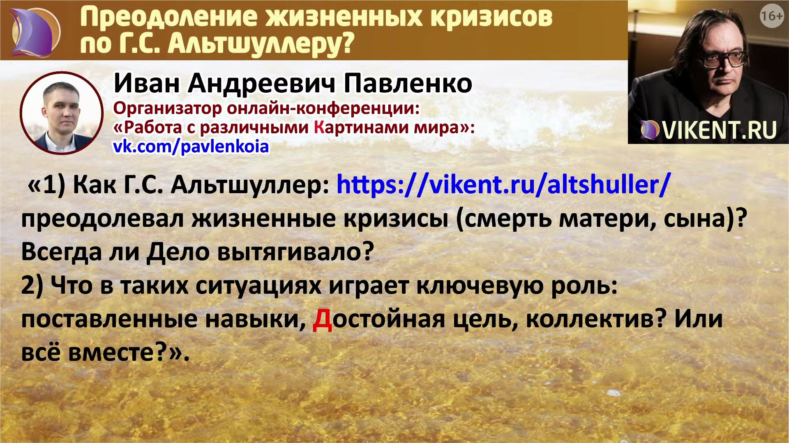

Поэтому Иван Андреевич Павленко автоматически входит в историю Трис. Всего лишь нужно было прислать вопрос. Иван Андреевич, поздравляю его с этим, он об этом не знал, он просто выполнил мою просьбу и стал номер один. Номер один первый вопрос. На столите Альшулера. На столите Альшулера, да. Ну, соответственно, давайте, давайте посмотрим. Я на эту тему отвечал уже отвечал. Вот, к сожалению, по всему желании добавить к тому, что говорил Генрисович Альшур, я почти ничего не могу.

---

## [01:31:45]

Вот. Но я человек корректный, я делаю ссылки и так далее. Вот как бы другое дело, что я еженедельно вижу бывших учениц и ученичков, которые забывают делать ссылки. Это другое дело ВКонтакте. Но я это сам делаю корректные сроки, да. Соответственно, скажем, несколько вещей, которые Ашулья в разных местах в разные годы говорил. Ну, соответственно, скажем, можно говорить о том, пытаться прогнозировать. Это очень неприятно, но это пункт бизнес-плана, любого нормального бизнес-плана риски. То есть, например, опять-таки, касаясь Василия Сановича Верченко, вероятно, да, я с ним не согласовывал, кстати, ну, думаю, что в 2007 году, может быть, в двадцать шестом году мы увидим две конференции Василия Александровича Верченко. У него приличная конференция, у него несколько разных тем. есть некий такой международный, ну, конгрессно-выставочный стандарт, то есть как бы дисциплина, которая занимается конференциями, конгресс-выставочный бизнес. И там есть такая рекомендация проверенная, что с тем, чтобы конкуренты, используя как бы используя как бы ваши наработки, не встали бы на рынке, соответственно, нужно делать конференцию либо два раза в год, либо ежеквартально четыре раза в год. Ну, то же самое в выставке, а иначе влезут конкуренты. Соответственно, Василий Сверченко хорошо развивается. Мой прогноз, мои прогнозы практически почти всегда сбываются. Ещё годик, ну, два точно. Вот если не полетит какой-нибудь чёрный лебедь, начнётся воровство тематики, начнётся воровство докладчиков, то есть, ну, начнётся, начнётся конференция стала заметной, соответственно, скажем, это бизнес-конференция, начнут воровать. Поэтому, соответственно, вот прогноз нужно делать, прогноз без психологии. без переживаниев и так далее. Вот как бы, да. Пункт два. Ашулью назвал 88. На самом деле немножко больше их там под сотню. То есть есть у творческой личности, у некоторой вообще личности, которые делают что-то такое замечательное, есть некие противодействия. Противодействия иногда просто просто на ровном просто на ровном месте. Например, как бы в своё время Максл, Максвелл как бы почитал некую лекцию в Лондоне, какой есть замечательный американский учёный, скажем так, физико-химик Гипс 2Б Гипс. Соответственно, Максова польза колоссальным колоссальным уважением. Соответственно, он почитал целую лекцию. То есть он снизашёл сам Макс вот не зашёл до того, чтобы почитать лекцию про Гипса. Английская пресса просто не отреагировала, а гипс, гипс изменил парадигму физики всего лишь. Ну, это для физиков. Физики не дадут мне соврать. Дадут мне соврать, как бы, да. Поэтому, соответственно, как бы, ну, надо понимать это. Это не мои результаты, это то, что делальшу. Соответственно, скажем, да, небольшое моё добавление, что, соответственно, когда погиб сын, то есть Евгений, то есть от аппендицита, казалось бы, то есть нехорошо прооперировали аппендицит в Баку, наверное, не очень хорошие медики. Он погиб, вы понимаете, переживание для отца, единственный сын звали Евгений. И тогда Альшу на папиросной бумаге разослал палочку. Она у меня есть. Там было написано очень кратко, то есть даже продолжаем работать, продолжаем. Это полностью согласуется с учением о доминанте академика Ухтомского, что вот доминанта для того, чтобы вот держать доминанту, а какой-то го - это Это гоя - это доминанта. Нужно действие, действие, действие. Это психофизиология человека и высших млекопитающих. По поэтому, соответственно, скажем, добавить я здесь не могу. Чуть-чуть добавил кольшу Алексея Сеевича Ухтомского ударение на первое у. Соответственно, мы шикарно идём. Мы шикарно идём. Давайте по времени имеется в виду. Несколько минуточек ещё займу у вас. Давайте, давайте, давайте. Соответственно, у нас уже благодарности, да? У нас благодарности, да? Значит, благодарности.

---

## [01:36:30]

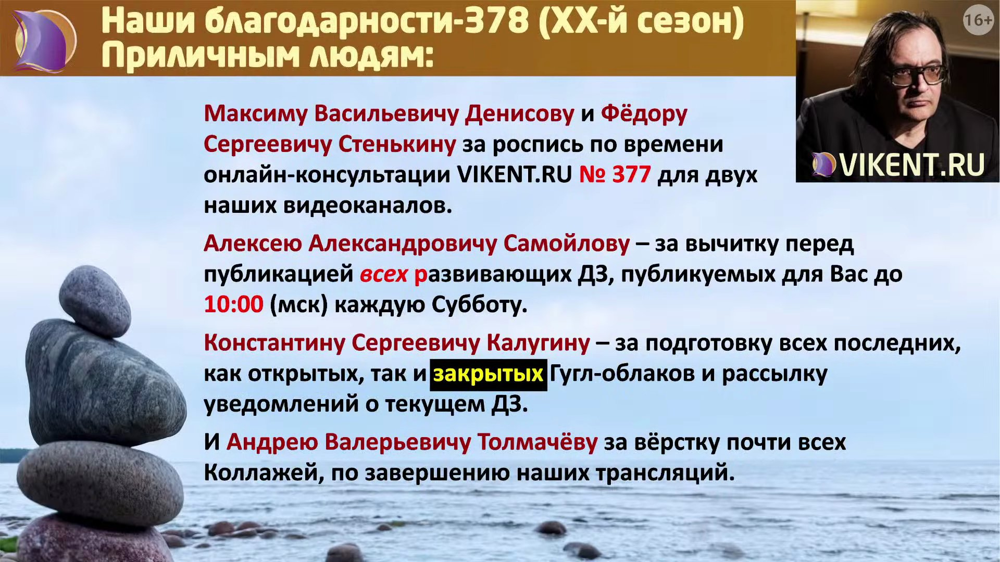

Вы видите фотографию Анатолия Александровича на Финском заливе. На Финском заливе. Я, кстати, пытался много раскладывать почему-то. У меня не получается. Кстати, это не моя как бы пирамидка, но кто-то сложил, не знаю, кто. Давайте посмотрим следующий слайд, как бы, да, и несколько организационных объявлений. Соответственно, вот у нас будет следующий раз курс, продолжается курс, как бы в следующий раз он будет по продуктам.

---

## [01:37:00]

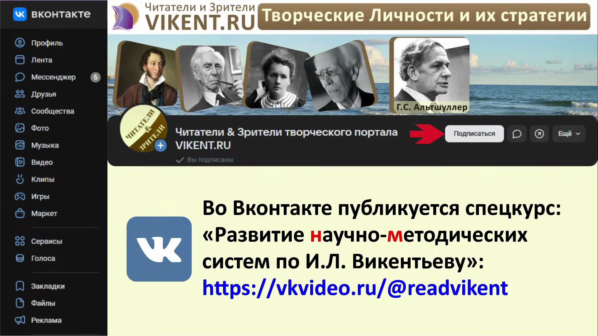

По продуктам. Кто хочет, может задавать уточняющие вопросы. 6 декабря, можете пометить, в воскресенье у нас будет домашнее задание. Оно будет опубликовано в субботу, но у нас не будет ни лекции, ни консультации. Соответственно, с утра до вечера, в буквальном смысле с утра до вечера жена молча входит и кормит меня. Вот почему многие удивляются, как я успеваю есть и консультировать. Соответственно, до ночи, до ночи, соответственно, у нас есть консультации докладчиков. Значит, докладчики готовят материалы, если что-то им непонятно, нужна поддержка, они, соответственно, рассвечивают это лиловым маркером в Орде. Можете в Google области, можете в Арде показывать сначала Ксения Александровне, потом показывают мне. Значит, везде, значит, во всех наших консультациях, значит, соответственно, принимает участие руководитель конференции Ксения Александровна Калугина. Ксения Ксения Александровна Калугина везде, то есть у неё тоже тяжёлый день. Соответственно, последняя консультация этого года 21 декабря. 21 декабря. Задавайте вопросы. В любой день недели до октября можете задавать, соответственно, вопросы по альшулютри, жизнь стратегии, развития точеских воображений, ну и так далее, и так далее. Первый вопрос человек уже задал и нормально войдёт в историю 300. Вот. Хотя, наверное, как бы, ну, может быть, может быть, не желал этого. Ну, тем не менее поздравляем Ивана Андреевича. Давайте посмотрим. Ещё парочка слайдов у нас осталось. Вот, соответственно, финансирование, как обычно для умных и порядочных. Давайте дальше. Соответственно, но у нас есть очень церемонное общение с друг другом. Кто до сих пор не понял, почему церемонное, ну, спросите двадцать первого под Новый год, под Рождество как-нибудь расскажу.

---

## [01:39:00]

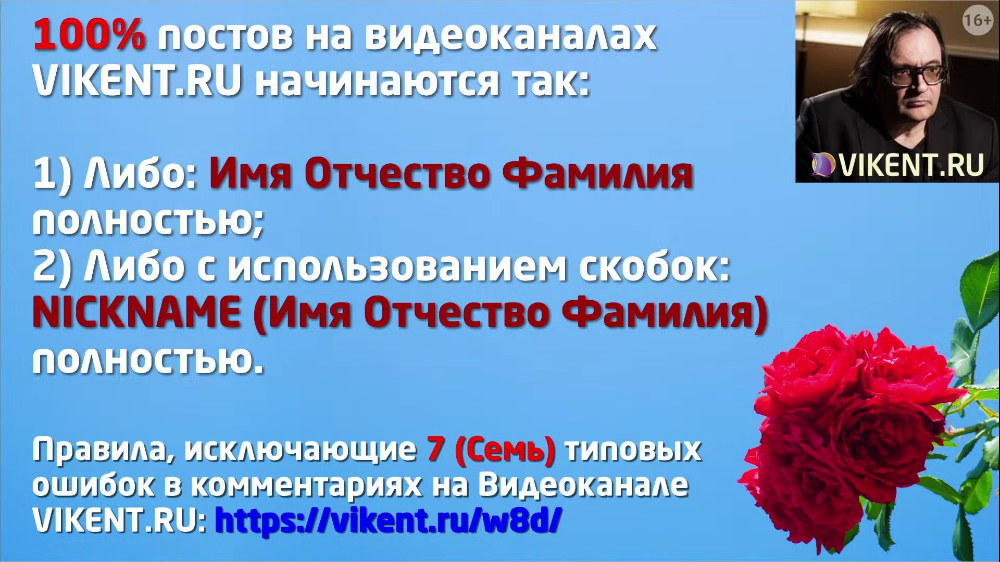

Соответственно, домашнее задание у нас задать вопросы, пожалуйста, под видео на ВКонтакте либо под видео на Ютубе. Кому как удобнее, я отвечу. Если есть возможность меня дополнить какими примерами, она столько это приветствует с аплодисментами. К сожалению, YouTube, ну, ВКонтакте тем более ещё не научился аплодисментами посывать. Ну, пора бы это да, пора бы это уже и сделать. Может быть, мы и сделаем, да. Итак, я посту пошёл сейчас ставить и ВКонтакте, и в Ютубе, соответственно, ссылки на отборные материалы с тем, чтобы вы не набирали руками. Всего вам доброго. И, соответственно, не стесняйтесь задавать уточняющие вопросы. Отдельное спасибо Монти, всегда радость от бульдога. Значит, соответственно, отдельное спасибо Александру Олеговичу Романову и Анатолию Александровичу Жачку, компании Ливызон, вот, которые всегда помогают нам проводить наш уникальный курс. Всего вам доброго. Значит, пошёл на YouTube и ВКонтакте.

---