# Лекция 379

---

## [00:00:00]

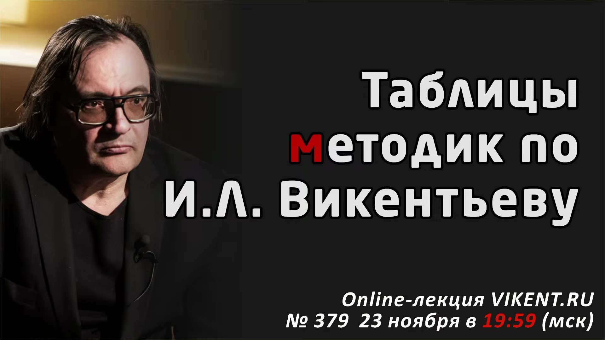

Добрый день, уважаемые коллеги. Мы сегодня читаем пятую часть спецкурса, который идёт у нас осенью по научно-методическим системам. Ну и давайте посмотрим сейчас первые два слайда посмотрим. Я довольно много поговорю на них, как ни странно. Итак, первый слайд. Он опубликован. Ну, требует дополнительных пояснений. Пожалуйста, давайте до Влатова. Давайте до Владова. Так вот, пока вы читаете, хотя это опубликовано и так далее, вот несколько таких вот баев.

---

## [00:00:30]

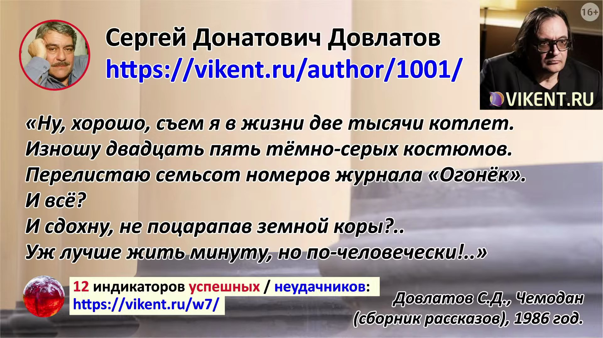

Мой очень далёкий родственник, неважно его фамилия, он входит в сборную, входил, точнее, в сборную Питера по рыболовно рыболовному спорту. И соотве есть такой спорт, рыболовный спорт. И, соответственно, он такая местная легенда Петергофа. Он же ПТ2С, потому что он забрасывает свою удочку. Рядышком стоит масса людей около каких-то прудов, которые в изобилии есть в Петергофе. У него ловится у соседа, который стоит там буквально в метре в 2 метрах, соответственно, не ловится. Почему это я рассказываю? Ну, соответственно, там, ну, только расскажу только один ход, значит, ну, потому что у него как бы м состав прикормки прикормки рыбы рыбы или так далее, и так далее. Вот у него минимум семь компонентов. Минимум семь компонентов. Поэтому можно копировать, пытаться встать рядом, видя, что у человека ловится. Ну, соответственно, скажем, у него ловится, а у соседа, стоящего в 2 метрах, в этом же пруду не ловится. Вот ключевое здесь, здесь цифра семь. У его коша, чемпиона России по рыболовному спорту, количество ингредиентов прикормки. Сядьте, если вы сейчас стоите, 52 компонента. 52 компонента, да. Так вот, зачем я это сказал? Зачем я это сказал? Что, соответственно, Сергей Донатович Далатов как бы литературно, литературно это выразил. как бы я постараюсь перевести на наш лад, что когда человек работает в области творческих индустрий, модное название креативных индустрий, интеллектуальных вещей, исследования творчества и так далее, вот, то есть, соответственно, если один раз с моим, соответственно, дальним родственником человек съездил на рыбалку, ничего не поймал, ну, ничего страшного. То есть, ну, там половину воскресенье провёл рядышком как бы понял, что как бы какие-то одноходовки даже в рыбалке, даже в Петергофе не работает. Ну, и успокоился. Ну, потеряно несколько часов, погуляла на природе, подышала воздухом, ну, и так далее. Вот. Соответственно, если человек работает в высшеназванных направлениях, которые становятся втых странах всё более актуальными, том пункт номер один, который советую для тех, кто ведёт конспект записать, в многоходовках это не работает. Это первая очень важная мысль. Соответственно, в многоходовках такие вещи не работают. Второй момент, есть обратное влияние дела. Я ежедневно вижу, соответственно, глупейшие посты от женщин, как бы от девушек, от женщин. Ну, я в возрасте, поэтому всех девушек, всех женщин я называю девушками. Значит, в том же самом контакте, где девушки, к сожалению, несут бред, соответственно, в области интеллектуальных, ну, и так далее, и так далее, и так далее, и так далее, и так далее, и так далее, и так далее. Поэтому, соответственно, девушки более внушаемы, если они не хотят себе себе нагадить через 10 лет. Мой совет девушкам без всякой мистики, окультятины и так далее, и так далее, и так далее, как владелец то ли крупнейшей в мире, то ли крупнейшей в Европе базы данных по творческим личностям, я советую помнить, то есть записать такую мысль. Дело, если вы занимаетесь долго, долго, как бы неважно, как это будет называться, коучинг, креативный индустрии, имеет обратное влияние на человека и докторов, которые извлекают из глупости в стране нет. Таким доктором мог бы быть я, иногда меня просят, но мне это не интересно. Я расписан по разным проектам, я этим не занимаюсь. Поэтому, соответственно, есть ещё один сорт девушек и, скажем, мужчин, как бы, ну, мужчин как-то жалко, а девушек, ну, как бы меня воспитывали несколько дворянок дореволюционных, поэтому привили жалость к женщинам. Соответственно, девушек жалко. Соответственно, некоторые девушки, как и мужчины, впрочем, довели себя до состояния, когда они хронически врут клиентам. девушки, всё это кончается очень плохо. Ну, у мужчин то же самое, но мужчин мне, как правило, не жалко. Как правило, не жалко. Давайте посмотрим следующий слайдлайд, а потом наши правила. Давайте следующий слайд посмотрим. Соответственно, все предыдущие видео спицкурсы, они требуют конспектирования. Мой совет не метаться по экранам компьютера, а просто завести себя блокнот, лист бумаги, лист картона и, соответственно, спокойно посмотреть.

---

## [00:05:30]

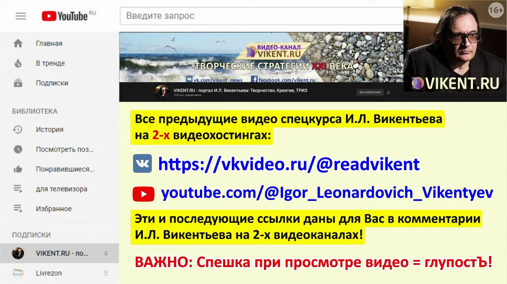

спокойно записывать. Ничего сверхсложного нет. Курс, в принципе, доступен старшеклассницам, старшеклассникам, что, в общем-то, мы проверяли и так далее. Вот поэтому очень хорошо здесь пометить, кто у нас недавно либо будет смотреть записи на наших тридцати конференциях. И Гряннович Викентьев, это я, мой портрет вы видите. Соответственно, мо как бы сейчас я намного хуже. Это древний портретка намного хуже. Соответственно, побывало более 3. 000 коучей, бизнес тренеров, бизнес-консультантов и так далее. Вот как бы, да, 30 конференций очных. Мы искали партнёров. Соответственно, преимущественно это были люди из Москвы и Санкт-Петербурга. Соответственно, более 3. 000 коучей, бизнес-консультантов, бизнес-тренеров не смогли в моём присутствии, очень важная оговорка, наведите обо мне сведения, повести пример одной небанальной решённой задачи для клиента. Вот запишите эту мысль, как бы вот эту мысль нужно думать. Ну, скажу потом, сколько думать и так далее, и так далее, и так далее. Вот. Соответственно, соответственно, давайте сейчас модераторы модераторы включат наши правила. Внимательно, пожалуйста, посмотрите их и постарайтесь выполнять. У нас бездуховные модераторы, то есть совсем бездуховные, они без предупреждений просто вырубают навсегда. То есть поэтому не надо шутковать, не надо думать, что для вас будут отдельные условия и так далее.

---

## [00:07:30]

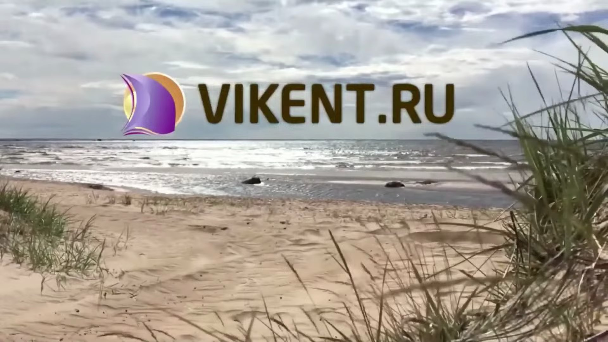

Уважаемые модераторы, запускаем, запускаем наши [музыка] [аплодисменты] [аплодисменты] данный курс читается в рамках проекта Викент, который является крупнейшим порталом Европы по изучению творческих личностей и творческих коллективов.

---

## [00:07:45]

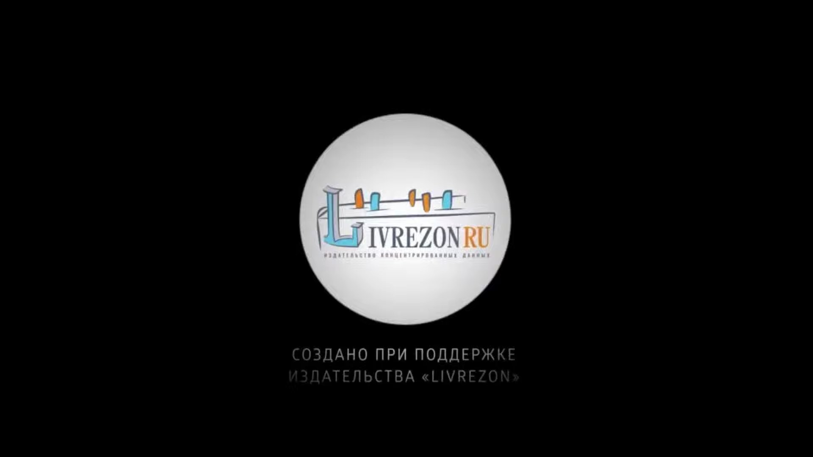

Материалы для этого проекта собирались мной с 1979 года. Надо предупредить, что наши материалы не сколь сложные, сколько непривычные для обычного мышления, поэтому нужно смотреть их очень внимательно и слушать, а также рекомендуется записывать.

---

## [00:08:00]

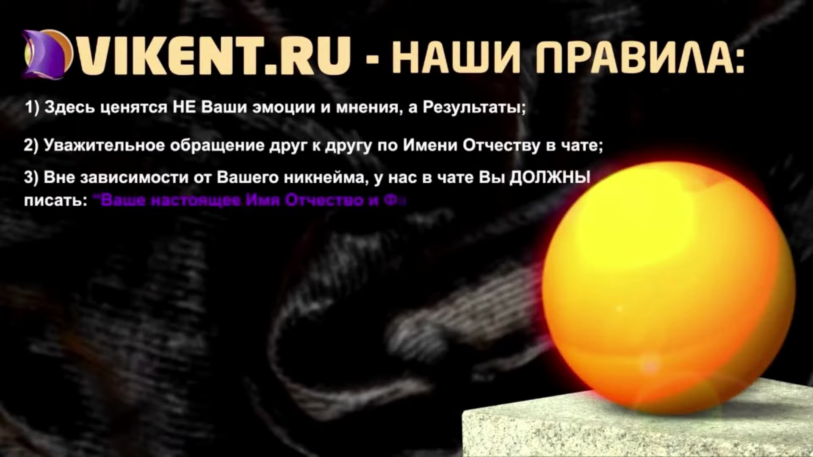

Как вы будете вести конспект в компьютере или в блокноте?

---

## [00:08:15]

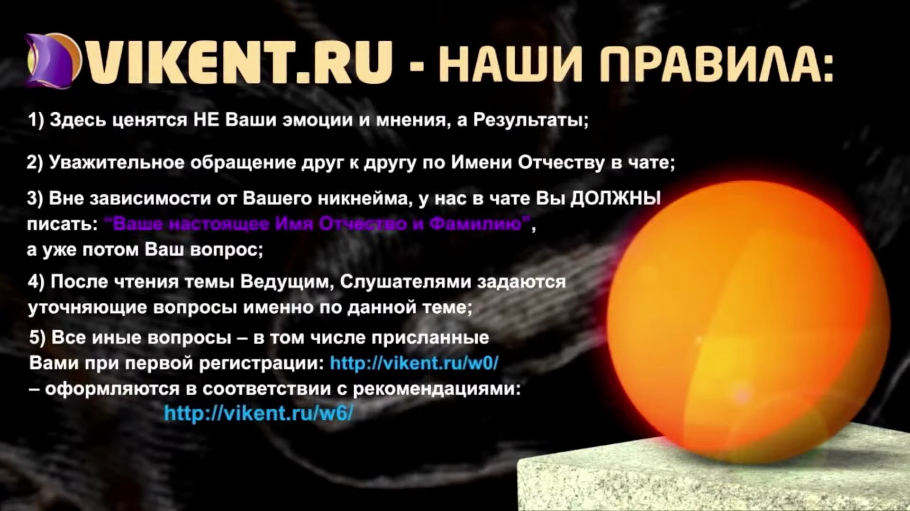

Это ваше дело. Лично я рекомендую вести в блокноте, посконо удобно не только записывать, но и зарисовывать те идеи, которые оглашаются в рамках нашего курса. Соответственно, у нас принято в Русской академической научной традиции обращение со всеми исключительно по имени Отчества.

---

## [00:08:30]

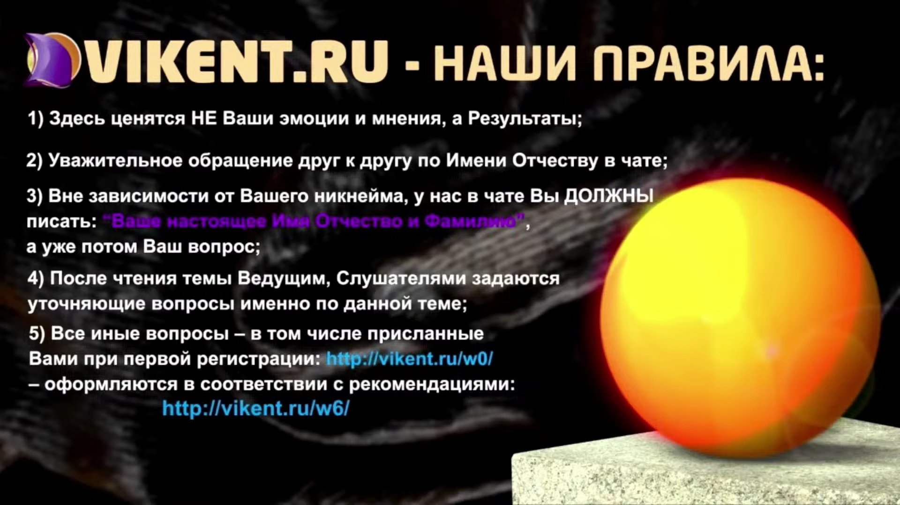

Поэтому, если вы зарегистрированы в Ютубе как Красная Шапочка, пожалуйста, это ваше право. Но у нас в чате вы будете писать себя как Красная Шапочка, а в скобках полностью имя, отчество, фамилия. Ну, в противном случае вы просто будете удалены модератором.

---

## [00:08:45]

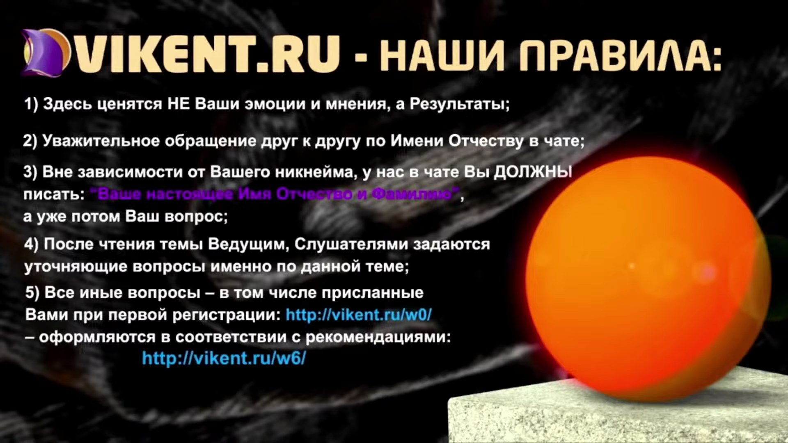

Причём удалены навсегда. Соответственно, у нас есть вопросы, несколько видов. Первый вопрос - это в конце какого-то логического куска, когда закончилась тема, и они задаются в чате. Если ваш вопрос существенно отличается от объявленной тематики лекции, то вы снизу экрана видите, как его задать по специальному формуляру.

---

## [00:09:00]

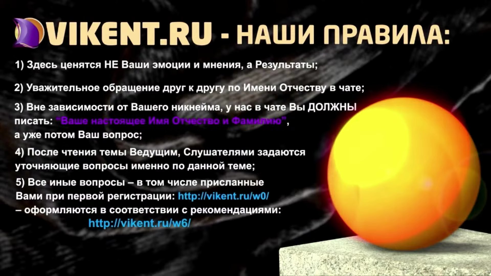

Соответственно, вот это вот оглавление, оно было опубликовано, ну, фактически во вторник, в минувшей неделе.

---

## [00:09:15]

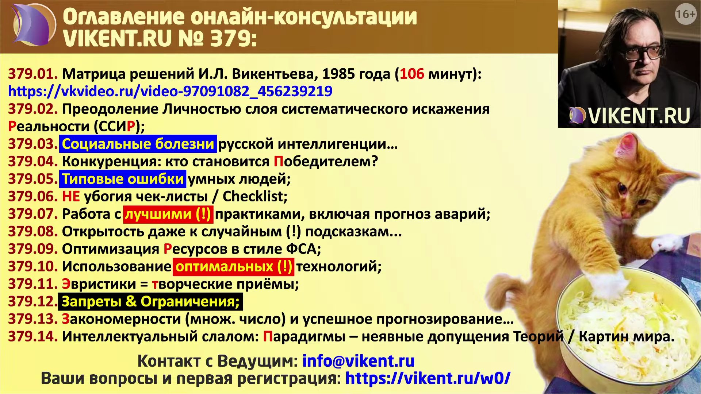

Соответственно, большое спасибо, большое спасибо за уточняющие вопросы. И похоже, мы породили новый жанр. То есть роман в письмах - это как бы, ну, известный жанр. Не помню, когда он возник, так далее, и так далее. Можно навести справки. Соответственно, учитывая, что у нас будет конференция, в том числе по новым жанрам, в 2026 году, я прошу руководителя этой конференции Романа Стефатоновича Флореску, соответственно, выйти на меня и, соответственно, на ближайшей неделе и мы обсудим докладчика, докладчика либо докладчиков, ну, максимум двух докладчиков по новому жанру. ответы на уточняющие вопросы, интеллектуальные вопросы и так далее. Это явно сложился у нас новый жанр, там педагогический жанр или литературный, ну, явный интеллектуальный жанр и так далее. Вот. Значит, второе. Большая благодарность к тем, кто задаёт уточняющие вопросы. Это очень чётко поставляе позволяет мне расставлять акценты. На всякий случай как бы, ну, будем формировать это более точно. Я отсылаю программу на вёску, соответственно, в ночь со среды на четверг. Это такая многолетняя практика. Поэтому, если вы очень уточняющие вопросы задаёте в воскресенье с утра, да, такое возможно, но на уровне слайдов я не в состоянии это учесть. То есть беспокоить, беспокоить человек Александра Олеговича Романова, который там верстает десятками тысяч слайды. Ну, ну, ну, это грех, короче, это это такое бывало, но это единичные случаи. Поэтому, соответственно, вот до ночи среды, если вы задали хороший уточняющий вопрос, это даже учитывается иногда в слайдах. За что, как, значит, колоссальное спасибо? За что колоссальное спасибо? Соответственно, почитали, да, все могут присоединяться. Это как бы вы сильно помогаете мне. Давайте дальше посмотрим. Дальше, соответственно, ближайший график до конца года, до конца двадцатого сезо двадцатый сезон вещания.

---

## [00:11:30]

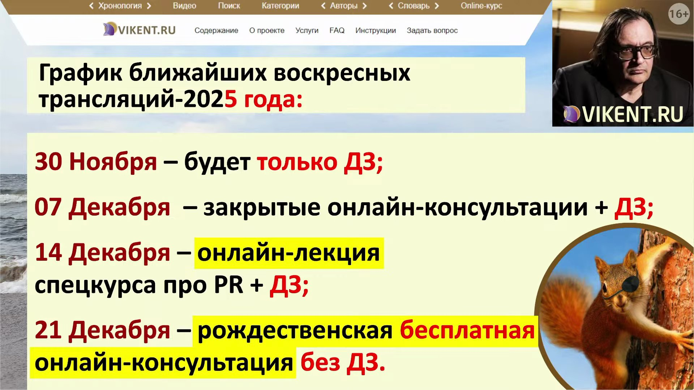

Соответственно, тут у меня будут немножко хирурги пользовать. Поэтому, соответственно, ближайшее наступающее воскресенье будет только домашнее задание, это святое. Соответственно, если в домашнем задании есть на вычику закрытые Google облака, мой совет всем вычитывать. То есть некоторые этим делом пренебрегают. Ну вот мой совет вычитывать коллег, короче, мой совет, хотя там очень разные задания. Соответственно, 7 декабря будет тоже домашнее задание. И весь день, то есть с утра до ночи, в буквальном смысле до ночи, идут консультации. Преимущественно это будут консультации докладчиков Ксении Александро Калугиной по её конференции, которая запланирована по навыкам, метанавыкам, компетенциям, технологиям, которые запланирована на конец на конец января. То есть уже можно регистрироваться, там быть докладчиком уже смешно. То есть на 2000, соответственно, седьмой год. Соответственно, как бы четырнадцатого у нас будет онлайн-лекция про PR. То есть у нас один спецкурс, ну, плавно перерастает в другой. То есть я автор наиболее издаваемой на русском языке методики по PRA. Соответственно, не боле далее, как вчера продрал весь контакт по PR пиар. То есть практически стопроцентный идиотизм. Практически стопроцентный идиотизм. То есть то есть это нечто. Ну и когда у человека есть методика, то есть один из следующих шагов, это, соответственно, ну, продвижение методики. Желательно это сделать грамотно. И опять-таки напоминаю эффект, с которого я начал, хотя с первого раза люди не понимают это, что как бы главное не в методике, главное, если вы занимаетесь креативными творческими индустриями, там трис, ну и так далее, и так далее. Главное не свихнуться, потому что если вы свихнётесь, вам методика уже не нужна, а докторов нет. И декабря рождественская бесплатная онлайн-консультация. Ну, домашних заданий не будет. То есть они они как бы как бы будут пожелания на новогоднюю неделю. Будут пожелания, естественно. Ну это, скажем так, по любви. Значит, кто хочет задать вопросы, соответственно, пожалуйста, можно задавать вопросы на 14 декабря. Первые вопросы уже поступили, как бы кто хочет гарантированно получить ответ в этом учебном году, в этом сезоне, на этой неделе лучше задать. То есть не дотягивать до конца. Соответственно, если кто-то хочет получить какие-то оперативные ответы по маркетингу, пиар, рекламе, продвижению интеллектуальных продуктов, продвижению личности и так далее, и так далее, вот, ну, пометьте, что это по поводу пиара или маркетинг, как угодно, можно задать не четырнадцатое. То есть программа более-менее мне понятна, но я повторяюсь заранее прислано, я всегда стараюсь это учесть. всегда стараюсь это учить. Соответственно, должен извиниться перед Василием Александровичем Верченко. Соответственно, я ему пообещал, это было публично весной, что осенью я ему отвечу. Он задал вопрос по построению. У него далеко идущие планы по строению не только школы, ну, в греческом смысле, а некого движения, социального движения и так далее. Я сказал, что осенью эту тему раскрою. Значит, я действительно тему готов раскрыть, но просто собравком какие-то данные, которые у меня там заразные годы на компьютере, я понял, что это отдельный спис-курс. То есть поэтому я перед Василием Александровичем Верченко публично извиняюсь, потому что спецкурс как бы уже уже всё отложено, но я просто не хватило места. То есть он просто переносится, то есть я как бы когда обещаю, всегда женюсь. Ну, просто, извините, не хватило. Надеюсь, что он как бы, соответственно, как бы меня простит за это. Извините. Ну, идёмте дальше. Соответственно, опережающая просьба. Опережающая просьба. Скорее всего, на зимних каникулах вы будете ездить. Очень нужны фотографии.

---

## [00:16:00]

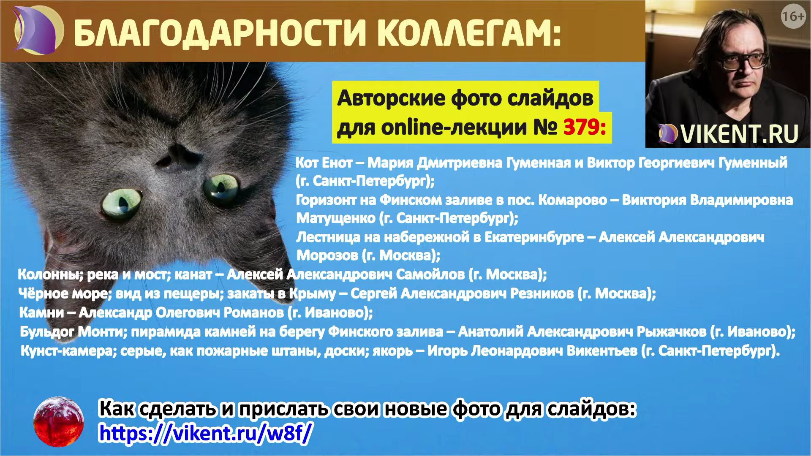

Тени на снегу, снег на тенях, солнце на снегу и так далее, и так далее. То есть нужны слайды, на которых можно писать буквы. Как бы если вы просто присылаете фотографии там травы, опавшие листвы, что-то ещё. Это плохие фаны, на них трудно писать буквы, они неразличимы. Вот. И так далее, и так далее, и так далее. Вот поэтому такая, я напомню, естественно, это на рождественской конференции просьба подумать, что вы можете для проекта снять. Соответственно, мы сюда указываем авторы, значит, всех фотографий. Ну, вы видите легендарного красавца кот Енот. Соответственно, надеемся его и Монти увидеть на нашей рождественской онлайн-консультации. Надеемся, в ассортименте. Давайте посмотрим новую книжку. Новую книжку. Вот есть крохотная книжка. То есть, грубо говоря, в Арде там почти 50 страней стоит.

---

## [00:17:00]

тако, ну, РДЕР там 48 страниц, грубо говоря, она маленькая, но она очень концентрированная. Там безумное количество ссылок на видео. То есть как бы её читать, ну, можно очень быстро, но это бессмысленно. Можно, соответственно, медленно читать. Значит, далее там такие темы, по которым мы, в частности, я готовы бесплатно, услышите, пожалуйста, этот термин ещё раз, бесплатно помогать при условии, что вы будете выступать у нас на наших конференциях 20067 года. В принципе, можно 2028, но пока вот 200627 уже начали расписывать детально. Начали расписывать когда? На этой неделе начали расписывать детально. Давайте посмотрим дальше. Соответственно, кто понимает как бы, ну, уровень наших бесплатных занятий, то есть не все понимают, не все понимают, соответственно, ну, пожалуйста, вы можете софинансировать донаты, ну, и так далее, и так далее, и так далее.

---

## [00:18:00]

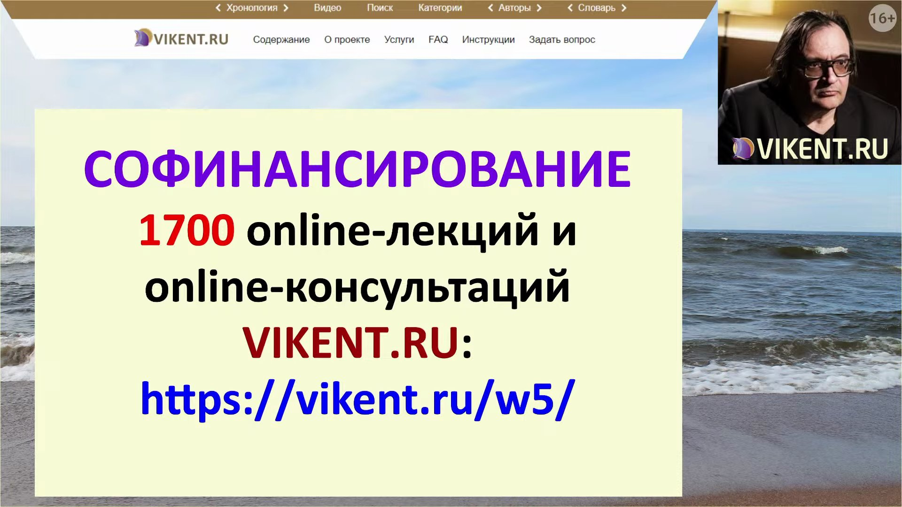

Значит, какая-то доля идёт на продвижение видео. Раньше 100% продвижение видео, сейчас кое-что ещё идёт на на лекарство, чтобы как-то там, ну, продлить моё существование, как бы. Дальше, дальше, дальше. Совсем печально. Я ухожу в многоточие. Давайте посмотрим последнее. Далее на у нас как бы сейчас ведут нас два бездуховных модератора без каких-либо предупреждений. У нас есть некая парадигма.

---

## [00:18:45]

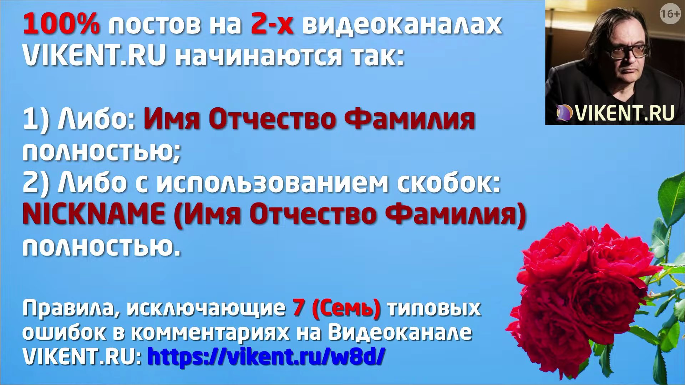

Па парадигме мы сегодня поговорим, что если человек настолько, обычно это мужчина настолько идиот, что он не выполняет наши правила, он идёт вон, то есть без всяких предупреждений из чата, из комментариев и так далее, и так далее, и так далее. Вот не надо шутковать. Кого интересует, а почему у нас так строго? Почему имен именно имя, отчество, фамилия? Пожалуйста, вопрос на рождественскую конференцскую. Несколько сотен раз я и мои ученики это объясняли. Может быть, вы прослушали, может быть, вы хотите читать свой курс, пожалуйста, задайте вопрос, я отвечу. На всякий случай у нас на всех консультациях онлайн, они бесплатные, принципиально бесплатные. Соответственно, есть режим аноним, то есть я буду знать, кому я отвечаю. Это иногда важно. Это мужчина, это женщина, из какой страны вы спрашиваете и так далее. Вот. Но я никогда не называю вопрошающего. Поэтому, кто хочет понять, почему такие правила, ну, у как бы легендарного проекта и так далее, и так далее, вот, ну, спрашивайте по нашим правилам. А мы, соответственно, потихонечку, потихонечку, а нет, ещё есть у нас кое-что. Давайте посмотрим. Соответственно, это написано в оглавлении. И наше оглавление, как другие оглавления, я не знаю, наше оглавление написано для того, чтобы выполнять его. Выполнять.

---

## [00:20:00]

Поэтому я всем советую вести конспект на бумаге. Так лучше запоминается. И кто не знает либо очень давно смотрел, мой совет записать себе не сегодня ночью, но сегодня ночью вы будете переполнены этой лекцией, а воостановить на неделе как бы или там в новогодние праздники. Это вы решаете пересмотреть вот этот материал 106 минут и желательно законспектировать. что если вы разумный человек, как бы, и так далее, вот, и знать близко к тексту, как бы насчёт близко к тексту. Не потому, что материал мой, я как бы очень критически как бы отношусь, но потому что ничего лучше как бы в виде навигации по методике просто-напросто физически не существует. А где не существует, Игоря Анович? А в мире не существует. Значит, соответственно, как бы, ну, теперь мы начинаем, в общем-то, идти самого низкого уровня матрицы. То есть матрицу, повторяю ещё раз, нужно знать близко к тексту, если вы не хоти, если у вас есть какие-то амбициозные планы в области, там постояниние методик и так далее, и так далее. Вот, давайте. Итак, самое печальное, давайте следующий слайд. Итак, самое печальное, соответственно, повёрстки мы это обсуждали, что, возможно, это последний взгляд, последний взгляд пьяного Ельцина, когда он падал с моста, помните как бы историю, ну, и так далее, и так далее, и так далее.

---

## [00:21:30]

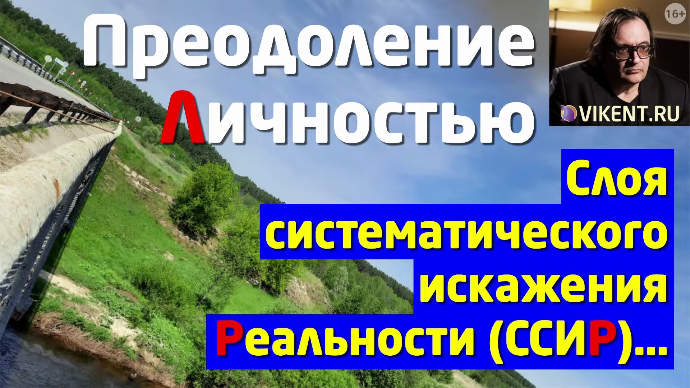

Вот реально эта фотография Алексея Александровича Самойлова из Москвы как бы, ну, насчёт Ельцина это так мы шутили на так мы шутили на вёрске как бы, да. И, соответственно, скажем, есть некая такая вот несколько печалей. Вот безумное количество, безумное количество людей, причём как бы люди, имеющие высшее образование. Это для нашего курса, кстати, не обязательно высшее образование. у нас могут заниматься. Это проверяли неоднократно старшеклассники, трудолюбивые, не не способны, я такого не сказал, сказал трудолюбивые старшеклассники и старшекласницы. Вот могут заниматься доктора наук, профессуры, ну и так далее. Вот как бы, да. Но как бы вот надо понимать, что масса людей сидит в некотором слое систематического искажения реальности. Соответственно, иногда я давал ссылку, сами можете найти. Есть замечательное стихотворение Андрея Вознесенского. Оно есть в интернетах, называется "А нафига". Вот перечитайте вот: "А нафига? " Дальше возникает уже как бы 40, 45, 50 лет. А нафига вообще? Вот нафига вся эта была суета? Ну и так далее, и так далее, и так далее, и так далее. Вот как бы соответственно соответственно следующий некийте тезис, пока смотрим на систематическое искажение реальности, соответственно, должен сказать следующий такой неприятный момент. Соответственно, какие-то интеллектуальные вещи, там типа трис, методики креатива, потому что есть другие методики креатива, типа трис, функционально-тремостной анализ, например, ну, в каком хорошем исполнении, ну, и так далее, значит, и так далее. Вот, соответственно, как бы они перешли на коллективные стадию развития приблизительно в середине восьмидесятых того века, то есть уже несколько десятилетий. Если человек что-нибудь как бы пытается и сей изобразить, неважно, человек занимается у нас на курсе, не занимается, то, соответственно, я должен просто очень спокойно, может быть, холодно, может быть, ласково, наоборот, предупредить. Первое, значит, в середине 1980х годов, восемьдесят пятыйводесят шестой в мире как бы става заниматься профессионально. Масса людей в разных странах это поняли. Второе, развитие креативности, что ты ещё перешла на коллективную стадию развития. Каждый выпуск лекций, который вы сейчас смотрите, это можете подчитать пальцем. Это труд 15 тире2 человек. 15.000. Ничего близкого по качеству вот с данным курсом на русскоязычном пространстве нет. Неоднократно просил прислать что-то качественное на английском, пока только прислали убожество. Следующий момент, который, соответственно, очень хорошо поставит мозги, у кого они есть. Соответственно, м есть распечатки, иногда они делаются, иногда они не делаются. то, что я сейчас, например, говорю, такие распечатки есть. И, соответственно, получается, что каждая лекция, каждая консультация - это в районе 100 страниц. Соответственно, если распечатать те видео, которые рекомендуются в каждой лекции, в каждой онлайн-консультации Викентьева, соответственно, м получается несколько сотен страниц в Арде. В Арде. То есть такая серьёзная монография в неделю. Ещё раз, Викентьев с 2012 года, то есть уже десятилетиями, может делать монографию в неделю, ну, с помощью учеников, с помощью коллектива и так далее. Вот это для тех, кто ставит амбициозные цели. Амбициозные цели и так далее. Вот можно помнить, подсказываю, на 21 декабря можно задать вопросы и говорить: "А как делать монографию в неделю?" Ну, какие-то основные пункты расскажу, не скрою. Ну, соответственно, чтобы вам А были ли какие-то аналоги? Были. Ближайший аналог мне известный войне и мире Лев Николаевич Толстой держал в голове 600 персонажей. Ну, можете меня проверить, пересчитать. Сейчас я нагнал страху. Давайте сделаем разрядку. Давайте сделаем разрядку. Следующая фотография. Это Тайнланд. Соответственно, ночью слонёнок пошёл пожрать сахарный тростник.

---

## [00:26:15]

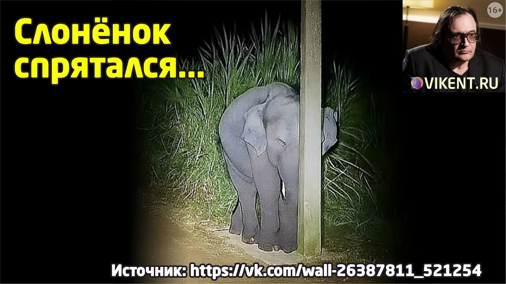

Значит, слонёнок, как и коты, как и собаки, умное животное, прекрасно знают, что это нельзя. Прекрасно знает. Поэтому, когда его застукали, скорее всего, это фонари машины, либо серийный фонарь стороже какой-нибудь, слонёнок спрятался за столб. Вы видите, столб, он вертикальный. И, соответственно, для надёжности, что как бы он не жрал, как бы его его не застукали, соответственно, слонёнок закрыл глазки. Ну вот слонёнок побывает, ну, в своём слое весьма искажённый весьма искажённые реальности о каких-то результатах, каких-то, ну, творческих результатах, естественно, естественно говорить даже не приходится. Надеюсь, надеюсь, что те, кто любит животных, соответственно, надеюсь, что вы улыбнулись, особенно, если не видели эту фотографию. Она довольно известная. Ну а мы а мы идём дальше. Дальше мы начинаем ещё какие-то неприятные вещи. И вот, соответственно, сам каких-то таких вот достижений не имеет.

---

## [00:27:15]

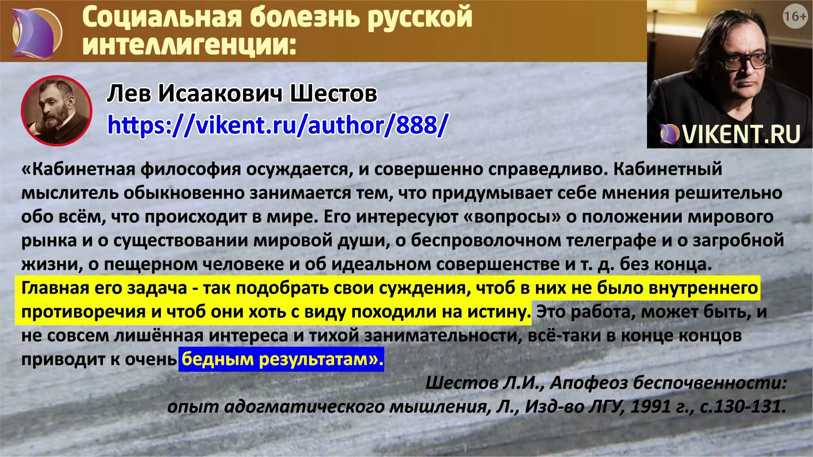

Лев Исакович, как бы можете навести справки на портале, так далее. Вот. Но обратите внимание, он описывает некую социальную болезнь русской интеллигенции. Подробных описаний довольно много, но он так очень коротко это описал и так далее, и так далее, и так далее. Вот, соответственно, приведу другой пример. Мне просто спросили, я не буду говорить, кто меня спросил, хотя мы немножко об этом говорили. Соответственно, как бы я рекомендую. Периодически на меня вываливается какой-нибудь человек и говорит загадочно. Иногда это обманутые девушки. То есть девушек воспитывают так, чтобы их было легко обманывать. Ещё раз, девушек, то есть женщины, воспитывают так, чтобы их было легко обманывать. Чей афоризм? Мой. У кого есть возражение, 50 примеров на стол, что это не так? Соответственно, так вот, периодически меня спрашивают: "А вот Кастанеда, у у Кастанеды у Кастанеды не хватило ума, как бы на собственные философские сочинения, поэтому, соответственно, он передрал масса философских трудов европейских философов". Соответственно, если вы почитаете параллельно, ну, две книжки про Дона Хуана у Костанеды и, соответственно, история западной философии, соответственно, Бертрана Рассова, то как бы мозги у вас станут на место. То есть, то есть, грубо говоря, у человека собственных результатов нет, но человек приписывает результаты европейской философии некому загадочному Дону Хуану, который использует большое количество абстракций, которые в прибытных культурах, мягко говоря, не очень существуют, не очень существует. такую философии, если вы считаете, что знаете философии, о каких авторах Бертран Расов в своей книжке, она более тысячи страниц состоя западной философии, нищёл нужно указать. Ну, на всякий случай для поверки вашей квалификации, если вы считаете, что вы понимаете философии. Ну, и так далее. Вот. Ну, давайте посмотрим смешной пример. Смешной пример чередования. И вот, соответственно, замечательная фотография Тертия Александра Через Резникова. Крым.

---

## [00:29:30]

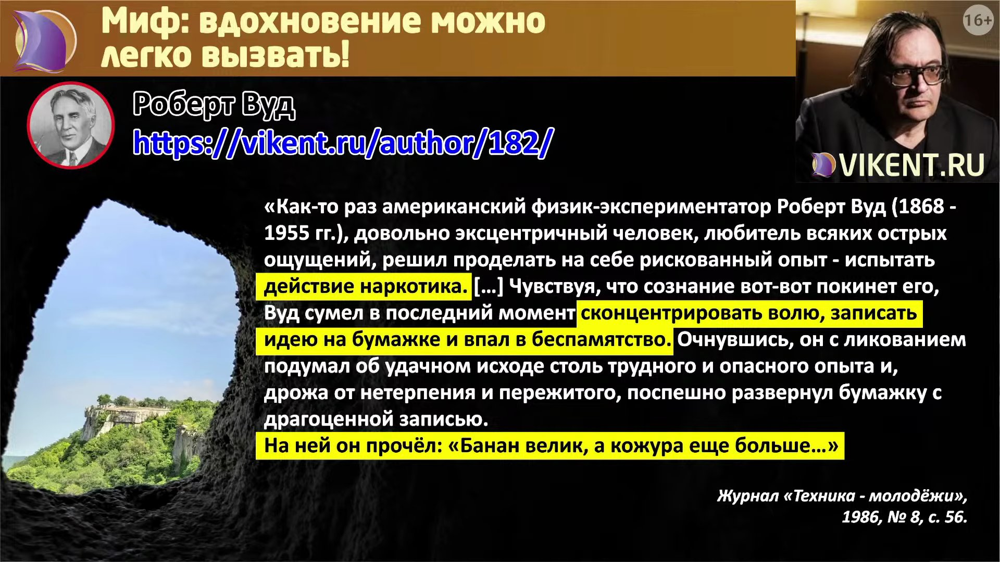

вид из пещеры. Вот Роберт Вуд как бы решил проверить некую байку, что под наркотой он будет креативен. И это есть в книжке, но я даю ссылку. Я в первый раз узнал это не из книжки, а узнал. У меня неплохая картотека, по крайней мере, лучшая в Европе. По крайней мере, лучшее в Европе. Вот. И так далее, и так далее. Вот в восемьдесят шестом году вы видите, где это я узнал, да? И вы видите, хотя есть книжки Сибурга. сиблка, книжки сиблка, соответственно, скажем, вот, ну, не работают такие технологии, не работают. Ну, кто хочет, пожалуйста, и так далее, и так далее, и так далее. Вот. Ну, давайте немножко посерьёзнее, немножко посерьёзней и перейдём дальше. Соответственно, от чего происходит слово метод?

---

## [00:30:15]

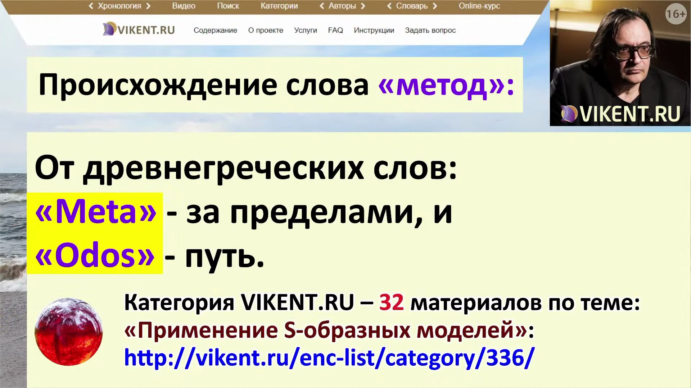

Ну, вы видите, написано на экране. Для тех, кто будет смотреть впервые, это пятая часть, предыдущие четыре. Я уже сказал, где посмотреть. Мы не закрываем эти материалы, они полностью открыты для умных людей. Сразу говоря, просмотры предусматривают отключённые телевизоры, внимательное конспектирование. Если вы что-то хотите понять, не хотите понять, ну вы свободны в ваших ошибках. Конституция России, сложная мысль даже для даже для июриистов, позволяет вам делать ваши ошибки. За чьи счёты гляч? За ваш счёт. За ваш счёт и так далее. Вот. Пожалуйста, за ваш счёт вы делаете ошибки. Так вот, есть наука. Наука, по большому счёту, это открытие каких-то новых явлений, да, новых объектов. А методики, чем мы занимаемся с вами, это, соответственно, определяются фразой Генна и Форда, точнее, фразой, похожие на типовую фразу Гена Форда, демократизация творчества, когда, соответственно, собираются различные научные достижения. И делаются методики. Методики делаются неспешно, иногда годами, иногда система Станиславского или тыжуля десятилетиями. Десятилетиями. Вот кто хочет поспорить, что методику можно сделать за вечер, таких клоунов я насмотрелся 3.000 из Москвы и Питера. Это вороньё. Успокойтесь, успокойтесь. Это вороньё. Попытайтесь выступить на нашей конференции, как бы, и мы очень быстро вам ставим правильные мысли в вашу голову и так далее. Вот. Ну, теперь смотрим, соответственно, скажем, первый нулевой уровень. Первый нулевой уровень слоя систематического искажения реальности. Давайте следующие вещь. Соответственно, я никогда не читаю, соответственно, желательно делать printск скрин.

---

## [00:32:15]

Ну, как бы и хотя это можно сделать при просмотре. Сразу скажу, что масса людей с высшим образованием, доцентов МГУ, соответственно, докторов из Москвы, докторов наук из Москвы и из Питера и других замечательных городов говорят, что наиболее сложные вещи как бы они пересматривают в моих лекциях три раза. Простой вариант. Вы записываете примерное время или делаете, значит, фотографию экрана на вашей клавиатуре с высокой вероятностью эта клавиша, соответственно, справа сверху. Справа сверху, как вы записываете примерное время, потом спрашиваете. Соответственно, ближайшие ответы можно задать до 10:00 четвер наступающего. Если вы зивнёте как бы наступающий четверг, ну, пожалуйста, милости просим на 21 декабря. То есть как бы я не оставляю долгов на Новый год. Вообще никаких долгов. То есть на все вопросы 21 декабря я я отвечу. Отвечу. Соответственно, скажем, вы видите слева, слева жабён не влез. Жабёны у нас символ ошибок. Вы видите типовые ошибки умных людей, от имеющих высшее образование до имеющих диплом доктора наук. Вот, к сожалению, значит, справа, справа как бы как бы вы видите, что как бы нужно делать, что нужно делать на первом этапе. То есть на первом этапе, когда только что-то зарождается, то есть то есть будут какие-то возможности. Эти возможности желательно ловить. Как правило, этот этому навыку никто нигде не учит. Никто нигде не учит, включая МГУ, включая Академию наук, как бы, да. Соответственно, пункт два. Иногда я вытаскиваю, обучаю и так далее, и так далее. Вот как бы этому, ну, на конкретных проектах, на материале. То есть, соответственно, то, что у нас будет закрытая консультация, соответственно, господи, 7 декабря, седьмо декабря, значит, вот как бы вот вот вот этим будем заниматься на вашем материале, будем вытаскивать какие-то единичные ходы при зарождающейся новой тематике. Соответственно, если человек так потихонечку отдаляется от высокоуровневого наставника, неважно, это мужчина или женщина, деградация начинается промерено многократно, через два квартала начинается деградация. Я не пошутил. Я не пошутил, как бы исключения мне, к сожалению, неизвестны. Далее, более оптимистичные вещи. Обратите внимание, самый такой, может быть, крупный форматор либо крупнейший реформатор России, это Пётр I. Соответственно, у него был болезный брат Фёдор Фёдор Алексеевич, в которого там в три горла впихивали какие-то знания, потому что он старший, он должен был Алексея Михайловича наследовать и должен стать царём. Вот и он был малохольный, он был болезненный. Плюс в Кремль малоизвестные детали был свинцовый водопровод. Соответственно, когда диетологи современные слышат про свинцовый водопровод, они там лысеют в прямом эфире прямо, а Пётр с матушкой жил в Подмосковье и развлекался. И обратите внимание, он не попал в штампы эпохи. Потом ему повезло, то есть посещение немецкой слободы. Кто хочет, может посмотреть моё очень неплохое видео. Посвление Петра I. Петра I. Там есть два видео недлительные. Кто не знает, напишите, как бы, ну, мы вам дадим ссылочки, кто не найдёт и так далее, и так далее, и так далее, и так далее. Вот. То есть, обратите внимание, наш крупнейший реформатор, а у него вообще даже не потребовалось вылезать из слоя систематического искажения реальности. Он попал, в принципе, там через пьянку, через что-то ещё, вот, и так далее, и так далее, и так далее. Вот. Соответственно, периодически мне пытаются люди какие-то возражать и, соответственно, навык, который не ставится в школе и которые Ксения Александра Калугина будет говорить в конце января на своей конференции по метанавыкам, навыкам, метакомпетенциям, ну и другие слова замечательные. То есть когда дело касается как бы, что вы сегодня вечером будете ужинать, на нашем курсе вообще ни меня, ни моих учеников вообще не трогает. Это ваш личный выбор. Если у вас есть ваше мнение, ваше мнение, соответственно, по поводу творческих креативных индустрий, там решение научных задач, оно сейчас будет ужасная фраза: "К сожалению, нам не интересно". От слова вообще не интересно. То есть мы принимаем доводы в виде доклада, а чтобы сделать доклад, ну, нужно просто-напросто его построить, иметь как бы просто порядка пдесяти, ну, хуже двадцати примеров. Не все они идут в доклад. То есть, условно говоря, мнение человека, который не в состоянии собрать несколько десятков примеров по теме, нам не интересно от слова совсем. вообще неинтересно. Какие-то регалии, что-то ещё там, так далее, и так далее нас и не интересуют. То есть перед докладом, а не могли бы вы подемонстрировать просто-напросто 20, 30, 40, 50 примеров? Ну, желательно, желательно там 1.100 примеров по теме продемонстрировать. Желательно 1.100. Вот. Ну, это уже серьёзно, профессионально. Это уровни мир. Это уровни мира. Соответственно, кто обиделся, ну, туда вам и дорога. Туда вам и дорога. Так вот, соответственно, скажем, м, соответственно, скажем, давайте посмотрим типовой ляп. Типовой ляп, который я вижу в дамском исполнении.

---

## [00:38:15]

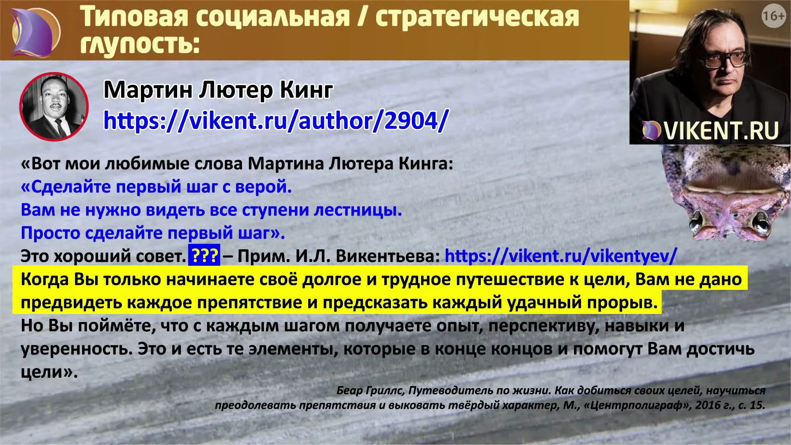

В мужском тоже вижу, но как бы женщин мне просто более жалко. Вот типовая глупость. Причём, как бы два человека уважаемых. Мартин Лютер Кинг сказал сначала глупость, а потом Биарх Грюус, очень популярный телеведущий, м телеведущий наврал, господи, сес говорил с с как ученицей телеведущей и нет перед обещанием у него есть шоу своё по Бяхгривыс, короче, да. Так вот, соответственно, когда мы делаем амбициозный проект, а не одноходовку, что у нас есть в холодильнике, то есть годится на ужин, то есть в каждой точке будет ветвление. Если таких шагов порядка десяти, то, соответственно, как бы в в каждой функции, в каждом шаге есть ветвление. Если, соответственно, нет наставника, который берёт за шкирку и недемократическим способом, без демократиев, соответственно, просто отсекает лишнее, то, соответственно, человек начинает нести бред десятилетиями. То есть я почти еженедельно вижу девушки на изложение, соответственно, когда любые достижения творческих личностей объедисняются исключительно детскими психотравмами. Соответственно, ну, любой психотерапевт скажет, что, ну, есть конечный список психотравм, конечный список. Психотравмы есть у очень многих детей, но не все стали творческими личностями. То есть такая нормальная психологическая глупость объяснять творчествоми психотравмами. Соответственно, скажем, другой миф. Есть масса людей, которые хвастаются, что они приехали в Питер на 2 дня и за оди день как бы оббежали весь армитаж. Но у них в голове образовалось трёхбуквенное слово, четырёхбуквенное слово фум. Четвёртое слово после м твёрдый знак, поэтому четыре знака фум. То есть вот, соответственно, типовой вопрос. Типовой вопрос в различных сообществах открытых и закрытых фокусников. Мне фокусы очень нравятся и так далее, и так далее. Вот это какому-нибудь пишет человек из какого-нибудь маленького городка, как освоить все фо Как освоить все фокусы. Причём там двух-трёх вопросов опытные фокусники выясняют, что у молодого человека нет денег, то есть оплатить обучение он не может, а вообще он просто с помощью каких-то простецких фоку фокусов хочет нравиться девушкам. Ну вот сравните две формулировки, как вообще освоить быстро и бесплатно все фокусы и как понравиться, как сказали бы математики, ограниченному множеству девушек, как бы вот желательно бесплатно с помощью каких-то простейших фокусов. Вот обратите внимание, никогда мужья не спрашивают, как понравиться жене с помощью фокусов. Такого вопроса сообщества фокусников не существует. Да. Ну вот. Такая стандартная болезнь коучей. Коучей. Мы будем ходить по ним ногами в конце января. То есть коучи это заслужили коучи, которые предлагают одну таблетку от всех болезней. Коучи предлагают клиенту, не то, что нужно клиенту, а то, что коуч умеет делать. Вот, соответственно, 3. 000 коучий, бизнес-консультантов, бизнес-тренеров из Москвы и Санкт-Петербурга, при мне, это очень важная оговорка, не смогли привести пример одной, ещё раз, одной решённой небанальной творческой задачи, как бы, и так далее, и так далее, и так далее. Вот поэтому обратите внимание, очень хорошо звучит Мартин Лютер Кинг. Биар Грис его как бы цитирует, но вообще-то такая типовая типовая глупость, которая просто отсекает вас от амбициозных достижений, хотя бы от уровня страны, хотя бы от успехов в областном городе, хотя бы от успехов. Давайте посмотрим дальше. Вот, посмотрите, пожалуйста, посмотрите, пожалуйста, некоторые примеры диалога Владимира Ильвича Ленина и Алексея Алексея Максимовича Гойкова.

---

## [00:42:30]

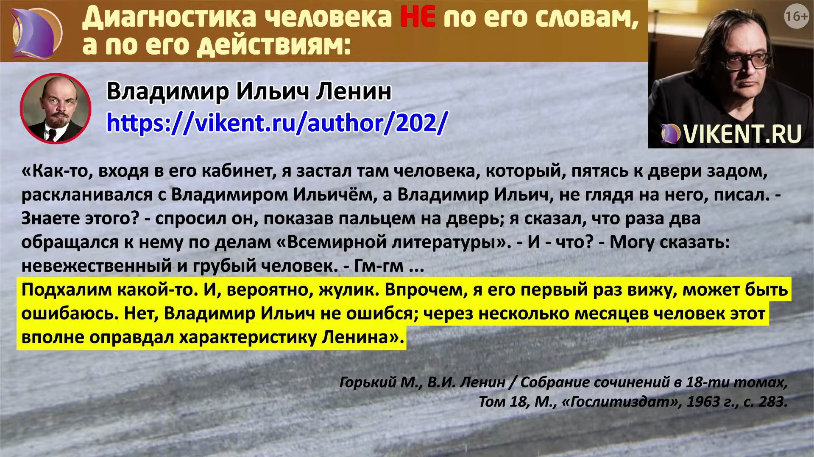

Соответственно, вот просто-напросто по человеку, по человеку. Вот, соответственно, опыт показывает, что человек свои ошибки воспроизводит. Вот. И есть некоторый миф. То есть меня постоянно спрашивают из слоя искажения, как можно выскочить самому? Как можно выскочить самому? Ну вот, к сожалению, к сожалению, выскочить самому, если там вляпался, ну, мягко говоря, это такая ненаучная фантазия. На основе чего, ещё раз, как минимум, у меня крупнейшая база данных в Европе по выдающимся личностям. Из этой базы следует, то есть это не мнение, это знание. Мнение и знания. различал Протагор за несколько сотен лет до нашей эры на всякий случай. В курсе философии, ну, философы плохо это понимают и плохо проходят, к сожалению, даже ведущих в вузах страны. Так вот, это вот были какие-то либо события, либо наставник. Ещё лучше, если наставники, то, соответственно, вот самому выскочить из костюли, к сожалению, есть некая такая наивная вещь, что вы послушаете часовую лекцию и сами выскочите из костылю. В амбициозных проектах нет. В ерундовых проектах самоназавись эксциальным коучем будет счастье. Ну, это дух, повторяю, это духь, как бы мой совет, как бы, ну, как бы, да, даже не так далее. Соответственно, давайте посмотрим дальше некоторую вещь, которую стоит скопировать фотографии экрана.

---

## [00:44:15]

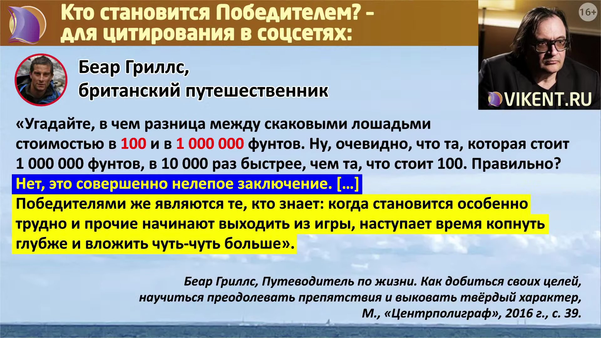

Кто нас цитирует в соцсетях, пожалуйста, вот сделайте принт скрин и поцитируйте в сетях. Некоторая вещь, её очень хорошо понимают бизнесмены. И кто попал в зону реальной конкуренции, кто попал на войну, где стреляют, и кто попал в зону не некой конкуренции, на которую принято жаловаться. То есть есть конкуренция, на которую принято жаловаться, а есть реальная конкуренция, когда просто-напросто у меня таких несколько случаев, несколько кейсов, когда просто-напросто просто собственники бизнеса переводят переводят бизнес в Китай или во Вьетнам, который развивается, кстати, ещё быстрее Китая. Вот как бы. А генеральный директор или что-то в этом роде остаётся как бы в Подмосковье как бы бывшим генеральным директором и своими понтами никому не нужен. Ну и так далее. Вот как бы, ну никто не берёт его в качестве генерального директора. Ну и так далее, и так далее, и так далее. Вот как бы, да. Так вот, обратите внимание, прошу цитировать в социальных сетях, да, можно несколько человек се цитировать. Очень важное наблюдение. Очень важное наблюдение. то, соответственно, в некоторые гонки и да не вот иногда не хватает там последней мили, последнего метра, последнего километра. То есть, то есть у вас может быть замечательный интернет, там неважно, неважно какой, но если там у вас провод, ну, допустим, проводной интернет, да, у вас последний метр, последнего метра нет, то не будет у вас интернета вообще никакого. Это очень такой важный показатель, которому, по идее, нужно учить детей. По идее, по идее Максим Васильевич Денисов записывает: "По идее возможен задачник". Соответственно, могу сразу сказать, что там будет в районе 40 номинаций, по которым можно конкурировать в интеллектуальном бизнесе. Почему я так говорю? Потому что я владелец крупнейший в мире. Мы проверяли базы данных по конкуренции. Кто владелец? Я владелец. базы данных, базы данных по конкуренции, крупнейший базы. Поэтому, грубо говоря, её, ну, как бы, ну, можно делать, можно делать некоторый продукт. Уровни этого продукта, ну, сначала надо делать на русском языке, потом на английском, потом на китайском, ну, и так далее. Вот как бы, то есть факторы конкуренции. Соответственно, краснорожие бизнесмены не всегда знают, что, соответственно, конкуренция не только денежная, то есть есть мимо, ещё раз повторяю, в районе со0ка, на самом деле ещё больше штук, которые и так далее. кого интересует очень глубоко, который хотел бы этим заняться, соответственно, задаёте мне вопрос либо ищете в наших видео как бы такое жёсткое по нервам видео про контринстинктивность. Выдающиеся люди уровень уровень Европы, уровень мира отличается от всех остальных куч тем, что они шли контринстинктивно. как бы вся остальная шуша шла по своим инстинктам, по своим мечталкам, хотелкам выражения Чернамы. А выдающиеся люди шли контринстинктивно. Повторяю, такой задачник, ну, по идее, он нужен стране. Он нужен стране под названием России либо любой другой стране, соответственно, уже несколько десятилетий, соответственно, сделать его как бы, ну, пока люди не в состоянии. Пока люди не в состоянии. Кто хочет, мы будем помогать при условии, что вы будете делать доклады на наших конференциях. На ближайший год запланировано семь бесплатных онлайн-конференций по воскресеньям. По по воскресеньям. Ну, далее начинаем умнить. Ещё умнить как бы усиление. Давайте дальше. Давайте дальше. Соответственно, вот есть новые исследоские темы. Обратите внимание на количество как бы номеров. Не в академиях наук их. Много академий наук в стране. Кого интересуют, гуглите.

---

## [00:48:30]

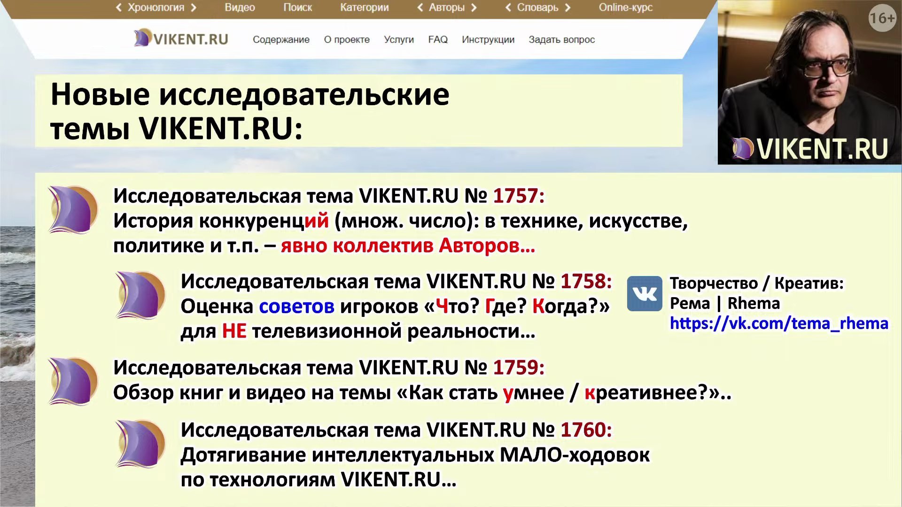

Вот, соответственно, и так далее. Вот обратите внимание, написали сбоку очень тесто. Есть блестящее сообщество ВКонтакте. Оно маленькое, оно есть на аутюбе и есть на Ютбе. На Ютбе более 10.000, что замечательное достижение для интеллектуального канала. Это там еженедельно идёт разбор глупостей. как правило, московско-питерских, в том числе академиков, докторов наук и так далее, и так далее. Вот, ну, отдельных попсовых персонажей, какой бред они несут по поводу творчества. Мой совет, мой совет слушать это может быть, да, иногда они вырезают, иногда целиком публикуют. Вот, соответственно, мой совет, как бы, кто впервые слышит о Реме, о реме, посмотрите, что означает слово Рема по-древнегречески. Значит, посмотрите ещё. Делаю не я, делают как бы коллеги делают коллеги. Очень хороший канал. Вконтакте он маленький, на Ютубе большой, есть копия в в на рутубе. Не помню сколько просто, ну, просто не помню. Ну, соответственно, чтобы просто отсекать, есть некоторые, вы понимаете, почему я, по крайней буду просить, как бы в наступающем году. Соответственно, мне подряд попалось несколько видео, где люди, играющие гдекогда, которые знает вся страна, как бы посчитали, что за пределами шоу они тоже могут что-то сказать там про ум, про мышление и так далее. Вот. Соответственно, я буду просить видеоканал Рему поставить игроков, что декогда, соответственно, которые пытались неоднократно консультировать. Я несколько раз работал после что, где, когда один после один там у разных заказчиков и могу рассказать много интересного. Ну, в принципе, достаточно того, что они говорят в прямом эфире. То есть повторяю, то есть когда шоу, я не комментирую, шоу состоялось, что, где, когда, ну и так далее. Вот хороший там праймтай размещается медиопоказатели, я говорю советую, что где, когда, когда касается там ума, инновации, там как прожить жизнь, ну и так далее, и так далее, и так далее, и так далее, и так далее, и так далее. Вот поэтому на Рему советую подписываться, да, ссылка на Рему будет в комментариях, которые я размещу, когда трансляция сформируется. То есть где-то вот 22230, наверное, да? Давайте идёмте дальше. То есть это первый слой был. Далее вы видите, она же консткамера, она какое-то время была, соответственно, академии наук.

---

## [00:51:15]

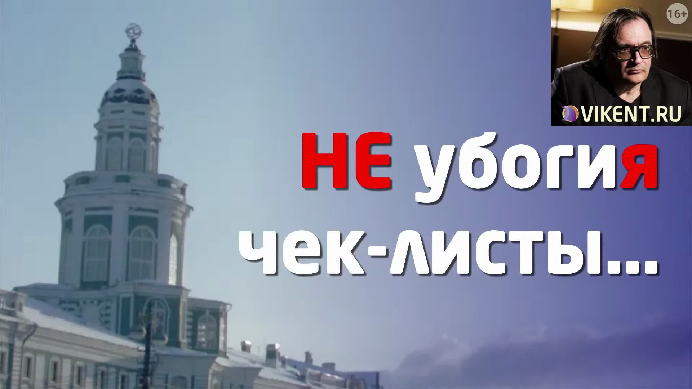

Там же помещались различные академические учреждения. Там же, как бы, там по соседству помещался ресторанчик Пригожина, Пригожина Покойного, старая таможня, ну, и так далее, и так далее, и так далее, и так далее. По соседству помещался, как бы, да, извините за личные ассоциации, как бы. Соответственно, вот надо сказать перед словом чек-листы или списки контрольных вопросов, что чек-листы либо списки контрольных вопросов, они не позволяют не позволяют что-либо создать. Как бы они закладывают некоторый такой твёрдый фундамент, то есть они отсекают типовые ошибки. Иногда, не будем скрывать, по ассоциации просто честно. Тут очень важный ресурс, честность. Один из очень сильных конкурентоспособных м ресурсов, которого мало кто знает в российском бизнесе и в российской поленике- это такая длительная честность. То есть человек, который честный на десятилетия - это очень такой сильный ресурс. Мало кто понимает, вообще мало кто это понимает. То есть я живьём, честно говоря, не помню, чтобы я такого человека встречал. То есть после объяснения иногда начинают понимать. Так вот, ну тем не менее очень важно, что чек-листы при честном их использовании, они расчищают, они делают здоровый фундамент. Иногда через ассоциации, через намёки, что-то ещё могут вызвать какие-то идеи, которые записываются на полях и которые стоит делать. Чек-лист - такая первая методическая форма, если вы избавились от слоя систематического искажения реальности. Частный случай избавления от слоя систематического искажения реальности. Ну хотя бы в рабочее время не врите себе. Ну хотя бы в рабочее время, хотя бы на заказе, но не выйти себе и клиентам. Ну хотя бы вот как бы хотя бы вообще желательно не врать, но это обычно не получается. Так, ну давайте посмотрим. Давайте посмотрим так далее. Вот. Здесь та же самая схема, она у нас будет тянуться везде. Жабён не влез. Значит, слева слева типовые ляпы по трём этапам.

---

## [00:53:30]

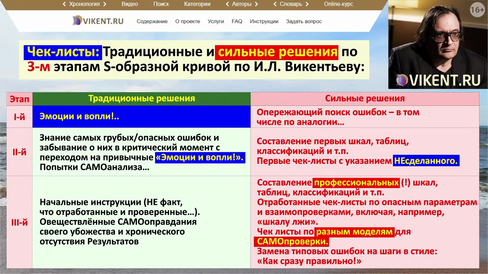

Очень грубо, в принципе, там как бы, ну, грубо по каждому. Это небольшая брошюулка или большая брошюулка бы, и так далее, и так далее, вот как бы, да. Соответственно, чрезвычайно важный сильный ход, когда начинается какое-то новое направление. вообще неважно какое. Соответственно, в своё время, кого интересует, спрашивайте, дам ссылочку. Как бы только начиналась реклама, постсоветская реклама в стране, мы вступили в элементы капитализма. Соответственно, понимая в чек чек-листах, я знал, я знал, что нужно просто-напросто трудолюбиво собирать. И мы сделали, мы сделали небольшой крохотный, крохотную такую штучку, [музыка] как бы типовые ошибки рекламщиков, рекламодателей. Мы их собрали, опубликовали. Вот и этот материал, ну, судя по заходу, в интернете всё очень точно, естественно, нас его массово воровали. Вот массово воровали и так далее, и так далее. Вот он отработал лет 20. Более того, до сих пор актуальным. То есть вот как бы всё, то есть есть такой как бы тызовский анекдот. Всё хорошо, как быть. Вот только-только ещё направление даже не сложилось. Значит, тем не менее, значит, самый умный уже собирает ошибки. Иногда возможен сбор ошибок по аналогии. По аналогии. как только у нас как бы на другом нашем ресурсе, не буду называть каком, соответственно, скажем, как бы был небольшой материал, как бы типовые ошибки там планирования, там рабочего дня. Соответственно, как только начинается конкуренция на каком-то рынке, мы видим как бы, что какой-то материал, в который не вложено ни копейки, то есть там 80 заходов как бы в день. Причём, как бы даже примерно понятно. кто заходит. То есть, то есть люди перестали заняться ерундой, как бы он правильно прописан, как бы при нулевых вложений. Ну а таких материалов у нас много, много. Поэтому ищите ошибки, даже если вам сдую кажется, что их нет, как бы и так далее, и так далее, и так далее. Вот. Далее, далее. Соответственно, даже если дальше если ничего нету, даже если ничего нету, очень важно составление первых шкал, таблиц, классификации и так далее. Вот. Да, они могут быть, да, они могут быть как бы с некоторыми дырками, дырками. В своё время, по-моему, у нас в чате сейчас есть человек, который это слышал своими ушами. Он может, это мужчина, да, он может дать знак. Ну, мне так кажется, что не хочет не мой давай знак. Соответственно, итак, в банковском институте на Невском проспекте в дубовом зале идёт очередная конференция бизнес-консультантов, коучей и так далее. Вот. И выступает моя ученица, руководитель, организатор всероссийского NLP, NLP движения, както так называется, фамилию не называю и так далее. Вот. и которая делала предыдущий доклад как бы год назад. И сейчас как бы она познала истину и говорит, вот что как бы говорит Викендв, который там успешно разрабатывает методики. Прежде чем писать про таймменеджмента, изучите то, что написано до меня. Ещё раз говорю, это уровень руководителя NLP, всероссийского, [музыка] не помню, как форума или что-то в этом роде, короче, а фестиваль NLP и так далее. Вот. То есть прежде чем писать, как бы нужно, оказывается, изучить прототипы, то есть прототипы, аналоги и так далее, и так далее, и так далее, и так далее, как бы, да. Вот обратите внимание, часто люди застревают на первом. рано или поздно, рано или поздно вот, соответственно, как бы появляются некоторые профессиональные критерии, профессиональные критерии и так далее. Вот. Периодически, как как бы на меня выходят люди наиболее часто, ну, сейчас как бы всё поотрезали, раньше было и в Фейсбуке, сейчас ВКонтакте и так далее. Вот на меня люди выходят и значит обычно это мужчины, женщина в этом отношении умнее. Я не сказал, что женщины всегда умнее мужчин. То есть есть ситуации, в которых женщины намного умнее мужчин. То есть первый контакт от женщины, как правило, гораздо умнее, чем это мужчины. Значит, дурак мужчина пишет мне вконтакте: "Игович, я занимаюсь тем же самым, чем и вы". Вот контрольный вопрос, который через минуту позволяет мужчину поставить на правильное место. Пожалуйста, не могли ли бы вы? Ну, два вопроса поведу. Ну, указать ваши достижения и вот количество учеников, с которыми вы постоянно работаете. Вот. Ну, мужчина начинает умнеть. То есть Игавич Викиненьев известен в узких кругах тем, что в его присутствии и женщины, и мужчины иногда умнее за одну-д минуты. Так капитально. Некоторые обижаются. Ну, дураков не жалко, как бы, а мы идём дальше. Соответственно, скажем, как бы вот, ну, там как бы можно почитать, можно спросить и так далее.

---

## [00:59:15]

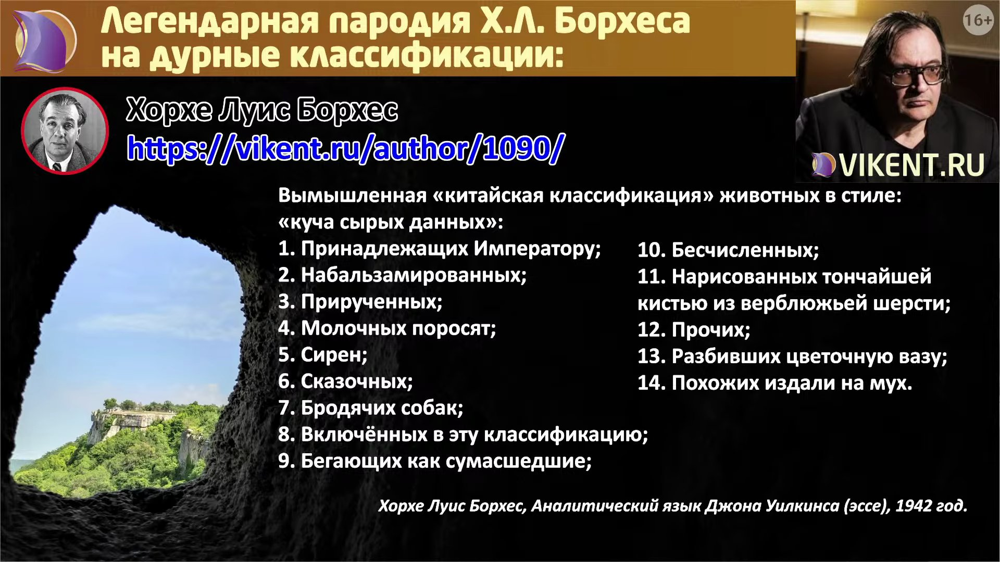

Вот вот с тем, чтобы разрядить вот это очень часто цитируемая, значит, цитируемая Борхиса штука. Ну, это такой стёп над такой стёп над китайской классификацией. Фотография Сергея Сергея Александровича Резникова. Обратите внимание, когда написано сорок второй год, то есть вы знаете, что было в России в сорок втором году. Обратите внимание, вот как бы вот так вот не надо составлять списки контрольных вопросов. Соответственно, у одного из моих клиентов, который проводит крупные конференции на Красной Пресне и рядом, питерская команда, ну, проводит крупные конференции, ещё раз, в Москве чек-лист, чек-лист около 900 вопросов для крупной конференции. Вот. И, соответственно, каждый пункт чек-листа отвечает два человека. Если они зивнули, соответственно, штраф, лишение премии и всё работает. Поэтому чек-лист хорошая штука, но нужно очень внимательно почитать, что там в правой графе. Если есть вопросы, спрашивайте до 10:00 утра в четверг, ну либо на двадцать первое. Если кто-то проснётся в июле 2026 года, как бы я возможно отвечу, а возможно нет. Возможно нет. К сожалению, к сожалению, умные пони дураки меня не интересуют и дую от слова вообще. Идёмте дальше. Вот посмотрите, пожалуйста, как бы некоторый такой антитес. Вот редкие люди. Ну, Станиславский мировая величина, который мог заниматься самосовершенствованием.

---

## [01:01:00]

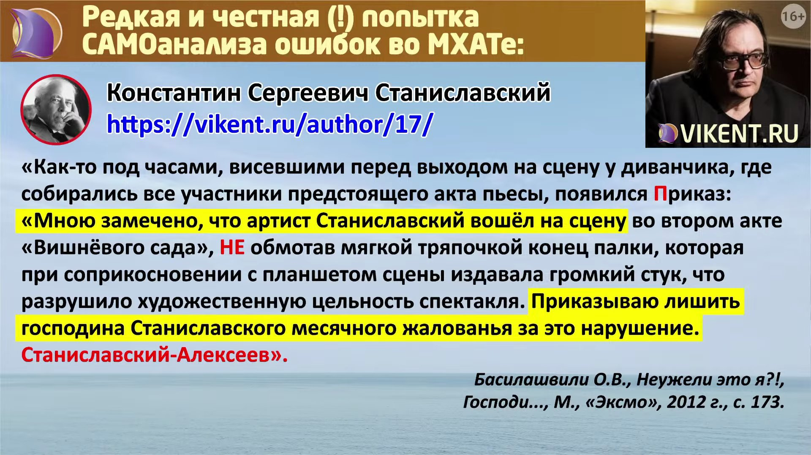

Вот Станиславский мог. Сейчас как бы масса людей, в том числе молодыми щенками, это воспринимается как анекдот. Нет, это очень редкий пример, когда без наставника и сам. Очень редкий пример, кто хочет, кто может. Ну, моя просьба, моя просьба, значит, цитировать в социальных сетях. Может быть, кто-нибудь из ваших друзей ещё и поумнеет. Может быть, как бы, да, может быть, есть такая надежда. Идёмте дальше, да, соответственно, да, ите дальше. Вот, соответственно, как бы некоторые темы по чек-листам. Соответственно, у нас есть несколько конференций, я их перечислю.

---

## [01:01:45]

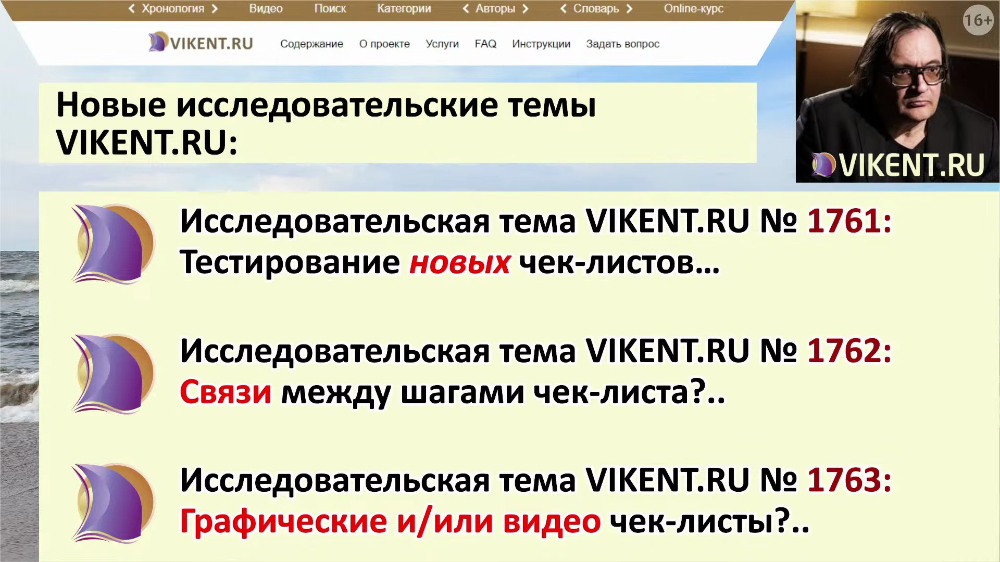

Это конфере из семи, которые запланированы на 2026 год. Это конференции Жексалыка. Это конференции Константина Сергеевича. Салыка Бержасаева, извините, Константина Сергеевича Калугина по аварии, Василия Василия Александровича Верщенко, как бы по клиенториентированности и достопоримечательности. Соответственно, вот как бы на разные конференции можно очень по-разному разворачивать. Кто хочет, ну, пожалуйста, выходите не на меня, не на меня. Я этими конференциями не руковожу. Я научный руководитель. Я помогаю, ну не более чем. Выходите на них и так далее. Вот, значит, как человек обязательный Василий Александрович Верченко, я прошу выйти на меня на этой неделе, значит, желательно он сделает подарок. То есть вот на конференции, не на конференции, на онлайн-консультации 21 декабря жест конкурсанция, он сделает м ну получит слайды отборные. Он сделает для вас бесплатный плакат, как не дурить, как не дурить и делать нормальные продукты, на которые коуч не в состоянии сделать, доктора наук тоже не в состоянии сделать, ну и так далее, и так далее, и так далее. Вот, соответственно, дальше следующий слайд. Кто хочет посмотреть долгоиграющие чек-листы кни вот на поле издаваемая, вот вы видите девятое издание, это стоит денег, где там в области маркетинга, рекламы, пиар есть ряд профессиональных отработанных чек-листов, чек-листов и так далее, и так далее.

---

## [01:03:15]

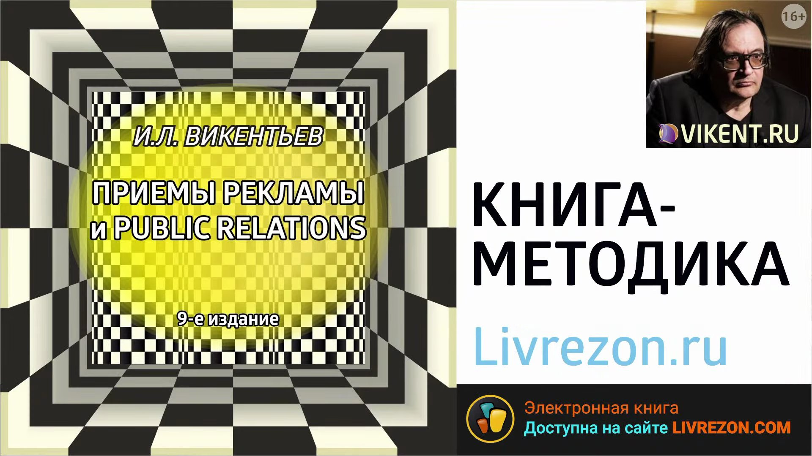

Периодически их подворовывать, естественно. Кто хочет профессионально, пожалуйста. Кто сходу не найдёт, пишите мне, я перешлю. в издатество вам, соответственно, то есть есть бумажные варианты, есть как бы онлайнварианты. Это можно скачать, можно посмотреть, как это делается [музыка] так далее. Вот как бы соответственно соответственно обсуждается обсуждается на этой неделе началось обсуждение м консультации консультации. Заговариваюсь, извините. Сегодня было много консультаций, поэтому простительно. Значит, обсуждается конференция по консалтингу, онлайн-конференция по консалтингу в 2027 году. Значит, руководитель конференции Сергей Александрович Александров. Значит, минимум 20 лет в консалтинге и так далее. Вот, соответственно, чек-листы могут перенестись и на двадцать седьмой год. Кто не найдёт Сергея Александровича, соответственно, ВКонтакте, пишите мне, что хочу участвовать в качестве участников, в качестве докладчика. Я просто перешлю. Дальше вы просто ставитесь на конвейеры, ну, как бы вам пишут, что делать, что не делать, ну, и так далее. У нас технологировано. Ну, давайте посмотрим роскошную фотографию. Сейчас будет роскошная фотография. Итак, вы видите, значит, работа с лучшими. Следующий этаж.

---

## [01:05:00]

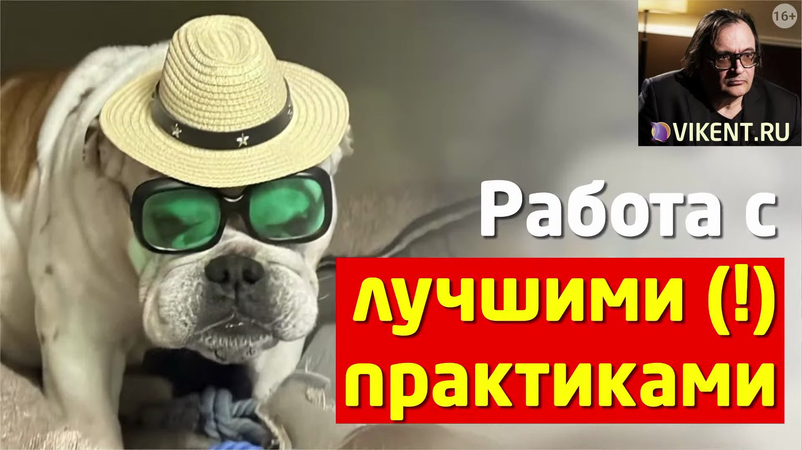

Следующий этаж матрицы Викинтьева. Значит, фотография большая умница. Английский бульдог Монти. Английский очень большой модник. Ему идут шляпы, галстуки, какие-то там рубашки, пиджаки. Ну я надеюсь, что ещё в этом году вы, значит, красавца Монти увидите. Он такой как бы интеллектуальный и такой коммуникабельный парень. То есть я надеюсь, что вы увидите. Новидя эту фотографию, то есть, ну, это абсолютно бесспорно, как бы поставил его вот на этот следующий этаж. Отсекли ошибки, переходим к вопросу не к практикам, а к лучшим практикам.

---

## [01:05:45]

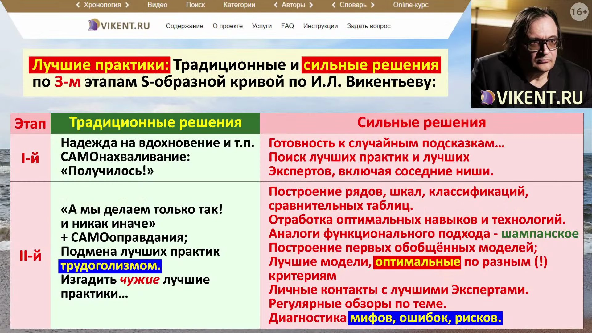

Некий секрет, я его рассказывал уже раз 20, но могут служить новички, поэтому кратко повторю. Практически на любой конференции, где поступают гуманитарии, гуманитария там типа доцента либо доктора наук заваливается одним вопросом. Не не двумя, как бы, а одним. Скажите, пожалуйста, то, что вот вы сейчас рассказывали, это оптимальный вариант или ваш личный опыт? Ну, как правило, гуманитарии не способны, в отличие от инженеров, физиков и так далее. Вот они рассказывают вопрос, как я делаю и так далее. Если это касается корма вашего пёсика, вашего кота и так далее. Вот я молчу. Я не являюсь специалистом ни по пёсикам, ни по котам. Я к ним очень хорошо отношусь, но не являюсь специалистом, да, тем более диетологом. Вот как бы пёсиков и котов. Вот, э, вот, ну, вот инженеры понимают, что, соответственно, неприлично рассказывают на конференции, как я делаю. Ну, нужно рассказывать в следующем залоге, в следующем ключе. Мы попробовали 20 способов и для решения задачи N. Вот это вот хорошо, а вот это вот нехорошо. Вот это вот хорошо, вот это вот нехорошо. То есть, соответственно, в своё время, скажем, Михаил Ильич Кошкин, Михаилович Кошкин, соответственно, конструктор та легендарного танка Т-34, соответственно, ему было спущено задание, в том числе от Сталина, то есть делать колёсный танк, вот которым сейчас занимаются французы, который очень шустро бегает по шоссе по дороге, учитывая, что как Кошкин, в отличие от Сталина понимал, что танк танки должны обрастать бронёй, пушка должна быть более мощной и так далее. Вот, соответственно, как бы он смог убедить, выбить деньги, убедить Сталина о том, что танки вообще нужно делать не колёсные, а гусеничные. Соответственно, некоторый вопрос, который не все знают, не все знают, даже оканчивавшие военную кафедру, что, соответственно, один из грехов Катюши и Катюшиобразных систем ракетных, как профессиональной ракетческой, я это должен знать, это является то, что при залпе, соответственно, шины, шины, соответственно, скажем, они лопаются. Поэтому есть такой термин, автомашина - это грузовик, как правило, вывешивается на домкратах. Это время, это минуты, даже если солдаты быстренько работают. Ну и, соответственно, Катюшу или какой-то там другой град можно зачисть, его можно раздолбать, раздолбать. Вот, соответственно, как бы нужны не просто практики, колёсный танк, а нужны лучшие практики. Соответственно, нужен Т-34. И напоминаю, что, соответственно, скажем, Т-34 за время войны получил 800, вы не ослышались, значит, получил в Челябинске на других заводах 800 усовершенствований. Поэтому смотрим правую колонку, левые типовые глупости, типовые глупости умных людей. Соответственно, ну, первое, если вы так внимательно о чём-то думаете, о чём-то думаете, то как бы это приобретает характер такого некого очага. Вот как бы называется Посмотрите, пожалуйста, уточняющие вопросы. Там есть ВКонтакте, там есть полезные ссылки, соответственно. То есть любой объект может быть подсказкой. То есть, соответственно, автобиографии поэтов, композиторов, учёных, танкостроителей, ракетостроителей набиты битком в случае, когда там падающий клиновый лист помогал сделать новую пушку. То есть любой объект может делать, ну, к этому нужно быть готовым, естественно, нигде этому не учится. Ну, и так далее, и так далее, и так далее, и так далее. Соответственно, кажем, да, соответственно, дальше вы видите некоторые сильные ходы, которые обычно не делают. Кто не делают? Умные люди, включая докторов наук, если будете внимательно изучать видеоканал и академики. Причём академики никаких-то подзаборных академий, нет больших академий. В России несколько академий и так далее, и так далее, и так далее. Вот как бы, да. Далее, человек, как правило, мало понимает, что, соответственно, предпоследняя строчка, соответственно, соответственно, м по любому направлению, совершенно неважно, чем вы занимаетесь. Вы занимаетесь там творческой деятельностью, вы занимаетесь парадигмами и так далее, и так далее. Вот в мире есть там первая тройка, первая пятёрка, ну и, ну и все остальные. Ну и все остальные, да. Соответственно, очень полезно иметь личные контакты с лучшими экспертами. Если у вас нормальный контакт, вы можете, в том числе, бесплатно, даже при плохом характере эксперта, получить некоторые идеи, которые будут кормить вас лет 20. У меня таких кейсов полно, соответственно, и есть там десятки людей, которые такие кейсы из своей жизни могут подтвердить, могут подтвердить и так далее, и так далее, и так далее, и так далее. Вот как бы, да, соответственно, как бы ээ то есть очень важны лучшие практики, некая штука, которая, скажем, мало известна и так далее. Вот. И, соответственно, отец Капицы, Пётр Леонидович Капица работал в атомном проекте. И, соответственно, человек был дерзкий. И, соответственно, у него было некий жизненный сценарий, блестящий для науки, для научного контекста, для научной картины мира. Он всё как бы любил делать сам. То есть, ну, грубо говоря, он любил изучать существующие теории и переделывать и всё делать сам. и, соответственно, стал припираться с Берией, потому что модель принятия решений у Берии была, что нужно, страна делает атомный проект, нужно очень сильно быстро украсть какое-то количество решений у американцев и нужно делать бомбу. Ну или ракету, нам бомбу не будем. Каписа всё привык делать сам и так далее. Вот. То есть в определённом смысле Бери ужасный человек. И, соответственно, он разругался с Берией, потому что Каписа всё хотел делать см. Но для страны это не оптимально. Для научной картины мира, значит, аплодисменты капец. И он организовал на даче избу физических проблем, где продолжил свои исследования, а из атомного проекта вышел. Курчатов был более сговорчивый. Курчатов понимал, что наш атомный проект и наши собственные исследования, соответственно, плюс воровство. Ну, через разведку, когда ворует разведка, это звучит даже благородно, так далее, и так далее, и так далее. Но это должны быть сразу же отсечения тупых ходов и так далее, и так далее, и так далее. Далее, обратите внимание, рано или поздно появляются лучшие практики и, допустим, малоизвестный факт, соответственно, на портале это есть, можете поизучать, сюда не влезано и так далее, и так далее. Вот, соответственно, где-то у нас выходили декабты на площадь, ну, чуть попозже этого времени в Пити там. Тут я, кстати, рядышком, недалеко от этой площади. А, соответственно, бельгиец. Он бельгиец. А доль в Китле. экономисты его знают. Он предложил впервые концепцию среднего человека. То есть обратите внимание, очень важный момент, который нужно проговаривать школьникам и студентам. Среднего человека не существует. Средний человек - это некая профессиональная модель, которая при расчёте некоторых потреблений, почему экономисты знают потребление там воздуха, воды, сиденье в маршрутке, сиденье в самолёте, о чём, естественно, даже не было, удобен. То есть средний человек некая простейшая профессиональная модель, его нет, но это очень профессиональная модель. Поэтому от первых практик, как бы, как у меня получилось, надо перескакивать на профессиональные модели. Соответственно, как бы у нас на встречах в питерском консалтинг клубе, который одно время у нас так расцветал, сейчас мы не проводим по ряду причин, вот, соответственно, у нас выступал очень интересный дедок. К сожалению, я, ну, наверное, мог бы найти его фамилию, ну, она ничего не скажет. И дедук саму попирался, значит. И, кстати, я как бы его очень уважаю, хотя как бы он был со мной не согласен и спорил. Вот почему я вожал дедка. Дедак дедок как бы умел расставлять бутылки в винных отделах как бы либо винных, ну, водочно водочных магазинах. Точка. Всё. И, соответственно, продажи поста от расстановки бутылок действительно росли. И, соответственно, дедок критиковал меня, что какие-то картотеки базы данных не нужны. Ну, естественно, он не понимал. Дедок отработал много лет в этом бизнесе. Действительно, он интуитивно знал, хотя он со мной спорил, что базы данных картотеки консультантам не нужны. Я его уважал, потому что к детку, прослышав про его успехе в водочном деле, винном деле, обращались, условно говоря, боколейщики, что тоже раставьте бутылки. Видите, за за что я уважал дедка, спорящего со мной. Правда, он не понимал, о чём он спорил. Другое дело, он отказывался. То есть он вот только по водке, только по водке и так далее. Вот. Ну, соответственно, вы понимаете, есть масса каких-то винноводочных людей, которые недавно я слышал диалог в соседнем магазине, что такая-то настойка не продаётся. И, соответственно, человек уговаривал всё равно как бы, ну, заведующую магазину взять ещё полщика этой настойки, хотя она не продаётся. Как бы я проходил мимо, просто часть диалога слышал и так далее. Так вот, есть масса молодых людей, котлу, в отличие этого детка, когда-то работали как бы агентами каких-то водочных и винных компаний, вот как бы, но они что-то сделаю. Ну, дедок всё делал интуитивно, но правильно и профессионально. При этом очень важный момент отказываться от непрофильных заказов, отпра от отказываться и так далее. Давайте посмотрим вдохновляющий пример. Вдохновляющий пример. Ой, извините, извините. Извините, это здесь нужно просто опять-таки сделать снимок экрана и спрашивать меня, что я тут имел в виду и прочее, прочее, прочее, прочее, прочее, прочее, прочее, прочее. Давайте дальше. Давайте дальше. Извините за ошибку. Извините за ошибку.

---

## [01:16:45]

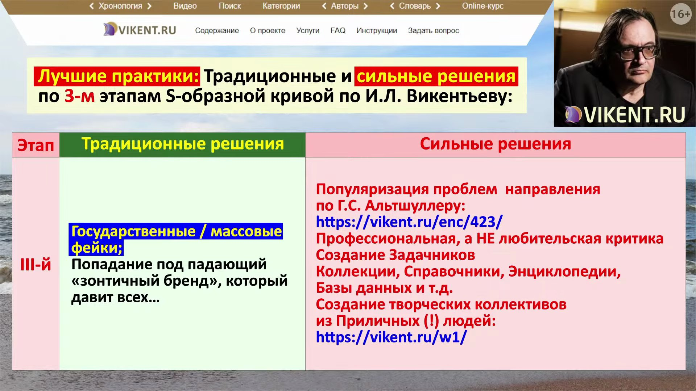

Что такое будешь делать? А, понял, просто я понял. Понял. Значит, значит, смотрите, значит, как бы мой совет - это короткие видео. У кого амбициозные планы создать продукт имени себя.

---

## [01:17:00]

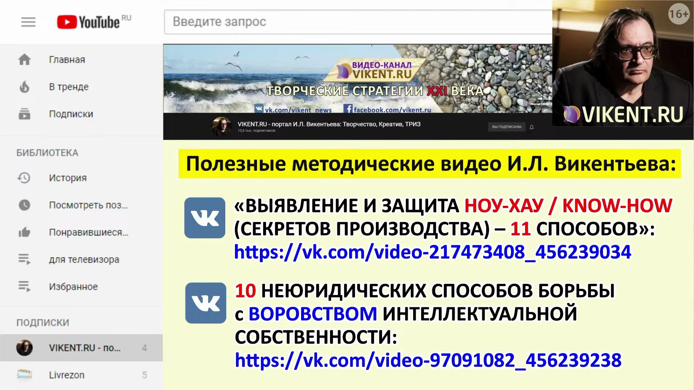

Вот первое первое первое видео, она открыто выложена. Знать близко к тексту конспект обязательный, как и второй. Как и второй. Это короткие видео, то есть это минут там какие-то минут по 20, по-моему, оно, ну, желательно, желательно так далее. Вот поэтому безумное количество еистов, которые предлагают написать положение о ноухау, вот вообще как защищать ноухау, они не знают, не знают, не знают, не они еисты, они могут написать положение о ноухау и так далее. Вот, соответственно, скажем, да, давайте дальше. Давайте дальше. Извините, снова сбивка. То есть что такое? Так вот, вдохновляющий пример, как вдохновляющий. Соответственно, Анна Каренина обычно это зевают. Вот обратите внимание, художник что-то калякал-малякал, вот, но не выбросил. Не выбросил. Вот обратите внимание, как говорил, ну, таких примеров очень большое количество.

---

## [01:18:00]

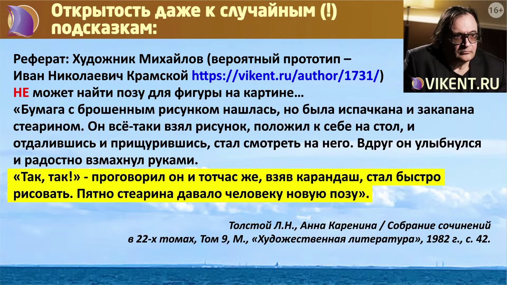

Леонардо да Винчи рекомендовал как бы смотреть на какие-то случайные пятна, разводы и как-то там их мысленно достраивать. Ну, для живописцев. для живописцев. Я думаю, что он был не первый, как бы, но это известно просто наиболее известный. Обратите внимание, художник заряжен на совершенствование, и даже какие-то пятна, какие-то пятна, то есть какая-то ерунда внешне, внешне, то есть внешне никак логически логически не относится к тому, что он делает. Логически. Ну, соответственно, мозг работает несколько более сложно, чем, соответственно, представляла себя правоверная логика Аристотеля. И, соответственно, скажем, вот сработала. Соответственно, есть хорошее видео Ксении Александровно Калугиной. Здесь просто не поместилось, как бы, и так далее. Вот. Ну, просто не поместилось по использованию случайности в творчестве. Кому актуально, опять-таки, напишите вопрос. Либо прошу Ксению Александровну, когда как бы просто разместить ссылку на это видео, желательно на ссылку, если есть, я уже не помню, ВКонтакте ваше видео, не только на Ютубе, как использовать случайность. То есть к случайностям нужно быть готовым. То есть случайности, соответственно, скажем, могут быть, как бы могут быть всегда. Ну давайте посмотрим ещё несколько примеров и так далее, и так далее, и так далее. Вот как бы, да, вот обратите внимание, обратите внимание как бы в узком контексте, в узком контексте како Шанель, како Шанель вот вот она вот так вот творила. Вот так вот творила.

---

## [01:19:45]

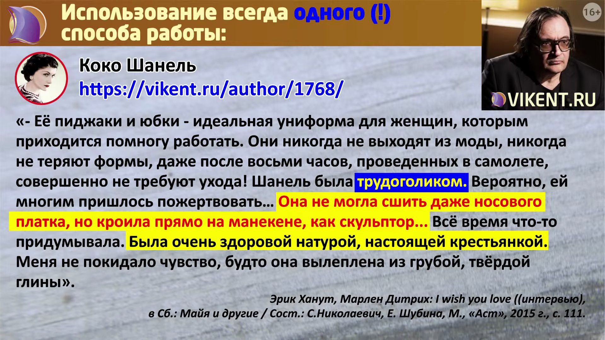

Вот она нашла способ. Она нашла способ, какой Шанель, безусловно молодец. Безусловно, молодец. Она нашла некоторый способ. Если бы она попалась бы на конференцию Викинва, даже кокошнель была бы спрошена. А вот вообще всегда, всегда надо вот так вот делать. Всегда вот как бы когда у вас единичные заказчицы, да, очень богатые, очень известные, да, вот, ну, а в других случаях, в других контекстах, других картинах мира, ну, и так далее, и так далее, и так далее. Вот специально выдающийся пример. Давайте следующий пример. Следующий пример. На ту же тему. На ту же тему. Соответственно, обратите внимание, что-то сделано хорошо. У нас есть практикующие консультанты в чате. Что-то будет обязательно изгажено.

---

## [01:20:45]

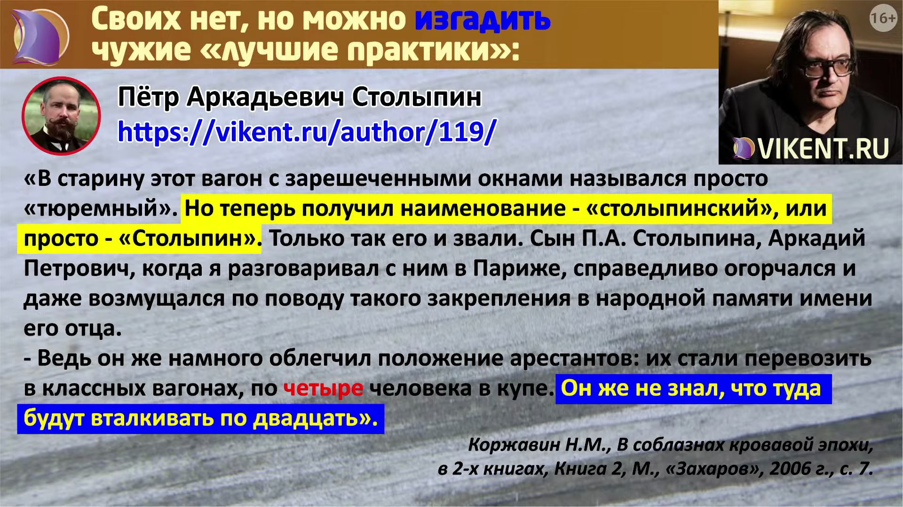

Вот, соответственно, мало кто знает, мало кто знает, что, соответственно, как бы столы как бы это не такая живопырка, куда набивают людей. там в четыре слоя. Соответственно, это очень удобные, очень комфортные вагоны для уголов уголовников и политических. Очень удобные, как бы всё хорошее рано или поздно будет изгажено. И поэтому, если у нас амбициозные планы, к сожалению, это не профильные затраты там нервов, сил, егоистов. Ну, приходится этим заниматься. Приходится этим заниматься, к сожалению. К сожалению, к сожалению, к сожалению. Далее, давай далее. Соответственно, как бы посмотрите, пожалуйста, посмотрите, пожалуйста, малоизвестный пример. Малоизвестный пример. У нас такое делалось немножко раньше. Вот Аракчеев у нас этим занимался, в частности Аракчеев.

---

## [01:21:45]

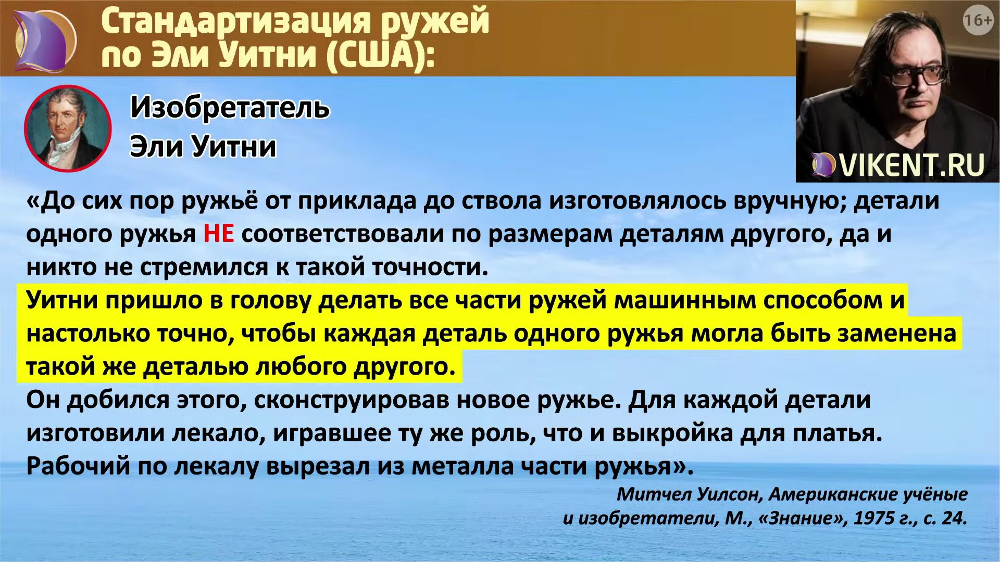

Вот, соответственно, в США молодая страна. Ну вот этим тоже занимались. Вот. Да, книжка вот эта вот м американские учёные, изобретатели рекомендуют консультантам. Рекомендуют консультантам. Неважно в области техники, чего-то ещё. Вот книжка, да, обществознания. Ну тогда знания иногда выпускало пыличные книжки. Сейчас то, что делают с знанием, мягко говоря, не всегда интеллектуально прилично. Не всегда интеллектуально прилично. То есть вот они мне прислали, что я их лекто. Я попросил себя вычеркнуть как бы из числа лекторов знания. Надо сказать, что они исполнили. Исполнили. То есть я горжусь тем, что не являюсь не являюсь лектором современного общества знания. Дальше начала.

---

## [01:23:00]

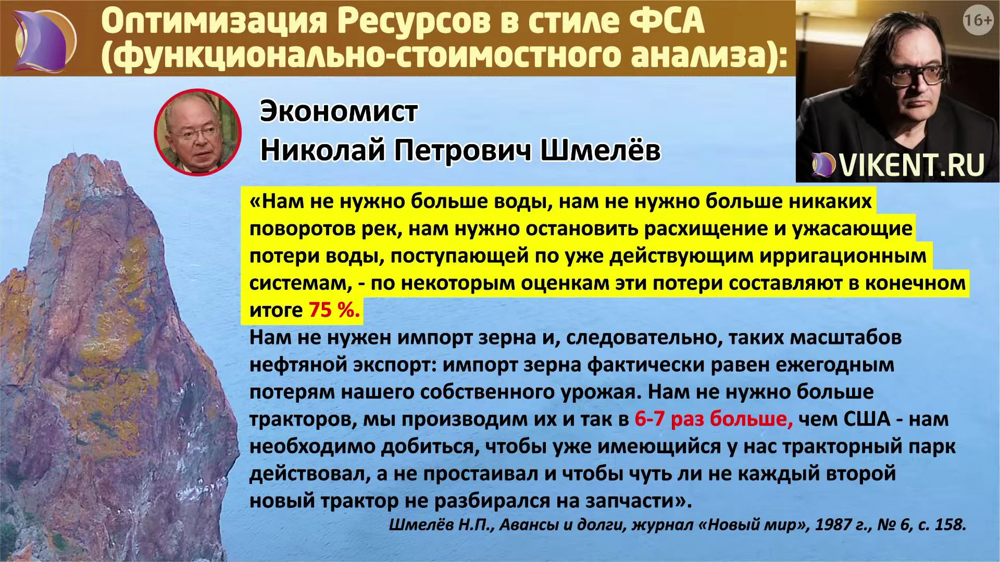

У нас будет хорошая конференция в августе двадцать шестого года. Извините, ну никак. Жигслыка Бегжасарова. Так вот, обратите внимание, там будет множество примеров, как надо просто-напросто с помощью функционально стремостного анализа, с помощью бережливого производства просто-напросто оптимизировать. То есть рано или поздно, ну, лучше, чтобы вы сами не найдётесь вы, найдутся конкуренты, которые вас оптимизируют. Которые вас оптимизируют, потому что есть очень очень простой принцип. Поэтому сразу говорю, оптимизация в бизнесе минимум несколько десятков параметров минимум. Вот поэтому об этом стоит размышлять, об этом стоит делать доклады, которые уже, значит, планируются на 2027 год. Извините, я буду кать сейчас бесконечно, то есть, извините. Идёмте дальше. Вот что значит поставленная технология.

---

## [01:24:15]

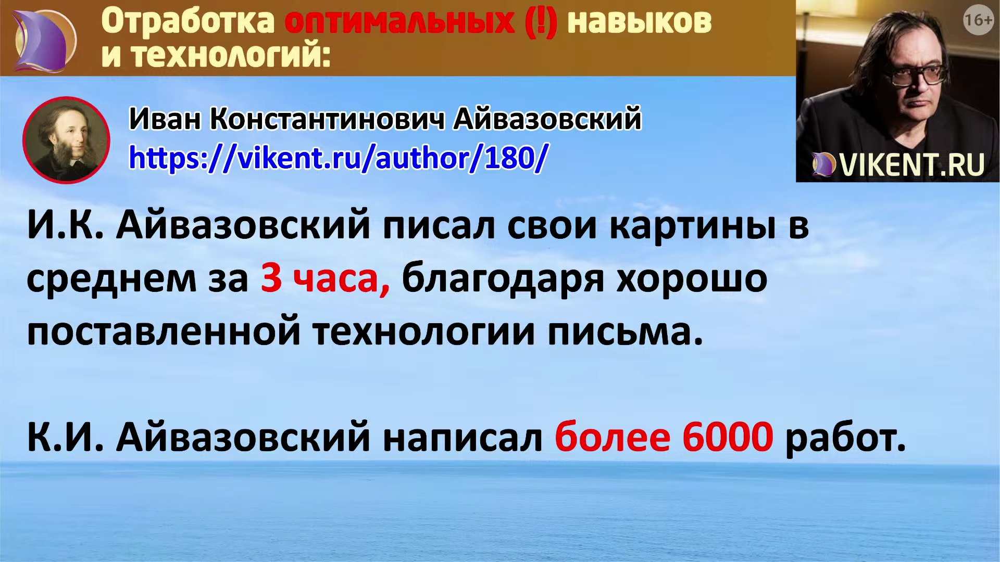

Соответственно, кто был Феодосии, знает, что как бы там есть музей Авазовского, что на деньга Эвазовского было проложено, в том числе на деньги, всего лишь железная дорога. Железная дорога. Вот что значит поставленная технология. Одна из мыслей, которая будет проходить через, соответственно, конференцию Ксения Александровны Калугиной в конце января, да, бесплатная, первая бесплатная онлайн-конференция по навыкам, метанавыкам и так далее. Вот как бы о том, что вот сначала делаются навыки, как бы работает сам человек, потом потихонечку это переводится в технологию. Значит, как это там делать более внимательно, более детально. Ну, регистрируйтесь, регистрируйтесь. Ну, заказчиков мы уже вряд ли возьмём и прочее. Теперь давайте посмотрим противоположный пример, малоизвестный в России. Малоизвестный в России.

---

## [01:25:15]

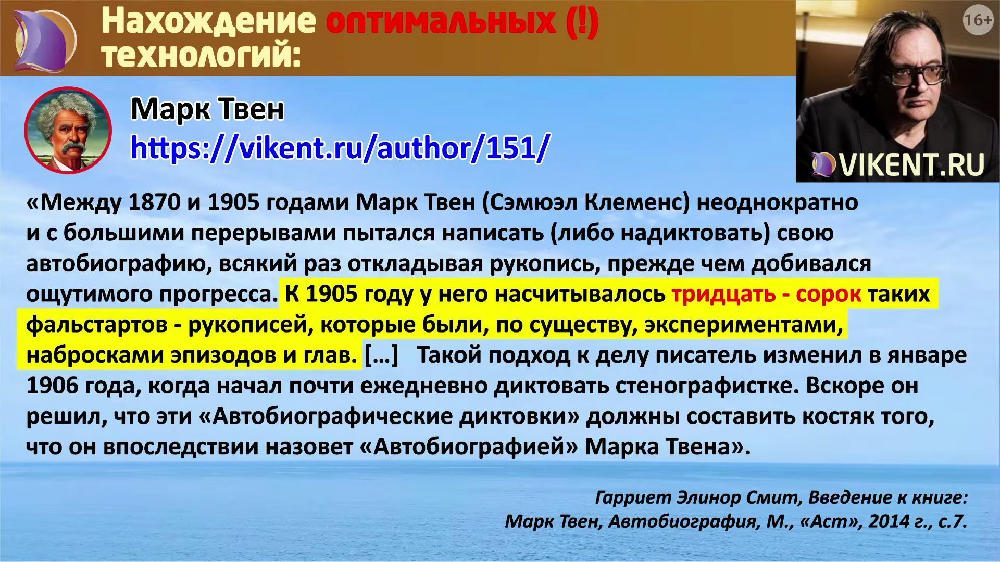

Так вот, посмотрите, пожалуйста, как бы как бы пишет биограф Марка Твена, что, соответственно, у Марка Твена было несколько десятков попыток начать писать стенографию, биографию, извините за оговорку, сейчас поймёте, почему она была. Соответственно, есть российский пример, но он более зацитированный, как бы Анна Григорьевна Сниткина, вторая жена, соответственно, Фёдора Михайловича Достоевского, которая позволила ему там закрывать долги братца и как бы стенографистка, потому что она стенографистская, ну, и так далее, и так далее, и так далее. Вот как бы, да. Соответственно, обратите внимание, вот как бы без хорошей технологии, вот 30-40 пустых попыток, наконец сложилась технология, и Марк Твин оставил свою автобиографию. Она, кстати, небольшая. Ничего там такого особенного нет. Но самое интересное, на мой взгляд, вот вот вот эта вот фраза, которую вы сейчас вижите на слайде. Кто хочет как бы посвятить своих друзей там ВКонтакте, иных социальных сетях, ну, милости повы шанс некоторые поумнить и попасть на конференцию Осанной Колугины. Сенисаны Колугины. Соответственно, идёмте дальше, да? Следующий слой. То есть мы только что прош мы прошли, мы вылезли из слоя систематического искажения реальности. Далее чек-листы. начинаем отсекать ошибки у в том числе умных людей. Далее лучшие практики, которые оптимизируются по нескольким десяткам параметров минимум.

---

## [01:26:45]

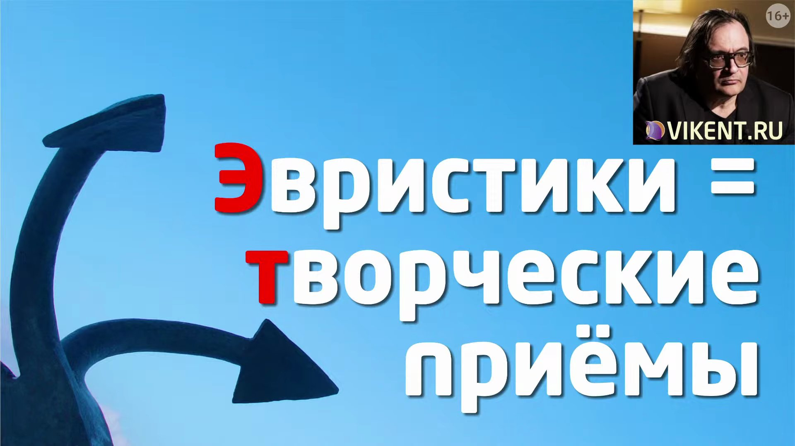

Далее мы видим некоторые якоры. Питерсы могут попытаться вспомнить, где это, это моя фотография, где это я такое нашёл, где это я такое нашёл в Питере. А вот в Питер, ну, это так просто для развлечения, да? Соответственно, дальше начинаются эвоистики, творческие приёмы. Опыт показал, что масса пофису не в состоянии предложить хотя бы одну эвоистику, творческий приём. Это одна эстика, ну, и так далее, и так далее. Вот. Соответственно, в XX веке было несколько человек, то есть Станиславский и Альшуле, которые просто-напросто предлагали эвоистики десятками и сотнями. десятками и сотнями, да?

---

## [01:27:30]

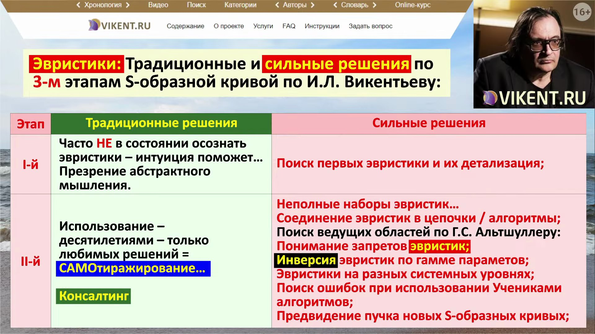

Соответственно, когда делается не какая-то экспертная система, название может быть другая: хорошая база решений, база данных, база знаний и так далее. Вот эистик должно быть. Почему так вы говорите, Гляч? Ну потому что я это проверил экспериментально. Несколько сотен. Ну тогда примерно 70% 70%, соответственно, просто некого поискового пространства просто-напросто перекрывается, соответственно просто-напросто, как бы такого и нет. Ну потихонечку такое, я надеюсь, будет разработано. Вот у нас такие вот такие вот проблемы в коллективе. Если написана нормальна база, если нормально описана экспертная система, то, соответственно, вы получаете ответ через несколько секунд. Я не оговорился. Если нормально составлена база, вы получаете ответ через несколько секунд. Секунд. Соответственно, кто хочет, ну, ищите мои мои сообщения, мои доклады по экспертным системам нашего производства и так далее, и так далее, и так далее. Отдельный пункт. Отдельный пункт инверсия. Инверсия рано. У нас есть ряд докладов Кирилла Сергеевича Гудович помянутый высшей Ксении Александровно Калугиной. То есть как бы вот обязательно возникает инверсия. Она теоретически возникает на втором этапе может возникнуть. К третьему этапе она возникает обязательно. Обязательно. Обязательно. Соответственно, как бы инверция - это как бы сделать наоборот, то, соответственно, сейчас масса людей думают, вот надо как воспитывать девушку и так далее, вот чтобы там была вменяемая, что-то ещё вежливая, воспитанная и так далее. Вот. Но, соответственно, когда все начинают заниматься воспитанием девушек, рано или поздно, значит, возникает инверсия: "А как девушка хамит в трамвае, неважно, пьяному, хулиганом или так далее. Вот вот воспитанная девушка и девушка, умеющая произвольно хомить, это как бы, ну, два разных продукта. Ну вот в чём как бы, как сказали бы некоторые люди, цимис. Ну, нужно одновременно видеть то и другое, то и другое. Если что-то справа непонятно, спрашивайте. Для этого существуют вопросы до четверга, и для этого существует двадцать первое, соответственно, декабря. В чём разница? Ну, до четверга я буду давать более краткие ответы, а, соответственно, что-то останется непонятным 21 декабря. Ну, буду отвечать подробно. То есть долгов по вопросам на следующий год у меня правило, этическое моё правило не переносить. Соответственно, скажем, давайте посмотрим дальше. Посмотрим дальше. Вот здесь вот надо поверить, что приличные системы сотен и сотен эвыстик, сотен эвыстик, они просто за секунды, я понимаю, что для коучей как бы это просто напросто они все ночью спать не будут. Они перекрывают порядка 70% задач за секунды. Ещё раз, такие системы есть, я их показывал.

---

## [01:30:45]

Если очень-очень нажно, можно показать в прямом эфире. В прямом эфире, как это работает. Ну и так далее. как система умнее как бы задачедателя, руководителя компании, ну и так далее, и так далее, и так далее. Вот. Ну вот просто справа сильные ходы, сильные решения, которые я вам желаю делать. Ну слабенькие ходы я вам не советую делать. Давайте посмотрим некоторый вдохновляющий пример.

---

## [01:31:30]

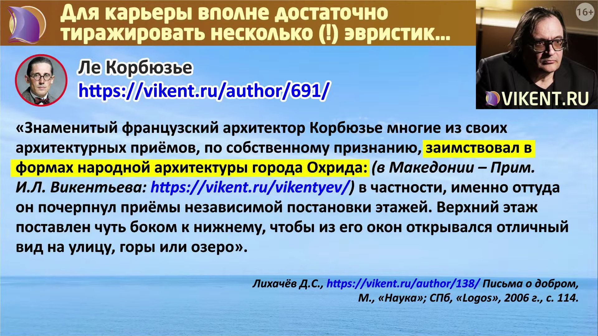

Он на два случая с одной ситуации, как, допустим, выдающиеся люди, ну, один из отцов архитектуры XX века, лекарбюзьер, как бы, кто хочет, набирайте посылки, кому не нравится портал, ищите в интернетах. Вот. И другой человек Лихачёв Дмитрий Сергеевич, который описывает: "Оратите внимание, какой-то городишко в Македонии. городишка Македонии. Вот как бы и, соответственно, скажем, он вдохновлял. То есть любая случайность, там полетевшая муха, что-то ещё, что-то ещё даёт подсказку, если вы, ну, о чём-то думаете, вот о чём-то думаете, о чём-то думаете, ну, желательно, чтобы это было бы хотя бы иногда связано с вашим делом. Далее посмотрим более сложный пример. Далее посмотрим. Итак, мой совет. Мой совет вот как бы это не всегда простые тексты. Если вы консультант и как бы хотите работать на международным уровнем, можно читать Альфреда Гайвича Шнитки, композитора.

---

## [01:32:30]

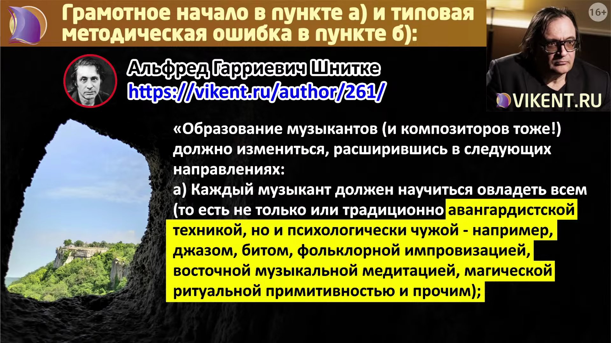

Ну то, что вы найдёте, то, что вы найдёте, он некоторые вещи понимал очень глубоко, очень глубоко. Он человек много писал, хотя писал, имеется не только музыку, но и некоторые такие наблюдения. Соответственно, обратите внимание, как в одном, буквально в двух соседних абзацах, вот как бы здесь как бы он говорит о том, что, ну, по идее профессиональный музыкант, профессиональный музыкант он должен, ну, работать в различных жанрах. Ну, то же самое, если ещё профессиональный консультант, он консультирует не только по расстановке водки и вин, как бы в Питере, как бы, то есть он тоже, ну, по идее нужно, ну, Питер большой город, то есть человеку старенькому, а ещё я почему его уважал, вспомнил. Он старенький был, он уже был на пенсии, он так подрабатывал, вот почему, как бы, и со мной спорил. Молодец старичок. Думаю, что сейчас он уже ушёл, ушёл в мир иной. Ну, извините, я отвлёкся. Так вот, соответственно, скажем, по идее, по идее, ну, композиты, работающие, особенно на заказ, что может по, соответственно, очередному понадобиться театру, музыкальные комедии, но явно будет смесь жанров, нужно работать и там, и там, и прочее, прочее, прочее, прочее, прочее, прочее, прочее, прочее. Но далее, далее, как бы, не имея решения, не имея решения, шнитки делают такую типовую ошибку. Давайте посмотрим следующий кадр. Очень похожи следующий кадры. тоже ш нитки. А вот здесь он лепит фигню. Вот здесь он лепит фигню. То есть как бы лепит фигню. Кого интересует, почему фигню, ну, спрашивайте. Я буду просить учеников, учеников, опытных учеников ответить вам, почему шнитки лепят фигню.

---

## [01:34:15]

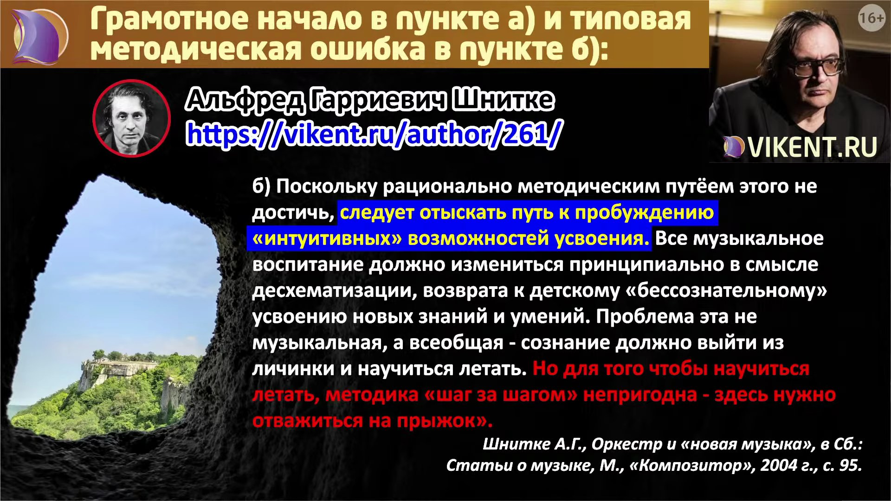

Ну вот, обратите внимание, такие вещи тоже надо сечь. Такие вещи тоже нужно сесть. Ну давайте посмотрим полезные видео для создания новых продуктов. Вот, соответственно, вот приличные методические системы двадцатого дцать первого века от 300 и выстик.

---

## [01:34:45]

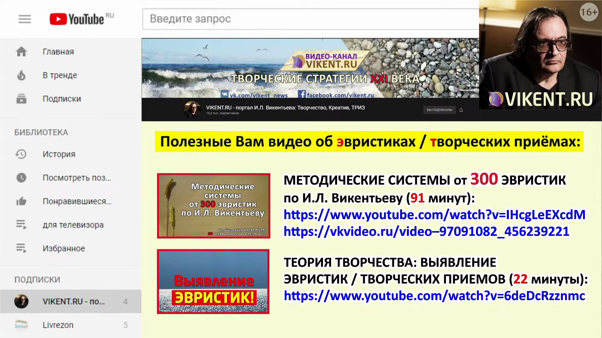

При этом, допустим, профессура, как правило, не способна создать, выявить одну эвостику. Я очень хорошо понимаю, постоянно работал с профессурой, соответственно, что я сказал, я очень хорошо понимаю. Вот. И так далее, и так далее, и так далее. кто хочет делать это, это продукты выше уровня страны, но опять-таки конспект знать близко к тексту. Конспект знать близко к тексту. Не все видео перенесены в контакт. Ну как-то, ну есть на так далее. Далее мы вторгаемся в такую более головоломную штуку, которую, ну тоже надо знать. Тоже надо знать, но это она будет сложная. Давайте посмотрим следующий этаж и так далее. Вот как бы, да. Да, вот вот запреты и ограничения. Фотография Александра Олеговича Романова. Стенка в каком-то кафе, пока он ждал заказа, по его собственным уверениям. Так вот, сначала некая бачка, чтобы вам было, соответственно, как бы некоторые такой тест, хороший тест, как бы хороший профессионал, консультант, интеллектуал, креатор.

---

## [01:35:45]

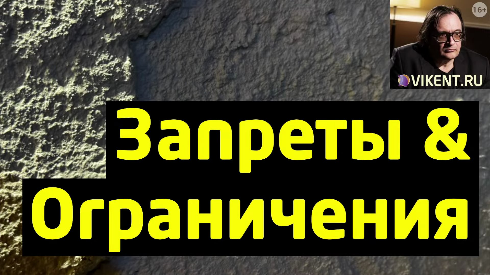

Ну, в общем, а таких примерно 1%, не больше. Хорошо врубается, что есть запрет и ограничения. Молодой щенок, который считает, что он сядеет на пуфик такими же щенками и будет как-то генерить какие-то идеи, и это будет коллаборация, он даже не понимает, о чём, как бы, я сейчас буду говорить, как бы. Поэтому, кто не хочет быть щенком, слушайте внимательно. Так вот, соответственно, с появлением телевизора виды спорта, значит, очень простолись в зрелищные и незрелищные. То есть некоторые виды спорта, они имеют место быть, но на них телевизору не заработать, потому что, ну, не разместить рекламу. Вот, соответственно, и даже некоторые виды спорта немножко изменились. То есть, соответственно, для большого тенниса обычно сделали мячик, он раньше был беленький, а сейчас стал жёлтенький, потому что через аппаратуру, телеаппаратуру, жёлтенький мячик для большого тенниса лучше виден. Лучше виден. Вот, обратите внимание, что в любой области рано или поздно неважно кто, профессор, молодой щенок наталкивается некоторые на запреты и ограничения, и с ними придётся работать. То есть запреты и ограничения не спрашивают, хотите вы с ними работать, не хотите. Они будут. Они будут. Давайте потихонечку посмотрим. Здесь просто здесь начинается экзотика и так далее. Вот, соответственно, как бы справа не в лес жабён, просто-напросто типовые глупости и так далее, и так далее, и так далее. Вот как бы и далее вот как бы, да.

---

## [01:37:30]

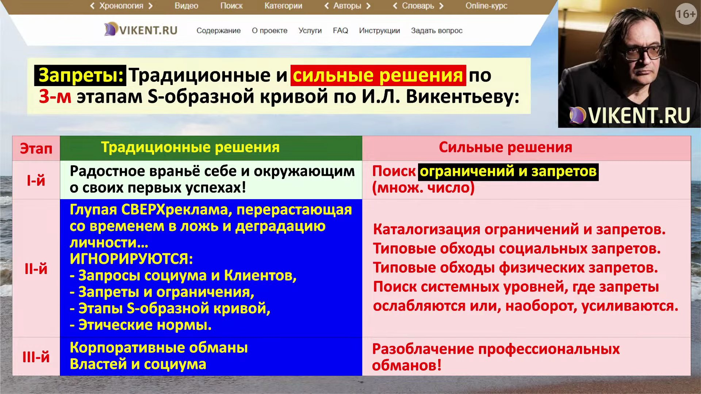

Соответственно, вот, как правило, нет типовой каталогизации. У меня, например, она есть, и она, мягко говоря, довольно большая, как бы, когда просто-напросто на какую-то ситуацию накладываешь типовые запреты, и из этого очень многое вылезают. Чрезвычайно, соответственно, скажем, важный момент, чрезвычайно важный момент, что запрытые бывают двух, ну, на самом деле больше видов, но я обычно рассказываю публично только о двух видах. первые какие-то физические запреты. То есть вот природа так устроена, что как бы вот вот вот вот вот так она работает, короче, как бы вот вот так она работает, что и прочее, да. Вот и есть некоторые такие вот запреты социально-психологические. Это может быть запреты какие-то психотравмы отдельного человека. В принципе, это можно снять либо какие-то временные социальные запреты. Допустим, что считалось, что неприличным, допустим, в X- X веке, если просто из подженского платья там видна женская щиководка, то есть это неприлично, это неприлично и так далее, и так далее, и тогда. Ну, про мини-юбки тогда как бы не говорилось. Так вот, соответственно, обратите внимание, как бы вот есть управляемые запреты. Сейчас периодически какой-то журналист, значит, как вещает по федеральным каналам, то ли я так включи мне так включаю телевизор, то ли мне так попадается. Соответственно, периодически человек, как последний секрет, рассказывает, что есть какие-то корпоративные сговоры крупнейших компаний, крупнейших производителей, что они намеренно делают автомобили с тем, чтобы как бы через несколько лет там автомобиль планово проживел. Ну и человек вынужден покупать новую марку. Ну, кроме того, в Америке есть культ, особенно на такие вот легковые автомобили, что автомобиль нужно менять, часто менять культ. Ну, просто и проживел, и менять надо. То же самое с компьютерами, ноутбуками, айфонами, лампочками. Такое плановое как бы такое ускоренное старение, то есть старение. Но нужно знать, что есть ещё и управляемые запреты. И, соответственно, крупнейшие корпорации мира на этом делают крупный бизнес. Крупный бизнес и так далее. Вот поэтому, соответственно, для консультанта, человека, работающего в области творчества и так далее, вот, к сожалению, нужно понимать, что существуют запреты, и вам придётся с ними жить. Придётся с ними жить, как бы, да, если вы этого не хотите, даже если вы этого не хотите, да, и так далее, и так далее, и так далее. Вот как бы, да. Ну, давайте посмотрим некоторые примерчик. Он смешной такой. Смешной. Значит, пьец как бы я не знаю примеры выдуманный, не выдуманный. Книжка вот эта вот очень слабенькая, новая московская философия очень слабая. Он как бы сейчас литераты пьесах как бы, а до этого, значит, был как бы школьным учителем.

---

## [01:40:45]

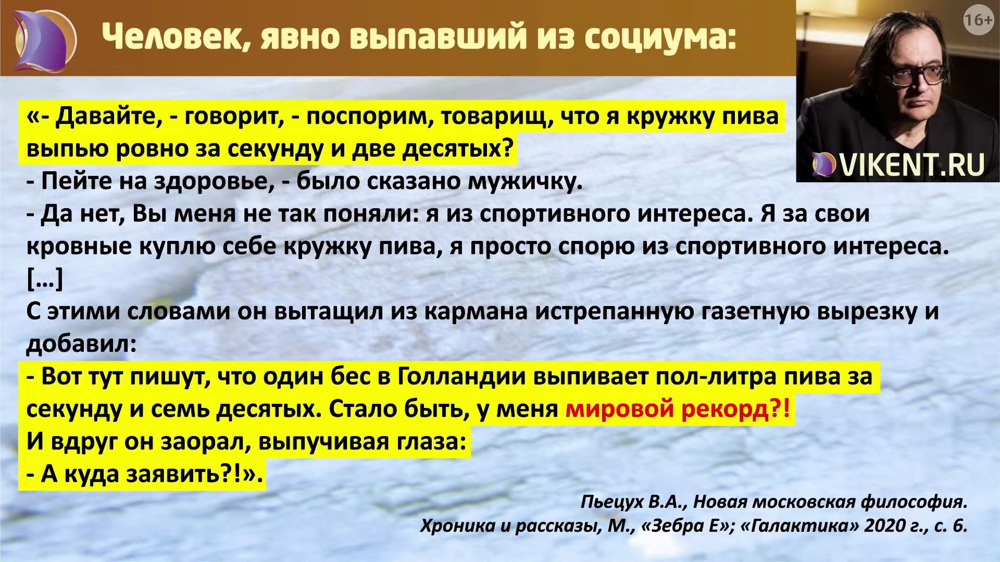

В данном случае он описывает такую очень точную сценку. Неважно, она выдуманная, не выдуманная. Вот есть некий человек, ну, типа около пивного лока. типа, типа у пивного лорка, что-то в этом и роде. И вы видите его печаль. Человеку какая-то вошла идея, что, соответственно, если он быстро пьёт пиво, то это как бы, ну, мир должен быть с этим ознакомлен. Вот женщины умнее, женщины обычно такие вещи, ну, интеллектуалок такие вещи обычно не интересуют. Интеллектуалок вот блогер интересует, а интеллектуалок нет. Как бы будем уважать интеллектуалок, правда? Ксения Алесан, да, как бы Ксения Алеса говорит правда, как бы, да? Ну, давайте дальше, соответственно, как бы, да, пожалуйста, пожалуйста, некая диагностика, некая диагностика, то есть какие внутренние сценарии творческой личности по нарушению ею творческой личностью этических норм. Этических норм.

---

## [01:41:45]

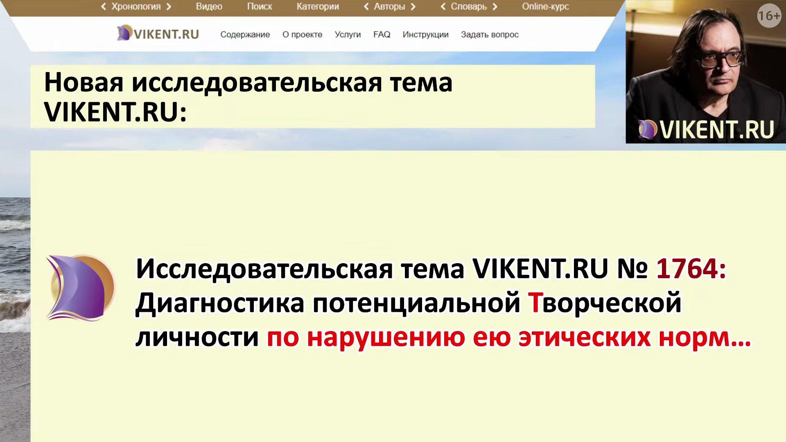

Ну, идёмте дальше. Дальше начинается интеллектуальный слалом. Он не для всех. фотография Алексея Исанча Морозова в Екатеринбурге. В Екатеринбурге такая как бы восхождение. Понятно, что это идея восхождения.

---

## [01:42:00]

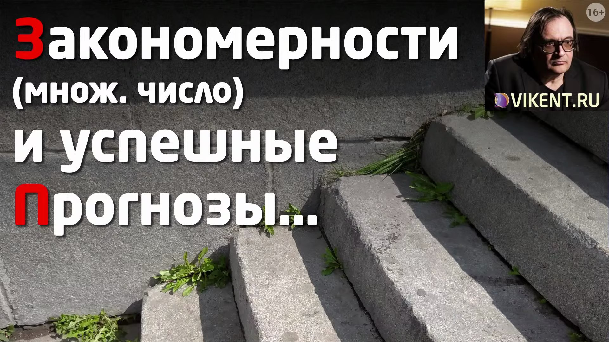

Что самое главное на слайде? Две вещи: восхождение и то, что написано закономерности множественное число. Закономерности множественное число. Так вот, соответственно, есть очень неплохая, очень крепенькая конференция Василия Сановича Верченко, такая очень крепко сделанная. Сейчас пошли первые, как бы он начал выкладывать, ну, очередные открытое видео с этого. И, соответственно, да, Василий Савич Веченко сделает нам подарок на 21 декабря. Надеюсь, как бы вот, соответственно, да. Так вот, соответственно, мы уже начали об этом говорить. То, что мы говорим закрыто, как бы, ну, не для всех ушей, но даже открыты. Мы стали говорить, что сейчас очень модно есть какое-то постановление правительства в России, в других странах, наверное, тоже, о том, что, допустим, нужно развивать какие-то достопоримечательности, потому что для России, для других стран важно развивать внутренний туризм. И, соответственно, очень здорово, когда человек, ещё лучше, когда семья, семья приезжает в какой-то город или городок, как бы минимум на 2 дня. То есть это же совпадает с выходными. То есть счастье, если как бы семья приезжает в городок дней на 10, как в новогодние каникулы, потому что за 2 дня, ну, люди где-то живут, что-то едят, что-то они потратят и так далее. Вот. Ну, а чтобы они поехали в какой-то другой городок, сейчас масса городов без участия креатива, очень хорошо понимают, что я говорю, соответственно, начинают тыкать куда не попаде какие-то, соответственно, достопоримечательности. То есть появляется на наших глазах новая профессия как бы создания достопоримечательности. С моей помощью, похоже, что крупнейшая база достопомечательности уже созточена у Василия Александровича Верченко. Так вот, анализируя базу Василия Саровича Верченко и так далее, вот могу сказать главный секрет по созданию достопоримечательности, как бы, то есть это просто-напросто идут сейчас некоторые болезни. То есть для того, чтобы туристов привлекать в какой-то город или городок, м, нужна система достопоримечательности. Дальше я умолкаю. И чем хороши закономерности? Обратите внимание, я сказал не законы, а закономерности. Законы в отличие от вот закономерности - это такое вероятное событие. Ну, допустите, что есть несколько законов, закономерностей достопримечательности. Мы просто накладываем на городок пучок закономерностей. Это можно сделать компьютерно, пока не сделано. Это можно сделать на бумаге, это можно сделать у доски, но если это делать компьютерно и я консультирую, то, соответственно, примерно примерно за несколько минут мы получаем решение для городка. Вопрос к зрителям: сколько такая система будет стоить? несколько минут без какого-то креатива, и вы получаете проверенное решение для городка, который начал выполнять указания нашего правительства. Думаем, думаем, вот чем хороши закономерности. Вот если вы и знаете, конечно, если вы их, конечно, знаете, вот, соответственно, скажем, да, вот давайте посмотрим, да, следующий давайте момент. Зачем нужны закономерности? Вот некая закономерность, некая закономерность, логика, ну, так, логика философа Вайфеси, да, ну, и так далее.

---

## [01:45:45]

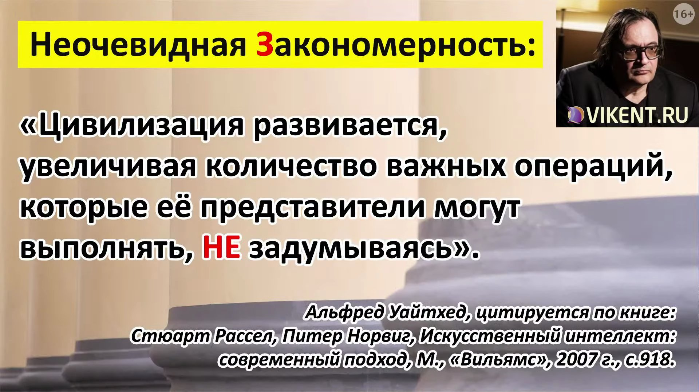

Вот, соответственно, м в 1973 году Герберт Саймон Герберг Саймон получил Нобелевскую премию по экономике за некоторое изучение эффекта того, что большинство людей, троечников, я их называю, у Саймона такого нету, соответственно, удовлетворяется троечными решениями, учитывая, что я не считаю своей лекции для троечных людей. Соответственно, я всем рекомендую посмотреть видео как бы по контринстинктивности. Соответственно, в следующем году Саймон, Герберт Саймон написал статью, то есть вот она тоже есть на портале, по-моему, в виде реферата о том, что выдающиеся люди, выдающиеся шахматисты, они думают не какими-то там чек-листами, значит, слоем искажённой реальности, используют свои термины, они думают чанками. Я немножко подправлю Нобелевскую лауреату. мне это не впервый, как бы, соответственно, скажем, грубо говоря, если вы думаете, вы думаете закономерностями их и у их у вас есть кого? Закономерности, да, фотография Алексея Алесандровича Самойлова, город Москва очень удачная, да? Если вы пучок, ну, как вот пятерню, как вы пятерню на стол накладываете, если вы накладываете на проблемную ситуацию пятерню, у вас через несколько секунд в компьютерном варианте, в консалтинговом варианте, через несколько минут, как бы, а вот мне как бы консультанты берут за эту работу 100. 000 долларов и несколько месяцев. У вас плохие консультанты. У вас плохие консультанты. Ну что я могу сказать и так далее, и так далее, и так далее, как бы, да. Соответственно, соответственно, далее печальный пример, как бы в странах, где идут военные действия, соответственно, военные знают, что, соответственно, солдат ещё воюет на передовой, а экскаватор для него вырвел могилу. закономерность в воюющих странах, то есть, соответственно, воюющих странах печальная, но я делаю специально вам больное, чтобы запомнилось. Да, может быть, не это солдат, может быть, другой. Это штучка вероятностная. Ну, и так далее, и так далее, и так далее, и так далее. Вот поэтому поэтому выгодно владеть выгодно владеть пучком закономерностей. Вот самое надёжное, самое надёжное, если вы их выявили. Как их выявлять, кроме нашего курса? Вообще нигде никто не учит. По идее, этим должен заниматься не я, частный независимый исследователь, академия наук. Но они откровенно не тянут. Если тянут, возражение под этим видео ученики ответят, как бы, да. Ну и переходим к следующему. То есть дальше вообще как бы дальше вообще с лалом начинается. Давайте дальше, да, чуть-чуть за, да, вот как бы, значит, типовая шизовка слева. Типовая шизовка слева.

---

## [01:49:00]

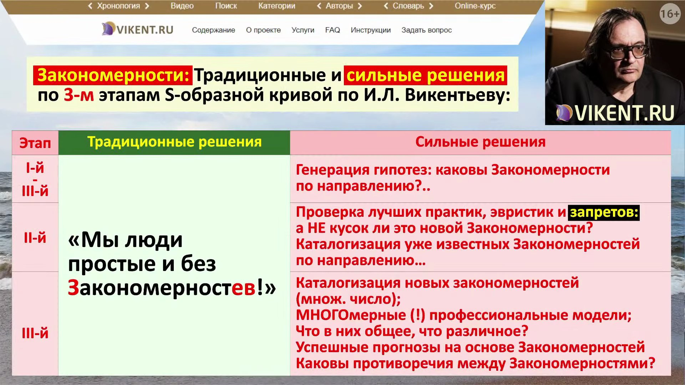

Вот как бы, ну и так далее, и так далее, и так далее, и так далее. Вот как бы, да. Соответственно, давайте переходим дальше. Чуть-чуть затяну, ну, чуть-чуть, минут на 10 затяну ещё. Уже движемся к концу. Фотография Алексея Осандровича Самойлова. Значит, как бы парадигмы есть некоторые неявные допущения. Значит, тем, чтобы вам легче было представить, соответственно, я родился и живу в Питере.

---

## [01:49:30]

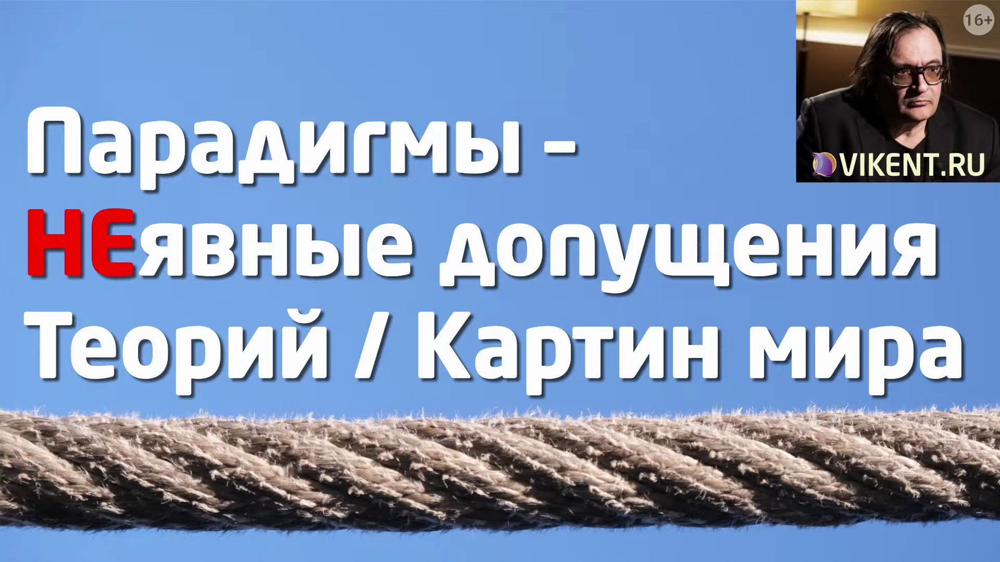

И к своему стыду, надо покаяться, впервые увидел грозу над Финским заливом, а Питер стоит на перешейке некотором небольшом между Ладогой и Финским заливом. Так вот, ещё уже будучи инженером, уже окончив вуз, я увидел грозу над заливом, дождик грозу над заливом. И должен сказать, что это красивейшее зрелище. То есть вы видите на десятки километров, десятки километров. Ну, мне стыдно, что как бы уже весьма будучи, ну, относительно великовозрастным, то есть уже инженером, даже не студентом, впервые увидел вот над финским заливом. То же самое как бы по поводу парадигмы. Это такой крутейший крутейший м слам сразу мирового уровня. Сразу мирового уровня и так далее. Кто слово парадигма не знает, мой совет смотреть на портале. Мы вам покажем, что смотреть на портале. В интернете написано массу, безумное количество идиотизма, поэтому мой совет начинать с портала. Не нравится, ну, пожалуйста, как вам и так далее. Давайте посмотрим. Давайте посмотрим. Да, давайте посмотрим. Парадигма теоретически может возникнуть в конце второго этапа.

---

## [01:50:45]

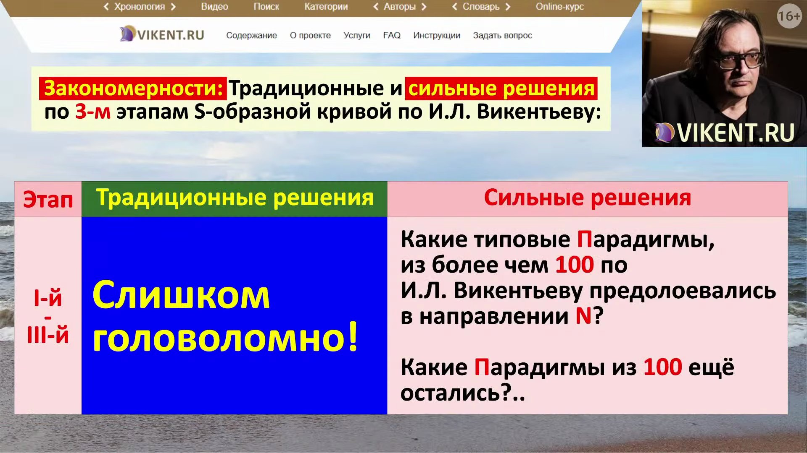

На третьем для очень сильных умов, для более очень сильных умов. Соответственно, как бы как-то люди начинают наталкиваться. Соответственно, материал намеренно не опубликован. Намеренно не опубликован. И Элвикенев, соответственно, выявил для развития наук, наук во множественном числе более 100 парадигм. Это довольно сложные объекты. Мне иногда говорят: "А приведите примеры". То есть, ну, пример-то я приведу, но сразу оговариваю, что просто язык парадигмы он более сложен, чем привычная фраза русского языка. Значит, кто серьёзно занимался логиками, не только аристователями, другими логиками, меня понял. Кто серьёзно не занимался логиками, ну и не занимайтесь. Так вот, соответственно, у Станислава Лема есть некая идея, что если если есть Бог, почему мы считаем, что Бог всеблагой? Почему мы считаем, что Бог справедлив? Почему мы считаем, что Бог мужчина? И далее без ссылок на ранних христиан, допустим, Станислав Лем. Я как бы немножко проинтерпретирую по-своему, хотя я ссываюсь на Лема, соответственно. А почему Бог, как бы, если он всемогущий, почему по воскресениям Бог не какая-то молоденькая женщина в шортиках? А почему, если Бог все всемогущий? Более того, именно по воскресенью Бог, молодая женщина, интеллектуалка, и она покалистка, ей по приколу прикалываться. То есть, извините за татологию, ну, вы думае так вот это вот неявное допущение, что Бог, мужчина где-то на небесах либо на Олимпе с бородой, и он справедлив и он услышит. Это некое неявное допущение, которое, в принципе, сознали первые христиане. Там далее мы уходим в теологию. То есть, в принципе, там очень интересно, очень перевязано с нашей культурой. Ну, соответственно, если вы не свободно владеете, соответственно, там историей, там истории, свободно владеете историей христианства, ну, тогда, может быть, даже у нас получится докладва. Если не свободно, ну, и не надо делать доклад, как бы потерпим, как бы так. Давайте посмотрим простой пример из физики. Ну, немножко надо вспомнить чуть-чуть раздел физики. Он хреново сделан. Раздел электромагнитного поля, он хреново сделан.

---

## [01:53:15]

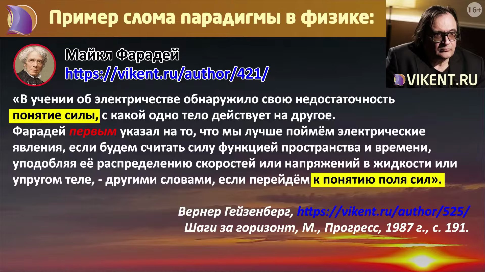

Ну вот внимательно читаем. Гения, да, верно? Гейзенберг гения. Вот там матрицы Гейзенберга и так далее. Вот. И вообще, кто хочет заниматься парадигмами, если вас интересует, вот шаги за горизонт. Мой совет с карандашом. с карандашом как бы не спеша, не спеша и гляч какую книжку взять на новогодние каникулы мы семьёй едем за город. Верная Гельзенберга. Вот возьмите шаги за горизонт. Вот как бы вот чрезвычайно полезно для строителей новых научных методических систем. Вот одно из полезных чтений. Одно из полезных чтений, чтобы меня замучили вопросами. порекомендуете самую главную книжку. Ну вот, в частности, вернее гений Земберг. Сейчас будет ещё круче, ещё круче, но ещё круче, как правило, люди не осиливают. Давайте покажем ещё круче, чем Гейзенберг. Он, кстати, согласился бы. Вот есть категория на викенд. Меня постоянно переспрашивают: "А есть ли там ваши данные? " Нет, моих данных там нет. Я там показываю глупости ведущих науковидов мира.

---

## [01:54:30]

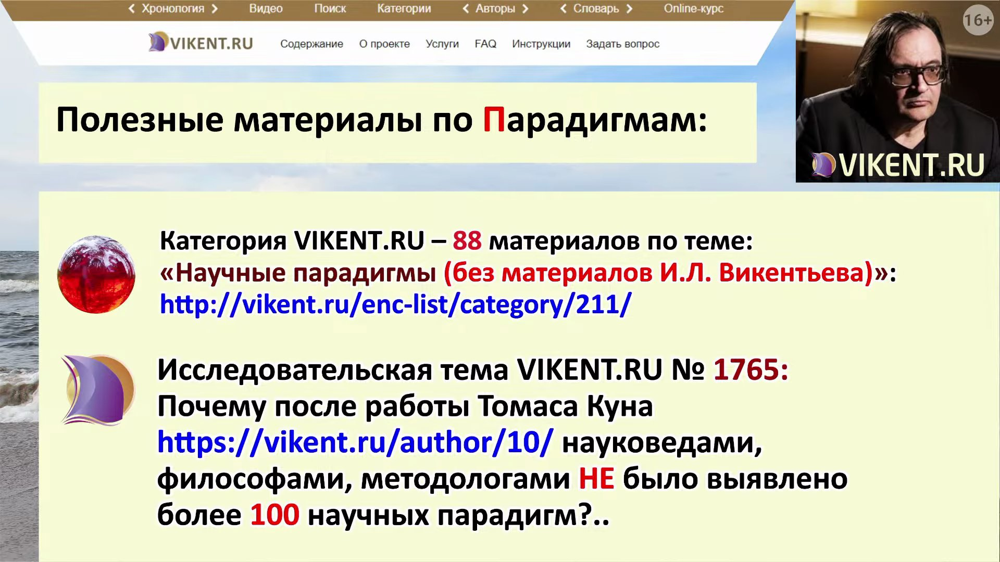

Ещё раз, на портале Weикенд бесплатно для вас есть 88 глупостей. Там не написано, что это глупости. Кстати, наука видов мира. Есть очень такая интересная тема, которая имеет смысл заниматься, если вы там годика два у нас позанимались. Сходу вы не осилите. Почему ведущие науковые веды мира, соответственно, крутятся вокруг Томасакуна? Вот Томасакуна. Томасакуна. и больше ничего не в состоянии сделать. Почему? Напоминаю, это немножко есть аналогия с эгоистиками. Надо мыслить эгоистики, если вы делаете продукт уровня мир, уровень Европа сотнями, ну, парадигмы тоже так далее. Вот тогда вы можете развивать науки. Да, процесс - это вероятностный. Логика парадигмы, не логика Аристотеля. Какая логика? А, не скажу. Какая логика? Не скажу. и так далее, и так далее, и так далее. Вот, вот, как бы, и прочее. Ну, и давайте финальный слайд. Мы чуть-чуть затянули, извините, материал был важный. Вот, соответственно, можете поставить эксперимент, соответственно, на Ютубе, на рутубе, значит, на Ютубе, ну, я впервые это увидел, есть какое-то количество релапсирующей музыки, восхода солнца, заката солнца.

---

## [01:55:45]

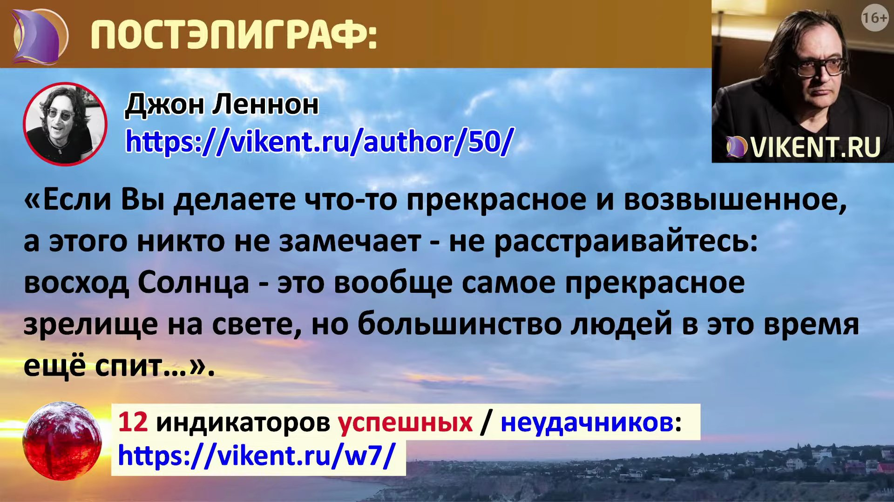

То есть просто очень красивые видео, там музыка какая-то, шелест воды, прибой и прочее. И к своему удивлению, ну, сейчас как-то YouTube иначе показывает. Раньше он как, по-моему, лучше показывал. Есть какие-то уроды, уроды, которые на Ютубе ставили дизлайки. То есть то, что не нравится, восход солнца, релаксирующая музыка, там плавающий дельфин. То есть вот как бы, ну, я неверующий, но слава богу, что Джон Ленон не должен до современного Ютуба, где масса уродов, ставит дизлайки, то есть как бы восходящему солнцу, плавающим дельфинам, лаксирующим музыке, там, прибоя, моря и так далее. Вот поэтому остерегайтесь, остерегайтесь, выходите из слоя систематического сражения реальности. Переходим к благодарности. Извините, немножко затянул. Тема сложная, не хотел сбивать на две. Значит, фотография Анатолия Александровича Рыжачкова, Финский залив, бухты Окунёва и так далее. Вот, значит, большое спасибо, кто делает роспись с точностью до секунд для нас. Вы видите, соответственно, вычиску делает Алексей Александрович Самойлов для вас проверяет домашнее задание, чтобы все ссылки работали.

---

## [01:57:00]

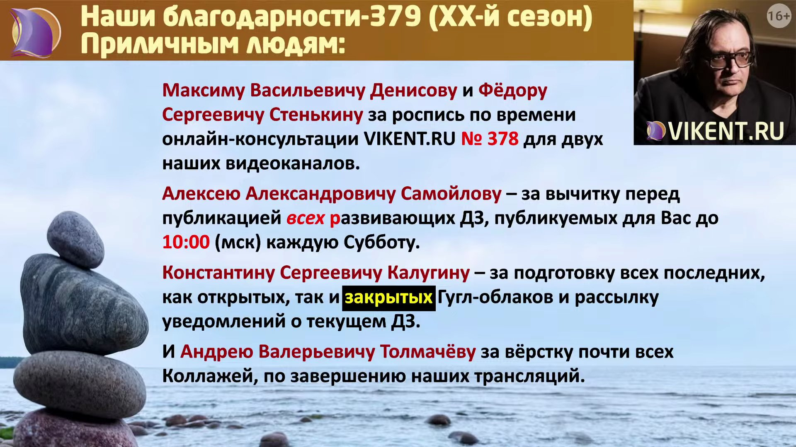

Соответственно, скажем, Константин Сергеевич Калугин, значит, сейчас под конференцию, он постоянно делает Google облака. Значит, мой совет, если есть какие-то малейшие колебания, вычитывать, не вычитывать Google облака, вычитывайте, вычитывайте. Люди довольно ревни относятся, то есть ученики, не я, а ученики ревнива относятся, что если их Google облака кто-то не вычитывает, не факт, что когда вы попросите вычитать ваше Google облако, через полгода люди устремятся вас вычитывать. Вот не факт. К сожалению, я этим процессом не управляю, не хочу, точнее, управлять и так далее. Соответственно, с высокой вероятностью Андрей Валерьевич Толмачёв сделает такой коллаж, там будут видео и основные экраны. Теперь вопрос к нашим модераторам. Скажите, пожалуйста, м были ли сбивки какие-то у нас? Значит, да, сбивок у нас не было, соответственно, и на Ютубе, и ВКонтакте. Большое спасибо издательству Левызон, который бессменный модератор, то есть у издательство м Левызон как бы м пытается работать стратегически. И мы уже сотрудничаем десятилетиями, чего я всем сотрудничаю, всем желаю. А Василий Алесандрович Верченко на меня выходит, и мы начинаем готовить корпорати вам корпоративный подарок. То есть мы постараемся вот эту лекцию перевести плакат, ну, как бы который Василий Иванович Верщенко изготовит, ну, и, естественно, поставит все наши конференции 2026 года, а подарим мы 21 декабря. Ну, всего вам доброго. Всего вам доброго. Да, затянул, но тема была важная, сложная. Давайте вопросами. Всего всего вам доброго. Да.

---

## [01:59:15]

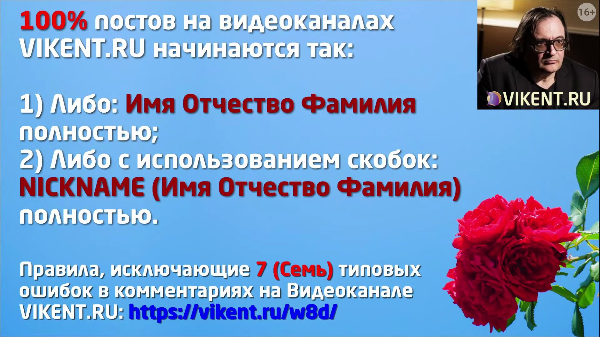

---