# Лекция 380

---

## [00:00:00]

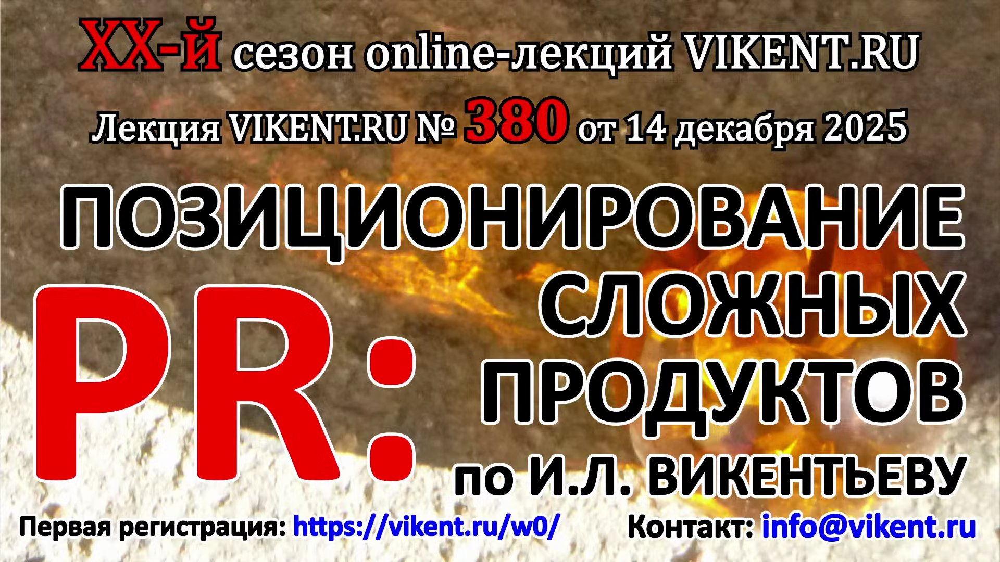

Добрый день, добрый вечер, уважаемые коллеги. Сегодня мы, об этом было предупреждение и ВКонтакте, и в Фейсбуке, начинаем новый списку. Он будет довольно длительный. И, соответственно, обращаю ваше внимание на слово сложных продуктов. Так вот, и дам два рабочих определения. Можно пользоваться любым из них. То есть, допустим, когда мы покупаем что-то в магазине, там кофе либо гречневую крупулю, чтобы либо что-то в этом роде, ну, мы можем взять, посмотреть, понюхать, можем что-то приготовить, второй раз либо купить, либо не купить и так далее. Вот когда же мы говорим сложные продукты, под этим подразумеваются продукты, которых нельзя купить, ну, например, в супермаркете. То есть, наприме, это услуги, идеи, концепции, некие рассуждения умных людей. То есть это, ну, нельзя купить в супермаркете, как бы, так далее. Вот. И, соответственно, вот эти два определения, то, что нельзя купить в супермаркете, либо просто в виде печня, то есть услуги, решения, концепции, идеи, бренд каких-то таких интересных людей, я не имею в виду артистов или там людей из модной индустрии, ну, будем просто называть сложными. Кто может придумать трепети определения, ну, примите поздравления, опубликуйте, пожалуйста, будем пользоваться вашим определениние. Давайте переходим к следующему слайду. И, соответственно, кажем, вот некое определение Михаила Вельра. Вероятно, с самого начала оно нам как-то, ну, не очень не очень будет понятно, но по мере развития курса, пото курс не самый короткий будет явно материалов очень много и с акцентом на именно сложные на сложные услуги, я думаю, он будет для нас важен.

---

## [00:02:00]

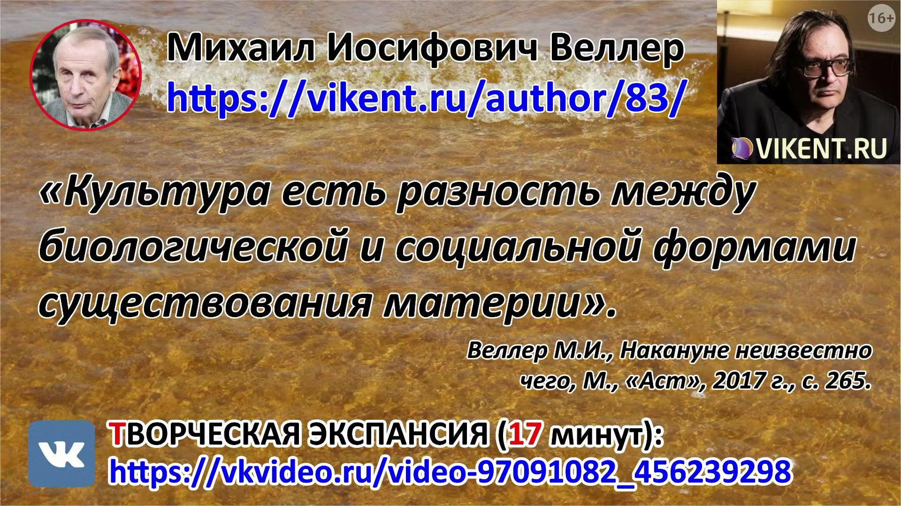

Буквально за час до начала нынешней трансляции я посмотрел, ну, через обычный поисковик научные коммуникации в российском интернете, то есть и доложу я вам, как бы бред на бриде, бредом погоняет. Поэтому я думал, что это сделаю сегодня это сделаю много раз. То есть главное при занятие научным пиа, главное, главное как бы это не свихнуться, то есть то есть российская интеллигенция, то есть я хорошо её знаю, поскольку, ну, здесь вырос и и так далее. доказала, что когда она начинает заниматься интеллектуальными творческими направлениями, один из рисков, о которых никто, как кроме на моём курсе и некоторых курсах учеников никто не предупреждает - это личностная деградация. Личностная деградация. Ну и полезное видео, видите, творческая экспансия 17 минут. То есть как бы это полезно смотреть. Теперь давайте посмотрим. То есть, что сейчас читается курс PR, он немножко связан с предыдущим курсом по методическим системам. Давайте посмотрим, где предыдущих пять лекций. Давайте посмот слайд, пожалуйста. Вот посмотрите, пожалуйста. Значит, есть на Ютубе, есть ВКонтакте, значит, всё открыто. Это не простые лекции. То есть это о том, когда делать и когда, это очень тоже очень важно, не делать какие-то новые методические продукты.

---

## [00:03:45]

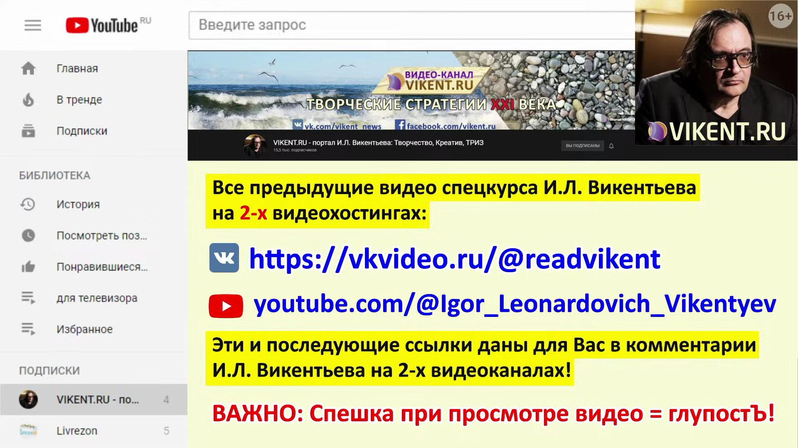

Там есть и о научных продуктах, но основной акцент, соответственно, на методических продуктах. Уже сделан и согласован. Соответственно, следующее воскресенье вас ждёт подарок. Василий Александрович Верченко, большое ему спасибо. Сделал плакат. деоплакат, как бы вот по этому курсу, который вам будет, ну, он уже выложен как бы и так далее, и так далее. Вот вам будет подложено скачивать и, естественно, пользоваться, поскольку это такой ориентир, что делать и что не делать, как бы, да. Соответственно, очень важный акцент, да, этих лекций пять, которые прошу не воспринять как хамство, а как не более, чем предупреждение, ну, такое очень везкое предупреждение. Стоит записать вот эти вот вещи, возможно, и так далее. Вот. И посмотреть этот курс, если вы его не слышали, а если слышали тоже, соответст соответственно в январские дни. Теперь давайте смотрим оглавление. Значит, колоссальная благодарность тем людям, кто задал уточняющие вопросы, потому что потому что программа из-за уточняющих вопросов мы разместили, я уже не помню, во вторник или в четверг ВКонтакте было несколько десятков вопросов по новому курсу, и программа довольно здорово поменялась.

---

## [00:05:00]

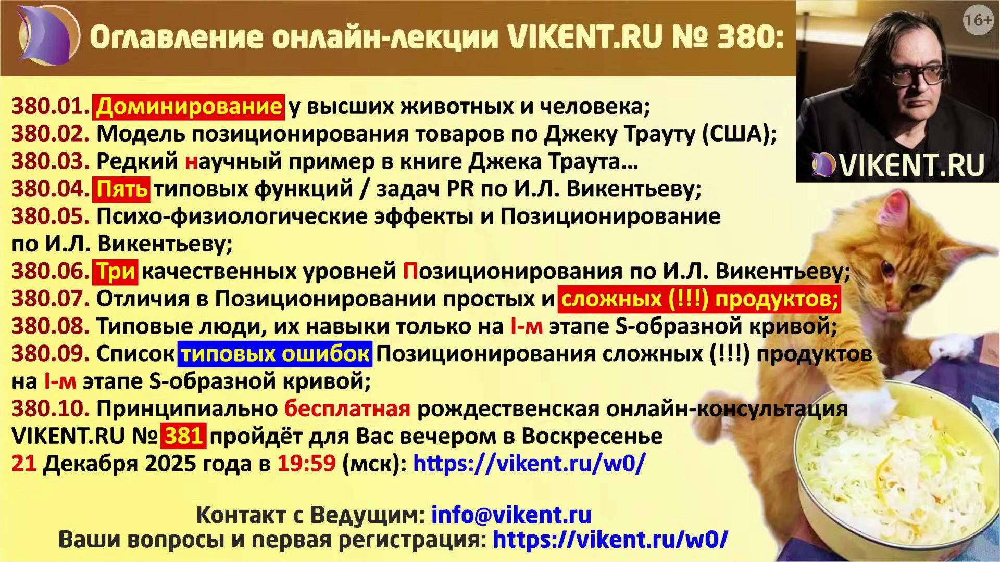

Вот. Ну, она просто была и перекомпонована, и другие акценты. То есть раньше было 15 пунктов, сейчас осталось 10. То есть, ну, будем надеяться, что, а, благодарю, кто это сделал. Второй момент, второй момент, о котором важно сказать, что, соответственно, домашнее задание такой веский пункт по новому спецкурсу, надо задать, дать уточняющие вопросы до 10:00 утра по московского времени, наступающего четверга. Соответственно, как бы следующее воскресенье у нас последнее занятие двадцатого сезона и последнее занятие года у нас онлайн-консультация. Там ещё есть места, три-четыре места для ваших вопросов. Соответственно, какже мой совет давать все вопросы сегодня, ну, можно завтра, но в крайнем случае во вторник, если вы проснётесь и будете задавать на рождественскую конференцию вопросы с утра воскресенье, что часто бывает, я должен вас разочаровать. Вы переноситесь где-то на февраль 2006 года. Извините. Ну, так вот. Где задавать вопросы? Вы видите нижнюю строчку/w0. Это как раз для задавания вопросов. Возможен режим аноним, рабочий язык у нас русский. Поэтому, если вы живёте за границ, не надо блистать знанием английского языка. Всё заётся на русском языке. Давайте посмотрим, чьи слайды мы сегодня, чьи слайды мы сегодня увидим. Вот, соответственно, скажем, большое спасибо за слайды. Мы сегодня увидим.

---

## [00:07:00]

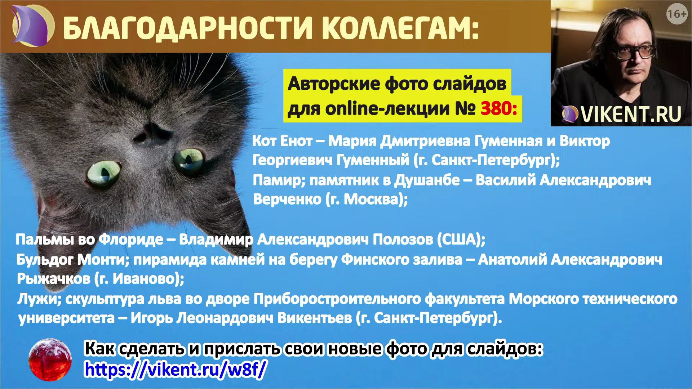

Далее давайте посмотрим фотографию. Она уже работает на лекцию. Давайте посмотрим фотографию. Итак, вы видите спящего, ну, это легко догадаться, английского бульдуга Монти, очень такого нацеленного на коммуникацию пса, как бы воспитанного пса, любящего, хорошо относящего, не любящего, хорошо относящияся к людям.

---

## [00:07:15]

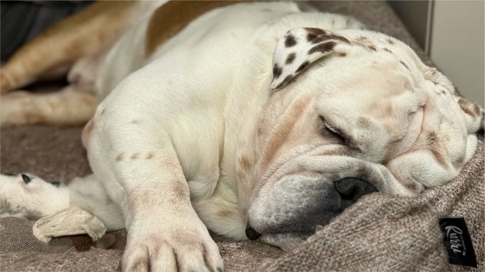

И вот, соответственно, для тех, кто особенно у нас впервые, вот я сейчас скажу слово готовинг, то есть температура собак, температура собок на несколько градусов выше нормальной температуры человека, то есть 36,6 по цельсию, да, у них гой немножко обмена веществ немножко выше. То есть, соответственно, скажем, не знаю, как вам. Думаю, что части чата, ну, видя такого симпатичного пса, очень хочется к нему под тёплый бачок и тоже задымать. Ну вот над этим мы повесим слово готовинг, которое нам сегодня же пригодится. Далее давайте посмотрим новую книжку. Новую книжку посмотрим. Соответственно, вышла новая электронная книжка. Абсолютно бесплатная. Абсолютная бесплатная. Очень говорящее название. Мой совет. Мой совет. Опять-таки сейчас подновогодняя суета. Может быть не до этого охотно ветеллов.

---

## [00:08:15]

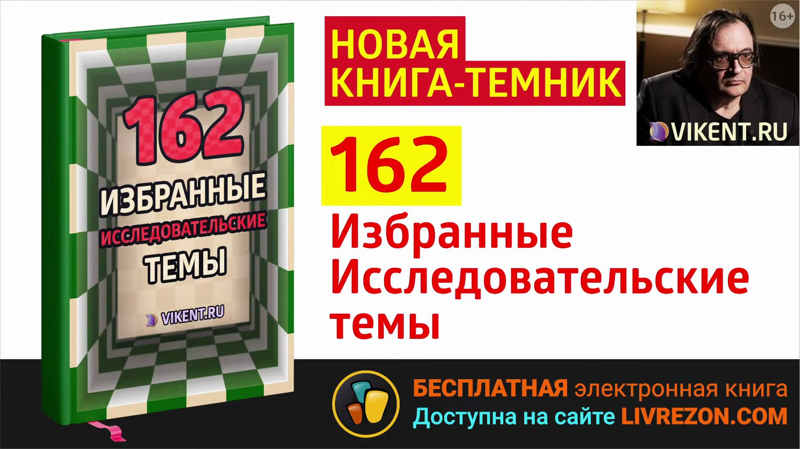

Это многолетняя статистика. Самая умная переписка, которая у меня бывает, она не очень, может быть, объёмная, но самая такая умная переписка лично у меня, почему-то это десятилетиями уже, это январь и июль. Январь и июль, соответственно, скажем, вот рекомендую вам, соответственно, скачать это полностью бесплатно. работают на платформе Левызона. Коллеги, которые помогли это сделать. Если кто-то что-то не понял, где скачивать, как скачивать, что-то ещё, пишите мне, я перешлю. Далее мы, соответственно, перескакиваем на правила поведения. Правила поведения, соответственно, скажем, да, кто как бы понимает значимость, чего мы делаем, чего мы делаем, соответственно, вы можете нас профинансировать.

---

## [00:09:15]

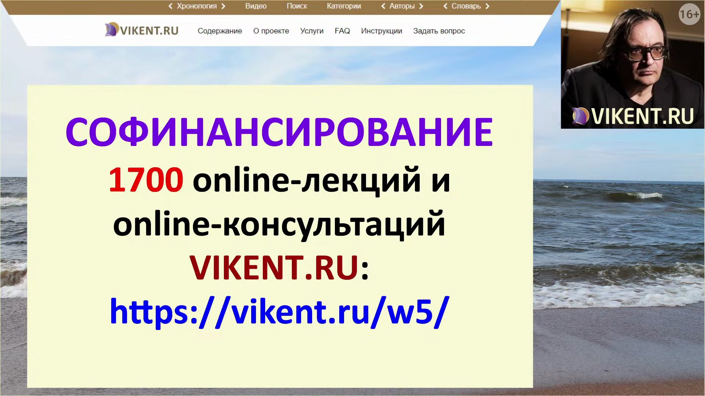

У нас как бы две основные статьи затрат. Это распространение интеллектуальных уникальных видео, соответственно, и вторая на, к сожалению, к сожалению, на лечение Ил Викенте. И я этого не стесняюсь. Я ещё не называю суммы, которые на это нужны. Ну, просто раньше было только только на видео, иногда на книге. Ну, сейчас вот подобралась такая статья. То есть, кто понимает, как бы, ну, заранее благодарен, кто не понимает, ну, ну, и Господь с вами. Далее, правила поведения. Давайте, давайте правила поведения сразу же, сразу же правила. Соответственно, у нас есть очень такие сверхвежливые. Это такая сверхценность. Кого интересует, почему такая сверхценность, я объяснял там несколько сотен раз. Соответственно, задавайте вопрос на двадцать первое, на онлайнконсультацию. Я ещё раз отвечу. Ещё раз отвечу. Почему так? Обратите внимание, это не просьба, это вежливая форма приказа. То есть считаете, что это приказ. Почему? А вот потому что вот если ещё не очень понятно, демократия как бы м любая демократия на моих видеоканалах за мой счёт и счёт моих коллег, моих ученичей. А теперь, собственно, переходим к основной лекции. Ну и давайте здесь немножко меньше будет темп.

---

## [00:10:45]

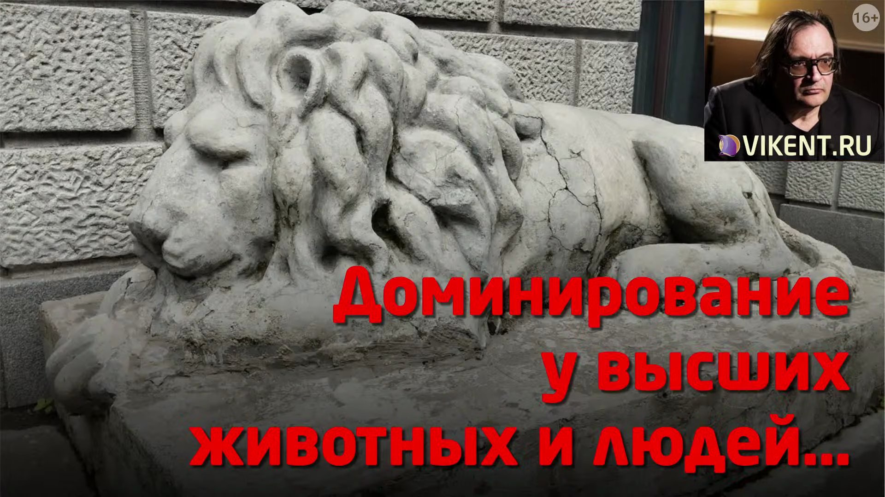

Соответственно, вот лев лев он появился недавно во дворе прибыл в сторичного факультета Морского технического университета для питерцев. Это соседнее здание с мещетью, которое на Гойковской, станция метро Горйковская. Её знает весь город. Вот соседний дом - это приборостроительный факультет. то, что корабелки, как бы корабелки. И вот, соответственно, там появилось такой лев и очень такое важное доминирование, да. Давайте посмотрим следующий слайд. Последующий слайд, давайте. Итак, соответственно, биолог, физиолог и так далее, вот, который открыл у животных некую реакцию.

---

## [00:11:30]

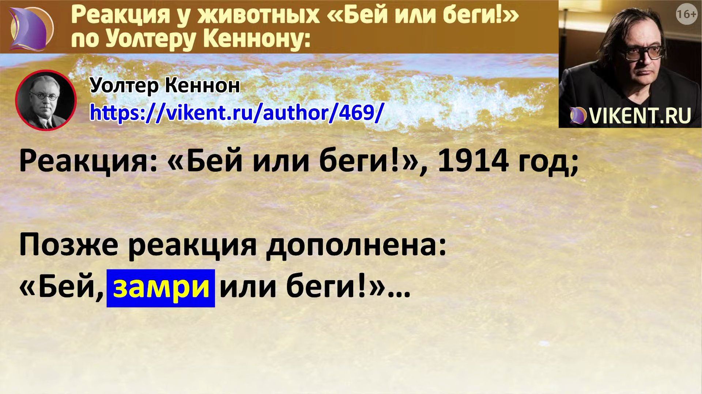

То есть, когда животное сталкивается с чем-то непонятным, это может быть другое животное, какой-то непонятный звук, что-то вообще непонятное, у него возникает реакция, которая, особенно в старых книгах по психофизиологии называлась "Бей или беги". Обратите внимание, была открыта в 1900 четына году. Позже, позже по этой теме довольно большое количество публикаций и, соответственно, уже не Уолтер Кен, а как бы некоторые коллектив, скажем так, не коллектив, просто у разных авторов это есть, учитывая, что это ещё перевод с английского, то есть бей, замри или беги. То есть, допустим, кто наблюдал людей, которые вот защитились, то есть вот за до защиты они старались, потом какой-то доцент, а очень частая профессура после защиты очередной либо кандидатской, либо докторской, вот замирает и вообще, если быть честным, не работает. То вот обратите внимание, зачем в курсе по в том числе научным коммуникациям мы используем. Мне очень важно, я этот вывод буду повторять, что, соответственно, вот это реакции характерные для высших млекопитающих. Ну, строго говоря, есть аналоги не только у высших млекопитающих, а и у более низких как бы существ по эволюционной лестнице. Но нас интересовать будут высшие млекопитающие, из которых, в общем-то, вытся человек. Они очень глубоко, как сказали бы программисты, зашиты. И где-то это пересечение психофизиологии и гормонов, при этом каких-то, то есть исследований масса, но как именно работает, у кого работает, как работает, мягко говоря, для использования непонятно. Поэтому мне очень было важно сообщить первую истину, которую стоит законспектировать. И в принципе постоянно, когда я читал очные лекции для пиарщиков и рекламщиков, их это удивляло. Но наиболее опытные сразу же соглашались. То же самое соглашаются педагогики, педагоги, что большинство людей слов не понимают. Слов не понимают. То есть вот, то есть перешибить физиологию и гормоны, то есть назовите мне слова, которые перешибут общий наркоз. Назовите мне слова, которые перешибут общий наркоз. Да. Вот. Вот. Обратите внимание. Далее. Некоторая мысль для размышления. Учитывая, что в наступающем году мы будем раскручивать то ли шесть, то ли семь конференций, она заключается в том, что конференции, конференции как бы это в некий надо индивидуальное слово надо индивидуальные, кто пишет, кто конспектирует меня.

---

## [00:14:15]

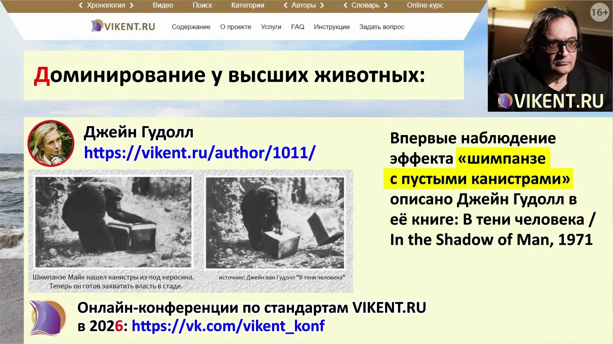

письменно пишется через ы на индивидуальный механизм насилия вынуждения человека работать. То есть конференция - это не демократия, то есть это дураки придумали, это некоторый механизм и так далее. Так вот, как бы, говоря о доминировании у высших животных, соответственно, Джейн Гудал, вот она здесь специально, мы подбирали фотографию, молоденькая девушка, соответственно, поехала изучать шимпазы. Это целая история. На портале можно посмотреть. И, соответственно, скажем, мм, она описала классическая история, многие её знают. Ну, сейчас очень важно на эту тему поговорить, чтобы вы запомнили на всю жизнь этот механизмы нужно м помнить как некий маргинал, которого, скажем, все били в стали били шимпанзе Майкл, поскольку он маргинал, маргинал как бы, да, бомж, обезьяний бомж, ходил по помойкам и нагрул там две пустые канистры, кажется, из-под бензина или керосина, что-то в этом роде. И, соответственно, от соударений этих канистр выяснилось, что, соответственно, Майкл Майк, Майк шампанзе Майк, он, соответственно, может доминировать в стае и, соответственно, да было гораздо более мощный и умный шампанзы Геркулес, который его бил до этого. На какое-то время он как бы сместил сместил как бы генерального секретаря ЦК, значит, вот ЦПК партии Шимпанзе, значит, вот Геркулеса мощного, как бы просто стукая канистрами. Пример для конференции, которая будет в конце года, следующего года поводить Романа Стефановича Лавеску. То есть как бы переход в насистему качественный скачок, который сделал маргинал Майк и так далее, и так далее, и так далее. Так вот, здесь некое разделение, которое нам понадобится в спецкурсе. Сегодня я говорю, так вот, я сейчас говорю только о животном мире, о высших млекопитающих, запятая человеке. Вот как бы в природе в природе есть некоторые доминирования, которые обозначаются. Например, там у у некоторых птиц это может быть какой-то бешок там или распущенный хвост. То есть какие-то вещи прописанные в теле, ну каких самцов атгугтангов. Это могут быть белые хидые хидые, точнее, извините, седые пятна на шерсти. То есть им не нужно напоминать, что они самые крутые. То есть эти пятна означают, что они крутые, вообще могут вломить, соответственно. Ну, это такие статичные признаки. Статичные признаки. Есть динамические признаки. Вот только что показали вам Майка, которая шумит с канистрами. Соответственно, окажем, наверняка вы наблюдали, насколько я понимаю, в чате у нас минимум из десяток котовладельцев, которых есть коты, что кот иногда пытается устроиться на полке серванта, на спинке дивана, когда люди собрались, то есть и люди собираются вместе, как считают коты, чтобы вместе поесть и не кормить уже перекорного кота. Переко, ну, хотя бы вот наблюдать. То есть кот держит лапу. Кот держит лапу, как бы ну вот на ситуации это может быть не жёсткое такое доминирование, но такое динамичное. Динамичное, то есть доминирование есть такое вот, повторяю, застывшее в виде некоторых признаков. Нам это пригодится. И второе динамичное. И то, и другое, ну, схемой доминирования, которую я сейчас назвал, чрезвычайно глубоко прописано у человека и высших мкопитающих. Вот, повторяю, выковырись с помощью там заглядывания в глаз, типа, с помощью слов и так далее, и так далее, и так далее, и так далее. Вот, мягко говоря, не получается. Давайте следующий кадр. Я ещё буду углублять эту тему. Давайте следующие кадры. Да, соответственно, кот Тигр Амур. Тигр Амур. И какое-то время назад как бы, ну, мы просто не стали указывать даты.

---

## [00:18:45]

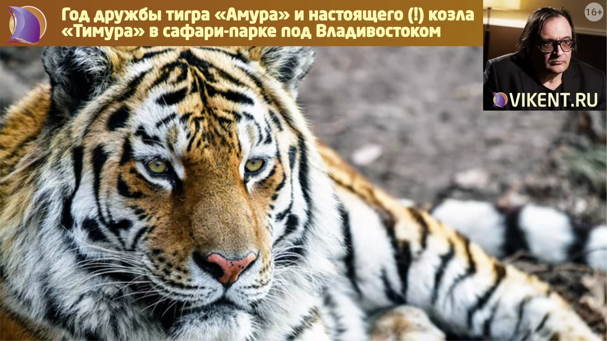

Это было недавно. Это обошло все СМИ, федеральные СМИ. Масса людей умилялось, что тигр Амур существует в некотором таком питомнике под Владивостоком в Приморье. И, соответственно, раз в неделю ему дают живое мясо. Ему, соответственно, привели козла. Ну, я подозреваю, что живое мясо, чтобы тигр тренировался, там догонял, терзал и так далее. Вот. Но тигр, тигр Амур не стал жрать козла. Вот как бы и работники, соответственно, этого, ну, аналога зоопарка, за зоопарка, как-то иначе это называется, забыл, как бы вот вот а сафари парк. Сафари парк они дали козлу имя Тимур. Моя гипотеза, соответственно, что фотографию Тимура можно найти, что Тимур был сильно волосатый козёл и умница. Это и красавец Тимур, Тимур, господи, не Тимур, как бы, а Амур просто-напросто волосатое мясо не стал жрать. Просто это моя гипотеза, котовладельцы могут развернуть дискуссию как бы под этим видео. Ну, соответственно, козёл зрел, зрел, зрел. Они общались самомую. И дальше, соответственно, Козёл решил тоже подоминировать. Что-то у него там какие-то гормоны бородили. Соответственно, он встал днём, днём, а мур любит спать. Ну, кот, кот, он любит спать. Соответственно, как бы Тимур, козёл, козёл, настоящий козёл. Сейчас поймёте, почему. Соответственно, стал спать на месте Амура. Амур, интеллигентный, ум интеллигентный, умный кот, стал спать на клетке, сверху клетки. На его месте валялся козёл, как бы волосатый и так далее. Вот. Ну, это козлу показалось мало. И он стал как бы следующей серией прыгать, козёл прыгать на спящем тигре. Причём как бы вот козёл раза в четыре, может быть в три, может быть, в четыре раза меньше тигра. Ну вот козёл, прыгающий на тигре, Голливуд, короче, новый сюжет для Голливуда. У Голливуда такого ещё не было, скажем, да. И, соответственно, тигр терпел. Это было неоднократно. И потом, значит, козёл стал разбегаться и бодать спящего Амура. Ну, Амура это надоело. Амуру это надоело, и он вообще не съел всё-таки козла и вломил. Видя это, видя это, соответственно, сотрудники зоопарка всё-таки решили Тимура Тимура отселить. Тимура отселить. Так вот, ещё ещё раз как бы я привёл, на мой взгляд, ряд роскошных примеров. Мы сейчас продолжим роскошные примеры. Это просто затем, чтобы сказать, что вот некоторые коммуникации, коммуникации, основы коммуникации здорово замешано на на каких-то гормонах, на психофизиологии. Всё это прописано очень глубоко и с помощью уговаривания там тигра есть, не есть, казалось, что-то ещё, ну, мягко говоря, это не работает. Начинаем переходить к царю животных. Царю животных. Но не Льву, а к человеку. Давайте посмотрим дальше. Давайте посмотрим дальше. Напоминаю некоторые мем, которые все знают.

---

## [00:22:15]

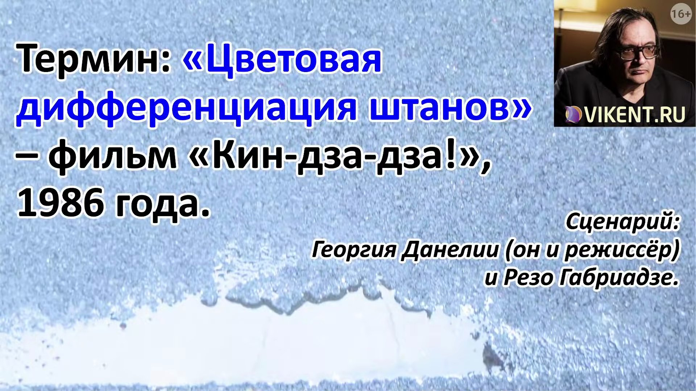

Соответственно, сценарий Георгия на Данели, он же и режиссёр, фильм Тинзадза. Кто не знает, может быть, смотрит не из России нас, но наведите справки, то есть тратить время на пересказ фильма, вещь неблагодарная. Соответственно, вещь снята на фоне лужи, недавней лужи, как бы около библиотеки Маяковского в Питере. Теперь давайте посмотрим, ну, те, кто смотрел фильм, наверное, и так далее. Вот давайте посмотрим. Читаем, очень внимательно читаем. Как бы роскошный пример. Роскошный пример пишет художник Брускин. Гриша Брускин пишет так далее, и так далее. Вот обратите внимание, обратите внимание. Маршал ничем от Павиана, Павлина или куицы.

---

## [00:23:00]

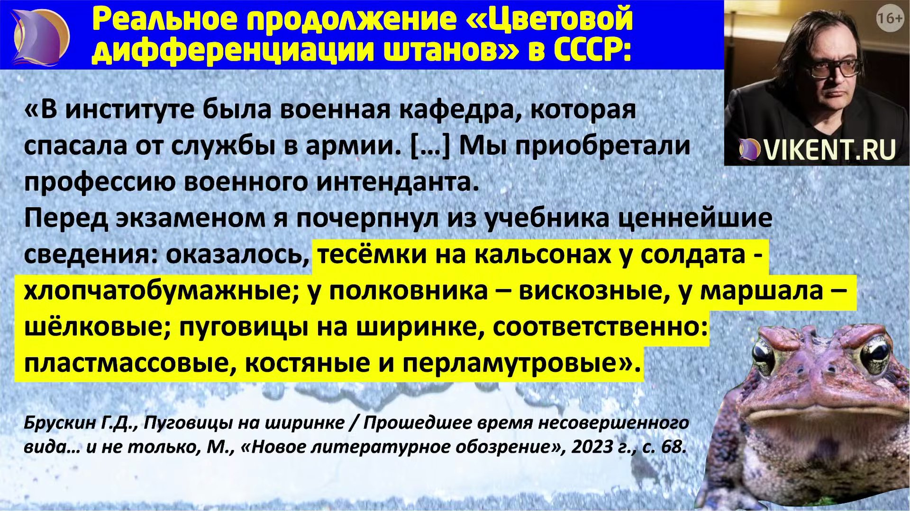

Маршал ничем не отличается от холе обслуживающего маршал тоже ничем отличается пока вы читаете да пример можно репостить можно и нужно репостить в социальных сетях просто заголовок получалось очень длинный но репостить очень наглядный плюс соответственно такая есть мода особенно на Кавказе вот особенно на Кавказе иметь позолоченный пистолет иметь позолоченный пистолет ну вот что как как бы что как бы какие пуговицы на ширинке как бы перламутровые и как бы золотой пистолет ну это откуда-то откуда-то от животных просьба ещё раз повторяю оценить считаете такой интеллектуальный ли подновогодний подарок вот соответственно скажем зачем зачем это было давайте посидим немножко на этом слайде и так далее вот соответственно ещё некоторый примеры значит в конце По-моему, это будет двадцать девятый год, может быть, тридцатый, но где-то вот так вот как бы цитирую по памяти. Поэтому, соответственно, Крупская, у которой а не было детей, б, которая не преподавала детям, не преподавала детям, значит, ругала в центральной партийной печати, а это было приговор фактически Антона Семёновича Макаенко, то, что он в своей колонии для малолетних преступников использует наказание. Сейчас постоянно идут различные дискуссии о том, что, допустим, при лечении наркоманов, допустим, допустим, в Екатеринбурге там Ройзман и его ряд коллег, соответственно, как бы там пыковывали наркоманов, вот пыковывали наркоманов, господи, там, койкам и так далее. То есть они использовали не только слова, а насилие. Поэтому, если внимательно анализировать как бы любую армию мира, любую армию мира, либо любую там психиатрическую лечебницу, там как бы наработаны большое количество физиологических воздействий на солдат, на курсантов, на психобольных. Ну, на психбольных это может быть там оборачивание, сворачивание, какие-то препараты у солдат или курсантов это какие-то физические упражнения, агаоптвахты. То есть мне было чрезвычайно важно сказать, что воздействие через физиологию пробивает всех. Неважно, человек там академик, не академик и вот как бы умный, неумный, это побивает всех. В армию убивают очень разных людей. и безумное количество именно физиологических вещей. Поэтому вот это принцип, что физиология, психофизиология сильнее всех, сильнее слов и так далее, и так далее. Вот это первый принцип, который нужно законспектировать. Соответственно, а теперь, собственно, переходим к некоторым таким словесным моделям, которые тогда Итак, большое спасибо, соответственно, Василия Полозова. фотографии из Штатов.

---

## [00:26:15]

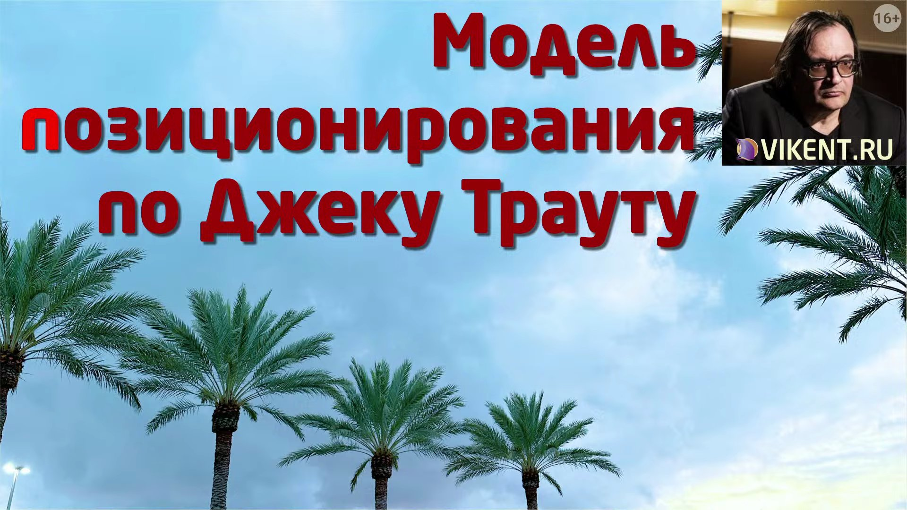

Фотографии Штатов и, соответственно, специалист из Штатов, который стал рассказывать не первый, не первый, ну, соответственно, сделал себе мировое имя на некоторых простейших преобразованиях. Давайте посмотрим. Итак, соответственно, первым, кто более-менее так систематически стал заниматься позиционированием, что такое позиционирование чуть-чуть позже, это древний римлянин, соответственно, скажем, как он точно выглядел. Никто не знает. Ну вот как бы мы это выдрали из Википедии. Ну вот примерно так.

---

## [00:26:45]

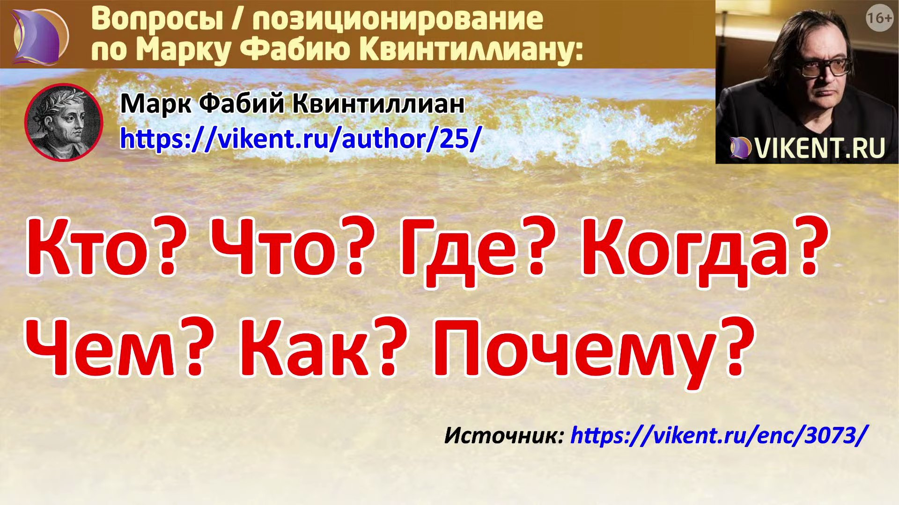

Обратите внимание, что вот эти вопросы, кто, что, где, когда, чем, как, почему, они до сих пор используются, соответственно, ээ обучают не вопросом следователей, журналистов и так далее. Вот, соответственно, скажем, вот этот печень не полон, потому что здесь нету очень важного пункта из развитого бизнес-плана. А каковы риски? Первое, каковы риски? Вот, ну вот Марк Фабеликвентилян как бы о рисках. Каковы риски, каковы типовые ошибки, каковы мифы, вот он не знал. Но в научных коммуникациях подвижение сложнейших головоломных продуктов, это очень важно. Ну, Квинтилиан уже жил в нашу эру, ну, зивную, в самом начале нашей эры он жил. Второй момент. Вот происходит некое событие либо некая встреча с человеком или, допустим, с Тигром Амуром. Нет такого сложного вопроса, сложного вопроса: "А кто это или что это по отношению ко мне? " Либо другой вопрос: кто я по отношению к Амуру? Да. Вот Амур красавец. Красавец, но лучше его наблюдать через клетку, конечно. понимаете, заходить Камурую, как бы, и в отличие от коза, там как-то с ним даже заигрывать или что-то ещё, вот не стоит. И вот, соответственно, скажем, обратите внимание, что м сам термин, давайте дальше переходим к трауту. Вот, обратите внимание, в семидесятых годах маркетолог Джек Траут сделал себе имя в мире. Соответственно, Америка выдохнула после Второй мировой войны. Вот, соответственно, как бы во Второй мировой войны на территории Америки упали всего лишь несколько снарядов. Просто несколько немецких эсминцев выскочили к берегу Америки, значит, и пальнули из орудия. Орудие, значит, несколько снарядов попали в территорию Америки и напугали там мирно пасущихся коров. То есть даже жертв не было, скажем, да. Но тем не менее уже появились какие-то магазины, то, что мы сейчас называем супермаркеты. И для супермаркета в областном центре совершенно спокойно могут быть, скажем, там, ну, 10. 000 товаров, 20.000 товаров. Если поизучать сейчас уже как бы те сайты, которые есть, соответственно, м, да, вот слово США, мы опять-таки сделали ошибку США. Advertising AG, рекламная век, рекламная эпоха, это США, да, в первой случайке ошибка, извините. Соответственно, там миллионы, на китайских сайтах сейчас можно купить миллионы товаров. То есть обратите внимание, допустим, у советских людей таких проблем не было в семьдесят втором году. То есть купить купить просто вот есть как бы чёрный и белый хлеб. В общем-то, хорошо, если завезли нечёрствый. Хорошо, да? То есть позиционирование по Джеку Трауту в оферативном изложении у него немножко скачет это определение. в книгах разного издания. Соответственно, это операция на сознание потенциальных покупателей. То есть просто напросто как некие нечто выглядит в голове, как нечто выглядит м не на самом деле, а как некий продукт выглядит в голове в голове, соответственно потребителей, как потребители выглядит. Соответственно, если вы почитаете книгу Коры Ландау, Кора Коринтия Аландау, соответственно, жены академика Ландау, она очень много посвящает тому, как бы как бы какие извращенцы были академики, включая мужа, как бы вот как они были сексуально озабочены и так далее, и так далее, и так далее, и так далее, и так далее. Вот если читать как бы книги Аландау, соответственно, как бы всё выглядит несколько иначе. Соответственно, давайте посмотрим пример. Давайте посмотрим пример. Это единственный пример, который научный у Джека Траута и так далее, и так далее. Вот есть очень простой пример. Его обычно используют в школе, в школьном курсе географии без ссылок на Галилея.

---

## [00:31:15]

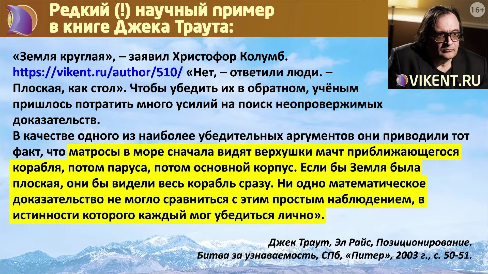

Траут тоже не ссылается на Галилея, соответственно, скажем. Но первый, кто стал использовать этот пример, был Галилей. Галилей о том, что, соответственно, корабль как бы либо потихонечку, значит, скрывается сначала корпус корабля, потом мачты скрываются и так далее, и так далее. Это вообще пример Галилея. Его приводит, естественно, без как бы без ссылок на Галилеи, да. Так вот, теперь давайте переходим переходим ещё к одному симпатичному фото. Вот вы видите из Кении баконьеры убивают слоних. оставляются слонята. Слонята очень переживают. И вы видите, лежат слонята и служители, соответственно, скажем, приюта для слонят.

---

## [00:32:00]

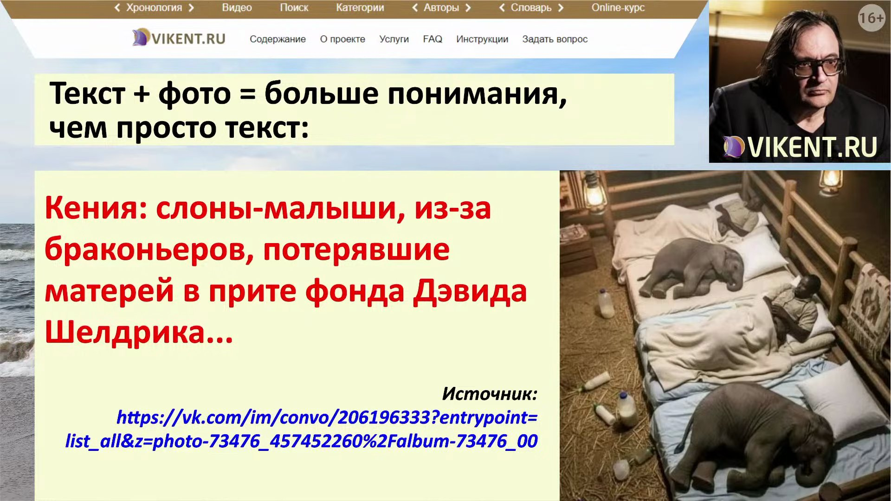

Приюта для слонят. И здесь нам как бы зачем пример этот я вставил? Ну, во-первых, безумно симпатичные слонята, которые переживают. Значит, соответственно, второй момент, обратите внимание, рассказывать об этом сложно, как бы это случай, когда вот графика, эту графику, у кого хорошее зрение, кто смотрит сейчас не на гаджете, вы воспринимаете примерно за 0целых за 0,2 секунды. 0,2 секунды это вам влетает и вам становится понятно. Так вот, позиционирование - это когда нечто, особенно какие-то сложные объекты, сложные случаи, сложные решения, сложные идеи, сложные услуги вам понятны. Вот здесь вот как бы, ну, более-менее понятно. Ну, плюс вызывают какие-то, ну, скорее всего, позитивные эмоции. Ну, добавлю от себя, что, соответственно, когда слонята вырастают, у них появляются свои дети, они часто к воротам приюта приходит со своим выводкам. Ну, это такой очень лический момент, готовое видео, скажем, под Новый год и так далее, и так далее. Вот как бы люди обычно это так и постят, лайкают, ну, и так далее. Вот давайте сейчас переходим к таким более жёстким вещам, позиционируя повикин его, и мы сделаем коллаж, который вы сможете и постить. То есть, если вы очень внимательно посмотрите, есть некий лев, он стоит на набережной Невы. Далее в тени кунсткамера.

---

## [00:33:45]

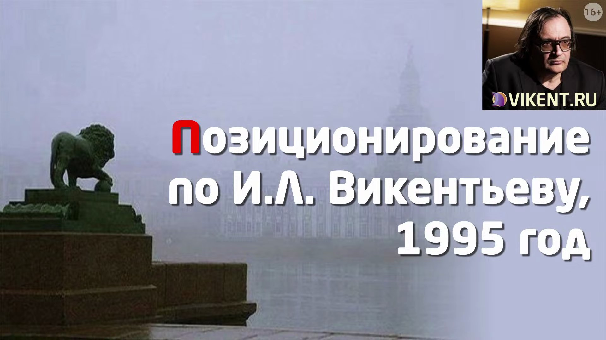

Оно же оно же раньше сейчас это стало левее. Сейчас стало левее. Это Академия наук России. Ну, сейчас как бы Академия наук, здание, которое левее, и оно полностью скрыто в Тюмане. Вот кунсткамера чуть-чуть почему и поставлена в тумане, в тумане угадывается. Давайте, соответственно, скажем, значит, почтём следующее. То есть понимание по ивикен - это когда некий клиент, причём надо понимать, что клиент, соответственно, всегда несовершенен, особенно когда есть сложная, то есть сложная услуга, научная услуга, научная услуга либо наукоёмкая услуга по определению непонятна. по определению непонятно, потому что наукой занимается 1% в развитых странах мира. Вот, соответственно, второй момент. Сейчас как бы люди очень настороже в России. Безумное количество интернет-мошенников, мошенников, которые звонят по телефону и так далее, и так далее, и так далее, и так далее, и так далее. Вот как бы, да. Вот, соответственно, у нас был случай ВКонтакте, когда я не помню, кажется, было нужно оплатить было какую-то конференцию, какие-то мелкие деньги, и, соответственно, какой-то идиот, какой-то идиот. Всё было в видео написано, куда оплатить и так далее, и так далее. Вот, соответственно, какой-то идиот, которому лень было, лень было м как бы смотреть видео по этому поводу, написал, соответственно, в комментариях вопрос, куда платить. Мгновенно, мгновенно появился счёт. Как бы я, честно говоря, подумал, что кто-то из моих коллег, у кого зал этот счёт, потом выяснился, что это счёт какого-то левого человека, который просто-напросто, вероятно, через поисковики, а может быть и роботы, это простенький робот, написал какой-то левый счёт и за нашу конференцию, соответственно, человек линтяй, линтяя дурак, значит, заплатил налево. Ну вот как бы такой как бы момент, да. Соответственно, ещё раз повторяю, некое рабочее определение. Позиционирование - это когда человек понимает. И второе, второе как бы понимает, как бы и так далее. Вот в этом отношении можно себе пометить ещё одну такую присказку, что вот начинающие учительницы, начинающие учителя, мужчины, неважно, это школа или это вуз, они не понимают разницы, как бы. То есть молоденькие учительницы не понимают разницы между я сказала и они поняли. Опытные учительницы, как бы и, ну, учителя, педагоги в вузе, преподаватели вузов, понимают разницы, что вообще плевать, что ты сказал. А может быть, нужно и сказать, и нарисовать, и показать фото, как я только что показывал, двух сим симпатичных слонят. Ну вот, допустим, вот для того, чтобы вы поняли, для того, чтобы поняли. Так вот, соответственно, на основании просто статистики, очень неслабой статистики, соответственно, мною было созданое было создана некая координатная сетка. Координатная сетка, соответственно, для задач попиа. Обратите внимание, очень важный заголовок. Здесь важно пометить, что это некоторые базовые функции, расширенный список PR-функций. Кто профессионально интересуется, его нужно знать близко к тексту, ниже тоже на основании статистики. Итак, вот по этим функциям мы пойдём. Сегодня мы занимаемся только позиционированием. И написано какое-то там третье, четвёртое определение. Клиенты понимают продукт. При этом, ещё раз, сложный продукт понимают. Если клиенты не понимают продукт, соответственно, соответственно включается базовая, где-то полугормоны, полу какая-то психофизиология непонятная, люди просто-напросто сваливают от непонятного. Сваливают в буквальном смысле, при этом они врут. Там я ещё раз звоню, я вам позвоню, как бы что-то меня это не интересует. Это такое обыкновенное вороньё. Почему? Как говорил доктор Хаус, как что все врут. Значит, потом он даже стал говорить, даже младенцы врут. Да, даже младенцы врут. Это очень глубоко, очень глубоко запихано. Далее, ну, это будет в 2006 году, обратите внимание, что следующая такая задача, функция PR - это клиенты действуют на основе своих стереотипов, если вы не управляете имиджем. Умные женщины это чувствуют интуитивно. Мужчины пока не вляпываются, это не чувствуют. Как правило, даже умные мужчины. Далее, чёрный пиар. Чёрный пиар, соответственно. Да, да, да, да, да, да, да, да, да, да, да, да, да. Как бы обратите внимание, допустим, в разных городах есть такое учреждение Соверт ректоров, то есть ректоры вузов и так далее, и так далее. Вот. И немножко в этом деле понимаю и иногда акцентирую, могу сказать, что бывают советы ректоров, которые ненавидят какого-то особого удачливого ректора и не очень стесняются своей ненависти. Вот если вы мне хотите сказать, что доктора наук поступают очень этично и избегая чёрного пиара, вы вырёте. Да, мне мне в пиар соврать невозможно. вот записать сразу же, да, как бы, да, вот, соответственно, очень интересный момент, которого нету у траута. Нету у траута, значит, как бы и он заключается в следующем, что, соответственно, м последователи траута говорили, что позиционирование - это вот как бы отличие продукта от конкурентов. Значит, мои эксперименты по решению задач показали, что как бы нужно это определение развести. То есть, если брать позиционирование не по трауто, по Викенву, то вот позиционирование просто требование. Просто клиенты понимают продукт, просто просто понимают. Другая задача, клиенты выбирают продукт на фоне конкурентов. Ну, как правило, когда что-то понимают и так далее, и так далее, и так далее. Вот. Соответственно, вот если очень важный момент, вот контрреклама управления кризисами. Вот мало кто знает, что, соответственно, есть такие как бы деликатесы, которые называются трюфель и которые ищут в земле. Мало кто знает, что, ну, их там где-то в веке восемнадцатом даже раньше стали искать там деликатесы есть и прочее. И первые варианты искали хрюшки. Но хрюшки плохи тем, что, соответственно, они они же их и сжирали, то есть находили, жрали. И сейчас как бы опять-таки Бельгия, Франция и так далее, и так далее. Вот трюфели ищет собаки. То есть собака может найти, но трюфель она не живёт. Туфель, то есть, соответственно, как бы нужно управлять кризисами. Ну, это более жёсткий вариант, самый сложный вид пиара. Управление кризисами. Управление кризисами на всякий случай, чтоб вы вы запомнили. как бы, соответственно, мало очень кто помнит, что есть как бы такой роман Антиутопира Ороэла, соответственно, и один из героев Уилсон Смит, он занимается следующим. Он исправляет обещание правительства. Он исправляет обещания правительства и заголовки там, ну, в планах, в статьях и так далее, и так далее, и так далее, и так далее. То есть он правит историю. Улксон Смит правит историю. То есть кто кто-то должен управлять. Ну, соответственно, как бы вот, ну, мы об этом поговорим, если кому-то очень важно. Мы можем поговорить ещё о том, как люди уже начали исправлять историю. Примеров безумное количество. Ну, не стал делать тема, это не очень творческие. Значит, зачем этот слайд? Это вот, соответственно, такая уже классика PR. Значит, очень сильный довод с моей стороны, почему мы будем пользоваться этой схемой, а не другой. Потому что это проверено. Вот такая классификация, она позволяет решать задачи. У нас очень у меня на конференциях один раз выступил представитель Траута на моей конференции и хотел выступить второй раз. Второй раз я не пустил, потому что у него была всего лишь одна лекция, которую под видом доклада он читал, повторяясь, так далее. Вот. Ну как бы, ну мягко говоря, второй раз то же самое слушать мы не стали. А вот эти вот классификация, как это будет называться, пиар-функции, пиар-задачи по викендву, это не суть важно, они опубликованы и так далее, и так далее, и так далее, и так далее. Теперь давайте посмотрим некоторые эффекты, которые желательно, кого это интересует, знать близко к тексту. Соответственно, как бы частично я уже наметил и как бы обосновал, что мозг человека и высших млекопитающих, соответственно, насыщен некоторыми центрами тревоги. Более того, они нестатичные, они немножко плавают. Соответственно, и если человек либо высшая мыкопитается сталкивается нечто непонятным, то есть первая первая реакция, одна из первых ещё базовых и очень глубоко зашитых вариантов - это как бы сваливать. Сваливать же, просто сваливать. Как бы это не академическое слово, но опыт моих там более 200 мастер-классов показывает, что слово сваливает как бы и, соответственно, доктора наук и и старшеклассники запоминают с первого раза, да. Соответственно, позиционирование, продукт понятен разным и несовершенным клиентам. То есть, соответственно, одна из ошибок начинающих учителей, начинающих меркетологов, начинающих пиарщиков, они выдумывают какого-то идеального клиента или идеальную клиентку, даже где-то, может быть, влюбляются, но таких клиентов нет. То есть клиенты вот сразу же они все несовершенты. Соответственно, скажем, да, очень важно отличать позиционирования и довольно сложного варианта отстройки от конкурентов, когда, соответственно, мы вынуждены, вынуждены, соответственно, на фоне работать, на фоне конкурентов. На фоне конкурентов просто вынуждены. Может быть, не мы не хотим, может быть, мы не хотим этого делать, но придётся, придётся примеры, которые женщины понимают сразу же. Значит, соответственно, в крупных домах, обычно это бывает на новостройках, в Москве, в Питере может быть, допустим, две-три как бы косметических салона. Два-три, то есть, то есть расстояние между ними там, ну, метров 50, метров 50. Соответственно, то же самое с ресторанчиками, с кафе и так далее. Вот вопрос, куда идти. Так вот, бывает, что куда-то как бы можно идти, куда-то где-то люди есть, а в 50 м всё такое же, всё такое же, люди не идут. Вот это отстройка от конкурентов, как бы. А какой продукт? Ну, косметические услуги. Ну, не могу сказать, что они очень сложные, очень наукоёмкие, хотя не без этого. Но тем не менее, тем не менее, соответственно, давайте посмотрим, давайте посмотрим как бы дальше. Давайте посмотрим дальше. Следующий слайд. Давайте, да, следующий. Соответственно, мм, как бы позиционирование может включать, повторяю, много частных позиционирований. Я перечислил некоторые. То есть если у нас какие-то амбициозные вещи, то в пункте четвёртом перечислены некоторые темы, то есть, соответственно, которые мы регулярно отрабатываем. И на конференциях там у нас будет либо шесть, либо семь конференций в наступающем году онлайн, и все бесплатные. Пока они бесплатные, пока формируем пул докладчиков и пул участников. Обратите внимание, может быть некая нарезка. То есть просто-напросто люди переживают, и они тяжело усваивают некоторые мифы, как бы типовые ошибки, типовые глупости. тяжело усваивают, как их обманули, как их обманули и так далее, и так далее, и так далее. Вот как бы, да. Соответственно, пятое мы сейчас посмотрим. Шестое как бы, да, соответственно, скажем, объекты науки, методический разбор по определению непонятно клиенту. То есть нужно понимать, что когда мы занимаемся наукой либо ещё более дикими ситуациями, методическими системами, курс только что из пяти лекций очень неслабых прошёл. Подарок от Василия Александровича Верченко плакат, соответственно, ждёт нас двадцать первого. Его можно скачать бесплатно, бесплатно ждёт бесплатный поток, то, соответственно, это по определению непонятно клиентам. Непонятно клиентам. Ещё раз, наукой в развитых странах занимаются не более 1% людей, просто-напросто. Поэтому, как бы, мы можем пытаться словами что-то объяснять и спустить на себя лавину непонимания. Словосочетание лавина непонимания советую, советую как бы советую записать. Смотрим дальше. Здесь были эффекты позиционирования. Сейчас посмотрим ещё. Давайте дальше. Вот, вот это вот некото они в книгах у меня есть качественные уровни позиционирования. Начинаем снизу вверх. Вот я посмотрел научные коммуникации, дурак на дураке, как бы дураком погоняет в российском интернете. Соответственно, есть некоторый информационный уровень. Какой-то учёный что-то рассказывает о непонятном, значит, непонятном. Соответственно, аудитория могут быть там сотни тысяч, миллионы и так далее. Вот. Далее некий учёный или просто какой-то человек, называю ему экспертом, скажем, всё-таки о чём-то рассказывает. И мы, просмотрев, ну, хотя бы часть аудитории, скорее всего, разделяет разделяет его оценки, критерии, может быть, какие-то эмоции, но имеется эмоции такие неширокие, а эмоции ближе к оценкам. Такие интеллектуальные эмоции. Далее мой нелогизм. Нелогизм. Готовинг. Готовинг. Опять ошибку вляпали. Что у нас тут готовинг? правильно готовен к третьей строчка. Соответственно, нам нечто объяснили, и мы готовы действовать. Обратите внимание, вот была симпатичная фотография бульдога Монти, и там я засветил слово готовинг, что, в принципе, очень симпатично. Пёс спит, ну, и хочется тоже как-то уже холодно сейчас начало зимы, точно завалиться под под тёплый бачок и тоже полежать. Так вот, соответственно, у меня были интервью на канале Дмитрия Юрьевича Пучкова, за что ему колоссальное спасибо. И многие эти интервью и мои выступления набирали сотни тысяч просмотров. Соответственно, соответственно, после чего выяснялось, что на онлайн-курс, о котором там неприкрыто, неприкрыто говорилось, там проходило два-три человека. Обратите внимание, сотни тысяч просмотров и приходит два-три человека. Поэтому как бы Юрия Дмитриевича Пучкова это не является секретно. Работает целая студия. Специалисты по монтажу, специалисты по свету, специалисты по звуку. То есть это затратно, сотни тысяч просмотров, как бы, и несколько человек, которые просто приходят на курс. Будут ли они делать разработки, будут ли они делать доклады, будут ли они писать книги, будут ли они делать свои интеллектуальные каналы, это ещё вопрос. Сотни тысяч просмотров и так далее, и так далее, и так далее. Вот. Вот поэтому нужно очень хорошо понимать, очень хорошо понимать, на каком уровне мы работаем. информационный, самый простой и различные пиар-клоуны, будем называть их так, как бы они отчитываются, что это видео просматривало там безумное количество безумное количество людей. Соответственно, а какое количество людей способно каким-то действиям, ну, типа научным действиям, методическим действиям? Вот единицы. То есть, соответственно, я периодически сегодня я этот механизм покажу, он простенький. Вижу какую-то интеллектуальную передачу, там люди явно светят какие-то термины. Явно светят. Идёт по центральным каналам российского телевидения. Потом я просматриваю, покажу этот сервис, какое количество там запросов было. И выясняется после центральных каналов, то есть попадания на центральный канал не есть счастье. какое количество просмотров как бы вообще приросло. Обратите внимание ещё не действия, а просмотров. Так вот, доложу я вам как бы очень-очень немного. Поэтому, соответственно, обратите внимание, Пётр I был человек брутальный, и, соответственно, по его велению там были сделаны ряд таких антиорденов, это антиреклама, там горким пьянисом и так далее. Вот. А также анафима гетману Мазепи, предателю, вот, которые весили там, говорят, килограммов по пять. И он хотел Мазепи этот орден на живого Мазепу, металлический орден весом 5 кг повесить на шею с тем, чтобы Мазеппа вообще чувствовал, ощущал. Поэтому чрезвычайно важный принцип. То есть можно пощекотать людей и придвижении сложных и научных методических услуг это почти всегда бесполезно. Либо крохотный выхлоп, даже если идёт вещание на такую страну, крупнейшую страну мира, как Россия, почти бесполезно. Двух-трёх умных людей можно срубить за вечер ВКонтакте. Вообще бесплатно. Вообще бесплатно. Или почти бесплатно. Ну, платим за интернет и так далее, и так далее, и так далее. Вот как бы, да. Так, вот теперь посмотрим некоторые закономерности. Давайте посмотрим. Вот наше видео обязательно посмотрят люди. которые занимаются раскруткой в интернет, и они будут писать как бы, что я не всё назвал, то есть как бы раскруткой сайтов, раскрутка чего-то ещё обязательно напишут. То есть можете не писать, поскольку обычно вы пишите глупости и так далее. Вот мне сейчас важно показать некую закономерность. Называется распределение Ципфа или Зипфа. Ну, на английском это Z, как бы это как бы работа сорок девятого года. Соответственно, иногда рассказывают распределение цифра тире парета. Парета итальянский человек, соответственно. А ЦИП многое я сделал, чтобы раскрутить принцип поэта, который все знают 8020. Кто не знает, ну, посмотрите при том, что в большинстве источников по 8020 написано чушь. Ну, соответственно, о чём же в сорок девятом году Джордж СП, да, я рассказываю свои интерпретации и как бы я опускаю многие вещи, которые нужны для оптимизации сайтов, там, рассылок и так далее. Вот. И вот, соответственно, у нас две шкалы. нижняя шкала, слова X, то, что называется обычно X, - это шкала как бы наименований, то есть на ней запрещены арифметические действия, то есть слова не складываются. Арифметические действия - это просто вот вы видите, написано слово клава, клава в самом конце, да? Соответственно, а вот частотное слово, вертикальная шкала - это арифметическая шкала. Здесь на этой шкале возможны арифметические действия. Итак, соответственно, прошу мне поверить, что, соответственно, скажем, есть некоторые термины. Например, я постараюсь проиллюстрировать проиллюстрировать таким словом, как навык. Вот есть зона высокой конкуренции, она рыжая. У нас слово навык либо навыти, это слово высокой конкуренции и так далее. Вот, соответственно, есть зона более слабой конкуренции. Темы термины мои у цифа такого не было. более слабой конкуренции и доступной даже иногда, соответственно, соответственно, ну, частным людям, то есть это небольшие бюджеты. И, соответственно, есть зона, которая пока просто-напросто не охвачена. То есть, соответственно, если мы, особенно в предновогодний предновогодние дни как бы будем кого-то искать по слову там торт, заказ торта, доставка торта, то это очень дорого стоит. Соответственно, вот некая есть полезность. Яндекс Wordstat, аналогичный сервис есть у Гугла и так далее, и так далее бы. Мы грубо можем прикинуть, как бы вот какое количество запросов есть на слово торт. Если вот мы переходим в жёлтую зону, относительно относительно такая вот, ну, более слабая конкуренция, мы будем искать, условно говоря, торт в Самаре, ну, можете эксперимент поставить сегодня вечером, это бесплатный сервис, то вы просто увидите там падение там на пару порядков, может быть, на три порядка, даже не смотрел. Если мы будем искать торт от бабы Клавы, торт от бабы Клавы, то я не знаю, там вообще может вообще там либо один запрос, либо два запроса, ну и так далее, и так далее, и так далее, и так далее. Так вот, зачем нам, зачем нам нужен Джордж Сиф? Первое, соответственно, скажем, скажем, говорить о миссии. О миссии. Миссия это тоже в область пи входит. Соответственно, скажем, можно где-то осторожно на когда очень мало запросов в области три, то есть когда конкуренции почти фактически нету. То есть да, можно пытаться дерзнуть, говорить, когда конкуренция очень слаба и так далее. Говорить о миссии в области острой конкуренции, когда безумное количество игроков, которые друг друга жрут. Не, нельзя, потому что здесь мы детерминированы деньгами и конкуренцией. То есть какая миссия выжить бы. Значит, 100% пиарщиков этого не понимают. О миссии разговор впереди, хотя он уже был, как бы, да. Соответственно, скажем, вещь следующая, соответственно, как бы м вещь, которую не понимают некоторые люди, оказывающие сложные услуги. Они оказывают услуги там или как это помогают консультанты принимать решения лучше, чем какие-то инфобизнесмены, но их как бы поисковые системы ВКонтакте Ютуба не показывают. Но почему? Потому что все эти как бы ютубы ВКонтакте, Яндексены и так далее, вот они работают как бы с теми, кто платит, то в зоне ост конкуренции. То есть вот в зоне острой конкуренции просто-напросто из вас просто деньги выбивают. Неважно, хотите вы этого, не хотите. Поэтому ещё ещё раз пользуйтесь вот Яндекс Wordstat, я закончу сегодня лекцию. Можете поязвиться, можете посмотреть, как там как бы какие слова, какие слова как бы соответственно, скажем, люди набирали. Давайте посмотрим конкретный пример. Он может поехать. Вы можете меня проверить, я это делал несколько дней назад. Вот зона высокой конференции, просто слово навыки. Вот русскоязычные люди набирали, вы видите. Вот, чтобы залезть на первую страницу Яндекса, мягко говоря, мягко говоря, я даже не знаю, сколько надо заплатить. Вот, соответственно, вы видите метанавыки, зона доступной конкуренции, начинающийся конференции, конкуренции, извините, метанавыки 728. Причём это надо растянуть на месяц, но это, в принципе, даже индивидуалы, наверное, доступно. Метакогнитивные навыки аж семь запросов за месяц. Вот вы видите, с точностью до запросов, с точностью запросов. Соответственно, скажем, я включил телевизор и услышал темен зажировка. Зажировка вот кота, зажировка кота. И, соответственно, сейчас обратите внимание в московском, то есть фраза была в новостях такая, что кот Тимофей в московском зоопарке прошёл прошёл зажировку к зиме. Мне это очень слово понравилось и нескольким знакомым ВКонтакте послал, как бы, и так далее, и так далее. Вот. Ну, вероятно, я был не один. Можете вот через сервис, который я вам показал, проверю слово зажировка, и вы сами убедитесь, можете сравнить, какой там сервис той же есть, он сверху, что зажировка год назад, как бы это было редкое слово, а сейчас это слово стало очень частотным и даже в ночено в список новых слов года. Ну вот, ну вот один репортаж как бы и там под 5.000 запросов на Яндексе, что такое зажировка, ну такое симпатичное и так далее, и так далее, и так далее, и так далее. Да, соответственно, как бы, ну, пользуйтесь, пользуйтесь такими вещами для участников конференции. Зачем конференции? Для тех, кто у нас докладчики. Я это объяснял. Ну вот, соответственно, буду просить аккуратного человека, Василия Сановича Верщенко, пока закрытый регламент проведения конференции есть, включить обязательный просмотр Яндекс Wordstat, чтобы наши докладчики понимали, что когда они для видео сервисо прописывают слово творчество, у них шансов нет. Ну или они хотят, например, 1.200 руб. вложить в видеосервис. 1.200. Когда они пишут творческие навыки, у них шансы появляются. Появляются шансы. На несколько дней они могут лидировать. Лидировать по запросам. Василий Санвич Вечек человек аккуратно. Надеюсь, что эта просьба будет, соответственно, исполнена. Повторяю, для как бы оптимизаторов там сайтов и так далее, и так далее, и так далее. Вот как бы как бы я сейчас давал некие закономерности, а не там картина на самом деле ещё сложнее, если говорить речь об интернете. Мне сейчас важны общие закономерности. Идёмте дальше. Идёмте дальше. Да. Так вот, просто нам такой вот штука. Это таком в первом поближении. И, соответственно, в Москве недавно была некая лекция про Макса, и она иллюстрировалась некоторыми такими как бы рисунками. На одном из фотографий, соответственно, был некий код рядом с Максом. И, соответственно, очень интересно, что посетители посетители этой лекции стали большое очень количество вопросов. лекция была не про кота, но код понятен. Код понятен. И, соответственно, было большой вопрос, количество вопросов: а был ли код у реального Карла Маркса? Да, код, реальный код был и так далее, и так далее, и так далее. Вот, и так далее. Вот давайте посмотрим следующие эффекты мы продолжаем. То есть позиционирую есть ряд эффектов, которые желательно знать, ну, близко к тексту. Вот, обратите внимание. То есть вот код, то есть лекция о Карл Марксе как бы тяжело помещается в голову. Вот. Ну, тяжело помещается в голову. Вот. Код помещается легко. Вот сейчас вот я расскажу три байки. Все имеют реальные основания и так далее. Вот. Ну вот пункт номер один. Приёмы журналистики Спиндоктора. Прямо журналистики наша программа консультант как бы крупнейшая в мире, не в России, в мире собрания формул русского языка, приёмы журналистики. Она сейчас снята с продаж, поскольку там используют компоненты Windows, а Windows, хотя у нас лицензионные версии, значит, стояли, перестал поддерживать чёр и так далее. Вот. И, соответственно, мы неоднократно на конференциях о различных рассказывали прямой журналистики крупнейшее собрание, ну, тире энциклопедия, словарь, соответственно, в мире, в мире в мире. Соответственно, где-нибудь рядом с нами выступал человек, который рассказывал, что есть новая профессия спиндоктор спин переводится английского вертечь. То есть это некоторый интерпретатор речей. Он, ну, иногда это тренер, который подготавливает речь. Иногда это человек, который пытается интерпретировать неудачное сообщение, либо заранее делает удачным сообщением. Ну, как бы вертит, как бы вертит тезисами. И человек рассказывал, что вот как бы очень круто как бы вертеть тесами начальника, чтобы начальник не говорил глупостими. Так вот, конференция маркетологов, рекламщиков, пиарщиков, значит, крупнейшее собрание в голову ставить они не в состоянии были. То есть на обсуждениях там на кофе-брейках и так далее было про спин доктора, о том, что можно как-то вертеть это дело. И похожие техники знал Аристотель, но по серости маркетологов, рекламщиков, пиарщиков, поэтику, риторику Аристотеля они, естественно, читали. Соответственно, они говорили исключительно про спиндоктора, то есть, то есть про один ход. Прямо журналистика, сотни ходов. Это энциклопедия крупнейшая в мире. Они они просто не в состоянии, ну, вссать. Просто не в состоянии вссать. Как вы догадываетесь прямо из журналистики, явно сложная услуга. Спим доктору попроще. Далее, небольшой намёк, который нам пригодится и для конспекта, и для разговоров на будущем. Обратите внимание, потом это повторялось многократно. Иисус Христос, Иисус Христос говорил пытчами. Обратите внимание на гениальное изобние Мауддздуна, который который выпускал свои небольшие книжечки своих афоризмов. И выяснилось, что не обязательно даже знать книжечку. Важно ею размахивать и кричать какой-то лозунг. Вот чем, что объединяет Иисуса Христа и Маудзыдуна? Ну такой пиарский вопрос из пиар задачника, да. Далее. Итак, очередная конференция по Три. Альшулев ещё жив, ну, уже плохо себя чувствует. Появляются объявление после конференции проводятся желающие могут провести круглые столы и так далее. Вот. Ана Михайловна Грановская, доктор наук, психолог из Питера, моя знакомая. Вот пишет небольшое объявление, что она соберёт круглый стол. Название круглого стола интимные отношения психологии и трис. Вот меня это заинтересовало и выяснилось, что параллельно шло несколько круглых столов, то есть почти вся конференция по трис Петрозаводки собралась на Хаду Михаловну. Дальше при том, что она была моя знакомая и что-то ещё, что-то ещё выяснилось. Рада Михайловна долгие годы существовала рядом с Трис, была знакома с тризовсами, со мной была знакома и так далее. Вот ТРИС она не знала, психологии и творчества она не знала. То есть, ну, она знала в объёме там двух учебников общей психологии, где есть обычный раздел психология творчества. Но слово интимные отношения большую часть конференции привело на круглый стол, где Рада Михалона рассказала несколько психологических баек, а, соответственно, вот как бы вот именно интимные отношения, слово интимные отношения вообще не было речи. Вообще не было речи. Ну, ещё раз напоминаю, в развитых странах 1% людей способны к научной деятельности. Вот слово интимной деятельности, это по рифсу. Рифс американский специалист, образ вампир, который, соответственно, согнал больше часть конференции на абсолютно пустое выступление очередного доктора наук. Далее, соответственно, в жест в жестве у Генаха Соуловича Альшу 88 ходов. Ну, на самом деле больше, потому что ходы там сдвоенные, строенные, там есть слабые ходы, там есть типовые ошибки. Ну, грубо говоря, 88. На самом деле их там немножко больше 100, но 88. Соответственно, масса людей знают за миллиард лет до конца света братьев Стругацских, в общем-то, очень про где омывается один ход, который, в принципе, как бы, ну, был известен и до Стругацких. Некое возмездие за успехи. Некое возмездие за успехи. У Альшулера 88 ходов. У Стругацких оних у Стругацких там как бы один ход. Масса людей знает Стругацким. Сравните тиражи Альшулира Стугацких это несравнимые вещи. То есть, соответственно, отсюда понятен принцип консалченой компании Макинзи. Консультантов Макинзи я неоднократно консультировал. Сама Макинзи консультирует там президентов стран, президентов крупнейших корпораций. Отчёты стоят там типа от миллиона долларов и так далее, и так далее. Вот принцип макинзи для президентов стран выводы пишутся как бы не более трёх. То есть если как бы нужно написать какие-то выводы четыре, значит, будет две группы выводов. Не всасывают президента в страты крупнейших корпораций вывод и так далее. Вот поэтому эффект непомещению в голову интеллигенции методических систем по Викинву. Название длинное. Кто хочет предложить более короткое, пожалуйста, ну, нужно положить в голову. Нужно положить в голову. Интеллигенция, включая по фису всех понтах, методические системы, научные системы не всасывает. Не всасывает. Это труд по всасыванию, труд помещению внутрь себя сложных систем. И это не одноходовки. Это не одноходовки. Ну и так далее. Вот. Ну, идёмте, идёмте к следующему складу в Душан Б. Фотография Василия Асанча Верченко. Он только что приехал из Душанбе. Душанбе, что это? Какой-то там местный памятник, но мне очень понравится своей непонятностью. Своей непонятностью. И мы сейчас занимаемся очень узкой темой позиционирование продукта только на первом этапе сообразной кривой. Кто не знает, что такое сообразная крывая, запрос под видео. Ну или бояли вот из учеников вам напишет, что та, если вы не знаете, что такое сообразная кривая, вы просто не поймёте, что я излагаю дальше. Давайте отдадим дань моей любимой учительницы. Давайте. Раньше не было. Раньше не было в интернете. Вот Елена Науна, Салитан, которая очень многое для меня, для меня лично сделала. Умерла сейчас в Америке, к сожалению. Раньше фотографии я никак не мог найти. Вот по глупости не сделал в детстве. И вот как бы Елена у нас Алитан как бы, да, она ещё хромая была, к сожалению, была хромая как бы и так далее, и так далее. Вот. И, соответственно, она ученикам школы вот прямо как Христос вставляла. Вот вы видите, это какие-то её такие поговорки. И, соответственно, на разные разные куски школьной школьной программы она вот такие парадоксы вставляла. Их было много. Как ещё ещё раз Иисус, беседу пытчими, мало это упростил, он вообще заставлял махать своими цитатниками, даже не читая даль дальше Ари один лозук. Лена Наумана Салитан сообщала парадоксы постоянно. Ну, это такие наиболее запомнившиеся, да, там их было много, что-то вспомню, соответственно, на за Помню до сих пор. Помню до сих пор некие парадуксы. Не все инженера это знают. Большое спасибо, Елена Наумована за то, что вложили вложили в меня многое. Вложили в меня многое. Ну, давайте, давайте дальше. Давайте дальше. Соответственно, скажем, вот как бы нужно понимать, что, соответственно, даже на первом этапе мы выныриваем из из-под какой-то уже существующей собразной крылой, где есть свои, соответственно, скажем, специалисты, и они несут чушь, как бы, и они несут чушь как бы, ну, таким крупным тиражом. Крупным тиражом, как бы, да. Вот, соответственно, скажем, возможная игра. Возможная игра. И вот здесь очень важный момент в пиаре сложных услуг. Пиаре сложных услуг, как бы пиар, как бы он для раскутки продукта, а продукт для раскрутки пиара. Здесь очень тесно перевязан продукт и пиар. В простых продуктах можно отделить вот здесь вот PR, вот здесь вот маркетинг, а вот здесь вот здесь сам продукт. в сложных услугах, потою научных, консалтинговых, медицинских. Это очень сильно перевязано. Это очень сильно перевязано. Постараюсь привести такой пример. То есть, соответственно, пример он как-то один раз называл, кого интересует, можем поговорить. Есть такая стандартная задача, раскручка медицинских центров, особенно платных. Соответственно, любой медик, даже студент медик скажет, что, соответственно, раскручивать по выздоравливанию, мягко говоря, тяжело. То есть есть какие-то хронические заболевания, и врач, какой бы он ни был бы, он может облегчить страдания, но, соответственно, скажем, от многих болезней вылечить просто нельзя. Это знает студент-медик. Тем не менее, есть конкуренция медицинских центров, медицинских центров. И как-то нужно этим заниматься. Этим нужно заниматься, да. Вот, соответственно, скажем, вот сложная задача. Соответственно, скажем, важно фиксировать какие-то вопросы. Вот вопросы. Важно фиксировать какие-то ошибки на предыдущей S-бразной Кривой, потому что в данном случае ошибки конкурентов, проблемы конкурентов, которые они не решили, это, соответственно, скажем, наш хлеб. Наш хлеб, соответственно, скажем, Рожер Бекон. Роджер Бекон, соответственно, потом как бы не родственник Фрэнсис Бекон. Они нападали на логику Аристотеля. На логику Аристотеля. И как бы специалисты об этом знают. Соответственно, соответственно физику Аристотеля нападали Галилей и Ньютон. Малоизвестный факт. Соответственно, Роберт Бойль написал книжку, которая переводится химик-скептик либо иногда химик-критик. химик-критик. Вы можете найти, особенно в англоязычных изданиях, химикритик. И, соответственно, где он тоже нападал на Аристотеля, потому что Аристотель как бы говорил, что есть всего лишь четыре элемента: земля, вода, огонь и воздух. И к 1661 году, это издание робота боли химик-скептик, соответственно, уже были известны элементы. Вот. Но нужно было там типа фосфор уже был известен, серый и так далее. Но тем нем нужно было проговорить очень чётко, очень чётко, что вообще элементов больше, чем четыре, которых называл Аристотель. Значит, греки презирали эксперименты. Если бы Аристотель делал бы какие-то простенькие эксперименты, очень возможе, не повторял бы глупости, что элементов всего четыре. Повторяю, Аристотель жил 400 лет до нашей эры. И как бы более 2000 лет алхимики и химики несли чушь. А кто такой Роберт Больгенадович? А во многих учебниках англоязычных он считается основателем современной химии. Перечитываем пункт два. Поиски фиксации ошибок на предыдущей S-бразной кривой. Далее, третья гипотеза по аналогии множественное число в новой области. То есть доказать доказать ещё как бы чего-то может быть сложно, но тем не менее тем тем не менее тем тем не менее что-то в общем мы попытаемся сделать. Допустим, вот мощные активные забалтывания проблем. Есть писателидеревенщики и один из них в России. Одни из них - это Василий Белов. Я советую в новогодние дни не верить мне перечитать его. По-моему, это роман, может быть, поесть. Лад. Лад. Ад лад. Соответственно, читая его, вы увидите, что все проблемы ценностей, смыслов и вообще мироздания были были нематерно лишены, это очень важно, нематерно лишены в русской деревне. То есть так мощно врал Жак Жак Русо, которого для доказательства своих вещей Жак Жак Русо был против науки, придумал, что где-то есть благородные дикари. Масса гуманитариев до сих пор уверена, что где-то они есть. Вот как бы истина порвётся изнутри. И вообще просто-напросто и наркоманами, и беспризорниками можно работать с помощью слов. Ну, мы об этом уже говорили, и я повторяю, я повторяю вот некие вещи. Идёмте дальше. Идёмте дальше. Ещё смотрим некое рекомендации, соответственно, что реально на первом этапе. только первый этап. Реален поиск единичных учеников - это большая жизненная удача. Повторяю, я честно не знаю, что лучше найти в жизни наставника класса Елен Науманы Салитан. И мне повезло. Елена Наумана Салитан номер один, Гергсово Чальшу номер два. Что лучше найти классных наставников либо там жену, муж, ну кому что, да, скажем. Я не знаю, честно. Ну а логично с учениками. И они будут единичные. Они будут единичные. Даже если вы вас показывают вот Дмитрия Юрьевича Пучкова, ещё раз большое спасибо ему. С числом просмотров, число просмотром сотни тысяч и абсолютно дурацкие комментарии на Ютубе. Ну такой уровень русской интеллигенции. Соответственно, сильнейший ход. Обратите внимание, координатная сетка. Советую перечитать, если вы преподаватель вуза, знать близко к тексту Аристотеля. Аристотель сделал координатную сетку, ну, почти, ну, в принципе, 2.500 лет назад. Вот вы, если вы внимательно эту координатную сетку почитаете, то есть она до сих пор действует. Обратите внимание, я сделал абсолютно сознательно то же самое. Выделил пять базовых функций. Пять пазовых задач. Пиар. Что нужно делать, если у вас амбициозные цели? Накладывать, не высасывать из пальца, естественно, на основе статистики помыслить и накладывать как бы какие-то вот категории и так далее, и так далее. Кто-то украдёт, ну и плевать, как бы мы продиагностируем, кого учеников брать не надо. Соответственно, что ещё очень долго живучее. И в принципе один из первых, кто доказал, это древний грек Зинон. Зинон, как бы, да, это формулировка сложных вопросов, парадоксов, которые, соответственно, существуют, которые существуют веками. веками. Соответственно, ээ вот сочетание пункта пятого и пункта шестого очень сильный ход. Если вы хотите делать какое-то направление, можно делать. Ну, например, в Таинландии Новый год исчисляется как бы не по-нашему, а с года, когда Будда впала в нейванну. Ну, кого интересует этот год, Яндекс, Google вам в помощь. А мы идёмте дальше. Вот что нужно делать, что реально делать на первом этапе. Соответственно, рекомендую недавно вышедшие избранные следственские темы. Нужно скачать оболочку для книг Левызона. Если что-то не скачивается, мне несколько было обращений, ну, пишите мне письмо по имейлу ВКонтакте, я перешлю в редакцию, с вами будут работать, вас научат, как скачать. Здесь там 48 страниц в Арде, вот в этой книжке всего лишь. Она бесплатна, очень концентрированная. Это такое чтение, когда все потерезвеют, начиная с 3-4 января. Очень рекомендую. Абсолютно сознательно идёт захват, захват тематики в методических системах. Ну, по тем правилам, которые я вам только что изложу. Абсолютно сознательно, с холодным носом. Никаких эмоций я здесь не испытываю. Спасибо издательство Левыризонт, который сделаю это бесплатно для вас, как бы для вас. Не все это понимают, но как бы тогда скоро поймут, кстати, скоро поймут, что как бы бесплатное дорого стоит. Давайте дальше. Вот посмотрите, то, что я уже упоминал. То есть просто сейчас просто нужно поговорить несколько примеров. Соответственно, на предыдущей собразной краевой сидит масса людей неудачников, масса людей, которые вообще вообще не врубаются и, соответственно, которые всячески забалтывают. забалтывают проблему. забалтывают проблему. И, соответственно, масса людей, в том числе как бы верующих, мягко говоря, библейское творение мира из ничего не знают. Я проверял на очных лекциях, верующие не знают. Ну, соответственно, ознакомьтесь, ознакомьтесь. Ну, просто-напросто нужно понимать, что против вас работает армия с прошлой собразной крывой, а у вас есть вы и три ученика. Ты ученика большое счастье. Ну, толковых, толковых. А кто не цитирует, пошёл вон. Это четвёртый ученик. Давайте дальше. Вот Джонюи просто очень плотно на портале есть Джон Зюи. Вот Джон Дюи один из отцов прагматизма, то есть прагматизма, ну, грубо говоря, прагматизм. Как быть конкурентным? Американец Джон Дю. Вот Уолтер Липман, большая умница, грубо говоря, написал одну из таких базовых книг Общественное мнение- это такой, ну, как бы вход в пиар. Не смотрите на год издания, она была издана довольно давно. Вот. Но это такой вот как бы базис пиа. Ну, если вы пиары профессионально занимаете, у Волтепана мой совет перечитать. Так вот, вы видите отличие бытового и научного мышления. И здесь я начну говорить вещи, которую я много раз говорил. Здесь её нужно повторить. Ещё раз повторюсь, сегодня людям в быту хочется успокоиться. Они не хотят решать каких-то задач. Одно из отличий профессионала, неважно, консультант, медик, учёный, разработчик новых методических систем, новых методик, как бы, особенно для других людей. Им надо решить какую-то сложную задачу. И желательно такова этика науки, которая тоже разговор впереди, как бы им нужно решение, не успокоение, а решение. Ну, соответственно, возможны две модели поведения. Успокоение. Можно лечь под бочок Монти, бульдога Монти. Это классно. Но как только мы начинаем заниматься методиками, разработками, наукой, мы должны не успокаивать себя, учеников. ближайшее окружение, ну и так далее, даже волонтёров. Мы, соответственно, должны решать, решать, решать, решать, а люди это сделать не могут. Не могут, как бы, да. У многих возникает невроз. Многие, давайте следующий слайд, невроз. И, соответственно, как бы по невров. Невроз, на мой взгляд, его очень хорошо писала женщина, любитель психоанализа Карен Хорни.

---

## [01:25:00]

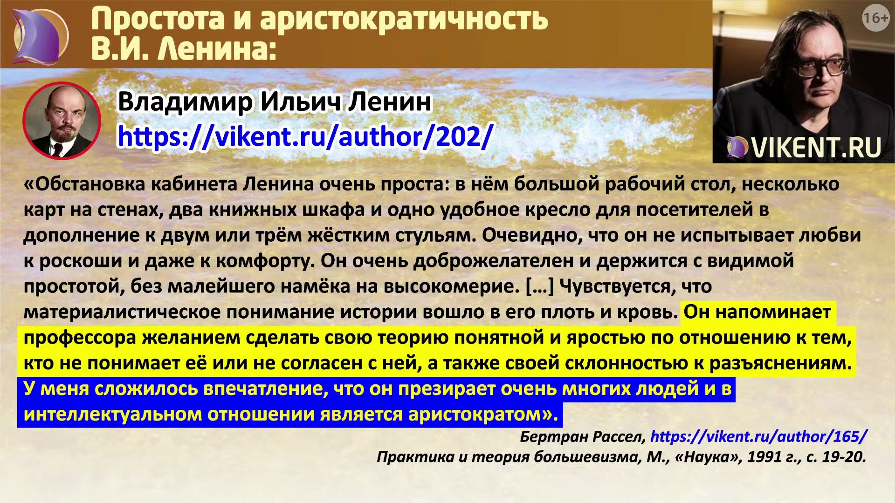

Карн Хони. Вот по поводу невротиков и славы. На мой взгляд, она писала очень хорошо. Точнее, после неё писали безумное количество, но у неё это она первое это хорошо изложила, но не стали уже как бы затемнять слайды и так далее. Вот. Вот обратите внимание на обустереализации. Как бы умнейший Бертран Расов, соответственно, скажем, смотрит на Владимира Ильвича Ленина, соответственно. И вот Владимир Ильевич Ленин об этом остались воспоминания, что в таком общении как бы не на митинге, что он был прост. Он был прост, как бы ему это было не нужно. Его обувь реализации в другом. Невротиков, который описывает Каранхорни, ну а человек невротик и пытается добывать славу. Вот. И к этому, значит, пиар-клоуны способствует количество просмотров надо увеличивать, чтобы было больше славы. Ну, если у невротика много денег, то как бы и и срослось. Срослось, но но это бесполезно. Это бесполезно. Вот обратите внимание, как бы очень тяжёлая вещь. Мы об этом давно говорили. Соответственно, Владимир Ильич, значит, как бы и многие другие очень мощные люди, то есть мы можем поразному относиться к Владимию Илич, но это мощнейшая фигура XX века. И другие, они как бы не смогли из числа своих последователей, своих учеников подготовить себе смену. То есть м не осталость. Не осталось, как бы. И перед смертью Василий Владимир Ильевич Ленин стал дёргаться и стал приглашать там, рекомендовал в ЦК пригласить 50 рабочих. Ну 50 рабочи - это не разработчики, ну это некие волонтёры. Это волонтёры. Вот вот масса великих людей, даже двух-трёх учеников, которые продолжить его дело смогли бы, не не осилили, не осили. Это к вопросу о миссии, об глобальном продвижении без всякой мистики и так далее. Масса гениев, у которых не было двух-трёх учеников, которые продолжили бы дело. Кого это интересует, ну, запрашивайте. Это у нас висит на Ютубе. Это как бы несколько было лекции о завещаниях, о завещаниях великих людей. Ну и мы идём дальше. Очень чётко, очень чётко Иван Антонович Ефремов, значит, он постоянно кружился. И Иван Антонович Ефремов делал делал работу за ЦКПСС.

---

## [01:27:45]

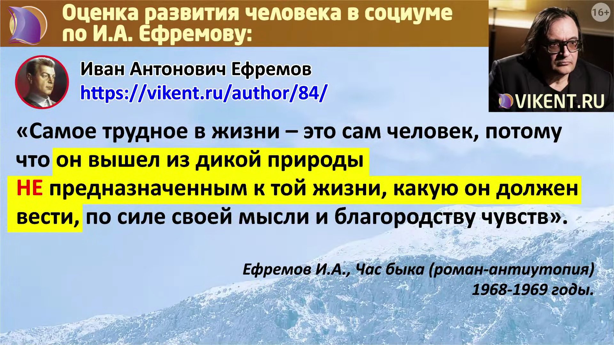

То есть он пытался прикинуть путь от инстинктов через человека обывателя и к человеку будущего. И, соответственно, скажем, он упоикал, упоикал, соответственно, работу, то, что делают в Советском Союзе, в том, что они фактически в книжках, в идеологии они пытаются рисовать молодёжи жизнь успешного обывателя. То есть как бы вот ты работай и тебя заплатят зарплату. Соответственно, как бы нужно развивать социум, нужно делать прорывы. Ой, Ивана Антоновича, как бы. И, соответственно, он делал работу ЗСК, соответственно, и был как колпаком под КГБ, которая после смерти Ивана Антоновича, соответственно, разорила его архив, его картотеку. До сих пор полностью это не восстановлено. К сожалению, к сожалению. Давайте посмотрим Стёп. Давайте посмотрим Стёп. Стёп для невротиков. Поэтому Владимира Вишневского я, к сожалению, не знаю годы. Кто знает, укажите.

---

## [01:29:00]

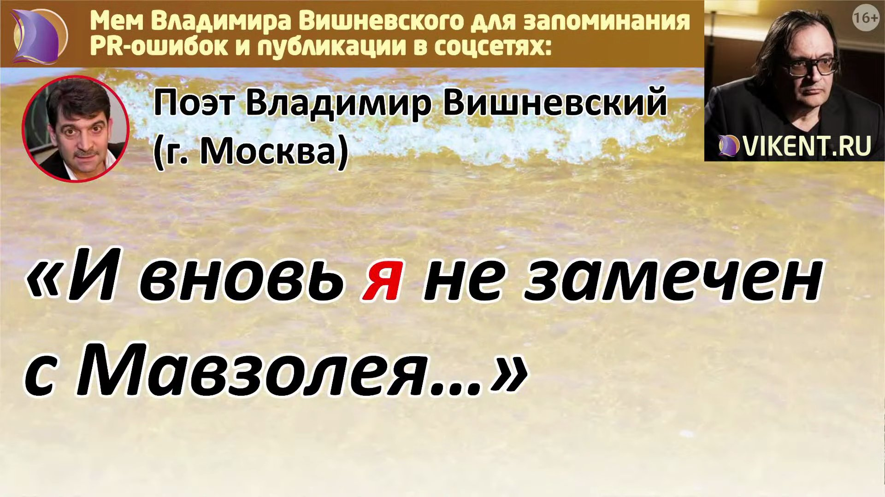

Ну очень такое одностие, очень хорошее. Ну это это стёп для невротиков. Очень хороший стёп. Мне мне очень нравится, по крайней мере. Давайте так, как бы, соответственно, так далее. Вот стёп, чтобы вы было бы не очень больно. Давайте дальше смотрим, да. Соответственно, типовые ошибки позиционирования сложного продукта. Значит, пункт один как бы по аналогии, по аналогии с рекламами каких-то очень простых продуктов по аналогии с с модой, соответственно, это некая страсть к простым решениям.

---

## [01:29:30]

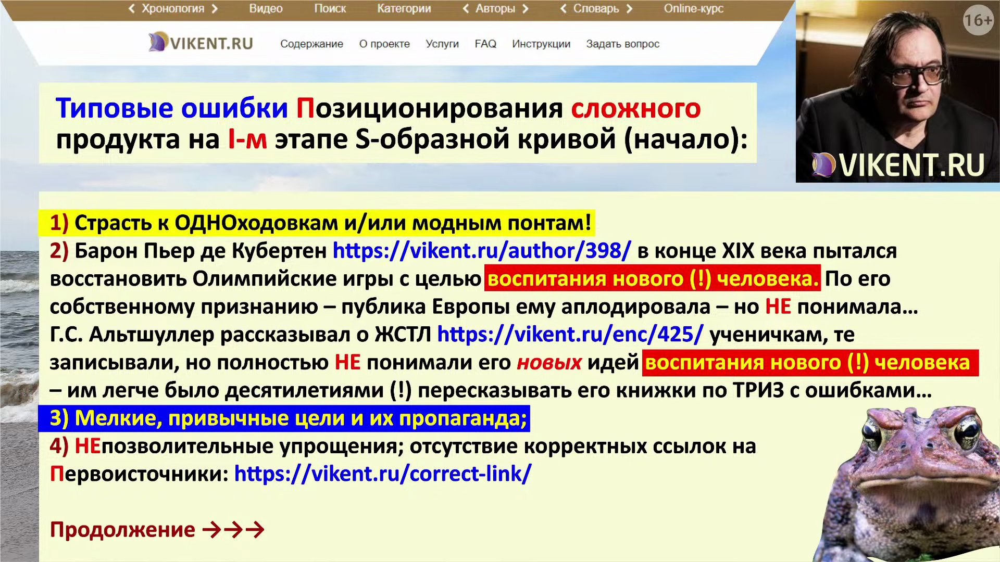

В науке разработке методиков об это просто просто-напросто можно, ну, просто-напросто можно забыть. Вот и так далее, и так далее, и так далее. Вот. Соответственно, я об этом уже один раз рассказывал, расскажу, расскажу и сейчас. Соответственно, под Питерем есть такой посёлок Лосево. Можете посмотреть его. Это по дороге на Приозерск желедорожная станция. Рядышком железнодорожная станция там метров 100 протека. То ли протекает, то ли вытекает, я забыл. Значит, как бы речка в озеро и есть небольшие Лосевские пороги. То есть там камни и там так немножко бурлит эта овечка и так далее. Вот. И вот, соответственно, некая некие люди сделали сплав через эти пороги на надувных женщинах, ну, которые можно купить в сексшопе. Вот. И, соответственно, как бы они сделали несколько раз. Соответственно, потом они обратились ко мне, потому что об этом сплаве было рассказано, рассказали федеральные телеканалы. было получено 400 бесплатных выходов, то есть и там и в газетах, и в журналах, и федеральные телеканалы. моя знакомая, которая со училась на том же факультете льва я показывал на было стоить на факультете на своём Мерседесе, какой-то у него гигантский Mercedes, ехала мимо Лосева, не могла проехать, потому что народу было столько, наблюдавший это сплав, это было дело воскресенье, что она не могла проехать. Правда, Mercedes у неё большой, да? Вот она мне жаловалась, да. Так вот, потом они пришли ко мне, вот как бы и, соответственно, был очень простой вопрос. Вот безумное количество размещения, а какова конвертация там в деньги или в прочие блага? А никакой конвертации нет. Мусо Они собрали мусорную аудиторию, которая там запрудила и железную дорогу, и запрудила шоссе. Всё. Всё. Дальше посмотрите Пердебертен. Ма, это очень мало известно. Очень малоизвестно. Далее пример, который я несколько раз приводил. 88 ходов жизненно стратегии творческой личности. К сожалению, почти впустую. Почти впустую. Третье. Мелкие цели люди понимают, вот даже им следуют. Ну, как бы через несколько десятилетий, когда человек начинает понимать, что продеградировал, обратиться уже некому. То есть обратиться можно ко мне, но я не понимаю. Просто я таких людей не понимаю. Помогу, помочь могу, наверное, но не понимаю. Вот, соответственно, скажем далее. Непозволительные упрощения. Непозволительные Непозволительные упрощения. Вот. завалительные упрощения и так далее, и так далее. Вот я уже об этом сегодня говорю, что главное не понять, главное назвать. Ну, например, классический случай он вошёл массу учебников по русской живописи, когда была выставка одной картине в Русском музее. Сейчас она, кстати, по-моему, продолжает вот не продолжается, а просто, по-моему, она сейчас идёт ещё сейчас снова есть выставка Левитана. Это как бы, господи, вот ночь над Днепром называется. Вы понимаете, о чём я говорю? Когда есть сияющая луна и, соответственно, показывалась в затемнённом затемнённой комнате и так далее, и так далее. Вот. Но луна вышла очень очень яркой. И, соответственно, люди считали, что, соответственно, скажем, было два объяснения, почему так сияет Луна. Ну, пункт номер один, он установил лампочку. Некоторые пытались, электричество уже было известно, посмотреть. Нет, лампочки не было. Вот второй момент. Люди очень просто объясняли, почему такая сияющая луна. Потому что он использовал лунные краски. Господи, Нелевитан Куинджи, извините, не Левитан Куинджи, но Днепром. Вот. Объяснение, потому что лунные краски, то есть лунные краски ничего не объясняют, но масса людей успокаивают. А, ну это лунные краски. Ну на самом деле, если быть более точным, Куин же использовал битумные краски. Смотрите опять-таки в сети, что это такое. Ну а мы идём, а мы идём дальше. Давайте следующий пример. Соответственно, мне многократно могу сказать, это такое несильное удовольствие. несильно удовольствием приходилось испытывать на себя общий наркоз. И, соответственно, меня ни разу не предупреждали, расскажу не медикам. У нас есть медики в чате, сейчас должны быть, по крайней мере, по крайней мере, обещали, скажем, быть в чате. Соответственно, итак вы просыпаетесь и видите рядом как бы люди иногда в странных позах, они не шевелятся. И у вас первая мысль, что как бы вы в морге, то есть вот сейчас вас ещё и закопают. На самом деле просто выходит общий наркос. Вы что-то типа реанимации. Хорошо, если к вам подойдут. Соответственно, в Германии, в Германии в клиниках есть специальный человек, имеющий медицинское образование, которое проговаривает всю цепочку действий клиента. Цепочка действия клиента. Мой термин, моя методика, которая просто предупреждаю, что вы проснётесь. Это не морг. Это, скорее всего, реанимация. К вам подойдут, вам, может быть, дадут попить, а может быть, не дадут попить. Ну и так далее, и так далее, и так далее, и так далее. Вот как бы, да. Так вот, просто-напросто как бы нужно предупреждать, вот нужно проговаривать, нужно объяснять, как это делать. Соответственно, вот кидание необеспеченных понтов, глупая вера в бюджет и власти или телевизор, тоже самое. Обратите внимание на нобелевский результат Даниэля Канимана. На мой взгляд, я бы каниману как бы как бы м Нобелевской премии не дал, поскольку как бы на мой взгляд это в общем вторичные вещи. То есть польские психологи это делали ранее Даниэла и Канимана, но не я распоряжаюсь на близкой премией, но тем не менее Каниман говорил, что большинство людей, немножко вольный будет сейчас перевод, пребывают в состоянии системы один такому полусонным и не врубающимся. Для того, чтобы люди стали вообще врубаться, их надо как-то пробудить. Как-то пробудить. Вот. Ну, соответственно, я проводил массу примеров симпатичными зверюшками и говорил, что это глубоко закрыто и нужны какие-то воздействия, чтобы люди проснулись, проснулись и стали бы просто врубаться в то, что вы им говорите. Давайте посмотрим сюжет готового видео. Давайте сюжет готового видео. Итак, Лаура Ферми, жена, жена, умная жена Нобелевского лауреареата Энрика Фирми.

---

## [01:37:15]

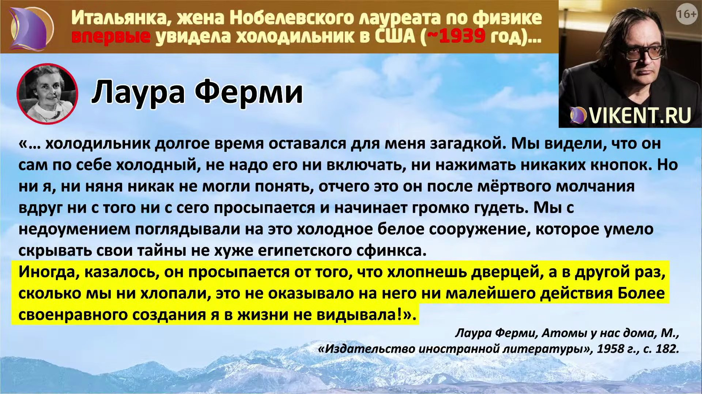

Итак, они как бы они планово из фашистской Италии получили Нобелевскую премию и как бы на деньги, вырученные с Нобелевской премии, толково вложили, переехали в США. В США, в США. И там тридцать девятый годик примерно и тридцать восьмой. В тридцать восьмом получили премию. получил, точнее, Энерика Фирми премию. И Лаура Ферми у себя умная женщина, вот как бы принимал у себя в нобелевских лауреатах, лауреатов, ну и так далее, и так далее. Вот. Вот они вместе, соответственно, как же мы с помощницей, помощницей они познавали холодильник. Вот познавали. Вот посмотрите, пожалуйста, как умная женщина. Но тридцать девятый год, как они врубаются в холодильник. Вот инструкции у них почему-то нет. Инструкции нет, как они врубаются в холодильник. То есть готовое видео. Готовое видео для пиарщиков. Готовое видео. Готовое видео. Давайте посмотрим хорошую хорошую иллюстрацию, которой нет в книжке Канемана. Нет в книжке Канемана.

---

## [01:38:30]

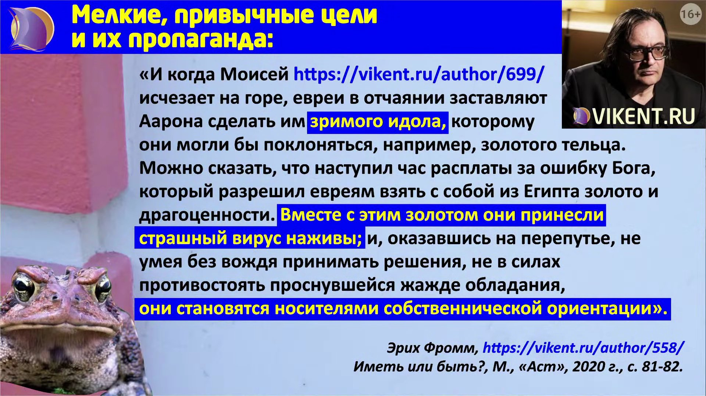

Вот обратите внимание. Ну, это такая очень хорошая. Соответственно, Моисей чем-то чем-то чем-то занимается духовным. Точнее, так. Моисей получает нечто духовное, соответственно, скажем. А простеские евреи им нужно что-то, что-нибудь Игорявич попроще, что-то попроще. Им нужно взрымый идол. Вот им нужно некоторые зримый идол, как бы такой и так далее, и так далее, и так далее, и так далее. Вот как бы, да. Вот обратите внимание, что им важно успокоиться, а не что-то решить. Вот обратите внимание на ещё более древнее высказывание. Соответственно, Аристотель в топике. Топика - это одна из книг Аристотеля, который говорил о том, что не надо спорить с первым встречным. Ещё более ранний Сократ как раз пытался в Афинах спорить, ну, с первым встречем. Ну, кто соглашался говорить, ну, Аристотель, ну, понимал, что это, ну, это непродуктивно. Это непродуктивно. Вот, соответственно, скажем, а вот, соответственно, допустим, Хрущёву, Хрущёв как бы пытался написать программу партии и сделал три ходы. Я об этом рассказывал, об этом пишет Сергей Хрущёв, то есть сын Никиты Хрущёва. Значит, сначала Никита Хрущёв обратился к учебникам марксизма, ленинизма, и там ничего не было написано, когда будет коммунизм. Тогда Хрущёв обратился к главному идеологу Суслову. Суслов зря получал зарплату. Он ушёл в какие-то разговоры, разговоры ни о чём. Так Хрущёв в нерабочее время, значит, соответственно, решил как бы заниматься как бы теорией коммунизма. не осилил, поручил идеологом. Те, соответственно, скажем, написали какую-то программку, прикинув, когда у них пенсия, и Хрущёв прокурекал, что у нас зримый идол, у нас коммунизм будет в 1980 году. Ну, это такой подарок для антирекламы и для светологов, ну, всего мира, всего мира. И так далее, и так далее, и так далее, и так далее, и так далее, и так далее, как далье. Соответственно, скажем, да, там масса людей, масса людей. Соответственно, одну из работ Менделеева считаю, что Менделеев там изобрёло водку. Нет, он как бы описал некоторый эффект смешания спирта и воды, который, строго говоря, проходит в школьном курсе фильма, школьном курсе химии, извините, химии, хотя там и физику можно и так далее. Вот. А Вильям Похлёпкин, у него есть целая книжка по этому поводу. Он рассказывает о том, что водку как бы придуманный Менделеев, а где-то на территории России она появилась в X веке. Ну людям проще говорить, Менделеев придумал водку. Ну ну ну вот получили взрымы идол и так далее, и так далее, и так далее. Вот давайте идёмте дальше. Да. Появление жабёна означает, что это рисковая зона. Ну мы уже потихонечку. Вот, соответственно, вот глупая вера в бюджет и силу телевизора. Опять-таки, смотрите, значит, соответственно, федеральная, значит, Первый канал, соответственно, вот есть фонд социальных изобретений, соответственно, от Комсомольской правды.

---

## [01:42:00]

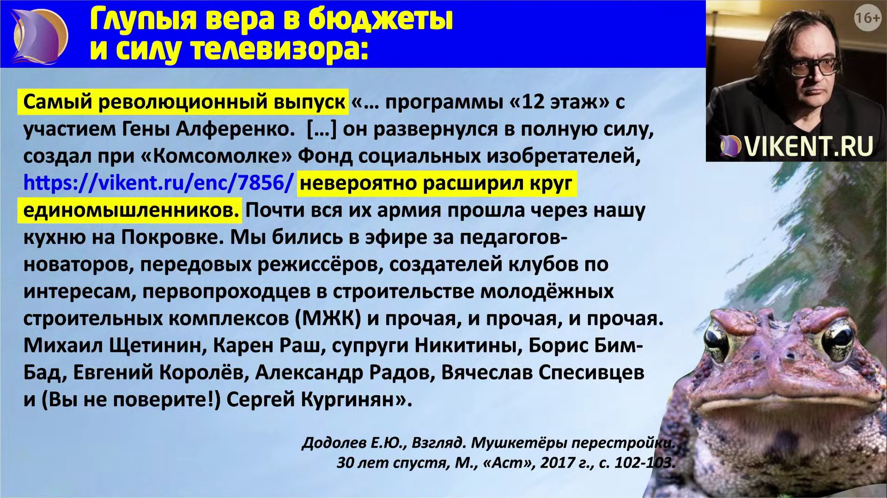

Вот, соответственно, различные люди, видеолюди, соответственно, как бы описывают популярнейшую телепрограмму, которую смотрели десятки миллионов в залпе. Дальше у меня возникает вопрос: а где фонд социальных изобретений? То есть о котором передавали по по федельным каналам. То есть мне хотелось бы знать, вот спорю на любую сумму. Мой фонд, у меня такой фонд есть, я его не публикую пока. У меня есть свой фонд сальных изобретений, и он точно больше. И он точно больше. И он точно больше. Вот. И он точно больше, да? И он точно бо больше. Вот теперь идёмте дальше. У нас скоро мы уже идём к концу. Чуть-чуть будет подлиннее сегодня. Итак, вы видите, значит, Питер. Ну, без Питера как-то тяжело обойтись. Итак, люди в черновике было типовые люди, их навыки на первом этапе сообразный кривой.

---

## [01:43:15]

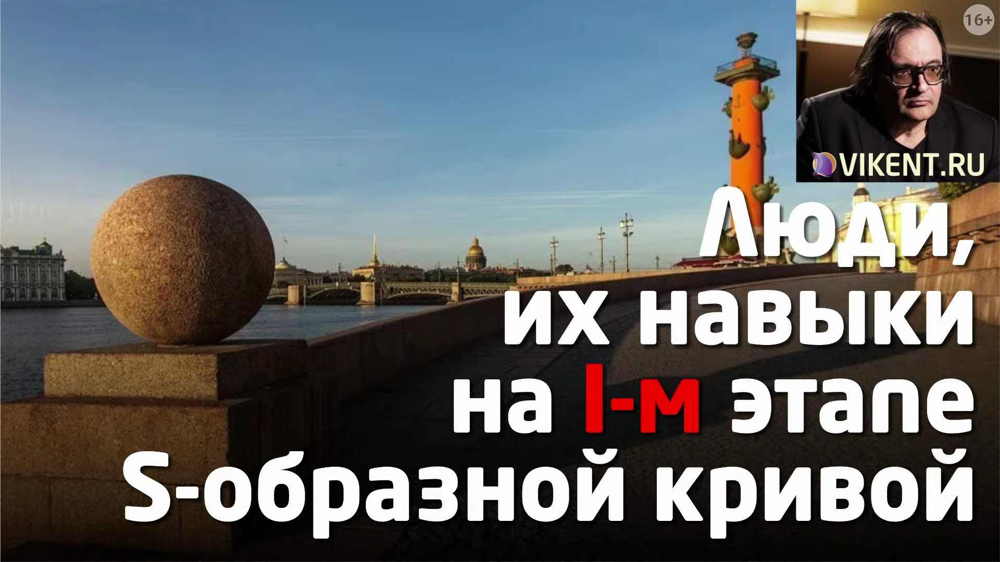

Давайте посмотрим. Да, давайте посмотрим. Так далее. Вот. Вот обратите внимание на Александра Сергеевича Пушкина. Вот первое - это такой непрофессиональный подход по движению сложных услуг.

---

## [01:43:30]

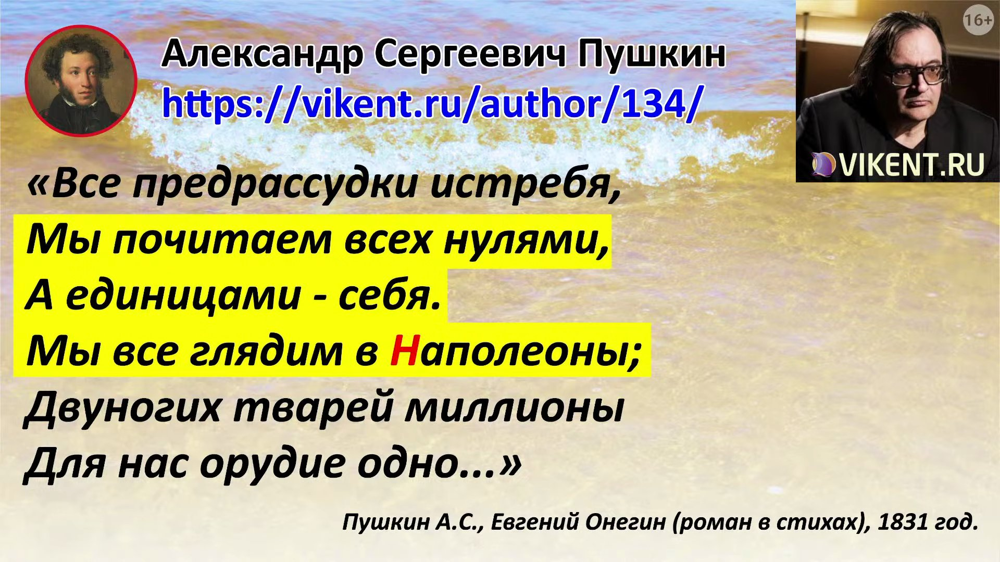

Но он очень цветёт ВКонтакте, потому что ВКонтакте, в социальных сетях там все круты. Все круты. До разрушительной встречи со мной. До разрушительной встречи со мной. Ну, умные понимают, мне нет дураков. Интересно. Идёмте дальше. Идёмте дальше. То есть, соответственно, скажем, да, вот, соответственно, пункт номер один, с чего я сегодня начал новый спецкурс, как бы, что самое важное в пиах и Игорь Леонардович. Самое важное в пиах и других интеллектуальных услугах, решениях, идеях, методиках. Первое, не свихнуться, не продеградировать. Соответственно, длительное занятие враньём. Есть большое количество людей, особенно в Москве, запятая, в Петербурге кратно меньше, которые просто-напросто свихнулись. Просто-напросто свихнулись, которые не могут не врать, то есть враньё моё второе имя, так далее, и так далее, и так далее. Вот, да. Соответственно, скажем, на первом этапе очень желательно фиксировать фиксировать типовое враньё, потому что, ну, вот если отрасль динамично развивается, какое-то похожее враньё, ну, скоро будет. Ну, скоро это означает через десятилетие, да. Соответственно, пункт третий, закладывание базы для будущих миссий. Обратите внимание, иногда есть такой термин миссии, ээ, видение и так далее. Вот как бы я не разделяю миссии и видения, хотя есть масса видео, где люди с умным видом разделяют миссия видео, редой, ну и так далее, и так далее, и так далее. Вот так вот мы о миссии ещё будем говорить. Если вы будете задавать вопросы, то, соответственно, скоро будем говорить. И, соответственно, рано или поздно появятся конкуренты. Максима, которую стоит записать, если мы успешны, то как бы в том числе одна из расплат про успех мы порождаем конкурентов. Другое дело, что они могут быть использовать те же са слова, скажем, и они могут заниматься фигнёй, как бы. Ну, слова те же самые. и вас постоянно будут путать, как бы, так далее. Вот поэтому хорошо бы сразу положить в голову, что я владелец крупнейшей в мире базы по оценке от конкурентов. Это более 600 честных способов. Честных. Если с нечестными, то намного больше, да. Соответственно, скажем, как бы чрезвычайно важно четвёртое, закладывание некоторых критериев, закладывание некоторых координат, категорий, функций, задачников. Чем закладывать, чтобы это было проверяемое тем, не, допустим, просто у нас, как уже говорю, бы было проведено 30 конференций, где приезжали коучи, бизнес-тренеры и психологи. И вот у многие из них как бы они высылали свои данные для оформления материалов, и там было пять строчек титулов. У некоторых на визитках пять строчек титулов. У меня никаких на моей визитке, прошу мне поверить, есть фамилия, имя, отчество. Мне этого достаточно. Мне этого достаточно. Да. Так вот, проверяемые критерии несовершенными клиентами. сильнейший ход, когда вы делаете честные критерии. Но тут очень важный момент, кто первый начнёт торговать честными, проверяемыми критериями. Кто первый захватит? Кто первый захватит, как бы тут и молодец. Соответственно, скажем, как бы Эвриклея, Эвриклея, нянька Одиссея распознала провозвращение Одиссея по ране на его колени. По его колени. То есть она помнила, она первая, жена вторая, жена вторая, кто это дело распознала. Ну давайте дальше. Поэтому проватизируйте не то, что чубайс как бы, а как бы кто первый провотизировал проверяемости, честность, тот молодец. Далее, вещь, которая у нас была в методиках, кто протизировал список типовых ошибок. Направления ещё нет, но по аналогии, по отслеживанию лидеров рынка и так далее, и так далее. Вот. А также подстающим можно такое делать. Соответственно, пункт шестой. Что, соответственно, как бы мы делаем и что не делаем? Ну, создание личного командного этического кодекса. личного. То есть пусть будет несколько людей, но они могут поступать, ну, как бы соответствием три человека будут поступать, соответственно, неким этическим кодексом, с этим неким этическим кодексом. И это очень долговременно, то есть на длинных дистанциях выгодно быть честным. Выгодно быть честным. Ну, соответственно, у нас сложные услуги, сложные разработки, сложные методики, ну, и так далее, и так далее, и так далее. Вот, повторяю, главная тайна пиар и другие интеллектуальные услуги, они свихнутся. Они свихнутся по ссылке, которая в нижней строчке, вы можете посмотреть ряд личных кодексов выдающихся личностей. Давайте посмотрим дальше. Дальше посмотрим. Итак, скоро бесплатная конференция. Вот, соответственно, вот которую организатор Ксения Александровна Калугина. Ксения Александровна Калугина.

---

## [01:49:30]

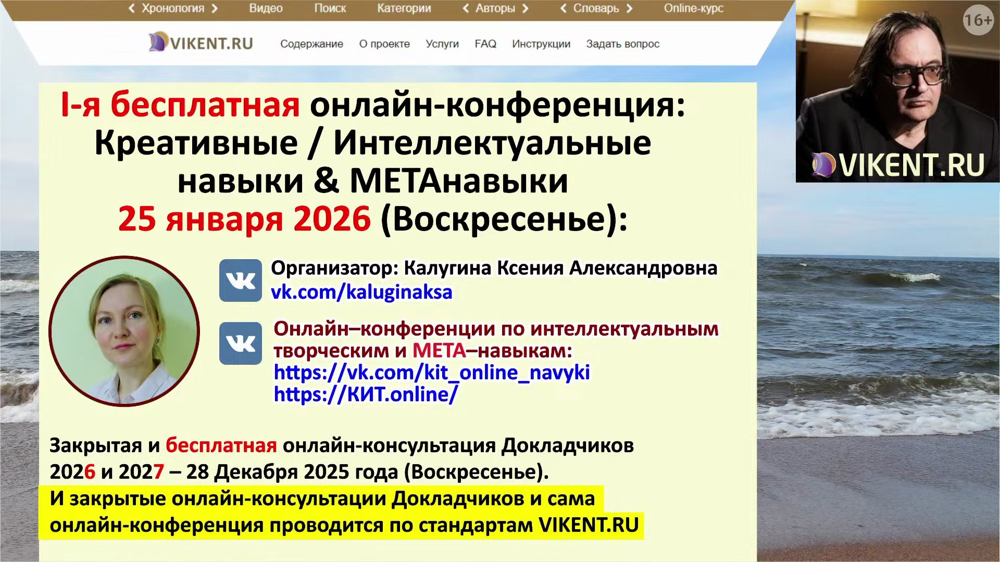

Ссылки на эту конференцию будут в описании на Ютубе и ВКонтакте. На Ютубе и ВКонтакте. То есть можно щёлкать в описании, точнее в комментариях к этому видео. Они будут можно щёлкать, можно записываться и так далее. Я послушал, значит, часть докладов и так далее. Вот. Ну вот, обратите внимание, какие закладываются вещи, какие закладываются вещи вот в эту вот конференцию. Вот, соответственно, вот в эту конференцию закладываются некоторые критерии. Например, соответственно, невозможен невозможен выход на эту конференцию, если человек не прошёл репетицию Самоновой. Почему? 100% докладов, которые я слышал, некоторые из них были отрепетированы, некоторые были не отрепетированы, что важнее. Соответственно, в неотрепетированных всегда находится, скажем, серия, не одна господнец одной, серия ошибок. То есть нельзя выпускать докладчика как бы на конференцию Ксени Александровно, не пропустив через викенд, который в доброжелательной форме. Соответственно, если удобно называть это элементом этического кодекса, называйте, называйте. По крайней мере, это совпадает по азимуту. Соответственно, давайте идёмте дальше. Итак, промежуточные выводы. То есть у нас будет, вероятно, платная и дорогоплатное и дорого платная. У нас будет, вероятно, видео закономерности пиар по викенчи. Материал нигде не публиковался. Соответственно, кто не считает нужным, делайте репосты, пожалуйста, пожалуйста, возьму деньгами в 2006 году. Деньгами возьму, да, деньги будут некопеечные, сразу скажу, деньги будут некопеечные, и пару годиков мы это не будем публиковать. Вот, соответственно, честность, русской интеллигенции оценивается мною очень просто. Вот через годик, то есть в конце 2006 года, посмотрим, сколько просмотров у этого видео и, соответственно, сколько репостов, сколько репостов сделала русскоязычная интеллигенция. Ну и, соответственно, честность русскоязычной интеллигенции 1-2%, то есть бесплатно получать нечто. Система один по каниману, Данилу Каниману, значит, и, соответственно, система 2 по каниману 1-2%, которые понимают, что им было дано бесплатно. Ну, чтобы понимали бы ещё лучше, соответственно, закономерности пиара по Викенти, это координатная сетка для пиара. Материал чиновики, естественно, написан уже. Он будет дорого дорогоплатный для нерепостящих. Для невыполняющих домашнее задание. Опыт показывает, что вот когда больно, когда больно и животным, и людям, все очень быстро через боль соображают. Очень быстро соображают. Когда бесплатно, то они даже не вырубаются, да. Соответственно, скажем, пункт номер один проговариваю. То есть, если мы хотим заниматься марке маркетингом маркетингом рекламы и пиар, я никакой разницы между маркетинго реклама и PR, честно говоря, не вижу. Если у вас грамотные модели, если просто-напросто нужно кормить массу лентяев, учреждается три кафедры маркетинга, рекламы и пиар. И там списаные из правкома преподаватели пьющие. Ну, когда мы учреждаем кафедры, нам нужно разделение маркетинга, реклама и так далее. Вот так вот некий общий принцип, он входит в закономерности, но не только он входит. Соответственно, система отчёта - это клиент. Причём надо понимать, что клиенты всегда несовершенные. Далее важно понимание, с которого я начал. Возможно, возможно, по крайнем ме прошу. Андрей Валеевич Толмачёв подает нам каллаш католическому Рождеству 25 декабря к новому году. Я начал симпатичных зверюшек сегодня. Это очень глубоко. И надеяться это перебить словами, это наивно. Ну, людям можно сделать больно через деньги. Можно больно через деньги. А они даже за свои деньги помнеют. Пумнеют. Ак ты даже за свои деньги. Ну, ну не в состоянии, не в состоянии, да. Соответственно, скажем, эти эффекты крупнее, ну, явно сильнее, чем я это проверял. При разметке это проверяется автоматически. То есть владели с крупнейшей в мире базы PR-носителей, реклама носителей 3.500. Ну, премьеры какой-то страны ученички сделали с помощью этой программы. Вот, соответственно, как бы очень надо понимать, что, соответственно, вот это разные картины мира, разные вселенные, когда мы занимаемся подвижением чего-то там модного, чего-то понятного. Вот из моего окна, повторяю, видны три ресторанчика. Три ресторанчика. Одно из них кафе, три ресторанчика видны из окна видны из моего кабинета и так далее, и так далее. Вот как бы это не очень сложно. Это не очень сложно, когда мы начинаем заниматься чем-то более сложным, чего я сегодня многократно говорю, соответственно, скажем, у нас возникает взгляд из костыю и так далее. Вот получается нехорошо. То есть у меня каждый день рождения контакт автоматический это генерит. Всегда находится какой-то идиот. Всегда это мужчина, которого на моё день рождения мне ВКонтакте желает. Почему хорошо, если личное письмо, а не публично, что Игорьч желаю тебе баб, водки и денег. Ну ты вообще идиот. Посмотри, что у меня вообще на странице делается и сколько мне годиков. Мне точно не до баб, не до водки и точно не до денег. То есть, ну я таких мужчинок просто выкашиваю к чёртовой матери, потому что они такой двойной, тройной идиот и прочее, прочее, прочее, прочее, прочее. Соответственно, как бы типовая женская ошибка, типовая женская ошибка в коммуникации. Соответственно, девушки и женщины часто путают некоторые вещи. Значит, я скажу обосновывать не буду, об основаниях закономерностях, которые за очень неслабые деньги будут. Значит, первая ошибка в коммуникации женщин и девушек и девочек. Я женщина. Вторая коммуникация. Я женщина, я там, мне там сейчас плохо, там что-то в этом роде и так далее. Вот, значит, в коммуникации, если мы говорим о профессиональной коммуникации сложных услуг, как бы модель другая. Я женщина, которая меняет клиентов. Как это делается? Зачем это делается? Почему первые две модели глупые, но как бы хотя детки миллионов женщин ими пользуются, соответственно, ну там, где была оговорено в 2006 году. Давайте, давайте, давайте дальше. Соответственно, скажем, вот вот, ну, пункт шестой такой, такая пункт шестой, седьмой. Соответственно, скажем, это способ, извигая себе жизнь. Жизнь. Вот человек вправе это делать, но моё дело предупредить спокойно. Это способ сгаять себе жизнь. Пункт восемь. Разговор впереди, что на разных этапах сообразный кривой немножко будет по-разному. То есть, если мы продаём простые продукты, вот, соответственно, мы продаём, опять-таки, какие-то пищевые продукты, там пирожки, то продажи пирожков, когда там мы там у нас два производителя или шесть производителей, ну, примерно одно и то же. Примерно одно и то же. Но когда у нас услуги сложные, услуги сложные, навороченные, соответственно, они очень сильно зависят от как бы от этапов. от этапов очень сильно зависит, как бы, да, вот и как бы вот как раз одна из жизненных ошибок - это путать этапы, путать этапы и так далее, и так далее, и так далее. Вот, соответственно, кто там не был или кто-то не знает, что такая сообразная, кривая, вот для вас дано ссылка на ВК видео, там пять последних лекций. Вот. И желательно посмотреть и законспектировать. просто прощёлкать их бесполезно, не освоите, ну и попадёте в систему один Нобелевского лауреата канимана. Вот, соответственно, скажем, ну, пункт девять. Ещё и ещё раз как бы вот, ну, нужно понимать, что некоторые люди, ну, просто не в состоянии, ну, просто, ну, ну, совсем, ну, они совсем плохие. И мы их 2006 год пожелание. Давайте не брать, давайте не брать, как бы, ну, их такими мама родила, папа испортил, ну, и Господь с ними. Мы уже заканчиваем. Давайте, давайте следующий слайд. Соответственно, таблицы методик по Викенте. Это одно видео последнее. По этому видео новорочному я пересмотрел очень хорошее видео для умных. Для умных. Соответственно, будет подарок.

---

## [01:59:15]

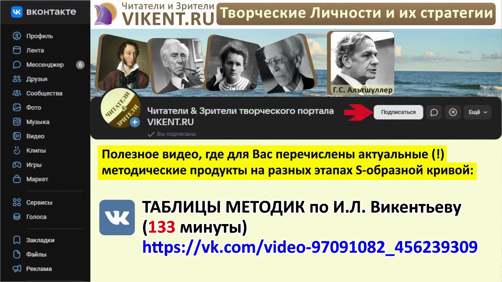

Подарок уже готов. не беспокойтесь, уже выложен на сайте. Большое спасибо Василию Александровичу Верщенко. Соответственно, можно будет скачать и изучать в новогодние дни. Вот, соответственно, главная сложность при просмотре и плаката, и видео - это честность. Напоминаю, честность русскоязычной интеллигенции, ну, и экспериментально проверено 1-2%. То есть люди, соответственно, окажем, значит, ну, есть известная песня Наутилуса Помпил Пампил Наутис Пампилиус, соответственно, как бы люди с пыщай совестью. Ну вот русская интеллигенция, честность, бесплатно получить и непостить и считать себя умным. Ну, честности, русскоязычной интеллигенции и так далее. Давайте посмотрим одного из самых известных учёных. Давайте такой вдохновляющий пример. Вот вы видите Стивена Хокинга, соответственно, вот он болеет. Один из самых известных учёных после Эйнштейна. Более известен Эйнштейн, можете проверить по запросам.

---

## [02:00:30]

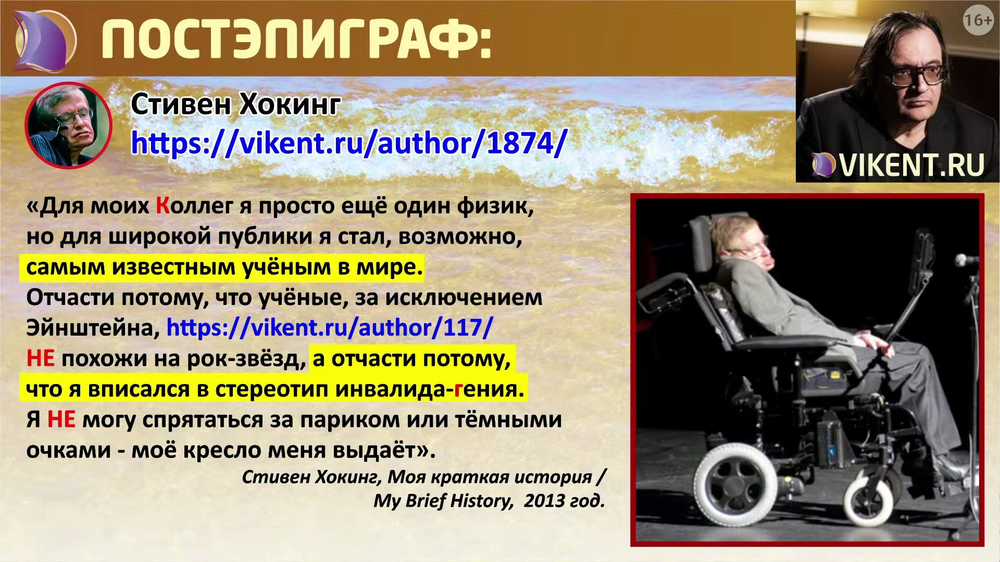

Как бы одно время он шевелил пальцем, потом сжем палец вырубился, он стал шевелить, соответственно, скажем, как бы губами, уголком та, ну и так далее. Вот. Вот, тем не менее, обратите внимание, соответственно, окажем, он высказывал ряд научных идей, научных гипотез. И вот в таком состоянии, находясь второй после Эйнштейна по известности, по пиару человек. Второй, второй человек, да. На этом, соответственно, напоминаю вам, что хорошо бы задать бы вопросы не позже вторника, лучше прямо сейчас. Лучше прямо сейчас, соответственно, этот прямо сейчас на на портале на портале задать вопросы на последнюю рождественную консультацию. Там ещё четыре места есть. Четыре места есть. Лучше сегодня, хуже завтра. Ну, до вторника понимаются, но лучше сегодня. Повторяю, соответственно, кто-то что-то не понял, домашнее задание, ну, пожалуйста, можно писать в Ютубе. можно писать ВКонтакте. Большинство пишет ВКонтакте вопросы по этой лекции. Повторяю, это спецкурс. Он не самый простой, то есть как бы и он не для оптимизаторов, которые берут деньги, значит, соответственно, и потом проваливают свои компании и пытаются отчитываться количеством просмотров мусорной аудитории. Мусорной аудитории. Мы ни разу не про мусорную аудиторию. Ну давайте ещё разк. Соответственно, благодарность людям, которые меня, слава богу, не подводит. Слава богу, не подводит. Спецпроба Андрею Валерьевичу не сейчас, а под Новый год сделать с животными отдельный коллаж, ну и с видео под Новый годик и так далее, и так далее. Большое спасибо.

---

## [02:02:30]

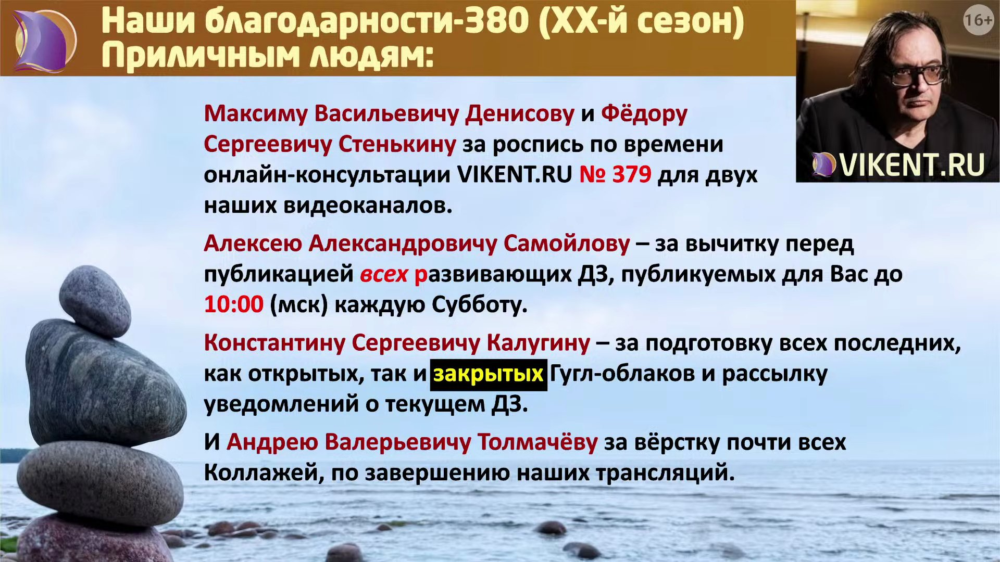

Идёмте дальше. Соответственно, скажем, вот в списку с там же, там же пять лекций, научно-методические системы. Мой совет просматривать вот в новогодние дни.

---

## [02:02:45]

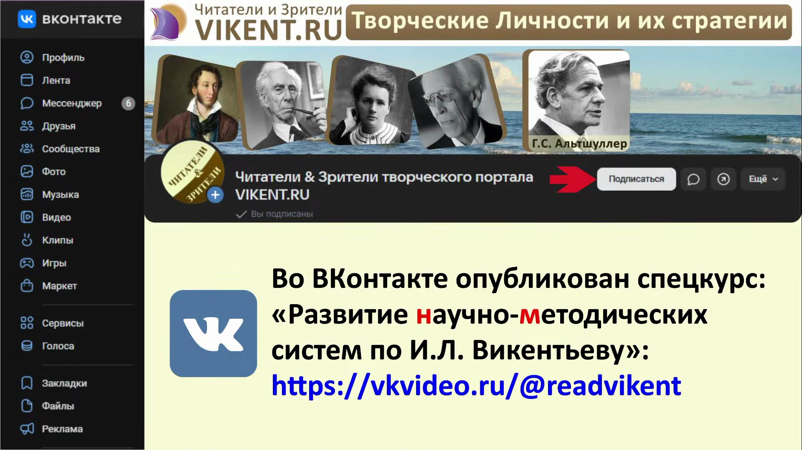

Хотите завтра, хотите завтра. Третий момент. Давайте последний слайд. Чуть-чуть передержался. Кто понимает уровень, на котором мы работаем, и какие возможности мы открываем для умных и волевых людей? Ну, милости просим, вы можете нам помочь финансово. Там два счёта.

---

## [02:03:00]

Можно, можно рублями, можно, соответственно, Яндекс деньгами, пожалуйста. Соответственно, давайте дальше. И, соответственно, даже если оплатили что-то нам по указанным счетам, как бы, соответственно, везде имя, отчество, фамилия, даже если вы платили нам деньги. Вот кого интересует, почему так, несколько сотен раз я уже это объяснял, соответственно, ну, обсуждать, ну, не буду. Хотите, спросите на двадцать первое. Большое спасибо, Ливызон, за трансляцию и за слайды. Были ли сбои в трансляции? Сбое в трансляции не было. Соответственно, сейчас будет на ВК, а завтра днём, соответственно, будет и на Ютубе. Значит, соответственно, мой первый комментарий, где будут ссылки, полезные ссылки на тексты и полезные ссылки на видео этой лекции. Всего вам доброго. Мы ещё это разрежем на котыши. Лекция непростая, нормальная, когда профессура пересматривает мои лекции там два-три раза. Думающая профессора. Думающ по

---